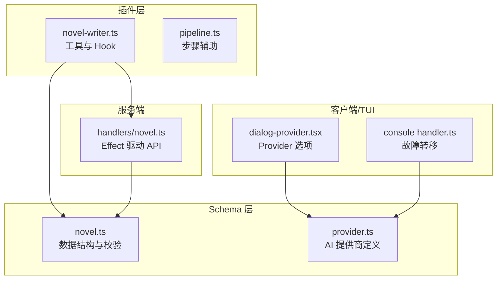
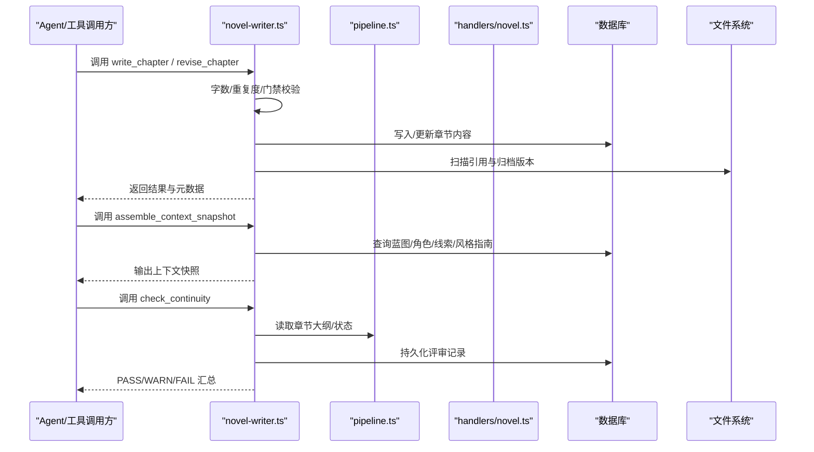
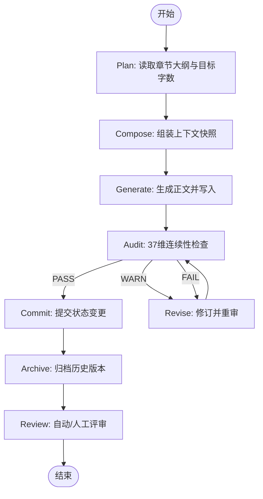
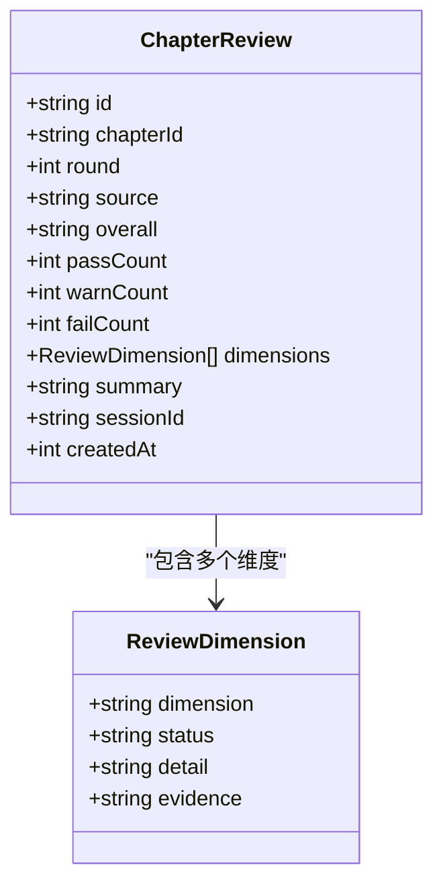
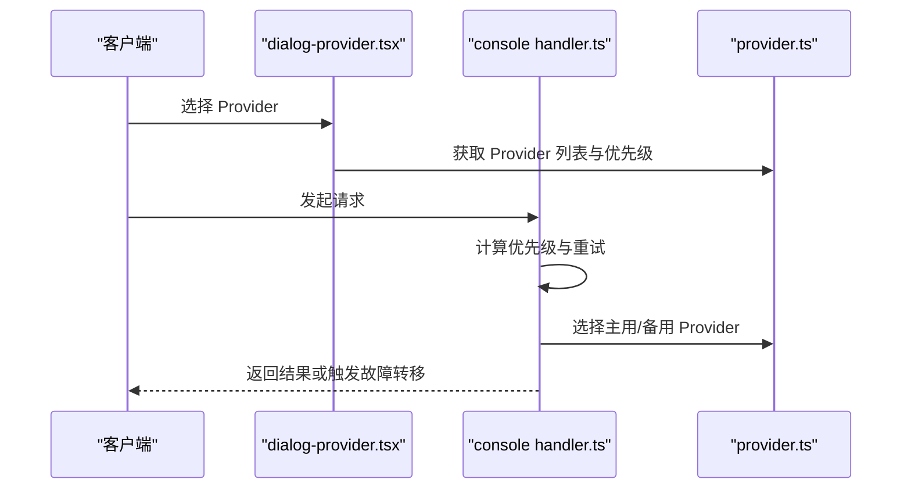
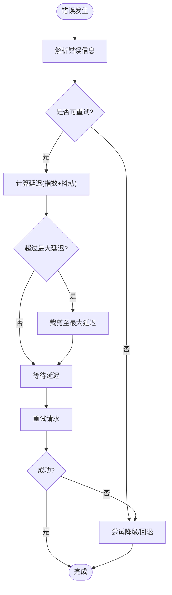
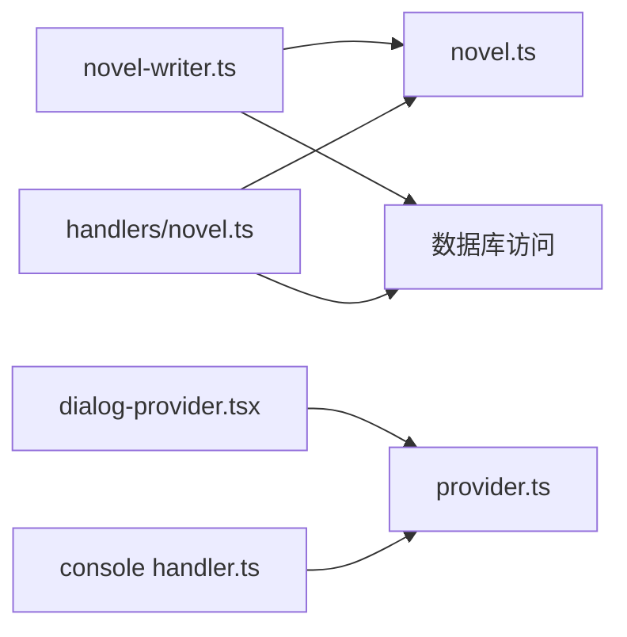

# 核心业务逻辑

<cite>
**本文引用的文件**   
- [novel-writer.ts](file://packages/plugin/src/novel-writer.ts)
- [pipeline.ts](file://packages/plugin/src/novel-writer/pipeline.ts)
- [novel.ts（Schema）](file://packages/schema/src/novel.ts)
- [handlers/novel.ts](file://packages/server/src/handlers/novel.ts)
- [provider.ts（Provider 定义）](file://packages/schema/src/provider.ts)
- [dialog-provider.tsx](file://packages/tui/src/component/dialog-provider.tsx)
- [handler.ts（控制台故障转移）](file://packages/console/app/src/routes/zen/util/handler.ts)
- [effect-http-client.ts（HTTP 重试）](file://packages/opencode/src/util/effect-http-client.ts)
- [retry.test.ts（会话重试策略测试）](file://packages/opencode/test/session/retry.test.ts)
- [cascade-consistency-design.md（级联一致性设计）](file://docs/cascade-consistency-design.md)
</cite>

## 目录
1. [简介](#简介)
2. [项目结构](#项目结构)
3. [核心组件](#核心组件)
4. [架构总览](#架构总览)
5. [详细组件分析](#详细组件分析)
6. [依赖关系分析](#依赖关系分析)
7. [性能考量](#性能考量)
8. [故障排查指南](#故障排查指南)
9. [结论](#结论)
10. [附录](#附录)

## 简介
本文件面向“小说创作”核心业务模块，系统性阐述 Effect Framework 的函数式编程模式在业务中的落地方式，并围绕以下目标展开：
- 函数式编排与副作用隔离：以 Effect 组合数据流、错误处理与资源管理。
- 8 步写作流水线：从计划到归档的全链路实现细节与扩展点。
- 连续性审查系统：37 维度检查规则与评估算法。
- AI 集成统一接口：多提供商适配、优先级与故障转移机制。
- 错误处理、重试与降级：可观测、可恢复、可回滚。
- 扩展与自定义：如何新增维度、工具与规则。

## 项目结构
该模块由插件层（novel-writer）、Schema 定义、服务端处理器与 TUI/控制台等共同组成。关键路径如下：
- 插件层：注册系统提示注入、会话压缩、写作工具（写章、修订、角色管理、大纲生成、上下文组装、连续性检查等）。
- Schema 层：统一的类型与校验模型，贯穿 API、存储与 UI。
- 服务端处理器：基于 Effect 的 HTTP API 实现，封装数据库操作与领域逻辑。
- TUI/控制台：提供 Provider 选择、优先级与故障转移策略。

图表来源
- [novel-writer.ts:1-120](file://packages/plugin/src/novel-writer.ts#L1-L120)
- [pipeline.ts:1-131](file://packages/plugin/src/novel-writer/pipeline.ts#L1-L131)
- [novel.ts（Schema）:1-120](file://packages/schema/src/novel.ts#L1-L120)
- [handlers/novel.ts:1-120](file://packages/server/src/handlers/novel.ts#L1-L120)
- [provider.ts:1-39](file://packages/schema/src/provider.ts#L1-L39)
- [dialog-provider.tsx:47-92](file://packages/tui/src/component/dialog-provider.tsx#L47-L92)
- [handler.ts:589-600](file://packages/console/app/src/routes/zen/util/handler.ts#L589-L600)

章节来源
- [novel-writer.ts:1-200](file://packages/plugin/src/novel-writer.ts#L1-L200)
- [pipeline.ts:1-131](file://packages/plugin/src/novel-writer/pipeline.ts#L1-L131)
- [novel.ts（Schema）:1-200](file://packages/schema/src/novel.ts#L1-L200)
- [handlers/novel.ts:1-200](file://packages/server/src/handlers/novel.ts#L1-L200)

## 核心组件
- 写作工具集：write_chapter、revise_chapter、manage_characters、generate_*_outline、read_outline、assemble_context_snapshot、check_continuity 等，均通过 Effect 驱动的函数式流程组织。
- 流水线辅助：validateNovel、readChapterOutline、validateStateDelta、persistStateDelta，用于步骤间的数据验证与状态提交。
- 数据模型：Novel、Chapter、Volume、Character、PlotThread、Foreshadowing、StyleGuide、ReviewDimension、ChapterReview 等，全部使用 Effect Schema 进行强类型约束。
- 服务端 API：list/create/update/delete 等端点，均以 Effect.gen 编排，保证错误传播与资源安全。

章节来源
- [novel-writer.ts:240-800](file://packages/plugin/src/novel-writer.ts#L240-L800)
- [pipeline.ts:1-131](file://packages/plugin/src/novel-writer/pipeline.ts#L1-L131)
- [novel.ts（Schema）:1-250](file://packages/schema/src/novel.ts#L1-L250)
- [handlers/novel.ts:340-520](file://packages/server/src/handlers/novel.ts#L340-L520)

## 架构总览
整体采用“插件 + Schema + 服务端处理器”的分层架构，Effect 作为统一的运行时与错误处理框架，贯穿工具调用、API 与外部依赖（如文件系统、HTTP 客户端）。

图表来源
- [novel-writer.ts:240-800](file://packages/plugin/src/novel-writer.ts#L240-L800)
- [pipeline.ts:1-131](file://packages/plugin/src/novel-writer/pipeline.ts#L1-L131)
- [handlers/novel.ts:340-520](file://packages/server/src/handlers/novel.ts#L340-L520)

## 详细组件分析

### 函数式编程模式与 Effect 应用
- 错误与资源管理：所有 I/O 与数据库操作通过 Effect.sync/Effect.promise 包装，失败以 Effect.fail 抛出，统一由上层捕获。
- 组合与编排：Effect.gen 中顺序执行、条件分支与并行聚合清晰表达业务流程。
- 可测试性：每个端点与工具均可独立运行与断言，便于单元测试与集成测试。

章节来源
- [handlers/novel.ts:340-520](file://packages/server/src/handlers/novel.ts#L340-L520)
- [novel-writer.ts:240-800](file://packages/plugin/src/novel-writer.ts#L240-L800)

### 8 步写作流水线（Plan → Compose → Generate → Audit → Revise → Commit → Archive → Review）
- Plan（计划）：读取章节大纲与目标字数，确定本章写作范围与约束。
- Compose（组装）：组装上下文快照（蓝图、活跃角色、最近摘要、线索、伏笔、风格指南、钩子统计）。
- Generate（生成）：由 writer agent 生成正文，调用 write_chapter 落库。
- Audit（审计）：check_continuity 执行 37 维确定性检查，产出 PASS/WARN/FAIL。
- Revise（修订）：若审计失败，reviser agent 调用 revise_chapter 修订并重审。
- Commit（提交）：validateStateDelta 验证后 persistStateDelta 提交状态变更。
- Archive（归档）：对历史版本进行归档，保留变更轨迹。
- Review（评审）：自动或人工评审，形成 ChapterReview 记录。

图表来源
- [novel-writer.ts:240-800](file://packages/plugin/src/novel-writer.ts#L240-L800)
- [pipeline.ts:1-131](file://packages/plugin/src/novel-writer/pipeline.ts#L1-L131)

章节来源
- [novel-writer.ts:240-800](file://packages/plugin/src/novel-writer.ts#L240-L800)
- [pipeline.ts:1-131](file://packages/plugin/src/novel-writer/pipeline.ts#L1-L131)

### 连续性审查系统（37 维度检查与评估算法）
- 维度覆盖：角色/关系/时间线/地点/剧情/世界观/风格/逻辑/细节等，按类别划分 37 项。
- 评估算法：逐项判定 PASS/WARN/FAIL，汇总为 overall；证据与详情结构化存储。
- 评审记录：检查结果持久化为 ChapterReview（source=deterministic），支持后续人工复核。

图表来源
- [novel.ts（Schema）:99-121](file://packages/schema/src/novel.ts#L99-L121)

章节来源
- [novel-writer.ts:763-800](file://packages/plugin/src/novel-writer.ts#L763-L800)
- [novel.ts（Schema）:99-121](file://packages/schema/src/novel.ts#L99-L121)

### AI 集成统一接口与多提供商适配
- Provider 定义：统一 ID、类型与设置，支持 OpenAI、Anthropic、Google、Azure、OpenRouter 等。
- TUI 选项：根据优先级与分类展示 Provider，支持自定义 Provider。
- 控制台故障转移：优先试用 Provider，达到最大重试次数后切换到 fallbackProvider。

图表来源
- [provider.ts:1-39](file://packages/schema/src/provider.ts#L1-L39)
- [dialog-provider.tsx:47-92](file://packages/tui/src/component/dialog-provider.tsx#L47-L92)
- [handler.ts:589-600](file://packages/console/app/src/routes/zen/util/handler.ts#L589-L600)

章节来源
- [provider.ts:1-39](file://packages/schema/src/provider.ts#L1-L39)
- [dialog-provider.tsx:47-92](file://packages/tui/src/component/dialog-provider.tsx#L47-L92)
- [handler.ts:589-600](file://packages/console/app/src/routes/zen/util/handler.ts#L589-L600)

### 错误处理、重试与降级
- 会话重试策略：基于 retry-after-ms、retry-after、HTTP 日期与指数退避，上限保护与异常映射。
- HTTP 客户端重试：Transient 错误自动重试，带抖动与次数限制。
- 降级方案：当主 Provider 不可用时，切换至备用 Provider；超过最大重试次数则强制回退。

图表来源
- [retry.test.ts:31-268](file://packages/opencode/test/session/retry.test.ts#L31-L268)
- [effect-http-client.ts:1-11](file://packages/opencode/src/util/effect-http-client.ts#L1-L11)
- [handler.ts:589-600](file://packages/console/app/src/routes/zen/util/handler.ts#L589-L600)

章节来源
- [retry.test.ts:31-268](file://packages/opencode/test/session/retry.test.ts#L31-L268)
- [effect-http-client.ts:1-11](file://packages/opencode/src/util/effect-http-client.ts#L1-L11)
- [handler.ts:589-600](file://packages/console/app/src/routes/zen/util/handler.ts#L589-L600)

### 业务逻辑扩展点与自定义规则开发
- 新增连续性维度：在 checkContinuity 中增加维度判定逻辑，并在 Schema 中扩展 ReviewDimension。
- 新增写作工具：遵循 tool 定义模式，在 novel-writer.ts 中注册新工具，确保参数校验与副作用隔离。
- 自定义 Provider：在 provider.ts 中扩展 ID 与类型，TUI 中配置优先级与描述。
- 级联一致性：基于 entity_refs 表与 pending_updates 任务，实现统查统改与审批流程。

章节来源
- [novel-writer.ts:240-800](file://packages/plugin/src/novel-writer.ts#L240-L800)
- [novel.ts（Schema）:99-121](file://packages/schema/src/novel.ts#L99-L121)
- [provider.ts:1-39](file://packages/schema/src/provider.ts#L1-L39)
- [cascade-consistency-design.md:1-30](file://docs/cascade-consistency-design.md#L1-L30)

## 依赖关系分析
- 插件层依赖 Schema 与数据库访问，通过 Effect 编排工具调用。
- 服务端处理器依赖 Schema 与 Drizzle ORM，以 Effect.gen 实现 API。
- TUI/控制台依赖 Provider 定义，实现用户交互与故障转移。

图表来源
- [novel-writer.ts:1-200](file://packages/plugin/src/novel-writer.ts#L1-L200)
- [handlers/novel.ts:1-200](file://packages/server/src/handlers/novel.ts#L1-L200)
- [dialog-provider.tsx:47-92](file://packages/tui/src/component/dialog-provider.tsx#L47-L92)
- [provider.ts:1-39](file://packages/schema/src/provider.ts#L1-L39)

章节来源
- [novel-writer.ts:1-200](file://packages/plugin/src/novel-writer.ts#L1-L200)
- [handlers/novel.ts:1-200](file://packages/server/src/handlers/novel.ts#L1-L200)

## 性能考量
- 批量查询与索引优化：章节、角色、线索等高频查询应建立合适索引。
- 缓存上下文快照：避免重复组装，提升响应速度。
- 重试与退避：合理设置指数退避与抖动，避免雪崩。
- 异步并发：Effect 并行聚合减少端到端延迟。

[本节为通用指导，不直接分析具体文件]

## 故障排查指南
- 连续性检查失败：查看 ChapterReview 的 FAIL 维度与证据，定位问题源头。
- 字数不达标/超限：调整 writer 提示词或目标字数配置。
- 与前文重复：检查 assemble_context_snapshot 的前文结尾与相似度阈值。
- Provider 不可用：检查优先级、重试次数与 fallbackProvider 配置。
- 级联任务阻塞：使用 cascade_list_pending 查看待处理任务，cascade_execute 执行。

章节来源
- [novel-writer.ts:763-800](file://packages/plugin/src/novel-writer.ts#L763-L800)
- [handlers/novel.ts:614-634](file://packages/server/src/handlers/novel.ts#L614-L634)
- [cascade-consistency-design.md:1-30](file://docs/cascade-consistency-design.md#L1-L30)

## 结论
本模块以 Effect 为核心，将小说创作的复杂流程抽象为可组合、可测试、可观测的函数式流水线。通过严格的 Schema 定义、完善的错误处理与重试机制，以及灵活的 Provider 适配与故障转移，确保了系统的稳定性与可扩展性。未来可通过新增维度、工具与规则持续增强业务能力。

[本节为总结，不直接分析具体文件]

## 附录
- 术语表：
  - 卷（Volume）：章节集合，承载阶段性剧情。
  - 线索（PlotThread）：推动剧情发展的主线/支线。
  - 伏笔（Foreshadowing）：埋设与揭晓的叙事技巧。
  - 风格指南（StyleGuide）：基调、视角、时态与规则。
- 参考文档：
  - 级联一致性设计：entity_refs 与 pending_updates 的任务流转。

[本节为补充信息，不直接分析具体文件]