# 连续性审查系统

<cite>
**本文引用的文件**
- [continuity-check.ts](file://packages/plugin/src/novel-writer/continuity-check.ts)
- [novel-writer.ts](file://packages/plugin/src/novel-writer.ts)
- [session-store.ts](file://packages/plugin/src/session-store.ts)
- [novel-store/index.ts](file://packages/novel-store/src/index.ts)
- [novel.ts（处理器）](file://packages/server/src/handlers/novel.ts)
- [approval-bar.tsx](file://packages/app/src/pages/novel/approval-bar.tsx)
- [cascade-consistency-design.md](file://docs/cascade-consistency-design.md)
- [review.test.ts](file://packages/plugin/test/novel-writer/review.test.ts)
- [novel.test.ts](file://packages/server/test/novel.test.ts)
</cite>

## 目录
1. [简介](#简介)
2. [项目结构](#项目结构)
3. [核心组件](#核心组件)
4. [架构总览](#架构总览)
5. [详细组件分析](#详细组件分析)
6. [依赖关系分析](#依赖关系分析)
7. [性能考量](#性能考量)
8. [故障排查指南](#故障排查指南)
9. [结论](#结论)
10. [附录](#附录)

## 简介
本文件为“连续性审查系统”的全面技术文档，聚焦于 37 维度审查规则的实现原理与工程落地。内容覆盖角色一致性检查、时间线验证、情节逻辑审查、设定冲突检测等维度的评估算法；解释评分机制、问题分类与优先级排序；文档化自定义扩展接口与配置选项；并提供性能优化策略、批量审查处理方式以及结果数据结构与可视化方案。

## 项目结构
连续性审查系统由插件层（规则引擎与工具）、存储层（章节评审持久化）、服务端处理器（数据转换与查询）、前端展示（审批栏与详情面板）组成。核心文件职责如下：
- 规则引擎：实现 37 维度检查与汇总判定
- 工具集成：在写作流程中触发审查并持久化评审结果
- 存储与查询：章节评审记录的结构化写入与读取
- 服务端处理：将评审结果转换为 API 响应结构
- 前端展示：按类别分组展示各维度状态与证据

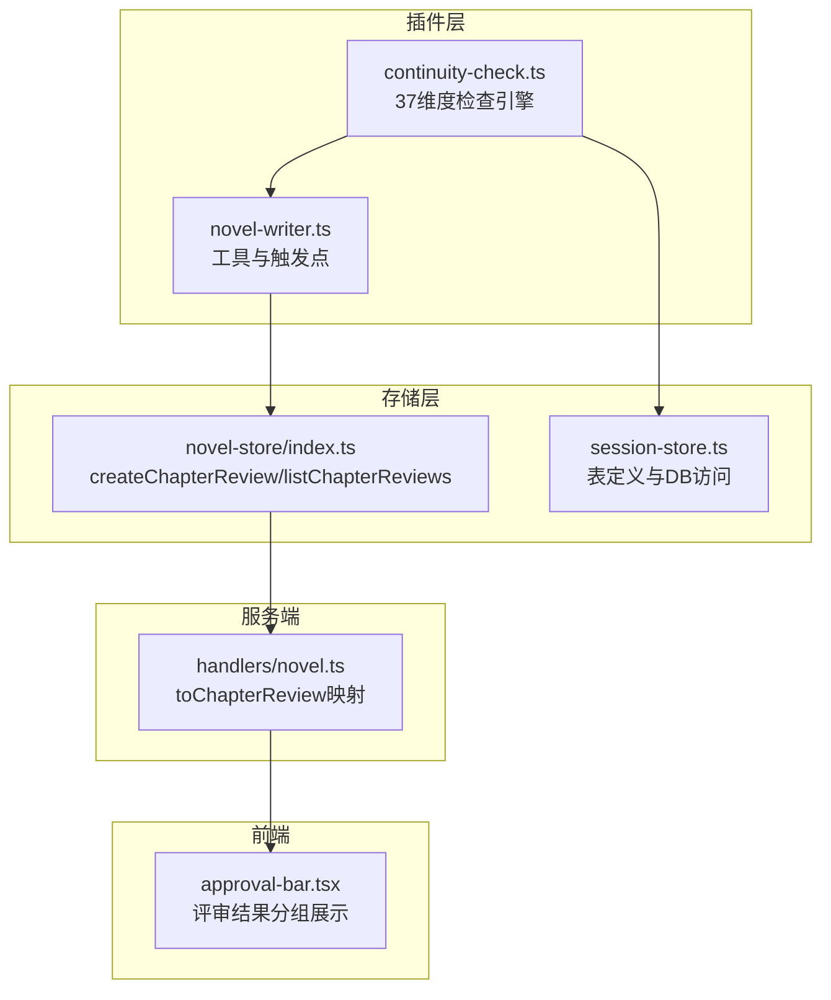

**图表来源**
- [continuity-check.ts:149-232](file://packages/plugin/src/novel-writer/continuity-check.ts#L149-L232)
- [novel-writer.ts:783-833](file://packages/plugin/src/novel-writer.ts#L783-L833)
- [novel-store/index.ts:968-1022](file://packages/novel-store/src/index.ts#L968-L1022)
- [novel.ts（处理器）:139-159](file://packages/server/src/handlers/novel.ts#L139-L159)
- [approval-bar.tsx:150-209](file://packages/app/src/pages/novel/approval-bar.tsx#L150-L209)

**章节来源**
- [continuity-check.ts:149-232](file://packages/plugin/src/novel-writer/continuity-check.ts#L149-L232)
- [novel-writer.ts:783-833](file://packages/plugin/src/novel-writer.ts#L783-L833)
- [novel-store/index.ts:968-1022](file://packages/novel-store/src/index.ts#L968-L1022)
- [novel.ts（处理器）:139-159](file://packages/server/src/handlers/novel.ts#L139-L159)
- [approval-bar.tsx:150-209](file://packages/app/src/pages/novel/approval-bar.tsx#L150-L209)

## 核心组件
- 37 维度检查引擎：从数据库并行加载小说相关实体，按九大类（角色、关系、时间线、地点、剧情、世界观、风格、逻辑、细节）执行启发式检查，汇总 PASS/WARN/FAIL 并计算整体结果。
- 工具与触发点：在写作流程中调用 checkContinuity，生成结构化评审结果，并通过 submit_chapter_review 持久化。
- 评审持久化：createChapterReview 自动推导轮次 round，统计 pass/warn/fail 计数，序列化 dimensions。
- 服务端映射：toChapterReview 将数据库行转换为统一结构，便于前端消费。
- 前端展示：按类别分组显示维度状态、详情与证据，支持折叠通过项。

**章节来源**
- [continuity-check.ts:64-111](file://packages/plugin/src/novel-writer/continuity-check.ts#L64-L111)
- [continuity-check.ts:149-232](file://packages/plugin/src/novel-writer/continuity-check.ts#L149-L232)
- [novel-writer.ts:803-833](file://packages/plugin/src/novel-writer.ts#L803-L833)
- [novel-store/index.ts:968-1022](file://packages/novel-store/src/index.ts#L968-L1022)
- [novel.ts（处理器）:139-159](file://packages/server/src/handlers/novel.ts#L139-L159)
- [approval-bar.tsx:150-209](file://packages/app/src/pages/novel/approval-bar.tsx#L150-L209)

## 架构总览
下图展示了从触发审查到结果展示的完整调用链，包括数据库读写与前后端交互。

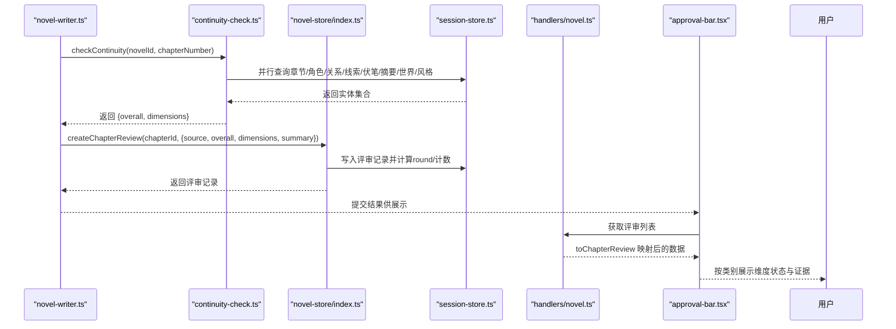

**图表来源**
- [novel-writer.ts:783-833](file://packages/plugin/src/novel-writer.ts#L783-L833)
- [continuity-check.ts:149-232](file://packages/plugin/src/novel-writer/continuity-check.ts#L149-L232)
- [novel-store/index.ts:968-1022](file://packages/novel-store/src/index.ts#L968-L1022)
- [novel.ts（处理器）:139-159](file://packages/server/src/handlers/novel.ts#L139-L159)
- [approval-bar.tsx:150-209](file://packages/app/src/pages/novel/approval-bar.tsx#L150-L209)

## 详细组件分析

### 37 维度检查引擎
- 输入：novelId、chapterNumber、可选 directory
- 数据准备：并行查询小说、章节、角色、角色状态、关系、剧情线索、伏笔、章节摘要、世界条目、风格指南
- 检查流程：按九大类分别执行检查函数，收集 ContinuityResult[]
- 整体判定：存在 FAIL → FAIL；否则存在 WARN → WARN；否则 PASS
- 输出：ContinuityCheckResult（包含 novelId、chapterNumber、chapterId、overall、dimensions）

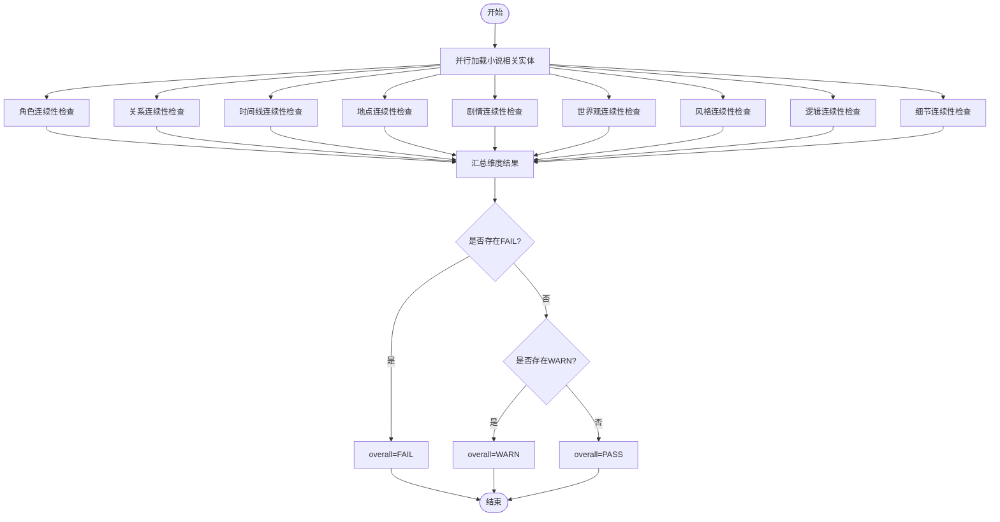

**图表来源**
- [continuity-check.ts:149-232](file://packages/plugin/src/novel-writer/continuity-check.ts#L149-L232)

**章节来源**
- [continuity-check.ts:149-232](file://packages/plugin/src/novel-writer/continuity-check.ts#L149-L232)

### 角色一致性检查（姓名一致性、外貌描述、性格一致、能力等级、位置连续）
- 姓名一致性：校验角色状态中的 character_id 是否均存在于 characters 表
- 外貌描述：统计缺少 description 的角色比例，超过阈值给出警告
- 性格一致：基于 CharacterState 的 mood 序列检测突变（对立情绪快速切换）
- 能力等级：在世界条目中搜索力量体系关键词，未定义则提示建议
- 位置连续：统计角色 location 变化频率，频繁跳变给出警告

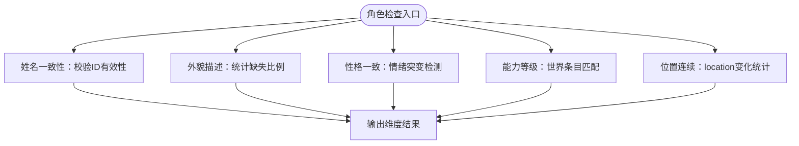

**图表来源**
- [continuity-check.ts:236-359](file://packages/plugin/src/novel-writer/continuity-check.ts#L236-L359)

**章节来源**
- [continuity-check.ts:236-359](file://packages/plugin/src/novel-writer/continuity-check.ts#L236-L359)

### 关系连续性检查（关系类型一致、敌友转变有因、亲密度变化、信任度变化）
- 关系类型一致：校验 type 是否在白名单内，空值或非标准值给出警告
- 敌友转变有因：检测同一对角色同时存在敌对与友好类型的矛盾
- 亲密度变化：在角色状态摘要中检索关系/亲密关键词
- 信任度变化：在角色状态摘要中检索信任/怀疑/背叛关键词

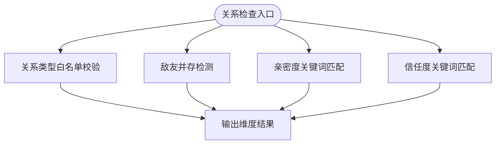

**图表来源**
- [continuity-check.ts:363-512](file://packages/plugin/src/novel-writer/continuity-check.ts#L363-L512)

**章节来源**
- [continuity-check.ts:363-512](file://packages/plugin/src/novel-writer/continuity-check.ts#L363-L512)

### 时间线连续性检查（事件顺序、时间流逝合理、季节一致、年龄变化）
- 事件顺序：检查章节 order 是否连续，缺章或起始非第1章给出警告
- 时间流逝合理：比较相邻章节 created_at，负间隔或过短间隔提示异常
- 季节一致：在章节摘要中检索季节关键词，无则建议补充
- 年龄变化：在角色 description 中检索年龄信息，无则建议补充

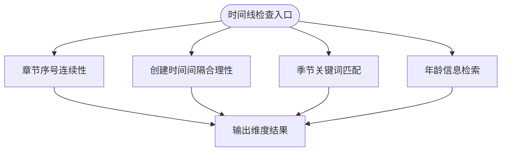

**图表来源**
- [continuity-check.ts:516-629](file://packages/plugin/src/novel-writer/continuity-check.ts#L516-L629)

**章节来源**
- [continuity-check.ts:516-629](file://packages/plugin/src/novel-writer/continuity-check.ts#L516-L629)

### 地点连续性检查（地点描述一致、距离合理、环境细节、地图一致）
- 地点描述一致：在世界条目中检索地点相关分类/标题
- 距离合理：统计角色 location 变化次数，无记录则无法检查
- 环境细节：在世界条目中检索环境/气候/地理关键词
- 地图一致：在世界条目中检索地图/分布关键词

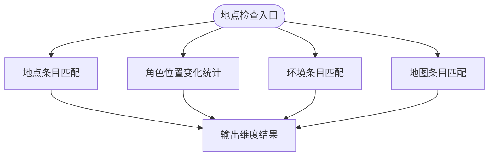

**图表来源**
- [continuity-check.ts:633-721](file://packages/plugin/src/novel-writer/continuity-check.ts#L633-L721)

**章节来源**
- [continuity-check.ts:633-721](file://packages/plugin/src/novel-writer/continuity-check.ts#L633-L721)

### 剧情连续性检查（主线推进、伏笔回收、冲突升级、转折合理、结局呼应）
- 主线推进：统计 plotThreads 的 open/resolved/paused 数量
- 伏笔回收：统计 planted/resolved 比例，超阈值且章节数较大时警告
- 冲突升级：高优先级线索或描述中包含“升级/冲突/矛盾”关键词
- 转折合理：在摘要或关键事件中检索转折关键词
- 结局呼应：对比第1章与当前章摘要是否存在首尾呼应

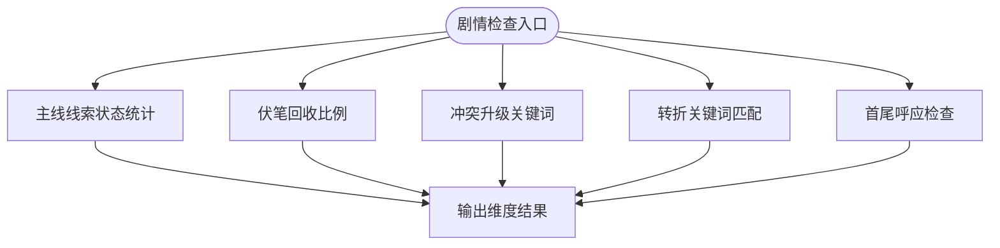

**图表来源**
- [continuity-check.ts:725-852](file://packages/plugin/src/novel-writer/continuity-check.ts#L725-L852)

**章节来源**
- [continuity-check.ts:725-852](file://packages/plugin/src/novel-writer/continuity-check.ts#L725-L852)

### 世界观连续性检查（力量体系、规则一致、社会结构、文化细节、经济系统）
- 力量体系：在世界条目中检索 power_system/境界/修炼/等级关键词
- 规则一致：从 styleGuide.rules 统计规则数量
- 社会结构：在世界条目中检索社会/家族/组织/国家/门派关键词
- 文化细节：在世界条目中检索文化/风俗/节日/礼仪/传统关键词
- 经济系统：在世界条目中检索经济/货币/交易/资源关键词

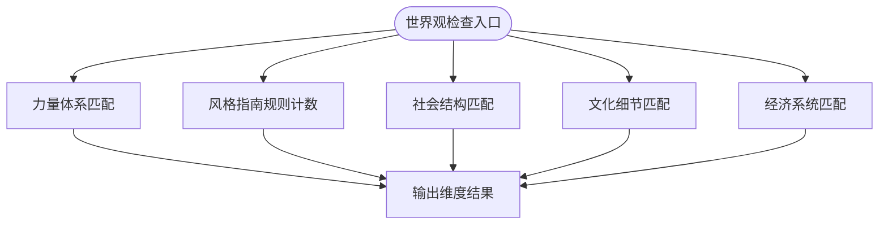

**图表来源**
- [continuity-check.ts:856-974](file://packages/plugin/src/novel-writer/continuity-check.ts#L856-L974)

**章节来源**
- [continuity-check.ts:856-974](file://packages/plugin/src/novel-writer/continuity-check.ts#L856-L974)

### 风格连续性检查（叙事视角、语言风格、节奏一致、描写密度）
- 叙事视角：styleGuide.pov 是否设置
- 语言风格：styleGuide.tone 是否设置
- 节奏一致：章节字数方差分析，偏离平均值过多则警告
- 描写密度：在章节摘要中检索描写/场景/环境/氛围/细节关键词

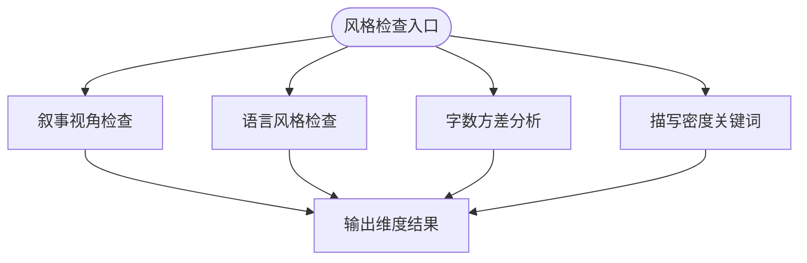

**图表来源**
- [continuity-check.ts:978-1059](file://packages/plugin/src/novel-writer/continuity-check.ts#L978-L1059)

**章节来源**
- [continuity-check.ts:978-1059](file://packages/plugin/src/novel-writer/continuity-check.ts#L978-L1059)

### 逻辑连续性检查（因果链、动机合理、信息对称）
- 因果链：在章节摘要中检索因果关键词
- 动机合理：在角色 description 与状态 summary 中检索动机/目标/追求等关键词
- 信息对称：检查角色 active 状态在连续章节间是否出现不合理跳变

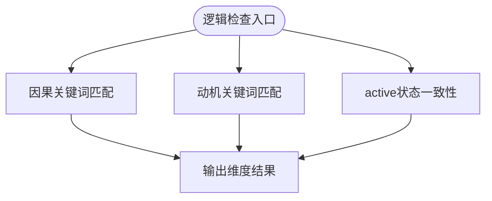

**图表来源**
- [continuity-check.ts:1063-1132](file://packages/plugin/src/novel-writer/continuity-check.ts#L1063-L1132)

**章节来源**
- [continuity-check.ts:1063-1132](file://packages/plugin/src/novel-writer/continuity-check.ts#L1063-L1132)

### 细节连续性检查（物品追踪、数字一致、称呼一致）
- 物品追踪：在章节摘要或关键事件中检索物品/道具/法宝等关键词
- 数字一致：在章节摘要中检索数字模式
- 称呼一致：检查角色名称在不同地方的一致性（如关系表引用）

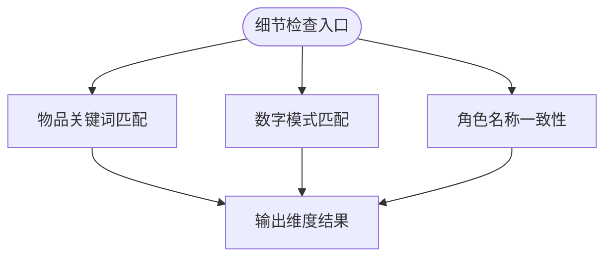

**图表来源**
- [continuity-check.ts:1136-1200](file://packages/plugin/src/novel-writer/continuity-check.ts#L1136-L1200)

**章节来源**
- [continuity-check.ts:1136-1200](file://packages/plugin/src/novel-writer/continuity-check.ts#L1136-L1200)

### 评分机制、问题分类与优先级排序
- 评分机制：每个维度返回 PASS/WARN/FAIL；整体结果遵循“存在 FAIL → FAIL；否则存在 WARN → WARN；否则 PASS”
- 问题分类：按九大类分组（角色、关系、时间线、地点、剧情、世界观、风格、逻辑、细节），前端按类别展示
- 优先级排序：在级联统改场景中，pending_updates 的 priority 分为 high/medium/low，依据变更类型决定（详见级联设计文档）

**章节来源**
- [continuity-check.ts:149-232](file://packages/plugin/src/novel-writer/continuity-check.ts#L149-L232)
- [cascade-consistency-design.md:209-221](file://docs/cascade-consistency-design.md#L209-L221)

### 自定义开发接口与配置选项
- 维度清单：CONTINUITY_DIMENSIONS 定义了 37 个维度名称，submit_chapter_review 会校验维度名是否合法
- 评审持久化：createChapterReview 接受 source（deterministic/auditor/human）、overall、dimensions、summary、sessionId
- 前端展示：approval-bar.tsx 使用 REVIEW_CATEGORIES 将维度分组展示，支持折叠通过项
- 级联工具：cascade_check / cascade_create_tasks / cascade_list_pending / cascade_resolve / cascade_rebuild_refs 提供确定性统改工作流

**章节来源**
- [novel-writer.ts:803-833](file://packages/plugin/src/novel-writer.ts#L803-L833)
- [novel-store/index.ts:968-1022](file://packages/novel-store/src/index.ts#L968-L1022)
- [approval-bar.tsx:150-209](file://packages/app/src/pages/novel/approval-bar.tsx#L150-L209)
- [cascade-consistency-design.md:130-208](file://docs/cascade-consistency-design.md#L130-L208)

### 批量审查与性能优化策略
- 并行查询：checkContinuity 使用 Promise.all 并行加载多张表，减少 I/O 等待
- 缓存与映射：底层 Effect SQLite 支持查询缓存与 JIT 映射，提升重复查询性能
- 预算控制：测试用例中对 P4 归档层 token 预算进行约束，避免过大上下文导致性能下降
- 批处理：级联统改任务按优先级串行处理，支持 saga 持久化恢复

**章节来源**
- [continuity-check.ts:166-191](file://packages/plugin/src/novel-writer/continuity-check.ts#L166-L191)
- [session-store.ts:208-270](file://packages/effect-drizzle-sqlite/src/sqlite-core/effect/session.ts#L208-L270)
- [scale.test.ts:916-953](file://packages/plugin/test/novel-writer/scale.test.ts#L916-L953)
- [cascade-consistency-design.md:242-254](file://docs/cascade-consistency-design.md#L242-L254)

## 依赖关系分析
- 规则引擎依赖 session-store 的表定义与数据库访问
- 工具层依赖规则引擎与 novel-store 的评审持久化
- 服务端处理器依赖 novel-store 的数据结构进行映射
- 前端依赖服务端返回的统一结构进行展示

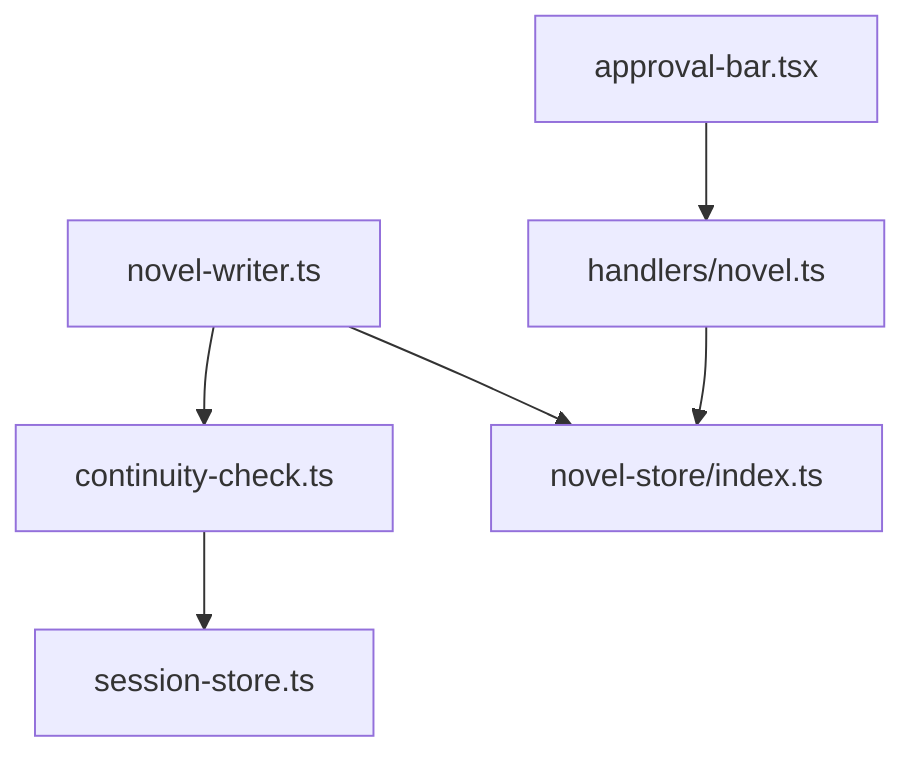

**图表来源**
- [continuity-check.ts:16-30](file://packages/plugin/src/novel-writer/continuity-check.ts#L16-L30)
- [novel-writer.ts:18](file://packages/plugin/src/novel-writer.ts#L18)
- [novel-store/index.ts:968-1022](file://packages/novel-store/src/index.ts#L968-L1022)
- [novel.ts（处理器）:139-159](file://packages/server/src/handlers/novel.ts#L139-L159)
- [approval-bar.tsx:150-209](file://packages/app/src/pages/novel/approval-bar.tsx#L150-L209)

**章节来源**
- [continuity-check.ts:16-30](file://packages/plugin/src/novel-writer/continuity-check.ts#L16-L30)
- [novel-writer.ts:18](file://packages/plugin/src/novel-writer.ts#L18)
- [novel-store/index.ts:968-1022](file://packages/novel-store/src/index.ts#L968-L1022)
- [novel.ts（处理器）:139-159](file://packages/server/src/handlers/novel.ts#L139-L159)
- [approval-bar.tsx:150-209](file://packages/app/src/pages/novel/approval-bar.tsx#L150-L209)

## 性能考量
- 并行 I/O：使用 Promise.all 并行加载多表数据，降低总体延迟
- 查询缓存：Effect SQLite 的 queryWithCache 在事务外启用缓存，命中后直接返回
- JIT 映射：mapGetResult/mapAllResult 使用 JIT mapper 提升对象映射速度
- 预算限制：P4 层 token 预算控制在 1.5K 以内，避免上下文过大
- 批处理恢复：saga 持久化支持崩溃恢复，保证长任务稳定性

**章节来源**
- [continuity-check.ts:166-191](file://packages/plugin/src/novel-writer/continuity-check.ts#L166-L191)
- [session-store.ts:208-270](file://packages/effect-drizzle-sqlite/src/sqlite-core/effect/session.ts#L208-L270)
- [scale.test.ts:925-936](file://packages/plugin/test/novel-writer/scale.test.ts#L925-L936)
- [cascade-consistency-design.md:242-254](file://docs/cascade-consistency-design.md#L242-L254)

## 故障排查指南
- 维度名称非法：submit_chapter_review 会校验维度名是否在 CONTINUITY_DIMENSIONS 中，非法将返回错误消息
- 章节不存在：createChapterReview 在未找到章节时抛出错误
- 评审轮次异常：round 根据 chapter.updated_at 与最近评审 created_at 比较自动推导，需确保更新时间正确
- 前端展示为空：确认服务器 toChapterReview 映射是否正确解析 dimensions JSON

**章节来源**
- [novel-writer.ts:824-830](file://packages/plugin/src/novel-writer.ts#L824-L830)
- [novel-store/index.ts:980-989](file://packages/novel-store/src/index.ts#L980-L989)
- [novel.test.ts:229-266](file://packages/server/test/novel.test.ts#L229-L266)
- [review.test.ts:67-133](file://packages/plugin/test/novel-writer/review.test.ts#L67-L133)

## 结论
连续性审查系统以 37 维度为核心，结合数据库驱动的启发式检查与前端的结构化展示，形成完整的写作质量保障闭环。通过并行查询、缓存与预算控制等手段，系统在大规模数据下仍保持良好性能。级联统改工具进一步提升了设定变更时的内容一致性维护效率。未来可增强间接引用与语义级引用的检测能力，进一步提升准确性与覆盖面。

## 附录
- 37 维度清单：见 continuity-check.ts 中的 CONTINUITY_DIMENSIONS
- 评审数据结构：见 novel-store/index.ts 的 ChapterReviewDimension 与 createChapterReview 参数
- 前端分类展示：见 approval-bar.tsx 的 REVIEW_CATEGORIES 与渲染逻辑
- 级联统改流程：见 docs/cascade-consistency-design.md 的工具定义与优先级规则

**章节来源**
- [continuity-check.ts:64-111](file://packages/plugin/src/novel-writer/continuity-check.ts#L64-L111)
- [novel-store/index.ts:957-1022](file://packages/novel-store/src/index.ts#L957-L1022)
- [approval-bar.tsx:150-209](file://packages/app/src/pages/novel/approval-bar.tsx#L150-L209)
- [cascade-consistency-design.md:130-221](file://docs/cascade-consistency-design.md#L130-L221)