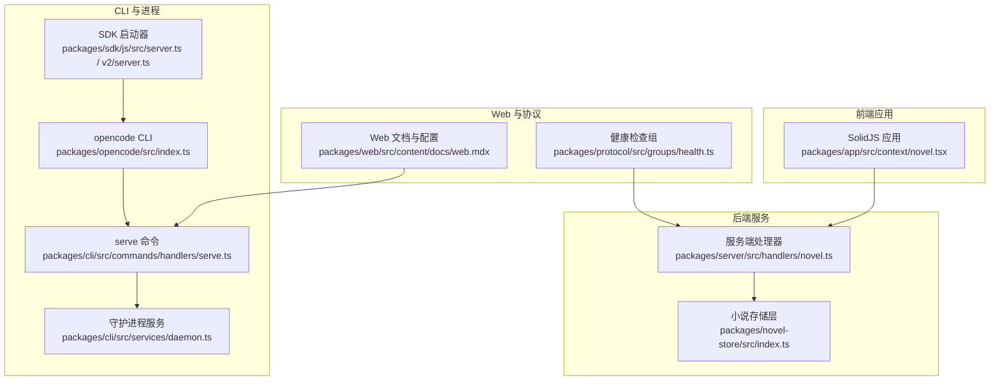
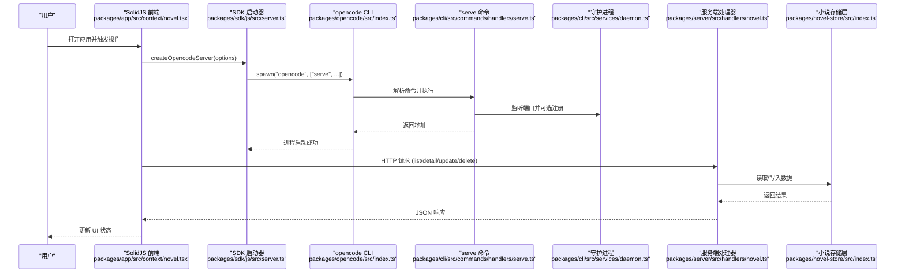
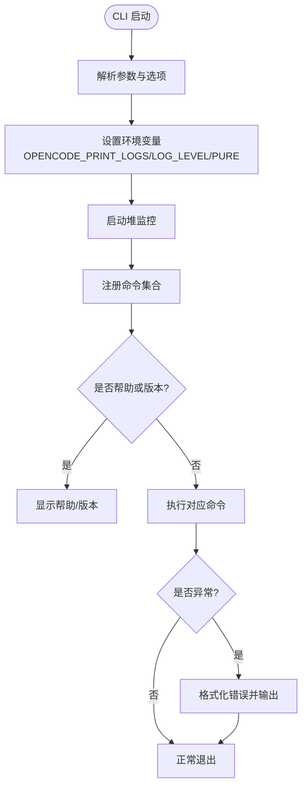
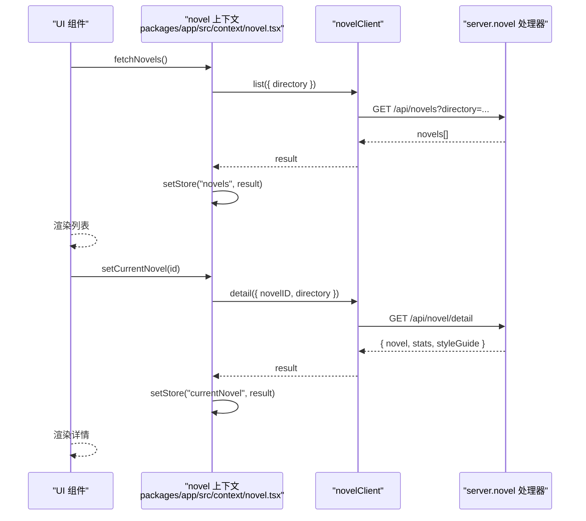
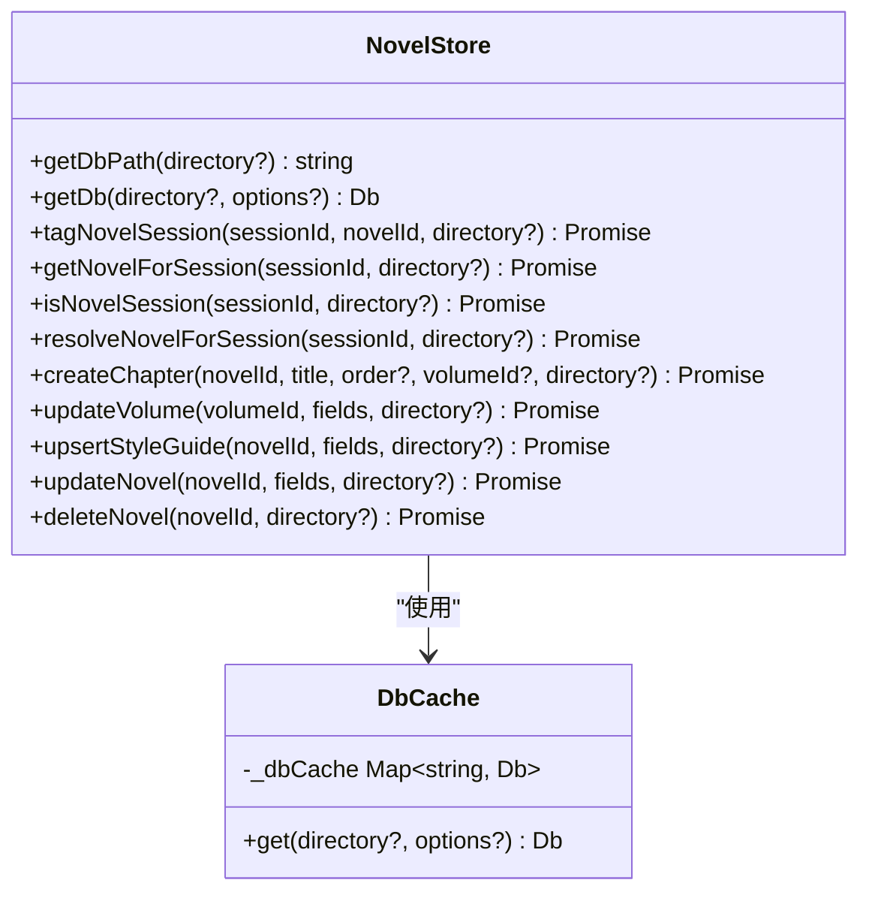
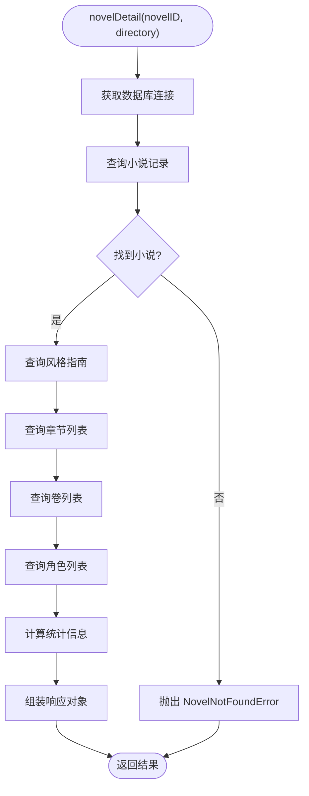
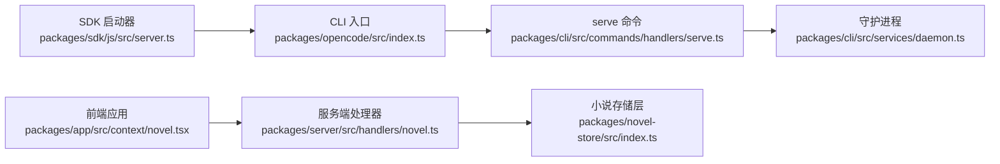

# 核心组件设计

<cite>
**本文引用的文件**   
- [packages/opencode/src/index.ts](file://packages/opencode/src/index.ts)
- [packages/cli/src/commands/handlers/serve.ts](file://packages/cli/src/commands/handlers/serve.ts)
- [packages/cli/src/services/daemon.ts](file://packages/cli/src/services/daemon.ts)
- [packages/sdk/js/src/server.ts](file://packages/sdk/js/src/server.ts)
- [packages/sdk/js/src/v2/server.ts](file://packages/sdk/js/src/v2/server.ts)
- [packages/web/src/content/docs/web.mdx](file://packages/web/src/content/docs/web.mdx)
- [packages/protocol/src/groups/health.ts](file://packages/protocol/src/groups/health.ts)
- [packages/app/src/context/novel.tsx](file://packages/app/src/context/novel.tsx)
- [packages/server/src/handlers/novel.ts](file://packages/server/src/handlers/novel.ts)
- [packages/novel-store/src/index.ts](file://packages/novel-store/src/index.ts)
- [packages/opencode/test/cli/serve/serve-process.test.ts](file://packages/opencode/test/cli/serve/serve-process.test.ts)
- [packages/opencode/test/lib/websocket.ts](file://packages/opencode/test/lib/websocket.ts)
</cite>

## 目录
1. [简介](#简介)
2. [项目结构](#项目结构)
3. [核心组件](#核心组件)
4. [架构总览](#架构总览)
5. [详细组件分析](#详细组件分析)
6. [依赖关系分析](#依赖关系分析)
7. [性能考量](#性能考量)
8. [故障排查指南](#故障排查指南)
9. [结论](#结论)
10. [附录](#附录)

## 简介
本文件为 openNovel 的核心组件架构文档，聚焦以下四个核心组件的职责边界与交互：
- opencode（主服务器与 CLI 入口）
- app（SolidJS 前端应用）
- novel-store（小说数据持久化）
- core（核心业务逻辑与服务层）

文档涵盖：
- 组件间通信机制：HTTP API、WebSocket 实时通信、进程间通信（SDK 启动子进程）
- 生命周期管理：从应用启动到关闭的完整流程
- 架构图与数据流向图
- 错误处理策略与日志记录机制

## 项目结构
openNovel 采用多包仓库组织，关键包职责如下：
- packages/opencode：CLI 入口与命令注册、全局参数解析、错误格式化与退出流程
- packages/cli：CLI 命令实现（如 serve），负责启动 HTTP 服务、守护进程注册等
- packages/sdk：Node.js SDK，通过子进程方式启动 opencode 服务并暴露 createOpencodeServer
- packages/web：Web 文档与示例配置说明（端口、主机名、CORS 等）
- packages/protocol：HTTP API 分组定义（如健康检查）
- packages/app：SolidJS 前端应用，提供上下文与状态管理，调用服务端 SDK
- packages/server：服务端路由与处理器（如 novel 相关接口）
- packages/novel-store：SQLite 表结构与数据访问封装，会话绑定与懒绑定

**图表来源** 
- [packages/opencode/src/index.ts:1-145](file://packages/opencode/src/index.ts#L1-L145)
- [packages/cli/src/commands/handlers/serve.ts:1-28](file://packages/cli/src/commands/handlers/serve.ts#L1-L28)
- [packages/cli/src/services/daemon.ts:1-29](file://packages/cli/src/services/daemon.ts#L1-L29)
- [packages/sdk/js/src/server.ts:1-41](file://packages/sdk/js/src/server.ts#L1-L41)
- [packages/sdk/js/src/v2/server.ts:1-41](file://packages/sdk/js/src/v2/server.ts#L1-L41)
- [packages/web/src/content/docs/web.mdx:109-142](file://packages/web/src/content/docs/web.mdx#L109-L142)
- [packages/protocol/src/groups/health.ts:1-14](file://packages/protocol/src/groups/health.ts#L1-L14)
- [packages/app/src/context/novel.tsx:65-139](file://packages/app/src/context/novel.tsx#L65-L139)
- [packages/server/src/handlers/novel.ts:380-422](file://packages/server/src/handlers/novel.ts#L380-L422)
- [packages/novel-store/src/index.ts:340-404](file://packages/novel-store/src/index.ts#L340-L404)

**章节来源**
- [packages/opencode/src/index.ts:1-145](file://packages/opencode/src/index.ts#L1-L145)
- [packages/cli/src/commands/handlers/serve.ts:1-28](file://packages/cli/src/commands/handlers/serve.ts#L1-L28)
- [packages/cli/src/services/daemon.ts:1-29](file://packages/cli/src/services/daemon.ts#L1-L29)
- [packages/sdk/js/src/server.ts:1-41](file://packages/sdk/js/src/server.ts#L1-L41)
- [packages/sdk/js/src/v2/server.ts:1-41](file://packages/sdk/js/src/v2/server.ts#L1-L41)
- [packages/web/src/content/docs/web.mdx:109-142](file://packages/web/src/content/docs/web.mdx#L109-L142)
- [packages/protocol/src/groups/health.ts:1-14](file://packages/protocol/src/groups/health.ts#L1-L14)
- [packages/app/src/context/novel.tsx:65-139](file://packages/app/src/context/novel.tsx#L65-L139)
- [packages/server/src/handlers/novel.ts:380-422](file://packages/server/src/handlers/novel.ts#L380-L422)
- [packages/novel-store/src/index.ts:340-404](file://packages/novel-store/src/index.ts#L340-L404)

## 核心组件
- opencode（主服务器与 CLI 入口）
  - 职责：命令行参数解析、命令注册、全局环境变量设置、错误格式化与进程退出；通过 serve 命令启动 HTTP 服务。
  - 关键点：yargs 配置、中间件设置 printLogs/logLevel/pure、子进程清理与退出。
- app（SolidJS 前端应用）
  - 职责：提供小说相关的上下文与状态管理，调用服务端 SDK 进行 CRUD 操作；统一错误捕获与加载状态管理。
  - 关键点：novelClient 调用、loading/error 状态、目录参数传递。
- novel-store（小说数据持久化）
  - 职责：SQLite 表结构定义、数据库路径解析、连接缓存、会话绑定与懒绑定、CRUD 方法封装。
  - 关键点：getDbPath/getDb、tagNovelSession/getNovelForSession/isNovelSession/resolveNovelForSession。
- core（核心业务逻辑与服务层）
  - 职责：在 server 层中编排领域逻辑（如 novelDetail、updateNovel、deleteNovel），调用 novel-store 完成数据访问。
  - 关键点：Effect 编排、错误抛出（NovelNotFoundError）、聚合统计信息。

**章节来源**
- [packages/opencode/src/index.ts:1-145](file://packages/opencode/src/index.ts#L1-L145)
- [packages/app/src/context/novel.tsx:65-139](file://packages/app/src/context/novel.tsx#L65-L139)
- [packages/novel-store/src/index.ts:340-404](file://packages/novel-store/src/index.ts#L340-L404)
- [packages/server/src/handlers/novel.ts:380-422](file://packages/server/src/handlers/novel.ts#L380-L422)

## 架构总览
整体架构由 CLI 启动、SDK 子进程、HTTP 服务、前端应用与数据存储组成。请求流从前端发起，经 HTTP API 进入服务端处理器，再调用 novel-store 进行数据读写。守护进程用于服务管理与注册。

**图表来源** 
- [packages/sdk/js/src/server.ts:1-41](file://packages/sdk/js/src/server.ts#L1-L41)
- [packages/opencode/src/index.ts:1-145](file://packages/opencode/src/index.ts#L1-L145)
- [packages/cli/src/commands/handlers/serve.ts:1-28](file://packages/cli/src/commands/handlers/serve.ts#L1-L28)
- [packages/cli/src/services/daemon.ts:1-29](file://packages/cli/src/services/daemon.ts#L1-L29)
- [packages/app/src/context/novel.tsx:65-139](file://packages/app/src/context/novel.tsx#L65-L139)
- [packages/server/src/handlers/novel.ts:380-422](file://packages/server/src/handlers/novel.ts#L380-L422)
- [packages/novel-store/src/index.ts:340-404](file://packages/novel-store/src/index.ts#L340-L404)

## 详细组件分析

### opencode（主服务器与 CLI 入口）
- 职责边界
  - 解析命令行参数与选项（print-logs、log-level、pure）
  - 注册所有命令（包括 serve、web、novel 等）
  - 设置全局环境变量与堆监控
  - 统一错误格式化与退出码设置
- 控制流
  - yargs 初始化与中间件注入
  - 命令解析与执行
  - finally 块确保子进程清理与进程退出

**图表来源** 
- [packages/opencode/src/index.ts:1-145](file://packages/opencode/src/index.ts#L1-L145)

**章节来源**
- [packages/opencode/src/index.ts:1-145](file://packages/opencode/src/index.ts#L1-L145)

### app（SolidJS 前端应用）
- 职责边界
  - 维护小说列表、当前小说、加载与错误状态
  - 调用服务端 SDK 获取/更新小说详情、按会话查找小说
  - 统一错误捕获与状态重置
- 数据流
  - 使用 novelClient 调用 server.novel.* 接口
  - 将结果映射到 store 状态，驱动 UI 更新

**图表来源** 
- [packages/app/src/context/novel.tsx:65-139](file://packages/app/src/context/novel.tsx#L65-L139)
- [packages/server/src/handlers/novel.ts:380-422](file://packages/server/src/handlers/novel.ts#L380-L422)

**章节来源**
- [packages/app/src/context/novel.tsx:65-139](file://packages/app/src/context/novel.tsx#L65-L139)

### novel-store（小说数据持久化）
- 职责边界
  - 定义 SQLite 表结构（novels、chapters、characters、volumes 等）
  - 解析数据库路径（优先 OPENNOVEL_DB，其次 directory，最后 process.cwd()）
  - 管理数据库连接缓存（按路径缓存 Db 实例）
  - 会话绑定与懒绑定（tagNovelSession、getNovelForSession、isNovelSession、resolveNovelForSession）
  - 提供 CRUD 方法（createChapter、updateVolume、upsertStyleGuide 等）
- 复杂度与优化
  - getDb 使用 Map 缓存避免重复创建连接
  - 索引优化常见查询（session_novel、novel_id、chapter_id 等）
  - 懒绑定仅在恰好存在一本小说时自动关联会话

**图表来源** 
- [packages/novel-store/src/index.ts:340-404](file://packages/novel-store/src/index.ts#L340-L404)
- [packages/novel-store/src/index.ts:413-467](file://packages/novel-store/src/index.ts#L413-L467)

**章节来源**
- [packages/novel-store/src/index.ts:340-404](file://packages/novel-store/src/index.ts#L340-L404)
- [packages/novel-store/src/index.ts:413-467](file://packages/novel-store/src/index.ts#L413-L467)

### core（核心业务逻辑与服务层）
- 职责边界
  - 编排领域逻辑（如 novelDetail、updateNovel、deleteNovel）
  - 调用 novel-store 完成数据访问
  - 抛出领域错误（如 NovelNotFoundError）
  - 聚合统计信息（章节数、字数、角色数等）
- 处理流程
  - 校验输入与存在性
  - 调用 store 层获取/更新数据
  - 组装响应对象（包含风格指南与统计）

**图表来源** 
- [packages/server/src/handlers/novel.ts:380-422](file://packages/server/src/handlers/novel.ts#L380-L422)

**章节来源**
- [packages/server/src/handlers/novel.ts:380-422](file://packages/server/src/handlers/novel.ts#L380-L422)

## 依赖关系分析
- CLI 与 SDK
  - SDK 通过 cross-spawn 启动 opencode 子进程，传递 hostname/port/logLevel 等参数
  - CLI 通过 yargs 解析参数并执行 serve 命令
- 服务与存储
  - 服务端处理器依赖 novel-store 的数据访问能力
  - novel-store 通过 Drizzle ORM 与 SQLite 交互
- 前端与服务端
  - 前端通过 SDK 生成的客户端调用 HTTP API
  - 服务端通过 Effect HttpApi 定义路由与响应模式

**图表来源** 
- [packages/sdk/js/src/server.ts:1-41](file://packages/sdk/js/src/server.ts#L1-L41)
- [packages/opencode/src/index.ts:1-145](file://packages/opencode/src/index.ts#L1-L145)
- [packages/cli/src/commands/handlers/serve.ts:1-28](file://packages/cli/src/commands/handlers/serve.ts#L1-L28)
- [packages/cli/src/services/daemon.ts:1-29](file://packages/cli/src/services/daemon.ts#L1-L29)
- [packages/app/src/context/novel.tsx:65-139](file://packages/app/src/context/novel.tsx#L65-L139)
- [packages/server/src/handlers/novel.ts:380-422](file://packages/server/src/handlers/novel.ts#L380-L422)
- [packages/novel-store/src/index.ts:340-404](file://packages/novel-store/src/index.ts#L340-L404)

**章节来源**
- [packages/sdk/js/src/server.ts:1-41](file://packages/sdk/js/src/server.ts#L1-L41)
- [packages/opencode/src/index.ts:1-145](file://packages/opencode/src/index.ts#L1-L145)
- [packages/cli/src/commands/handlers/serve.ts:1-28](file://packages/cli/src/commands/handlers/serve.ts#L1-L28)
- [packages/cli/src/services/daemon.ts:1-29](file://packages/cli/src/services/daemon.ts#L1-L29)
- [packages/app/src/context/novel.tsx:65-139](file://packages/app/src/context/novel.tsx#L65-L139)
- [packages/server/src/handlers/novel.ts:380-422](file://packages/server/src/handlers/novel.ts#L380-L422)
- [packages/novel-store/src/index.ts:340-404](file://packages/novel-store/src/index.ts#L340-L404)

## 性能考量
- 数据库连接缓存：novel-store 按路径缓存 Db 实例，减少连接开销
- 索引优化：对常用查询字段建立索引（如 session_id、novel_id、chapter_id）
- 懒绑定：仅在会话未绑定且仅有一本小说时自动关联，避免不必要的写入
- 前端状态管理：使用 SolidJS 响应式原语，避免外部状态库带来的额外开销
- 子进程启动：SDK 通过 cross-spawn 启动 CLI，避免阻塞主进程

[本节为通用指导，不直接分析具体文件]

## 故障排查指南
- CLI 错误处理
  - 参数错误：yargs 的 fail 钩子会显示帮助或抛出错误
  - 运行时异常：FormatError 格式化错误消息并输出到 stderr
  - 进程退出：finally 块确保子进程清理与退出码设置
- 健康检查
  - 通过 /api/health 验证服务可用性
  - 测试用例覆盖子进程启动、端口绑定与健康接口响应
- WebSocket 测试
  - 提供 FakeWebSocket 模拟 WebSocket 行为，便于单元测试

**章节来源**
- [packages/opencode/src/index.ts:106-145](file://packages/opencode/src/index.ts#L106-L145)
- [packages/protocol/src/groups/health.ts:1-14](file://packages/protocol/src/groups/health.ts#L1-L14)
- [packages/opencode/test/cli/serve/serve-process.test.ts:1-34](file://packages/opencode/test/cli/serve/serve-process.test.ts#L1-L34)
- [packages/opencode/test/lib/websocket.ts:1-46](file://packages/opencode/test/lib/websocket.ts#L1-L46)

## 结论
openNovel 的核心组件通过清晰的职责划分与模块化设计实现了可扩展、可维护的架构：
- CLI 与 SDK 负责进程管理与启动
- 前端应用专注于状态管理与用户交互
- 服务端处理器编排业务逻辑并与存储层解耦
- 存储层提供稳定的数据访问与缓存机制

该架构支持 HTTP API 与未来 WebSocket 扩展，具备良好的性能与可观测性。

[本节为总结性内容，不直接分析具体文件]

## 附录
- 配置参考：Web 文档提供了服务器配置示例（端口、主机名、CORS、mDNS）
- 进程间通信：SDK 通过环境变量传递配置，子进程继承父进程环境

**章节来源**
- [packages/web/src/content/docs/web.mdx:109-142](file://packages/web/src/content/docs/web.mdx#L109-L142)
- [packages/sdk/js/src/server.ts:1-41](file://packages/sdk/js/src/server.ts#L1-L41)