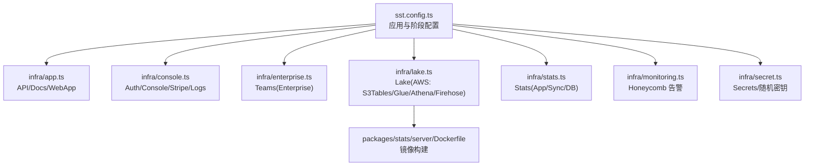
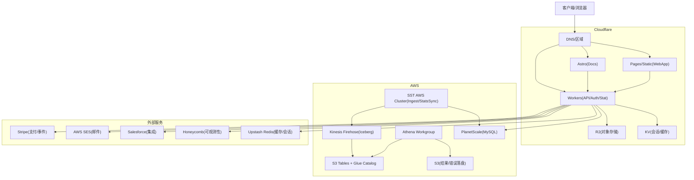
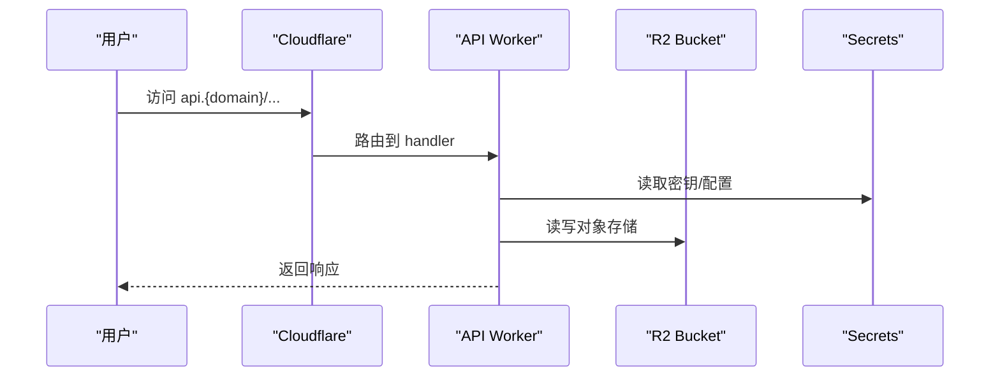
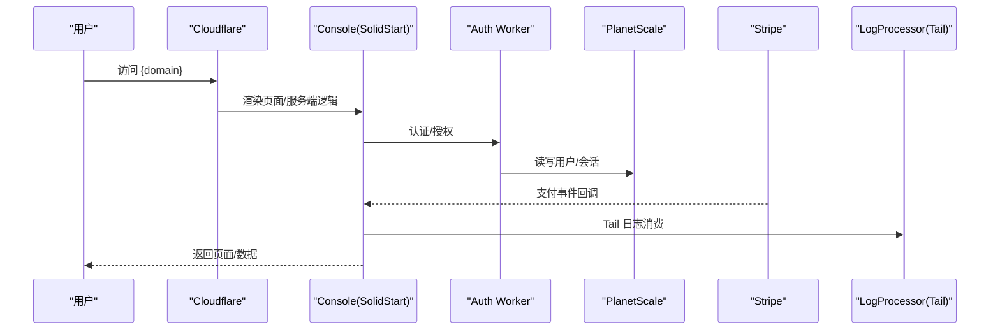
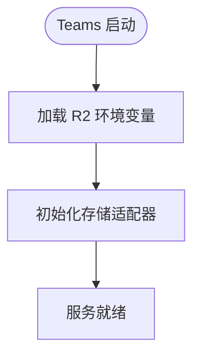
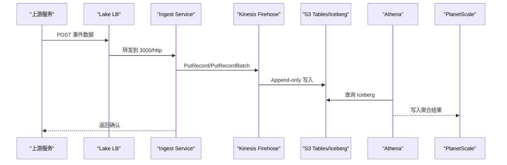
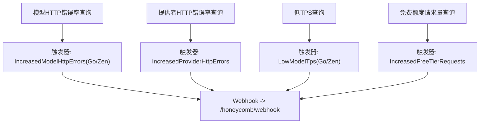
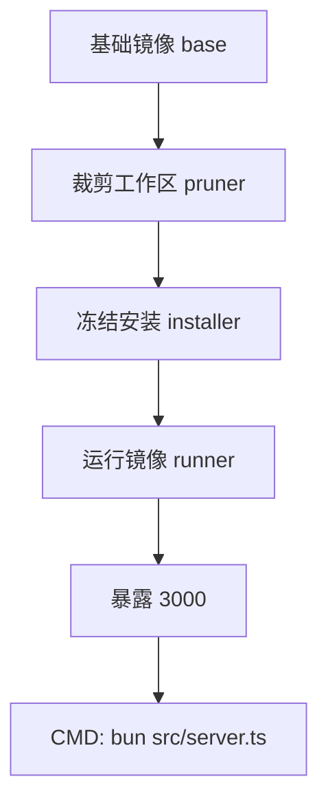
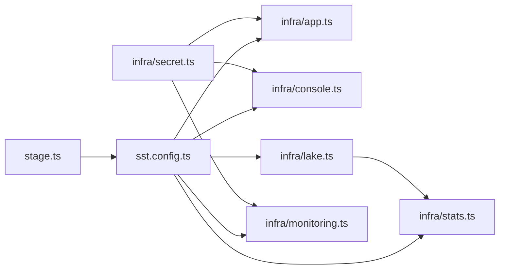

# 部署拓扑

<cite>
**本文引用的文件**
- [sst.config.ts](file://sst.config.ts)
- [infra/app.ts](file://infra/app.ts)
- [infra/stage.ts](file://infra/stage.ts)
- [infra/monitoring.ts](file://infra/monitoring.ts)
- [infra/secret.ts](file://infra/secret.ts)
- [infra/lake.ts](file://infra/lake.ts)
- [infra/stats.ts](file://infra/stats.ts)
- [infra/console.ts](file://infra/console.ts)
- [infra/enterprise.ts](file://infra/enterprise.ts)
- [packages/stats/server/Dockerfile](file://packages/stats/server/Dockerfile)
- [README.md](file://README.md)
</cite>

## 目录
1. [简介](#简介)
2. [项目结构](#项目结构)
3. [核心组件](#核心组件)
4. [架构总览](#架构总览)
5. [详细组件分析](#详细组件分析)
6. [依赖关系分析](#依赖关系分析)
7. [性能与扩展性](#性能与扩展性)
8. [故障排查指南](#故障排查指南)
9. [结论](#结论)
10. [附录](#附录)

## 简介
本文件面向生产环境，系统化阐述 openNovel 的部署拓扑与基础设施即代码（IaC）实现。整体采用 SST + Cloudflare 作为边缘应用与静态站点托管平台，结合 AWS 数据湖、Athena、Kinesis Firehose、S3 Tables、Glue Catalog 等构建高吞吐、可扩展的数据采集与分析体系；同时通过 PlanetScale 提供数据库能力，Honeycomb 负责可观测性与告警，Stripe 处理支付事件，Upstash Redis 用于缓存与会话存储。文档涵盖容器化部署、云服务集成、负载均衡与健康检查、环境变量与密钥管理、监控与日志策略、以及扩展性与高可用设计。

## 项目结构
- IaC 入口与阶段配置：sst.config.ts 定义应用名、移除策略、保护模式、Cloudflare 与 AWS 提供商及版本，并动态加载 infra 模块。
- 应用层资源：infra/app.ts 定义 API Worker、Astro 文档站点、静态 WebApp 站点，绑定域名与环境变量。
- 控制台与认证：infra/console.ts 定义 Auth Worker、Console 应用、LogProcessor Tail 消费者、Stripe Webhook、Secrets 与 Linkable 输出。
- 企业版：infra/enterprise.ts 基于 R2 的对象存储与 SolidStart 应用。
- 数据湖与统计：infra/lake.ts 定义 S3 Tables、Glue Catalog、Athena Workgroup、Firehose 投递流、VPC/Cluster、Ingest Service 与 LB；infra/stats.ts 定义 Inference Event Iceberg 表、PlanetScale 分支与密码、Stats App 与 Sync Service。
- 监控与告警：infra/monitoring.ts 使用 Honeycomb 定义计算字段、查询与触发器，并通过 Webhook 将告警转发至应用端点。
- 密钥与随机值：infra/secret.ts 集中声明 Secret 与随机密码，统一暴露为 Linkable。
- 容器镜像：packages/stats/server/Dockerfile 定义 stats-server 的生产镜像构建流程。

**图表来源**
- [sst.config.ts:1-54](file://sst.config.ts#L1-L54)
- [infra/app.ts:1-70](file://infra/app.ts#L1-L70)
- [infra/console.ts:1-308](file://infra/console.ts#L1-L308)
- [infra/enterprise.ts:1-19](file://infra/enterprise.ts#L1-L19)
- [infra/lake.ts:1-332](file://infra/lake.ts#L1-L332)
- [infra/stats.ts:1-208](file://infra/stats.ts#L1-L208)
- [infra/monitoring.ts:1-288](file://infra/monitoring.ts#L1-L288)
- [infra/secret.ts:1-16](file://infra/secret.ts#L1-L16)
- [packages/stats/server/Dockerfile:1-33](file://packages/stats/server/Dockerfile#L1-L33)

**章节来源**
- [sst.config.ts:1-54](file://sst.config.ts#L1-L54)
- [infra/app.ts:1-70](file://infra/app.ts#L1-L70)
- [infra/console.ts:1-308](file://infra/console.ts#L1-L308)
- [infra/enterprise.ts:1-19](file://infra/enterprise.ts#L1-L19)
- [infra/lake.ts:1-332](file://infra/lake.ts#L1-L332)
- [infra/stats.ts:1-208](file://infra/stats.ts#L1-L208)
- [infra/monitoring.ts:1-288](file://infra/monitoring.ts#L1-L288)
- [infra/secret.ts:1-16](file://infra/secret.ts#L1-L16)
- [packages/stats/server/Dockerfile:1-33](file://packages/stats/server/Dockerfile#L1-L33)

## 核心组件
- 应用与站点
  - API Worker：绑定 api.{domain}，链接 Bucket 与多个 Secret，启用 Logpush 与 Durable Object 同步命名空间。
  - Astro 文档站点：绑定 docs.{domain}，注入 SST_STAGE 与 VITE_API_URL。
  - 静态 WebApp：绑定 app.{domain}，使用 bun turbo build 产物。
- 控制台与认证
  - Auth Worker：auth.{domain}，链接数据库、KV、GitHub/Google OAuth 密钥。
  - Console 应用：主域，链接对象存储、Redis、Auth API、Stripe Webhook Secret、SES、Salesforce、Honeycomb Webhook Secret 等，服务器放置于 aws:us-east-2，Tail 消费日志到 LogProcessor。
  - Stat Worker：轻量统计接口，链接数据库。
- 企业版 Teams
  - 基于 R2 的对象存储适配器，SolidStart 应用绑定短域名。
- 数据湖与统计
  - Lake：AWS S3 Tables + Glue Catalog + Athena Workgroup + Kinesis Firehose (Iceberg)，Ingest Service 运行在 SST AWS Cluster，带 LB 与健康检查。
  - Stats：PlanetScale 分支与密码，SolidStart 应用 stats.{domain}，Sync Service 定时拉取与写入。
- 监控与告警
  - Honeycomb：模型 HTTP 错误率、提供者错误率、低 TPS、免费额度请求激增等触发器，Webhook 回调 /honeycomb/webhook。

**章节来源**
- [infra/app.ts:1-70](file://infra/app.ts#L1-L70)
- [infra/console.ts:1-308](file://infra/console.ts#L1-L308)
- [infra/enterprise.ts:1-19](file://infra/enterprise.ts#L1-L19)
- [infra/lake.ts:1-332](file://infra/lake.ts#L1-L332)
- [infra/stats.ts:1-208](file://infra/stats.ts#L1-L208)
- [infra/monitoring.ts:1-288](file://infra/monitoring.ts#L1-L288)

## 架构总览
下图展示生产环境的端到端调用路径与关键云资源交互。

**图表来源**
- [infra/app.ts:1-70](file://infra/app.ts#L1-L70)
- [infra/console.ts:1-308](file://infra/console.ts#L1-L308)
- [infra/lake.ts:1-332](file://infra/lake.ts#L1-L332)
- [infra/stats.ts:1-208](file://infra/stats.ts#L1-L208)
- [infra/monitoring.ts:1-288](file://infra/monitoring.ts#L1-L288)

## 详细组件分析

### 应用与站点（API/Docs/WebApp）
- API Worker：
  - 域名：api.{domain}
  - Handler：packages/function/src/api.ts
  - 链接：Bucket、多个 Secret（GitHub App、Admin、Discord、Feishu 等）
  - 特性：开启 Logpush；按需挂载 Durable Object 命名空间；迁移标签控制。
- Astro 文档站点：
  - 域名：docs.{domain}
  - 路径：packages/web
  - 环境变量：SST_STAGE、VITE_API_URL
- 静态 WebApp：
  - 域名：app.{domain}
  - 构建命令：bun turbo build，输出 ./dist

**图表来源**
- [infra/app.ts:1-70](file://infra/app.ts#L1-L70)

**章节来源**
- [infra/app.ts:1-70](file://infra/app.ts#L1-L70)

### 控制台与认证（Auth/Console/Stripe/Logs）
- Auth Worker：auth.{domain}，链接数据库、KV、OAuth 密钥。
- Console：主域，链接大量 Secret 与外部服务，服务器放置于 aws:us-east-2，Tail 消费日志到 LogProcessor。
- Stripe Webhook：注册多种事件，生成 Webhook Secret 供验证。
- Stat Worker：轻量统计接口，链接数据库。

**图表来源**
- [infra/console.ts:1-308](file://infra/console.ts#L1-L308)

**章节来源**
- [infra/console.ts:1-308](file://infra/console.ts#L1-L308)

### 企业版 Teams（R2 存储）
- 应用：SolidStart，绑定短域名。
- 存储：R2，通过环境变量配置适配器与凭据。

**图表来源**
- [infra/enterprise.ts:1-19](file://infra/enterprise.ts#L1-L19)

**章节来源**
- [infra/enterprise.ts:1-19](file://infra/enterprise.ts#L1-L19)

### 数据湖（Lake）与统计（Stats）
- Lake：
  - S3 Tables + Glue Catalog：联邦目录与表元数据。
  - Athena Workgroup：限制扫描字节数，结果落盘 S3。
  - Kinesis Firehose：向 Iceberg 追加写入，失败数据回退 S3。
  - Ingest Service：SST AWS Cluster 上的容器服务，LB 暴露 lake.{domain}，健康检查 /ready。
- Stats：
  - Inference Event Iceberg 表：包含事件时间、状态、延迟、Token/Cost 等丰富字段。
  - PlanetScale：按 stage 分支隔离，生产直连 production 分支，非生产创建独立分支。
  - Stats App：stats.{domain}，链接数据库与 EMAILOCTOPUS 密钥。
  - Stats Sync：单副本任务，周期性从 Lake/Athena 拉取并写入数据库。

**图表来源**
- [infra/lake.ts:1-332](file://infra/lake.ts#L1-L332)
- [infra/stats.ts:1-208](file://infra/stats.ts#L1-L208)

**章节来源**
- [infra/lake.ts:1-332](file://infra/lake.ts#L1-L332)
- [infra/stats.ts:1-208](file://infra/stats.ts#L1-L208)

### 监控与告警（Honeycomb）
- 计算字段与查询：
  - 模型 HTTP 错误率（Go/Zen），过滤特定错误码与限流场景。
  - 提供者 HTTP 错误率，区分成功与失败状态。
  - 低 TPS 检测，P50 延迟阈值。
  - 免费额度请求量异常增长。
- 触发器与通知：
  - 多类 Trigger 配置频率与阈值，通过 Webhook 回调 /honeycomb/webhook，携带类型变量。

**图表来源**
- [infra/monitoring.ts:1-288](file://infra/monitoring.ts#L1-L288)

**章节来源**
- [infra/monitoring.ts:1-288](file://infra/monitoring.ts#L1-L288)

### 容器化与镜像（Stats Server）
- 基础镜像：oven/bun:1.3.14-alpine
- 多阶段构建：pruner（裁剪工作区）、installer（冻结安装）、runner（最小运行态）
- 端口：3000，启动命令：bun src/server.ts

**图表来源**
- [packages/stats/server/Dockerfile:1-33](file://packages/stats/server/Dockerfile#L1-L33)

**章节来源**
- [packages/stats/server/Dockerfile:1-33](file://packages/stats/server/Dockerfile#L1-L33)

## 依赖关系分析
- 阶段与域名：stage.ts 根据 $app.stage 决定 domain、zoneID、awsStage、deployAws 开关，并创建 Cloudflare DNS/TXT 记录与 RegionalHostname。
- 应用入口：sst.config.ts 设置 home=cloudflare，providers 指定 AWS/Stripe/Random/Planetscale/Honeycomb 版本，run() 动态导入 infra 模块，输出 StatWorkerUrl、StatsUrl、LakeUrl/LakeSecretSsm、AwsStage。
- 资源耦合：
  - app.ts 依赖 stage.domain，link Secret/Bucket。
  - console.ts 依赖 database、Secrets、Auth URL、Stripe Webhook Secret、Honeycomb Webhook Secret。
  - lake.ts 依赖 AWS 分区/区域/账户信息，创建 S3 Tables、Glue Catalog、Athena、Firehose、SSM 参数、Service/LB。
  - stats.ts 依赖 lake 输出与 PlanetScale 分支/密码，构建 SolidStart 应用与 Sync Service。
  - monitoring.ts 依赖 secret.HoneycombApiKey/HoneycombWebhookSecret，定义 Webhook 与 Trigger。

**图表来源**
- [infra/stage.ts:1-41](file://infra/stage.ts#L1-L41)
- [sst.config.ts:1-54](file://sst.config.ts#L1-L54)
- [infra/app.ts:1-70](file://infra/app.ts#L1-L70)
- [infra/console.ts:1-308](file://infra/console.ts#L1-L308)
- [infra/lake.ts:1-332](file://infra/lake.ts#L1-L332)
- [infra/stats.ts:1-208](file://infra/stats.ts#L1-L208)
- [infra/monitoring.ts:1-288](file://infra/monitoring.ts#L1-L288)
- [infra/secret.ts:1-16](file://infra/secret.ts#L1-L16)

**章节来源**
- [infra/stage.ts:1-41](file://infra/stage.ts#L1-L41)
- [sst.config.ts:1-54](file://sst.config.ts#L1-L54)

## 性能与扩展性
- 边缘与无服务器：
  - Cloudflare Workers/Pages/Astro 提供全球边缘分发与自动扩缩容，适合高并发与低延迟场景。
- 数据湖与批处理：
  - Kinesis Firehose 以追加模式写入 Iceberg，避免热点写入瓶颈；Athena Workgroup 限制单次扫描上限，防止成本失控。
- 服务扩缩容：
  - Ingest Service 支持 CPU/Memory 利用率驱动的自动扩缩容（生产 min/max 更高）。
  - Stats Sync 固定副本，避免重复执行导致额外费用。
- 健康检查与可用性：
  - Ingest Service 暴露 /ready 健康检查，LB 仅转发健康实例。
  - Console 服务器放置于 aws:us-east-2，降低跨域时延。
- 缓存与会话：
  - Upstash Redis 提供分布式缓存与会话存储，减少数据库压力。

[本节为通用指导，不直接分析具体文件]

## 故障排查指南
- 监控告警定位：
  - 查看 Honeycomb 触发器与计算字段，确认模型/提供者错误率与 TPS 是否越界。
  - 检查 /honeycomb/webhook 回调是否可达，Secret 是否正确注入。
- 数据湖问题：
  - Firehose 错误落盘 S3 路径，核对权限与角色策略。
  - Athena 查询结果位置与 Workgroup 配置，确认扫描限制与结果桶权限。
- 服务健康：
  - 检查 Ingest Service 健康检查 /ready 与 LB 规则，确认 3000/http 转发正常。
  - Console Tail 消费者是否成功消费日志，确认 LogProcessor 服务可用。
- 密钥与环境：
  - 核对 Secret 名称与注入方式（Linkable/环境变量），确保生产与开发分支隔离。
  - Stripe Webhook Secret 与回调签名校验。

**章节来源**
- [infra/monitoring.ts:1-288](file://infra/monitoring.ts#L1-L288)
- [infra/lake.ts:1-332](file://infra/lake.ts#L1-L332)
- [infra/console.ts:1-308](file://infra/console.ts#L1-L308)
- [infra/secret.ts:1-16](file://infra/secret.ts#L1-L16)

## 结论
openNovel 的生产部署以 SST + Cloudflare 为核心，结合 AWS 数据湖与 PlanetScale 数据库，构建了高扩展、高可用的全栈架构。通过严格的 IaC 管理、细粒度的密钥与权限控制、完善的监控与告警机制，以及容器化与边缘部署的最佳实践，确保了系统在大规模流量下的稳定性与可维护性。建议在生产环境中持续优化数据写入与查询路径、完善健康检查与自愈策略，并定期审计权限与成本。

[本节为总结，不直接分析具体文件]

## 附录
- 域名与阶段映射：
  - production → opencode.ai
  - dev → dev.opencode.ai
  - 其他 stage → {stage}.dev.opencode.ai
  - 短域名：production → opncd.ai，dev → dev.opncd.ai，其他 → {stage}.dev.opncd.ai
- 关键环境变量与密钥：
  - STRIPE_SECRET_KEY、STRIPE_PUBLISHABLE_KEY
  - HONEYCOMB_API_KEY、HoneycombWebhookSecret
  - Upstash Redis REST URL/Token
  - AWS SES AccessKey/SecretKey
  - SalesForce ClientId/Secret/InstanceUrl
  - R2 AccessKey/SecretKey
  - GitHub/Google OAuth 相关密钥
- 健康检查与 LB：
  - Ingest Service：/ready 路径，成功码 200-299，HTTP→HTTPS 重定向，443→3000 转发。

**章节来源**
- [infra/stage.ts:1-41](file://infra/stage.ts#L1-L41)
- [infra/secret.ts:1-16](file://infra/secret.ts#L1-L16)
- [infra/console.ts:1-308](file://infra/console.ts#L1-L308)
- [infra/lake.ts:1-332](file://infra/lake.ts#L1-L332)