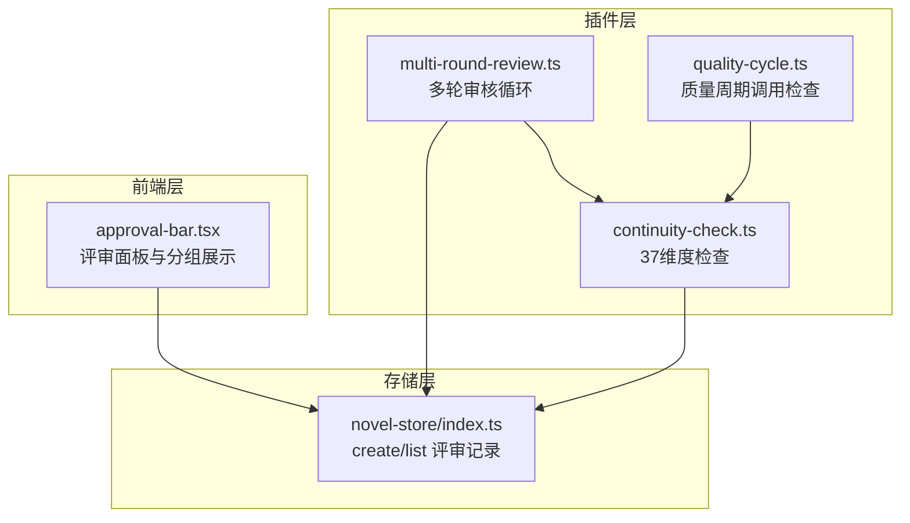
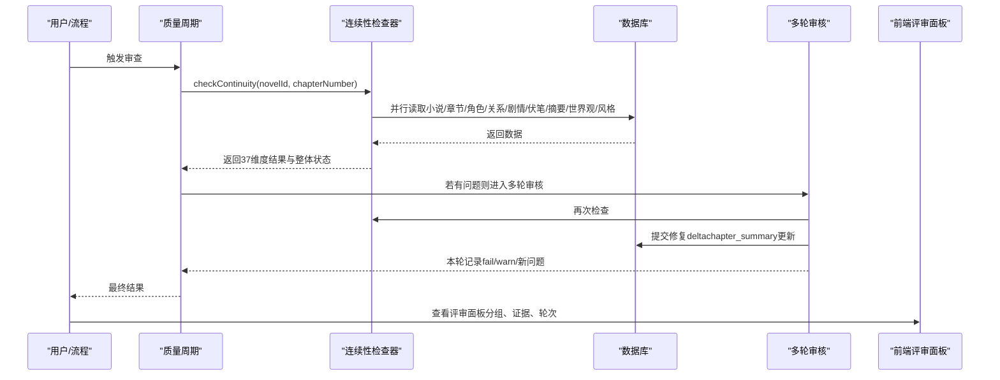
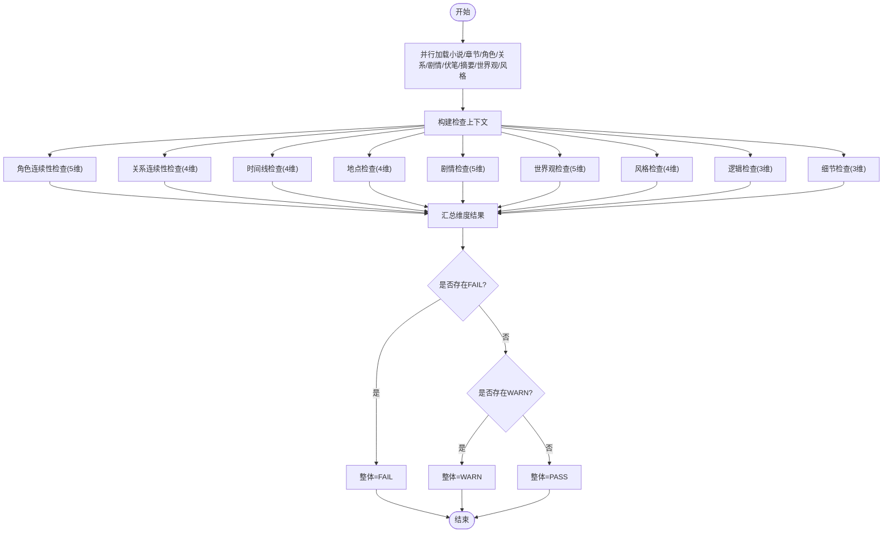
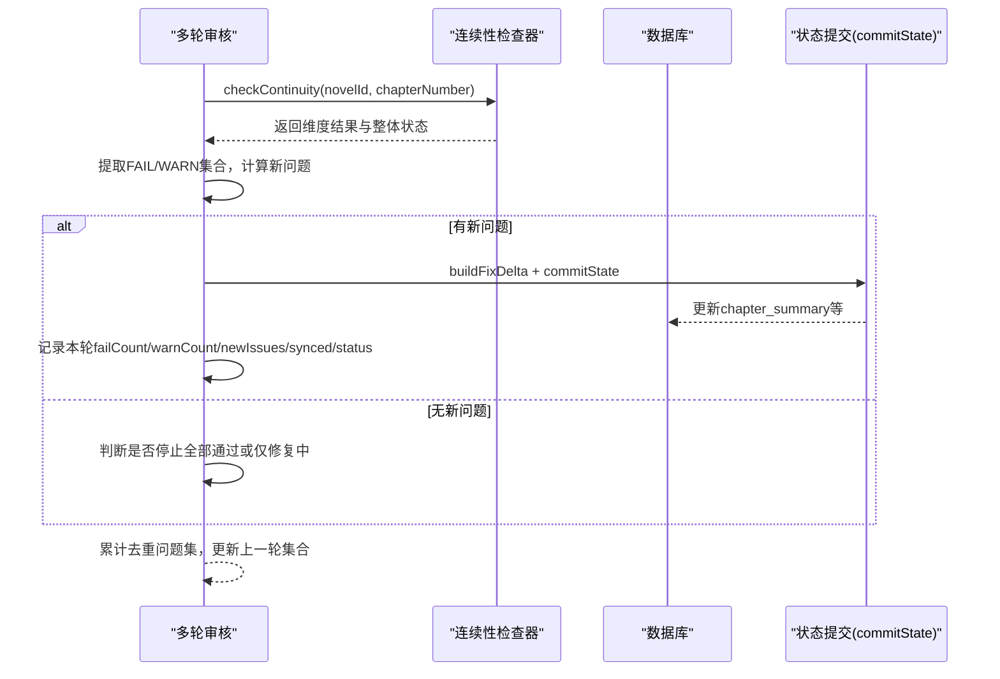
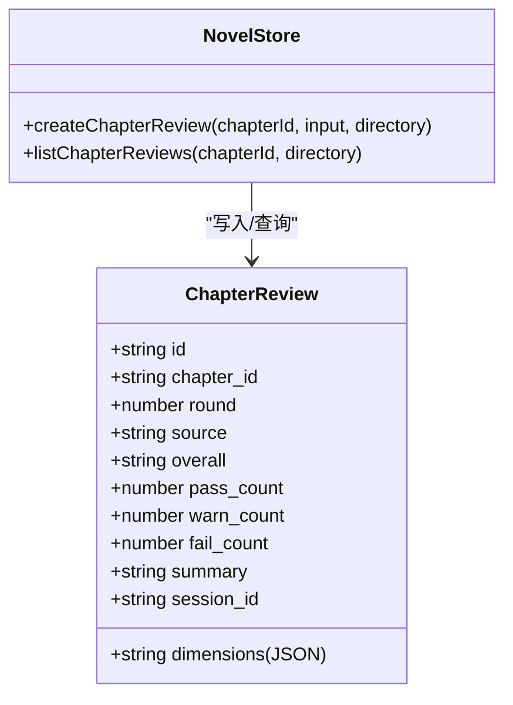
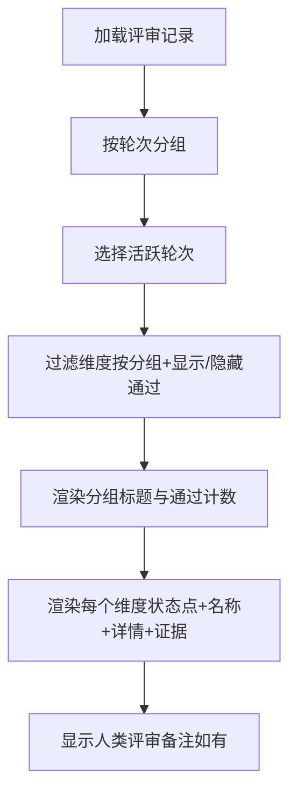
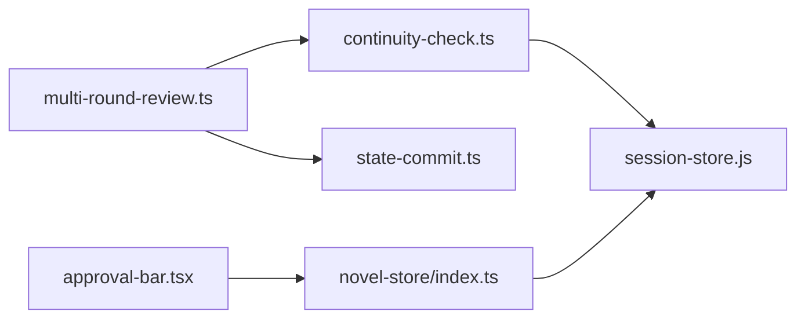

# 37维度连续性审查系统

<cite>
**本文引用的文件**   
- [continuity-check.ts](file://packages/plugin/src/novel-writer/continuity-check.ts)
- [multi-round-review.ts](file://packages/plugin/src/novel-writer/multi-round-review.ts)
- [approval-bar.tsx](file://packages/app/src/pages/novel/approval-bar.tsx)
- [index.ts（novel-store）](file://packages/novel-store/src/index.ts)
- [review.test.ts](file://packages/plugin/test/novel-writer/review.test.ts)
- [novel.test.ts（server测试）](file://packages/server/test/novel.test.ts)
- [e2e.test.ts](file://packages/plugin/test/novel-writer/e2e.test.ts)
- [AGENTS.md](file://packages/plugin/AGENTS.md)
</cite>

## 目录
1. [简介](#简介)
2. [项目结构](#项目结构)
3. [核心组件](#核心组件)
4. [架构总览](#架构总览)
5. [详细组件分析](#详细组件分析)
6. [依赖关系分析](#依赖关系分析)
7. [性能考量](#性能考量)
8. [故障排查指南](#故障排查指南)
9. [结论](#结论)
10. [附录](#附录)

## 简介
本文件为 openNovel 的“37维度连续性审查系统”提供系统化、可操作的文档。该系统在每章写作后，基于角色一致性、时间线连贯性、情节逻辑、设定冲突检测等九大类共37个维度进行自动化审查，输出结构化结果与证据，支持多轮迭代修复与人工审批，并在前端以可视化方式展示问题定位与修复建议。

## 项目结构
围绕审查系统的核心代码分布在插件层、存储层与前端展示层：
- 插件层：实现37维规则检查、多轮审核循环、状态提交与持久化。
- 存储层：章节评审记录的创建与查询，自动推导评审轮次与计数统计。
- 前端层：按9大分组渲染37维度结果，支持筛选通过项、查看证据、切换轮次。

**图表来源** 
- [continuity-check.ts:149-232](file://packages/plugin/src/novel-writer/continuity-check.ts#L149-L232)
- [multi-round-review.ts:170-308](file://packages/plugin/src/novel-writer/multi-round-review.ts#L170-L308)
- [index.ts（novel-store）:968-1023](file://packages/novel-store/src/index.ts#L968-L1023)
- [approval-bar.tsx:41-52](file://packages/app/src/pages/novel/approval-bar.tsx#L41-L52)

**章节来源**
- [continuity-check.ts:149-232](file://packages/plugin/src/novel-writer/continuity-check.ts#L149-L232)
- [multi-round-review.ts:170-308](file://packages/plugin/src/novel-writer/multi-round-review.ts#L170-L308)
- [index.ts（novel-store）:968-1023](file://packages/novel-store/src/index.ts#L968-L1023)
- [approval-bar.tsx:41-52](file://packages/app/src/pages/novel/approval-bar.tsx#L41-L52)

## 核心组件
- 37维度检查器：从数据库并行读取小说、章节、角色、关系、剧情线索、伏笔、摘要、世界观、风格指南等数据，执行九大类37个维度的启发式检查，汇总整体结果（PASS/WARN/FAIL）。
- 多轮审核循环：循环执行审计→提取问题→生成修复delta→同步到DB与Markdown→记录日志，直到无新问题或达到最大轮次。
- 评审持久化：写入章节评审记录，自动推导轮次（round），统计各状态数量，支持按章节查询最新在前。
- 前端评审面板：将37维度按9大类分组展示，支持显示/隐藏通过项、查看证据、切换轮次、查看人类评审备注。

**章节来源**
- [continuity-check.ts:61-111](file://packages/plugin/src/novel-writer/continuity-check.ts#L61-L111)
- [continuity-check.ts:149-232](file://packages/plugin/src/novel-writer/continuity-check.ts#L149-L232)
- [multi-round-review.ts:170-308](file://packages/plugin/src/novel-writer/multi-round-review.ts#L170-L308)
- [index.ts（novel-store）:968-1023](file://packages/novel-store/src/index.ts#L968-L1023)
- [approval-bar.tsx:41-52](file://packages/app/src/pages/novel/approval-bar.tsx#L41-L52)

## 架构总览
审查系统的数据流与控制流如下：
- 触发点：章节完成或人工触发，进入质量周期或直接调用检查。
- 检查阶段：并行读取相关表，执行37维度检查，返回整体与各维度结果。
- 多轮迭代：若存在新发现问题，生成修复delta并同步；否则停止。
- 持久化：评审结果写入数据库，包含轮次、来源、计数、维度详情与证据。
- 展示：前端按分组渲染，支持交互筛选与证据定位。

**图表来源** 
- [continuity-check.ts:149-232](file://packages/plugin/src/novel-writer/continuity-check.ts#L149-L232)
- [multi-round-review.ts:170-308](file://packages/plugin/src/novel-writer/multi-round-review.ts#L170-L308)
- [index.ts（novel-store）:968-1023](file://packages/novel-store/src/index.ts#L968-L1023)
- [approval-bar.tsx:71-241](file://packages/app/src/pages/novel/approval-bar.tsx#L71-L241)

## 详细组件分析

### 37维度检查器（continuity-check.ts）
- 维度分类与名称常量：定义九大类37个维度名称，确保前后端一致。
- 主函数checkContinuity：并行查询所有相关数据，构建上下文，依次执行九类检查，汇总整体状态。
- 各类检查要点：
  - 角色连续性（5维）：姓名一致性、外貌描述、性格一致、能力等级、位置连续。
  - 关系连续性（4维）：关系类型一致、敌友转变有因、亲密度变化、信任度变化。
  - 时间线（4维）：事件顺序、时间流逝合理、季节一致、年龄变化。
  - 地点（4维）：地点描述一致、距离合理、环境细节、地图一致。
  - 剧情（5维）：主线推进、伏笔回收、冲突升级、转折合理、结局呼应。
  - 世界观（5维）：力量体系、规则一致、社会结构、文化细节、经济系统。
  - 风格（4维）：叙事视角、语言风格、节奏一致、描写密度。
  - 逻辑（3维）：因果链、动机合理、信息对称。
  - 细节（3维）：物品追踪、数字一致、称呼一致。
- 辅助分析：情绪突变检测、位置跳变检测、关系冲突对检测、名称一致性、信息对称性等。

**图表来源** 
- [continuity-check.ts:149-232](file://packages/plugin/src/novel-writer/continuity-check.ts#L149-L232)
- [continuity-check.ts:234-1200](file://packages/plugin/src/novel-writer/continuity-check.ts#L234-L1200)

**章节来源**
- [continuity-check.ts:61-111](file://packages/plugin/src/novel-writer/continuity-check.ts#L61-L111)
- [continuity-check.ts:149-232](file://packages/plugin/src/novel-writer/continuity-check.ts#L149-L232)
- [continuity-check.ts:234-1200](file://packages/plugin/src/novel-writer/continuity-check.ts#L234-L1200)

### 多轮审核循环（multi-round-review.ts）
- 目标：循环执行审计→修复→同步→日志，直到无新问题或达到最大轮次。
- 关键流程：
  - 解析章节序号，执行连续性检查。
  - 提取FAIL/WARN维度集合，计算新增问题。
  - 若无新问题且仍有旧问题，视为修复中；若全通过则停止。
  - 生成修复delta（chapter_summary更新），调用commitState同步DB与Markdown。
  - 记录本轮状态与日志，更新上一轮集合。
- 输出：多轮结果包含轮次、时间戳、计数、新问题列表、是否已同步、最终状态与停止原因。

**图表来源** 
- [multi-round-review.ts:170-308](file://packages/plugin/src/novel-writer/multi-round-review.ts#L170-L308)

**章节来源**
- [multi-round-review.ts:170-308](file://packages/plugin/src/novel-writer/multi-round-review.ts#L170-L308)

### 评审持久化与查询（novel-store/index.ts）
- createChapterReview：写入评审记录，自动推导轮次（round）：若章节更新时间晚于最近评审创建时间，则开启新一轮；否则并入当前轮。统计pass/warn/fail计数，JSON存储维度详情与证据。
- listChapterReviews：按章节查询评审记录，最新在前。

**图表来源** 
- [index.ts（novel-store）:968-1023](file://packages/novel-store/src/index.ts#L968-L1023)

**章节来源**
- [index.ts（novel-store）:968-1023](file://packages/novel-store/src/index.ts#L968-L1023)

### 前端评审面板（approval-bar.tsx）
- 分组映射：将37维度按9大类分组，维度名与插件常量逐字对应。
- 展示逻辑：
  - 轮次选择：支持切换不同轮次的评审记录。
  - 总体状态：根据overall显示成功/警告/失败标签。
  - 计数与来源：显示pass/warn/fail计数与来源（deterministic/auditor/human）。
  - 维度列表：按分组展示，支持隐藏通过项，显示detail与evidence。
  - 人类评审备注：单独展示human来源的评审意见。

**图表来源** 
- [approval-bar.tsx:41-52](file://packages/app/src/pages/novel/approval-bar.tsx#L41-L52)
- [approval-bar.tsx:71-241](file://packages/app/src/pages/novel/approval-bar.tsx#L71-L241)

**章节来源**
- [approval-bar.tsx:41-52](file://packages/app/src/pages/novel/approval-bar.tsx#L41-L52)
- [approval-bar.tsx:71-241](file://packages/app/src/pages/novel/approval-bar.tsx#L71-L241)

## 依赖关系分析
- 插件层依赖：
  - continuity-check.ts 依赖 session-store（drizzle-orm/bun-sqlite）进行数据读取。
  - multi-round-review.ts 依赖 continuity-check.ts 与 state-commit.ts 进行状态同步。
- 存储层依赖：
  - novel-store/index.ts 使用 drizzle-orm 进行数据库操作。
- 前端层依赖：
  - approval-bar.tsx 依赖 SDK 与查询上下文获取评审数据。

**图表来源** 
- [continuity-check.ts:16-30](file://packages/plugin/src/novel-writer/continuity-check.ts#L16-L30)
- [multi-round-review.ts:15-20](file://packages/plugin/src/novel-writer/multi-round-review.ts#L15-L20)
- [index.ts（novel-store）:968-1023](file://packages/novel-store/src/index.ts#L968-L1023)
- [approval-bar.tsx:1-10](file://packages/app/src/pages/novel/approval-bar.tsx#L1-L10)

**章节来源**
- [continuity-check.ts:16-30](file://packages/plugin/src/novel-writer/continuity-check.ts#L16-L30)
- [multi-round-review.ts:15-20](file://packages/plugin/src/novel-writer/multi-round-review.ts#L15-L20)
- [index.ts（novel-store）:968-1023](file://packages/novel-store/src/index.ts#L968-L1023)
- [approval-bar.tsx:1-10](file://packages/app/src/pages/novel/approval-bar.tsx#L1-L10)

## 性能考量
- 并行查询：连续性检查器对多个表进行并行查询，减少I/O等待。
- 增量修复：多轮审核仅处理新问题，避免重复工作。
- 数据裁剪：仅加载与当前小说相关的记录，降低内存占用。
- 前端优化：支持隐藏通过项，减少渲染压力。

[本节为通用指导，不直接分析具体文件]

## 故障排查指南
- 常见问题：
  - 章节不存在：createChapterReview会抛出“未找到章节”错误。
  - 维度名称无效：提交时校验维度是否在37维清单中，非法将被拒绝。
  - 轮次推导异常：若章节更新时间早于最近评审创建时间，评审将并入当前轮。
- 调试建议：
  - 查看多轮审核日志，确认每轮的新问题与同步状态。
  - 检查数据库中的评审记录，确认计数与维度详情是否正确。
  - 前端面板切换轮次，验证证据与详情是否匹配。

**章节来源**
- [review.test.ts:67-133](file://packages/plugin/test/novel-writer/review.test.ts#L67-L133)
- [novel.test.ts（server测试）:229-266](file://packages/server/test/novel.test.ts#L229-L266)
- [e2e.test.ts:512-513](file://packages/plugin/test/novel-writer/e2e.test.ts#L512-L513)

## 结论
37维度连续性审查系统通过结构化规则、并行检查、多轮迭代与可视化展示，为长篇小说创作提供了可靠的连续性保障。其模块化设计便于扩展新维度与调整阈值，前端友好地呈现问题定位与修复建议，提升了创作效率与作品质量。

[本节为总结，不直接分析具体文件]

## 附录

### 自定义审查规则与权重/阈值
- 添加新维度：在continuity-check.ts的CONTINUITY_DIMENSIONS中添加维度名称，并在对应类别检查函数中实现逻辑。
- 调整阈值：修改各类检查中的判定条件（如比例、次数、关键词匹配等），例如伏笔回收比例、字数偏离阈值等。
- 权重机制：当前系统未显式实现维度权重，可通过多轮审核的stopReason与finalStatus间接控制优先级。

**章节来源**
- [continuity-check.ts:61-111](file://packages/plugin/src/novel-writer/continuity-check.ts#L61-L111)
- [continuity-check.ts:746-771](file://packages/plugin/src/novel-writer/continuity-check.ts#L746-L771)
- [continuity-check.ts:1013-1039](file://packages/plugin/src/novel-writer/continuity-check.ts#L1013-L1039)

### 配置示例与性能调优
- 配置示例：参考AGENTS.md中关于continuity-check模块的说明，确保新增维度在正确位置实现。
- 性能调优：
  - 增加数据库索引（如chapter_id、novel_id）以提升查询速度。
  - 限制并行查询数量，避免过载。
  - 前端按需加载评审记录，减少初始负载。

**章节来源**
- [AGENTS.md:35-47](file://packages/plugin/AGENTS.md#L35-L47)