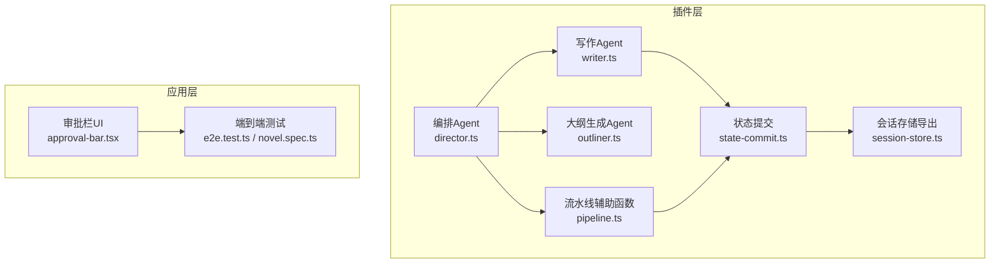
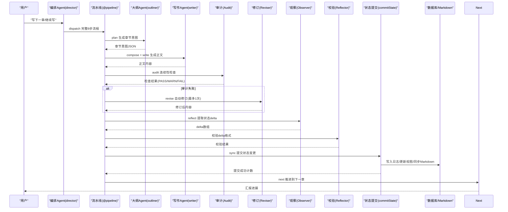
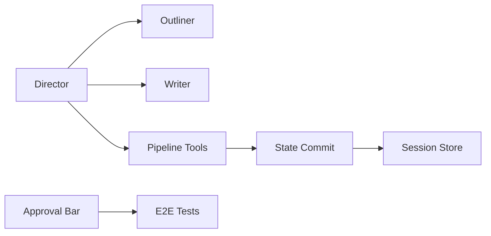

# 8步写作流水线

<cite>
**本文引用的文件**   
- [pipeline.ts](file://packages/plugin/src/novel-writer/pipeline.ts)
- [director.ts](file://packages/plugin/src/novel-writer/agents/director.ts)
- [outliner.ts](file://packages/plugin/src/novel-writer/agents/outliner.ts)
- [writer.ts](file://packages/plugin/src/novel-writer/agents/writer.ts)
- [state-commit.ts](file://packages/plugin/src/novel-writer/state-commit.ts)
- [session-store.ts](file://packages/plugin/src/novel-writer/session-store.ts)
- [approval-bar.tsx](file://packages/app/src/pages/novel/approval-bar.tsx)
- [novel.spec.ts](file://packages/app/e2e/novel.spec.ts)
- [e2e.test.ts](file://packages/plugin/test/novel-writer/e2e.test.ts)
- [review.test.ts](file://packages/plugin/test/novel-writer/review.test.ts)
</cite>

## 目录
1. [简介](#简介)
2. [项目结构](#项目结构)
3. [核心组件](#核心组件)
4. [架构总览](#架构总览)
5. [详细组件分析](#详细组件分析)
6. [依赖关系分析](#依赖关系分析)
7. [性能考量](#性能考量)
8. [故障排查指南](#故障排查指南)
9. [结论](#结论)
10. [附录](#附录)

## 简介
本文件为 openNovel 的“8步写作流水线”提供系统化、可操作的文档。该流水线围绕章节创作与一致性保障展开，涵盖从大纲规划到版本提交与章节推进的全流程，并通过确定性审查与状态提取机制确保内容质量与数据一致性。读者将了解：
- 每个步骤的职责、输入输出、错误处理与重试策略
- 步骤间的数据传递与状态持久化
- 配置项、扩展点与性能优化建议
- 与 AI 服务（子 agent）的集成方式与提示工程要点
- 调用与定制流水线的具体示例路径

## 项目结构
openNovel 的写作流水线位于 plugin 包中，由编排 Agent、子 Agent、工具函数与状态提交模块组成；前端通过审批栏与 e2e 测试验证端到端流程。

图表来源 
- [director.ts:1-155](file://packages/plugin/src/novel-writer/agents/director.ts#L1-L155)
- [pipeline.ts:1-131](file://packages/plugin/src/novel-writer/pipeline.ts#L1-L131)
- [outliner.ts:1-95](file://packages/plugin/src/novel-writer/agents/outliner.ts#L1-L95)
- [writer.ts:1-136](file://packages/plugin/src/novel-writer/agents/writer.ts#L1-L136)
- [state-commit.ts:1-800](file://packages/plugin/src/novel-writer/state-commit.ts#L1-L800)
- [session-store.ts:1-2](file://packages/plugin/src/novel-writer/session-store.ts#L1-L2)
- [approval-bar.tsx:1-39](file://packages/app/src/pages/novel/approval-bar.tsx#L1-L39)
- [e2e.test.ts:414-480](file://packages/plugin/test/novel-writer/e2e.test.ts#L414-L480)
- [novel.spec.ts:322-351](file://packages/app/e2e/novel.spec.ts#L322-L351)

章节来源
- [director.ts:1-155](file://packages/plugin/src/novel-writer/agents/director.ts#L1-L155)
- [pipeline.ts:1-131](file://packages/plugin/src/novel-writer/pipeline.ts#L1-L131)
- [outliner.ts:1-95](file://packages/plugin/src/novel-writer/agents/outliner.ts#L1-L95)
- [writer.ts:1-136](file://packages/plugin/src/novel-writer/agents/writer.ts#L1-L136)
- [state-commit.ts:1-800](file://packages/plugin/src/novel-writer/state-commit.ts#L1-L800)
- [session-store.ts:1-2](file://packages/plugin/src/novel-writer/session-store.ts#L1-L2)
- [approval-bar.tsx:1-39](file://packages/app/src/pages/novel/approval-bar.tsx#L1-L39)
- [e2e.test.ts:414-480](file://packages/plugin/test/novel-writer/e2e.test.ts#L414-L480)
- [novel.spec.ts:322-351](file://packages/app/e2e/novel.spec.ts#L322-L351)

## 核心组件
- 编排 Agent（Director）：理解用户意图，调度 @pipeline、@writer、@architect、@auditor、@reviser、@librarian、@observer、@reflector 等子 Agent 和工具，管理整体进度与级联统改门禁。
- 大纲生成 Agent（Outliner）：基于上下文快照生成章节创作意图，规划场景、角色焦点与剧情推进方向。
- 写作 Agent（Writer）：根据大纲与上下文生成符合网文规范的正文，遵循严格的节奏、钩子、题材规范与字数控制，并调用写入工具完成持久化。
- 流水线辅助函数（Pipeline Tools）：提供校验小说存在性、读取章节大纲、验证与提交状态变更等确定性工具。
- 状态提交（State Commit）：将 delta 写入 append-only 日志、更新物化视图、同步 Markdown，并触发级联统改任务。
- 会话存储（Session Store）：统一导出数据库表结构与查询能力。

章节来源
- [director.ts:1-155](file://packages/plugin/src/novel-writer/agents/director.ts#L1-L155)
- [outliner.ts:1-95](file://packages/plugin/src/novel-writer/agents/outliner.ts#L1-L95)
- [writer.ts:1-136](file://packages/plugin/src/novel-writer/agents/writer.ts#L1-L136)
- [pipeline.ts:1-131](file://packages/plugin/src/novel-writer/pipeline.ts#L1-L131)
- [state-commit.ts:1-800](file://packages/plugin/src/novel-writer/state-commit.ts#L1-L800)
- [session-store.ts:1-2](file://packages/plugin/src/novel-writer/session-store.ts#L1-L2)

## 架构总览
8步写作流水线在编排层由 director 调度 @pipeline 子 Agent 执行，步骤包括：计划（plan）、上下文组装（compose）、草稿撰写（write）、连续性审查（audit）、修订完善（revise）、状态提取（reflect）、版本提交（sync）、章节推进（next）。各步骤之间通过结构化数据与状态日志进行传递与审计。

图表来源 
- [director.ts:1-155](file://packages/plugin/src/novel-writer/agents/director.ts#L1-L155)
- [outliner.ts:1-95](file://packages/plugin/src/novel-writer/agents/outliner.ts#L1-L95)
- [writer.ts:1-136](file://packages/plugin/src/novel-writer/agents/writer.ts#L1-L136)
- [state-commit.ts:1-800](file://packages/plugin/src/novel-writer/state-commit.ts#L1-L800)

## 详细组件分析

### 步骤1：大纲规划（Plan）
- 职责：读取或生成章节大纲，明确目标、关键场景、角色出场与剧情推进点。
- 输入：小说ID、章节序号、上下文快照（P0-P4层级）。
- 处理：Outliner 基于快照与作者意图生成章节创作意图（JSON），包含场景编排、角色焦点、剧情推进与连续性衔接。
- 输出：章节意图 JSON，供后续步骤使用。
- 错误处理：若上下文不足，返回空意图并提示补充信息。
- 重试策略：仅当上下文缺失时提示用户补充，不自动重试。

章节来源
- [outliner.ts:1-95](file://packages/plugin/src/novel-writer/agents/outliner.ts#L1-L95)
- [e2e.test.ts:414-480](file://packages/plugin/test/novel-writer/e2e.test.ts#L414-L480)

### 步骤2：上下文组装（Compose）
- 职责：聚合当前活跃角色、卷+章摘要、线索+伏笔、风格+规则，形成完整的上下文快照。
- 输入：小说ID、章节序号。
- 处理：读取数据库中的角色状态、章节摘要、伏笔、风格指南等，构建 P0-P4 层级快照。
- 输出：ContextPacket 快照对象。
- 错误处理：若某层级缺失，记录警告并降级使用可用数据。
- 重试策略：无自动重试，依赖上游数据完整性。

章节来源
- [director.ts:1-155](file://packages/plugin/src/novel-writer/agents/director.ts#L1-L155)
- [state-commit.ts:1-800](file://packages/plugin/src/novel-writer/state-commit.ts#L1-L800)

### 步骤3：草稿撰写（Write）
- 职责：根据大纲与上下文生成章节正文，严格遵循网文写作规范与字数控制。
- 输入：章节意图、上下文快照、题材模板。
- 处理：Writer 按四段式节拍结构生成内容，自检重复与字数，调用写入工具持久化。
- 输出：章节正文与写入结果。
- 错误处理：字数不达标/超限或与前文重复时拒绝写入，需重写后重试。
- 重试策略：最多一次自动修订（见步骤5），否则提示人工干预。

章节来源
- [writer.ts:1-136](file://packages/plugin/src/novel-writer/agents/writer.ts#L1-L136)
- [e2e.test.ts:444-480](file://packages/plugin/test/novel-writer/e2e.test.ts#L444-L480)

### 步骤4：连续性审查（Audit）
- 职责：对草稿进行确定性连续性检查，覆盖多维度一致性（如角色名、因果链、伏笔等）。
- 输入：章节ID、草稿内容。
- 处理：checkContinuity 返回维度检查结果与章节ID，用于评审持久化。
- 输出：评审结果（PASS/WARN/FAIL）与维度明细。
- 错误处理：章节不存在时抛错；维度统计按状态计数。
- 重试策略：失败进入修订阶段（步骤5）。

章节来源
- [review.test.ts:63-151](file://packages/plugin/test/novel-writer/review.test.ts#L63-L151)
- [e2e.test.ts:444-480](file://packages/plugin/test/novel-writer/e2e.test.ts#L444-L480)

### 步骤5：修订完善（Revise）
- 职责：针对审计失败的问题进行针对性修订，最多一次自动修订。
- 输入：审计失败原因、章节ID、上下文。
- 处理：Reviser 根据问题定位修改内容，重新调用写入工具。
- 输出：修订后的正文与写入结果。
- 错误处理：若仍失败，退回人工审核。
- 重试策略：限一次自动修订，避免无限循环。

章节来源
- [director.ts:1-155](file://packages/plugin/src/novel-writer/agents/director.ts#L1-L155)

### 步骤6：状态提取（Reflect）
- 职责：从章节内容提取事实类型（角色、关系、伏笔、世界条目等）的 delta。
- 输入：章节ID、正文内容。
- 处理：Observer 生成结构化 delta，Reflector 校验格式与完整性。
- 输出：StateDelta 数组。
- 错误处理：格式非法时拒绝提交。
- 重试策略：修正 delta 后重试。

章节来源
- [state-commit.ts:1-800](file://packages/plugin/src/novel-writer/state-commit.ts#L1-L800)

### 步骤7：版本提交（Sync）
- 职责：将 delta 写入 append-only 日志、更新物化视图、同步 Markdown，并触发级联统改任务。
- 输入：小说ID、章节ID、delta 数组。
- 处理：commitState 解析实体ID、去重、插入/更新/删除、清理本章快照、同步 Markdown。
- 输出：提交成功计数。
- 错误处理：幂等替换、字段回退、异常捕获。
- 重试策略：事务性写入，失败回滚并重试。

章节来源
- [state-commit.ts:1-800](file://packages/plugin/src/novel-writer/state-commit.ts#L1-L800)
- [pipeline.ts:1-131](file://packages/plugin/src/novel-writer/pipeline.ts#L1-L131)

### 步骤8：章节推进（Next）
- 职责：推进到下一章，更新状态与进度。
- 输入：当前章节ID、小说ID。
- 处理：更新章节顺序、状态标记，准备下一轮流水线。
- 输出：下一章就绪信号。
- 错误处理：章节不存在时抛错。
- 重试策略：无自动重试，需用户确认。

章节来源
- [director.ts:1-155](file://packages/plugin/src/novel-writer/agents/director.ts#L1-L155)

## 依赖关系分析
- 编排层依赖：Director 依赖 Outliner、Writer、Auditor、Reviser、Observer、Reflector 等子 Agent。
- 工具层依赖：Pipeline Tools 依赖 Session Store 与 State Commit。
- 数据层依赖：State Commit 依赖 Drizzle ORM 与多张物化视图表。
- 前端依赖：Approval Bar 依赖 Novel Queries 与 SDK，展示审批状态。

图表来源 
- [director.ts:1-155](file://packages/plugin/src/novel-writer/agents/director.ts#L1-L155)
- [pipeline.ts:1-131](file://packages/plugin/src/novel-writer/pipeline.ts#L1-L131)
- [state-commit.ts:1-800](file://packages/plugin/src/novel-writer/state-commit.ts#L1-L800)
- [session-store.ts:1-2](file://packages/plugin/src/novel-writer/session-store.ts#L1-L2)
- [approval-bar.tsx:1-39](file://packages/app/src/pages/novel/approval-bar.tsx#L1-L39)

章节来源
- [director.ts:1-155](file://packages/plugin/src/novel-writer/agents/director.ts#L1-L155)
- [pipeline.ts:1-131](file://packages/plugin/src/novel-writer/pipeline.ts#L1-L131)
- [state-commit.ts:1-800](file://packages/plugin/src/novel-writer/state-commit.ts#L1-L800)
- [session-store.ts:1-2](file://packages/plugin/src/novel-writer/session-store.ts#L1-L2)
- [approval-bar.tsx:1-39](file://packages/app/src/pages/novel/approval-bar.tsx#L1-L39)

## 性能考量
- 幂等写入：resetChapterScopedState 保证一章一份语义，避免重复快照。
- 实体去重：resolveEntityId 与 resolveCharacterId 减少冗余创建。
- 批量操作：commitState 遍历 delta 批量更新，减少 IO 次数。
- 缓存策略：物化视图提升查询性能，避免实时计算。
- 限制重试：修订阶段限一次，防止无限循环。
- 异步处理：长耗时操作（如级联统改）采用 Saga 模式，解除门禁后再执行。

[本节为通用指导，无需特定文件引用]

## 故障排查指南
- 章节不存在：validateStateDelta 与 persistStateDelta 会返回 fail 状态与消息。
- 内容重复：Writer 拒绝写入重复片段，需重写后重试。
- 字数不达标：低于目标或超过 130% 会被拒绝，需调整内容。
- 审计失败：进入修订阶段，若仍失败则退回人工审核。
- 级联门禁：有 pending_updates 时，write_chapter 与 revise_chapter 被拦截，需先 cascade_execute 处理。

章节来源
- [pipeline.ts:1-131](file://packages/plugin/src/novel-writer/pipeline.ts#L1-L131)
- [writer.ts:1-136](file://packages/plugin/src/novel-writer/agents/writer.ts#L1-L136)
- [review.test.ts:63-151](file://packages/plugin/test/novel-writer/review.test.ts#L63-L151)

## 结论
8步写作流水线通过编排 Agent 与子 Agent 协作，结合确定性审查与状态提交机制，实现了高质量、一致性的章节创作流程。其模块化设计便于扩展与定制，配合前端审批与 e2e 测试，保障了端到端的可靠性与用户体验。

[本节为总结，无需特定文件引用]

## 附录

### 配置选项
- 题材模板：不同题材（玄幻、仙侠、都市等）对应不同的力量体系与金手指类型。
- 字数控制：默认 2500 字，允许超出但不超过 130%。
- 钩子轮换：四种钩子类型轮换使用，避免连续重复。
- 级联统改：启用后需先处理 pending 任务再写作。

章节来源
- [writer.ts:1-136](file://packages/plugin/src/novel-writer/agents/writer.ts#L1-L136)
- [director.ts:1-155](file://packages/plugin/src/novel-writer/agents/director.ts#L1-L155)

### 自定义扩展点
- 新增子 Agent：在 director 中添加路由策略与系统提示。
- 扩展事实类型：在 state-commit 中新增 FACT_TYPES 与应用逻辑。
- 自定义审查维度：在 auditor 中增加维度检查规则。

章节来源
- [director.ts:1-155](file://packages/plugin/src/novel-writer/agents/director.ts#L1-L155)
- [state-commit.ts:1-800](file://packages/plugin/src/novel-writer/state-commit.ts#L1-L800)

### 性能优化建议
- 使用物化视图加速查询。
- 批量写入与事务处理。
- 限制重试次数，避免死循环。
- 异步处理长耗时任务。

[本节为通用指导，无需特定文件引用]

### 调用与定制示例
- 调用流水线：通过 director 调度 @pipeline 子 Agent，传入 novelId 与章节序号。
- 定制大纲：使用 outliner 生成章节意图，再通过工具持久化。
- 定制写作：使用 writer 生成正文，调用 write_chapter 工具写入。
- 定制审查：使用 auditor 检查连续性，必要时调用 reviser 修订。

章节来源
- [director.ts:1-155](file://packages/plugin/src/novel-writer/agents/director.ts#L1-L155)
- [e2e.test.ts:414-480](file://packages/plugin/test/novel-writer/e2e.test.ts#L414-L480)

### 与 AI 服务的集成与提示工程最佳实践
- 子 Agent 系统提示：明确职责、约束与输出格式。
- 意图识别与路由：director 负责理解用户意图并调度合适子 Agent。
- 上下文传递：确保子 Agent 获得完整上下文快照。
- 结果整合：director 汇总子 Agent 输出并向用户汇报。

章节来源
- [director.ts:1-155](file://packages/plugin/src/novel-writer/agents/director.ts#L1-L155)
- [outliner.ts:1-95](file://packages/plugin/src/novel-writer/agents/outliner.ts#L1-L95)
- [writer.ts:1-136](file://packages/plugin/src/novel-writer/agents/writer.ts#L1-L136)