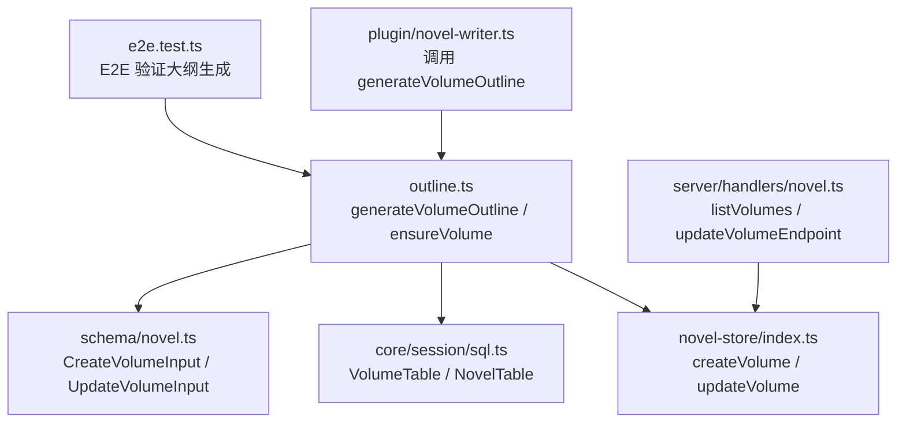
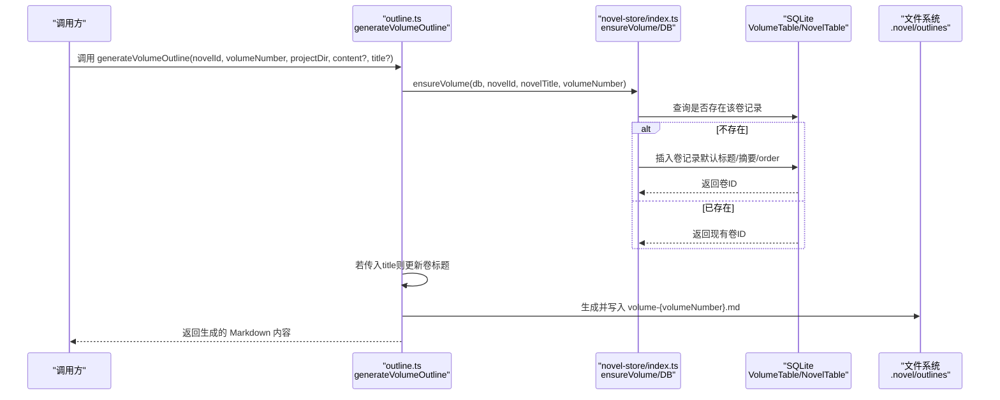
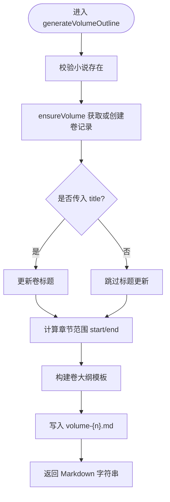
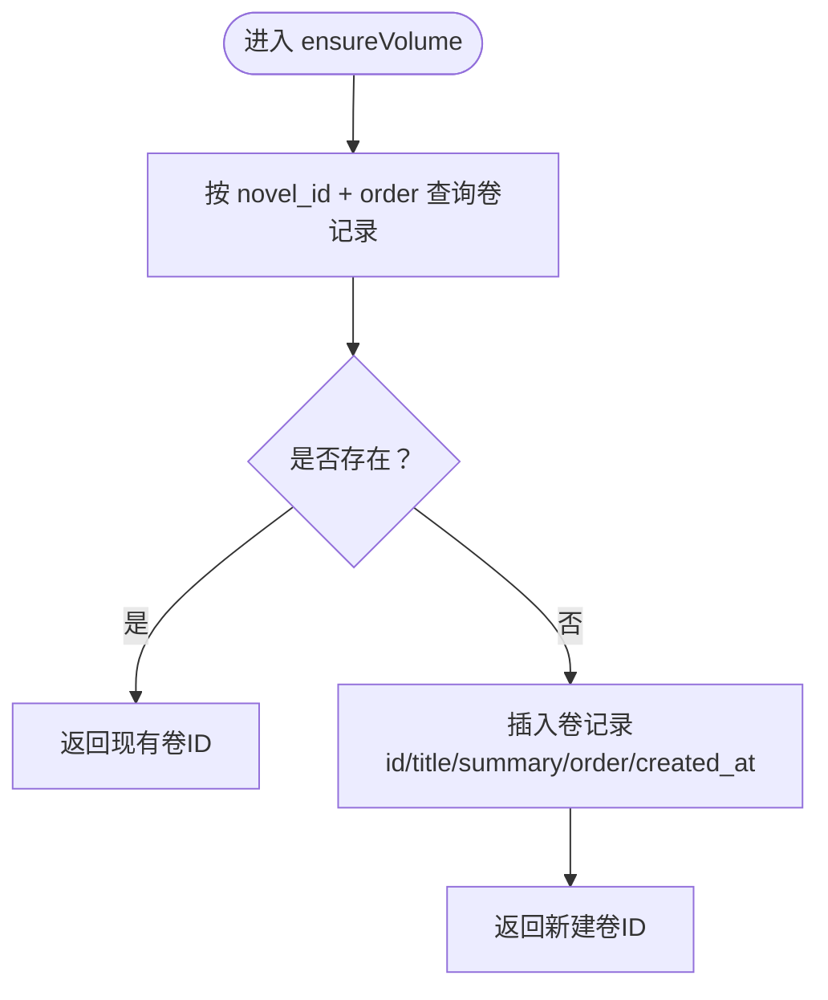
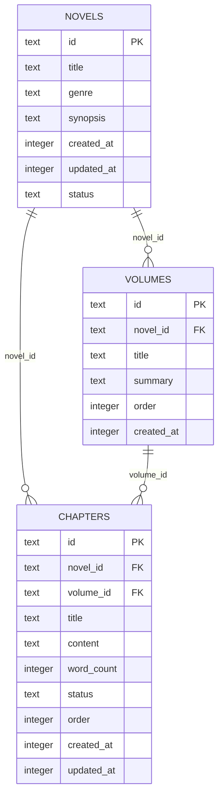
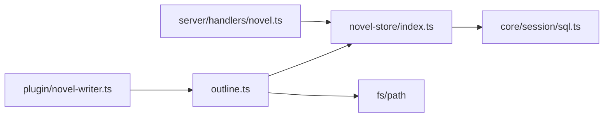

# 卷大纲生成

<cite>
**本文引用的文件**   
- [outline.ts](file://packages/plugin/src/novel-writer/outline.ts)
- [novel-store/index.ts](file://packages/novel-store/src/index.ts)
- [core/session/sql.ts](file://packages/core/src/session/sql.ts)
- [schema/novel.ts](file://packages/schema/src/novel.ts)
- [server/handlers/novel.ts](file://packages/server/src/handlers/novel.ts)
- [plugin/novel-writer.ts](file://packages/plugin/src/novel-writer.ts)
- [e2e.test.ts](file://packages/plugin/test/novel-writer/e2e.test.ts)
</cite>

## 目录
1. [简介](#简介)
2. [项目结构](#项目结构)
3. [核心组件](#核心组件)
4. [架构总览](#架构总览)
5. [详细组件分析](#详细组件分析)
6. [依赖分析](#依赖分析)
7. [性能考虑](#性能考虑)
8. [故障排查指南](#故障排查指南)
9. [结论](#结论)
10. [附录](#附录)

## 简介
本文件为 openNovel 的“卷大纲生成”功能提供完整技术文档，聚焦 generateVolumeOutline 函数的实现与调用方式，解释 ensureVolume 辅助函数如何确保卷记录存在或创建新记录，说明卷大纲模板的结构（本卷主题、章节列表、关键事件），阐述 CHAPTERS_PER_VOLUME 常量与卷号计算公式的作用，梳理数据库操作（VolumeTable 插入/更新）以及与 NovelTable 的关联关系，并提供完整的调用示例（参数、返回值、错误处理）、卷标题自定义与状态同步机制。

## 项目结构
围绕“卷大纲生成”的相关代码主要分布在以下模块：
- 插件层（逻辑实现）：packages/plugin/src/novel-writer/outline.ts
- 存储层（DB 访问）：packages/novel-store/src/index.ts
- 数据模型（表定义）：packages/core/src/session/sql.ts
- 类型与输入输出模式：packages/schema/src/novel.ts
- 服务端接口封装：packages/server/src/handlers/novel.ts
- 插件入口与编排：packages/plugin/src/novel-writer.ts
- 端到端测试用例：packages/plugin/test/novel-writer/e2e.test.ts

图表来源
- [outline.ts:184-270](file://packages/plugin/src/novel-writer/outline.ts#L184-L270)
- [novel-store/index.ts:507-535](file://packages/novel-store/src/index.ts#L507-L535)
- [core/session/sql.ts:202-220](file://packages/core/src/session/sql.ts#L202-L220)
- [schema/novel.ts:262-272](file://packages/schema/src/novel.ts#L262-L272)
- [server/handlers/novel.ts:424-437](file://packages/server/src/handlers/novel.ts#L424-L437)
- [plugin/novel-writer.ts:581-585](file://packages/plugin/src/novel-writer.ts#L581-L585)
- [e2e.test.ts:429-436](file://packages/plugin/test/novel-writer/e2e.test.ts#L429-L436)

章节来源
- [outline.ts:1-429](file://packages/plugin/src/novel-writer/outline.ts#L1-L429)
- [novel-store/index.ts:507-535](file://packages/novel-store/src/index.ts#L507-L535)
- [core/session/sql.ts:202-220](file://packages/core/src/session/sql.ts#L202-L220)
- [schema/novel.ts:262-272](file://packages/schema/src/novel.ts#L262-L272)
- [server/handlers/novel.ts:424-437](file://packages/server/src/handlers/novel.ts#L424-L437)
- [plugin/novel-writer.ts:581-585](file://packages/plugin/src/novel-writer.ts#L581-L585)
- [e2e.test.ts:429-436](file://packages/plugin/test/novel-writer/e2e.test.ts#L429-L436)

## 核心组件
- generateVolumeOutline：生成某卷的大纲 Markdown 并写入 .novel/outlines/volume-{n}.md；同时通过 ensureVolume 保证 DB 中卷记录存在，并在传入 title 时更新卷标题。
- ensureVolume：根据 novelId 和 volumeNumber 查询是否已有卷记录；不存在则创建默认标题与摘要，返回卷 ID。
- CHAPTERS_PER_VOLUME：每卷默认章节数（50），用于计算卷号与章节范围。
- chapterToVolumeNumber：由章节编号推导所属卷号（向上取整）。
- 存储层 createVolume/updateVolume：在 novel-store 中提供对 VolumeTable 的插入与更新能力。
- 数据模型 VolumeTable/NovelTable：定义卷与小说主表的字段与外键关系。
- Schema 输入类型 CreateVolumeInput/UpdateVolumeInput：约束 API 输入字段。

章节来源
- [outline.ts:21-35](file://packages/plugin/src/novel-writer/outline.ts#L21-L35)
- [outline.ts:38-66](file://packages/plugin/src/novel-writer/outline.ts#L38-L66)
- [outline.ts:184-270](file://packages/plugin/src/novel-writer/outline.ts#L184-L270)
- [novel-store/index.ts:507-535](file://packages/novel-store/src/index.ts#L507-L535)
- [core/session/sql.ts:202-220](file://packages/core/src/session/sql.ts#L202-L220)
- [schema/novel.ts:262-272](file://packages/schema/src/novel.ts#L262-L272)

## 架构总览
下图展示了从上层调用到数据库与文件系统落盘的完整流程，包括卷记录保障、Markdown 生成与持久化。

图表来源
- [outline.ts:184-270](file://packages/plugin/src/novel-writer/outline.ts#L184-L270)
- [outline.ts:38-66](file://packages/plugin/src/novel-writer/outline.ts#L38-L66)
- [novel-store/index.ts:507-535](file://packages/novel-store/src/index.ts#L507-L535)
- [core/session/sql.ts:202-220](file://packages/core/src/session/sql.ts#L202-L220)

## 详细组件分析

### generateVolumeOutline 函数详解
- 职责
  - 校验小说存在性
  - 通过 ensureVolume 确保卷记录存在（必要时创建）
  - 可选更新卷标题（当传入 title 时）
  - 计算章节范围（startChapter/endChapter）
  - 构建卷大纲 Markdown 模板并写入 .novel/outlines/volume-{n}.md
  - 返回生成的 Markdown 字符串
- 关键逻辑
  - 章节范围计算：startChapter = (volumeNumber - 1) * CHAPTERS_PER_VOLUME + 1；endChapter = volumeNumber * CHAPTERS_PER_VOLUME
  - 模板包含：本卷主题（主题句、情感基调）、章节列表（自动填充行）、关键事件（必写事件、伏笔设计、角色弧光）
  - 若传入 content，则以该内容覆盖默认模板；否则使用内置模板
- 错误处理
  - 小说不存在时抛出错误（由调用方捕获）
- 返回值
  - 生成的 Markdown 字符串（包含元信息与模板占位符）

图表来源
- [outline.ts:184-270](file://packages/plugin/src/novel-writer/outline.ts#L184-L270)
- [outline.ts:38-66](file://packages/plugin/src/novel-writer/outline.ts#L38-L66)

章节来源
- [outline.ts:184-270](file://packages/plugin/src/novel-writer/outline.ts#L184-L270)

### ensureVolume 辅助函数详解
- 职责
  - 根据 novelId 与 order=volumeNumber 查询是否已有卷记录
  - 若不存在，则创建卷记录，设置默认标题与摘要（包含章节范围信息）
  - 返回卷 ID
- 关键点
  - 使用 NovelTable 的 id 作为外键关联
  - 默认摘要包含《小说名》第N卷（第X章 - 第Y章）
  - 使用 crypto.randomUUID() 生成唯一 ID
  - created_at 设置为当前时间戳

图表来源
- [outline.ts:38-66](file://packages/plugin/src/novel-writer/outline.ts#L38-L66)

章节来源
- [outline.ts:38-66](file://packages/plugin/src/novel-writer/outline.ts#L38-L66)

### 卷大纲模板结构
- 本卷主题
  - 主题句：用一句话概括本卷主题
  - 情感基调：描述整体情感风格（如热血、悬疑、温情等）
- 章节列表
  - 自动计算章节范围（第 startChapter 章至第 endChapter 章）
  - 表格列：章节、标题、核心事件、字数目标（占位符待填写）
- 关键事件
  - 本卷必写事件：列出必须发生的关键事件
  - 本卷伏笔：埋设内容与预期回收章节
  - 本卷角色弧光：主要角色的起点/终点状态与关键转折

章节来源
- [outline.ts:214-265](file://packages/plugin/src/novel-writer/outline.ts#L214-L265)

### CHAPTERS_PER_VOLUME 与卷号计算
- CHAPTERS_PER_VOLUME = 50：每卷默认包含 50 章
- 卷号计算：chapterToVolumeNumber(chapterNumber) = Math.ceil(chapterNumber / CHAPTERS_PER_VOLUME)
- 章节范围：startChapter = (volumeNumber - 1) * CHAPTERS_PER_VOLUME + 1；endChapter = volumeNumber * CHAPTERS_PER_VOLUME

章节来源
- [outline.ts:21-35](file://packages/plugin/src/novel-writer/outline.ts#L21-L35)
- [outline.ts:202-203](file://packages/plugin/src/novel-writer/outline.ts#L202-L203)

### 数据库操作与表关联
- VolumeTable
  - 字段：id、novel_id（外键→Novels.id）、title、summary、order、created_at
  - 索引：novel_id、(novel_id, order)
- NovelTable
  - 字段：id、title、genre、synopsis、created_at、updated_at、status
- 插入/更新
  - createVolume：计算 nextOrder 后插入卷记录
  - updateVolume：按字段选择性更新 title/summary
- 关联关系
  - chapters.volume_id → volumes.id（删除卷时 set null）
  - volumes.novel_id → novels.id（删除小说时 cascade）

图表来源
- [core/session/sql.ts:183-220](file://packages/core/src/session/sql.ts#L183-L220)
- [core/session/sql.ts:222-248](file://packages/core/src/session/sql.ts#L222-L248)

章节来源
- [core/session/sql.ts:183-220](file://packages/core/src/session/sql.ts#L183-L220)
- [core/session/sql.ts:222-248](file://packages/core/src/session/sql.ts#L222-L248)
- [novel-store/index.ts:507-535](file://packages/novel-store/src/index.ts#L507-L535)

### 调用示例（参数、返回值、错误处理）
- 基本调用
  - 参数：novelId（小说ID）、volumeNumber（卷号，从1开始）、projectDir（项目根目录）、content（可选，覆盖默认模板）、title（可选，自定义卷标题）
  - 返回值：生成的 Markdown 字符串
  - 错误处理：小说不存在时抛出异常；其他错误由调用方捕获
- 示例路径
  - 插件入口调用：[plugin/novel-writer.ts:581-585](file://packages/plugin/src/novel-writer.ts#L581-L585)
  - E2E 验证：[e2e.test.ts:429-436](file://packages/plugin/test/novel-writer/e2e.test.ts#L429-L436)

章节来源
- [plugin/novel-writer.ts:581-585](file://packages/plugin/src/novel-writer.ts#L581-L585)
- [e2e.test.ts:429-436](file://packages/plugin/test/novel-writer/e2e.test.ts#L429-L436)

### 卷标题自定义与状态同步机制
- 卷标题自定义
  - 当传入 title 时，generateVolumeOutline 会更新对应卷记录的 title 字段
  - 更新路径：outline.ts 直接通过 db.update(VolumeTable).set({ title }) 完成
- 状态同步
  - 服务端 listVolumes 返回按 order 排序的卷列表
  - updateVolumeEndpoint 允许通过 API 更新卷的 title/summary
  - deleteVolumeEndpoint 删除卷时会级联清理章节关联（将 volume_id 置空）

章节来源
- [outline.ts:196-200](file://packages/plugin/src/novel-writer/outline.ts#L196-L200)
- [server/handlers/novel.ts:424-437](file://packages/server/src/handlers/novel.ts#L424-L437)
- [server/handlers/novel.ts:780-798](file://packages/server/src/handlers/novel.ts#L780-L798)

## 依赖分析
- 模块耦合
  - outline.ts 依赖 novel-store（DB 访问）、path/fs（文件操作）、drizzle-orm（SQL 条件）
  - novel-store 依赖 core/session/sql.ts 中的表定义
  - server/handlers/novel.ts 暴露 REST 风格的接口，内部调用 store 方法
- 外部依赖
  - drizzle-orm/bun-sqlite：ORM 与 SQLite 客户端
  - fs/path：本地文件系统操作
- 潜在循环依赖
  - 当前无循环依赖；outline.ts 仅单向依赖存储层与文件系统

图表来源
- [outline.ts:1-16](file://packages/plugin/src/novel-writer/outline.ts#L1-L16)
- [novel-store/index.ts:507-535](file://packages/novel-store/src/index.ts#L507-L535)
- [core/session/sql.ts:202-220](file://packages/core/src/session/sql.ts#L202-L220)
- [server/handlers/novel.ts:424-437](file://packages/server/src/handlers/novel.ts#L424-L437)
- [plugin/novel-writer.ts:581-585](file://packages/plugin/src/novel-writer.ts#L581-L585)

章节来源
- [outline.ts:1-16](file://packages/plugin/src/novel-writer/outline.ts#L1-L16)
- [novel-store/index.ts:507-535](file://packages/novel-store/src/index.ts#L507-L535)
- [core/session/sql.ts:202-220](file://packages/core/src/session/sql.ts#L202-L220)
- [server/handlers/novel.ts:424-437](file://packages/server/src/handlers/novel.ts#L424-L437)
- [plugin/novel-writer.ts:581-585](file://packages/plugin/src/novel-writer.ts#L581-L585)

## 性能考虑
- 数据库查询
  - ensureVolume 单次 select by novel_id + order，复杂度 O(1)（有索引）
  - 插入/更新均为单条语句，开销低
- 文件 I/O
  - 每次生成卷大纲都会写入一个 Markdown 文件，建议批量生成时合并 I/O 或缓存结果
- 内存占用
  - 模板构建为字符串拼接，内存占用与章节数量线性相关（最多 50 行）

## 故障排查指南
- 常见问题
  - 小说不存在：检查 novelId 是否正确，确保先创建小说再调用大纲生成
  - 卷记录未创建：确认 ensureVolume 执行成功，查看数据库中 volumes 表是否有对应 order 的记录
  - 标题未更新：确认传入 title 参数，且调用路径正确
  - 文件未生成：检查 projectDir 权限与 .novel/outlines 目录是否存在
- 定位步骤
  - 查看 outline.ts 的错误抛出位置
  - 检查 novel-store 的 createVolume/updateVolume 是否被调用
  - 验证 server/handlers/novel.ts 的接口是否被正确调用

章节来源
- [outline.ts:184-270](file://packages/plugin/src/novel-writer/outline.ts#L184-L270)
- [novel-store/index.ts:507-535](file://packages/novel-store/src/index.ts#L507-L535)
- [server/handlers/novel.ts:780-798](file://packages/server/src/handlers/novel.ts#L780-L798)

## 结论
generateVolumeOutline 提供了稳定可靠的卷大纲生成功能，结合 ensureVolume 保证了数据一致性，并通过清晰的模板结构与章节范围计算，帮助作者快速规划每卷的主题与关键事件。配合服务端接口与存储层，可实现标题自定义与状态同步，满足实际写作流程的需求。

## 附录
- 相关 Schema 定义
  - CreateVolumeInput/UpdateVolumeInput：用于控制卷的创建与更新字段
- 参考测试
  - e2e.test.ts 中对 generateVolumeOutline 的输出断言，可用于验证模板结构与关键字段

章节来源
- [schema/novel.ts:262-272](file://packages/schema/src/novel.ts#L262-L272)
- [e2e.test.ts:429-436](file://packages/plugin/test/novel-writer/e2e.test.ts#L429-L436)