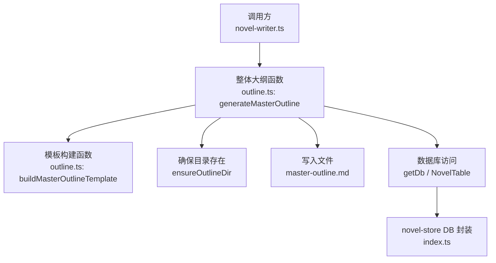
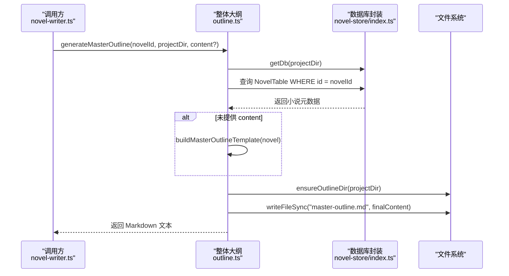
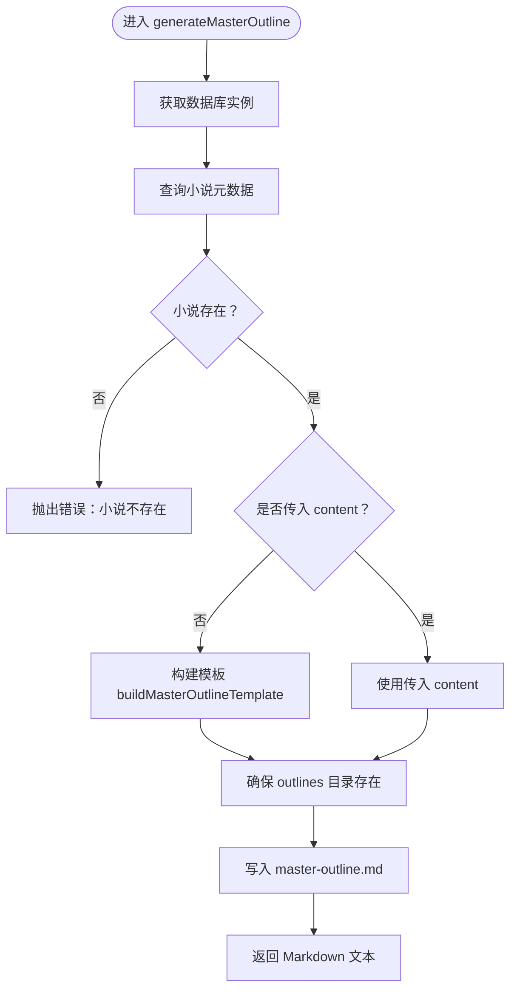
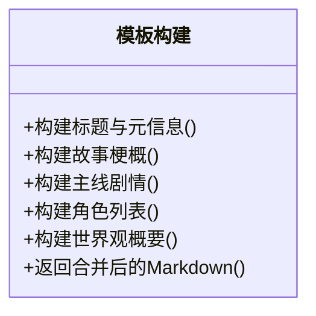
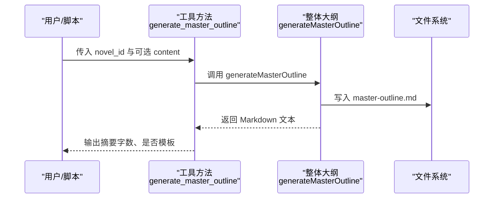
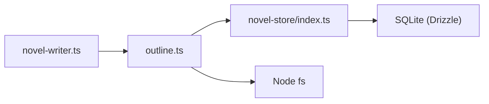

# 整体大纲生成

<cite>
**本文引用的文件**   
- [packages/plugin/src/novel-writer/outline.ts](file://packages/plugin/src/novel-writer/outline.ts)
- [packages/plugin/src/novel-writer.ts](file://packages/plugin/src/novel-writer.ts)
- [packages/novel-store/src/index.ts](file://packages/novel-store/src/index.ts)
- [packages/plugin/test/novel-writer/e2e.test.ts](file://packages/plugin/test/novel-writer/e2e.test.ts)
</cite>

## 目录
1. [简介](#简介)
2. [项目结构](#项目结构)
3. [核心组件](#核心组件)
4. [架构总览](#架构总览)
5. [详细组件分析](#详细组件分析)
6. [依赖关系分析](#依赖关系分析)
7. [性能考量](#性能考量)
8. [故障排查指南](#故障排查指南)
9. [结论](#结论)
10. [附录](#附录)

## 简介
本文件面向 openNovel 的“整体大纲”生成功能，系统性说明 generateMasterOutline 的实现原理、模板结构与内容规范、动态构建逻辑（buildMasterOutlineTemplate）、调用方式与输出格式，以及错误处理与异常分支。该功能从小说元数据（NovelTable）提取信息，生成 master-outline.md 文件，包含故事梗概、主线剧情（四幕结构）、角色列表（主角、配角、反派）、世界观概要等模块，便于作者快速搭建创作蓝图。

## 项目结构
整体大纲生成位于插件层（packages/plugin），通过 outline.ts 暴露三级大纲能力（整体、卷、章节）。其中：
- 整体大纲：generateMasterOutline → buildMasterOutlineTemplate → 写入 .novel/outlines/master-outline.md
- 卷大纲：generateVolumeOutline → 写入 volume-{n}.md
- 章节大纲：generateChapterOutline → 写入 chapter-{n}.md

数据库访问由 novel-store 提供（Drizzle ORM + SQLite），表定义与连接管理集中在 packages/novel-store/src/index.ts。

图表来源
- [packages/plugin/src/novel-writer.ts:540-563](file://packages/plugin/src/novel-writer.ts#L540-L563)
- [packages/plugin/src/novel-writer/outline.ts:81-90](file://packages/plugin/src/novel-writer/outline.ts#L81-L90)
- [packages/novel-store/src/index.ts:34-46](file://packages/novel-store/src/index.ts#L34-L46)

章节来源
- [packages/plugin/src/novel-writer/outline.ts:1-171](file://packages/plugin/src/novel-writer/outline.ts#L1-L171)
- [packages/novel-store/src/index.ts:34-46](file://packages/novel-store/src/index.ts#L34-L46)

## 核心组件
- generateMasterOutline(novelId, projectDir, content?)
  - 职责：根据小说 ID 查询元数据，若未传入 content 则使用模板构建；确保 outlines 目录存在并写入 master-outline.md；返回生成的 Markdown 字符串。
  - 输入：novelId（字符串）、projectDir（项目根路径）、content（可选，实际大纲全文）
  - 输出：Markdown 文本
  - 副作用：在 projectDir/.novel/outlines/ 下生成 master-outline.md

- buildMasterOutlineTemplate(novel)
  - 职责：基于 NovelTable 字段（title、genre、status、synopsis）构建标准 Markdown 模板，包含故事梗概、四幕主线、角色列表、世界观概要等。
  - 空值处理：当 synopsis 为空时插入占位提示行；状态字段进行中文映射（如 draft→草稿）。

- ensureOutlineDir(projectDir)
  - 职责：确保 .novel/outlines 目录存在，不存在则递归创建。

章节来源
- [packages/plugin/src/novel-writer/outline.ts:81-90](file://packages/plugin/src/novel-writer/outline.ts#L81-L90)
- [packages/plugin/src/novel-writer/outline.ts:92-171](file://packages/plugin/src/novel-writer/outline.ts#L92-L171)
- [packages/plugin/src/novel-writer/outline.ts:24-30](file://packages/plugin/src/novel-writer/outline.ts#L24-L30)

## 架构总览
整体大纲生成流程如下：
- 调用入口：novel-writer.ts 中的工具方法 generate_master_outline 接收参数并调用 generateMasterOutline。
- 数据获取：outline.ts 通过 getDb(projectDir) 获取数据库实例，查询 NovelTable 获取小说元数据。
- 模板构建：若未提供 content，则调用 buildMasterOutlineTemplate 生成标准模板。
- 文件落盘：确保 outlines 目录存在后，将最终内容写入 master-outline.md。
- 结果返回：返回生成的 Markdown 文本，供上层工具包装为输出。

图表来源
- [packages/plugin/src/novel-writer.ts:540-563](file://packages/plugin/src/novel-writer.ts#L540-L563)
- [packages/plugin/src/novel-writer/outline.ts:81-90](file://packages/plugin/src/novel-writer/outline.ts#L81-L90)
- [packages/novel-store/src/index.ts:393-404](file://packages/novel-store/src/index.ts#L393-L404)

## 详细组件分析

### 整体大纲函数 generateMasterOutline
- 行为要点
  - 校验小说是否存在，不存在抛出错误。
  - 若传入 content，直接使用；否则调用模板构建。
  - 确保 outlines 目录存在并写入 master-outline.md。
  - 返回最终 Markdown 文本。
- 关键路径
  - 数据库读取：NovelTable
  - 文件写入：fs.writeFileSync
  - 目录创建：ensureOutlineDir

图表来源
- [packages/plugin/src/novel-writer/outline.ts:81-90](file://packages/plugin/src/novel-writer/outline.ts#L81-L90)
- [packages/plugin/src/novel-writer/outline.ts:24-30](file://packages/plugin/src/novel-writer/outline.ts#L24-L30)

章节来源
- [packages/plugin/src/novel-writer/outline.ts:81-90](file://packages/plugin/src/novel-writer/outline.ts#L81-L90)

### 模板构建函数 buildMasterOutlineTemplate
- 结构组成
  - 标题与元信息：书名、题材、状态、生成时间
  - 故事梗概：优先使用 synopsis，否则插入占位提示
  - 主线剧情（四幕结构）：开端、发展、高潮、结局，各含占位提示
  - 角色列表：主角、重要配角、反派，均为表格占位
  - 世界观概要：世界背景、力量体系、重要设定，均为占位提示
- 空值与默认处理
  - synopsis 为空时插入占位行
  - status 为 draft 时显示“草稿”，其他情况原样输出
  - 所有待填写区域均使用占位符，引导作者填充

图表来源
- [packages/plugin/src/novel-writer/outline.ts:92-171](file://packages/plugin/src/novel-writer/outline.ts#L92-L171)

章节来源
- [packages/plugin/src/novel-writer/outline.ts:92-171](file://packages/plugin/src/novel-writer/outline.ts#L92-L171)

### 调用方式与示例
- 工具入口：novel-writer.ts 中 expose 了 generate_master_outline 工具，支持传入 content 以直接写入实际大纲内容；不传则生成模板。
- 典型调用步骤
  - 准备小说 ID 与项目目录
  - 调用 generateMasterOutline(novelId, projectDir, content?)
  - 检查返回的 Markdown 长度与关键字段
  - 查看 .novel/outlines/master-outline.md 文件内容

图表来源
- [packages/plugin/src/novel-writer.ts:540-563](file://packages/plugin/src/novel-writer.ts#L540-L563)
- [packages/plugin/src/novel-writer/outline.ts:81-90](file://packages/plugin/src/novel-writer/outline.ts#L81-L90)

章节来源
- [packages/plugin/src/novel-writer.ts:540-563](file://packages/plugin/src/novel-writer.ts#L540-L563)

### 生成的文件结构与内容格式
- 文件位置：projectDir/.novel/outlines/master-outline.md
- 内容结构
  - 标题：《书名》整体大纲
  - 元信息：题材、状态、生成时间
  - 故事梗概：段落或占位提示
  - 主线剧情：四幕结构（开端、发展、高潮、结局）
  - 角色列表：主角、重要配角、反派（表格形式）
  - 世界观概要：世界背景、力量体系、重要设定

章节来源
- [packages/plugin/src/novel-writer/outline.ts:92-171](file://packages/plugin/src/novel-writer/outline.ts#L92-L171)

### 单元测试验证
- e2e.test.ts 中对整体大纲的关键字段进行了断言，包括书名、整体大纲、故事梗概、主线剧情、角色列表、世界观概要等。
- 这确保了模板结构与关键字段稳定可用。

章节来源
- [packages/plugin/test/novel-writer/e2e.test.ts:419-428](file://packages/plugin/test/novel-writer/e2e.test.ts#L419-L428)

## 依赖关系分析
- 模块耦合
  - outline.ts 依赖 novel-store 提供的数据库封装与表定义（NovelTable、VolumeTable、ChapterTable）。
  - novel-writer.ts 作为工具层，聚合并暴露 generate_*_outline 系列能力。
- 外部依赖
  - Drizzle ORM：用于 SQLite 表操作
  - Node fs：用于文件读写与目录创建
- 潜在循环依赖
  - 当前实现无循环依赖，outline.ts 仅向上暴露函数，不反向依赖工具层。

图表来源
- [packages/plugin/src/novel-writer.ts:540-563](file://packages/plugin/src/novel-writer.ts#L540-L563)
- [packages/plugin/src/novel-writer/outline.ts:13-16](file://packages/plugin/src/novel-writer/outline.ts#L13-L16)
- [packages/novel-store/src/index.ts:34-46](file://packages/novel-store/src/index.ts#L34-L46)

章节来源
- [packages/plugin/src/novel-writer/outline.ts:13-16](file://packages/plugin/src/novel-writer/outline.ts#L13-L16)
- [packages/novel-store/src/index.ts:34-46](file://packages/novel-store/src/index.ts#L34-L46)

## 性能考量
- 数据库访问
  - getDb 提供按路径缓存的数据库实例，避免重复连接开销。
- 文件 I/O
  - 整体大纲生成仅一次写操作，I/O 开销较低。
- 内存占用
  - 模板构建为字符串拼接，内存占用与内容规模线性相关，通常较小。
- 优化建议
  - 批量生成多份大纲时可复用同一 Db 实例（通过传入相同 directory）。
  - 对超大内容可考虑流式写入（当前场景不适用）。

[本节为通用指导，无需具体文件引用]

## 故障排查指南
- 常见错误
  - 小说不存在：当 novelId 无法匹配 NovelTable 记录时抛出错误。
  - 目录权限问题：无法创建 .novel/outlines 目录或写入文件。
  - 路径解析错误：projectDir 不正确导致找不到数据库或写出失败。
- 定位方法
  - 检查 generateMasterOutline 抛出的错误消息。
  - 确认 projectDir 是否正确指向包含 .novel 的项目根目录。
  - 检查文件系统权限与磁盘空间。
- 恢复策略
  - 修正 novelId 或确保小说已初始化。
  - 手动创建 .novel/outlines 目录并重试。
  - 使用 read_outline 工具读取已生成文件，确认内容完整性。

章节来源
- [packages/plugin/src/novel-writer/outline.ts:81-90](file://packages/plugin/src/novel-writer/outline.ts#L81-L90)
- [packages/plugin/src/novel-writer.ts:656-694](file://packages/plugin/src/novel-writer.ts#L656-L694)

## 结论
整体大纲生成功能以清晰的模块化设计与稳健的错误处理，为作者提供了标准化的创作蓝图模板。通过 generateMasterOutline 与 buildMasterOutlineTemplate，系统能够自动从小说元数据生成 master-outline.md，并在需要时接受外部内容覆盖，兼顾灵活性与一致性。配合卷纲与章纲工具，形成完整的三级大纲体系，支撑后续写作与审查流程。

[本节为总结性内容，无需具体文件引用]

## 附录
- 术语说明
  - 整体大纲：小说层面的总纲，涵盖故事梗概、主线剧情、角色列表、世界观概要。
  - 卷大纲：按卷划分的叙事单元，包含主题、章节列表、关键事件。
  - 章节大纲：单章级别的计划，包含目标、关键场景、角色出场等。
- 参考路径
  - 整体大纲函数：packages/plugin/src/novel-writer/outline.ts
  - 工具入口：packages/plugin/src/novel-writer.ts
  - 数据库封装：packages/novel-store/src/index.ts
  - 端到端测试：packages/plugin/test/novel-writer/e2e.test.ts

[本节为补充信息，无需具体文件引用]