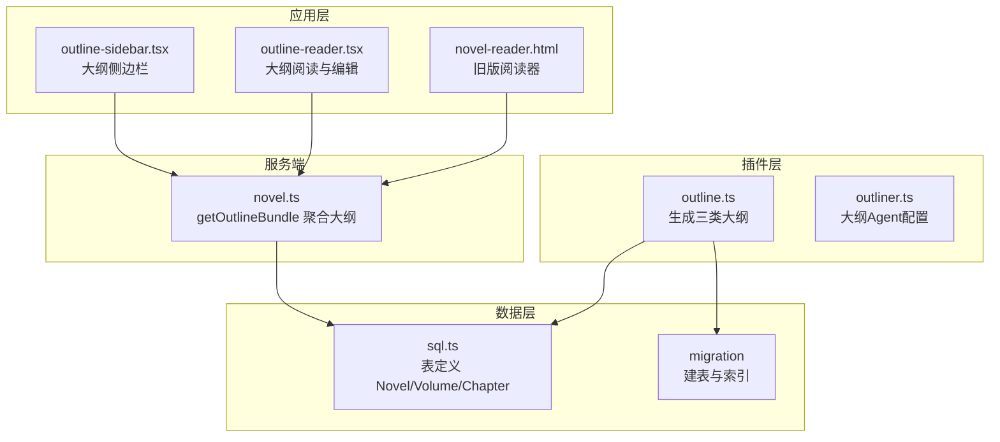
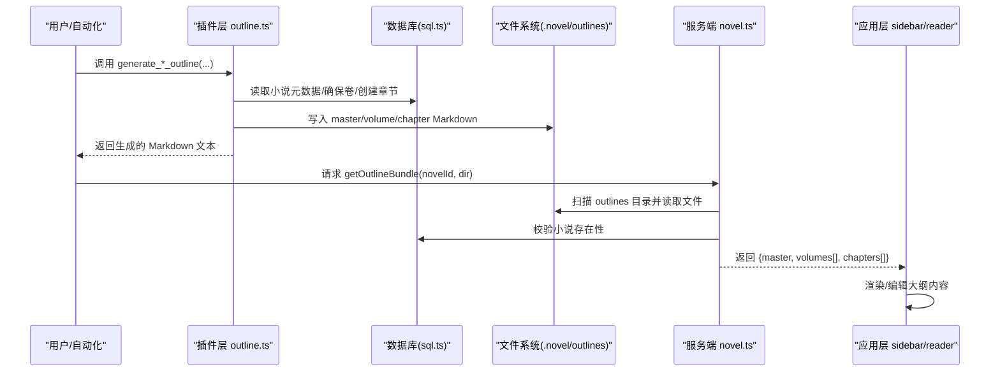
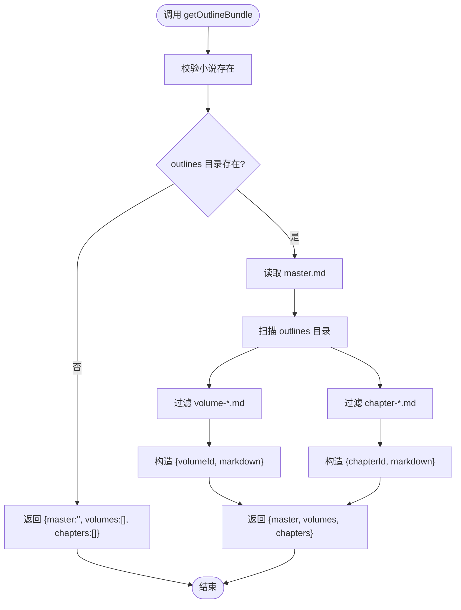
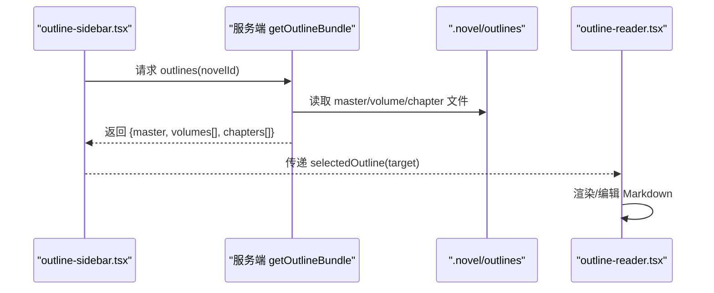
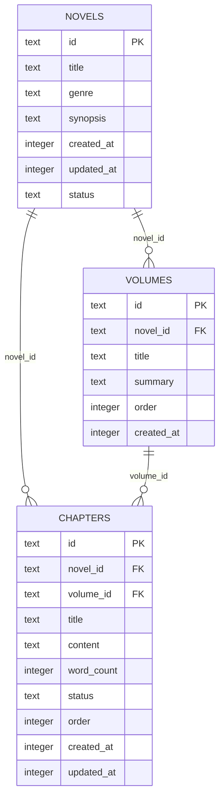
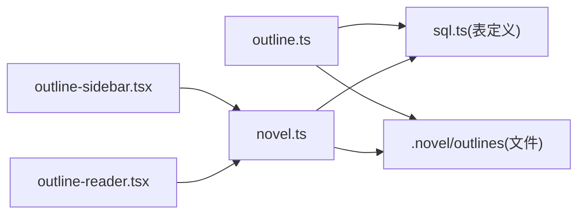

# 步骤1：大纲规划

<cite>
**本文引用的文件**   
- [packages/plugin/src/novel-writer/outline.ts](file://packages/plugin/src/novel-writer/outline.ts)
- [packages/plugin/src/novel-writer/agents/outliner.ts](file://packages/plugin/src/novel-writer/agents/outliner.ts)
- [packages/core/src/session/sql.ts](file://packages/core/src/session/sql.ts)
- [packages/core/src/database/migration/20260721152252_novel_writing_tables.ts](file://packages/core/src/database/migration/20260721152252_novel_writing_tables.ts)
- [packages/server/src/handlers/novel.ts](file://packages/server/src/handlers/novel.ts)
- [packages/app/src/pages/novel/outline-sidebar.tsx](file://packages/app/src/pages/novel/outline-sidebar.tsx)
- [packages/app/src/pages/novel/outline-reader.tsx](file://packages/app/src/pages/novel/outline-reader.tsx)
- [packages/opencode/src/server/routes/instance/httpapi/novel-reader.html](file://packages/opencode/src/server/routes/instance/httpapi/novel-reader.html)
- [packages/plugin/test/novel-writer/e2e.test.ts](file://packages/plugin/test/novel-writer/e2e.test.ts)
</cite>

## 目录
1. [简介](#简介)
2. [项目结构](#项目结构)
3. [核心组件](#核心组件)
4. [架构总览](#架构总览)
5. [详细组件分析](#详细组件分析)
6. [依赖关系分析](#依赖关系分析)
7. [性能考量](#性能考量)
8. [故障排查指南](#故障排查指南)
9. [结论](#结论)
10. [附录](#附录)

## 简介
本章节聚焦 openNovel 八步写作流水线中的“大纲规划”步骤，系统化说明如何生成三类大纲文件：整体大纲（master-outline.md）、卷大纲（volume-{n}.md）与章节大纲（chapter-{n}.md）。文档覆盖以下要点：
- 三大工具函数 generate_master_outline、generate_volume_outline、generate_chapter_outline 的参数、执行流程与返回值
- 大纲文件的结构规范、内容模板与自动生成逻辑
- 与数据库的交互方式（NovelTable、VolumeTable、ChapterTable）
- 前端读取与编辑大纲的工作流
- 调用示例与常见问题定位

## 项目结构
大纲规划相关代码主要分布在插件层（生成逻辑）、服务端（读取与聚合）、应用层（展示与编辑）以及数据库定义（表结构与迁移）。

图表来源
- [packages/plugin/src/novel-writer/outline.ts](file://packages/plugin/src/novel-writer/outline.ts)
- [packages/plugin/src/novel-writer/agents/outliner.ts](file://packages/plugin/src/novel-writer/agents/outliner.ts)
- [packages/server/src/handlers/novel.ts](file://packages/server/src/handlers/novel.ts)
- [packages/app/src/pages/novel/outline-sidebar.tsx](file://packages/app/src/pages/novel/outline-sidebar.tsx)
- [packages/app/src/pages/novel/outline-reader.tsx](file://packages/app/src/pages/novel/outline-reader.tsx)
- [packages/opencode/src/server/routes/instance/httpapi/novel-reader.html](file://packages/opencode/src/server/routes/instance/httpapi/novel-reader.html)
- [packages/core/src/session/sql.ts](file://packages/core/src/session/sql.ts)
- [packages/core/src/database/migration/20260721152252_novel_writing_tables.ts](file://packages/core/src/database/migration/20260721152252_novel_writing_tables.ts)

章节来源
- [packages/plugin/src/novel-writer/outline.ts](file://packages/plugin/src/novel-writer/outline.ts)
- [packages/server/src/handlers/novel.ts](file://packages/server/src/handlers/novel.ts)
- [packages/app/src/pages/novel/outline-sidebar.tsx](file://packages/app/src/pages/novel/outline-sidebar.tsx)
- [packages/app/src/pages/novel/outline-reader.tsx](file://packages/app/src/pages/novel/outline-reader.tsx)
- [packages/opencode/src/server/routes/instance/httpapi/novel-reader.html](file://packages/opencode/src/server/routes/instance/httpapi/novel-reader.html)
- [packages/core/src/session/sql.ts](file://packages/core/src/session/sql.ts)
- [packages/core/src/database/migration/20260721152252_novel_writing_tables.ts](file://packages/core/src/database/migration/20260721152252_novel_writing_tables.ts)

## 核心组件
- 大纲生成器（outline.ts）
  - 提供三个导出函数：generate_master_outline、generate_volume_outline、generate_chapter_outline
  - 负责将大纲内容写入 .novel/outlines 目录下的 Markdown 文件
  - 在需要时维护 volumes / chapters 表记录（卷与章节），并自动计算所属卷号
- 大纲 Agent（outliner.ts）
  - 提供从上下文快照生成章节创作意图的提示词与输出格式，用于指导后续写作与大纲细化
- 服务端聚合器（novel.ts）
  - getOutlineBundle 读取 outlines 目录，返回 master、volumes、chapters 三部分内容，供前端渲染
- 前端展示与编辑（outline-sidebar.tsx、outline-reader.tsx）
  - 侧边栏选择目标（master/volume/chapter），阅读器支持预览与编辑保存
- 数据库定义（sql.ts、migration）
  - NovelTable、VolumeTable、ChapterTable 的结构与索引，确保查询与关联一致性

章节来源
- [packages/plugin/src/novel-writer/outline.ts](file://packages/plugin/src/novel-writer/outline.ts)
- [packages/plugin/src/novel-writer/agents/outliner.ts](file://packages/plugin/src/novel-writer/agents/outliner.ts)
- [packages/server/src/handlers/novel.ts](file://packages/server/src/handlers/novel.ts)
- [packages/app/src/pages/novel/outline-sidebar.tsx](file://packages/app/src/pages/novel/outline-sidebar.tsx)
- [packages/app/src/pages/novel/outline-reader.tsx](file://packages/app/src/pages/novel/outline-reader.tsx)
- [packages/core/src/session/sql.ts](file://packages/core/src/session/sql.ts)
- [packages/core/src/database/migration/20260721152252_novel_writing_tables.ts](file://packages/core/src/database/migration/20260721152252_novel_writing_tables.ts)

## 架构总览
下图展示了“大纲规划”步骤的整体数据流：用户或自动化流程触发生成 → 插件层写入 Markdown 与 DB → 服务端聚合 → 前端读取与编辑。

图表来源
- [packages/plugin/src/novel-writer/outline.ts](file://packages/plugin/src/novel-writer/outline.ts)
- [packages/server/src/handlers/novel.ts](file://packages/server/src/handlers/novel.ts)
- [packages/app/src/pages/novel/outline-sidebar.tsx](file://packages/app/src/pages/novel/outline-sidebar.tsx)
- [packages/app/src/pages/novel/outline-reader.tsx](file://packages/app/src/pages/novel/outline-reader.tsx)

## 详细组件分析

### 工具一：generate_master_outline（整体大纲）
- 参数
  - novelId: string — 小说 ID
  - projectDir: string — 项目根目录（包含 .novel/ 的目录）
  - content?: string — 可选，自定义内容；未提供则使用内置模板
- 执行流程
  - 通过数据库读取小说元数据（标题、题材、状态、梗概等）
  - 构建整体大纲模板（故事梗概、主线剧情四幕、角色列表、世界观概要）
  - 确保 .novel/outlines 目录存在，写入 master-outline.md
  - 返回生成的 Markdown 文本
- 返回值
  - Promise<string>：整体大纲的 Markdown 内容
- 数据库交互
  - 仅读取 NovelTable，不新增记录
- 文件路径参考
  - [packages/plugin/src/novel-writer/outline.ts](file://packages/plugin/src/novel-writer/outline.ts)

章节来源
- [packages/plugin/src/novel-writer/outline.ts](file://packages/plugin/src/novel-writer/outline.ts)

### 工具二：generate_volume_outline（卷大纲）
- 参数
  - novelId: string — 小说 ID
  - volumeNumber: number — 卷号（从 1 开始）
  - projectDir: string — 项目根目录
  - content?: string — 可选，自定义内容
  - title?: string — 可选，卷标题（如未提供则默认“第N卷”）
- 执行流程
  - 读取小说元数据
  - 确保对应卷记录存在（不存在则创建，含摘要与排序）
  - 若传入 title，更新卷标题
  - 计算章节范围（默认每卷固定章节数）
  - 构建卷大纲模板（主题、章节列表、关键事件、伏笔、角色弧光）
  - 写入 volume-{n}.md
  - 返回 Markdown 文本
- 返回值
  - Promise<string>：卷大纲的 Markdown 内容
- 数据库交互
  - 读取 NovelTable；确保 VolumeTable 记录存在并可更新标题
- 文件路径参考
  - [packages/plugin/src/novel-writer/outline.ts](file://packages/plugin/src/novel-writer/outline.ts)

章节来源
- [packages/plugin/src/novel-writer/outline.ts](file://packages/plugin/src/novel-writer/outline.ts)

### 工具三：generate_chapter_outline（章节大纲）
- 参数
  - novelId: string — 小说 ID
  - chapterNumber: number — 章节编号（从 1 开始）
  - projectDir: string — 项目根目录
  - content?: string — 可选，自定义内容
  - title?: string — 可选，章节标题（如未提供则默认“第N章”）
- 执行流程
  - 读取小说元数据
  - 根据章节编号计算所属卷号，并确保该卷记录存在
  - 查找或创建章节记录（首次创建时设置 status=outline、order=chapterNumber）
  - 若传入 title 且与现有不同，更新标题、关联卷与状态
  - 构建章节大纲模板（章节目标、关键场景、角色出场、对话要点、打脸设计）
  - 写入 chapter-{n}.md
  - 返回 Markdown 文本
- 返回值
  - Promise<string>：章节大纲的 Markdown 内容
- 数据库交互
  - 读取 NovelTable；确保 VolumeTable 记录存在；插入或更新 ChapterTable
- 文件路径参考
  - [packages/plugin/src/novel-writer/outline.ts](file://packages/plugin/src/novel-writer/outline.ts)

章节来源
- [packages/plugin/src/novel-writer/outline.ts](file://packages/plugin/src/novel-writer/outline.ts)

### 大纲文件结构规范与模板
- 整体大纲（master-outline.md）
  - 标题：《小说名》整体大纲
  - 元信息：题材、状态、生成时间
  - 章节：故事梗概、主线剧情（四幕）、角色列表（主角/配角/反派）、世界观概要（背景/力量体系/重要设定）
- 卷大纲（volume-{n}.md）
  - 标题：《小说名》第N卷 大纲
  - 元信息：卷 ID、章节范围、生成时间
  - 章节：本卷主题（主题句/情感基调）、章节列表（表格）、关键事件（必写事件/伏笔/角色弧光）
- 章节大纲（chapter-{n}.md）
  - 标题：《小说名》第N章 大纲
  - 元信息：章节 ID、所属卷、生成时间
  - 章节：章节目标（剧情/情感/信息）、关键场景（开场/发展/高潮/收尾）、角色出场（表格/对话要点）、打脸设计（可选）

章节来源
- [packages/plugin/src/novel-writer/outline.ts](file://packages/plugin/src/novel-writer/outline.ts)

### 与服务端聚合接口 getOutlineBundle 的关系
- 作用
  - 读取 .novel/outlines 目录，按文件名解析出 master、volumes[]、chapters[]，返回给前端
- 行为
  - 校验小说存在性
  - 若 outlines 目录不存在，返回空结构
  - 按前缀匹配 volume-*.md 与 chapter-*.md，提取 id 与 markdown
- 前端消费
  - 侧边栏与阅读器通过该接口获取并渲染大纲内容

图表来源
- [packages/server/src/handlers/novel.ts](file://packages/server/src/handlers/novel.ts)

章节来源
- [packages/server/src/handlers/novel.ts](file://packages/server/src/handlers/novel.ts)

### 前端展示与编辑工作流
- 侧边栏（outline-sidebar.tsx）
  - 维护 OutlineTarget（section: master | volume | chapter; id?）
  - 根据 volumes 与 chapters 排序显示，支持选中切换
- 阅读器（outline-reader.tsx）
  - 使用 useOutline/useUpdateOutline 获取与更新大纲
  - 支持 Markdown 预览与编辑草稿
- 旧版阅读器（novel-reader.html）
  - 通过 api.outlines() 获取大纲列表，按 filename 匹配卷大纲并渲染

图表来源
- [packages/app/src/pages/novel/outline-sidebar.tsx](file://packages/app/src/pages/novel/outline-sidebar.tsx)
- [packages/app/src/pages/novel/outline-reader.tsx](file://packages/app/src/pages/novel/outline-reader.tsx)
- [packages/server/src/handlers/novel.ts](file://packages/server/src/handlers/novel.ts)

章节来源
- [packages/app/src/pages/novel/outline-sidebar.tsx](file://packages/app/src/pages/novel/outline-sidebar.tsx)
- [packages/app/src/pages/novel/outline-reader.tsx](file://packages/app/src/pages/novel/outline-reader.tsx)
- [packages/opencode/src/server/routes/instance/httpapi/novel-reader.html](file://packages/opencode/src/server/routes/instance/httpapi/novel-reader.html)

### 数据库模型与约束
- NovelTable（小说表）
  - 字段：id、title、genre、synopsis、created_at、updated_at、status
  - 用途：存储小说基本信息，作为大纲生成的元数据来源
- VolumeTable（卷表）
  - 字段：id、novel_id、title、summary、order、created_at
  - 用途：组织小说为多卷结构，支撑卷大纲与章节归属
- ChapterTable（章节表）
  - 字段：id、novel_id、volume_id、title、content、word_count、status、order、created_at、updated_at
  - 用途：存储章节元信息与状态（如 outline/draft），支撑章节大纲与后续写作

图表来源
- [packages/core/src/session/sql.ts](file://packages/core/src/session/sql.ts)
- [packages/core/src/database/migration/20260721152252_novel_writing_tables.ts](file://packages/core/src/database/migration/20260721152252_novel_writing_tables.ts)

章节来源
- [packages/core/src/session/sql.ts](file://packages/core/src/session/sql.ts)
- [packages/core/src/database/migration/20260721152252_novel_writing_tables.ts](file://packages/core/src/database/migration/20260721152252_novel_writing_tables.ts)

### 调用示例（基于测试用例的行为）
以下为调用方式的说明（不直接粘贴代码，给出路径参考）：
- 生成整体大纲
  - 调用 generateMasterOutline(novelId, projectDir)
  - 预期结果包含“整体大纲”“故事梗概”“主线剧情”“角色列表”“世界观概要”等关键字段
  - 参考：[packages/plugin/test/novel-writer/e2e.test.ts](file://packages/plugin/test/novel-writer/e2e.test.ts)
- 生成卷大纲
  - 调用 generateVolumeOutline(novelId, volumeNumber, projectDir)
  - 预期结果包含“第N卷 大纲”“章节范围”“本卷主题”“关键事件”等关键字段
  - 参考：同上
- 生成章节大纲
  - 调用 generateChapterOutline(novelId, chapterNumber, projectDir)
  - 预期结果包含“第N章 大纲”“章节目标”“关键场景”“角色出场”等关键字段
  - 参考：同上

章节来源
- [packages/plugin/test/novel-writer/e2e.test.ts](file://packages/plugin/test/novel-writer/e2e.test.ts)

## 依赖关系分析
- 插件层（outline.ts）
  - 依赖数据库表定义（NovelTable、VolumeTable、ChapterTable）
  - 依赖文件系统（确保 outlines 目录并写入 Markdown）
- 服务端（novel.ts）
  - 依赖数据库表定义进行校验
  - 依赖文件系统读取 outlines 目录
- 应用层（sidebar/reader）
  - 依赖服务端接口返回的数据结构
  - 依赖本地状态管理（selectedOutline）

图表来源
- [packages/plugin/src/novel-writer/outline.ts](file://packages/plugin/src/novel-writer/outline.ts)
- [packages/server/src/handlers/novel.ts](file://packages/server/src/handlers/novel.ts)
- [packages/app/src/pages/novel/outline-sidebar.tsx](file://packages/app/src/pages/novel/outline-sidebar.tsx)
- [packages/app/src/pages/novel/outline-reader.tsx](file://packages/app/src/pages/novel/outline-reader.tsx)
- [packages/core/src/session/sql.ts](file://packages/core/src/session/sql.ts)

章节来源
- [packages/plugin/src/novel-writer/outline.ts](file://packages/plugin/src/novel-writer/outline.ts)
- [packages/server/src/handlers/novel.ts](file://packages/server/src/handlers/novel.ts)
- [packages/app/src/pages/novel/outline-sidebar.tsx](file://packages/app/src/pages/novel/outline-sidebar.tsx)
- [packages/app/src/pages/novel/outline-reader.tsx](file://packages/app/src/pages/novel/outline-reader.tsx)
- [packages/core/src/session/sql.ts](file://packages/core/src/session/sql.ts)

## 性能考量
- 文件 I/O
  - 生成大纲时仅一次写入单个 Markdown 文件，I/O 开销较小
  - 聚合接口需遍历 outlines 目录并读取多个文件，建议对大项目考虑缓存或分页
- 数据库访问
  - 生成过程中按需查询与插入/更新，避免批量操作；可结合事务保证一致性
- 前端渲染
  - 大纲内容以 Markdown 形式传输，渲染成本较低；编辑器应防 XSS（已有清理逻辑）

[本节为通用指导，不直接分析具体文件]

## 故障排查指南
- 错误：小说不存在
  - 现象：调用 generate_*_outline 抛出异常
  - 原因：NovelTable 中无对应 novelId
  - 处理：确认小说已创建并传入正确 ID
  - 参考：[packages/plugin/src/novel-writer/outline.ts](file://packages/plugin/src/novel-writer/outline.ts)
- 错误：outlines 目录不存在
  - 现象：getOutlineBundle 返回空结构
  - 原因：尚未生成任何大纲文件或目录缺失
  - 处理：先运行任意一个 generate_*_outline 以创建目录与文件
  - 参考：[packages/server/src/handlers/novel.ts](file://packages/server/src/handlers/novel.ts)
- 错误：卷/章节记录不一致
  - 现象：章节大纲无法关联到卷或顺序错乱
  - 原因：ensureVolume 未正确创建或 update 未生效
  - 处理：检查 ensureVolume 与 ChapterTable 插入/更新逻辑
  - 参考：[packages/plugin/src/novel-writer/outline.ts](file://packages/plugin/src/novel-writer/outline.ts)
- 前端显示空白
  - 现象：侧边栏或阅读器无内容
  - 原因：服务端未返回有效数据或文件名不匹配
  - 处理：核对文件名规则（master.md、volume-*.md、chapter-*.md）
  - 参考：[packages/server/src/handlers/novel.ts](file://packages/server/src/handlers/novel.ts)、[packages/opencode/src/server/routes/instance/httpapi/novel-reader.html](file://packages/opencode/src/server/routes/instance/httpapi/novel-reader.html)

章节来源
- [packages/plugin/src/novel-writer/outline.ts](file://packages/plugin/src/novel-writer/outline.ts)
- [packages/server/src/handlers/novel.ts](file://packages/server/src/handlers/novel.ts)
- [packages/opencode/src/server/routes/instance/httpapi/novel-reader.html](file://packages/opencode/src/server/routes/instance/httpapi/novel-reader.html)

## 结论
“大纲规划”步骤通过插件层的三大工具函数完成整体、卷、章节三级大纲的生成与持久化，同时利用服务端的聚合接口统一对外暴露，前端实现可视化编辑。数据库模型清晰、文件命名规范，保证了可扩展性与一致性。建议在大规模项目中引入缓存与事务优化，以提升性能与稳定性。

[本节为总结性内容，不直接分析具体文件]

## 附录
- 大纲 Agent 提示词与输出格式
  - 用于从上下文快照生成章节创作意图，指导后续写作与大纲细化
  - 参考：[packages/plugin/src/novel-writer/agents/outliner.ts](file://packages/plugin/src/novel-writer/agents/outliner.ts)

章节来源
- [packages/plugin/src/novel-writer/agents/outliner.ts](file://packages/plugin/src/novel-writer/agents/outliner.ts)