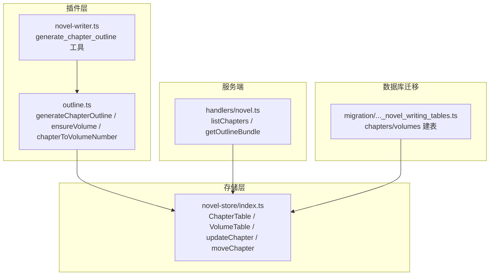
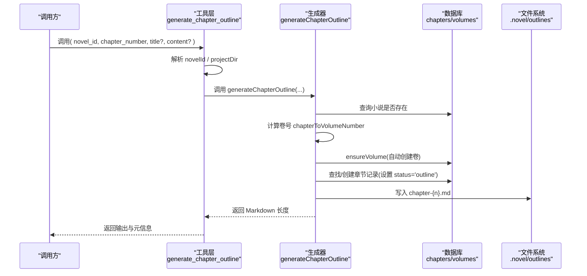
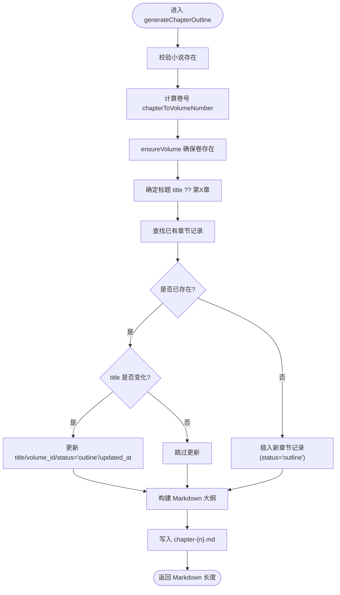
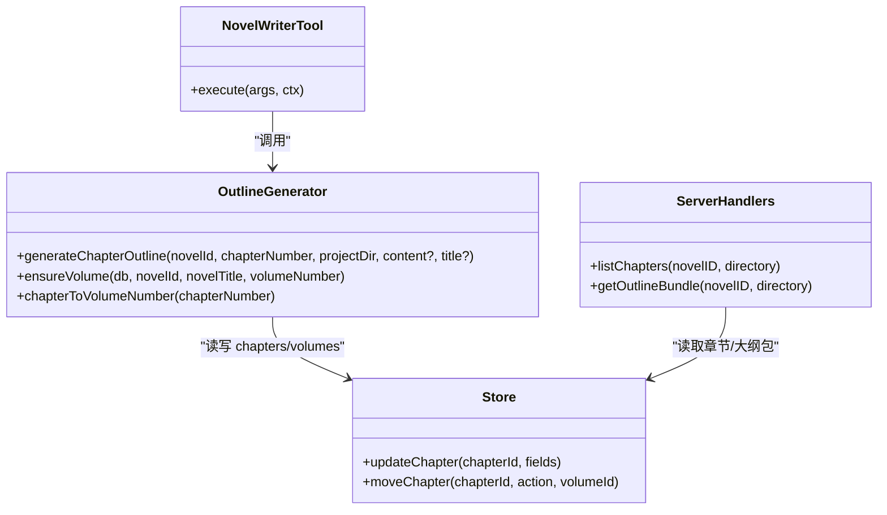

# 章节大纲生成

<cite>
**本文引用的文件**   
- [outline.ts](file://packages/plugin/src/novel-writer/outline.ts)
- [novel-writer.ts](file://packages/plugin/src/novel-writer.ts)
- [index.ts](file://packages/novel-store/src/index.ts)
- [novel.ts](file://packages/server/src/handlers/novel.ts)
- [20260721152252_novel_writing_tables.ts](file://packages/core/src/database/migration/20260721152252_novel_writing_tables.ts)
- [e2e.test.ts](file://packages/plugin/test/novel-writer/e2e.test.ts)
</cite>

## 目录
1. [简介](#简介)
2. [项目结构](#项目结构)
3. [核心组件](#核心组件)
4. [架构总览](#架构总览)
5. [详细组件分析](#详细组件分析)
6. [依赖关系分析](#依赖关系分析)
7. [性能考量](#性能考量)
8. [故障排查指南](#故障排查指南)
9. [结论](#结论)
10. [附录：调用示例与最佳实践](#附录调用示例与最佳实践)

## 简介
本文件面向 openNovel 的“章节大纲”生成功能，聚焦 generateChapterOutline 函数的复杂逻辑与数据一致性保障。内容涵盖：
- 章节所属卷号计算（chapterToVolumeNumber）
- 自动创建卷记录（ensureVolume）
- ChapterTable 的增删改查操作与状态管理（status: 'outline'）
- 章节大纲模板的结构（章节目标、关键场景、角色出场、打脸设计）
- 标题更新机制与与卷大纲的数据关联
- 工具层调用方式（content/title 可选参数）
- 与卷大纲的一致性保证及常见问题排查

## 项目结构
章节大纲功能位于插件层的小说写作模块中，核心实现集中在 outline.ts；工具入口在 novel-writer.ts；数据库表定义与通用 CRUD 在 novel-store/index.ts；服务端读取大纲包在 server 层 handlers/novel.ts；数据库迁移定义在 core 层 migration。

**图表来源** 
- [outline.ts:284-428](file://packages/plugin/src/novel-writer/outline.ts#L284-L428)
- [novel-writer.ts:595-627](file://packages/plugin/src/novel-writer.ts#L595-L627)
- [index.ts:70-85](file://packages/novel-store/src/index.ts#L70-L85)
- [novel.ts:439-452](file://packages/server/src/handlers/novel.ts#L439-L452)
- [20260721152252_novel_writing_tables.ts:19-32](file://packages/core/src/database/migration/20260721152252_novel_writing_tables.ts#L19-L32)

**章节来源**
- [outline.ts:1-429](file://packages/plugin/src/novel-writer/outline.ts#L1-L429)
- [novel-writer.ts:595-627](file://packages/plugin/src/novel-writer.ts#L595-L627)
- [index.ts:70-85](file://packages/novel-store/src/index.ts#L70-L85)
- [novel.ts:439-452](file://packages/server/src/handlers/novel.ts#L439-L452)
- [20260721152252_novel_writing_tables.ts:19-32](file://packages/core/src/database/migration/20260721152252_novel_writing_tables.ts#L19-L32)

## 核心组件
- 章节大纲生成器
  - 负责根据章节序号计算所属卷号、确保卷存在、创建或更新章节记录、生成并写入 Markdown 大纲文件。
- 卷自动创建
  - 按每卷固定章节数（默认 50）计算卷号，若卷不存在则自动创建卷记录。
- 数据库表与操作
  - chapters、volumes 表结构由迁移定义；提供 updateChapter、moveChapter 等通用操作。
- 工具封装
  - generate_chapter_outline 工具暴露 content/title 可选参数，便于上层编排（如 director）传入完整章纲或仅模板。

**章节来源**
- [outline.ts:284-428](file://packages/plugin/src/novel-writer/outline.ts#L284-L428)
- [outline.ts:38-66](file://packages/plugin/src/novel-writer/outline.ts#L38-L66)
- [index.ts:70-85](file://packages/novel-store/src/index.ts#L70-L85)
- [novel-writer.ts:595-627](file://packages/plugin/src/novel-writer.ts#L595-L627)

## 架构总览
章节大纲生成的端到端流程如下：
- 工具层接收请求（novel_id, chapter_number, title?, content?）
- 解析小说 ID 与项目目录
- 调用 generateChapterOutline 完成：
  - 校验小说存在
  - 计算卷号并确保卷存在
  - 查找或创建章节记录（设置 status='outline'）
  - 生成 Markdown 大纲并写入 .novel/outlines/chapter-{n}.md
- 返回结果长度与元信息，供 UI/流水线使用

**图表来源** 
- [novel-writer.ts:595-627](file://packages/plugin/src/novel-writer.ts#L595-L627)
- [outline.ts:284-428](file://packages/plugin/src/novel-writer/outline.ts#L284-L428)

## 详细组件分析

### generateChapterOutline 函数详解
- 输入参数
  - novelId：小说标识
  - chapterNumber：章节序号（从 1 开始）
  - projectDir：项目根目录
  - content：可选，完整的章节大纲 Markdown 全文；不传则生成模板
  - title：可选，章节标题；不传则使用“第X章”
- 核心逻辑
  - 校验小说存在
  - 计算所属卷号：chapterToVolumeNumber(chapterNumber)
  - 确保卷存在：ensureVolume(db, novelId, novel.title, volumeNumber)
  - 标题处理：title ?? `第${chapterNumber}章`
  - 章节记录处理：
    - 若已存在：当 title 变化时更新 title、volume_id、status='outline'、updated_at
    - 若不存在：插入新记录，字段包含 id、novel_id、volume_id、title、content=''、word_count=0、status='outline'、order=chapterNumber、created_at/updated_at
  - 生成大纲 Markdown：
    - 头部：标题、章节 ID、所属卷、生成时间
    - 章节目标：剧情目标、情感目标、信息目标
    - 关键场景：开场、发展、高潮/转折、收尾（每个场景含地点、时间、出场角色、概要、字数预估）
    - 角色出场：表格（角色、出场场景、作用、状态变化），对话要点列表
    - 打脸设计（如适用）：4 拍结构（轻视→冲突→反转→打脸）
  - 最终内容：若传入 content 则覆盖模板；否则使用模板拼接
  - 持久化：写入 .novel/outlines/chapter-{n}.md
- 复杂度与性能
  - 数据库访问：常数次查询/插入/更新
  - 文件 I/O：一次写文件
  - 整体 O(1)

**图表来源** 
- [outline.ts:284-428](file://packages/plugin/src/novel-writer/outline.ts#L284-L428)

**章节来源**
- [outline.ts:284-428](file://packages/plugin/src/novel-writer/outline.ts#L284-L428)

### chapterToVolumeNumber 计算所属卷号
- 规则：每卷默认 CHAPTERS_PER_VOLUME = 50 章
- 公式：Math.ceil(chapterNumber / CHAPTERS_PER_VOLUME)
- 用途：用于定位章节所属卷号，以便 ensureVolume 创建或复用卷记录

**章节来源**
- [outline.ts:21-35](file://packages/plugin/src/novel-writer/outline.ts#L21-L35)

### ensureVolume 自动创建卷记录
- 行为：
  - 查询 volumes 表中是否存在相同 novel_id 且 order=volumeNumber 的记录
  - 若存在，直接返回其 id
  - 若不存在，生成随机 id，计算 startChapter/endChapter（基于 CHAPTERS_PER_VOLUME），插入卷记录，返回 id
- 数据一致性：
  - 通过 order 唯一约束同一小说下的卷顺序
  - summary 自动生成，便于 UI 展示

**章节来源**
- [outline.ts:38-66](file://packages/plugin/src/novel-writer/outline.ts#L38-L66)

### ChapterTable 的增删改查与状态管理
- 新增：generateChapterOutline 在未找到记录时插入新章节，初始 status='outline'
- 更新：
  - 标题更新：当传入新 title 且与现有不同，更新 title、volume_id、status='outline'、updated_at
  - 通用更新：updateChapter 支持 title/status 字段更新
- 删除：未在本函数中涉及删除；可通过其他工具/接口删除
- 查询：
  - 工具 read_chapter_outline 可从数据库读取章节元信息（id、title、order、word_count、status）
  - listChapters 可列出某小说下所有章节（按 order 排序）
- 状态管理：
  - status='outline' 表示处于大纲阶段，UI 审批状态映射为“无需审批”

**章节来源**
- [outline.ts:300-334](file://packages/plugin/src/novel-writer/outline.ts#L300-L334)
- [index.ts:543-554](file://packages/novel-store/src/index.ts#L543-L554)
- [novel-writer.ts:628-655](file://packages/plugin/src/novel-writer.ts#L628-L655)
- [novel.ts:439-452](file://packages/server/src/handlers/novel.ts#L439-L452)

### 章节大纲模板结构说明
- 章节目标
  - 剧情目标：本章需要完成的剧情推进目标
  - 情感目标：希望带给读者的情感体验
  - 信息目标：向读者传递的关键信息（世界观揭示、伏笔暗示等）
- 关键场景（四段式）
  - 开场：地点、时间、出场角色、场景概要、字数预估
  - 发展：同上
  - 高潮/转折：同上
  - 收尾：同上
- 角色出场
  - 表格：角色、出场场景、作用、状态变化
  - 对话要点：关键对话的核心内容列表
- 打脸设计（如适用）
  - 4 拍结构：轻视 → 冲突 → 反转 → 打脸

**章节来源**
- [outline.ts:336-422](file://packages/plugin/src/novel-writer/outline.ts#L336-L422)

### 标题更新机制
- 若章节已存在且传入新 title，则更新 title、volume_id、status='outline'、updated_at
- 若章节不存在，则新建记录并使用传入或默认的标题
- 后续可通过 updateChapter 工具进一步更新 title/status

**章节来源**
- [outline.ts:307-315](file://packages/plugin/src/novel-writer/outline.ts#L307-L315)
- [index.ts:543-554](file://packages/novel-store/src/index.ts#L543-L554)

### 与卷大纲的关联关系与一致性保证
- 章节通过 volume_id 关联到卷
- 生成章节前会确保对应卷存在（ensureVolume），避免孤儿章节
- 卷的 order 与章节的 order 共同维护层级顺序
- 服务端 getOutlineBundle 读取 outlines 目录中的 master.md、volume-*.md、chapter-*.md 以聚合展示

**章节来源**
- [outline.ts:295-296](file://packages/plugin/src/novel-writer/outline.ts#L295-L296)
- [novel.ts:692-718](file://packages/server/src/handlers/novel.ts#L692-L718)

## 依赖关系分析
- 插件层
  - novel-writer.ts 暴露 generate_chapter_outline 工具，内部调用 outline.ts 的 generateChapterOutline
- 存储层
  - novel-store/index.ts 定义 ChapterTable/VolumeTable 并提供 updateChapter/moveChapter 等
- 服务端
  - handlers/novel.ts 提供 listChapters/getOutlineBundle 等 API
- 数据库迁移
  - core migration 定义 chapters/volumes 表结构与外键约束

**图表来源** 
- [novel-writer.ts:595-627](file://packages/plugin/src/novel-writer.ts#L595-L627)
- [outline.ts:284-428](file://packages/plugin/src/novel-writer/outline.ts#L284-L428)
- [index.ts:543-584](file://packages/novel-store/src/index.ts#L543-L584)
- [novel.ts:439-452](file://packages/server/src/handlers/novel.ts#L439-L452)

**章节来源**
- [novel-writer.ts:595-627](file://packages/plugin/src/novel-writer.ts#L595-L627)
- [outline.ts:284-428](file://packages/plugin/src/novel-writer/outline.ts#L284-L428)
- [index.ts:543-584](file://packages/novel-store/src/index.ts#L543-L584)
- [novel.ts:439-452](file://packages/server/src/handlers/novel.ts#L439-L452)

## 性能考量
- 数据库访问次数恒定（查询小说、查询/插入卷、查询/插入/更新章节）
- 文件 I/O 仅一次写文件
- 建议在批量生成章节时合并调用或并行化（注意并发对 order 的影响）
- 对于超大项目，建议缓存卷号计算结果与卷存在性判断

[本节为通用指导，不涉及具体文件分析]

## 故障排查指南
- 常见错误
  - 小说不存在：generateChapterOutline 会抛出异常，需检查 novelId
  - 卷不存在：ensureVolume 会自动创建，若失败请检查数据库权限与迁移状态
  - 章节重复：若 chapterNumber 已存在，将更新而非重复插入；如需新建，调整 chapterNumber
  - 标题未更新：确认传入的 title 与现有不同
- 调试建议
  - 使用 read_chapter_outline 查看章节元信息（id、title、order、word_count、status）
  - 使用 read_outline(type='chapter', number=n) 读取 chapter-{n}.md 原文
  - 使用 listChapters 检查章节顺序与卷归属

**章节来源**
- [outline.ts:292-293](file://packages/plugin/src/novel-writer/outline.ts#L292-L293)
- [novel-writer.ts:628-655](file://packages/plugin/src/novel-writer.ts#L628-L655)
- [novel.ts:692-718](file://packages/server/src/handlers/novel.ts#L692-L718)

## 结论
generateChapterOutline 提供了健壮的章节大纲生成能力，结合自动卷创建与稳定的数据库操作，确保章节与卷之间的一致性与可追溯性。通过 content/title 可选参数，既支持模板快速生成，也支持导演级内容注入。配合 read/update/list 工具链，形成完整的章节大纲工作流。

[本节为总结，不涉及具体文件分析]

## 附录：调用示例与最佳实践
- 基本调用（生成模板）
  - 工具：generate_chapter_outline
  - 参数：novel_id, chapter_number
  - 效果：创建/更新章节记录（status='outline'），写入 chapter-{n}.md 模板
- 传入完整大纲内容
  - 参数：content（Markdown 全文）
  - 效果：覆盖模板，直接写入完整大纲
- 指定标题
  - 参数：title（如“第一章 觉醒”）
  - 效果：若与现有标题不同，更新 title、volume_id、status='outline'、updated_at
- 读取与验证
  - read_chapter_outline：获取章节元信息（id、title、order、word_count、status）
  - read_outline(type='chapter', number=n)：读取 chapter-{n}.md 原文
  - listChapters：列出小说下所有章节，检查顺序与卷归属
- 最佳实践
  - 先调用 generate_chapter_outline 生成模板，再由 director 填充 content 后重新调用以覆盖
  - 保持 chapterNumber 递增，避免覆盖已有章节
  - 使用 updateChapter 工具进行后续状态流转（如从 outline 推进到 draft）

**章节来源**
- [novel-writer.ts:595-627](file://packages/plugin/src/novel-writer.ts#L595-L627)
- [novel-writer.ts:628-655](file://packages/plugin/src/novel-writer.ts#L628-L655)
- [novel.ts:439-452](file://packages/server/src/handlers/novel.ts#L439-L452)
- [e2e.test.ts:419-442](file://packages/plugin/test/novel-writer/e2e.test.ts#L419-L442)