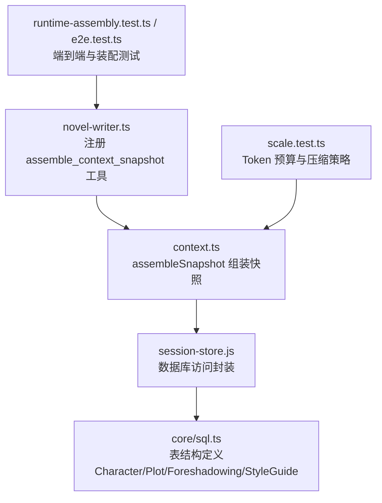
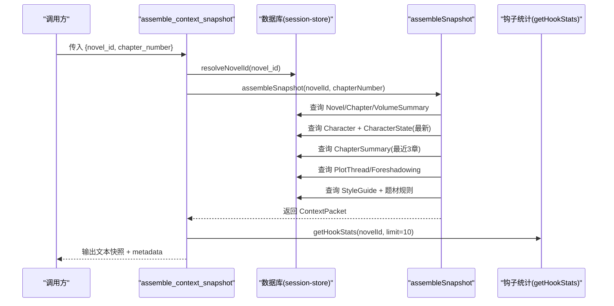
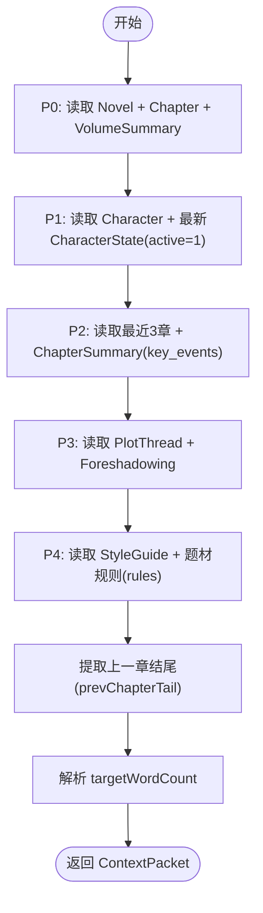
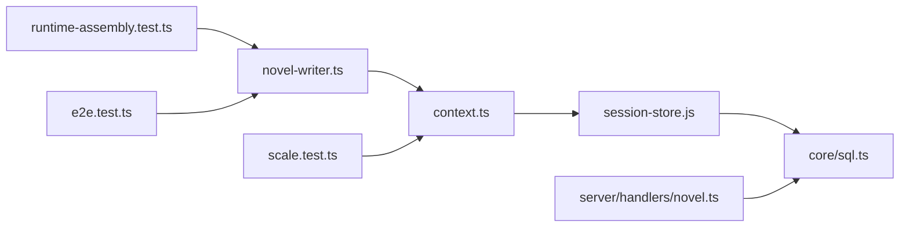

# 步骤2：上下文组装

<cite>
**本文引用的文件**   
- [novel-writer.ts](file://packages/plugin/src/novel-writer.ts)
- [context.ts](file://packages/plugin/src/novel-writer/context.ts)
- [sql.ts](file://packages/core/src/session/sql.ts)
- [runtime-assembly.test.ts](file://packages/plugin/test/novel-writer/runtime-assembly.test.ts)
- [e2e.test.ts](file://packages/plugin/test/novel-writer/e2e.test.ts)
- [scale.test.ts](file://packages/plugin/test/novel-writer/scale.test.ts)
- [handlers/novel.ts](file://packages/server/src/handlers/novel.ts)
</cite>

## 目录
1. [简介](#简介)
2. [项目结构](#项目结构)
3. [核心组件](#核心组件)
4. [架构总览](#架构总览)
5. [详细组件分析](#详细组件分析)
6. [依赖关系分析](#依赖关系分析)
7. [性能考量](#性能考量)
8. [故障排查指南](#故障排查指南)
9. [结论](#结论)
10. [附录](#附录)

## 简介
本章节聚焦 openNovel 八步写作流水线中的“上下文组装”（步骤2），围绕 assemble_context_snapshot 工具与 assembleSnapshot 函数，系统阐述如何从数据库查询并组装小说蓝图、活跃角色、最近章节摘要、剧情线索、伏笔、风格指南等关键信息，形成结构化上下文快照。文档同时解释钩子轮换统计与字数目标检查的实现细节，并提供调用示例路径，帮助读者快速理解与使用。

## 项目结构
- 工具注册入口位于插件层，暴露 assemble_context_snapshot 工具，供流水线步骤2调用。
- 上下文组装核心逻辑在 context.ts 中实现，按优先级分层组装 ContextPacket。
- 数据模型定义在 core 层的 session/sql.ts 中，包含 CharacterTable、PlotThreadTable、ForeshadowingTable、StyleGuideTable 等表结构。
- 测试用例覆盖端到端流程与规模场景，验证快照内容与 token 预算控制。

图表来源 
- [novel-writer.ts:695-762](file://packages/plugin/src/novel-writer.ts#L695-L762)
- [context.ts:179-321](file://packages/plugin/src/novel-writer/context.ts#L179-L321)
- [sql.ts:336-442](file://packages/core/src/session/sql.ts#L336-L442)
- [runtime-assembly.test.ts:69-74](file://packages/plugin/test/novel-writer/runtime-assembly.test.ts#L69-L74)
- [e2e.test.ts:303-383](file://packages/plugin/test/novel-writer/e2e.test.ts#L303-L383)
- [scale.test.ts:170-202](file://packages/plugin/test/novel-writer/scale.test.ts#L170-L202)

章节来源
- [novel-writer.ts:695-762](file://packages/plugin/src/novel-writer.ts#L695-L762)
- [context.ts:179-321](file://packages/plugin/src/novel-writer/context.ts#L179-L321)
- [sql.ts:336-442](file://packages/core/src/session/sql.ts#L336-L442)

## 核心组件
- assemble_context_snapshot 工具：暴露给流水线步骤2，接收 novel_id 与 chapter_number，返回文本化快照与元数据。
- assembleSnapshot 函数：核心组装器，按 P0-P4 层级读取数据库并生成 ContextPacket。
- 数据表与映射：CharacterTable、CharacterStateTable、ChapterTable、ChapterSummaryTable、VolumeSummaryTable、PlotThreadTable、ForeshadowingTable、StyleGuideTable 等。
- 题材规则加载：根据小说题材动态导入 genre rules。
- 钩子轮换统计：getHookStats 用于输出最近钩子使用与警告。
- 字数目标检查：从 style_guide.rules.chapter_length 解析 targetWordCount。

章节来源
- [novel-writer.ts:695-762](file://packages/plugin/src/novel-writer.ts#L695-L762)
- [context.ts:179-321](file://packages/plugin/src/novel-writer/context.ts#L179-L321)
- [sql.ts:336-442](file://packages/core/src/session/sql.ts#L336-L442)

## 架构总览
assemble_context_snapshot 工具通过 resolveNovelId 定位小说，再调用 assembleSnapshot 完成多表聚合，最终将结果序列化为可读文本并附带 metadata（如角色数、线索数）。

图表来源 
- [novel-writer.ts:695-762](file://packages/plugin/src/novel-writer.ts#L695-L762)
- [context.ts:179-321](file://packages/plugin/src/novel-writer/context.ts#L179-L321)

## 详细组件分析

### 上下文快照数据结构（ContextPacket）
- P0 蓝图：novelTitle、genre、synopsis
- P1 活跃角色：ActiveCharacter[]（name、role、description、location、mood、summary）
- P2 卷+章节摘要：volumeSummary、recentChapterSummaries[]（chapterOrder、chapterTitle、summary、keyEvents）
- P3 线索+伏笔：plotThreads[]（title、status、priority、description）、foreshadowing[]（id、content、state、plantedChapterId）
- P4 风格+规则：styleGuide（rules、tone、pov、tense）、genreRules[]
- 附加字段：prevChapterTail（上一章结尾约600字）、targetWordCount（每章最低字数）

章节来源
- [context.ts:125-151](file://packages/plugin/src/novel-writer/context.ts#L125-L151)

### 组装逻辑与数据库关联
- 蓝图与当前章节：从 NovelTable 获取蓝图；从 ChapterTable 定位当前章节与所在卷，再查 VolumeSummaryTable 获取卷摘要。
- 活跃角色：遍历 CharacterTable，对每个角色查询 CharacterStateTable 的最新记录，仅保留 active=1 的角色。
- 最近章节摘要：取 order ≤ chapterNumber 的最近3章，关联 ChapterSummaryTable 获取 summary 与 key_events。
- 剧情线索与伏笔：分别查询 PlotThreadTable 与 ForeshadowingTable，过滤 novel_id。
- 风格指南与题材规则：查询 StyleGuideTable，解析 rules（兼容双重编码），并按题材动态导入 rules 数组。
- 上一章结尾：取 chapterNumber-1 的 content 末尾约600字，作为 prevChapterTail。
- 字数目标：从 styleGuide.rules.chapter_length 解析 targetWordCount。

图表来源 
- [context.ts:179-321](file://packages/plugin/src/novel-writer/context.ts#L179-L321)

章节来源
- [context.ts:179-321](file://packages/plugin/src/novel-writer/context.ts#L179-L321)

### 钩子轮换统计与字数目标检查
- 钩子轮换统计：assemble_context_snapshot 在执行后调用 getHookStats(novelId, 10)，汇总最近钩子类型序列与警告信息，并在输出中展示。
- 字数目标检查：从 styleGuide.rules.chapter_length 解析数值，若有效则写入 targetWordCount，write_chapter 会拒绝低于此字数的章节。

章节来源
- [novel-writer.ts:744-752](file://packages/plugin/src/novel-writer.ts#L744-L752)
- [context.ts:280-284](file://packages/plugin/src/novel-writer/context.ts#L280-L284)

### 与数据库各表的关联查询
- CharacterTable：角色基础信息（id、novel_id、name、role、description、created_at）
- CharacterStateTable：角色状态（character_id、chapter_id、active、location、mood、summary）
- PlotThreadTable：剧情线索（id、novel_id、title、status、priority、description、created_at、closed_at）
- ForeshadowingTable：伏笔（id、novel_id、planted_chapter_id、resolved_chapter_id、content、state、created_at）
- StyleGuideTable：风格指南（id、novel_id、rules、tone、pov、tense）
- ChapterTable/ChapterSummaryTable/VolumeSummaryTable：章节与卷摘要

章节来源
- [sql.ts:336-442](file://packages/core/src/session/sql.ts#L336-L442)
- [runtime-assembly.test.ts:69-74](file://packages/plugin/test/novel-writer/runtime-assembly.test.ts#L69-L74)
- [e2e.test.ts:303-383](file://packages/plugin/test/novel-writer/e2e.test.ts#L303-L383)

### 代码示例：如何组装完整的写作上下文
- 工具调用入口：在 novel-writer.ts 中注册 assemble_context_snapshot，参数为 novel_id 与 chapter_number，执行后返回文本化快照与 metadata。
- 核心组装：在 context.ts 中调用 assembleSnapshot，按层级读取数据并构造 ContextPacket。
- 参考路径：
  - 工具注册与执行：[novel-writer.ts:695-762](file://packages/plugin/src/novel-writer.ts#L695-L762)
  - 组装函数：[context.ts:179-321](file://packages/plugin/src/novel-writer/context.ts#L179-L321)
  - 表结构定义：[sql.ts:336-442](file://packages/core/src/session/sql.ts#L336-L442)

章节来源
- [novel-writer.ts:695-762](file://packages/plugin/src/novel-writer.ts#L695-L762)
- [context.ts:179-321](file://packages/plugin/src/novel-writer/context.ts#L179-L321)
- [sql.ts:336-442](file://packages/core/src/session/sql.ts#L336-L442)

## 依赖关系分析
- novel-writer.ts 依赖 context.ts 的 assembleSnapshot 与 parseStyleRules。
- context.ts 依赖 session-store.js 的数据库访问封装与 core/sql.ts 的表定义。
- handlers/novel.ts 提供 to* 转换函数，用于服务端处理与序列化。
- 测试用例覆盖装配流程与规模场景，确保 token 预算与内容完整性。

图表来源 
- [novel-writer.ts:695-762](file://packages/plugin/src/novel-writer.ts#L695-L762)
- [context.ts:179-321](file://packages/plugin/src/novel-writer/context.ts#L179-L321)
- [sql.ts:336-442](file://packages/core/src/session/sql.ts#L336-L442)
- [handlers/novel.ts:161-218](file://packages/server/src/handlers/novel.ts#L161-L218)

章节来源
- [handlers/novel.ts:161-218](file://packages/server/src/handlers/novel.ts#L161-L218)

## 性能考量
- Token 预算分层：P0-P4 分层设计，目标 ch100 时控制在 8K tokens 以内。
- 角色裁剪：大规模下通过 applyBudget 裁剪活跃角色数量，保证 P1 预算。
- 线索与伏笔压缩：P3 预算内优先保留高优先级线索，再压缩伏笔。
- 最近摘要限制：仅取最近3章摘要，避免上下文膨胀。
- 容量测试：scale.test.ts 验证 ch1000 下的压缩效果与预算控制。

章节来源
- [scale.test.ts:170-202](file://packages/plugin/test/novel-writer/scale.test.ts#L170-L202)
- [scale.test.ts:844-876](file://packages/plugin/test/novel-writer/scale.test.ts#L844-L876)

## 故障排查指南
- 快照为空：检查 novelId 是否存在，以及 assembleSnapshot 是否返回 null。
- 角色状态缺失：确认 CharacterStateTable 是否有最新记录且 active=1。
- 章节摘要缺失：检查 ChapterSummaryTable 是否已写入对应 chapter_id 的摘要。
- 伏笔未出现：确认 ForeshadowingTable 中 state 与 novel_id 是否正确。
- 风格指南解析失败：rules 可能为双重编码字符串，需使用 parseStyleRules 兼容处理。
- 字数目标无效：检查 styleGuide.rules.chapter_length 是否为正整数。

章节来源
- [context.ts:35-47](file://packages/plugin/src/novel-writer/context.ts#L35-L47)
- [context.ts:280-284](file://packages/plugin/src/novel-writer/context.ts#L280-L284)

## 结论
assemble_context_snapshot 与 assembleSnapshot 共同构成 openNovel 写作流水线的“上下文组装”核心，通过分层数据聚合与预算控制，为 AI 写作提供稳定、紧凑、可追溯的上下文快照。结合钩子轮换统计与字数目标检查，进一步保障写作一致性与质量。

## 附录
- 相关表结构参考：
  - CharacterTable、CharacterStateTable、PlotThreadTable、ForeshadowingTable、StyleGuideTable、ChapterTable、ChapterSummaryTable、VolumeSummaryTable
- 测试用例参考：
  - runtime-assembly.test.ts：装配流程与表结构
  - e2e.test.ts：端到端流程与快照断言
  - scale.test.ts：Token 预算与压缩策略