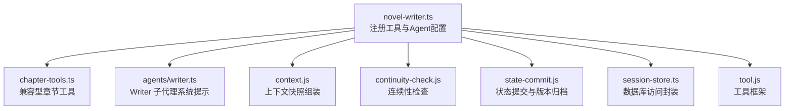
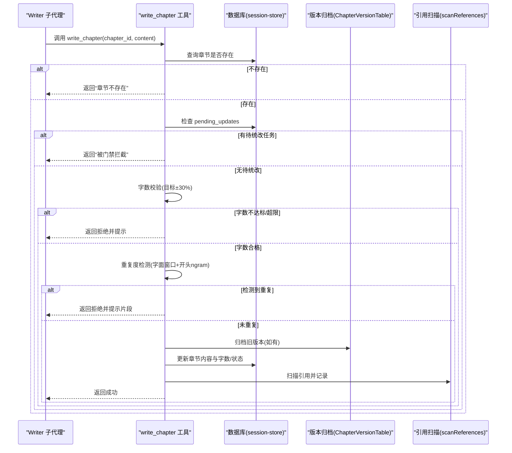
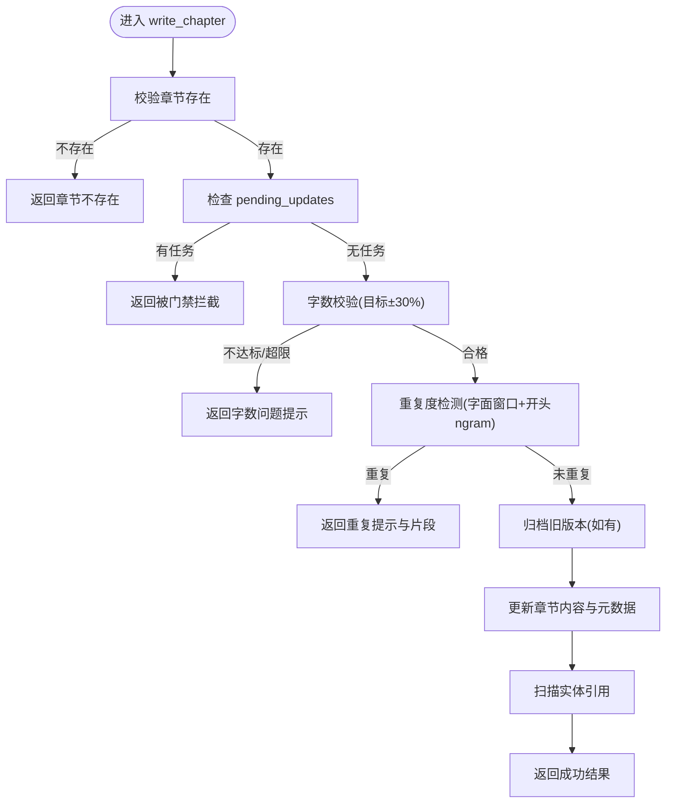
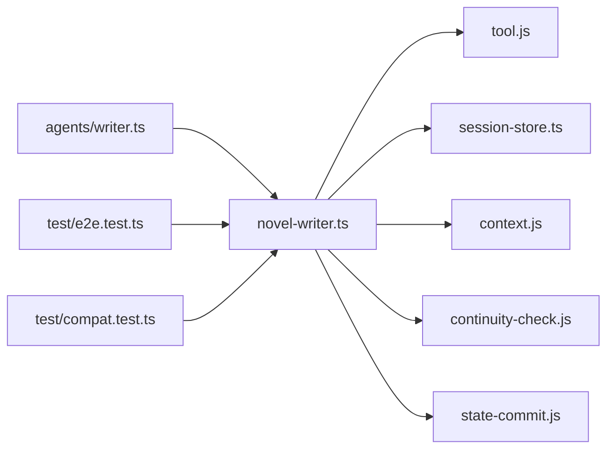

# 步骤3：草稿撰写

<cite>
**本文引用的文件**   
- [novel-writer.ts](file://packages/plugin/src/novel-writer.ts)
- [chapter-tools.ts](file://packages/plugin/src/novel-writer/chapter-tools.ts)
- [writer.ts](file://packages/plugin/src/novel-writer/agents/writer.ts)
- [director.ts](file://packages/plugin/src/novel-writer/agents/director.ts)
- [session-store.ts](file://packages/plugin/src/novel-writer/session-store.ts)
- [context.js](file://packages/plugin/src/novel-writer/context.js)
- [continuity-check.js](file://packages/plugin/src/novel-writer/continuity-check.js)
- [pipeline.js](file://packages/plugin/src/novel-writer/pipeline.js)
- [state-commit.js](file://packages/plugin/src/novel-writer/state-commit.js)
- [tool.js](file://packages/plugin/src/tool.js)
- [e2e.test.ts](file://packages/plugin/test/novel-writer/e2e.test.ts)
- [compat.test.ts](file://packages/plugin/test/novel-writer/compat.test.ts)
</cite>

## 目录
1. [简介](#简介)
2. [项目结构](#项目结构)
3. [核心组件](#核心组件)
4. [架构总览](#架构总览)
5. [详细组件分析](#详细组件分析)
6. [依赖关系分析](#依赖关系分析)
7. [性能考量](#性能考量)
8. [故障排查指南](#故障排查指南)
9. [结论](#结论)
10. [附录](#附录)

## 简介
本文件聚焦 openNovel 八步写作流水线中的“草稿撰写”步骤，围绕 write_chapter 工具的实现机制展开，涵盖章节内容生成、校验与持久化全流程。重点说明字数校验、重复度检测、前置条件检查等质量保障策略；解释与 AI 写作代理（writer agent）的集成方式与提示工程要点；并给出错误处理与重试逻辑的实践建议。文末提供端到端示例路径，帮助读者快速定位关键实现。

## 项目结构
“草稿撰写”相关代码主要位于插件模块中，核心由 novel-writer.ts 注册工具与 Agent 配置，chapter-tools.ts 提供兼容型章节工具，agents/writer.ts 定义 writer 子代理的系统提示与规则，以及若干辅助模块负责上下文组装、连续性检查、状态提交等。

**图表来源** 
- [novel-writer.ts:242-329](file://packages/plugin/src/novel-writer.ts#L242-L329)
- [chapter-tools.ts:1-163](file://packages/plugin/src/novel-writer/chapter-tools.ts#L1-L163)
- [writer.ts:1-136](file://packages/plugin/src/novel-writer/agents/writer.ts#L1-L136)
- [context.js:1-200](file://packages/plugin/src/novel-writer/context.js#L1-L200)
- [continuity-check.js:1-200](file://packages/plugin/src/novel-writer/continuity-check.js#L1-L200)
- [state-commit.js:1-200](file://packages/plugin/src/novel-writer/state-commit.js#L1-L200)
- [session-store.ts:1-200](file://packages/plugin/src/novel-writer/session-store.ts#L1-L200)
- [tool.js:1-200](file://packages/plugin/src/tool.js#L1-L200)

**章节来源**
- [novel-writer.ts:242-329](file://packages/plugin/src/novel-writer.ts#L242-L329)
- [chapter-tools.ts:1-163](file://packages/plugin/src/novel-writer/chapter-tools.ts#L1-L163)
- [writer.ts:1-136](file://packages/plugin/src/novel-writer/agents/writer.ts#L1-L136)

## 核心组件
- write_chapter 工具：负责将 AI 生成的章节正文写入数据库，执行前置门禁（待统改任务拦截）、字数校验、重复度检测、历史版本归档与引用扫描，最终更新章节内容与元数据。
- revise_chapter 工具：修订已存在正文章节，流程与 write_chapter 类似，但用于审计失败后的自动修订或人工修改。
- writer 子代理：由 director/pipeline 调度，依据系统提示与上下文生成章节正文，并在生成后调用 write_chapter 完成落库；若被拒绝则按提示补足或重写后重试。
- 上下文快照与风格指南：为 writer 提供目标字数、前文结尾、角色/剧情/伏笔等信息，确保生成内容符合规范。
- 数据库层：通过 session-store.ts 提供的表结构与 ORM 操作进行读写与版本管理。

**章节来源**
- [novel-writer.ts:242-329](file://packages/plugin/src/novel-writer.ts#L242-L329)
- [novel-writer.ts:330-416](file://packages/plugin/src/novel-writer.ts#L330-L416)
- [writer.ts:1-136](file://packages/plugin/src/novel-writer/agents/writer.ts#L1-L136)
- [context.js:1-200](file://packages/plugin/src/novel-writer/context.js#L1-L200)
- [session-store.ts:1-200](file://packages/plugin/src/novel-writer/session-store.ts#L1-L200)

## 架构总览
write_chapter 的执行链路如下：AI writer 子代理根据大纲与上下文生成正文 → 调用 write_chapter → 前置门禁检查（pending_updates）→ 字数校验（目标±30%）→ 重复度检测（字面窗口+开头ngram相似度）→ 历史版本归档（如有旧正文）→ 更新章节内容与统计字段 → 扫描实体引用 → 返回成功结果。

**图表来源** 
- [novel-writer.ts:242-329](file://packages/plugin/src/novel-writer.ts#L242-L329)
- [novel-writer.ts:2287-2383](file://packages/plugin/src/novel-writer.ts#L2287-L2383)
- [session-store.ts:1-200](file://packages/plugin/src/novel-writer/session-store.ts#L1-L200)

## 详细组件分析

### write_chapter 工具实现
- 输入参数：chapter_id（章节ID）、content（章节正文）。
- 前置条件检查：
  - 章节存在性校验。
  - 待统改任务门禁：若小说存在 pending 状态的统改任务，直接拦截并提示先处理。
- 字数校验：
  - 目标字数来源于 style_guide.rules.chapter_length（缺省 2500）。
  - 低于目标或超过目标的 130% 均拒绝写入，返回明确提示与元数据。
- 重复度检测：
  - 两层检测：50字符窗口（步长10采样）匹配字面完全相同片段；本章开头300字与前文章节开头的6-gram Jaccard相似度检测场景重演。
  - 任一阈值命中即视为重复，返回相似片段样例与原因。
- 持久化与版本管理：
  - 若已有正文，先归档到 ChapterVersionTable（版本号递增）。
  - 更新 chapters 表的 content、word_count、status、updated_at。
  - 扫描正文中的实体引用并记录。
- 输出：
  - 成功时返回章节序号、标题、字数与目标信息。
  - 失败时返回标题、输出信息与 metadata（包含 rejected、reason、word_count、target、ratio 等）。

**图表来源** 
- [novel-writer.ts:242-329](file://packages/plugin/src/novel-writer.ts#L242-L329)
- [novel-writer.ts:2287-2383](file://packages/plugin/src/novel-writer.ts#L2287-L2383)

**章节来源**
- [novel-writer.ts:242-329](file://packages/plugin/src/novel-writer.ts#L242-L329)
- [novel-writer.ts:2287-2383](file://packages/plugin/src/novel-writer.ts#L2287-L2383)

### revise_chapter 工具实现
- 用途：修订已存在的章节正文，流程与 write_chapter 一致，但针对修订场景。
- 关键点：
  - 若无正文则无需修订。
  - 同样执行字数校验与重复度检测。
  - 修订前先归档旧版本，再更新为新内容。
  - 成功后设置 status 为 revised。

**章节来源**
- [novel-writer.ts:330-416](file://packages/plugin/src/novel-writer.ts#L330-L416)

### Writer 子代理与提示工程
- writer 子代理由 pipeline/director 调度，系统提示包含26条写作规则（节奏、钩子、视角、对话密度、打脸结构、力量体系、金手指约束、字数控制、章节节拍、题材规范等）。
- 工作流程：
  - 接收大纲与上下文，确定钩子类型与题材模板。
  - 检查“上一章结尾原文”，确保自然衔接且不重演前文。
  - 按四段式节拍结构生成正文。
  - 自检字数与重复度，必要时扩写或重写。
  - 调用 write_chapter 落库；若被拒绝，按提示修正后重试。
- 目标字数来自快照中的 chapter_length（默认 2500），write_chapter 会拒绝低于目标或超过 130% 的内容。

**章节来源**
- [writer.ts:1-136](file://packages/plugin/src/novel-writer/agents/writer.ts#L1-L136)
- [novel-writer.ts:2297-2305](file://packages/plugin/src/novel-writer.ts#L2297-L2305)

### 上下文快照与前置条件
- assemble_context_snapshot 工具聚合小说蓝图、活跃角色、最近章节摘要、剧情线索、伏笔、风格指南、目标字数、上一章结尾原文等，供 writer 生成内容参考。
- 系统提示注入 hook 会在会话压缩时保留小说上下文，确保长程一致性。

**章节来源**
- [novel-writer.ts:695-762](file://packages/plugin/src/novel-writer.ts#L695-L762)
- [novel-writer.ts:101-191](file://packages/plugin/src/novel-writer.ts#L101-L191)

### 数据库与版本管理
- session-store.ts 提供章节、版本、评审、状态日志等表的 ORM 访问。
- nextVersion 计算新版本号（从1起，基于最大值+1）。
- ChapterVersionTable 用于归档历史版本，支持回滚与恢复。

**章节来源**
- [session-store.ts:1-200](file://packages/plugin/src/novel-writer/session-store.ts#L1-L200)
- [novel-writer.ts:2273-2282](file://packages/plugin/src/novel-writer.ts#L2273-L2282)

### 兼容性工具 chapterWrite/chapterRevise
- chapter-tools.ts 提供兼容型章节工具，用于测试与早期版本：
  - chapterWrite：简单验证 2000-3000 字符后写入。
  - chapterRevise：保存旧版本到 chapter_versions 再更新。
- 这些工具与 novel-writer.ts 中的 write_chapter/revise_chapter 互补，适用于不同阶段与场景。

**章节来源**
- [chapter-tools.ts:1-163](file://packages/plugin/src/novel-writer/chapter-tools.ts#L1-L163)

## 依赖关系分析
- novel-writer.ts 依赖 tool.js 定义工具框架，依赖 session-store.ts 进行数据库操作，依赖 context.js、continuity-check.js、state-commit.js 提供上下文、连续性与状态管理能力。
- writer 子代理依赖 system prompt 与上下文快照，通过 write_chapter 工具与数据库交互。
- 测试用例 e2e.test.ts 与 compat.test.ts 覆盖章节生成、写入、审计等流程。

**图表来源** 
- [novel-writer.ts:242-329](file://packages/plugin/src/novel-writer.ts#L242-L329)
- [writer.ts:1-136](file://packages/plugin/src/novel-writer/agents/writer.ts#L1-L136)
- [e2e.test.ts:451-517](file://packages/plugin/test/novel-writer/e2e.test.ts#L451-L517)
- [compat.test.ts:301-317](file://packages/plugin/test/novel-writer/compat.test.ts#L301-L317)

**章节来源**
- [novel-writer.ts:242-329](file://packages/plugin/src/novel-writer.ts#L242-L329)
- [writer.ts:1-136](file://packages/plugin/src/novel-writer/agents/writer.ts#L1-L136)
- [e2e.test.ts:451-517](file://packages/plugin/test/novel-writer/e2e.test.ts#L451-L517)
- [compat.test.ts:301-317](file://packages/plugin/test/novel-writer/compat.test.ts#L301-L317)

## 性能考量
- 字数统计 countWords 使用正则匹配中日文字符与英文数字，避免全量遍历，提升效率。
- 重复度检测采用滑动窗口与 ngram 集合，限制窗口大小与步长，降低复杂度。
- 上下文快照按层级预算压缩（P0/P1/P2/P3/P4），控制 token 数量，保证 LLM 调用稳定性。
- 数据库操作使用 drizzle-orm，批量查询与更新减少往返开销。

[本节为通用指导，不直接分析具体文件]

## 故障排查指南
- 章节不存在：检查 chapter_id 是否正确，或是否已生成大纲。
- 被门禁拦截：存在 pending_updates 任务，需先调用 cascade_execute 或 cascade_list_pending 处理。
- 字数不达标/超限：调整正文长度至目标±30%范围内。
- 与前文重复：重写重复片段，确保开头自然衔接且不重演前文场景。
- 修订失败：确认章节已有正文，且修订后满足字数与重复度要求。
- 版本回滚：使用 rollbackChapter 或 restoreChapterVersion 恢复历史版本。

**章节来源**
- [novel-writer.ts:242-329](file://packages/plugin/src/novel-writer.ts#L242-L329)
- [novel-writer.ts:330-416](file://packages/plugin/src/novel-writer.ts#L330-L416)
- [novel-writer.ts:522-570](file://packages/server/src/handlers/novel.ts#L522-L570)
- [novel-writer.ts:800-840](file://packages/server/src/handlers/novel.ts#L800-L840)

## 结论
write_chapter 工具在 openNovel 的“草稿撰写”步骤中扮演核心角色，通过严格的前置门禁、字数校验与重复度检测，确保章节内容的质量与一致性。与 writer 子代理的深度集成，结合系统提示与上下文快照，实现了高质量的自动化章节生成。完善的错误处理与版本管理机制，为修订与回滚提供了可靠保障。

[本节为总结，不直接分析具体文件]

## 附录
- 端到端示例路径：
  - 章节生成与写入：参见 e2e.test.ts 中“步骤4：撰写第1章”用例。
  - 兼容性工具使用：参见 compat.test.ts 中 write_chapter 调用示例。
  - 上下文组装：参见 assemble_context_snapshot 工具与 writer 系统提示。
  - 审计与修订：参见 check_continuity 与 revise_chapter 工具。

**章节来源**
- [e2e.test.ts:451-517](file://packages/plugin/test/novel-writer/e2e.test.ts#L451-L517)
- [compat.test.ts:301-317](file://packages/plugin/test/novel-writer/compat.test.ts#L301-L317)
- [novel-writer.ts:695-762](file://packages/plugin/src/novel-writer.ts#L695-L762)
- [writer.ts:1-136](file://packages/plugin/src/novel-writer/agents/writer.ts#L1-L136)