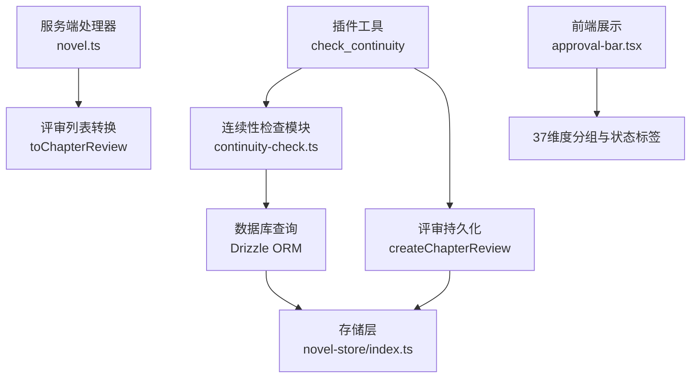
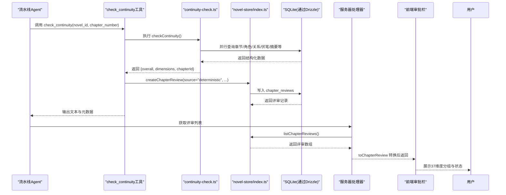
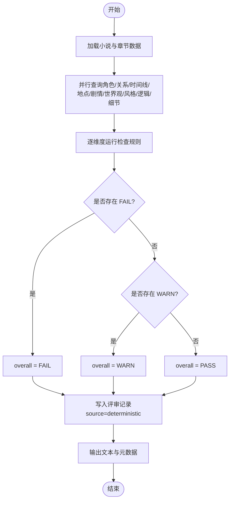
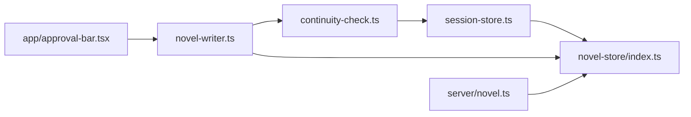

# 步骤4：连续性审查

<cite>
**本文引用的文件**   
- [continuity-check.ts](file://packages/plugin/src/novel-writer/continuity-check.ts)
- [novel-writer.ts](file://packages/plugin/src/novel-writer.ts)
- [session-store.ts](file://packages/plugin/src/novel-writer/session-store.ts)
- [index.ts](file://packages/novel-store/src/index.ts)
- [approval-bar.tsx](file://packages/app/src/pages/novel/approval-bar.tsx)
- [review.test.ts](file://packages/plugin/test/novel-writer/review.test.ts)
- [e2e.test.ts](file://packages/plugin/test/novel-writer/e2e.test.ts)
- [novel.ts](file://packages/server/src/handlers/novel.ts)
</cite>

## 目录
1. [简介](#简介)
2. [项目结构](#项目结构)
3. [核心组件](#核心组件)
4. [架构总览](#架构总览)
5. [详细组件分析](#详细组件分析)
6. [依赖关系分析](#依赖关系分析)
7. [性能考量](#性能考量)
8. [故障排查指南](#故障排查指南)
9. [结论](#结论)
10. [附录](#附录)

## 简介
本章节聚焦 openNovel 八步写作流水线中的“连续性审查”（步骤4），系统性阐述 check_continuity 工具所实现的 37 维度确定性检查机制。内容覆盖角色一致性、时间线连贯性、地点准确性、情节逻辑性等九大类维度的检查规则，解释检查结果的数据结构、评分标准与报告格式，说明与 ChapterReviewTable 的交互及评审记录的持久化流程，并给出 FAIL、WARN、PASS 三种状态的判断逻辑与使用示例路径。

## 项目结构
连续性审查由插件层暴露工具、核心检查模块执行、存储层持久化、服务端处理器转换以及前端展示共同构成。关键文件如下：
- 工具入口与调用：packages/plugin/src/novel-writer.ts
- 37 维度检查实现：packages/plugin/src/novel-writer/continuity-check.ts
- 评审持久化接口：packages/plugin/src/novel-writer/session-store.ts（导出自 novel-store）
- 数据库表结构与持久化函数：packages/novel-store/src/index.ts
- 服务端评审数据转换：packages/server/src/handlers/novel.ts
- 前端分类与状态映射：packages/app/src/pages/novel/approval-bar.tsx
- 测试用例验证行为：packages/plugin/test/novel-writer/review.test.ts、e2e.test.ts

图表来源
- [novel-writer.ts:763-802](file://packages/plugin/src/novel-writer.ts#L763-L802)
- [continuity-check.ts:149-232](file://packages/plugin/src/novel-writer/continuity-check.ts#L149-L232)
- [index.ts:970-1023](file://packages/novel-store/src/index.ts#L970-L1023)
- [novel.ts:139-159](file://packages/server/src/handlers/novel.ts#L139-L159)
- [approval-bar.tsx:41-52](file://packages/app/src/pages/novel/approval-bar.tsx#L41-L52)

章节来源
- [novel-writer.ts:763-802](file://packages/plugin/src/novel-writer.ts#L763-L802)
- [continuity-check.ts:149-232](file://packages/plugin/src/novel-writer/continuity-check.ts#L149-L232)
- [index.ts:970-1023](file://packages/novel-store/src/index.ts#L970-L1023)
- [novel.ts:139-159](file://packages/server/src/handlers/novel.ts#L139-L159)
- [approval-bar.tsx:41-52](file://packages/app/src/pages/novel/approval-bar.tsx#L41-L52)

## 核心组件
- 连续性检查主函数
  - 功能：读取小说与章节相关元数据，并行查询多表，按 37 个维度逐一判定 PASS/WARN/FAIL，汇总整体结果。
  - 输出：包含 novelId、chapterNumber、chapterId、overall、dimensions。
- 37 维度清单与分组
  - 九大类：角色连续性（5）、关系连续性（4）、时间线（4）、地点（4）、剧情（5）、世界观（5）、风格（4）、逻辑（3）、细节（3）。
  - 维度名称常量用于前后端一致性与提交校验。
- 评审持久化
  - createChapterReview：自动推导轮次 round、统计 pass/warn/fail 计数、JSON 序列化 dimensions、记录 sessionId。
  - listChapterReviews：按创建时间倒序返回评审记录。
- 工具封装
  - check_continuity：调用 checkContinuity，若成功则写入评审记录（source=deterministic），并生成可读输出与元数据。

章节来源
- [continuity-check.ts:61-111](file://packages/plugin/src/novel-writer/continuity-check.ts#L61-L111)
- [continuity-check.ts:149-232](file://packages/plugin/src/novel-writer/continuity-check.ts#L149-L232)
- [index.ts:970-1023](file://packages/novel-store/src/index.ts#L970-L1023)
- [novel-writer.ts:763-802](file://packages/plugin/src/novel-writer.ts#L763-L802)

## 架构总览
连续性审查在流水线中的调用链与数据流如下：

图表来源
- [novel-writer.ts:763-802](file://packages/plugin/src/novel-writer.ts#L763-L802)
- [continuity-check.ts:149-232](file://packages/plugin/src/novel-writer/continuity-check.ts#L149-L232)
- [index.ts:970-1023](file://packages/novel-store/src/index.ts#L970-L1023)
- [novel.ts:512-520](file://packages/server/src/handlers/novel.ts#L512-L520)

## 详细组件分析

### 37 维度检查规则与判定逻辑
- 角色连续性（5 维）
  - 姓名一致性：校验角色状态引用是否全部存在于角色表；无角色时给 WARN。
  - 外貌描述：统计缺少描述的比例，超过半数或存在缺失时给 WARN，否则 PASS。
  - 性格一致：基于情绪词对检测连续章节间突变次数，异常则 WARN。
  - 能力等级：世界观中是否存在力量体系条目，缺失则 WARN。
  - 位置连续：角色位置变化频繁且不合理时 WARN。
- 关系连续性（4 维）
  - 关系类型一致：类型是否在允许集合内，空值或非标准类型给 WARN。
  - 敌友转变有因：同一对角色同时存在敌对与友好类型时 WARN。
  - 亲密度变化：角色状态摘要中是否记录关系/亲密变化，未记录则 WARN。
  - 信任度变化：角色状态摘要中是否记录信任变化，未记录则 WARN。
- 时间线（4 维）
  - 事件顺序：章节序号是否连续，缺章或从非第1章开始给 WARN。
  - 时间流逝合理：相邻章节创建时间间隔过短或出现倒退，严重情况 FAIL。
  - 季节一致：摘要中是否有季节关键词，缺失则 WARN。
  - 年龄变化：角色描述是否含年龄信息，缺失则 WARN。
- 地点（4 维）
  - 地点描述一致：世界观中是否有地点条目，缺失则 WARN。
  - 距离合理：角色状态中是否有位置变化记录，无则 WARN。
  - 环境细节：世界观中是否有环境条目，缺失则 WARN。
  - 地图一致：世界观中是否有地图条目，缺失则 WARN。
- 剧情（5 维）
  - 主线推进：线索状态分布（open/resolved/paused），无线索则 WARN。
  - 伏笔回收：未回收比例过高（>80%且章节数>50）时 WARN。
  - 冲突升级：高优先级线索或冲突关键词存在则 PASS，否则 WARN。
  - 转折合理：摘要中是否出现转折关键词，章节数较多却无转折则 WARN。
  - 结局呼应：首尾章节均有摘要时可检查呼应，否则 WARN。
- 世界观（5 维）
  - 力量体系：是否存在力量体系条目，缺失则 WARN。
  - 规则一致：风格指南中规则数量，无规则则 WARN。
  - 社会结构：是否存在社会相关条目，缺失则 WARN。
  - 文化细节：是否存在文化相关条目，缺失则 WARN。
  - 经济系统：是否存在经济相关条目，缺失则 WARN。
- 风格（4 维）
  - 叙事视角：POV 是否设定，未设定则 WARN。
  - 语言风格：tone 是否设定，未设定则 WARN。
  - 节奏一致：字数偏离平均值超过阈值则 WARN。
  - 描写密度：摘要中是否包含描写相关描述，缺失则 WARN。
- 逻辑（3 维）
  - 因果链：摘要中是否包含因果关键词，缺失则 WARN。
  - 动机合理：角色描述/状态中是否包含动机关键词，缺失则 WARN。
  - 信息对称：角色状态在不同章节间矛盾（如 active 状态异常回跳）则 WARN。
- 细节（3 维）
  - 物品追踪：摘要中是否涉及物品/道具，缺失则 WARN。
  - 数字一致：摘要中是否包含数字数据，缺失则 WARN。
  - 称呼一致：角色名称在各处是否一致，发现不一致则 WARN。

整体结果判定：
- 任一维度为 FAIL → overall=FAIL
- 无 FAIL 但有 WARN → overall=WARN
- 全为 PASS → overall=PASS

章节来源
- [continuity-check.ts:236-359](file://packages/plugin/src/novel-writer/continuity-check.ts#L236-L359)
- [continuity-check.ts:363-512](file://packages/plugin/src/novel-writer/continuity-check.ts#L363-L512)
- [continuity-check.ts:516-629](file://packages/plugin/src/novel-writer/continuity-check.ts#L516-L629)
- [continuity-check.ts:633-721](file://packages/plugin/src/novel-writer/continuity-check.ts#L633-L721)
- [continuity-check.ts:725-852](file://packages/plugin/src/novel-writer/continuity-check.ts#L725-L852)
- [continuity-check.ts:856-974](file://packages/plugin/src/novel-writer/continuity-check.ts#L856-L974)
- [continuity-check.ts:978-1059](file://packages/plugin/src/novel-writer/continuity-check.ts#L978-L1059)
- [continuity-check.ts:1063-1132](file://packages/plugin/src/novel-writer/continuity-check.ts#L1063-L1132)
- [continuity-check.ts:1136-1200](file://packages/plugin/src/novel-writer/continuity-check.ts#L1136-L1200)
- [continuity-check.ts:1205-1359](file://packages/plugin/src/novel-writer/continuity-check.ts#L1205-L1359)

### 数据结构与评分标准
- 单个维度结果
  - dimension：维度名称（必须来自 37 维清单）
  - status：PASS / WARN / FAIL
  - detail：具体说明（通过原因/潜在风险/具体矛盾）
  - evidence（可选）：证据引用（例如段落或章节片段）
- 总体结果
  - overall：PASS / WARN / FAIL（由维度状态聚合）
  - dimensions：维度结果数组
  - chapterId：当前章节 ID（供评审持久化使用）
- 评审记录字段
  - id、chapter_id、round、source、overall、pass_count、warn_count、fail_count、dimensions（JSON）、summary、session_id、created_at

章节来源
- [continuity-check.ts:34-59](file://packages/plugin/src/novel-writer/continuity-check.ts#L34-L59)
- [index.ts:99-114](file://packages/novel-store/src/index.ts#L99-L114)
- [index.ts:970-1023](file://packages/novel-store/src/index.ts#L970-L1023)

### 与 ChapterReviewTable 的交互与评审持久化
- createChapterReview
  - 校验章节存在，不存在抛错
  - 计算轮次 round：首次为 1；若章节更新时间晚于上次评审时间则 round+1，否则沿用
  - 统计 pass/warn/fail 计数，JSON 序列化 dimensions
  - 写入 chapter_reviews 表并返回记录
- listChapterReviews
  - 按 created_at 倒序返回评审列表
- 工具侧写入
  - check_continuity 工具在成功后以 source="deterministic" 写入评审记录，附带 sessionId

章节来源
- [index.ts:970-1023](file://packages/novel-store/src/index.ts#L970-L1023)
- [novel-writer.ts:763-802](file://packages/plugin/src/novel-writer.ts#L763-L802)

### 评审结果解读与执行示例（代码路径）
- 读取检查结果
  - 参考 e2e 测试中对 checkContinuity 返回值的断言与维度名称校验
  - 参考 review 测试中对 chapterId 与 dimensions.length 的断言
- 提交评审结果
  - submit_chapter_review 工具要求维度名称必须在 37 维清单中，否则返回失败提示
  - 成功后返回轮次与计数，便于后续查看
- 服务端读取评审
  - listChapterReviews 返回评审数组，toChapterReview 将 JSON 维度解析为对象数组
- 前端展示
  - approval-bar 定义 37 维分组与状态标签映射（PASS/WARN/FAIL）

章节来源
- [e2e.test.ts:512-534](file://packages/plugin/test/novel-writer/e2e.test.ts#L512-L534)
- [review.test.ts:144-151](file://packages/plugin/test/novel-writer/review.test.ts#L144-L151)
- [novel-writer.ts:803-848](file://packages/plugin/src/novel-writer.ts#L803-L848)
- [novel.ts:139-159](file://packages/server/src/handlers/novel.ts#L139-L159)
- [approval-bar.tsx:35-52](file://packages/app/src/pages/novel/approval-bar.tsx#L35-L52)

### 状态判断流程图

图表来源
- [continuity-check.ts:149-232](file://packages/plugin/src/novel-writer/continuity-check.ts#L149-L232)
- [novel-writer.ts:763-802](file://packages/plugin/src/novel-writer.ts#L763-L802)

## 依赖关系分析
- 模块耦合
  - continuity-check.ts 依赖 Drizzle ORM 与 session-store 导出的表定义
  - novel-writer.ts 工具层调用 continuity-check 并持久化评审
  - novel-store/index.ts 提供表结构与持久化函数
  - server handlers 负责评审数据的转换与返回
  - 前端 approval-bar 使用维度分组与状态映射进行展示
- 外部依赖
  - Drizzle ORM 与 Bun SQLite
  - UUID 生成（评审记录 id）
- 循环依赖
  - 未见明显循环依赖；各层职责清晰

图表来源
- [continuity-check.ts:16-30](file://packages/plugin/src/novel-writer/continuity-check.ts#L16-L30)
- [session-store.ts:1-2](file://packages/plugin/src/novel-writer/session-store.ts#L1-L2)
- [index.ts:970-1023](file://packages/novel-store/src/index.ts#L970-L1023)
- [novel-writer.ts:763-802](file://packages/plugin/src/novel-writer.ts#L763-L802)
- [novel.ts:139-159](file://packages/server/src/handlers/novel.ts#L139-L159)
- [approval-bar.tsx:41-52](file://packages/app/src/pages/novel/approval-bar.tsx#L41-L52)

章节来源
- [continuity-check.ts:16-30](file://packages/plugin/src/novel-writer/continuity-check.ts#L16-L30)
- [session-store.ts:1-2](file://packages/plugin/src/novel-writer/session-store.ts#L1-L2)
- [index.ts:970-1023](file://packages/novel-store/src/index.ts#L970-L1023)
- [novel-writer.ts:763-802](file://packages/plugin/src/novel-writer.ts#L763-L802)
- [novel.ts:139-159](file://packages/server/src/handlers/novel.ts#L139-L159)
- [approval-bar.tsx:41-52](file://packages/app/src/pages/novel/approval-bar.tsx#L41-L52)

## 性能考量
- 并行查询：一次性并行拉取章节、角色、关系、剧情线索、伏笔、摘要、世界观、风格指南等数据，减少多次往返开销
- 轻量分析：多数检查基于字符串匹配与简单统计，复杂度低，适合大规模章节快速扫描
- 存储写入：评审记录仅一次插入，避免重复写入；轮次推导基于最近一条评审与章节更新时间比较
- 建议优化
  - 对大文本摘要进行分块处理与缓存热点键
  - 对高频维度（如角色位置、情绪）可引入增量索引或变更日志以减少全量扫描

[本节为通用指导，不直接分析具体文件]

## 故障排查指南
- 常见问题
  - 章节不存在：createChapterReview 会抛出“未找到章节”错误
  - 维度名称无效：submit_chapter_review 会拒绝不在 37 维清单中的维度名
  - 评审轮次异常：确认章节 updated_at 与上次评审 created_at 的比较逻辑
  - 前端显示异常：确认 APPROVE/WARN/FAIL 映射与分组键与 CONTINUITY_DIMENSIONS 一致
- 定位方法
  - 查看 checkContinuity 返回值与 dimensions 长度是否为 37
  - 检查评审记录 JSON 维度字段是否被正确解析
  - 核对工具输出中的 fail/warn/pass 计数是否与 dimensions 一致

章节来源
- [review.test.ts:116-132](file://packages/plugin/test/novel-writer/review.test.ts#L116-L132)
- [novel-writer.ts:823-830](file://packages/plugin/src/novel-writer.ts#L823-L830)
- [novel.ts:139-159](file://packages/server/src/handlers/novel.ts#L139-L159)
- [approval-bar.tsx:35-52](file://packages/app/src/pages/novel/approval-bar.tsx#L35-L52)

## 结论
连续性审查通过 37 维度确定性检查，系统化保障角色、关系、时间线、地点、剧情、世界观、风格、逻辑与细节的一致性。其结果以统一数据结构输出，并通过 ChapterReviewTable 持久化评审记录，支持多轮次与多来源（deterministic/auditor/human）对比。结合服务端转换与前端展示，形成完整的审查—评审—可视化闭环。建议在长篇幅创作中持续完善世界观与摘要标注，以提升检查有效性与可读性。

[本节为总结性内容，不直接分析具体文件]

## 附录
- 37 维度清单（九大类）
  - 角色连续性：姓名一致性、外貌描述、性格一致、能力等级、位置连续
  - 关系连续性：关系类型一致、敌友转变有因、亲密度变化、信任度变化
  - 时间线：事件顺序、时间流逝合理、季节一致、年龄变化
  - 地点：地点描述一致、距离合理、环境细节、地图一致
  - 剧情：主线推进、伏笔回收、冲突升级、转折合理、结局呼应
  - 世界观：力量体系、规则一致、社会结构、文化细节、经济系统
  - 风格：叙事视角、语言风格、节奏一致、描写密度
  - 逻辑：因果链、动机合理、信息对称
  - 细节：物品追踪、数字一致、称呼一致

章节来源
- [continuity-check.ts:61-111](file://packages/plugin/src/novel-writer/continuity-check.ts#L61-L111)
- [approval-bar.tsx:41-52](file://packages/app/src/pages/novel/approval-bar.tsx#L41-L52)