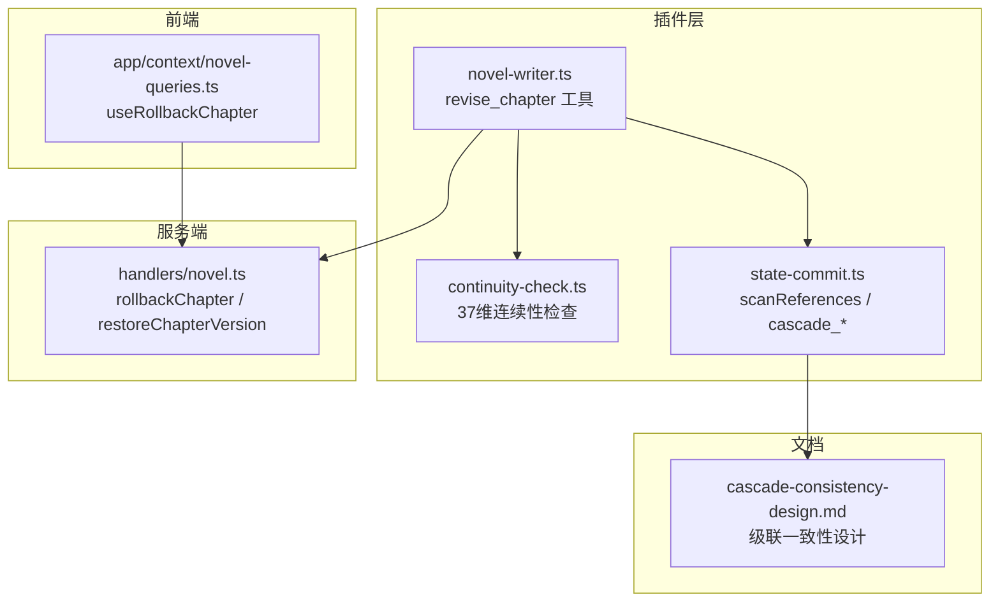
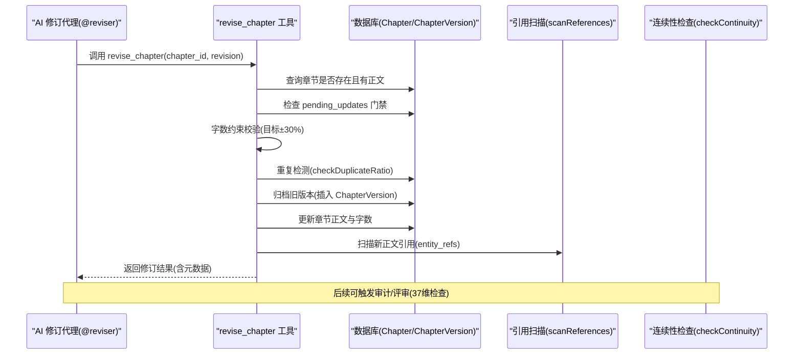
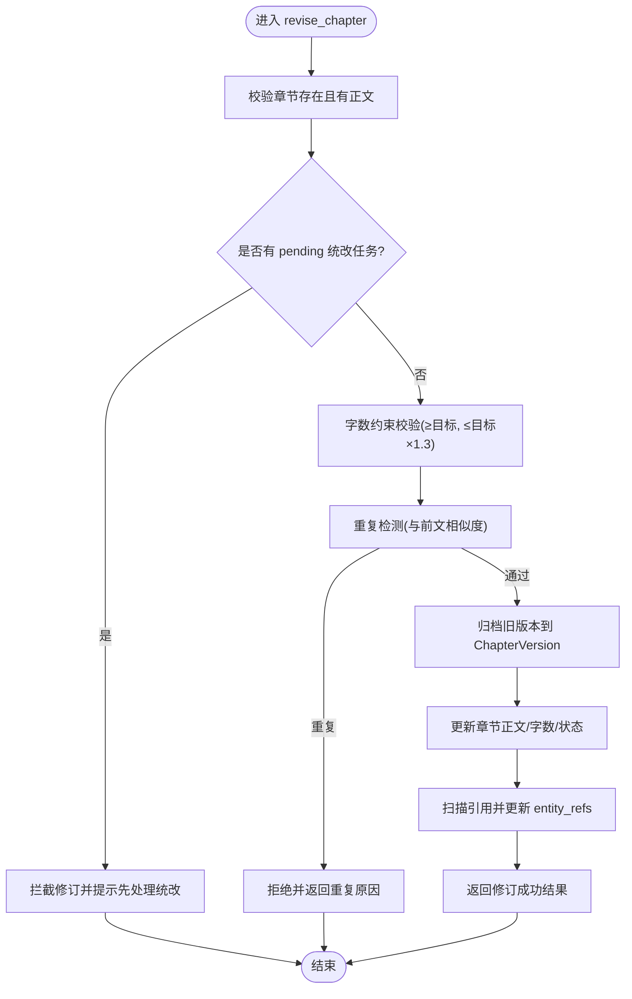
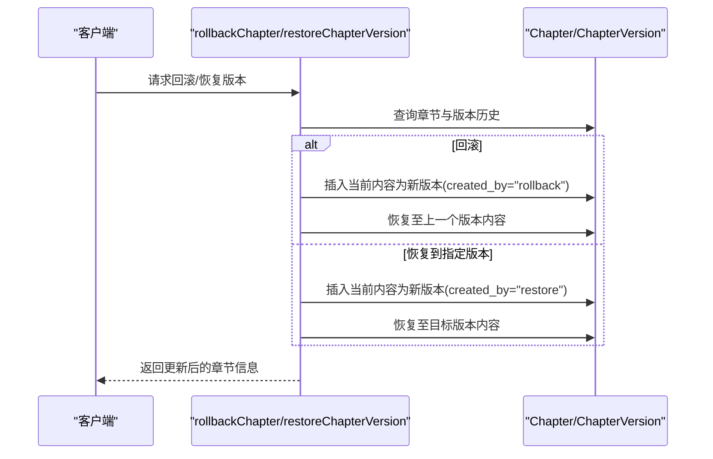
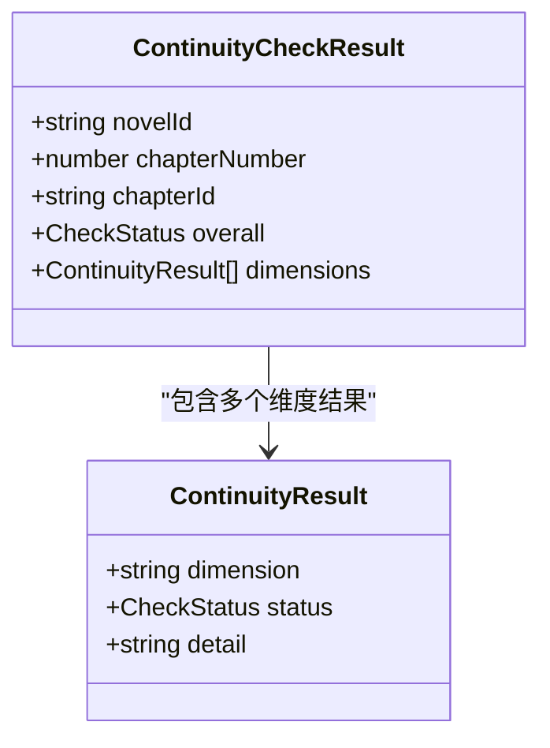
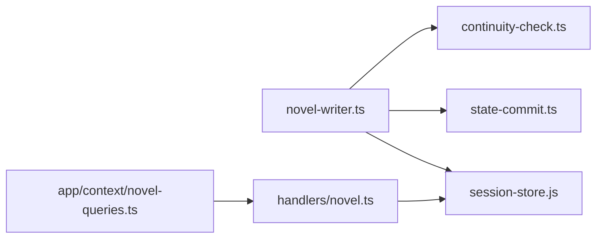

# 步骤5：修订完善

<cite>
**本文引用的文件**
- [packages/plugin/src/novel-writer.ts](file://packages/plugin/src/novel-writer.ts)
- [packages/server/src/handlers/novel.ts](file://packages/server/src/handlers/novel.ts)
- [packages/plugin/src/novel-writer/continuity-check.ts](file://packages/plugin/src/novel-writer/continuity-check.ts)
- [docs/cascade-consistency-design.md](file://docs/cascade-consistency-design.md)
- [packages/app/src/context/novel-queries.ts](file://packages/app/src/context/novel-queries.ts)
- [packages/plugin/test/novel-writer/review.test.ts](file://packages/plugin/test/novel-writer/review.test.ts)
- [packages/server/test/novel.test.ts](file://packages/server/test/novel.test.ts)
</cite>

## 目录
1. [简介](#简介)
2. [项目结构](#项目结构)
3. [核心组件](#核心组件)
4. [架构总览](#架构总览)
5. [详细组件分析](#详细组件分析)
6. [依赖关系分析](#依赖关系分析)
7. [性能考量](#性能考量)
8. [故障排查指南](#故障排查指南)
9. [结论](#结论)
10. [附录](#附录)

## 简介
本文件面向 openNovel 八步写作流水线中的“修订完善”步骤，聚焦 revise_chapter 工具的实现机制与协作模式。内容涵盖：
- 版本归档、内容替换与质量验证流程
- 修订前后的版本管理、变更追踪与回滚机制
- 与 AI 修订代理（reviser）的协作模式及修订指令处理逻辑
- 字数约束、重复检测与前置条件检查
- 级联一致性门禁与引用扫描
- 具体调用示例与最佳实践

## 项目结构
围绕 revise_chapter 的关键实现分布在插件层（工具定义与执行）、服务端（版本管理与回滚）、审计与连续性检查模块、以及前端操作入口。

图表来源
- [packages/plugin/src/novel-writer.ts:330-416](file://packages/plugin/src/novel-writer.ts#L330-L416)
- [packages/plugin/src/novel-writer/continuity-check.ts:149-200](file://packages/plugin/src/novel-writer/continuity-check.ts#L149-L200)
- [packages/server/src/handlers/novel.ts:522-570](file://packages/server/src/handlers/novel.ts#L522-L570)
- [packages/server/src/handlers/novel.ts:800-840](file://packages/server/src/handlers/novel.ts#L800-L840)
- [packages/app/src/context/novel-queries.ts:376-402](file://packages/app/src/context/novel-queries.ts#L376-L402)
- [docs/cascade-consistency-design.md:229-254](file://docs/cascade-consistency-design.md#L229-L254)

章节来源
- [packages/plugin/src/novel-writer.ts:330-416](file://packages/plugin/src/novel-writer.ts#L330-L416)
- [packages/server/src/handlers/novel.ts:522-570](file://packages/server/src/handlers/novel.ts#L522-L570)
- [packages/server/src/handlers/novel.ts:800-840](file://packages/server/src/handlers/novel.ts#L800-L840)
- [packages/app/src/context/novel-queries.ts:376-402](file://packages/app/src/context/novel-queries.ts#L376-L402)
- [docs/cascade-consistency-design.md:229-254](file://docs/cascade-consistency-design.md#L229-L254)

## 核心组件
- revise_chapter 工具：负责修订已生成章节正文，包含前置校验、版本归档、内容更新、引用扫描与结果返回。
- 版本管理：ChapterVersionTable 记录每次修订的历史版本；支持回滚与恢复到指定版本。
- 连续性检查：37个维度对修订内容进行一致性校验，辅助审计与评审。
- 级联一致性：在修订前检查 pending_updates 门禁，修订后自动扫描引用并维护依赖图。

章节来源
- [packages/plugin/src/novel-writer.ts:330-416](file://packages/plugin/src/novel-writer.ts#L330-L416)
- [packages/server/src/handlers/novel.ts:522-570](file://packages/server/src/handlers/novel.ts#L522-L570)
- [packages/server/src/handlers/novel.ts:800-840](file://packages/server/src/handlers/novel.ts#L800-L840)
- [packages/plugin/src/novel-writer/continuity-check.ts:149-200](file://packages/plugin/src/novel-writer/continuity-check.ts#L149-L200)
- [docs/cascade-consistency-design.md:229-254](file://docs/cascade-consistency-design.md#L229-L254)

## 架构总览
修订完善的整体流程如下：

图表来源
- [packages/plugin/src/novel-writer.ts:330-416](file://packages/plugin/src/novel-writer.ts#L330-L416)
- [packages/plugin/src/novel-writer/continuity-check.ts:149-200](file://packages/plugin/src/novel-writer/continuity-check.ts#L149-L200)
- [docs/cascade-consistency-design.md:229-254](file://docs/cascade-consistency-design.md#L229-L254)

## 详细组件分析

### revise_chapter 工具实现
- 输入参数
  - chapter_id：章节 ID
  - revision：修订后的完整章节正文（非修改意见）
- 前置条件检查
  - 章节存在且已有正文
  - 级联门禁：若该小说存在 pending 状态的统改任务，则拦截修订，要求先处理待统改
- 质量验证
  - 字数约束：不得少于目标字数，且不超过目标的 1.3 倍
  - 重复检测：与前文章节进行相似度比较，禁止重复事件与场景
- 版本归档与内容替换
  - 将当前正文作为新版本写入 ChapterVersionTable
  - 更新 ChapterTable 的 content、word_count、status 为 revised，更新时间戳
- 引用扫描
  - 调用 scanReferences 对新正文进行实体引用扫描，维护 entity_refs
- 返回结果
  - 输出标题、摘要信息、元数据（章节ID、字数等）

图表来源
- [packages/plugin/src/novel-writer.ts:330-416](file://packages/plugin/src/novel-writer.ts#L330-L416)
- [docs/cascade-consistency-design.md:229-254](file://docs/cascade-consistency-design.md#L229-L254)

章节来源
- [packages/plugin/src/novel-writer.ts:330-416](file://packages/plugin/src/novel-writer.ts#L330-L416)

### 版本归档与回滚机制
- 版本归档
  - 每次修订或更新都会向 ChapterVersionTable 插入一条版本记录，包含 version、content、word_count、created_by 等字段
- 回滚
  - rollbackChapter：若无历史版本则报错；否则将当前内容归档为新版本，并将章节恢复至上一个版本（或最新历史版本）
- 恢复到指定版本
  - restoreChapterVersion：根据 input.version 定位目标版本，先将当前内容归档为新版本，再将章节内容恢复为目标版本

图表来源
- [packages/server/src/handlers/novel.ts:522-570](file://packages/server/src/handlers/novel.ts#L522-L570)
- [packages/server/src/handlers/novel.ts:800-840](file://packages/server/src/handlers/novel.ts#L800-L840)

章节来源
- [packages/server/src/handlers/novel.ts:522-570](file://packages/server/src/handlers/novel.ts#L522-L570)
- [packages/server/src/handlers/novel.ts:800-840](file://packages/server/src/handlers/novel.ts#L800-L840)

### 质量验证与审计
- 连续性检查（37维）
  - 覆盖角色、关系、时间线、地点、剧情、世界观、风格、逻辑、细节等维度
  - 检查结果包括 PASS/WARN/FAIL 与详情说明，用于审计与评审
- 评审轮次（round）
  - 同一内容未变更时的再次评审并入同一 round；内容变更后开启新 round
  - 支持 deterministic/auditor/human 三种来源

图表来源
- [packages/plugin/src/novel-writer/continuity-check.ts:149-200](file://packages/plugin/src/novel-writer/continuity-check.ts#L149-L200)

章节来源
- [packages/plugin/src/novel-writer/continuity-check.ts:149-200](file://packages/plugin/src/novel-writer/continuity-check.ts#L149-L200)
- [packages/plugin/test/novel-writer/review.test.ts:67-133](file://packages/plugin/test/novel-writer/review.test.ts#L67-L133)

### 与 AI 修订代理的协作模式
- 修订指令处理
  - @reviser 接收修订需求，结合上下文快照与审计反馈生成 revision 文本
  - 调用 revise_chapter 工具完成实际内容替换与归档
- 门禁与级联
  - 若有 pending_updates，@reviser 需先调用 cascade_execute 或 cascade_list_pending 处理统改任务
  - 修订完成后，系统自动扫描引用并更新依赖图

章节来源
- [packages/plugin/src/novel-writer.ts:330-416](file://packages/plugin/src/novel-writer.ts#L330-L416)
- [docs/cascade-consistency-design.md:229-254](file://docs/cascade-consistency-design.md#L229-L254)

### 字数约束、重复检测与前置条件检查
- 字数约束
  - 最小值：不得小于目标字数
  - 最大值：不得超过目标字数的 1.3 倍
- 重复检测
  - 计算与前文章节的相似度，若开头相似度过高或段落重复比例过高则拒绝
- 前置条件
  - 章节必须存在且已有正文
  - 无 pending 统改任务

章节来源
- [packages/plugin/src/novel-writer.ts:330-416](file://packages/plugin/src/novel-writer.ts#L330-L416)

### 代码示例：如何进行章节内容的修订和优化
- 基本修订
  - 调用 revise_chapter，传入 chapter_id 与 revision（完整正文）
  - 成功后章节状态更新为 revised，并生成新版本记录
- 失败重试
  - 若被门禁拦截：先处理 pending 统改任务
  - 若字数不达标或超限：调整 revision 内容后重试
  - 若检测到重复：重写重复部分后重试
- 回滚与恢复
  - 使用 rollbackChapter 回滚至上一个版本
  - 使用 restoreChapterVersion 恢复到指定版本

章节来源
- [packages/plugin/src/novel-writer.ts:330-416](file://packages/plugin/src/novel-writer.ts#L330-L416)
- [packages/server/test/novel.test.ts:199-227](file://packages/server/test/novel.test.ts#L199-L227)

## 依赖关系分析
- 插件层依赖
  - revise_chapter 依赖 session-store 提供的表操作（Chapter、ChapterVersion）
  - 依赖 state-commit 的 scanReferences 与 cascade_* 函数
  - 依赖 continuity-check 的 37 维检查能力
- 服务端依赖
  - handlers/novel.ts 提供版本回滚与恢复接口
- 前端依赖
  - app/context/novel-queries.ts 提供 useRollbackChapter 钩子

图表来源
- [packages/plugin/src/novel-writer.ts:330-416](file://packages/plugin/src/novel-writer.ts#L330-L416)
- [packages/server/src/handlers/novel.ts:522-570](file://packages/server/src/handlers/novel.ts#L522-L570)
- [packages/app/src/context/novel-queries.ts:376-402](file://packages/app/src/context/novel-queries.ts#L376-L402)

章节来源
- [packages/plugin/src/novel-writer.ts:330-416](file://packages/plugin/src/novel-writer.ts#L330-L416)
- [packages/server/src/handlers/novel.ts:522-570](file://packages/server/src/handlers/novel.ts#L522-L570)
- [packages/app/src/context/novel-queries.ts:376-402](file://packages/app/src/context/novel-queries.ts#L376-L402)

## 性能考量
- 批量操作
  - 版本归档与内容更新在同一事务中执行，减少锁竞争
- 索引建议
  - ChapterVersionTable.chapter_id、ChapterVersionTable.version 应建立索引以加速历史查询
- 扫描优化
  - scanReferences 可按章节粒度分批处理，避免一次性加载过大内容
- 重复检测
  - 相似度计算可采用分段哈希或滑动窗口策略降低复杂度

[本节为通用指导，无需特定文件来源]

## 故障排查指南
- 修订被门禁拦截
  - 检查 pending_updates 表，确认是否有未处理的统改任务
  - 调用 cascade_list_pending 查看任务清单，再执行 cascade_resolve 标记完成
- 字数不达标或超限
  - 调整 revision 内容以满足目标字数的 ±30% 范围
- 重复检测失败
  - 重写与前文章节高度相似的段落，避免事件与场景重复
- 回滚失败
  - 确认章节存在版本历史，若无则无法回滚

章节来源
- [docs/cascade-consistency-design.md:229-254](file://docs/cascade-consistency-design.md#L229-L254)
- [packages/server/test/novel.test.ts:199-227](file://packages/server/test/novel.test.ts#L199-L227)

## 结论
revise_chapter 工具在 openNovel 的修订完善步骤中扮演关键角色，通过严格的前置检查、版本归档、内容替换与引用扫描，确保修订过程的安全性与一致性。结合 37 维连续性检查与级联一致性门禁，系统能够有效维护小说设定的统一性，并为 AI 修订代理提供可靠的执行环境。

[本节为总结性内容，无需特定文件来源]

## 附录
- 相关测试用例
  - 版本归档与回滚行为验证
  - 评审轮次与来源统计
- 最佳实践
  - 修订前先检查门禁与字数约束
  - 避免与前文章节重复
  - 利用回滚与恢复功能快速修正错误

章节来源
- [packages/server/test/novel.test.ts:199-227](file://packages/server/test/novel.test.ts#L199-L227)
- [packages/plugin/test/novel-writer/review.test.ts:67-133](file://packages/plugin/test/novel-writer/review.test.ts#L67-L133)