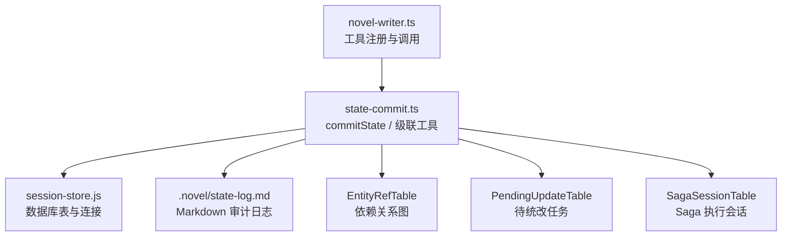
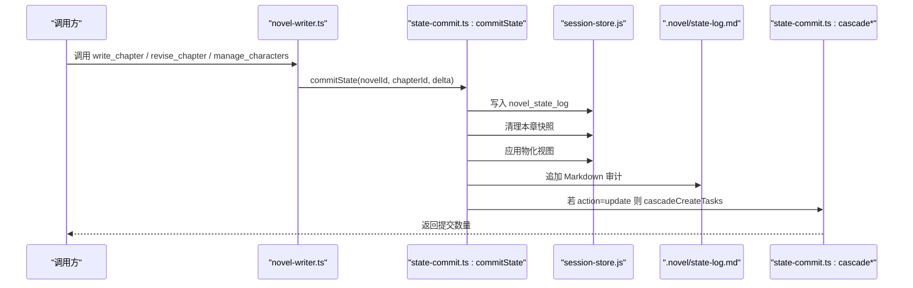
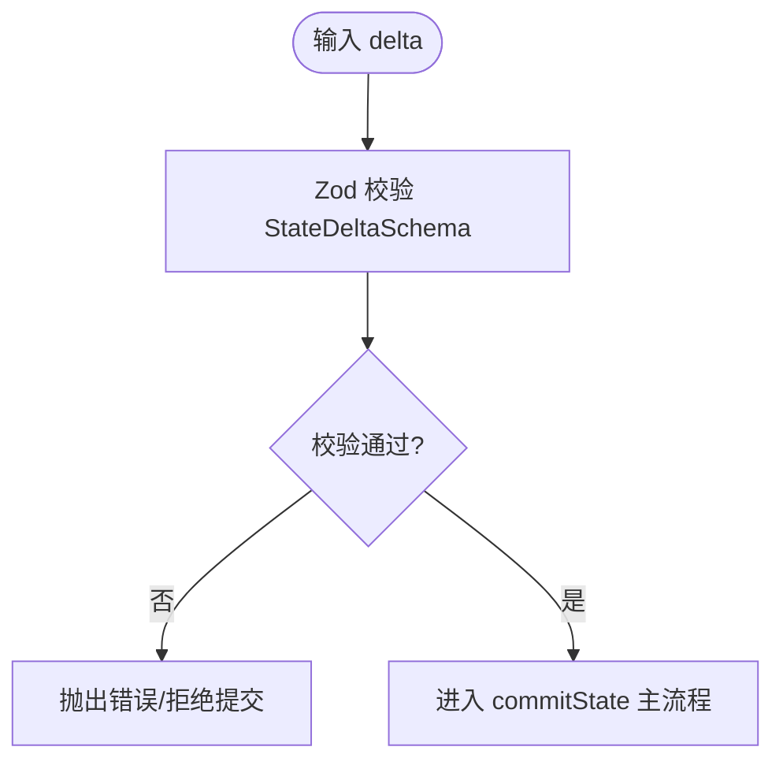
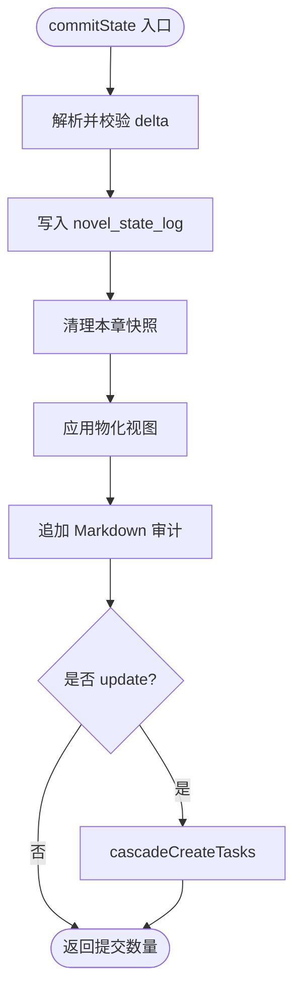
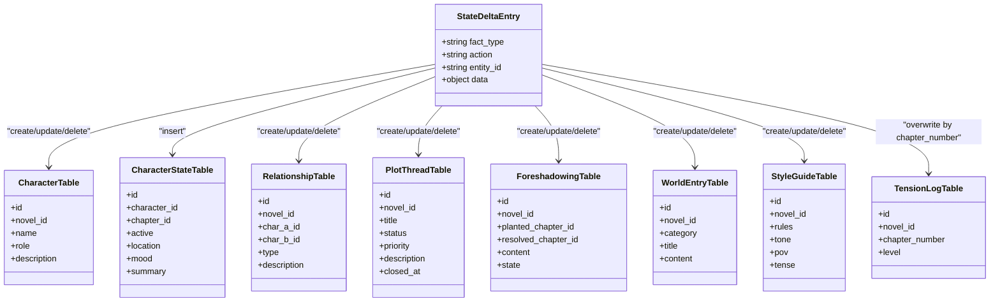
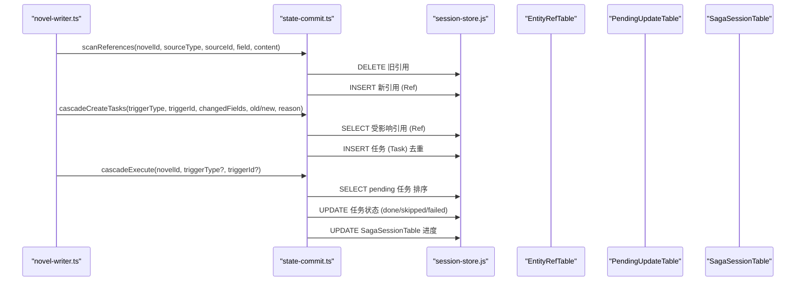
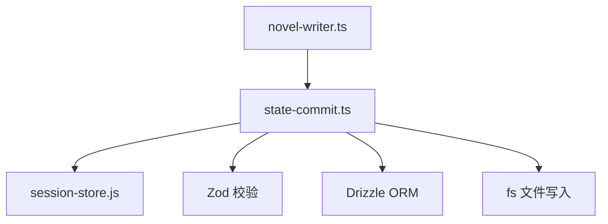

# 步骤6：状态提取

<cite>
**本文引用的文件**   
- [state-commit.ts](file://packages/plugin/src/novel-writer/state-commit.ts)
- [novel-writer.ts](file://packages/plugin/src/novel-writer.ts)
- [cascade-consistency-design.md](file://docs/cascade-consistency-design.md)
- [cascade.test.ts](file://packages/plugin/test/novel-writer/cascade.test.ts)
</cite>

## 目录
1. [简介](#简介)
2. [项目结构](#项目结构)
3. [核心组件](#核心组件)
4. [架构总览](#架构总览)
5. [详细组件分析](#详细组件分析)
6. [依赖关系分析](#依赖关系分析)
7. [性能考量](#性能考量)
8. [故障排查指南](#故障排查指南)
9. [结论](#结论)
10. [附录](#附录)

## 简介
本章节聚焦 openNovel 八步写作流水线中的“状态提取”步骤，围绕 commitState 工具的状态管理机制展开。内容涵盖增量更新、冲突解决、数据一致性保证；StateDeltaSchema 的结构定义与校验规则；与 cascade 级联系统的集成（级联任务创建、依赖关系管理、执行顺序控制）；以及状态快照、差异计算与合并策略。文末提供具体代码示例路径，帮助读者快速定位实现细节。

## 项目结构
- 状态提交与级联逻辑集中在 packages/plugin/src/novel-writer/state-commit.ts
- 写作插件入口与工具注册在 packages/plugin/src/novel-writer.ts
- 级联一致性设计文档位于 docs/cascade-consistency-design.md
- 级联系统测试覆盖在 packages/plugin/test/novel-writer/cascade.test.ts

**图示来源** 
- [novel-writer.ts](file://packages/plugin/src/novel-writer.ts)
- [state-commit.ts](file://packages/plugin/src/novel-writer/state-commit.ts)

**章节来源**
- [state-commit.ts](file://packages/plugin/src/novel-writer/state-commit.ts)
- [novel-writer.ts](file://packages/plugin/src/novel-writer.ts)

## 核心组件
- StateDeltaSchema：使用 Zod 定义的 delta 数组结构，包含 fact_type、action、entity_id、data 四个字段，用于描述一次状态变更的条目集合。
- commitState：核心提交函数，负责验证 delta、写入 append-only 日志、清理本章快照、应用物化视图、同步 Markdown 记录，并在 update 分支触发级联任务。
- applyToMaterializedView：根据 fact_type 将 delta 应用到对应物化视图表（如 character、relationship、plot_thread、foreshadow、world_entry、chapter_summary、style、tension）。
- scanReferences：扫描正文/描述/摘要等文本，建立实体引用关系（EntityRefTable），为级联影响分析提供基础。
- cascadeCheck / cascadeCreateTasks / cascadeListPending / cascadeResolve / cascadeRebuildRefs / cascadeExecute / cascadeGetStatus：级联系统的全套工具，支持查询影响范围、创建任务、列出与标记任务、重建依赖图、批量执行 Saga 及状态查询。
- 去重与归档：deduplicateCharacters / deduplicateRelationships 处理重复实体；archiveDescription 记录描述变更历史。

**章节来源**
- [state-commit.ts](file://packages/plugin/src/novel-writer/state-commit.ts)

## 架构总览
commitState 作为“状态提取”的核心入口，串联了以下流程：
- 输入校验：通过 StateDeltaSchema 对 delta 进行严格校验。
- 增量写入：将每条变更写入 novel_state_log（append-only），确保可追溯。
- 幂等替换：针对章节相关快照（character_states、chapter_summaries、tension_logs）先清理再写回，保证一章一份语义。
- 物化视图更新：按 fact_type 映射到相应表，执行 create/update/delete。
- Markdown 审计：追加 .novel/state-log.md 记录，便于人工审查。
- 级联触发：仅对 update 操作触发 cascadeCreateTasks，基于 EntityRefTable 生成待统改任务。
- Saga 执行：通过 cascadeExecute 批量处理 pending 任务，按优先级排序并持久化进度。

**图示来源** 
- [novel-writer.ts](file://packages/plugin/src/novel-writer.ts)
- [state-commit.ts](file://packages/plugin/src/novel-writer/state-commit.ts)

## 详细组件分析

### StateDeltaSchema 结构与校验规则
- 结构定义：数组元素为 StateDeltaEntrySchema，包含 fact_type（枚举）、action（create/update/delete）、entity_id（字符串）、data（任意键值对象）。
- 校验规则：Zod 强类型约束，确保 fact_type 属于预定义 10 种事实类型；action 限定为三种；entity_id 非空；data 允许动态扩展但需符合后续业务处理预期。
- 复杂度：解析与校验时间复杂度 O(N)，N 为 delta 条目数；空间复杂度 O(N)。

**图示来源** 
- [state-commit.ts](file://packages/plugin/src/novel-writer/state-commit.ts)

**章节来源**
- [state-commit.ts](file://packages/plugin/src/novel-writer/state-commit.ts)

### commitState 主流程与增量更新
- 验证 delta：使用 StateDeltaSchema.parse 进行强校验。
- 写入日志：逐条插入 novel_state_log，记录 fact_type、fact_data、created_at 等。
- 清理快照：resetChapterScopedState 删除本章相关的 character_states、chapter_summaries、tension_logs，保证幂等替换。
- 应用视图：applyToMaterializedView 根据 fact_type 和 action 执行 INSERT/UPDATE/DELETE。
- 同步 Markdown：appendToMarkdown 追加审计记录。
- 级联触发：对每个 update 条目调用 cascadeCreateTasks，传入 triggerType、triggerId、changedFields、old/newValue、reason。

**图示来源** 
- [state-commit.ts](file://packages/plugin/src/novel-writer/state-commit.ts)

**章节来源**
- [state-commit.ts](file://packages/plugin/src/novel-writer/state-commit.ts)

### 物化视图更新与冲突解决
- 角色（character）：resolveCharacterId 按 ID 或姓名匹配已有角色，避免重复创建；update 时仅更新变化字段，状态字段部分更新会读取最近一条记录回退未传字段。
- 关系（relationship）：按双方角色+类型去重，已存在则合并更新描述。
- 剧情线索（plot_thread）：按标题去重，支持状态、优先级、关闭时间等字段更新。
- 伏笔（foreshadow）：按内容去重，支持埋设/揭晓章节与状态。
- 世界观（world_entry）：按分类+标题去重。
- 风格指南（style）：每本小说单例，已存在则更新。
- 张力（tension）：按章节号覆盖写，幂等。
- timeline/location：仅记录日志，不更新物化视图。

**图示来源** 
- [state-commit.ts](file://packages/plugin/src/novel-writer/state-commit.ts)

**章节来源**
- [state-commit.ts](file://packages/plugin/src/novel-writer/state-commit.ts)

### 级联系统集成（scanReferences / cascade*）
- scanReferences：删除旧引用后重新插入，幂等；扫描字符、世界条目、剧情线索名称，建立 EntityRefTable。
- cascadeCheck：查询某实体被哪些源引用，返回 source_type/source_id/ref_field/ref_text。
- cascadeCreateTasks：无正文章节时跳过；去重同一 source 已有 pending 任务；按优先级规则计算 priority；批量 INSERT PendingUpdateTable。
- cascadeListPending / cascadeResolve：列出与标记任务完成/跳过。
- cascadeRebuildRefs：全量重建依赖关系图，用于首次启用或批量导入后补建。
- cascadeExecute：Saga 执行器，按优先级排序处理任务；chapter 类型标记 skipped（需 LLM 辅助）；character/volume 类型自动替换旧值并重建引用；持久化 saga_session 进度。

**图示来源** 
- [state-commit.ts](file://packages/plugin/src/novel-writer/state-commit.ts)
- [cascade-consistency-design.md](file://docs/cascade-consistency-design.md)

**章节来源**
- [state-commit.ts](file://packages/plugin/src/novel-writer/state-commit.ts)
- [cascade-consistency-design.md](file://docs/cascade-consistency-design.md)

### 状态快照、差异计算与合并策略
- 快照：assembleSnapshot 组装小说蓝图、活跃角色、卷摘要、最近章节摘要、剧情线索、伏笔、风格指南等，注入系统提示或压缩上下文。
- 差异计算：delta 由上游 observer/reflector/auditor/reviser 等 agent 生成，commitState 仅负责落库与视图更新；差异体现在 delta 的 action 与 data 字段。
- 合并策略：
  - 角色：按 ID 或姓名去重，update 时部分字段合并，状态字段回退未传值。
  - 关系：按双方+类型去重，描述合并。
  - 剧情线索/伏笔/世界观：按标题/内容去重，支持多字段更新。
  - 风格指南：单例，直接覆盖更新。
  - 张力：按章节号覆盖写，幂等。

**章节来源**
- [novel-writer.ts](file://packages/plugin/src/novel-writer.ts)
- [state-commit.ts](file://packages/plugin/src/novel-writer/state-commit.ts)

### 代码示例：如何提取与提交章节状态变更
- 在 writer/reviser 等 agent 生成 delta 后，调用 commitState(novelId, chapterId, delta) 提交。
- 示例路径参考：
  - [write_chapter 工具调用 commitState 的上下文](file://packages/plugin/src/novel-writer.ts)
  - [revise_chapter 工具调用 commitState 的上下文](file://packages/plugin/src/novel-writer.ts)
  - [manage_characters 工具在更新后触发 cascadeCreateTasks](file://packages/plugin/src/novel-writer.ts)
  - [commitState 主流程与级联触发](file://packages/plugin/src/novel-writer/state-commit.ts)

注意：以上为路径指引，不包含具体代码片段。

**章节来源**
- [novel-writer.ts](file://packages/plugin/src/novel-writer.ts)
- [state-commit.ts](file://packages/plugin/src/novel-writer/state-commit.ts)

## 依赖关系分析
- 模块耦合：
  - novel-writer.ts 依赖 state-commit.ts 提供的 commitState 与 cascade* 工具。
  - state-commit.ts 依赖 session-store.js 的数据库表与连接。
  - 级联系统依赖 EntityRefTable/PendingUpdateTable/SagaSessionTable 等表结构。
- 外部依赖：
  - Drizzle ORM 用于 SQL 构建与执行。
  - Zod 用于 schema 校验。
  - fs 用于 Markdown 审计日志写入。
- 潜在循环依赖：无直接循环；通过 session-store.js 解耦数据库访问。

**图示来源** 
- [novel-writer.ts](file://packages/plugin/src/novel-writer.ts)
- [state-commit.ts](file://packages/plugin/src/novel-writer/state-commit.ts)

**章节来源**
- [novel-writer.ts](file://packages/plugin/src/novel-writer.ts)
- [state-commit.ts](file://packages/plugin/src/novel-writer/state-commit.ts)

## 性能考量
- 增量更新：delta 遍历 O(N)，每次条目涉及少量 DB 操作，整体线性复杂度。
- 去重与解析：resolveEntityId/resolveCharacterId 可能触发额外查询，建议在高并发场景下缓存热点实体。
- 级联任务创建：cascadeCreateTasks 先去重再插入，避免重复任务堆积。
- 快照清理：resetChapterScopedState 仅清理本章相关表，减少无关 IO。
- 大规模场景：scale.test.ts 验证了 ch500/ch1000 下的 delta 结构完整性与有效性，确保 entity_id/action 有效性与条目数量增长合理。

[本节为通用指导，无需特定文件来源]

## 故障排查指南
- 常见错误：
  - Delta 校验失败：检查 fact_type/action/entity_id/data 是否符合 StateDeltaSchema。
  - 级联任务未创建：确认是否有正文章节；检查 EntityRefTable 是否存在引用；查看 cascadeCreateTasks 的去重逻辑。
  - 门禁拦截：write_chapter/revise_chapter 在有 pending_updates 时被拦截，需先执行 cascade_execute 或手动 resolve。
  - 角色描述缩短被拦截：manage_characters 对描述缩短超过一半的情况进行拦截，需保留旧内容或确认无误后提交。
- 调试工具：
  - cascadeListPending：列出 pending/done/skipped 任务。
  - cascadeGetStatus：查询 pending_count、active_saga、recent_sagas。
  - cascadeRebuildRefs：全量重建依赖图，修复缺失引用。

**章节来源**
- [cascade.test.ts](file://packages/plugin/test/novel-writer/cascade.test.ts)
- [cascade-consistency-design.md](file://docs/cascade-consistency-design.md)

## 结论
commitState 作为“状态提取”步骤的核心，通过严格的 schema 校验、append-only 日志、幂等快照替换、物化视图更新与 Markdown 审计，确保了状态变更的可追溯性与一致性。与 cascade 系统的深度集成实现了依赖追踪、任务调度与批量执行，保障了跨实体的数据一致性。通过合理的去重策略与合并规则，系统在大规模场景下仍保持高效与稳定。

[本节为总结性内容，无需特定文件来源]

## 附录
- 关键函数与工具路径：
  - [commitState](file://packages/plugin/src/novel-writer/state-commit.ts)
  - [scanReferences](file://packages/plugin/src/novel-writer/state-commit.ts)
  - [cascadeCreateTasks](file://packages/plugin/src/novel-writer/state-commit.ts)
  - [cascadeExecute](file://packages/plugin/src/novel-writer/state-commit.ts)
  - [write_chapter/revise_chapter/manage_characters](file://packages/plugin/src/novel-writer.ts)
- 测试用例参考：
  - [cascade.test.ts](file://packages/plugin/test/novel-writer/cascade.test.ts)
  - [scale.test.ts](file://packages/plugin/test/novel-writer/scale.test.ts)

[本节为附录信息，无需特定文件来源]