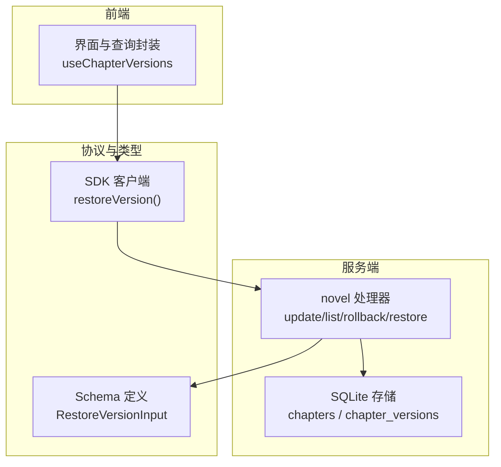
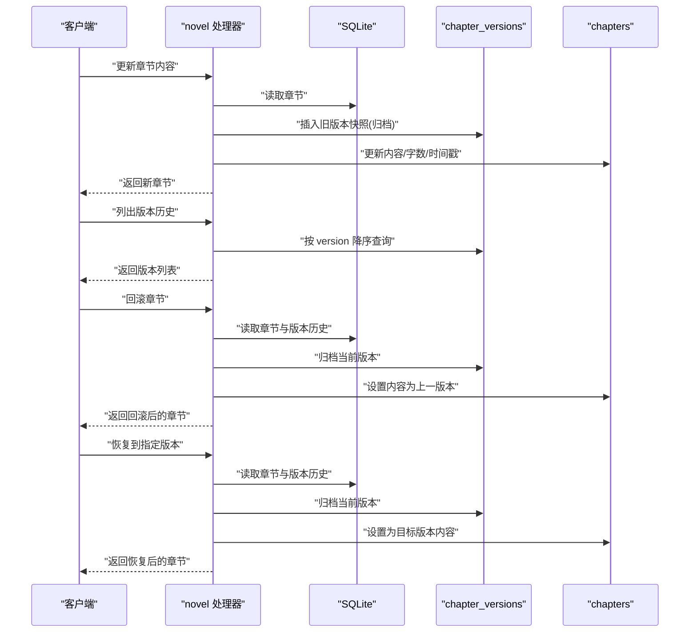
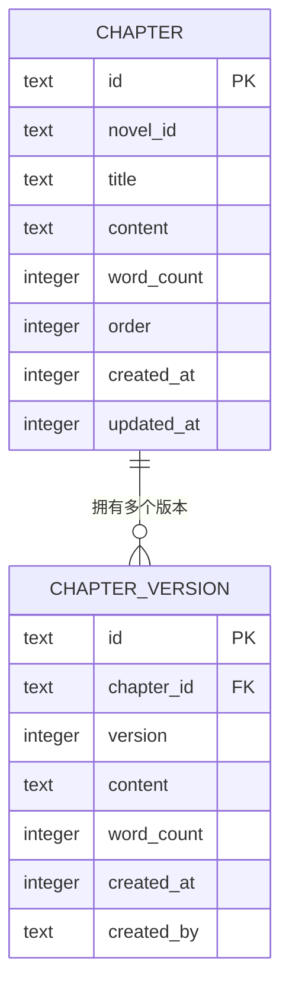
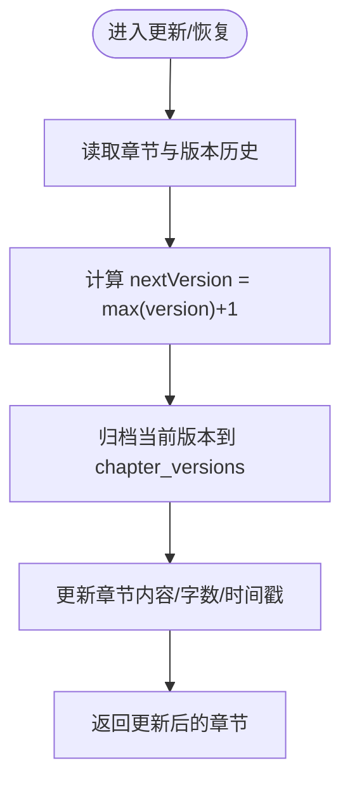
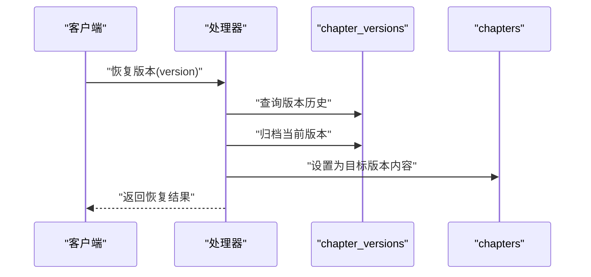
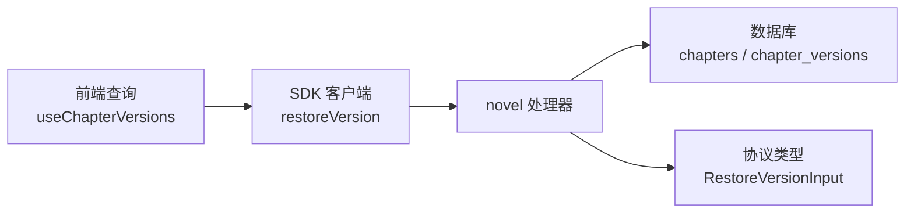

# 步骤7：版本提交

<cite>
**本文引用的文件**   
- [packages/server/src/handlers/novel.ts](file://packages/server/src/handlers/novel.ts)
- [packages/core/src/session/sql.ts](file://packages/core/src/session/sql.ts)
- [packages/core/src/database/migration/20260721152252_novel_writing_tables.ts](file://packages/core/src/database/migration/20260721152252_novel_writing_tables.ts)
- [packages/schema/src/novel.ts](file://packages/schema/src/novel.ts)
- [packages/app/src/context/novel-queries.ts](file://packages/app/src/context/novel-queries.ts)
- [packages/sdks/js/src/v2/gen/sdk.gen.ts](file://packages/sdks/js/src/v2/gen/sdk.gen.ts)
- [packages/server/test/novel.test.ts](file://packages/server/test/novel.test.ts)
</cite>

## 目录
1. [简介](#简介)
2. [项目结构](#项目结构)
3. [核心组件](#核心组件)
4. [架构总览](#架构总览)
5. [详细组件分析](#详细组件分析)
6. [依赖关系分析](#依赖关系分析)
7. [性能考量](#性能考量)
8. [故障排查指南](#故障排查指南)
9. [结论](#结论)
10. [附录](#附录)

## 简介
本章节聚焦 openNovel 八步写作流水线中的“版本提交”步骤，系统性阐述章节版本管理的实现机制与使用方式。内容涵盖 ChapterVersionTable 的增删改查、版本号生成策略、版本历史维护、版本归档、版本比较与恢复、以及作者信息与时间戳等元数据记录。同时结合 Git 风格的版本控制理念（不可变快照、线性版本序列、可回滚与可恢复），为读者提供从概念到代码落地的完整说明。

## 项目结构
围绕“版本提交”，相关代码分布在以下模块：
- 服务端处理器：负责处理更新、列出版本、回滚、恢复等操作
- 数据库模式与迁移：定义章节表与章节版本表的结构及索引
- 协议与类型：定义恢复版本的输入结构与接口契约
- 前端查询封装：暴露获取章节详情的查询与获取章节版本的查询
- SDK 客户端：暴露恢复版本的 HTTP 调用方法
- 测试用例：验证更新内容会归档旧版本、回滚行为与错误路径

图表来源 
- [packages/app/src/context/novel-queries.ts:114-127](file://packages/app/src/context/novel-queries.ts#L114-L127)
- [packages/server/src/handlers/novel.ts:497-510](file://packages/server/src/handlers/novel.ts#L497-L510)
- [packages/schema/src/novel.ts:274-277](file://packages/schema/src/novel.ts#L274-L277)
- [packages/sdks/js/src/v2/gen/sdk.gen.ts:8285-8327](file://packages/sdks/js/src/v2/gen/sdk.gen.ts#L8285-L8327)

章节来源
- [packages/app/src/context/novel-queries.ts:114-127](file://packages/app/src/context/novel-queries.ts#L114-L127)
- [packages/server/src/handlers/novel.ts:497-510](file://packages/server/src/handlers/novel.ts#L497-L510)
- [packages/schema/src/novel.ts:274-277](file://packages/schema/src/novel.ts#L274-L277)
- [packages/sdks/js/src/v2/gen/sdk.gen.ts:8285-8327](file://packages/sdks/js/src/v2/gen/sdk.gen.ts#LL8285-L8327)

## 核心组件
- 章节版本表（ChapterVersionTable）
  - 字段：id、chapter_id、version、content、word_count、created_at、created_by
  - 索引：按 chapter_id 与 (chapter_id, version) 复合索引，支持高效查询与排序
- 章节表（ChapterTable）
  - 字段：id、novel_id、volume_id、title、content、word_count、status、order、created_at、updated_at
- 版本操作函数
  - 更新内容并归档：updateChapterContent
  - 列出版本历史：listChapterVersions
  - 回滚到上一版本：rollbackChapter
  - 恢复到指定版本：restoreChapterVersion

章节来源
- [packages/core/src/session/sql.ts:250-270](file://packages/core/src/session/sql.ts#L250-L270)
- [packages/core/src/database/migration/20260721152252_novel_writing_tables.ts:34-45](file://packages/core/src/database/migration/20260721152252_novel_writing_tables.ts#L34-L45)
- [packages/server/src/handlers/novel.ts:572-611](file://packages/server/src/handlers/novel.ts#L572-L611)
- [packages/server/src/handlers/novel.ts:497-510](file://packages/server/src/handlers/novel.ts#L497-L510)
- [packages/server/src/handlers/novel.ts:522-570](file://packages/server/src/handlers/novel.ts#L522-L570)
- [packages/server/src/handlers/novel.ts:800-840](file://packages/server/src/handlers/novel.ts#L800-L840)

## 架构总览
版本提交的核心流程遵循“先归档当前状态，再写入新版本”的不可变快照模式，类似 Git 的 commit 语义：
- 更新内容时，先将当前章节内容与字数归档到 chapter_versions，然后更新 chapters 表的 content 与 word_count
- 回滚操作会将当前版本归档，并将章节内容设置为上一个版本的内容
- 恢复操作将目标版本的内容写回章节，同时归档当前版本作为新的历史记录

图表来源 
- [packages/server/src/handlers/novel.ts:572-611](file://packages/server/src/handlers/novel.ts#L572-L611)
- [packages/server/src/handlers/novel.ts:497-510](file://packages/server/src/handlers/novel.ts#L497-L510)
- [packages/server/src/handlers/novel.ts:522-570](file://packages/server/src/handlers/novel.ts#L522-L570)
- [packages/server/src/handlers/novel.ts:800-840](file://packages/server/src/handlers/novel.ts#L800-L840)

## 详细组件分析

### 章节版本表与数据结构
- ChapterVersionTable 用于保存每次提交的不可变快照，包含内容、字数、创建时间与创建者
- 通过 chapter_id 关联到具体章节，version 字段表示线性递增的版本号
- created_by 字段记录操作来源（如 update-content、rollback、restore），便于审计追踪
- created_at 字段记录时间戳，支持按时间回溯与对比

图表来源 
- [packages/core/src/session/sql.ts:250-270](file://packages/core/src/session/sql.ts#L250-L270)
- [packages/core/src/database/migration/20260721152252_novel_writing_tables.ts:34-45](file://packages/core/src/database/migration/20260721152252_novel_writing_tables.ts#L34-L45)

章节来源
- [packages/core/src/session/sql.ts:250-270](file://packages/core/src/session/sql.ts#L250-L270)
- [packages/core/src/database/migration/20260721152252_novel_writing_tables.ts:34-45](file://packages/core/src/database/migration/20260721152252_novel_writing_tables.ts#L34-L45)

### 版本号生成与版本历史维护
- 版本号生成策略：取现有最大 version + 1；若首次提交则从 1 开始
- 版本历史维护：每次更新或恢复都会先归档当前版本，再修改章节内容，确保历史可追溯
- 列表查询：按 version 降序排列，便于展示最新到最旧的版本顺序

图表来源 
- [packages/server/src/handlers/novel.ts:572-611](file://packages/server/src/handlers/novel.ts#L572-L611)
- [packages/server/src/handlers/novel.ts:800-840](file://packages/server/src/handlers/novel.ts#L800-L840)

章节来源
- [packages/server/src/handlers/novel.ts:572-611](file://packages/server/src/handlers/novel.ts#L572-L611)
- [packages/server/src/handlers/novel.ts:800-840](file://packages/server/src/handlers/novel.ts#L800-L840)

### 版本归档、版本比较与版本恢复
- 版本归档：在更新与恢复前，将当前章节内容作为快照写入 chapter_versions
- 版本比较：可通过 listChapterVersions 获取历史版本，进行内容差异对比（由上层逻辑决定）
- 版本恢复：根据输入的 version 定位目标版本，将其内容写回章节，并归档当前版本

图表来源 
- [packages/server/src/handlers/novel.ts:800-840](file://packages/server/src/handlers/novel.ts#L800-L840)

章节来源
- [packages/server/src/handlers/novel.ts:800-840](file://packages/server/src/handlers/novel.ts#L800-L840)

### 与 Git 风格版本控制的结合
- 不可变快照：每个版本都是对某一时刻章节状态的快照，符合 Git commit 的不可变性
- 线性版本序列：version 字段保证严格递增，便于回溯与比较
- 可回滚与可恢复：支持回滚到上一版本或恢复到任意历史版本，类似于 Git 的 checkout/restore
- 元数据记录：created_by 与 created_at 记录操作者与时间，便于审计与协作

章节来源
- [packages/server/src/handlers/novel.ts:572-611](file://packages/server/src/handlers/novel.ts#L572-L611)
- [packages/server/src/handlers/novel.ts:522-570](file://packages/server/src/handlers/novel.ts#L522-L570)
- [packages/server/src/handlers/novel.ts:800-840](file://packages/server/src/handlers/novel.ts#L800-L840)

### 版本元数据管理、作者信息和时间戳记录
- 元数据字段：
  - created_by：记录操作来源（update-content、rollback、restore）
  - created_at：记录创建时间戳
  - word_count：记录版本内容的字数，便于统计与对比
- 这些元数据有助于版本审计、协作追踪与质量评估

章节来源
- [packages/core/src/session/sql.ts:250-270](file://packages/core/src/session/sql.ts#L250-L270)
- [packages/server/src/handlers/novel.ts:572-611](file://packages/server/src/handlers/novel.ts#L572-L611)
- [packages/server/src/handlers/novel.ts:522-570](file://packages/server/src/handlers/novel.ts#L522-L570)
- [packages/server/src/handlers/novel.ts:800-840](file://packages/server/src/handlers/novel.ts#L800-L840)

### 代码示例：如何创建和管理章节版本
- 更新章节内容并归档版本：
  - 调用 updateChapterContent(novelID, chapterID, { content }, directory)
  - 该操作会先归档当前版本，再更新章节内容
- 列出版本历史：
  - 调用 listChapterVersions(novelID, chapterID, directory)
  - 返回按 version 降序的版本列表
- 回滚章节：
  - 调用 rollbackChapter(novelID, chapterID, directory)
  - 将当前版本归档，并将章节内容设置为上一版本
- 恢复到指定版本：
  - 调用 restoreChapterVersion(novelID, chapterID, { version }, directory)
  - 将目标版本内容写回章节，并归档当前版本

章节来源
- [packages/server/src/handlers/novel.ts:572-611](file://packages/server/src/handlers/novel.ts#L572-L611)
- [packages/server/src/handlers/novel.ts:497-510](file://packages/server/src/handlers/novel.ts#L497-L510)
- [packages/server/src/handlers/novel.ts:522-570](file://packages/server/src/handlers/novel.ts#L522-L570)
- [packages/server/src/handlers/novel.ts:800-840](file://packages/server/src/handlers/novel.ts#L800-L840)

## 依赖关系分析
- 处理器依赖数据库表：
  - ChapterTable：存储当前章节内容
  - ChapterVersionTable：存储版本历史
- 前端依赖 SDK 与查询封装：
  - useChapterVersions：获取版本历史
  - SDK restoreVersion：调用恢复接口
- 协议层定义输入类型：
  - RestoreVersionInput：恢复版本时的输入结构

图表来源 
- [packages/app/src/context/novel-queries.ts:114-127](file://packages/app/src/context/novel-queries.ts#L114-L127)
- [packages/sdks/js/src/v2/gen/sdk.gen.ts:8285-8327](file://packages/sdks/js/src/v2/gen/sdk.gen.ts#L8285-L8327)
- [packages/server/src/handlers/novel.ts:497-510](file://packages/server/src/handlers/novel.ts#L497-L510)
- [packages/schema/src/novel.ts:274-277](file://packages/schema/src/novel.ts#L274-277)

章节来源
- [packages/app/src/context/novel-queries.ts:114-127](file://packages/app/src/context/novel-queries.ts#L114-L127)
- [packages/sdks/js/src/v2/gen/sdk.gen.ts:8285-8327](file://packages/sdks/js/src/v2/gen/sdk.gen.ts#L8285-L8327)
- [packages/server/src/handlers/novel.ts:497-510](file://packages/server/src/handlers/novel.ts#L497-L510)
- [packages/schema/src/novel.ts:274-277](file://packages/schema/src/novel.ts#L274-277)

## 性能考量
- 索引优化：chapter_versions_chapter_id_idx 与 chapter_versions_chapter_version_idx 提升按章节与版本排序查询的性能
- 原子性操作：更新与恢复操作均先归档后更新，避免中间状态不一致
- 批量操作：建议在批量更新场景下合并多次更新以减少锁竞争
- 历史数据增长：随着版本增多，建议定期归档或清理旧版本快照

[本节为通用指导，不直接分析具体文件]

## 故障排查指南
- 无版本历史回滚失败：当章节没有版本历史时，回滚会抛出 ChapterNotFoundError
- 版本不存在恢复失败：恢复指定版本时，若版本不存在会抛出 ChapterNotFoundError
- 权限与校验：确保 novelID 与 chapterID 匹配，防止越权访问

章节来源
- [packages/server/src/handlers/novel.ts:522-570](file://packages/server/src/handlers/novel.ts#L522-L570)
- [packages/server/src/handlers/novel.ts:800-840](file://packages/server/src/handlers/novel.ts#L800-L840)
- [packages/server/test/novel.test.ts:199-227](file://packages/server/test/novel.test.ts#L199-L227)

## 结论
openNovel 的版本提交机制以不可变快照为核心，结合线性版本号与元数据记录，实现了可靠的版本管理与回溯能力。通过 update、list、rollback、restore 四个关键操作，开发者可以灵活地管理章节版本，满足复杂写作流程中的版本控制需求。该设计借鉴了 Git 的版本控制理念，确保了数据一致性与可追溯性。

[本节为总结性内容，不直接分析具体文件]

## 附录
- 相关 API 与类型定义：
  - RestoreVersionInput：恢复版本输入结构
  - updateChapterContent：更新章节内容并归档版本
  - listChapterVersions：列出章节版本历史
  - rollbackChapter：回滚章节到上一版本
  - restoreChapterVersion：恢复到指定版本

章节来源
- [packages/schema/src/novel.ts:274-277](file://packages/schema/src/novel.ts#L274-277)
- [packages/server/src/handlers/novel.ts:572-611](file://packages/server/src/handlers/novel.ts#L572-L611)
- [packages/server/src/handlers/novel.ts:497-510](file://packages/server/src/handlers/novel.ts#L497-L510)
- [packages/server/src/handlers/novel.ts:522-570](file://packages/server/src/handlers/novel.ts#L522-L570)
- [packages/server/src/handlers/novel.ts:800-840](file://packages/server/src/handlers/novel.ts#L800-L840)