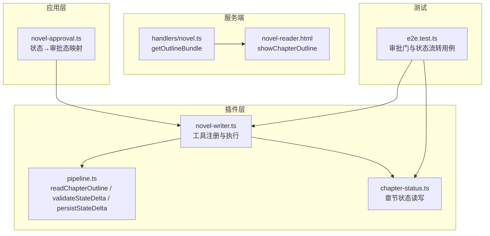
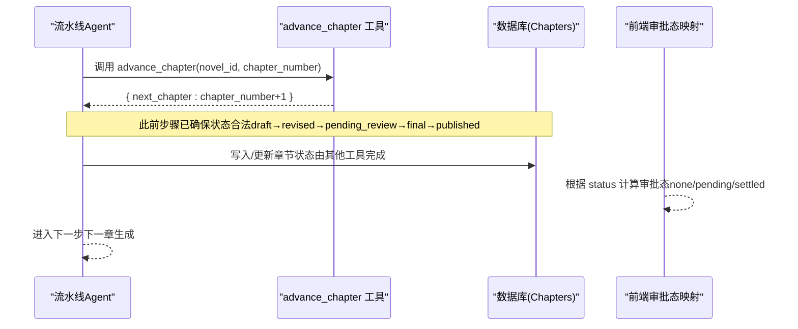
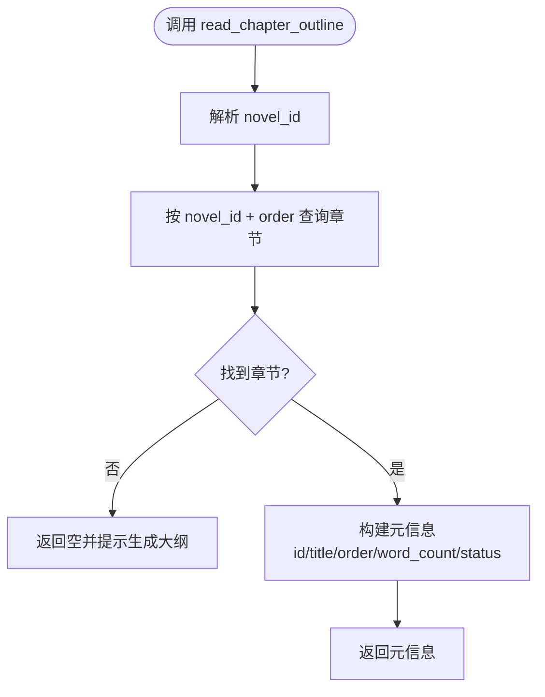
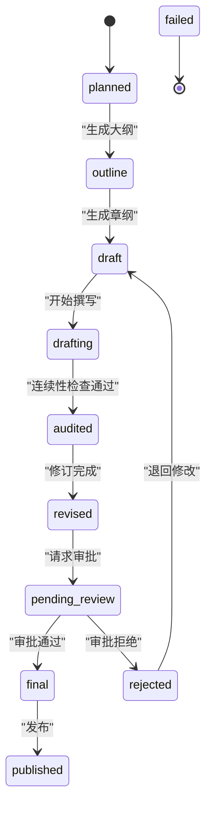
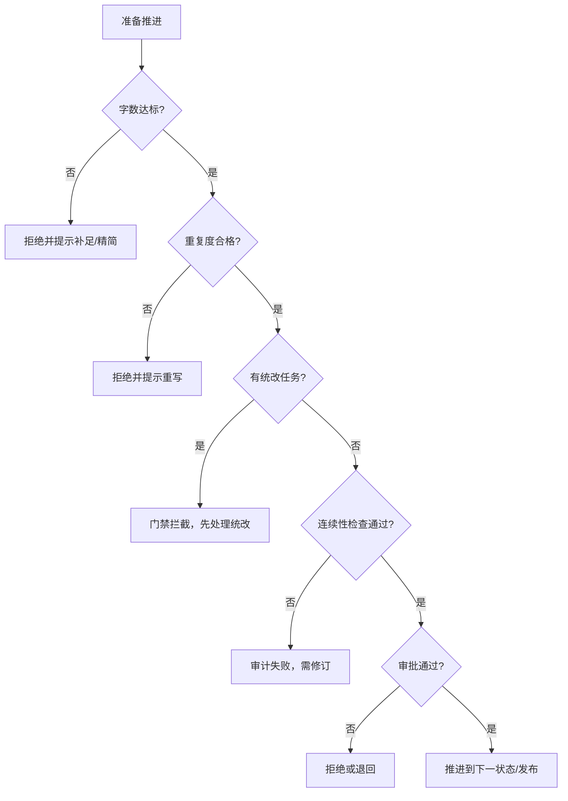
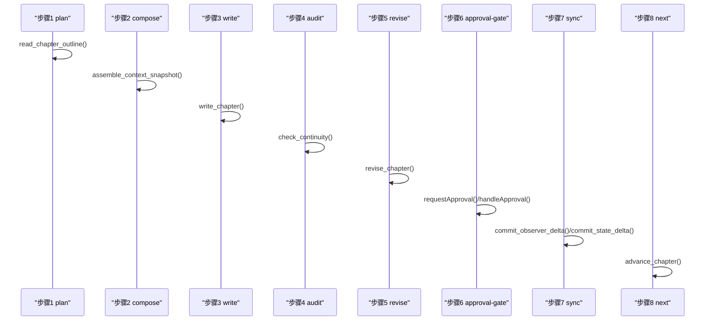
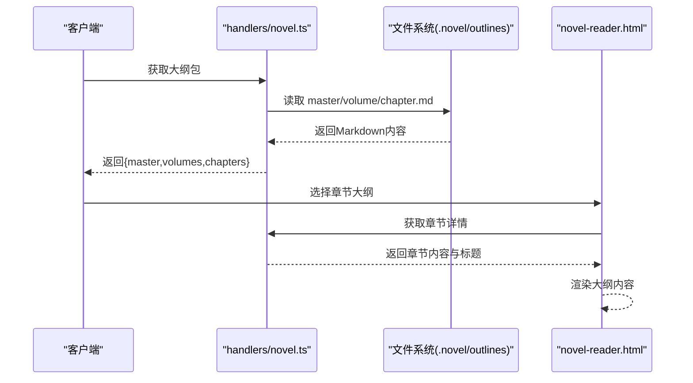
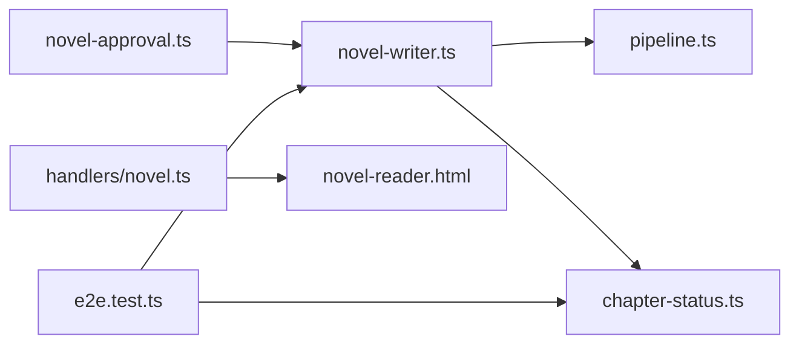

# 步骤8：章节推进

<cite>
**本文引用的文件**
- [packages/plugin/src/novel-writer.ts](file://packages/plugin/src/novel-writer.ts)
- [packages/plugin/src/novel-writer/pipeline.ts](file://packages/plugin/src/novel-writer/pipeline.ts)
- [packages/plugin/src/novel-writer/chapter-status.ts](file://packages/plugin/src/novel-writer/chapter-status.ts)
- [packages/app/src/context/novel-approval.ts](file://packages/app/src/context/novel-approval.ts)
- [packages/server/src/handlers/novel.ts](file://packages/server/src/handlers/novel.ts)
- [packages/opencode/src/server/routes/instance/httpapi/novel-reader.html](file://packages/opencode/src/server/routes/instance/httpapi/novel-reader.html)
- [packages/plugin/test/novel-writer/e2e.test.ts](file://packages/plugin/test/novel-writer/e2e.test.ts)
</cite>

## 目录
1. [简介](#简介)
2. [项目结构](#项目结构)
3. [核心组件](#核心组件)
4. [架构总览](#架构总览)
5. [详细组件分析](#详细组件分析)
6. [依赖关系分析](#依赖关系分析)
7. [性能考量](#性能考量)
8. [故障排查指南](#故障排查指南)
9. [结论](#结论)
10. [附录](#附录)

## 简介
本文件聚焦 openNovel 八步写作流水线中的“步骤8：章节推进”，系统性阐述：
- 章节状态流转机制（draft → revised → published 等）与审批门控
- readChapterOutline 工具的实现与章节信息读取逻辑
- 与其他步骤的协调机制与数据传递方式
- 章节完成度检查、前置条件验证与推进权限控制
- 自然推进与状态管理的实践示例（以代码片段路径引用代替直接代码内容）

## 项目结构
围绕“章节推进”的关键代码分布在插件层（novel-writer）、流水线辅助函数（pipeline）、前端审批态映射（app context）、服务端大纲读取（server handler）以及端到端测试（e2e）。

**图表来源**
- [packages/plugin/src/novel-writer.ts](file://packages/plugin/src/novel-writer.ts)
- [packages/plugin/src/novel-writer/pipeline.ts](file://packages/plugin/src/novel-writer/pipeline.ts)
- [packages/plugin/src/novel-writer/chapter-status.ts](file://packages/plugin/src/novel-writer/chapter-status.ts)
- [packages/app/src/context/novel-approval.ts](file://packages/app/src/context/novel-approval.ts)
- [packages/server/src/handlers/novel.ts](file://packages/server/src/handlers/novel.ts)
- [packages/opencode/src/server/routes/instance/httpapi/novel-reader.html](file://packages/opencode/src/server/routes/instance/httpapi/novel-reader.html)
- [packages/plugin/test/novel-writer/e2e.test.ts](file://packages/plugin/test/novel-writer/e2e.test.ts)

**章节来源**
- [packages/plugin/src/novel-writer.ts](file://packages/plugin/src/novel-writer.ts)
- [packages/plugin/src/novel-writer/pipeline.ts](file://packages/plugin/src/novel-writer/pipeline.ts)
- [packages/app/src/context/novel-approval.ts](file://packages/app/src/context/novel-approval.ts)
- [packages/server/src/handlers/novel.ts](file://packages/server/src/handlers/novel.ts)
- [packages/opencode/src/server/routes/instance/httpapi/novel-reader.html](file://packages/opencode/src/server/routes/instance/httpapi/novel-reader.html)
- [packages/plugin/test/novel-writer/e2e.test.ts](file://packages/plugin/test/novel-writer/e2e.test.ts)

## 核心组件
- 章节推进工具 advance_chapter：返回下一章序号，作为流水线第8步的收尾动作。
- 章节大纲读取 readChapterOutline：从数据库按 novel_id + order 定位章节元信息。
- 状态变更校验与提交 validateStateDelta / persistStateDelta：确保内容有效后提交 chapter_summary 日志。
- 章节状态更新 updateChapterStatus / getChapterStatus：驱动 draft → audited → revised → pending_review → final → published 等流转。
- 审批门控与前端映射：将后端状态映射为 none/pending/settled 三类审批态，驱动 UI 按钮显隐。

**章节来源**
- [packages/plugin/src/novel-writer.ts](file://packages/plugin/src/novel-writer.ts)
- [packages/plugin/src/novel-writer/pipeline.ts](file://packages/plugin/src/novel-writer/pipeline.ts)
- [packages/plugin/src/novel-writer/chapter-status.ts](file://packages/plugin/src/novel-writer/chapter-status.ts)
- [packages/app/src/context/novel-approval.ts](file://packages/app/src/context/novel-approval.ts)

## 架构总览
步骤8“章节推进”处于流水线末尾，承接前序步骤（计划、组装上下文、撰写、审计、修订、审批门、同步）的结果，负责：
- 确认当前章节已完成必要流程（字数达标、重复度通过、连续性检查通过、人工审批通过）
- 将状态推进至可发布或已发布
- 输出下一章序号，供后续步骤继续生成

**图表来源**
- [packages/plugin/src/novel-writer.ts](file://packages/plugin/src/novel-writer.ts)
- [packages/app/src/context/novel-approval.ts](file://packages/app/src/context/novel-approval.ts)

## 详细组件分析

### readChapterOutline 工具与章节信息读取
- 作用：在步骤1（plan）中读取指定章节的标题、序号、字数、状态等元信息，用于后续步骤决策。
- 实现要点：
  - 通过 novel_id 与 order 精确匹配章节记录
  - 不存在时返回空，调用方需提示先生成大纲
- 使用位置：novel-writer.ts 中 read_chapter_outline 工具封装调用 pipeline.readChapterOutline

**图表来源**
- [packages/plugin/src/novel-writer/pipeline.ts](file://packages/plugin/src/novel-writer/pipeline.ts)
- [packages/plugin/src/novel-writer.ts](file://packages/plugin/src/novel-writer.ts)

**章节来源**
- [packages/plugin/src/novel-writer/pipeline.ts](file://packages/plugin/src/novel-writer/pipeline.ts)
- [packages/plugin/src/novel-writer.ts](file://packages/plugin/src/novel-writer.ts)

### 章节状态流转与审批门控
- 状态集合与含义：
  - planned/outline/draft/drafting/audited/revised/pending_review/final/rejected/published/failed
- 审批态映射（前端）：
  - none：planned/draft/outline/failed
  - pending：drafting/audited/revised/pending_review
  - settled：final/rejected/published
- 流转规则（典型路径）：
  - 草稿阶段：draft → drafting（开始写）→ audited（审计）→ revised（修订）→ pending_review（待审批）→ final（通过）→ published（发布）
  - 失败分支：rejected/failed（退回或失败）

**图表来源**
- [packages/app/src/context/novel-approval.ts](file://packages/app/src/context/novel-approval.ts)
- [packages/plugin/test/novel-writer/e2e.test.ts](file://packages/plugin/test/novel-writer/e2e.test.ts)

**章节来源**
- [packages/app/src/context/novel-approval.ts](file://packages/app/src/context/novel-approval.ts)
- [packages/plugin/test/novel-writer/e2e.test.ts](file://packages/plugin/test/novel-writer/e2e.test.ts)

### 推进权限控制与前置条件验证
- 字数校验：write_chapter/revise_chapter 会拒绝低于目标或超过上限的内容，强制补齐/精简后再提交。
- 重复度校验：检测与前文章节相似度，防止重复事件/场景。
- 门禁拦截：存在未处理的统改任务（cascade pending）时，禁止写入新内容或修订。
- 评审维度：check_continuity 进行37维确定性检查，结果持久化为评审记录；submit_chapter_review 提交审计结果。
- 审批门：requestApproval 将状态置为 pending_review，handleApproval 通过后置为 final。

**图表来源**
- [packages/plugin/src/novel-writer.ts](file://packages/plugin/src/novel-writer.ts)
- [packages/plugin/test/novel-writer/e2e.test.ts](file://packages/plugin/test/novel-writer/e2e.test.ts)

**章节来源**
- [packages/plugin/src/novel-writer.ts](file://packages/plugin/src/novel-writer.ts)
- [packages/plugin/test/novel-writer/e2e.test.ts](file://packages/plugin/test/novel-writer/e2e.test.ts)

### 与其他步骤的协调机制与数据传递
- 步骤1（plan）：read_chapter_outline 读取章节元信息，为后续步骤提供基础数据。
- 步骤2（compose）：assemble_context_snapshot 组装蓝图、角色、摘要、伏笔等上下文。
- 步骤3（write）：write_chapter 写入正文并归档版本，设置状态为 draft。
- 步骤4（audit）：check_continuity 执行37维检查并持久化评审记录。
- 步骤5（revise）：revise_chapter 修订内容，设置状态为 revised。
- 步骤6（approval-gate）：requestApproval 置 pending_review，handleApproval 置 final。
- 步骤7（sync）：commit_observer_delta 提交 observer/reflector 校验后的 delta；validate_state_delta + commit_state_delta 仅提交 chapter_summary。
- 步骤8（next）：advance_chapter 返回下一章序号，结束本轮推进。

**图表来源**
- [packages/plugin/src/novel-writer.ts](file://packages/plugin/src/novel-writer.ts)
- [packages/plugin/src/novel-writer/pipeline.ts](file://packages/plugin/src/novel-writer/pipeline.ts)

**章节来源**
- [packages/plugin/src/novel-writer.ts](file://packages/plugin/src/novel-writer.ts)
- [packages/plugin/src/novel-writer/pipeline.ts](file://packages/plugin/src/novel-writer/pipeline.ts)

### 大纲与章节内容的读取与展示
- 服务端大纲包：getOutlineBundle 聚合 master/volume/chapter 大纲 Markdown 文本。
- Web 阅读器：showChapterOutline 渲染章节大纲内容，支持返回卷列表。

**图表来源**
- [packages/server/src/handlers/novel.ts](file://packages/server/src/handlers/novel.ts)
- [packages/opencode/src/server/routes/instance/httpapi/novel-reader.html](file://packages/opencode/src/server/routes/instance/httpapi/novel-reader.html)

**章节来源**
- [packages/server/src/handlers/novel.ts](file://packages/server/src/handlers/novel.ts)
- [packages/opencode/src/server/routes/instance/httpapi/novel-reader.html](file://packages/opencode/src/server/routes/instance/httpapi/novel-reader.html)

## 依赖关系分析
- novel-writer.ts 依赖 pipeline.ts 的 readChapterOutline/validateStateDelta/persistStateDelta
- chapter-status.ts 提供状态读写能力，被 e2e 测试与工具链调用
- app 层的 novel-approval.ts 依赖后端状态字段映射审批态
- server handlers/novel.ts 与 reader HTML 协同提供大纲读取与展示

**图表来源**
- [packages/plugin/src/novel-writer.ts](file://packages/plugin/src/novel-writer.ts)
- [packages/plugin/src/novel-writer/pipeline.ts](file://packages/plugin/src/novel-writer/pipeline.ts)
- [packages/plugin/src/novel-writer/chapter-status.ts](file://packages/plugin/src/novel-writer/chapter-status.ts)
- [packages/app/src/context/novel-approval.ts](file://packages/app/src/context/novel-approval.ts)
- [packages/server/src/handlers/novel.ts](file://packages/server/src/handlers/novel.ts)
- [packages/opencode/src/server/routes/instance/httpapi/novel-reader.html](file://packages/opencode/src/server/routes/instance/httpapi/novel-reader.html)
- [packages/plugin/test/novel-writer/e2e.test.ts](file://packages/plugin/test/novel-writer/e2e.test.ts)

**章节来源**
- [packages/plugin/src/novel-writer.ts](file://packages/plugin/src/novel-writer.ts)
- [packages/plugin/src/novel-writer/pipeline.ts](file://packages/plugin/src/novel-writer/pipeline.ts)
- [packages/plugin/src/novel-writer/chapter-status.ts](file://packages/plugin/src/novel-writer/chapter-status.ts)
- [packages/app/src/context/novel-approval.ts](file://packages/app/src/context/novel-approval.ts)
- [packages/server/src/handlers/novel.ts](file://packages/server/src/handlers/novel.ts)
- [packages/opencode/src/server/routes/instance/httpapi/novel-reader.html](file://packages/opencode/src/server/routes/instance/httpapi/novel-reader.html)
- [packages/plugin/test/novel-writer/e2e.test.ts](file://packages/plugin/test/novel-writer/e2e.test.ts)

## 性能考量
- 数据库查询优化：readChapterOutline 使用精准索引字段（novel_id + order），避免全表扫描。
- 批量操作：update_chapter/delete_chapter 等工具尽量减少往返次数，必要时使用事务。
- 内容校验前置：字数与重复度校验在写入前快速失败，减少无效落库。
- 评审记录合并：同一轮次内容未变更时合并评审，降低存储与查询压力。

[本节为通用指导，不直接分析具体文件]

## 故障排查指南
- 章节不存在：read_chapter_outline/read_chapter_content 返回空或错误，需确认 novel_id 与 chapter_number 是否正确。
- 字数不达标：write_chapter/revise_chapter 拒绝写入，需扩写或精简内容。
- 重复度过高：检测到与前文相似段落，需重写相关部分。
- 统改任务阻塞：存在 pending 任务时，先调用 cascade_execute 或 cascade_list_pending 处理。
- 审批未通过：requestApproval 后 handleApproval 拒绝，需根据评审意见修订。

**章节来源**
- [packages/plugin/src/novel-writer.ts](file://packages/plugin/src/novel-writer.ts)
- [packages/plugin/test/novel-writer/e2e.test.ts](file://packages/plugin/test/novel-writer/e2e.test.ts)

## 结论
步骤8“章节推进”是流水线收尾环节，确保章节在完成撰写、审计、修订与审批后，安全地推进至发布状态，并输出下一章序号。其核心在于：
- 严格的前置条件校验（字数、重复度、连续性、审批）
- 清晰的状态流转与审批态映射
- 与前后步骤的数据契约（元信息、上下文、评审记录、delta）
遵循上述机制可实现章节的自然推进与稳定管理。

[本节为总结性内容，不直接分析具体文件]

## 附录
- 关键工具与函数路径（以源码路径引用代替代码片段）：
  - readChapterOutline：[packages/plugin/src/novel-writer/pipeline.ts](file://packages/plugin/src/novel-writer/pipeline.ts)
  - validateStateDelta/persistStateDelta：[packages/plugin/src/novel-writer/pipeline.ts](file://packages/plugin/src/novel-writer/pipeline.ts)
  - advance_chapter/update_chapter：[packages/plugin/src/novel-writer.ts](file://packages/plugin/src/novel-writer.ts)
  - 章节状态读写：[packages/plugin/src/novel-writer/chapter-status.ts](file://packages/plugin/src/novel-writer/chapter-status.ts)
  - 审批态映射：[packages/app/src/context/novel-approval.ts](file://packages/app/src/context/novel-approval.ts)
  - 大纲读取与展示：[packages/server/src/handlers/novel.ts](file://packages/server/src/handlers/novel.ts), [packages/opencode/src/server/routes/instance/httpapi/novel-reader.html](file://packages/opencode/src/server/routes/instance/httpapi/novel-reader.html)
  - 端到端用例（审批门与状态流转）：[packages/plugin/test/novel-writer/e2e.test.ts](file://packages/plugin/test/novel-writer/e2e.test.ts)