# 智能书架管理

<cite>
**本文引用的文件**   
- [packages/schema/src/novel.ts](file://packages/schema/src/novel.ts)
- [packages/protocol/src/groups/novel.ts](file://packages/protocol/src/groups/novel.ts)
- [packages/server/src/handlers/novel.ts](file://packages/server/src/handlers/novel.ts)
- [packages/core/src/session/sql.ts](file://packages/core/src/session/sql.ts)
- [packages/core/src/database/migration/20260721152252_novel_writing_tables.ts](file://packages/core/src/database/migration/20260721152252_novel_writing_tables.ts)
- [packages/server/test/novel-e2e.test.ts](file://packages/server/test/novel-e2e.test.ts)
- [packages/app/src/components/titlebar-history.ts](file://packages/app/src/components/titlebar-history.ts)
- [packages/app/src/components/titlebar-session-events.ts](file://packages/app/src/components/titlebar-session-events.ts)
- [packages/app/src/context/layout-scroll.ts](file://packages/app/src/context/layout-scroll.ts)
- [packages/app/src/utils/persist.ts](file://packages/app/src/utils/persist.ts)
- [packages/app/src/components/titlebar.tsx](file://packages/app/src/components/titlebar.tsx)
- [packages/app/src/pages/home.tsx](file://packages/app/src/pages/home.tsx)
</cite>

## 更新摘要
**所做更改**   
- 新增标题栏集成功能，支持快速切换作品
- 增强阅读位置持久化机制，提升用户体验
- 修复后退导航问题，改善导航一致性
- 优化书架管理的整体交互体验

## 目录
1. [简介](#简介)
2. [项目结构](#项目结构)
3. [核心组件](#核心组件)
4. [架构总览](#架构总览)
5. [详细组件分析](#详细组件分析)
6. [依赖关系分析](#依赖关系分析)
7. [性能考量](#性能考量)
8. [故障排查指南](#故障排查指南)
9. [结论](#结论)
10. [附录：API 接口与使用示例](#附录api-接口与使用示例)

## 简介
本文件为 openNovel 的"智能书架管理系统"提供系统化文档，覆盖小说作品的创建、编辑、删除；作品元数据结构（标题、类型、简介、状态等）；多作品切换、搜索过滤与排序；导入导出、批量操作与数据备份恢复；以及 API 接口与数据库交互模式、事务处理。读者可据此快速理解系统设计与实现要点，并安全地集成或扩展功能。

**最新更新** 增强了书架管理的用户体验，新增了标题栏集成、阅读位置持久化、后退导航修复等功能，提升了整体书架操作的便捷性和一致性。

## 项目结构
智能书架相关代码主要分布在以下模块：
- 协议与接口定义：packages/protocol/src/groups/novel.ts
- 数据模型与输入输出校验：packages/schema/src/novel.ts
- 服务端处理器与业务编排：packages/server/src/handlers/novel.ts
- 数据库表结构与索引：packages/core/src/session/sql.ts
- 数据库迁移脚本：packages/core/src/database/migration/20260721152252_novel_writing_tables.ts
- 端到端测试用例：packages/server/test/novel-e2e.test.ts
- **新增** 标题栏历史管理：packages/app/src/components/titlebar-history.ts
- **新增** 会话事件处理：packages/app/src/components/titlebar-session-events.ts
- **新增** 滚动位置持久化：packages/app/src/context/layout-scroll.ts
- **新增** 数据持久化工具：packages/app/src/utils/persist.ts
- **新增** 标题栏集成：packages/app/src/components/titlebar.tsx
- **新增** 主页书架界面：packages/app/src/pages/home.tsx

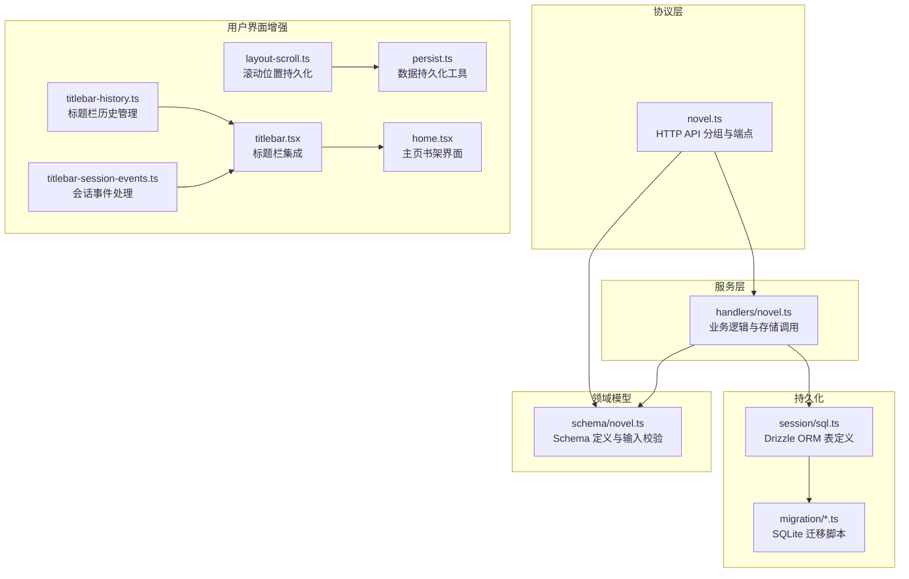

**图表来源** 
- [packages/protocol/src/groups/novel.ts:1-120](file://packages/protocol/src/groups/novel.ts#L1-L120)
- [packages/schema/src/novel.ts:1-60](file://packages/schema/src/novel.ts#L1-L60)
- [packages/server/src/handlers/novel.ts:1-80](file://packages/server/src/handlers/novel.ts#L1-L80)
- [packages/core/src/session/sql.ts:180-250](file://packages/core/src/session/sql.ts#L180-L250)
- [packages/core/src/database/migration/20260721152252_novel_writing_tables.ts:1-60](file://packages/core/src/database/migration/20260721152252_novel_writing_tables.ts#L1-L60)
- [packages/app/src/components/titlebar-history.ts:1-58](file://packages/app/src/components/titlebar-history.ts#L1-L58)
- [packages/app/src/components/titlebar-session-events.ts:1-36](file://packages/app/src/components/titlebar-session-events.ts#L1-L36)
- [packages/app/src/context/layout-scroll.ts:1-51](file://packages/app/src/context/layout-scroll.ts#L1-L51)
- [packages/app/src/utils/persist.ts:1-561](file://packages/app/src/utils/persist.ts#L1-L561)
- [packages/app/src/components/titlebar.tsx:506-536](file://packages/app/src/components/titlebar.tsx#L506-L536)
- [packages/app/src/pages/home.tsx:310-423](file://packages/app/src/pages/home.tsx#L310-L423)

**章节来源**
- [packages/protocol/src/groups/novel.ts:1-120](file://packages/protocol/src/groups/novel.ts#L1-L120)
- [packages/schema/src/novel.ts:1-60](file://packages/schema/src/novel.ts#L1-L60)
- [packages/server/src/handlers/novel.ts:1-80](file://packages/server/src/handlers/novel.ts#L1-L80)
- [packages/core/src/session/sql.ts:180-250](file://packages/core/src/session/sql.ts#L180-L250)
- [packages/core/src/database/migration/20260721152252_novel_writing_tables.ts:1-60](file://packages/core/src/database/migration/20260721152252_novel_writing_tables.ts#L1-L60)
- [packages/app/src/components/titlebar-history.ts:1-58](file://packages/app/src/components/titlebar-history.ts#L1-L58)
- [packages/app/src/components/titlebar-session-events.ts:1-36](file://packages/app/src/components/titlebar-session-events.ts#L1-L36)
- [packages/app/src/context/layout-scroll.ts:1-51](file://packages/app/src/context/layout-scroll.ts#L1-L51)
- [packages/app/src/utils/persist.ts:1-561](file://packages/app/src/utils/persist.ts#L1-L561)
- [packages/app/src/components/titlebar.tsx:506-536](file://packages/app/src/components/titlebar.tsx#L506-L536)
- [packages/app/src/pages/home.tsx:310-423](file://packages/app/src/pages/home.tsx#L310-L423)

## 核心组件
- 协议组 NovelGroup：集中声明所有小说相关的 HTTP 端点，包括列表、详情、卷、章节、角色、伏笔、剧情线、风格指南、大纲、导出、绑定会话等。
- Schema 模型：以 Effect Schema 定义实体与输入，确保请求参数与响应数据的强类型校验。
- 处理器 handlers：将 HTTP 请求映射到具体函数，进行权限/存在性检查、调用存储层、转换结果。
- 数据库表：基于 Drizzle ORM 定义 SQLite 表结构与索引，支撑高效查询与级联删除。
- 迁移脚本：在启动时按序应用，保证 schema 一致性。
- **新增** 标题栏历史管理：提供前进后退导航功能，支持最多100条历史记录。
- **新增** 会话事件处理：处理标签页移除等跨组件通信。
- **新增** 滚动位置持久化：自动保存和恢复用户的滚动位置。
- **新增** 数据持久化工具：统一的本地存储抽象，支持多种存储后端。
- **新增** 标题栏集成：在标题栏中集成书架入口，支持快速作品切换。
- **新增** 主页书架界面：现代化的书架展示界面，支持搜索、筛选和排序。

**章节来源**
- [packages/protocol/src/groups/novel.ts:82-165](file://packages/protocol/src/groups/novel.ts#L82-L165)
- [packages/schema/src/novel.ts:8-40](file://packages/schema/src/novel.ts#L8-L40)
- [packages/server/src/handlers/novel.ts:380-422](file://packages/server/src/handlers/novel.ts#L380-L422)
- [packages/core/src/session/sql.ts:182-248](file://packages/core/src/session/sql.ts#L182-L248)
- [packages/core/src/database/migration/20260721152252_novel_writing_tables.ts:97-106](file://packages/core/src/database/migration/20260721152252_novel_writing_tables.ts#L97-L106)
- [packages/app/src/components/titlebar-history.ts:1-58](file://packages/app/src/components/titlebar-history.ts#L1-L58)
- [packages/app/src/components/titlebar-session-events.ts:1-36](file://packages/app/src/components/titlebar-session-events.ts#L1-L36)
- [packages/app/src/context/layout-scroll.ts:1-51](file://packages/app/src/context/layout-scroll.ts#L1-L51)
- [packages/app/src/utils/persist.ts:1-561](file://packages/app/src/utils/persist.ts#L1-L561)
- [packages/app/src/components/titlebar.tsx:506-536](file://packages/app/src/components/titlebar.tsx#L506-L536)
- [packages/app/src/pages/home.tsx:310-423](file://packages/app/src/pages/home.tsx#L310-L423)

## 架构总览
整体采用"协议定义 → 处理器编排 → 存储访问"的分层架构。HTTP 请求进入 NovelGroup，路由到对应 handler，handler 负责参数校验、资源存在性检查、调用 novel-store 存储函数，最终返回符合 Schema 的结果。

**新增** 用户界面层通过标题栏集成、滚动持久化和历史管理等功能，提供了更加流畅的用户体验。

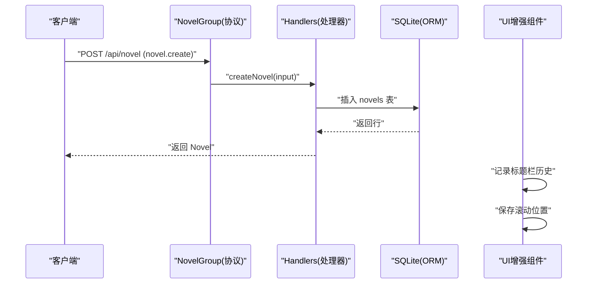

**图表来源** 
- [packages/protocol/src/groups/novel.ts:98-113](file://packages/protocol/src/groups/novel.ts#L98-L113)
- [packages/server/src/handlers/novel.ts:1053-1071](file://packages/server/src/handlers/novel.ts#L1053-L1071)
- [packages/core/src/session/sql.ts:182-199](file://packages/core/src/session/sql.ts#L182-L199)
- [packages/app/src/components/titlebar-history.ts:11-26](file://packages/app/src/components/titlebar-history.ts#L11-L26)
- [packages/app/src/context/layout-scroll.ts:16-51](file://packages/app/src/context/layout-scroll.ts#L16-L51)

## 详细组件分析

### 作品元数据结构
- 作品 Novel：包含 id、title、genre、synopsis、status、createdAt、updatedAt。
- 作品详情 NovelDetail：在 Novel 基础上附加 styleGuide 与 stats（章节数、卷数、角色数、字数）。
- 类型 Genre：限定为若干中文类型值（如玄幻、都市、仙侠等）。
- 状态 status：默认 draft，用于生命周期管理。

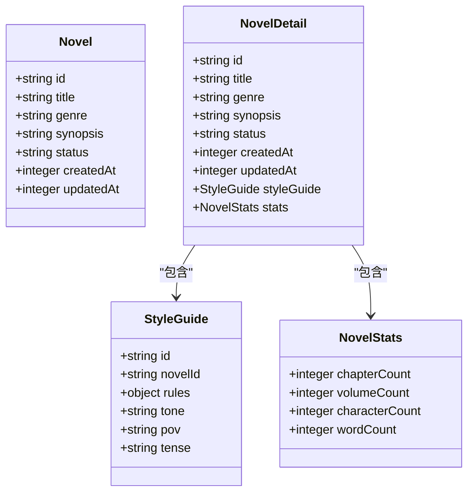

**图表来源** 
- [packages/schema/src/novel.ts:8-38](file://packages/schema/src/novel.ts#L8-L38)
- [packages/schema/src/novel.ts:187-195](file://packages/schema/src/novel.ts#L187-L195)

**章节来源**
- [packages/schema/src/novel.ts:8-38](file://packages/schema/src/novel.ts#L8-L38)
- [packages/schema/src/novel.ts:187-195](file://packages/schema/src/novel.ts#L187-L195)

### 作品 CRUD 操作
- 创建作品：POST /api/novel，输入 CreateNovelInput（title、genre、synopsis），返回 Novel。
- 更新作品：PUT /api/novel/:novelID，输入 UpdateNovelInput（title/synopsis/genre 可选），返回 Novel。
- 删除作品：DELETE /api/novel/:novelID，返回 { deleted: true }。

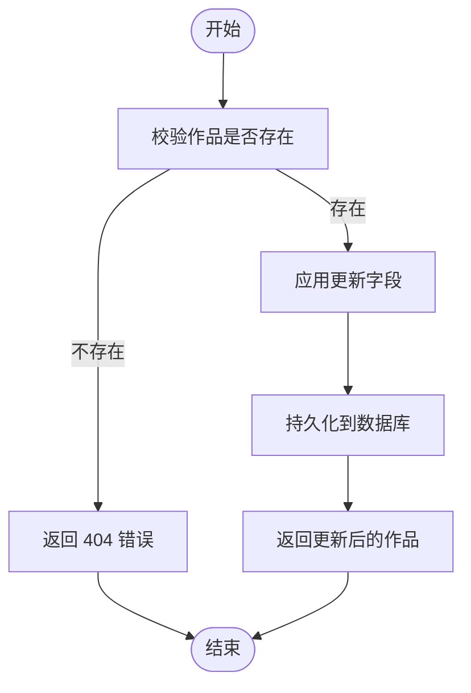

**图表来源** 
- [packages/protocol/src/groups/novel.ts:98-113](file://packages/protocol/src/groups/novel.ts#L98-L113)
- [packages/protocol/src/groups/novel.ts:685-704](file://packages/protocol/src/groups/novel.ts#L685-704)
- [packages/server/src/handlers/novel.ts:1053-1071](file://packages/server/src/handlers/novel.ts#L1053-L1071)

**章节来源**
- [packages/protocol/src/groups/novel.ts:98-113](file://packages/protocol/src/groups/novel.ts#L98-L113)
- [packages/protocol/src/groups/novel.ts:685-704](file://packages/protocol/src/groups/novel.ts#L685-704)
- [packages/server/src/handlers/novel.ts:1053-1071](file://packages/server/src/handlers/novel.ts#L1053-L1071)

### 多作品切换与会话绑定
- 通过 novel.for-session 接口根据 sessionID 解析绑定的作品，便于在多作品间切换上下文。
- 支持 novel.bind 将某个 session 绑定到指定作品。

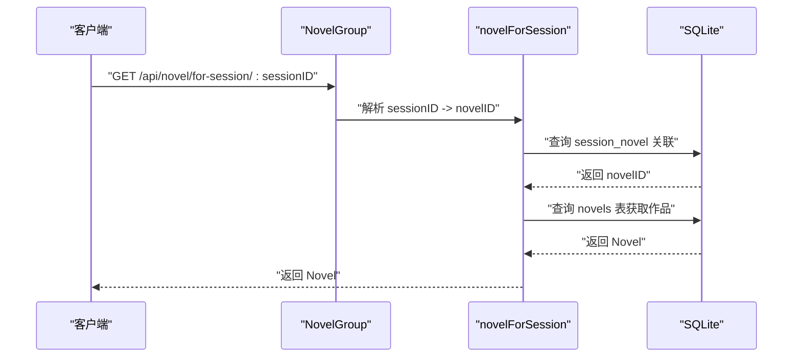

**图表来源** 
- [packages/protocol/src/groups/novel.ts:115-129](file://packages/protocol/src/groups/novel.ts#L115-L129)
- [packages/server/src/handlers/novel.ts:380-396](file://packages/server/src/handlers/novel.ts#L380-396)
- [packages/core/src/session/sql.ts:445-463](file://packages/core/src/session/sql.ts#L445-463)

**章节来源**
- [packages/protocol/src/groups/novel.ts:115-129](file://packages/protocol/src/groups/novel.ts#L115-L129)
- [packages/server/src/handlers/novel.ts:380-396](file://packages/server/src/handlers/novel.ts#L380-396)
- [packages/core/src/session/sql.ts:445-463](file://packages/core/src/session/sql.ts#L445-463)

### 搜索、过滤与排序
- 全文搜索：GET /api/novel/:novelID/search，支持 q 与 location 过滤，返回 NovelSearchResult（含 snippet）。
- 列表排序：卷与章节均按 order 字段升序排列。
- 状态过滤：作品列表可按 status 过滤（通过索引优化）。

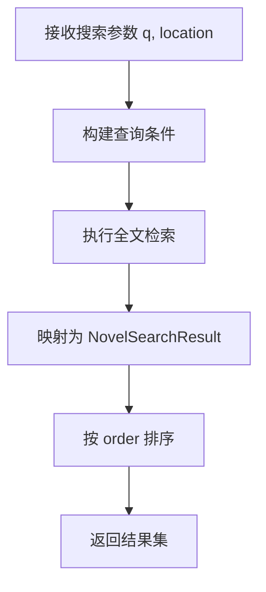

**图表来源** 
- [packages/protocol/src/groups/novel.ts:621-639](file://packages/protocol/src/groups/novel.ts#L621-639)
- [packages/schema/src/novel.ts:329-336](file://packages/schema/src/novel.ts#L329-336)
- [packages/core/src/session/sql.ts:222-248](file://packages/core/src/session/sql.ts#L222-248)

**章节来源**
- [packages/protocol/src/groups/novel.ts:621-639](file://packages/protocol/src/groups/novel.ts#L621-639)
- [packages/schema/src/novel.ts:329-336](file://packages/schema/src/novel.ts#L329-336)
- [packages/core/src/session/sql.ts:222-248](file://packages/core/src/session/sql.ts#L222-248)

### 导入导出与批量操作
- 导出：GET /api/novel/:novelID/export，将卷与章节按顺序编译为单个 Markdown 文档，返回 filename 与 content。
- 大纲：GET/PUT /api/novel/:novelID/outline，支持 master/volume/chapter 三段式 markdown 更新。
- 批量操作：当前接口以单条为主，可通过循环调用实现批量；如需高性能批量，可在处理器层封装事务。

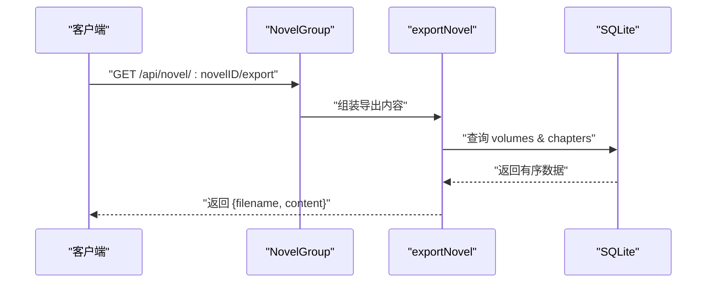

**图表来源** 
- [packages/protocol/src/groups/novel.ts:375-389](file://packages/protocol/src/groups/novel.ts#L375-389)
- [packages/server/src/handlers/novel.ts:454-485](file://packages/server/src/handlers/novel.ts#L454-485)

**章节来源**
- [packages/protocol/src/groups/novel.ts:375-389](file://packages/protocol/src/groups/novel.ts#L375-389)
- [packages/server/src/handlers/novel.ts:454-485](file://packages/server/src/handlers/novel.ts#L454-485)

### 数据备份与恢复
- 章节版本恢复：PUT /api/novel/:novelID/chapters/:chapterID/restore，支持恢复到指定 version。
- 回滚：POST /api/novel/:novelID/chapters/:chapterID/rollback，回退到上一版本。
- 备份建议：利用 export 接口生成完整 Markdown 作为文本备份；同时可对 SQLite 数据库文件进行物理备份。

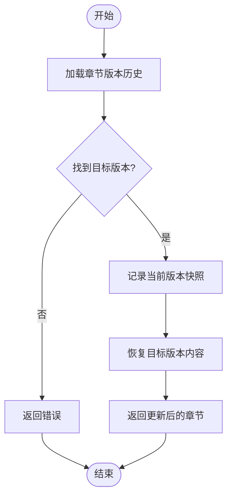

**图表来源** 
- [packages/protocol/src/groups/novel.ts:438-452](file://packages/protocol/src/groups/novel.ts#L438-452)
- [packages/server/src/handlers/novel.ts:800-839](file://packages/server/src/handlers/novel.ts#L800-839)

**章节来源**
- [packages/protocol/src/groups/novel.ts:438-452](file://packages/protocol/src/groups/novel.ts#L438-452)
- [packages/server/src/handlers/novel.ts:800-839](file://packages/server/src/handlers/novel.ts#L800-839)

### 与数据库的交互模式与事务处理
- 表结构：novels、volumes、chapters、chapter_versions、characters、character_states、relationships、plot_threads、foreshadowing、world_entries、style_guide、session_novel、novel_state_log 等。
- 索引：针对常见查询路径建立索引（novel_id、order、status、state 等）。
- 事务：处理器中通过 Effect.gen 组合多个 db 操作，必要时包裹在 Effect.sync/Effect.promise 中以保障原子性。
- 级联删除：外键约束设置 ON DELETE CASCADE 或 SET NULL，保证数据一致性。

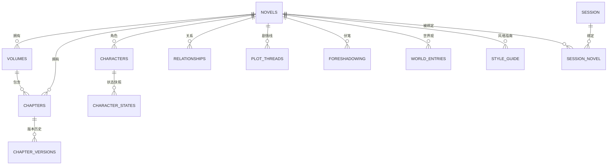

**图表来源** 
- [packages/core/src/session/sql.ts:182-491](file://packages/core/src/session/sql.ts#L182-491)
- [packages/core/src/database/migration/20260721152252_novel_writing_tables.ts:97-223](file://packages/core/src/database/migration/20260721152252_novel_writing_tables.ts#L97-223)

**章节来源**
- [packages/core/src/session/sql.ts:182-491](file://packages/core/src/session/sql.ts#L182-491)
- [packages/core/src/database/migration/20260721152252_novel_writing_tables.ts:97-223](file://packages/core/src/database/migration/20260721152252_novel_writing_tables.ts#L97-223)

### 标题栏集成与导航增强
**新增** 标题栏集成了书架功能，用户可以在任何页面快速访问和管理自己的作品。

- 标题栏历史管理：维护最多100条浏览历史，支持前进后退操作。
- 会话事件处理：处理标签页移除等跨组件通信事件。
- 快速作品切换：通过下拉菜单快速切换到已绑定的作品。

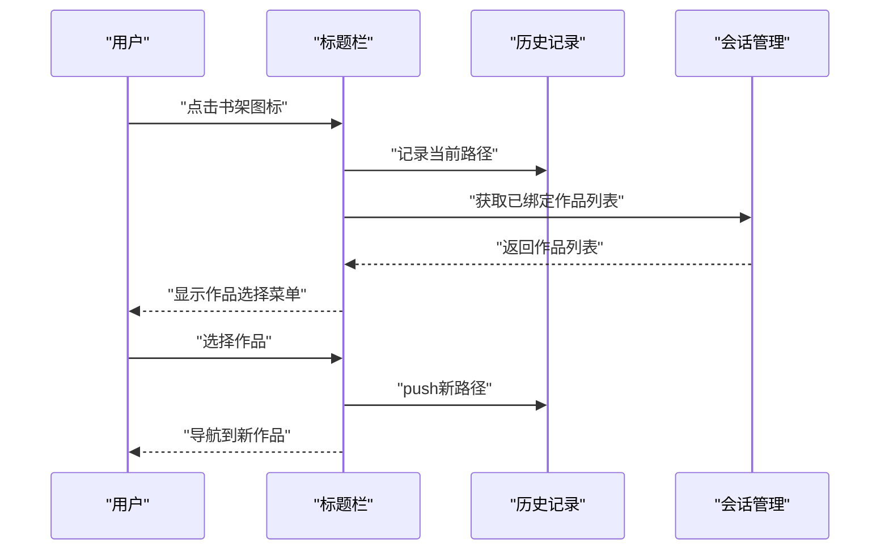

**图表来源** 
- [packages/app/src/components/titlebar-history.ts:11-26](file://packages/app/src/components/titlebar-history.ts#L11-L26)
- [packages/app/src/components/titlebar-session-events.ts:11-13](file://packages/app/src/components/titlebar-session-events.ts#L11-L13)
- [packages/app/src/components/titlebar.tsx:506-536](file://packages/app/src/components/titlebar.tsx#L506-L536)

**章节来源**
- [packages/app/src/components/titlebar-history.ts:1-58](file://packages/app/src/components/titlebar-history.ts#L1-L58)
- [packages/app/src/components/titlebar-session-events.ts:1-36](file://packages/app/src/components/titlebar-session-events.ts#L1-L36)
- [packages/app/src/components/titlebar.tsx:506-536](file://packages/app/src/components/titlebar.tsx#L506-L536)

### 阅读位置持久化
**新增** 系统现在能够自动保存和恢复用户的阅读位置，提供更好的阅读体验。

- 滚动位置持久化：每个会话的每个标签页都独立保存滚动位置。
- 防抖机制：避免频繁写入导致的性能问题。
- 内存缓存：提高读取性能，减少磁盘IO。

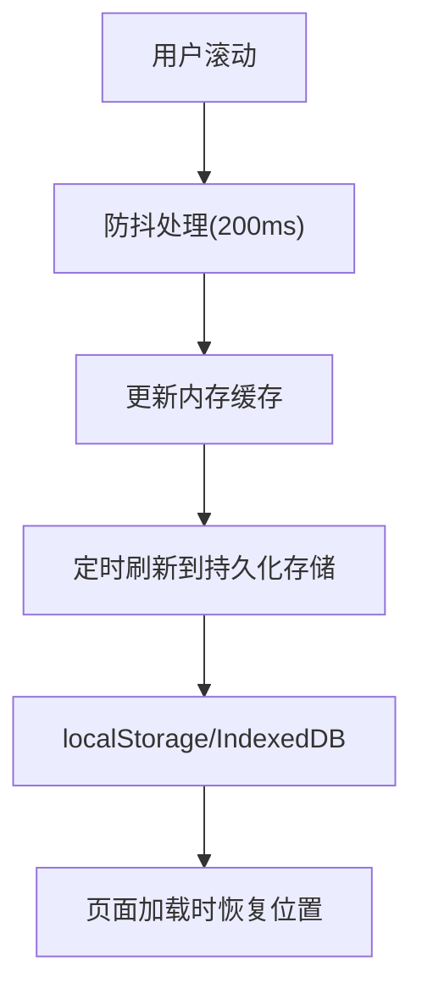

**图表来源** 
- [packages/app/src/context/layout-scroll.ts:16-51](file://packages/app/src/context/layout-scroll.ts#L16-L51)
- [packages/app/src/utils/persist.ts:553-561](file://packages/app/src/utils/persist.ts#L553-L561)

**章节来源**
- [packages/app/src/context/layout-scroll.ts:1-51](file://packages/app/src/context/layout-scroll.ts#L1-L51)
- [packages/app/src/utils/persist.ts:1-561](file://packages/app/src/utils/persist.ts#L1-L561)

### 主页书架界面
**新增** 现代化的主页书架界面，提供了更好的作品管理和浏览体验。

- 网格布局：响应式设计，适配不同屏幕尺寸。
- 搜索筛选：支持按标题、类型、状态等条件筛选作品。
- 创建向导：一键跳转到作品创建向导。
- 空状态处理：友好的空状态提示和操作引导。

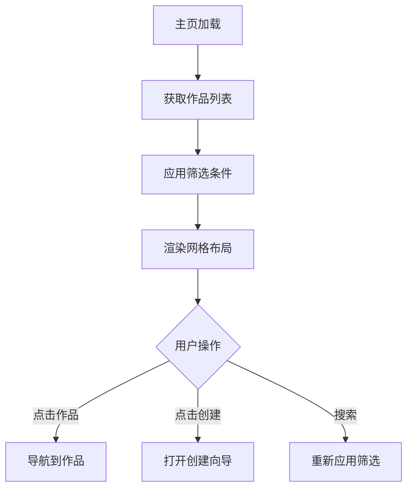

**图表来源** 
- [packages/app/src/pages/home.tsx:310-423](file://packages/app/src/pages/home.tsx#L310-L423)

**章节来源**
- [packages/app/src/pages/home.tsx:310-423](file://packages/app/src/pages/home.tsx#L310-L423)

## 依赖关系分析
- 协议层依赖 Schema 定义，确保请求/响应一致。
- 处理器依赖存储层（novel-store）与 ORM 表定义。
- 迁移脚本驱动数据库初始化与升级。
- 测试用例验证关键路径（列表、创建、绑定会话、大纲、张力曲线等）。
- **新增** UI组件依赖持久化工具和会话管理。
- **新增** 标题栏集成依赖历史管理和会话事件。

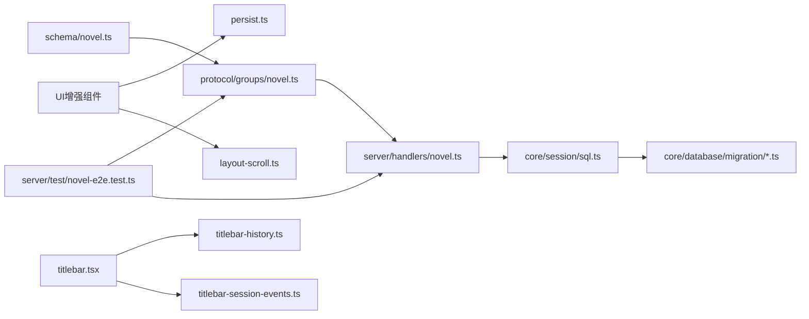

**图表来源** 
- [packages/schema/src/novel.ts:1-60](file://packages/schema/src/novel.ts#L1-L60)
- [packages/protocol/src/groups/novel.ts:1-120](file://packages/protocol/src/groups/novel.ts#L1-L120)
- [packages/server/src/handlers/novel.ts:1-80](file://packages/server/src/handlers/novel.ts#L1-L80)
- [packages/core/src/session/sql.ts:182-250](file://packages/core/src/session/sql.ts#L182-L250)
- [packages/core/src/database/migration/20260721152252_novel_writing_tables.ts:1-60](file://packages/core/src/database/migration/20260721152252_novel_writing_tables.ts#L1-L60)
- [packages/server/test/novel-e2e.test.ts:97-118](file://packages/server/test/novel-e2e.test.ts#L97-L118)
- [packages/app/src/components/titlebar-history.ts:1-58](file://packages/app/src/components/titlebar-history.ts#L1-L58)
- [packages/app/src/components/titlebar-session-events.ts:1-36](file://packages/app/src/components/titlebar-session-events.ts#L1-L36)
- [packages/app/src/context/layout-scroll.ts:1-51](file://packages/app/src/context/layout-scroll.ts#L1-L51)
- [packages/app/src/utils/persist.ts:1-561](file://packages/app/src/utils/persist.ts#L1-L561)

**章节来源**
- [packages/schema/src/novel.ts:1-60](file://packages/schema/src/novel.ts#L1-L60)
- [packages/protocol/src/groups/novel.ts:1-120](file://packages/protocol/src/groups/novel.ts#L1-L120)
- [packages/server/src/handlers/novel.ts:1-80](file://packages/server/src/handlers/novel.ts#L1-L80)
- [packages/core/src/session/sql.ts:182-250](file://packages/core/src/session/sql.ts#L182-L250)
- [packages/core/src/database/migration/20260721152252_novel_writing_tables.ts:1-60](file://packages/core/src/database/migration/20260721152252_novel_writing_tables.ts#L1-L60)
- [packages/server/test/novel-e2e.test.ts:97-118](file://packages/server/test/novel-e2e.test.ts#L97-L118)
- [packages/app/src/components/titlebar-history.ts:1-58](file://packages/app/src/components/titlebar-history.ts#L1-L58)
- [packages/app/src/components/titlebar-session-events.ts:1-36](file://packages/app/src/components/titlebar-session-events.ts#L1-L36)
- [packages/app/src/context/layout-scroll.ts:1-51](file://packages/app/src/context/layout-scroll.ts#L1-L51)
- [packages/app/src/utils/persist.ts:1-561](file://packages/app/src/utils/persist.ts#L1-L561)

## 性能考量
- 索引优化：novels.status、chapters.novel_order、volumes.novel_order、foreshadowing.state、plot_threads.status 等索引提升常用查询效率。
- 分页与限流：建议在列表接口增加分页参数与速率限制，避免大结果集拖慢响应。
- 缓存策略：对频繁读取的详情与统计信息可引入内存缓存（如 LRU），注意失效策略。
- 导出优化：大规模导出时可采用流式写入，减少内存占用。
- **新增** 滚动持久化防抖：避免频繁的磁盘写入操作。
- **新增** 内存缓存：持久化工具内置内存缓存，提高读取性能。
- **新增** 历史记录限制：最多保留100条历史记录，防止内存泄漏。

## 故障排查指南
- 404 错误：NovelNotFoundError/ChapterNotFoundError 表示资源不存在，检查 ID 是否正确、是否已删除。
- 400 错误：NovelValidationError 表示输入校验失败，核对字段类型与必填项。
- 绑定会话失败：确认 sessionID 有效且已绑定；查看 session_novel 表记录。
- 导出为空：检查章节内容是否为空或卷分配是否正确。
- **新增** 导航异常：检查标题栏历史记录栈是否损坏，尝试重置历史记录。
- **新增** 滚动位置丢失：检查持久化存储是否可用，查看浏览器存储配额。
- **新增** 书架无法加载：确认网络连接正常，检查服务器端作品列表接口。

**章节来源**
- [packages/protocol/src/groups/novel.ts:54-80](file://packages/protocol/src/groups/novel.ts#L54-80)
- [packages/server/test/novel-e2e.test.ts:239-273](file://packages/server/test/novel-e2e.test.ts#L239-273)
- [packages/app/src/components/titlebar-history.ts:43-49](file://packages/app/src/components/titlebar-history.ts#L43-L49)
- [packages/app/src/context/layout-scroll.ts:16-51](file://packages/app/src/context/layout-scroll.ts#L16-L51)

## 结论
智能书架管理系统以清晰的协议-处理器-存储分层设计，结合严格的 Schema 校验与完善的数据库索引，提供了完整的作品管理与创作辅助能力。通过会话绑定、搜索过滤、导出与版本恢复等功能，满足多作品协作与长期维护需求。

**最新更新** 通过标题栏集成、阅读位置持久化和后退导航修复等增强功能，显著提升了用户体验的一致性和便捷性。建议在生产环境补充分页、缓存与监控，进一步提升稳定性与性能。

## 附录：API 接口与使用示例
- 列表作品：GET /api/novel，返回 Novel[]。
- 创建作品：POST /api/novel，输入 CreateNovelInput，返回 Novel。
- 作品详情：GET /api/novel/:novelID，返回 NovelDetail。
- 列出卷：GET /api/novel/:novelID/volumes，返回 Volume[]。
- 列出章节：GET /api/novel/:novelID/chapters，返回 Chapter[]。
- 章节详情：GET /api/novel/:novelID/chapters/:chapterID，返回 ChapterDetail。
- 章节版本：GET /api/novel/:novelID/chapters/:chapterID/versions，返回 ChapterVersion[]。
- 章节审核：GET /api/novel/:novelID/chapters/:chapterID/reviews，返回 ChapterReview[]。
- 回滚章节：POST /api/novel/:novelID/chapters/:chapterID/rollback，返回 Chapter。
- 更新内容：PUT /api/novel/:novelID/chapters/:chapterID/content，返回 Chapter。
- 审批：POST /api/novel/:novelID/chapters/:chapterID/approval，返回 Chapter。
- 角色：GET /api/novel/:novelID/characters，返回 Character[]。
- 剧情线：GET /api/novel/:novelID/plot-threads，返回 PlotThread[]。
- 伏笔：GET /api/novel/:novelID/foreshadowing，返回 Foreshadowing[]。
- 世界观：GET /api/novel/:novelID/world-entries，返回 WorldEntry[]。
- 大纲：GET /api/novel/:novelID/outline，返回 OutlineBundle；PUT /api/novel/:novelID/outline，更新后返回 OutlineBundle。
- 导出：GET /api/novel/:novelID/export，返回 NovelExport。
- 删除章节：DELETE /api/novel/:novelID/chapters/:chapterID，返回 { deleted: true }。
- 创建卷：POST /api/novel/:novelID/volumes，返回 Volume。
- 更新卷：PUT /api/novel/:novelID/volumes/:volumeID，返回 Volume。
- 删除卷：DELETE /api/novel/:novelID/volumes/:volumeID，返回 { deleted: true }。
- 恢复版本：PUT /api/novel/:novelID/chapters/:chapterID/restore，返回 Chapter。
- 移动章节：PUT /api/novel/:novelID/chapters/:chapterID/move，返回 Chapter。
- 更新章节：PUT /api/novel/:novelID/chapters/:chapterID，返回 Chapter。
- 关系：GET/POST/PUT/DELETE /api/novel/:novelID/relationships/*。
- 角色状态：GET/POST/PUT/DELETE /api/novel/:novelID/character-states/*。
- 风格指南：GET/PUT /api/novel/:novelID/style-guide。
- 搜索：GET /api/novel/:novelID/search?q=...&location=...，返回 NovelSearchResult[]。
- 张力曲线：GET /api/novel/:novelID/tension，返回 TensionPoint[]。
- 绑定会话：POST /api/novel/:novelID/bind，返回 Novel。
- 更新作品：PUT /api/novel/:novelID，返回 Novel。
- 删除作品：DELETE /api/novel/:novelID，返回 { deleted: true }。

使用示例（来自端到端测试）：
- 列表作品：GET /api/novel，期望 200，返回数组且包含 title。
- 创建作品：POST /api/novel，输入 { title, genre, synopsis }，期望 200，返回包含 title、genre、status、id。
- 绑定会话：POST /api/novel/:novelID/bind，输入 { sessionID }，期望 200，随后 GET /api/novel/for-session/:sessionID 应返回同一 novelID。

**章节来源**
- [packages/protocol/src/groups/novel.ts:82-800](file://packages/protocol/src/groups/novel.ts#L82-L800)
- [packages/server/test/novel-e2e.test.ts:97-118](file://packages/server/test/novel-e2e.test.ts#L97-L118)
- [packages/server/test/novel-e2e.test.ts:239-273](file://packages/server/test/novel-e2e.test.ts#L239-L273)