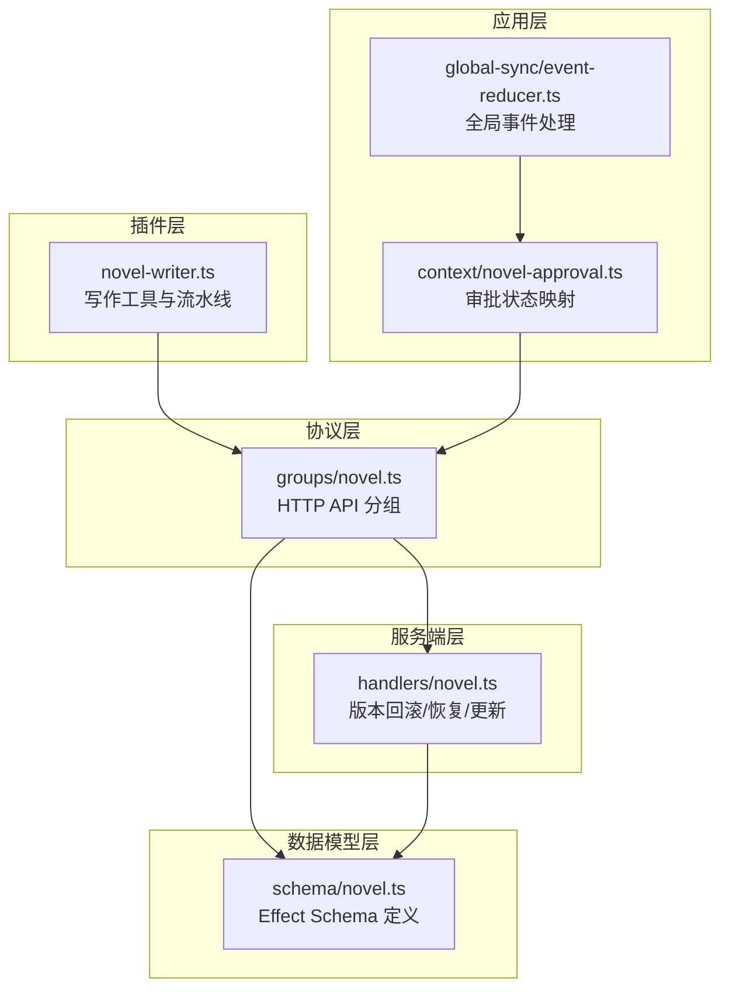
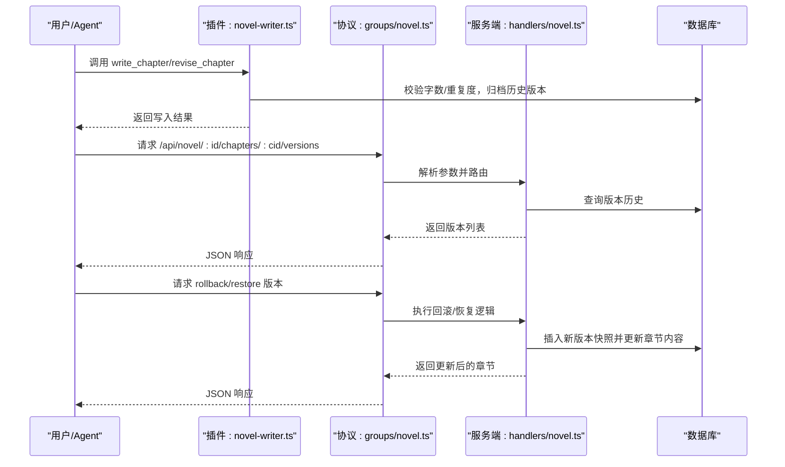
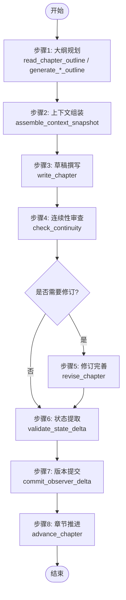
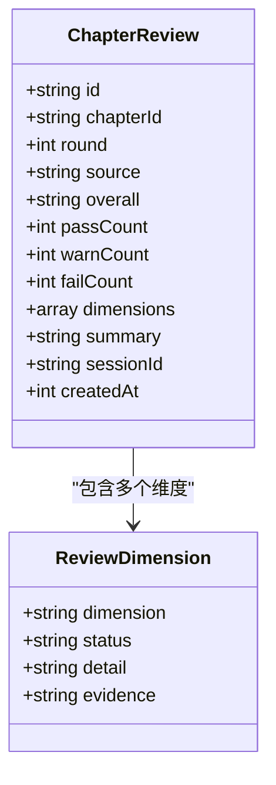
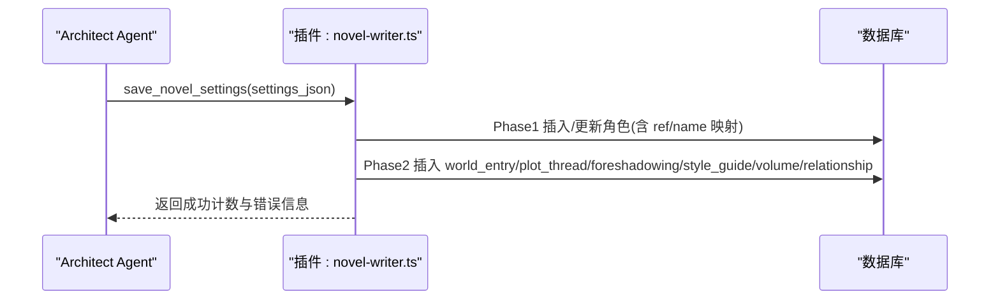
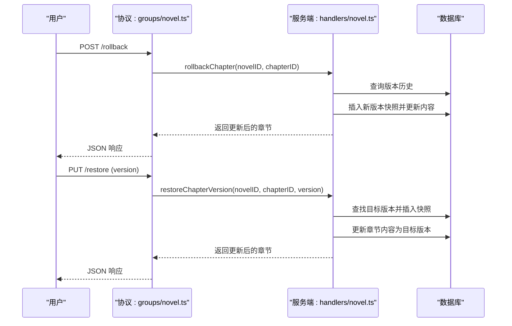
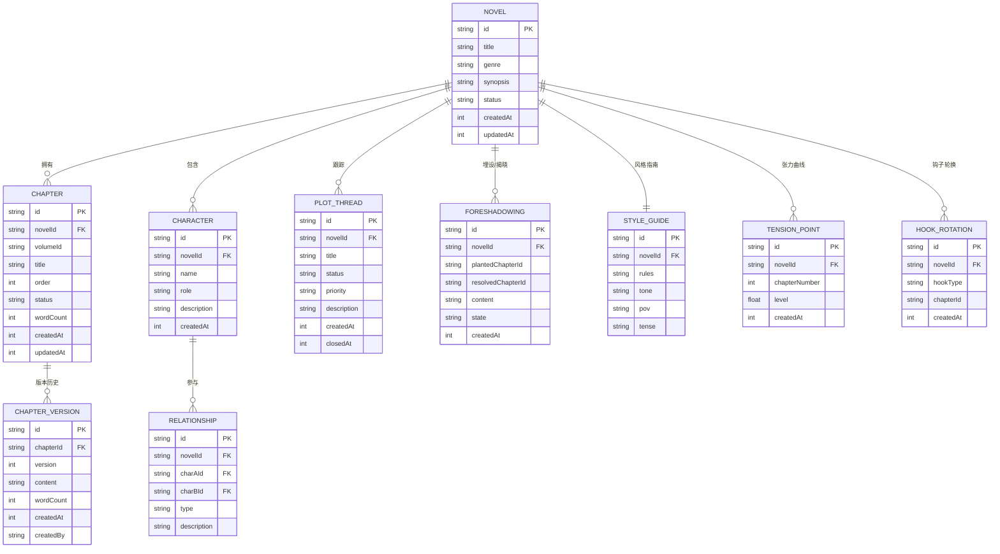
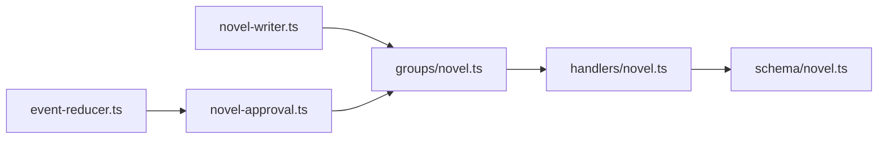

# 核心功能模块

<cite>
**本文引用的文件**   
- [packages/plugin/src/novel-writer.ts](file://packages/plugin/src/novel-writer.ts)
- [packages/schema/src/novel.ts](file://packages/schema/src/novel.ts)
- [packages/protocol/src/groups/novel.ts](file://packages/protocol/src/groups/novel.ts)
- [packages/server/src/handlers/novel.ts](file://packages/server/src/handlers/novel.ts)
- [packages/app/src/context/novel-approval.ts](file://packages/app/src/context/novel-approval.ts)
- [packages/app/src/context/global-sync/event-reducer.ts](file://packages/app/src/context/global-sync/event-reducer.ts)
- [packages/app/e2e/utils/visual-stability/analyzer.ts](file://packages/app/e2e/utils/visual-stability/analyzer.ts)
- [packages/app/e2e/utils/visual-stability/invariant.ts](file://packages/app/e2e/utils/visual-stability/invariant.ts)
- [packages/plugin/test/novel-writer/e2e.test.ts](file://packages/plugin/test/novel-writer/e2e.test.ts)
- [packages/plugin/test/novel-writer/scale.test.ts](file://packages/plugin/test/novel-writer/scale.test.ts)
</cite>

## 目录
1. [简介](#简介)
2. [项目结构](#项目结构)
3. [核心组件](#核心组件)
4. [架构总览](#架构总览)
5. [详细组件分析](#详细组件分析)
6. [依赖关系分析](#依赖关系分析)
7. [性能考量](#性能考量)
8. [故障排查指南](#故障排查指南)
9. [结论](#结论)
10. [附录](#附录)

## 简介
本文件面向 openNovel 的核心功能模块，系统性阐述“8步写作流水线”与“37维度连续性审查系统”，并覆盖智能书架管理、角色与情节管理系统、版本控制与审批流程的实现细节。文档同时提供配置选项、使用模式、最佳实践、代码级示例路径与各模块协作关系的数据流转说明，帮助读者从高层到代码层全面理解系统。

## 项目结构
openNovel 的写作能力由插件（novel-writer）、协议（protocol）、数据模型（schema）、服务端处理器（server handlers）以及前端上下文（app context）共同构成：
- 插件层：暴露写作工具（如生成大纲、组装上下文、撰写/修订章节、连续性检查、状态提交、推进章节等），驱动 Agent 工作流。
- 协议层：定义 HTTP API 分组与端点，统一输入输出 Schema。
- 数据模型层：以 Effect Schema 描述小说、卷、章节、角色、剧情线索、伏笔、风格指南、张力曲线等实体。
- 服务端层：实现版本回滚、恢复指定版本、内容更新等持久化逻辑。
- 应用层：提供审批状态映射、活动检测、事件同步等 UI 相关能力。

图表来源
- [packages/plugin/src/novel-writer.ts](file://packages/plugin/src/novel-writer.ts)
- [packages/protocol/src/groups/novel.ts](file://packages/protocol/src/groups/novel.ts)
- [packages/schema/src/novel.ts](file://packages/schema/src/novel.ts)
- [packages/server/src/handlers/novel.ts](file://packages/server/src/handlers/novel.ts)
- [packages/app/src/context/novel-approval.ts](file://packages/app/src/context/novel-approval.ts)
- [packages/app/src/context/global-sync/event-reducer.ts](file://packages/app/src/context/global-sync/event-reducer.ts)

章节来源
- [packages/plugin/src/novel-writer.ts](file://packages/plugin/src/novel-writer.ts)
- [packages/protocol/src/groups/novel.ts](file://packages/protocol/src/groups/novel.ts)
- [packages/schema/src/novel.ts](file://packages/schema/src/novel.ts)
- [packages/server/src/handlers/novel.ts](file://packages/server/src/handlers/novel.ts)
- [packages/app/src/context/novel-approval.ts](file://packages/app/src/context/novel-approval.ts)
- [packages/app/src/context/global-sync/event-reducer.ts](file://packages/app/src/context/global-sync/event-reducer.ts)

## 核心组件
- 8步写作流水线
  - 步骤1 大纲规划：读取/生成整体、卷、章节大纲（read_chapter_outline/generate_*_outline）。
  - 步骤2 上下文组装：assemble_context_snapshot 聚合蓝图、活跃角色、最近摘要、线索、伏笔、风格指南等。
  - 步骤3 草稿撰写：write_chapter 写入正文，执行字数、重复度校验，归档历史版本。
  - 步骤4 连续性审查：check_continuity 执行37维确定性检查，自动落库评审记录。
  - 步骤5 修订完善：revise_chapter 修订正文，再次进行字数与重复度校验，归档新版本。
  - 步骤6 状态提取：validate_state_delta 验证当前章节是否有待提交的状态变更。
  - 步骤7 版本提交：commit_observer_delta 提交 observer/reflector 校验后的 delta，持久化日志与物化视图。
  - 步骤8 章节推进：advance_chapter 返回下一章序号，完成一轮流水线。
- 37维度连续性审查系统：通过 check_continuity 与 submit_chapter_review 将各维度结果结构化持久化，支持 PASS/WARN/FAIL 三态与证据引用。
- 智能书架管理：通过 save_novel_settings/list_settings/delete_setting/update_setting 批量维护世界观、角色、剧情线索、伏笔、风格指南、卷、关系等设定。
- 版本控制与审批流程：write_chapter/revise_chapter 自动归档版本；rollbackChapter/restoreChapterVersion 支持回滚与恢复到指定版本；useChapterApprovalState 映射章节状态到审批状态。

章节来源
- [packages/plugin/src/novel-writer.ts](file://packages/plugin/src/novel-writer.ts)
- [packages/schema/src/novel.ts](file://packages/schema/src/novel.ts)
- [packages/server/src/handlers/novel.ts](file://packages/server/src/handlers/novel.ts)
- [packages/app/src/context/novel-approval.ts](file://packages/app/src/context/novel-approval.ts)

## 架构总览
下图展示从用户/Agent 调用到数据库落库的关键交互路径，包括写作工具、协议端点与服务端处理器之间的协作。

图表来源
- [packages/plugin/src/novel-writer.ts](file://packages/plugin/src/novel-writer.ts)
- [packages/protocol/src/groups/novel.ts](file://packages/protocol/src/groups/novel.ts)
- [packages/server/src/handlers/novel.ts](file://packages/server/src/handlers/novel.ts)

## 详细组件分析

### 8步写作流水线
- 步骤1 大纲规划
  - read_chapter_outline：按章节序号读取元信息（标题、字数、状态）。
  - generate_master_outline/volume/chapter：生成或更新大纲 Markdown 与数据库记录。
- 步骤2 上下文组装
  - assemble_context_snapshot：聚合蓝图、活跃角色、最近章节摘要、剧情线索、伏笔、风格指南、目标字数、上一章结尾原文、钩子轮换统计等。
- 步骤3 草稿撰写
  - write_chapter：校验待写内容是否满足字数区间与重复度阈值；若已有正文则归档为历史版本；扫描引用并更新章节内容与状态。
- 步骤4 连续性审查
  - check_continuity：执行37维确定性检查，自动创建评审记录（source=deterministic），汇总 PASS/WARN/FAIL 计数与失败维度详情。
- 步骤5 修订完善
  - revise_chapter：对已存在正文的章节进行修订，同样执行字数与重复度校验，归档新版本并更新状态。
- 步骤6 状态提取
  - validate_state_delta：判断当前章节是否存在有效的状态变更需要提交。
- 步骤7 版本提交
  - commit_observer_delta：接收经 reflector 校验的 delta JSON，解析后调用 commitState 写入日志与物化视图。
- 步骤8 章节推进
  - advance_chapter：计算并返回下一章序号，完成本轮流水线。

图表来源
- [packages/plugin/src/novel-writer.ts](file://packages/plugin/src/novel-writer.ts)

章节来源
- [packages/plugin/src/novel-writer.ts](file://packages/plugin/src/novel-writer.ts)

### 37维度连续性审查系统
- 触发方式：check_continuity 工具在步骤4执行，submit_chapter_review 用于 auditor 深度审计后提交结构化结果。
- 维度清单：submit_chapter_review 会校验传入的 dimension 名称是否在 CONTINUITY_DIMENSIONS 中，确保一致性。
- 结果持久化：评审记录包含总体评估、各维度状态（PASS/WARN/FAIL）、具体说明与可选证据，便于人工审批查阅。
- 自动化评审：deterministic 检查自动落库，auditor 审计需显式提交，human 审批可通过 API 提交。

图表来源
- [packages/schema/src/novel.ts](file://packages/schema/src/novel.ts)
- [packages/plugin/src/novel-writer.ts](file://packages/plugin/src/novel-writer.ts)

章节来源
- [packages/plugin/src/novel-writer.ts](file://packages/plugin/src/novel-writer.ts)
- [packages/schema/src/novel.ts](file://packages/schema/src/novel.ts)

### 智能书架管理（角色与情节系统）
- 角色管理：manage_characters 支持新增/更新角色，合并重复角色，保护描述长度避免信息丢失，并扫描引用与级联任务。
- 设定批量保存：save_novel_settings 支持 character/world_entry/plot_thread/foreshadowing/style_guide/volume/relationship 类型批量写入，先插入角色再处理关系，确保引用解析正确。
- 设定查询与删除：list_settings 列出各类实体，delete_setting 安全删除并提示影响范围。
- 设定更新：update_setting 支持多类型字段更新，如 plot_thread 关闭时记录时间、foreshadowing 状态流转等。

图表来源
- [packages/plugin/src/novel-writer.ts](file://packages/plugin/src/novel-writer.ts)

章节来源
- [packages/plugin/src/novel-writer.ts](file://packages/plugin/src/novel-writer.ts)

### 版本控制与审批流程
- 版本归档：write_chapter/revise_chapter 在覆盖正文前归档旧版本，记录版本号、字数、创建者。
- 回滚与恢复：rollbackChapter 回滚到上一版本；restoreChapterVersion 恢复到指定版本，均插入新的版本快照。
- 审批状态映射：useChapterApprovalState 将章节状态映射为 none/pending/settled/unknown，便于 UI 显示与计数。
- 全局事件同步：event-reducer 处理 vcs.branch.updated 等事件，保持 VCS 分支状态一致。

图表来源
- [packages/protocol/src/groups/novel.ts](file://packages/protocol/src/groups/novel.ts)
- [packages/server/src/handlers/novel.ts](file://packages/server/src/handlers/novel.ts)

章节来源
- [packages/server/src/handlers/novel.ts](file://packages/server/src/handlers/novel.ts)
- [packages/app/src/context/novel-approval.ts](file://packages/app/src/context/novel-approval.ts)
- [packages/app/src/context/global-sync/event-reducer.ts](file://packages/app/src/context/global-sync/event-reducer.ts)

### 数据模型与接口契约
- 数据模型：schema/novel.ts 定义了 Novel、Volume、Chapter、ChapterVersion、Character、Relationship、PlotThread、Foreshadowing、StyleGuide、TensionPoint、HookRotation、OutlineNode/Bundle 等类型，确保前后端一致。
- 接口契约：protocol/groups/novel.ts 定义了完整的 HTTP API 分组与端点，包括章节、版本、评审、角色、关系、世界条目、张力曲线、搜索、导出、大纲等。

图表来源
- [packages/schema/src/novel.ts](file://packages/schema/src/novel.ts)

章节来源
- [packages/schema/src/novel.ts](file://packages/schema/src/novel.ts)
- [packages/protocol/src/groups/novel.ts](file://packages/protocol/src/groups/novel.ts)

## 依赖关系分析
- 插件与协议：novel-writer.ts 暴露的工具被上层 Agent 调用，协议层提供统一的 HTTP API 入口。
- 协议与服务端：groups/novel.ts 定义的端点由 handlers/novel.ts 实现，负责数据持久化与业务逻辑。
- 数据模型：schema/novel.ts 贯穿协议与服务端，保证输入输出的一致性。
- 应用层：novel-approval.ts 与 event-reducer.ts 提供 UI 状态映射与全局事件处理，增强用户体验与一致性。

图表来源
- [packages/plugin/src/novel-writer.ts](file://packages/plugin/src/novel-writer.ts)
- [packages/protocol/src/groups/novel.ts](file://packages/protocol/src/groups/novel.ts)
- [packages/server/src/handlers/novel.ts](file://packages/server/src/handlers/novel.ts)
- [packages/schema/src/novel.ts](file://packages/schema/src/novel.ts)
- [packages/app/src/context/novel-approval.ts](file://packages/app/src/context/novel-approval.ts)
- [packages/app/src/context/global-sync/event-reducer.ts](file://packages/app/src/context/global-sync/event-reducer.ts)

章节来源
- [packages/plugin/src/novel-writer.ts](file://packages/plugin/src/novel-writer.ts)
- [packages/protocol/src/groups/novel.ts](file://packages/protocol/src/groups/novel.ts)
- [packages/server/src/handlers/novel.ts](file://packages/server/src/handlers/novel.ts)
- [packages/schema/src/novel.ts](file://packages/schema/src/novel.ts)
- [packages/app/src/context/novel-approval.ts](file://packages/app/src/context/novel-approval.ts)
- [packages/app/src/context/global-sync/event-reducer.ts](file://packages/app/src/context/global-sync/event-reducer.ts)

## 性能考量
- Token 估算与规模测试：scale.test.ts 展示了 ContextPacket 各层 token 估算与卷汇总触发策略，有助于控制上下文大小与审计频率。
- 视觉稳定性分析：analyzer.ts 与 invariant.ts 提供了 UI 稳定性检测规则，可用于评估界面渲染性能与一致性。
- 建议
  - 合理设置每章目标字数与上限，避免过大上下文导致 LLM 成本上升。
  - 使用 assemble_context_snapshot 限制最近章节摘要数量，控制注入长度。
  - 审计触发策略按章节数阈值（如每50章）触发卷汇总，平衡准确性与性能。

章节来源
- [packages/plugin/test/novel-writer/scale.test.ts](file://packages/plugin/test/novel-writer/scale.test.ts)
- [packages/app/e2e/utils/visual-stability/analyzer.ts](file://packages/app/e2e/utils/visual-stability/analyzer.ts)
- [packages/app/e2e/utils/visual-stability/invariant.ts](file://packages/app/e2e/utils/visual-stability/invariant.ts)

## 故障排查指南
- 常见错误
  - 字数不达标/超限：write_chapter/revise_chapter 会拒绝低于目标或超过130%的内容，需调整正文后再提交。
  - 与前文重复：检测到开头或段落重复率过高时拒绝写入，需重写重复部分。
  - 门禁拦截：当存在 pending 统改任务时，write_chapter/revise_chapter 会被拦截，需先处理 cascade_execute/cascade_list_pending。
  - 版本回滚无历史：rollbackChapter 在无版本历史时抛出 ChapterNotFoundError。
- 调试建议
  - 使用 list_chapter_reviews 查看历史评审记录，定位 FAIL 维度与证据。
  - 使用 search_chapters 全文检索确认事件/人物/设定出现位置。
  - 使用 delete_chapter 预览模式（confirm=false）了解级联清理影响范围。

章节来源
- [packages/plugin/src/novel-writer.ts](file://packages/plugin/src/novel-writer.ts)
- [packages/server/src/handlers/novel.ts](file://packages/server/src/handlers/novel.ts)

## 结论
openNovel 的核心功能模块通过插件化工具链实现了完整的8步写作流水线，结合37维度连续性审查与智能书架管理，构建了稳定、可追溯、可扩展的小说创作系统。版本控制与审批流程确保了内容质量与团队协作效率。通过清晰的协议与数据模型，系统具备良好的集成性与可维护性。

## 附录
- 使用模式与最佳实践
  - 先规划大纲（master/volume/chapter），再组装上下文，最后撰写/修订章节。
  - 每次撰写/修订后执行连续性审查，根据 FAIL/WARN 维度进行针对性修订。
  - 使用 save_novel_settings 批量维护设定，确保角色与关系引用一致。
  - 定期使用 list_chapter_reviews 与 search_chapters 进行回溯与查证。
- 集成指南
  - 通过 protocol/groups/novel.ts 提供的 API 进行后端集成。
  - 使用 schema/novel.ts 的类型定义确保前后端数据结构一致。
  - 在前端使用 novel-approval.ts 的审批状态映射与 usePendingApprovalCount 进行 UI 展示。

章节来源
- [packages/protocol/src/groups/novel.ts](file://packages/protocol/src/groups/novel.ts)
- [packages/schema/src/novel.ts](file://packages/schema/src/novel.ts)
- [packages/app/src/context/novel-approval.ts](file://packages/app/src/context/novel-approval.ts)