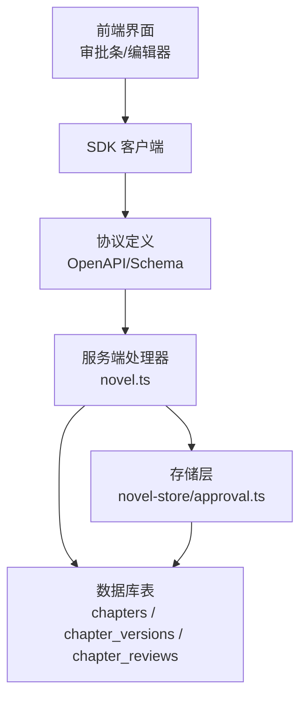
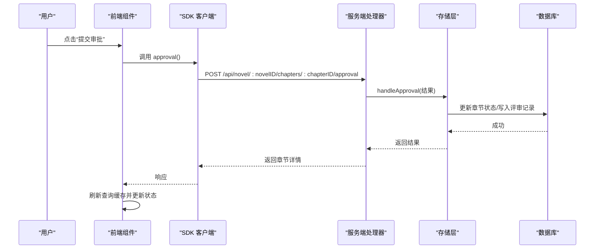
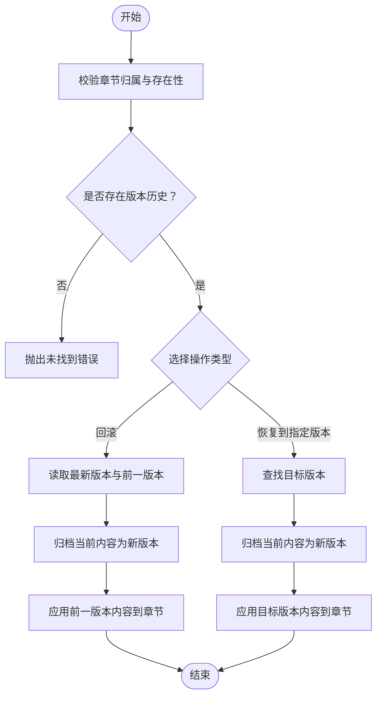
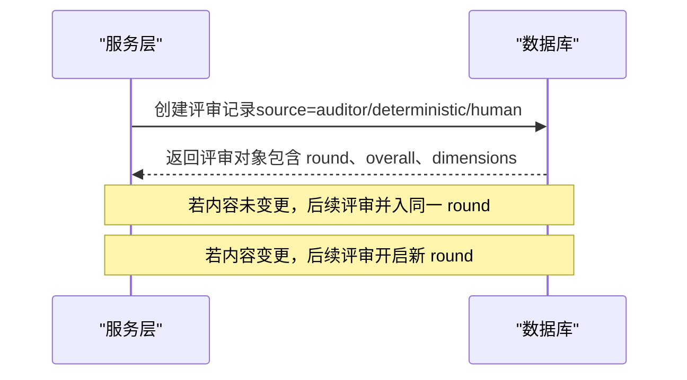
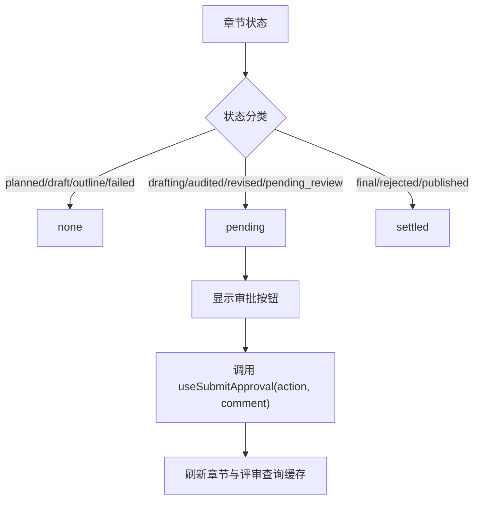
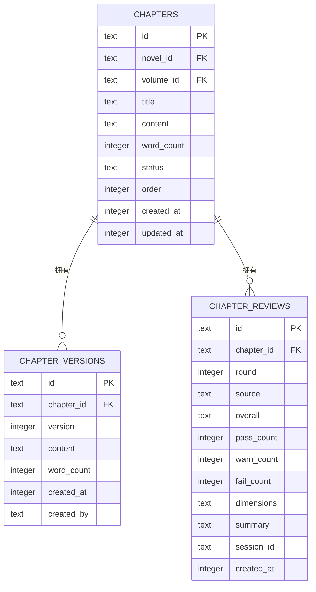
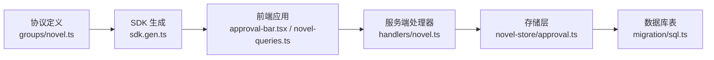

# 版本控制和审批流程

<cite>
**本文引用的文件**   
- [packages/server/src/handlers/novel.ts](file://packages/server/src/handlers/novel.ts)
- [packages/core/src/database/migration/20260721152252_novel_writing_tables.ts](file://packages/core/src/database/migration/20260721152252_novel_writing_tables.ts)
- [packages/core/src/session/sql.ts](file://packages/core/src/session/sql.ts)
- [packages/novel-store/src/approval.ts](file://packages/novel-store/src/approval.ts)
- [packages/plugin/src/novel-writer/approval-gate.ts](file://packages/plugin/src/novel-writer/approval-gate.ts)
- [packages/app/src/context/novel-approval.ts](file://packages/app/src/context/novel-approval.ts)
- [packages/app/src/pages/novel/approval-bar.tsx](file://packages/app/src/pages/novel/approval-bar.tsx)
- [packages/app/src/context/novel-queries.ts](file://packages/app/src/context/novel-queries.ts)
- [packages/protocol/src/groups/novel.ts](file://packages/protocol/src/groups/novel.ts)
- [packages/sdk/js/src/v2/gen/sdk.gen.ts](file://packages/sdk/js/src/v2/gen/sdk.gen.ts)
- [packages/server/test/novel.test.ts](file://packages/server/test/novel.test.ts)
- [packages/server/test/novel-e2e.test.ts](file://packages/server/test/novel-e2e.test.ts)
</cite>

## 目录
1. [简介](#简介)
2. [项目结构](#项目结构)
3. [核心组件](#核心组件)
4. [架构总览](#架构总览)
5. [详细组件分析](#详细组件分析)
6. [依赖关系分析](#依赖关系分析)
7. [性能考量](#性能考量)
8. [故障排查指南](#故障排查指南)
9. [结论](#结论)
10. [附录：API 接口文档](#附录api-接口文档)

## 简介
本文件面向 openNovel 的版本控制与审批流程系统，聚焦章节版本历史、差异对比与回滚能力；阐述审批人设置、审批规则与流转条件；说明版本状态转换逻辑与权限控制；并给出合并冲突解决、分支管理与协作编辑支持的建议。文档同时提供审批工作流配置示例与 API 接口说明，帮助读者快速理解并正确使用该系统。

## 项目结构
openNovel 的版本与审批相关代码分布在服务端处理器、存储层、协议定义、前端上下文与页面组件以及 SDK 生成代码中。整体采用分层设计：
- 协议与 SDK：定义 HTTP 接口契约与客户端调用方法
- 服务端处理器：实现版本归档、回滚、恢复、审批提交等核心逻辑
- 存储层（novel-store）：封装数据库访问与审批门（人工审核）
- 前端应用：展示审批状态、触发审批动作、刷新查询缓存
- 数据库迁移与表结构：定义章节、版本、评审等数据模型与索引



图表来源
- [packages/app/src/pages/novel/approval-bar.tsx:243-286](file://packages/app/src/pages/novel/approval-bar.tsx#L243-L286)
- [packages/app/src/context/novel-queries.ts:404-432](file://packages/app/src/context/novel-queries.ts#L404-L432)
- [packages/protocol/src/groups/novel.ts:234-273](file://packages/protocol/src/groups/novel.ts#L234-L273)
- [packages/server/src/handlers/novel.ts:1-200](file://packages/server/src/handlers/novel.ts#L1-L200)
- [packages/novel-store/src/approval.ts:1-149](file://packages/novel-store/src/approval.ts#L1-L149)
- [packages/core/src/database/migration/20260721152252_novel_writing_tables.ts:1-63](file://packages/core/src/database/migration/20260721152252_novel_writing_tables.ts#L1-L63)

章节来源
- [packages/server/src/handlers/novel.ts:1-200](file://packages/server/src/handlers/novel.ts#L1-L200)
- [packages/core/src/database/migration/20260721152252_novel_writing_tables.ts:1-63](file://packages/core/src/database/migration/20260721152252_novel_writing_tables.ts#L1-L63)

## 核心组件
- 版本归档与回滚
  - 更新内容时自动归档旧版本到 chapter_versions
  - 支持“回滚”到上一版本或“恢复到指定版本”，并记录操作来源（rollback/restore）
- 审批门（人工审核）
  - requestApproval：保存写手生成的内容并标记为待审
  - handleApproval：根据结果路由到通过/驳回/编辑三种分支
- 评审记录
  - 支持确定性检查、审计员复审与人工评论，按轮次（round）组织
- 前端审批状态映射
  - 将章节状态映射为 none/pending/settled/unknown 以驱动 UI 行为

章节来源
- [packages/server/src/handlers/novel.ts:522-570](file://packages/server/src/handlers/novel.ts#L522-L570)
- [packages/server/src/handlers/novel.ts:800-840](file://packages/server/src/handlers/novel.ts#L800-L840)
- [packages/novel-store/src/approval.ts:1-149](file://packages/novel-store/src/approval.ts#L1-L149)
- [packages/plugin/src/novel-writer/approval-gate.ts:1-3](file://packages/plugin/src/novel-writer/approval-gate.ts#L1-L3)
- [packages/app/src/context/novel-approval.ts:1-46](file://packages/app/src/context/novel-approval.ts#L1-L46)

## 架构总览
版本与审批的端到端流程如下：
- 前端发起更新/审批请求
- 服务端处理器校验参数与权限，执行版本归档或状态变更
- 存储层完成数据持久化与审批门处理
- 前端刷新查询缓存并更新 UI



图表来源
- [packages/app/src/pages/novel/approval-bar.tsx:243-286](file://packages/app/src/pages/novel/approval-bar.tsx#L243-L286)
- [packages/app/src/context/novel-queries.ts:404-432](file://packages/app/src/context/novel-queries.ts#L404-L432)
- [packages/protocol/src/groups/novel.ts:234-273](file://packages/protocol/src/groups/novel.ts#L234-L273)
- [packages/server/src/handlers/novel.ts:1-200](file://packages/server/src/handlers/novel.ts#L1-L200)
- [packages/novel-store/src/approval.ts:1-149](file://packages/novel-store/src/approval.ts#L1-L149)

## 详细组件分析

### 版本历史与回滚
- 版本归档
  - 更新章节内容时，系统会将当前内容归档为新版本记录，并递增版本号
- 回滚
  - 将章节恢复到上一个版本，并在版本表中追加一条“rollback”来源的记录
- 恢复到指定版本
  - 查找目标版本，先归档当前内容，再覆盖章节内容为指定版本，并记录“restore”来源



图表来源
- [packages/server/src/handlers/novel.ts:522-570](file://packages/server/src/handlers/novel.ts#L522-L570)
- [packages/server/src/handlers/novel.ts:800-840](file://packages/server/src/handlers/novel.ts#L800-L840)

章节来源
- [packages/server/src/handlers/novel.ts:522-570](file://packages/server/src/handlers/novel.ts#L522-L570)
- [packages/server/src/handlers/novel.ts:800-840](file://packages/server/src/handlers/novel.ts#L800-L840)
- [packages/server/test/novel.test.ts:199-227](file://packages/server/test/novel.test.ts#L199-L227)

### 审批门与人工审核
- 请求审批
  - 保存写手生成的内容，并将章节状态设置为 pending_review
- 处理审批结果
  - APPROVE：状态变更为 final
  - REJECT：状态变更为 rejected，并附带原因
  - EDIT：返回当前内容供人工编辑

```mermaid
classDiagram
class ApprovalGate {
+requestApproval(chapterId, content, directory) ApprovalRequest
+handleApproval(chapterId, result, directory) ApprovalHandleResult
}
class ApprovalRequest {
+chapterId string
+novelId string
+title string
+content string
+wordCount number
+status string
+order number
}
class ApprovalHandleResult {
<<union>>
+APPROVED{chapterId, title}
+REJECTED{chapterId, title, reason}
+EDITING{chapterId, title, content}
}
ApprovalGate --> ApprovalRequest : "返回"
ApprovalGate --> ApprovalHandleResult : "返回"
```

图表来源
- [packages/novel-store/src/approval.ts:1-149](file://packages/novel-store/src/approval.ts#L1-L149)
- [packages/plugin/src/novel-writer/approval-gate.ts:1-3](file://packages/plugin/src/novel-writer/approval-gate.ts#L1-L3)

章节来源
- [packages/novel-store/src/approval.ts:1-149](file://packages/novel-store/src/approval.ts#L1-L149)
- [packages/plugin/src/novel-writer/approval-gate.ts:1-3](file://packages/plugin/src/novel-writer/approval-gate.ts#L1-L3)

### 评审记录与轮次管理
- 评审来源
  - deterministic（确定性检查）、auditor（审计员）、human（人工）
- 轮次（round）
  - 同一内容多次评审并入同一轮；内容变更后再次评审开启新轮次
- 维度统计
  - PASS/WARN/FAIL 计数与维度明细（含证据）



图表来源
- [packages/server/src/handlers/novel.ts:139-159](file://packages/server/src/handlers/novel.ts#L139-L159)
- [packages/server/test/novel.test.ts:229-266](file://packages/server/test/novel.test.ts#L229-L266)
- [packages/server/test/novel.test.ts:268-308](file://packages/server/test/novel.test.ts#L268-L308)

章节来源
- [packages/server/src/handlers/novel.ts:139-159](file://packages/server/src/handlers/novel.ts#L139-L159)
- [packages/server/test/novel.test.ts:229-266](file://packages/server/test/novel.test.ts#L229-L266)
- [packages/server/test/novel.test.ts:268-308](file://packages/server/test/novel.test.ts#L268-L308)

### 前端审批状态映射与交互
- 状态映射
  - planned/draft/outline/failed → none
  - drafting/audited/revised/pending_review → pending
  - final/rejected/published → settled
- 交互流程
  - 用户点击“批准/拒绝”后，调用 useSubmitApproval mutation，成功后刷新章节与评审列表



图表来源
- [packages/app/src/context/novel-approval.ts:1-46](file://packages/app/src/context/novel-approval.ts#L1-L46)
- [packages/app/src/pages/novel/approval-bar.tsx:243-286](file://packages/app/src/pages/novel/approval-bar.tsx#L243-L286)
- [packages/app/src/context/novel-queries.ts:404-432](file://packages/app/src/context/novel-queries.ts#L404-L432)

章节来源
- [packages/app/src/context/novel-approval.ts:1-46](file://packages/app/src/context/novel-approval.ts#L1-L46)
- [packages/app/src/pages/novel/approval-bar.tsx:243-286](file://packages/app/src/pages/novel/approval-bar.tsx#L243-L286)
- [packages/app/src/context/novel-queries.ts:404-432](file://packages/app/src/context/novel-queries.ts#L404-L432)

### 数据库模型与索引
- 章节表（chapters）
  - 字段包括 id、novel_id、volume_id、title、content、word_count、status、order、created_at、updated_at
- 版本表（chapter_versions）
  - 字段包括 id、chapter_id、version、content、word_count、created_at、created_by
- 评审表（chapter_reviews）
  - 字段包括 id、chapter_id、round、source、overall、pass_count、warn_count、fail_count、dimensions、summary、session_id、created_at
- 索引
  - chapter_versions_chapter_id_idx、chapter_versions_chapter_version_idx 等



图表来源
- [packages/core/src/database/migration/20260721152252_novel_writing_tables.ts:1-63](file://packages/core/src/database/migration/20260721152252_novel_writing_tables.ts#L1-L63)
- [packages/core/src/session/sql.ts:250-288](file://packages/core/src/session/sql.ts#L250-L288)

章节来源
- [packages/core/src/database/migration/20260721152252_novel_writing_tables.ts:1-63](file://packages/core/src/database/migration/20260721152252_novel_writing_tables.ts#L1-L63)
- [packages/core/src/session/sql.ts:250-288](file://packages/core/src/session/sql.ts#L250-L288)

## 依赖关系分析
- 协议与 SDK
  - protocol 定义 OpenAPI Schema，sdk 生成客户端方法
- 服务端处理器
  - 依赖 novel-store 的数据访问与审批门
  - 使用 Effect 进行异步编排与错误处理
- 存储层
  - 直接操作 Drizzle ORM 表定义与迁移脚本
- 前端
  - 使用 SDK 调用服务端接口，并通过 React Query 管理缓存



图表来源
- [packages/protocol/src/groups/novel.ts:234-273](file://packages/protocol/src/groups/novel.ts#L234-L273)
- [packages/sdk/js/src/v2/gen/sdk.gen.ts:7752-7792](file://packages/sdk/js/src/v2/gen/sdk.gen.ts#L7752-L7792)
- [packages/app/src/pages/novel/approval-bar.tsx:243-286](file://packages/app/src/pages/novel/approval-bar.tsx#L243-L286)
- [packages/app/src/context/novel-queries.ts:404-432](file://packages/app/src/context/novel-queries.ts#L404-L432)
- [packages/server/src/handlers/novel.ts:1-200](file://packages/server/src/handlers/novel.ts#L1-L200)
- [packages/novel-store/src/approval.ts:1-149](file://packages/novel-store/src/approval.ts#L1-L149)
- [packages/core/src/database/migration/20260721152252_novel_writing_tables.ts:1-63](file://packages/core/src/database/migration/20260721152252_novel_writing_tables.ts#L1-L63)

章节来源
- [packages/protocol/src/groups/novel.ts:234-273](file://packages/protocol/src/groups/novel.ts#L234-L273)
- [packages/sdk/js/src/v2/gen/sdk.gen.ts:7752-7792](file://packages/sdk/js/src/v2/gen/sdk.gen.ts#L7752-L7792)
- [packages/server/src/handlers/novel.ts:1-200](file://packages/server/src/handlers/novel.ts#L1-L200)
- [packages/novel-store/src/approval.ts:1-149](file://packages/novel-store/src/approval.ts#L1-L149)

## 性能考量
- 版本表索引
  - chapter_versions_chapter_id_idx 与 chapter_versions_chapter_version_idx 提升按章节与版本查询效率
- 批量操作
  - 归档与恢复操作在事务内执行，减少锁竞争
- 前端缓存
  - 使用 React Query 失效特定查询键，避免全量刷新

[本节为通用指导，不直接分析具体文件]

## 故障排查指南
- 常见错误
  - 章节不存在：ChapterNotFoundError
  - 无版本历史：回滚时报错
  - 未知章节：评审列表查询时报错
- 定位建议
  - 检查章节归属与 ID 是否正确
  - 确认版本历史是否存在
  - 查看评审记录的 round 与 source 是否符合预期

章节来源
- [packages/server/test/novel.test.ts:229-266](file://packages/server/test/novel.test.ts#L229-L266)
- [packages/server/test/novel.test.ts:268-308](file://packages/server/test/novel.test.ts#L268-L308)
- [packages/server/test/novel-e2e.test.ts:182-204](file://packages/server/test/novel-e2e.test.ts#L182-L204)

## 结论
openNovel 的版本控制与审批流程通过清晰的分层设计与完善的数据库模型，实现了可靠的版本归档、回滚与恢复能力，以及灵活的审批门与评审记录机制。前端状态映射与缓存策略提升了用户体验。建议在团队协作中结合分支管理与合并冲突解决策略，确保多人协作时的数据一致性与可追溯性。

[本节为总结性内容，不直接分析具体文件]

## 附录：API 接口文档
- 更新章节内容
  - 路径：PUT /api/novel/:novelID/chapters/:chapterID/content
  - 功能：替换章节内容，自动归档旧版本
  - 成功返回：Chapter
  - 错误：ChapterNotFoundError
- 回滚章节
  - 路径：POST /api/novel/:novelID/chapters/:chapterID/rollback
  - 功能：回滚到上一版本
  - 成功返回：Chapter
  - 错误：ChapterNotFoundError
- 审批章节
  - 路径：POST /api/novel/:novelID/chapters/:chapterID/approval
  - 功能：提交审批决定（approve/reject），支持评论
  - 成功返回：Chapter
  - 错误：ChapterNotFoundError

章节来源
- [packages/protocol/src/groups/novel.ts:234-273](file://packages/protocol/src/groups/novel.ts#L234-L273)
- [packages/sdk/js/src/v2/gen/sdk.gen.ts:7752-7792](file://packages/sdk/js/src/v2/gen/sdk.gen.ts#L7752-L7792)
- [packages/server/test/novel-e2e.test.ts:182-204](file://packages/server/test/novel-e2e.test.ts#L182-L204)