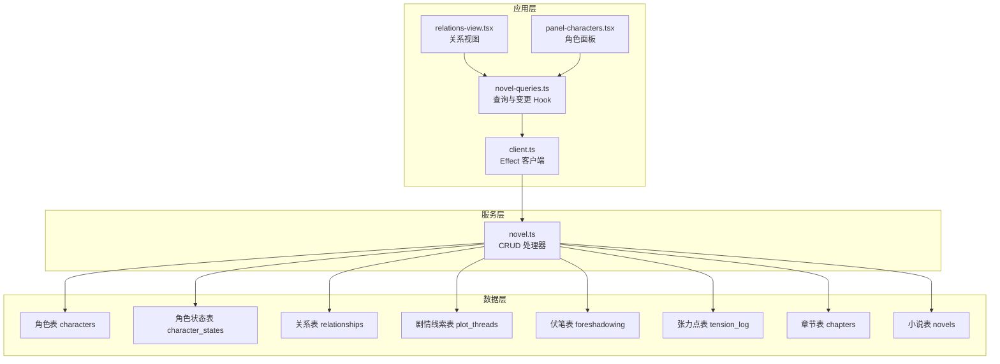
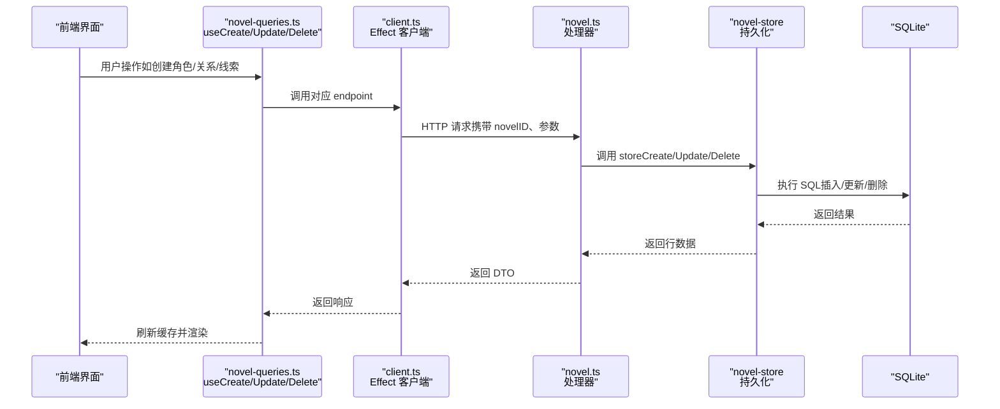
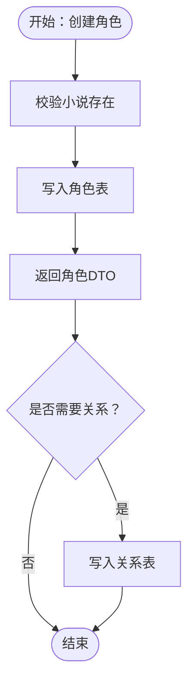
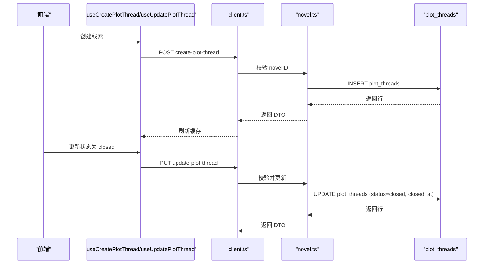
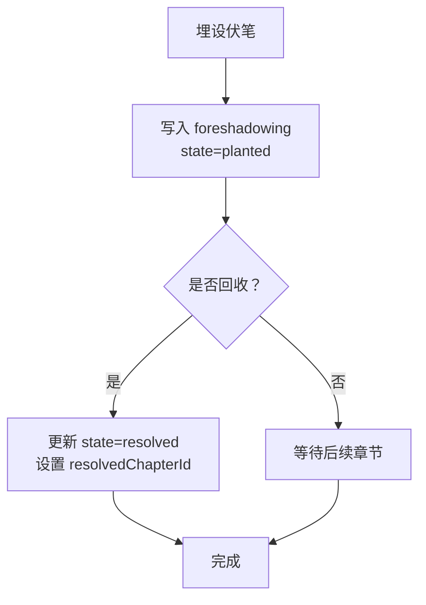
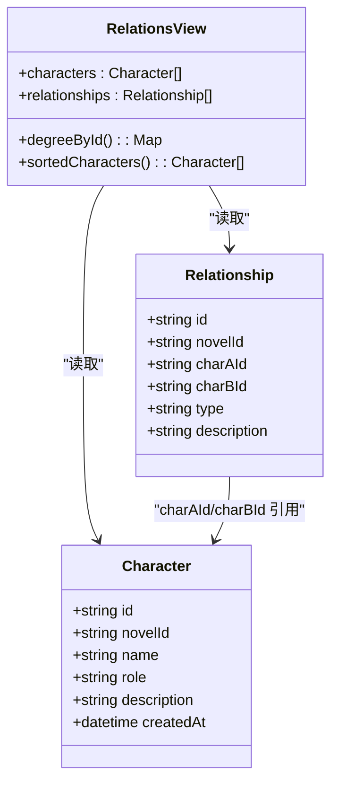
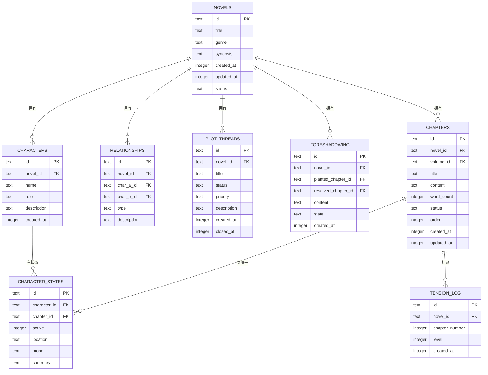

# 角色和情节管理系统

<cite>
**本文引用的文件**   
- [packages/core/src/session/sql.ts](file://packages/core/src/session/sql.ts)
- [packages/server/src/handlers/novel.ts](file://packages/server/src/handlers/novel.ts)
- [packages/app/src/pages/novel/relations-view.tsx](file://packages/app/src/pages/novel/relations-view.tsx)
- [packages/app/src/pages/novel/panel-characters.tsx](file://packages/app/src/pages/novel/panel-characters.tsx)
- [packages/app/src/context/novel-queries.ts](file://packages/app/src/context/novel-queries.ts)
- [packages/client/src/generated-effect/client.ts](file://packages/client/src/generated-effect/client.ts)
</cite>

## 目录
1. [简介](#简介)
2. [项目结构](#项目结构)
3. [核心组件](#核心组件)
4. [架构总览](#架构总览)
5. [详细组件分析](#详细组件分析)
6. [依赖关系分析](#依赖关系分析)
7. [性能考量](#性能考量)
8. [故障排查指南](#故障排查指南)
9. [结论](#结论)
10. [附录：数据模型与API示例](#附录数据模型与api示例)

## 简介
本文件为 openNovel 的“角色与情节管理系统”提供系统化文档，覆盖以下关键主题：
- 角色生命周期管理：创建、属性设置、关系定义、状态跟踪（按章节快照）
- 情节线索的创建、追踪与解决机制
- 伏笔系统与悬念管理机制
- 角色关系图谱的构建与维护
- 数据结构设计：角色状态表、关系表、情节线程表等
- 数据模型图与 API 使用示例（以路径引用代替代码片段）

## 项目结构
围绕角色与情节管理的核心实现分布在三层：
- 数据层（Drizzle ORM 表定义）：位于 core/session/sql.ts，定义了小说、卷、章节、角色、关系、剧情线索、伏笔、世界观、风格指南、张力点、摘要与日志等表结构。
- 服务层（HTTP 处理器）：位于 server/handlers/novel.ts，封装了各实体的 CRUD 接口逻辑、错误处理与 DTO 映射。
- 应用层（前端视图与查询）：位于 app 下的 relations-view.tsx、panel-characters.tsx、novel-queries.ts，以及 client 生成的 Effect 客户端调用。

**图表来源** 
- [packages/core/src/session/sql.ts](file://packages/core/src/session/sql.ts)
- [packages/server/src/handlers/novel.ts](file://packages/server/src/handlers/novel.ts)
- [packages/app/src/pages/novel/relations-view.tsx](file://packages/app/src/pages/novel/relations-view.tsx)
- [packages/app/src/pages/novel/panel-characters.tsx](file://packages/app/src/pages/novel/panel-characters.tsx)
- [packages/app/src/context/novel-queries.ts](file://packages/app/src/context/novel-queries.ts)
- [packages/client/src/generated-effect/client.ts](file://packages/client/src/generated-effect/client.ts)

**章节来源**
- [packages/core/src/session/sql.ts:182-491](file://packages/core/src/session/sql.ts#L182-L491)
- [packages/server/src/handlers/novel.ts:1-200](file://packages/server/src/handlers/novel.ts#L1-L200)

## 核心组件
- 角色实体与状态
  - 角色定义：id、所属小说、名称、角色定位、描述、创建时间
  - 角色状态快照：每章记录是否活跃、位置、情绪、摘要；用于跨章节追踪角色状态变化
- 角色关系
  - 关系表存储两个角色之间的类型与描述，支持按小说维度查询与排序
- 情节线索
  - 剧情线索表维护标题、状态（open/closed）、优先级、描述、创建与关闭时间
- 伏笔系统
  - 伏笔表记录埋设章节、回收章节、内容与当前状态（planted/resolved），支撑悬念闭环
- 张力点（悬念）
  - 张力点表记录章节序号与紧张等级，用于可视化叙事节奏

**章节来源**
- [packages/core/src/session/sql.ts:272-373](file://packages/core/src/session/sql.ts#L272-L373)
- [packages/server/src/handlers/novel.ts:220-251](file://packages/server/src/handlers/novel.ts#L220-L251)

## 架构总览
整体采用“前端 Hook + Effect 客户端 → 服务端处理器 → Drizzle ORM → SQLite”的分层架构。前端通过 use* Hooks 发起请求，服务端处理器校验并调用 store 层持久化，返回标准化 DTO 给前端渲染。

**图表来源** 
- [packages/app/src/context/novel-queries.ts](file://packages/app/src/context/novel-queries.ts)
- [packages/client/src/generated-effect/client.ts](file://packages/client/src/generated-effect/client.ts)
- [packages/server/src/handlers/novel.ts](file://packages/server/src/handlers/novel.ts)

## 详细组件分析

### 角色生命周期管理
- 创建角色
  - 前端通过 useCreateCharacter Hook 调用 create-character 端点
  - 服务端校验小说存在性后写入 CharacterTable，返回 toCharacter DTO
- 属性设置
  - 通过 update-character 端点更新 name/role/description
- 关系定义
  - 在 panel-characters.tsx 中，选择目标角色与关系类型，调用 createRelationship
  - 服务端写入 RelationshipTable，建立 charAId/charBId/type/description
- 状态跟踪
  - 每章通过 createCharacterState 写入 CharacterStateTable，包含 active/location/mood/summary
  - listCharacterStates/listAllCharacterStates 可按角色或整部小说聚合状态

**图表来源** 
- [packages/server/src/handlers/novel.ts:903-990](file://packages/server/src/handlers/novel.ts#L903-L990)
- [packages/app/src/pages/novel/panel-characters.tsx](file://packages/app/src/pages/novel/panel-characters.tsx)

**章节来源**
- [packages/server/src/handlers/novel.ts:903-990](file://packages/server/src/handlers/novel.ts#L903-L990)
- [packages/app/src/pages/novel/panel-characters.tsx:568-606](file://packages/app/src/pages/novel/panel-characters.tsx#L568-L606)

### 情节线索的创建、追踪与解决
- 创建线索
  - 通过 create-plot-thread 端点，填写 title/priority/description
- 追踪状态
  - listPlotThreads 返回所有线索，支持按 status/priority 筛选
- 解决线索
  - update-plot-thread 将状态改为 closed，并记录 closed_at

**图表来源** 
- [packages/server/src/handlers/novel.ts:645-690](file://packages/server/src/handlers/novel.ts#L645-L690)
- [packages/app/src/context/novel-queries.ts](file://packages/app/src/context/novel-queries.ts)

**章节来源**
- [packages/server/src/handlers/novel.ts:645-690](file://packages/server/src/handlers/novel.ts#L645-L690)

### 伏笔系统与悬念管理机制
- 伏笔埋设
  - create-foreshadowing：记录 content/plantedChapterId/state=planted
- 伏笔回收
  - update-foreshadowing：设置 state=resolved 并关联 resolvedChapterId
- 悬念（张力点）
  - create-tension/update-tension/delete-tension：按章节序号记录 level（0-10）
  - listTensionPoints：按 chapter_number 排序，用于绘制张力曲线

**图表来源** 
- [packages/core/src/session/sql.ts:356-373](file://packages/core/src/session/sql.ts#L356-L373)
- [packages/server/src/handlers/novel.ts:654-666](file://packages/server/src/handlers/novel.ts#L654-L666)

**章节来源**
- [packages/core/src/session/sql.ts:356-373](file://packages/core/src/session/sql.ts#L356-L373)
- [packages/server/src/handlers/novel.ts:654-666](file://packages/server/src/handlers/novel.ts#L654-L666)

### 角色关系图谱的构建与维护
- 关系数据源
  - relationships 表存储 charAId/charBId/type/description
- 前端计算度数
  - relations-view.tsx 遍历关系统计每个角色的直接关系数量 degreeById，用于排序与徽标显示
- 交互流程
  - panel-characters.tsx 提供添加关系的表单，提交后刷新列表

**图表来源** 
- [packages/core/src/session/sql.ts:312-334](file://packages/core/src/session/sql.ts#L312-L334)
- [packages/app/src/pages/novel/relations-view.tsx:365-397](file://packages/app/src/pages/novel/relations-view.tsx#L365-L397)

**章节来源**
- [packages/app/src/pages/novel/relations-view.tsx:365-397](file://packages/app/src/pages/novel/relations-view.tsx#L365-L397)
- [packages/app/src/pages/novel/panel-characters.tsx:568-606](file://packages/app/src/pages/novel/panel-characters.tsx#L568-L606)

## 依赖关系分析
- 模块耦合
  - 前端 Hook 依赖 client.ts 生成的 Effect 客户端方法名（如 create-character-state、update-plot-thread）
  - 服务端处理器依赖 Drizzle ORM 表定义与 store 层持久化函数
- 外部依赖
  - SQLite 作为数据存储后端
  - Effect 框架用于异步编排与错误传播

**图表来源** 
- [packages/client/src/generated-effect/client.ts](file://packages/client/src/generated-effect/client.ts)
- [packages/server/src/handlers/novel.ts](file://packages/server/src/handlers/novel.ts)
- [packages/core/src/session/sql.ts](file://packages/core/src/session/sql.ts)

**章节来源**
- [packages/client/src/generated-effect/client.ts:1469-1495](file://packages/client/src/generated-effect/client.ts#L1469-L1495)
- [packages/server/src/handlers/novel.ts:1-200](file://packages/server/src/handlers/novel.ts#L1-L200)

## 性能考量
- 索引优化
  - 关系表、线索表、伏笔表均对 novel_id、状态字段建立索引，提升过滤与聚合效率
- 快照策略
  - 角色状态按章节快照，避免全量历史扫描；可通过 chapter_id 快速定位
- 前端缓存
  - 使用 React Query 的 invalidateQueries 在变更后刷新相关缓存，减少重复请求
- 序列化开销
  - JSON 字段（如 key_events、char_changes）需合理控制大小，避免过大负载

[本节为通用指导，不直接分析具体文件]

## 故障排查指南
- 常见错误
  - NovelNotFoundError：小说不存在或未绑定会话
  - ChapterNotFoundError：章节不存在
  - NovelValidationError：类型字段非法（如 genre）
- 排查步骤
  - 检查 novelID 是否正确传递到服务端
  - 确认数据库连接与目录作用域（directory）一致
  - 查看服务端日志中的 Effect 错误堆栈

**章节来源**
- [packages/server/src/handlers/novel.ts:287-310](file://packages/server/src/handlers/novel.ts#L287-L310)

## 结论
openNovel 的角色与情节管理系统以清晰的表结构与分层架构为基础，实现了从角色创建、关系定义、状态快照到情节线索与伏笔的全链路管理。前端通过声明式 Hook 与服务端处理器协作，结合索引与缓存策略，保证了可扩展性与性能。建议在实际使用中遵循统一的命名规范与状态流转约定，确保数据一致性。

[本节为总结，不直接分析具体文件]

## 附录：数据模型与API示例

### 数据模型图

**图表来源** 
- [packages/core/src/session/sql.ts:182-491](file://packages/core/src/session/sql.ts#L182-L491)

### API 使用示例（路径引用）
- 创建角色
  - 前端 Hook：[packages/app/src/context/novel-queries.ts](file://packages/app/src/context/novel-queries.ts)
  - 客户端端点：create-character
  - 服务端处理器：[packages/server/src/handlers/novel.ts](file://packages/server/src/handlers/novel.ts)
- 更新角色属性
  - 前端 Hook：[packages/app/src/context/novel-queries.ts](file://packages/app/src/context/novel-queries.ts)
  - 客户端端点：update-character
  - 服务端处理器：[packages/server/src/handlers/novel.ts](file://packages/server/src/handlers/novel.ts)
- 删除角色
  - 前端 Hook：[packages/app/src/context/novel-queries.ts](file://packages/app/src/context/novel-queries.ts)
  - 客户端端点：delete-character
  - 服务端处理器：[packages/server/src/handlers/novel.ts](file://packages/server/src/handlers/novel.ts)
- 创建关系
  - 前端交互：[packages/app/src/pages/novel/panel-characters.tsx](file://packages/app/src/pages/novel/panel-characters.tsx)
  - 客户端端点：create-relationship
  - 服务端处理器：[packages/server/src/handlers/novel.ts](file://packages/server/src/handlers/novel.ts)
- 删除关系
  - 服务端处理器：[packages/server/src/handlers/novel.ts:903-911](file://packages/server/src/handlers/novel.ts#L903-L911)
- 创建角色状态
  - 服务端处理器：[packages/server/src/handlers/novel.ts:948-967](file://packages/server/src/handlers/novel.ts#L948-L967)
- 更新角色状态
  - 服务端处理器：[packages/server/src/handlers/novel.ts:969-990](file://packages/server/src/handlers/novel.ts#L969-L990)
- 列出角色状态
  - 服务端处理器：[packages/server/src/handlers/novel.ts:913-946](file://packages/server/src/handlers/novel.ts#L913-L946)
- 创建剧情线索
  - 客户端端点：create-plot-thread
  - 服务端处理器：[packages/server/src/handlers/novel.ts:645-652](file://packages/server/src/handlers/novel.ts#L645-L652)
- 更新剧情线索
  - 客户端端点：update-plot-thread
  - 服务端处理器：[packages/server/src/handlers/novel.ts:645-652](file://packages/server/src/handlers/novel.ts#L645-L652)
- 删除剧情线索
  - 客户端端点：delete-plot-thread
  - 服务端处理器：[packages/server/src/handlers/novel.ts:645-652](file://packages/server/src/handlers/novel.ts#L645-L652)
- 创建伏笔
  - 客户端端点：create-foreshadowing
  - 服务端处理器：[packages/server/src/handlers/novel.ts:654-666](file://packages/server/src/handlers/novel.ts#L654-L666)
- 更新伏笔
  - 客户端端点：update-foreshadowing
  - 服务端处理器：[packages/server/src/handlers/novel.ts:654-666](file://packages/server/src/handlers/novel.ts#L654-L666)
- 删除伏笔
  - 客户端端点：delete-foreshadowing
  - 服务端处理器：[packages/server/src/handlers/novel.ts:654-666](file://packages/server/src/handlers/novel.ts#L654-L666)
- 张力点（悬念）
  - 创建/更新/删除：客户端端点 create-tension/update-tension/delete-tension
  - 列表：listTensionPoints
  - 前端可视化：[packages/app/src/pages/novel/tension-chart.tsx](file://packages/app/src/pages/novel/tension-chart.tsx)

**章节来源**
- [packages/client/src/generated-effect/client.ts:1469-1495](file://packages/client/src/generated-effect/client.ts#L1469-L1495)
- [packages/server/src/handlers/novel.ts:645-690](file://packages/server/src/handlers/novel.ts#L645-L690)
- [packages/server/src/handlers/novel.ts:903-990](file://packages/server/src/handlers/novel.ts#L903-L990)
- [packages/app/src/pages/novel/tension-chart.tsx:29-263](file://packages/app/src/pages/novel/tension-chart.tsx#L29-L263)