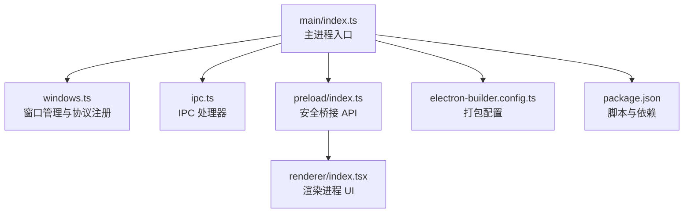
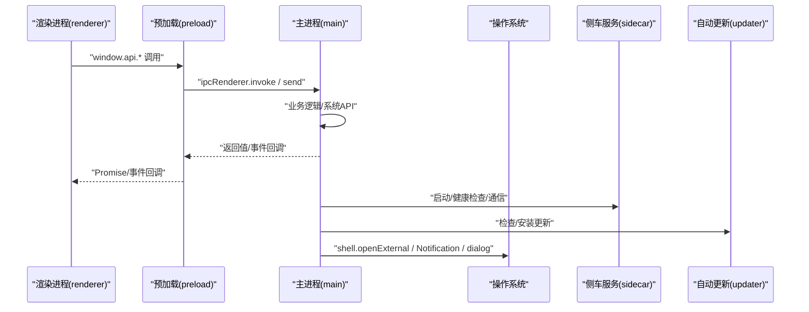
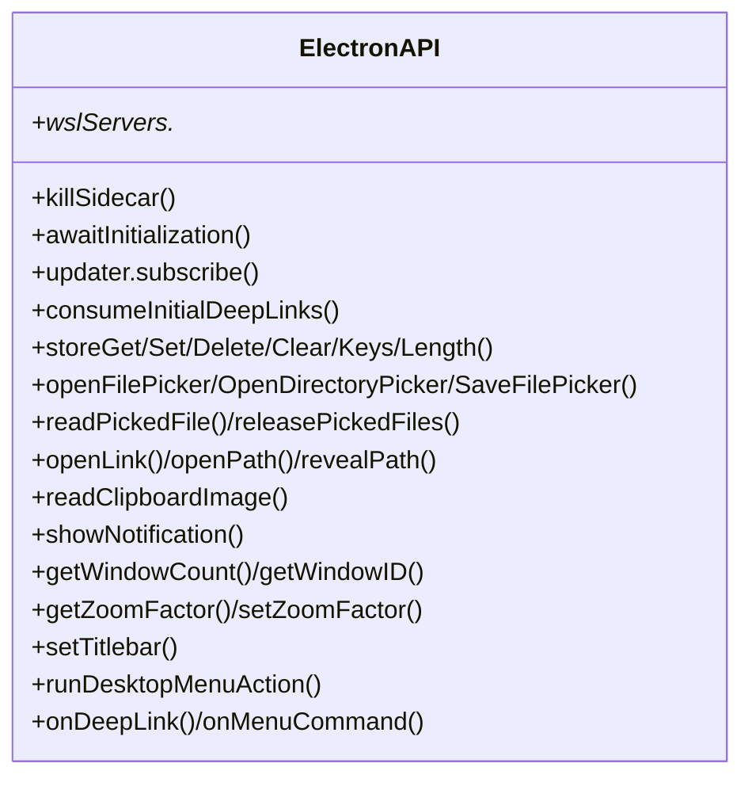
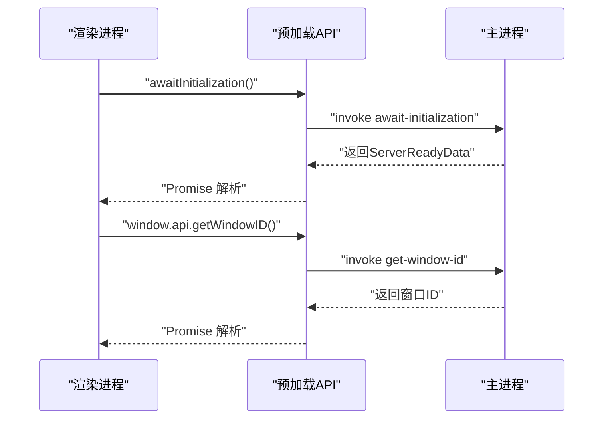
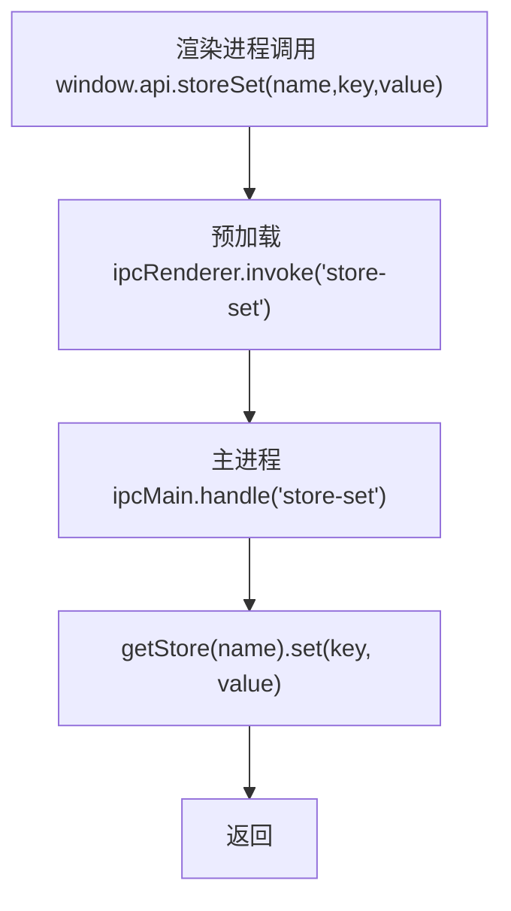
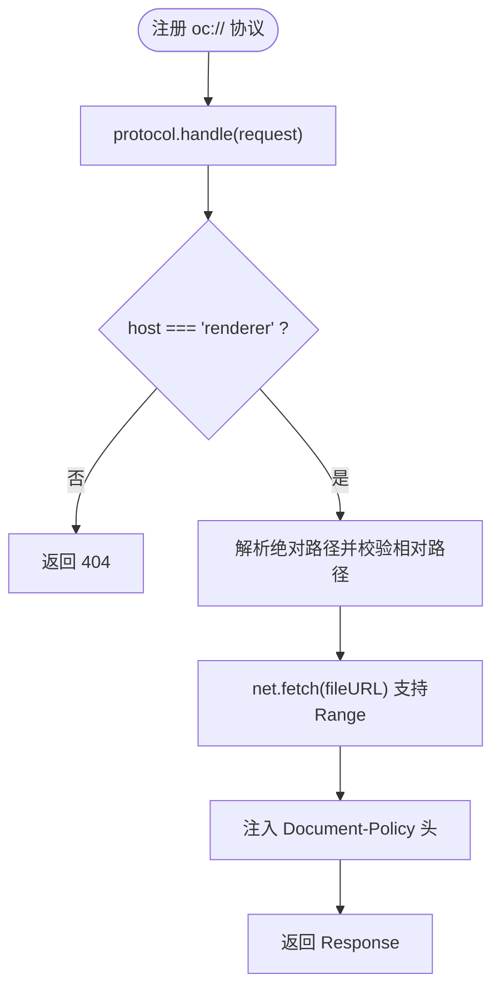
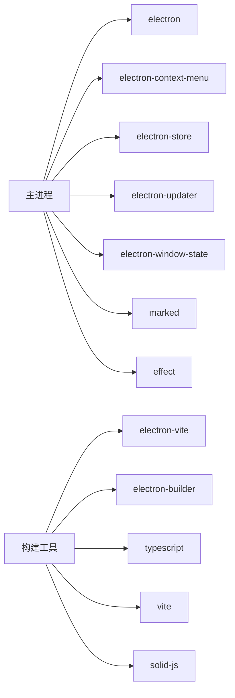
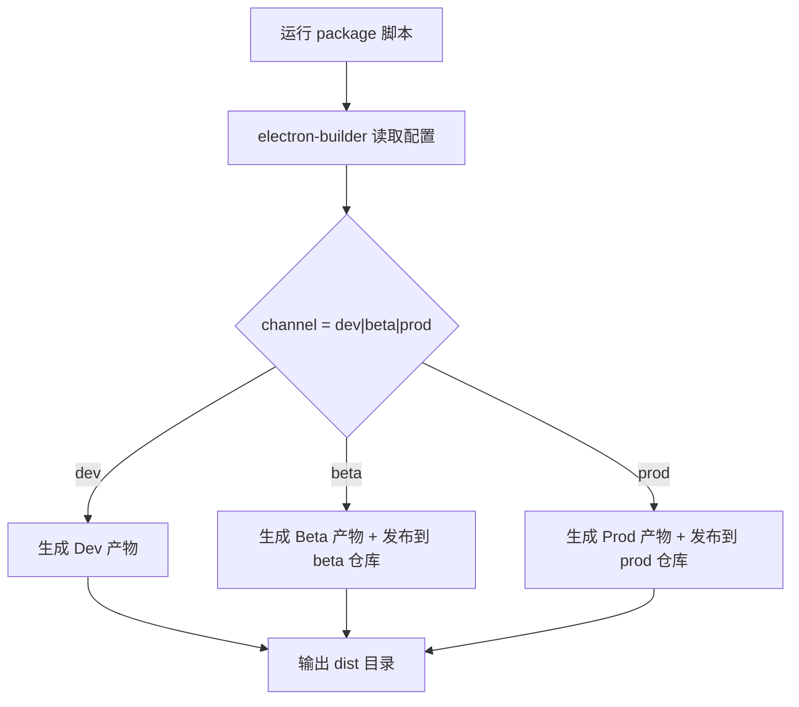

# 桌面应用

<cite>
**本文引用的文件**   
- [packages/desktop/package.json](file://packages/desktop/package.json)
- [packages/desktop/electron-builder.config.ts](file://packages/desktop/electron-builder.config.ts)
- [packages/desktop/src/main/index.ts](file://packages/desktop/src/main/index.ts)
- [packages/desktop/src/main/windows.ts](file://packages/desktop/src/main/windows.ts)
- [packages/desktop/src/preload/index.ts](file://packages/desktop/src/preload/index.ts)
- [packages/desktop/src/main/ipc.ts](file://packages/desktop/src/main/ipc.ts)
- [packages/desktop/src/renderer/index.tsx](file://packages/desktop/src/renderer/index.tsx)
</cite>

## 目录
1. [简介](#简介)
2. [项目结构](#项目结构)
3. [核心组件](#核心组件)
4. [架构总览](#架构总览)
5. [详细组件分析](#详细组件分析)
6. [依赖关系分析](#依赖关系分析)
7. [性能与内存管理](#性能与内存管理)
8. [故障排查指南](#故障排查指南)
9. [结论](#结论)
10. [附录：打包与分发流程](#附录打包与分发流程)

## 简介
本文件面向 openNovel 的桌面端（Electron）实现，系统性说明主进程与渲染进程的分离、IPC 通信机制、文件系统访问策略、跨平台差异处理与原生能力集成、打包与分发流程，以及桌面特有功能（本地文件操作、系统通知、快捷键/菜单等）。文档同时给出性能优化与内存管理建议，帮助开发者与维护者快速理解并扩展桌面端能力。

## 项目结构
桌面端位于 packages/desktop，采用 Electron + Vite 构建，入口为 main/index.ts，预加载脚本 preload/index.ts，渲染入口 renderer/index.tsx。打包使用 electron-builder，配置文件 electron-builder.config.ts。



**图表来源** 
- [packages/desktop/src/main/index.ts:1-120](file://packages/desktop/src/main/index.ts#L1-L120)
- [packages/desktop/src/main/windows.ts:1-60](file://packages/desktop/src/main/windows.ts#L1-L60)
- [packages/desktop/src/preload/index.ts:1-40](file://packages/desktop/src/preload/index.ts#L1-L40)
- [packages/desktop/src/renderer/index.tsx:346-364](file://packages/desktop/src/renderer/index.tsx#L346-L364)
- [packages/desktop/electron-builder.config.ts:1-40](file://packages/desktop/electron-builder.config.ts#L1-L40)
- [packages/desktop/package.json:12-24](file://packages/desktop/package.json#L12-L24)

**章节来源**
- [packages/desktop/package.json:12-24](file://packages/desktop/package.json#L12-L24)
- [packages/desktop/electron-builder.config.ts:1-40](file://packages/desktop/electron-builder.config.ts#L1-L40)

## 核心组件
- 主进程（Main）
  - 应用生命周期、单实例锁、协议注册、侧车服务启动与健康检查、自动更新、日志与崩溃上报、窗口恢复与状态持久化。
- 预加载（Preload）
  - 通过 contextBridge 暴露最小化 API 给渲染进程，屏蔽 Node/Electron 直接访问，保障安全隔离。
- 渲染进程（Renderer）
  - SolidJS 应用，通过 window.api 调用桌面能力，如文件选择、通知、缩放、主题、菜单命令、深链等。
- IPC 层
  - 基于 ipcMain.handle/on 与 ipcRenderer.invoke/send 的双向通信，封装文件对话框、剪贴板图片、路径打开/显示、窗口控制、更新订阅等。
- 窗口与协议
  - 自定义 oc:// 协议安全读取渲染资源，窗口状态持久化、缩放、标题栏覆盖、权限白名单、未响应采样与错误弹窗。
- 打包与分发
  - electron-builder 多目标产物（macOS dmg/zip、Windows nsis、Linux AppImage/deb/rpm），渠道化 appId、签名、协议注册、Linux .desktop 兼容。

**章节来源**
- [packages/desktop/src/main/index.ts:113-200](file://packages/desktop/src/main/index.ts#L113-L200)
- [packages/desktop/src/preload/index.ts:1-40](file://packages/desktop/src/preload/index.ts#L1-L40)
- [packages/desktop/src/main/ipc.ts:46-120](file://packages/desktop/src/main/ipc.ts#L46-L120)
- [packages/desktop/src/main/windows.ts:166-230](file://packages/desktop/src/main/windows.ts#L166-L230)
- [packages/desktop/electron-builder.config.ts:62-106](file://packages/desktop/electron-builder.config.ts#L62-L106)

## 架构总览
下图展示主进程、预加载、渲染进程之间的职责边界与数据流，以及关键外部交互（系统 shell、通知、自动更新、侧车服务）。



**图表来源** 
- [packages/desktop/src/renderer/index.tsx:346-364](file://packages/desktop/src/renderer/index.tsx#L346-L364)
- [packages/desktop/src/preload/index.ts:65-128](file://packages/desktop/src/preload/index.ts#L65-L128)
- [packages/desktop/src/main/ipc.ts:46-120](file://packages/desktop/src/main/ipc.ts#L46-L120)
- [packages/desktop/src/main/index.ts:315-378](file://packages/desktop/src/main/index.ts#L315-L378)

## 详细组件分析

### 主进程（Main）
- 生命周期与初始化
  - 设置应用名、AppId、用户数据路径；启用远程调试端口（开发）；设置代理与证书；单实例锁；监听 deep link（open-url/second-instance）。
- 侧车服务（Sidecar）
  - 动态分配本地回环端口，启动 sidecar，等待健康检查完成后再恢复窗口；失败时向前端转发初始化失败。
- 自动更新
  - 初始化 updater，定时检查更新，提供 UI 触发与订阅推送。
- IPC 注册
  - 集中注册所有 handle/on 处理器，包括 store、文件选择、路径操作、通知、窗口控制、缩放、标题栏主题、菜单动作、错误记录等。
- 窗口恢复与菜单
  - 恢复上次窗口状态，创建应用菜单，支持“检查更新”“重启”等动作。

```mermaid
flowchart TD
Start(["应用启动"]) --> Init["初始化日志/崩溃上报/证书/代理"]
Init --> Lock{"单实例锁成功?"}
Lock -- 否 --> Quit["退出进程"]
Lock -- 是 --> Sidecar["启动侧车服务并等待健康检查"]
Sidecar --> Updater["初始化自动更新"]
Updater --> IPC["注册 IPC 处理器"]
IPC --> Windows["恢复主窗口/创建菜单"]
Windows --> Ready(["就绪"))
```

**图表来源** 
- [packages/desktop/src/main/index.ts:113-200](file://packages/desktop/src/main/index.ts#L113-L200)
- [packages/desktop/src/main/index.ts:315-378](file://packages/desktop/src/main/index.ts#L315-L378)
- [packages/desktop/src/main/index.ts:382-396](file://packages/desktop/src/main/index.ts#L382-L396)

**章节来源**
- [packages/desktop/src/main/index.ts:113-200](file://packages/desktop/src/main/index.ts#L113-L200)
- [packages/desktop/src/main/index.ts:315-378](file://packages/desktop/src/main/index.ts#L315-L378)
- [packages/desktop/src/main/index.ts:382-396](file://packages/desktop/src/main/index.ts#L382-L396)

### 预加载（Preload）
- 安全桥接
  - 仅暴露必要 API，使用 ipcRenderer.invoke 与 on 进行请求/事件通信，避免在渲染进程直接访问 Node/Electron 模块。
- 能力清单
  - 文件选择器、保存对话框、剪贴板图片、路径打开/显示、通知、窗口聚焦/显示、缩放控制、标题栏主题、菜单动作、自动更新订阅、深链消费、Store 读写等。



**图表来源** 
- [packages/desktop/src/preload/index.ts:13-128](file://packages/desktop/src/preload/index.ts#L13-L128)

**章节来源**
- [packages/desktop/src/preload/index.ts:1-128](file://packages/desktop/src/preload/index.ts#L1-L128)

### 渲染进程（Renderer）
- 启动流程
  - 获取 windowID（可选）、等待初始化结果、加载语言包与默认服务器、注入 PlatformProvider，挂载根组件。
- 桌面能力使用
  - 外链点击拦截并通过 platform.openLink 打开；根据主题色调用 setBackgroundColor；监听缩放变化等。



**图表来源** 
- [packages/desktop/src/renderer/index.tsx:346-364](file://packages/desktop/src/renderer/index.tsx#L346-L364)
- [packages/desktop/src/preload/index.ts:65-80](file://packages/desktop/src/preload/index.ts#L65-L80)
- [packages/desktop/src/main/ipc.ts:217-223](file://packages/desktop/src/main/ipc.ts#L217-L223)

**章节来源**
- [packages/desktop/src/renderer/index.tsx:346-364](file://packages/desktop/src/renderer/index.tsx#L346-L364)
- [packages/desktop/src/renderer/index.tsx:435-464](file://packages/desktop/src/renderer/index.tsx#L435-L464)

### IPC 通信（Main ↔ Renderer）
- 设计原则
  - 所有系统级能力统一经 ipcMain.handle 暴露，参数校验与错误处理集中在主进程；渲染进程只调用 Promise API。
- 典型场景
  - Store 读写：按命名空间隔离键值存储，空文件清理。
  - 文件选择：打开/保存对话框，限制附件大小预算，授权 token 控制读取与释放。
  - 路径与链接：openPath/openExternal/revealPath。
  - 通知：系统 Notification。
  - 窗口控制：聚焦、显示、缩放、标题栏主题、缩放开关。
  - 更新：订阅/检查/安装。



**图表来源** 
- [packages/desktop/src/preload/index.ts:71-76](file://packages/desktop/src/preload/index.ts#L71-L76)
- [packages/desktop/src/main/ipc.ts:101-111](file://packages/desktop/src/main/ipc.ts#L101-L111)

**章节来源**
- [packages/desktop/src/main/ipc.ts:46-120](file://packages/desktop/src/main/ipc.ts#L46-L120)
- [packages/desktop/src/main/ipc.ts:121-213](file://packages/desktop/src/main/ipc.ts#L121-L213)
- [packages/desktop/src/main/ipc.ts:215-266](file://packages/desktop/src/main/ipc.ts#L215-L266)

### 窗口与协议（Windows & Protocol）
- 窗口管理
  - 使用 electron-window-state 持久化位置/尺寸；按平台差异化配置（macOS hidden title bar、Windows frameless + titleBarOverlay）。
  - 自定义 oc:// 协议安全读取渲染资源，严格校验 host 与相对路径，支持 Range 头与 Document-Policy 注入。
- 权限与安全
  - 仅允许 clipboard-sanitized-write 与 notifications 两类权限，且限定可信来源 URL。
- 缩放与标题栏
  - 支持捏合缩放开关与缩放因子同步，标题栏高度随缩放调整。



**图表来源** 
- [packages/desktop/src/main/windows.ts:253-294](file://packages/desktop/src/main/windows.ts#L253-L294)
- [packages/desktop/src/main/windows.ts:416-421](file://packages/desktop/src/main/windows.ts#L416-L421)

**章节来源**
- [packages/desktop/src/main/windows.ts:166-230](file://packages/desktop/src/main/windows.ts#L166-L230)
- [packages/desktop/src/main/windows.ts:253-294](file://packages/desktop/src/main/windows.ts#L253-L294)
- [packages/desktop/src/main/windows.ts:423-458](file://packages/desktop/src/main/windows.ts#L423-L458)

### 跨平台支持与原生能力
- macOS
  - Dock 图标设置、隐藏标题栏、原生阴影与外观跟随 nativeTheme。
- Windows
  - 无边框窗口 + 标题栏覆盖（titleBarOverlay），NSIS 安装包，代码签名钩子。
- Linux
  - AppImage/deb/rpm 多目标，StartupWMClass 关联任务栏图标，兼容旧版 .desktop 条目。
- 通用
  - 系统通知、Shell 打开外部链接/路径、剪贴板图片读取、文件对话框、自动更新。

**章节来源**
- [packages/desktop/src/main/windows.ts:160-164](file://packages/desktop/src/main/windows.ts#L160-L164)
- [packages/desktop/src/main/windows.ts:184-203](file://packages/desktop/src/main/windows.ts#L184-L203)
- [packages/desktop/electron-builder.config.ts:79-106](file://packages/desktop/electron-builder.config.ts#L79-L106)
- [packages/desktop/src/main/ipc.ts:180-213](file://packages/desktop/src/main/ipc.ts#L180-L213)

### 桌面特有功能
- 本地文件操作
  - 打开/保存文件对话框、附件大小预算校验、临时授权 token 控制读取与释放。
- 系统通知
  - 通过 Notification API 发送标题与内容。
- 快捷键与菜单
  - 应用菜单项触发后通过 sendMenuCommand 下发到渲染进程执行对应命令。
- 深链（Deep Link）
  - 注册 opennovel:// 协议，捕获 second-instance 与 open-url 事件，转发至渲染进程。

**章节来源**
- [packages/desktop/src/main/ipc.ts:121-213](file://packages/desktop/src/main/ipc.ts#L121-L213)
- [packages/desktop/src/main/index.ts:203-220](file://packages/desktop/src/main/index.ts#L203-L220)
- [packages/desktop/src/main/index.ts:382-396](file://packages/desktop/src/main/index.ts#L382-L396)

## 依赖关系分析
- 运行时依赖
  - electron、electron-context-menu、electron-store、electron-updater、electron-window-state、marked、effect 等。
- 构建依赖
  - electron-vite、electron-builder、typescript、vite、solid-js 等。
- 可选依赖
  - node-pty 与 @parcel/watcher 的平台特定二进制，用于终端与文件监控。



**图表来源** 
- [packages/desktop/package.json:26-58](file://packages/desktop/package.json#L26-L58)

**章节来源**
- [packages/desktop/package.json:26-58](file://packages/desktop/package.json#L26-L58)

## 性能与内存管理
- 渲染进程稳定性
  - 监听 render-process-gone/unresponsive/responsive，采集堆栈并提示用户导出日志或重启。
- 网络与 I/O
  - 侧车服务健康检查超时保护；net.log 启动失败容错；代理与证书加载失败降级。
- 窗口与缩放
  - 捏合缩放可关闭，强制回到 1x；缩放因子变更同步标题栏高度。
- 资源释放
  - 窗口关闭时清理持久化状态文件；Store 空文件清理；订阅销毁时移除监听。
- 建议
  - 避免在主进程做重型计算；大文件读取走流式或分片；合理使用 WeakMap 缓存窗口相关状态；减少不必要的 IPC 往返。

**章节来源**
- [packages/desktop/src/main/windows.ts:307-414](file://packages/desktop/src/main/windows.ts#L307-L414)
- [packages/desktop/src/main/index.ts:232-249](file://packages/desktop/src/main/index.ts#L232-L249)
- [packages/desktop/src/main/ipc.ts:108-119](file://packages/desktop/src/main/ipc.ts#L108-L119)

## 故障排查指南
- 常见问题定位
  - 渲染加载失败：查看 did-fail-load/did-fail-provisional-load 日志与弹窗详情。
  - 渲染进程崩溃：render-process-gone 原因码与退出码。
  - 未响应：unresponsive 事件触发采样，导出日志后重启。
  - 协议问题：oc:// 请求被拒绝（host/path 校验失败）。
  - 自动更新：检查 updater 订阅与 check/install 调用链路。
- 日志导出
  - 通过 exportDebugLogs 导出调试日志，便于问题复现与提交。

**章节来源**
- [packages/desktop/src/main/windows.ts:307-414](file://packages/desktop/src/main/windows.ts#L307-L414)
- [packages/desktop/src/main/ipc.ts:83-90](file://packages/desktop/src/main/ipc.ts#L83-L90)

## 结论
openNovel 桌面端以清晰的进程分离与最小化预加载桥接，实现了安全的系统能力访问与稳定的用户体验。通过严格的协议与权限控制、完善的错误与未响应处理、跨平台一致的窗口与原生能力集成，以及灵活的打包分发配置，为后续功能扩展提供了坚实基础。建议在新增能力时遵循现有 IPC 模式与权限白名单，持续优化 I/O 与渲染性能。

## 附录：打包与分发流程
- 构建与预览
  - dev/preview/build 脚本由 electron-vite 驱动。
- 打包目标
  - macOS：dmg/zip，开启 hardenedRuntime 与 notarize，DMG 签名。
  - Windows：nsis 安装包，支持自定义签名脚本。
  - Linux：AppImage/deb/rpm，设置 StartupWMClass 与 .desktop 兼容。
- 渠道与发布
  - dev/beta/prod 三个渠道，分别设置 appId、productName、协议名称与 GitHub 发布仓库。
- 额外资源
  - 将 native/ 下的 index.js、类型声明与平台原生二进制打包进应用。



**图表来源** 
- [packages/desktop/electron-builder.config.ts:28-40](file://packages/desktop/electron-builder.config.ts#L28-L40)
- [packages/desktop/electron-builder.config.ts:108-146](file://packages/desktop/electron-builder.config.ts#L108-L146)

**章节来源**
- [packages/desktop/package.json:12-24](file://packages/desktop/package.json#L12-L24)
- [packages/desktop/electron-builder.config.ts:1-40](file://packages/desktop/electron-builder.config.ts#L1-L40)
- [packages/desktop/electron-builder.config.ts:62-106](file://packages/desktop/electron-builder.config.ts#L62-L106)
- [packages/desktop/electron-builder.config.ts:108-146](file://packages/desktop/electron-builder.config.ts#L108-L146)