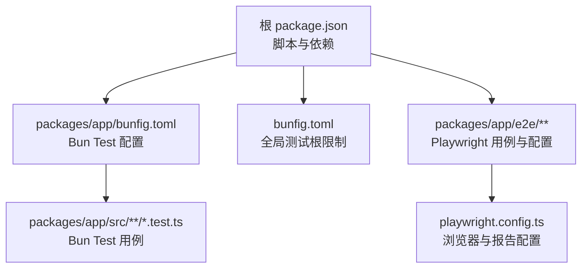
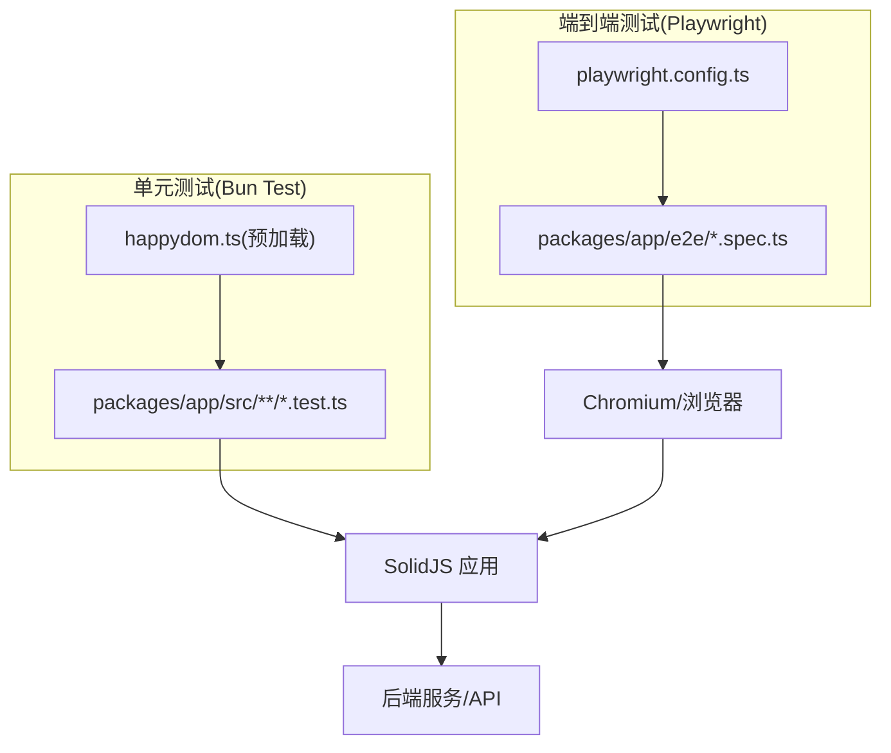
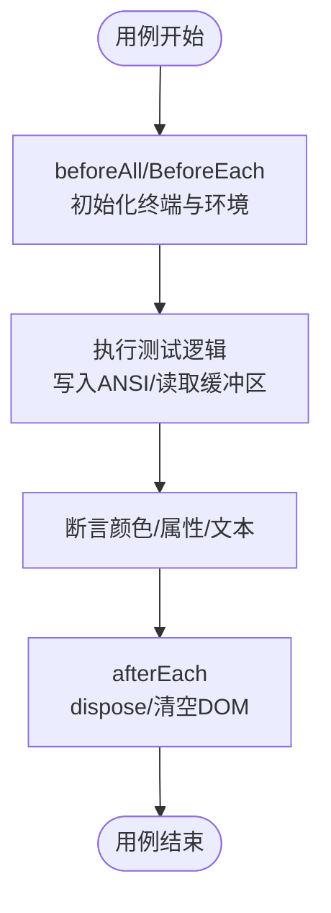
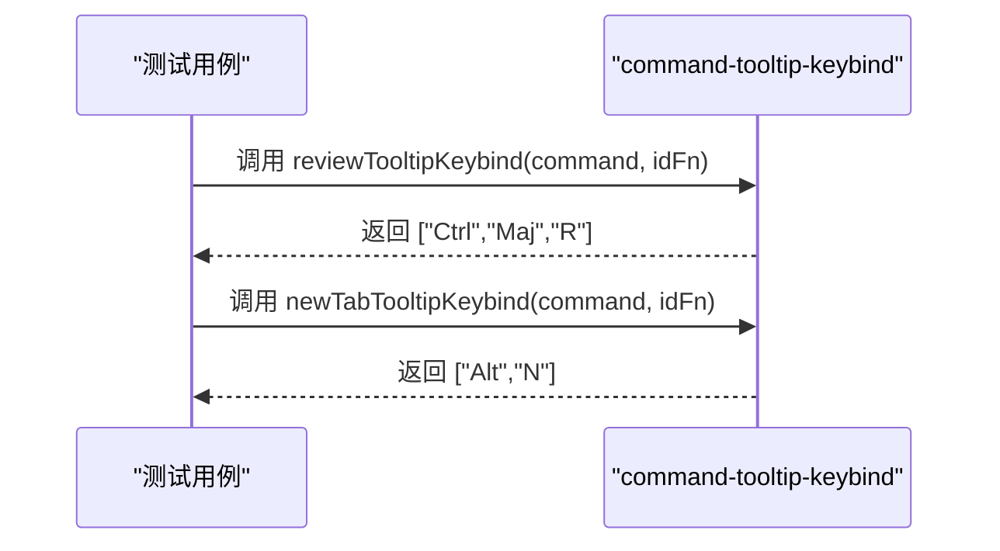
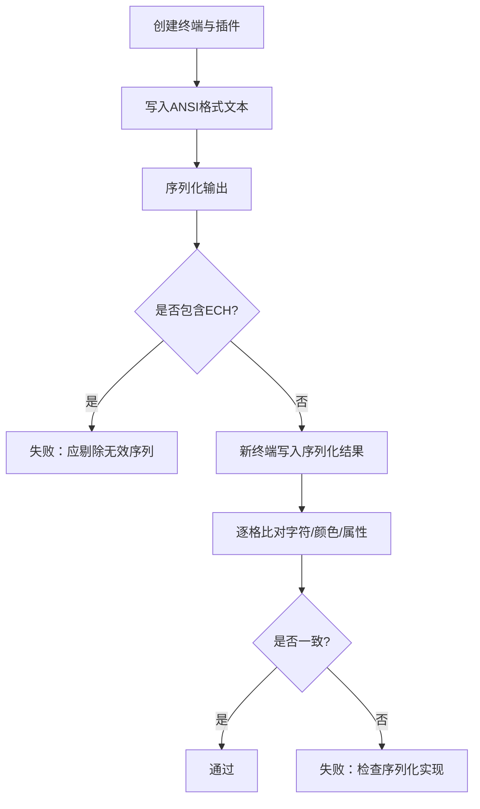
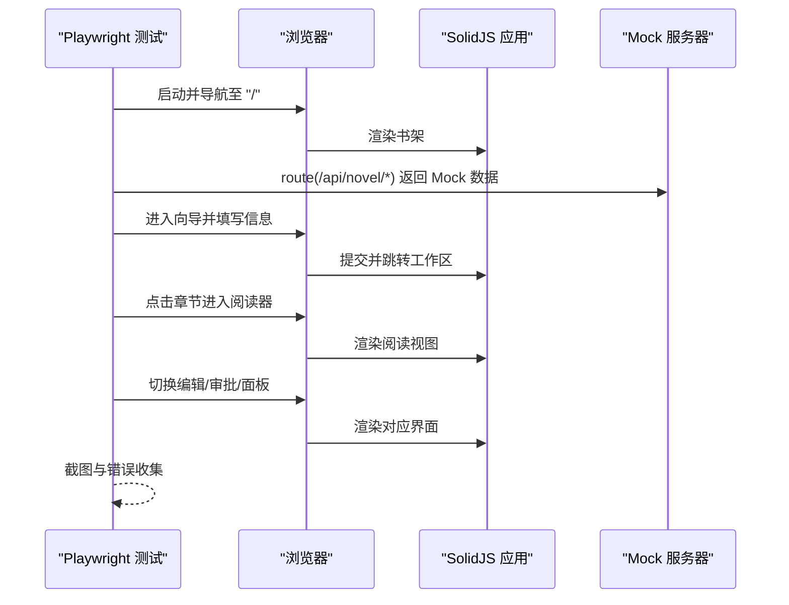
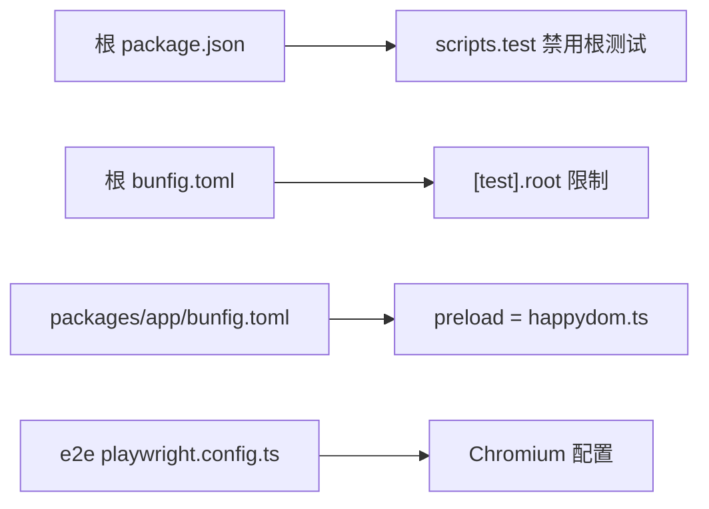

# 单元测试

<cite>
**本文引用的文件**   
- [package.json](file://package.json)
- [bunfig.toml](file://bunfig.toml)
- [packages/app/bunfig.toml](file://packages/app/bunfig.toml)
- [packages/app/src/addons/serialize.test.ts](file://packages/app/src/addons/serialize.test.ts)
- [packages/app/src/components/command-tooltip-keybind.test.ts](file://packages/app/src/components/command-tooltip-keybind.test.ts)
- [packages/app/e2e/novel.spec.ts](file://packages/app/e2e/novel.spec.ts)
- [packages/app/e2e/performance/timeline-stability/playwright.config.ts](file://packages/app/e2e/performance/timeline-stability/playwright.config.ts)
- [packages/app/e2e/reproduction/timeline-suspense/playwright.config.ts](file://packages/app/e2e/reproduction/timeline-suspense/playwright.config.ts)
</cite>

## 目录
1. [简介](#简介)
2. [项目结构](#项目结构)
3. [核心组件](#核心组件)
4. [架构总览](#架构总览)
5. [详细组件分析](#详细组件分析)
6. [依赖分析](#依赖分析)
7. [性能考虑](#性能考虑)
8. [故障排查指南](#故障排查指南)
9. [结论](#结论)
10. [附录](#附录)

## 简介
本文件面向 openNovel 项目的单元测试与端到端测试实践，聚焦以下目标：
- 明确使用的测试框架与配置（Bun Test、Playwright）
- 说明如何编写高质量的单元/函数/模块测试
- 解释模拟（Mock）策略与测试数据管理
- 提供 SolidJS 组件、Effect 框架代码与业务逻辑的测试示例指引
- 给出覆盖率要求与最佳实践建议

## 项目结构
openNovel 采用多包工作区，测试分布在多个位置：
- 单元测试：位于 packages/app/src 下的 .test.ts 文件，使用 Bun Test 运行
- 端到端测试：位于 packages/app/e2e 下，使用 Playwright 驱动浏览器进行 UI 流程验证
- 根级 bunfig 禁止在根目录执行测试，强制在各子包内运行

**图表来源** 
- [package.json:1-162](file://package.json#L1-L162)
- [bunfig.toml:1-9](file://bunfig.toml#L1-L9)
- [packages/app/bunfig.toml:1-4](file://packages/app/bunfig.toml#L1-L4)
- [packages/app/e2e/performance/timeline-stability/playwright.config.ts:1-17](file://packages/app/e2e/performance/timeline-stability/playwright.config.ts#L1-L17)

**章节来源**
- [package.json:1-162](file://package.json#L1-L162)
- [bunfig.toml:1-9](file://bunfig.toml#L1-L9)
- [packages/app/bunfig.toml:1-4](file://packages/app/bunfig.toml#L1-L4)

## 核心组件
- 测试框架
  - 单元测试：Bun Test（通过 import { describe, test, expect } from "bun:test"）
  - 端到端测试：Playwright（通过 import { test, expect } from "@playwright/test"）
- 运行入口
  - 根 scripts.test 被禁用，避免在仓库根执行测试
  - 各包的 bunfig.toml 指定测试根目录与预加载环境（如 happy-dom）
- 典型用例
  - 序列化插件测试：验证 ANSI 颜色与属性保留、往返序列化
  - 快捷键工具函数测试：验证本地化修饰符与快捷键组合
  - 小说全流程 E2E：从书架到向导、工作区、阅读器、审批、编辑器与面板

**章节来源**
- [packages/app/src/addons/serialize.test.ts:1-320](file://packages/app/src/addons/serialize.test.ts#L1-L320)
- [packages/app/src/components/command-tooltip-keybind.test.ts:1-23](file://packages/app/src/components/command-tooltip-keybind.test.ts#L1-L23)
- [packages/app/e2e/novel.spec.ts:1-445](file://packages/app/e2e/novel.spec.ts#L1-L445)
- [bunfig.toml:1-9](file://bunfig.toml#L1-L9)
- [packages/app/bunfig.toml:1-4](file://packages/app/bunfig.toml#L1-L4)

## 架构总览
下图展示 openNovel 中“单元测试 + E2E”的整体协作关系：Bun Test 负责纯函数与轻量 DOM 环境的快速验证；Playwright 负责真实浏览器中的交互与集成验证。

[本图为概念性架构图，不直接映射具体源码文件]

## 详细组件分析

### 单元测试：Bun Test 基础与实践
- 框架与断言
  - 使用 describe/test/expect 组织与断言
  - 支持 beforeAll/afterEach 等生命周期钩子
- 环境与 DOM
  - 通过 bunfig.toml 的 preload 注入 happy-dom，提供 document/body 等 DOM API
- 资源清理
  - afterEach 中释放 Terminal、清空 body，避免跨用例污染

**图表来源** 
- [packages/app/src/addons/serialize.test.ts:1-320](file://packages/app/src/addons/serialize.test.ts#L1-L320)
- [packages/app/bunfig.toml:1-4](file://packages/app/bunfig.toml#L1-L4)

**章节来源**
- [packages/app/src/addons/serialize.test.ts:1-320](file://packages/app/src/addons/serialize.test.ts#L1-L320)
- [packages/app/bunfig.toml:1-4](file://packages/app/bunfig.toml#L1-L4)

### 函数测试：快捷键与本地化
- 关注点
  - 验证本地化修饰符（如 Ctrl+Maj+R）不被破坏
  - 验证新标签页快捷键按配置返回正确键位数组
- 方法
  - 构造最小命令对象，传入 keybind/keybindParts 回调
  - 断言返回值与预期一致

**图表来源** 
- [packages/app/src/components/command-tooltip-keybind.test.ts:1-23](file://packages/app/src/components/command-tooltip-keybind.test.ts#L1-L23)

**章节来源**
- [packages/app/src/components/command-tooltip-keybind.test.ts:1-23](file://packages/app/src/components/command-tooltip-keybind.test.ts#L1-L23)

### 模块测试：序列化插件往返校验
- 目标
  - 确保 ANSI 颜色与属性（粗体、斜体、下划线、前景/背景色、256色、RGB真彩）在序列化后能无损还原
  - 确保往返输出不包含 ECH 序列，且多行内容无乱码
- 关键步骤
  - 创建 Terminal 并加载 SerializeAddon
  - 写入带格式的 ANSI 文本
  - 序列化后在新终端写入并比对单元格属性与文本

**图表来源** 
- [packages/app/src/addons/serialize.test.ts:1-320](file://packages/app/src/addons/serialize.test.ts#L1-L320)

**章节来源**
- [packages/app/src/addons/serialize.test.ts:1-320](file://packages/app/src/addons/serialize.test.ts#L1-L320)

### 端到端测试：Playwright 小说全流程
- 目标
  - 覆盖书架 → 向导 → 工作区 → 阅读器 → 审批 → 编辑器 → 右侧面板的完整用户旅程
- 关键点
  - 使用 page.route 拦截 /api/novel 相关接口，返回固定 Mock 数据
  - 使用 waitForURL/waitForSelector 等待页面就绪
  - 截图与错误追踪辅助定位问题
- 配置
  - playwright.config.ts 定义浏览器、超时、重试、报告与录制策略

**图表来源** 
- [packages/app/e2e/novel.spec.ts:1-445](file://packages/app/e2e/novel.spec.ts#L1-L445)
- [packages/app/e2e/performance/timeline-stability/playwright.config.ts:1-17](file://packages/app/e2e/performance/timeline-stability/playwright.config.ts#L1-L17)

**章节来源**
- [packages/app/e2e/novel.spec.ts:1-445](file://packages/app/e2e/novel.spec.ts#L1-L445)
- [packages/app/e2e/performance/timeline-stability/playwright.config.ts:1-17](file://packages/app/e2e/performance/timeline-stability/playwright.config.ts#L1-L17)

### 概念总览：SolidJS 组件与 Effect 代码测试要点
- SolidJS 组件
  - 使用 happy-dom 提供 DOM 上下文
  - 渲染后断言可见元素、事件触发后的状态变化
- Effect 框架代码
  - 将 Effect 编排为可测试的函数或副作用封装
  - 使用同步/异步断言验证状态流转与副作用触发时机
- 业务逻辑
  - 以纯函数为主，便于单测覆盖
  - 对 I/O 与外部依赖进行 Mock，保证确定性

[本节为概念性指导，不直接分析具体文件]

## 依赖分析
- 根 package.json
  - 声明了 Playwright、Vitest 等依赖（用于不同场景），但实际单元测试由 Bun Test 驱动
  - scripts.test 显式阻止在根目录运行测试
- 全局 bunfig.toml
  - [test].root 指向禁止路径，强制在子包内运行测试
- 子包 bunfig.toml
  - 指定测试根目录与预加载环境（如 happydom.ts）
- Playwright 配置
  - 自定义输出目录、Reporter、重试、Workers、Trace/Screenshot/Video 策略

**图表来源** 
- [package.json:1-162](file://package.json#L1-L162)
- [bunfig.toml:1-9](file://bunfig.toml#L1-L9)
- [packages/app/bunfig.toml:1-4](file://packages/app/bunfig.toml#L1-L4)
- [packages/app/e2e/performance/timeline-stability/playwright.config.ts:1-17](file://packages/app/e2e/performance/timeline-stability/playwright.config.ts#L1-L17)

**章节来源**
- [package.json:1-162](file://package.json#L1-L162)
- [bunfig.toml:1-9](file://bunfig.toml#L1-L9)
- [packages/app/bunfig.toml:1-4](file://packages/app/bunfig.toml#L1-L4)
- [packages/app/e2e/performance/timeline-stability/playwright.config.ts:1-17](file://packages/app/e2e/performance/timeline-stability/playwright.config.ts#L1-L17)

## 性能考虑
- 单元测试
  - 尽量保持用例独立、快速，避免共享可变状态
  - 合理复用 Terminal/容器实例，减少创建开销
- 端到端测试
  - 控制并行度与重试次数，避免并发导致的时序问题
  - 仅在失败时录制 Trace/Screenshot/Video，降低 IO 压力
  - 使用稳定的选择器与等待策略，减少不稳定等待

[本节为通用建议，不直接分析具体文件]

## 故障排查指南
- 常见问题
  - 在根目录运行测试被拒绝：需进入子包目录执行
  - DOM API 不可用：确认 bunfig.toml 已预加载 happydom
  - 网络请求不稳定：在 E2E 中使用 page.route 拦截并返回确定数据
  - 断言失败：优先检查渲染顺序与等待条件（waitForURL/waitForSelector）
- 调试技巧
  - 增加截图与 Trace，定位 UI 状态
  - 缩小测试范围，逐步隔离问题
  - 打印关键中间状态，确认数据流

**章节来源**
- [bunfig.toml:1-9](file://bunfig.toml#L1-L9)
- [packages/app/bunfig.toml:1-4](file://packages/app/bunfig.toml#L1-L4)
- [packages/app/e2e/novel.spec.ts:1-445](file://packages/app/e2e/novel.spec.ts#L1-L445)

## 结论
openNovel 的测试体系以 Bun Test 为核心进行快速单元与模块验证，辅以 Playwright 完成端到端流程保障。通过清晰的配置与良好的 Mock 策略，既能保证开发效率，又能提升回归稳定性。建议在新增功能时遵循“先单元、后集成/E2E”的顺序，持续完善覆盖率与断言质量。

[本节为总结性内容，不直接分析具体文件]

## 附录

### 测试框架与配置速览
- 单元测试
  - 框架：Bun Test
  - 入口：packages/app/bunfig.toml 的 [test] 配置
  - 环境：preload 注入 happydom
- 端到端测试
  - 框架：Playwright
  - 配置：packages/app/e2e/**/playwright.config.ts
  - 浏览器：Chromium（可按需扩展设备矩阵）

**章节来源**
- [packages/app/bunfig.toml:1-4](file://packages/app/bunfig.toml#L1-L4)
- [packages/app/e2e/performance/timeline-stability/playwright.config.ts:1-17](file://packages/app/e2e/performance/timeline-stability/playwright.config.ts#L1-L17)

### 高质量测试编写指南
- 命名与结构
  - 使用 describe/test 清晰分组，文件名以 .test.ts 结尾
- 断言原则
  - 断言行为而非实现细节；优先断言可见 UI 与最终状态
- 模拟策略
  - 对外部 API 使用 page.route 或模块 Mock
  - 对第三方库（如 Terminal）按需替换或包装
- 测试数据
  - 集中管理 Mock 数据，避免硬编码分散
- 覆盖率要求
  - 建议核心模块达到 80%+ 行覆盖率，关键分支 90%+
  - 结合 CI 阻断低覆盖率合并

[本节为通用实践，不直接分析具体文件]

### 常见测试模式示例（路径引用）
- 组件测试（Terminal + SerializeAddon）
  - [packages/app/src/addons/serialize.test.ts:1-320](file://packages/app/src/addons/serialize.test.ts#L1-L320)
- 函数测试（快捷键处理）
  - [packages/app/src/components/command-tooltip-keybind.test.ts:1-23](file://packages/app/src/components/command-tooltip-keybind.test.ts#L1-L23)
- 端到端测试（小说全流程）
  - [packages/app/e2e/novel.spec.ts:1-445](file://packages/app/e2e/novel.spec.ts#L1-L445)