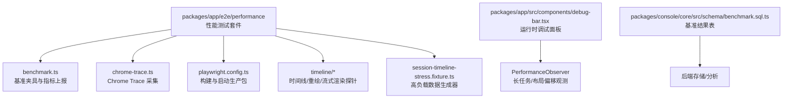
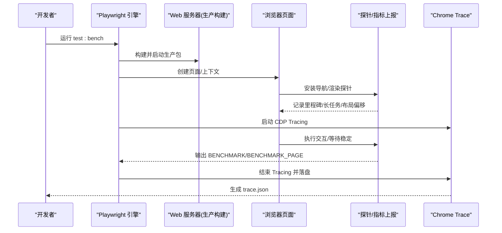
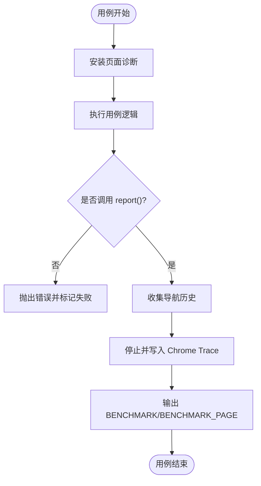
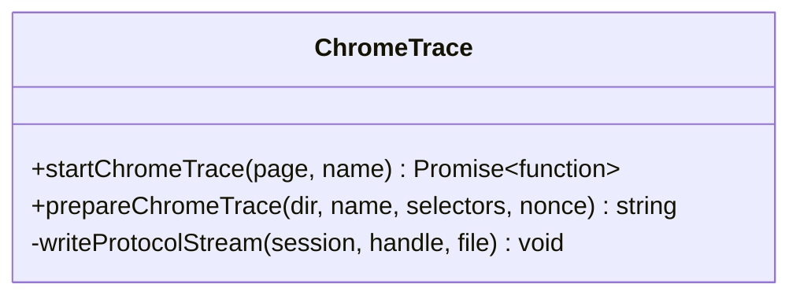
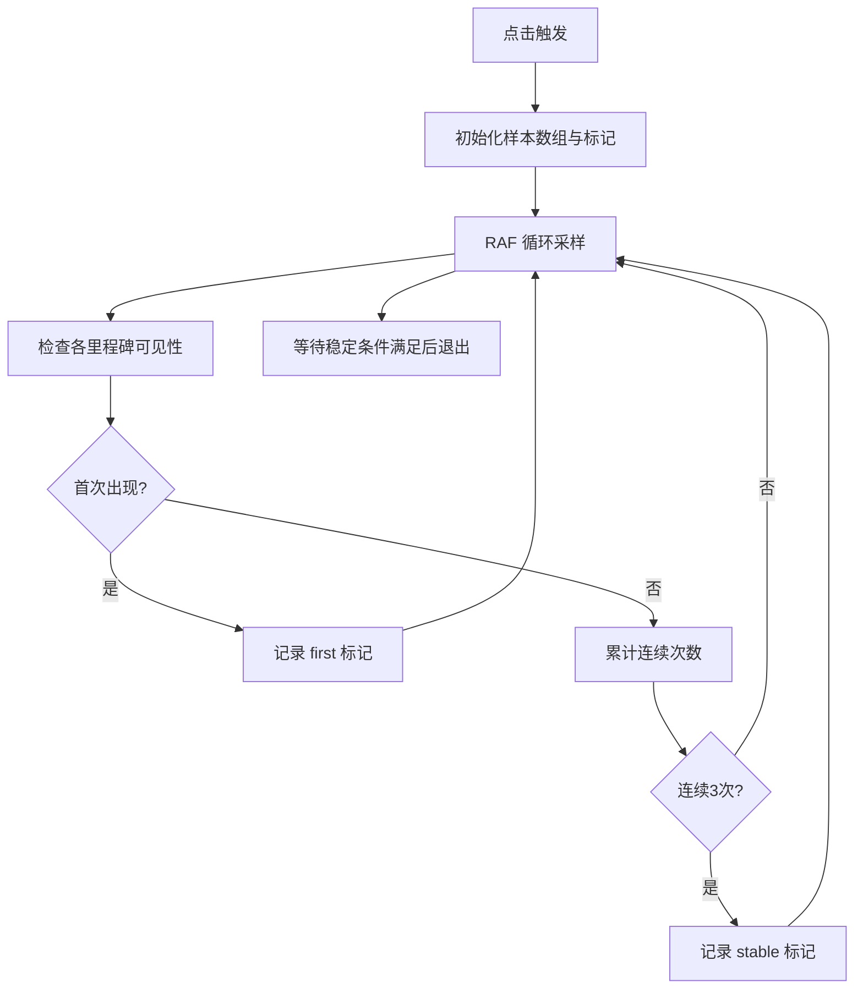
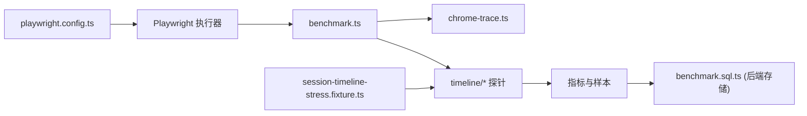

# 性能测试

<cite>
**本文引用的文件**   
- [packages/app/e2e/performance/README.md](file://packages/app/e2e/performance/README.md)
- [packages/app/e2e/performance/benchmark.ts](file://packages/app/e2e/performance/benchmark.ts)
- [packages/app/e2e/performance/chrome-trace.ts](file://packages/app/e2e/performance/chrome-trace.ts)
- [packages/app/e2e/performance/playwright.config.ts](file://packages/app/e2e/performance/playwright.config.ts)
- [packages/app/e2e/performance/timeline-stability/playwright.config.ts](file://packages/app/e2e/performance/timeline-stability/playwright.config.ts)
- [packages/app/e2e/performance/timeline/navigation-milestones.ts](file://packages/app/e2e/performance/timeline/navigation-milestones.ts)
- [packages/app/e2e/performance/timeline/session-timeline-stream-probe.ts](file://packages/app/e2e/performance/timeline/session-timeline-stream-probe.ts)
- [packages/app/e2e/performance/timeline/session-tab-repaint-probe.ts](file://packages/app/e2e/performance/timeline/session-tab-repaint-probe.ts)
- [packages/app/e2e/performance/timeline/session-tab-switch-benchmark.spec.ts](file://packages/app/e2e/performance/timeline/session-tab-switch-benchmark.spec.ts)
- [packages/app/e2e/performance/timeline/session-timeline-stress.fixture.ts](file://packages/app/e2e/performance/timeline/session-timeline-stress.fixture.ts)
- [packages/app/src/components/debug-bar.tsx](file://packages/app/src/components/debug-bar.tsx)
- [packages/console/core/src/schema/benchmark.sql.ts](file://packages/console/core/src/schema/benchmark.sql.ts)
- [perf/test-suite.md](file://perf/test-suite.md)
</cite>

## 目录
1. [简介](#简介)
2. [项目结构](#项目结构)
3. [核心组件](#核心组件)
4. [架构总览](#架构总览)
5. [详细组件分析](#详细组件分析)
6. [依赖关系分析](#依赖关系分析)
7. [性能考量与优化建议](#性能考量与优化建议)
8. [故障排查指南](#故障排查指南)
9. [结论](#结论)
10. [附录：工具使用与命令](#附录工具使用与命令)

## 简介
本文件面向 openNovel 的性能测试体系，覆盖基准测试设计、关键路径指标监控、负载与压力测试方法、内存泄漏检测与回归策略，以及 Chrome DevTools、Lighthouse 等工具的使用。文档基于仓库中现有的 e2e 性能套件、Playwright 配置、Chrome Trace 采集与浏览器内探针实现进行系统化说明，帮助读者快速理解并扩展性能测试能力。

## 项目结构
openNovel 的端到端性能测试集中在 packages/app/e2e/performance 目录下，采用 Playwright 作为场景编排与隔离框架，结合 Chrome Trace 与浏览器内 PerformanceObserver/MutationObserver 探针，形成“用例驱动 + 指标上报 + 原始轨迹”的闭环。

**图表来源** 
- [packages/app/e2e/performance/benchmark.ts:17-70](file://packages/app/e2e/performance/benchmark.ts#L17-L70)
- [packages/app/e2e/performance/chrome-trace.ts:21-67](file://packages/app/e2e/performance/chrome-trace.ts#L21-L67)
- [packages/app/e2e/performance/playwright.config.ts:1-20](file://packages/app/e2e/performance/playwright.config.ts#L1-L20)
- [packages/app/e2e/performance/timeline/navigation-milestones.ts:35-128](file://packages/app/e2e/performance/timeline/navigation-milestones.ts#L35-L128)
- [packages/app/e2e/performance/timeline/session-timeline-stream-probe.ts:150-175](file://packages/app/e2e/performance/timeline/session-timeline-stream-probe.ts#L150-L175)
- [packages/app/e2e/performance/timeline/session-tab-repaint-probe.ts:63-93](file://packages/app/e2e/performance/timeline/session-tab-repaint-probe.ts#L63-L93)
- [packages/app/e2e/performance/timeline/session-timeline-stress.fixture.ts:282-354](file://packages/app/e2e/performance/timeline/session-timeline-stress.fixture.ts#L282-L354)
- [packages/app/src/components/debug-bar.tsx:318-355](file://packages/app/src/components/debug-bar.tsx#L318-L355)
- [packages/console/core/src/schema/benchmark.sql.ts:1-14](file://packages/console/core/src/schema/benchmark.sql.ts#L1-L14)

**章节来源**
- [packages/app/e2e/performance/README.md:1-43](file://packages/app/e2e/performance/README.md#L1-L43)
- [packages/app/e2e/performance/playwright.config.ts:1-20](file://packages/app/e2e/performance/playwright.config.ts#L1-L20)

## 核心组件
- 基准夹具与指标上报（benchmark.ts）
  - 提供 report() 强制每个用例上报指标，统一输出 BENCHMARK JSON 行，便于 CI 解析与回归对比。
  - 自动收集页面导航历史，失败时附加到报告；支持独立浏览器上下文 withBenchmarkPage。
- Chrome Trace 采集（chrome-trace.ts）
  - 通过 CDP 启动/结束追踪，按 runID/name/hash/nonce 命名输出文件，支持选择器追踪开关。
- 时间线与稳定性探针（timeline/*）
  - 导航里程碑测量（navigation-milestones.ts）：以 RAF 轮询 DOM 可见性，记录首次与稳定时间点。
  - 流式时间线探针（session-timeline-stream-probe.ts）：记录长任务、布局偏移、可见子树变化、慢帧。
  - 重绘探针（session-tab-repaint-probe.ts）：记录 MutationObserver 变更与布局偏移，采样窗口控制开销。
- 高负载数据生成（session-timeline-stress.fixture.ts）
  - 构造大量消息、工具调用、代码片段与 diff，用于冷/热切换、缓存重绘、流式吞吐等场景。
- 运行时调试面板（debug-bar.tsx）
  - 在应用内启用 PerformanceObserver 观测长任务与布局偏移，辅助定位前端卡顿与抖动。
- 基准结果存储（benchmark.sql.ts）
  - 定义 benchmark 表结构，用于持久化模型/代理/结果等基准数据，支撑后端分析与趋势对比。

**章节来源**
- [packages/app/e2e/performance/benchmark.ts:17-70](file://packages/app/e2e/performance/benchmark.ts#L17-L70)
- [packages/app/e2e/performance/chrome-trace.ts:21-67](file://packages/app/e2e/performance/chrome-trace.ts#L21-L67)
- [packages/app/e2e/performance/timeline/navigation-milestones.ts:35-128](file://packages/app/e2e/performance/timeline/navigation-milestones.ts#L35-L128)
- [packages/app/e2e/performance/timeline/session-timeline-stream-probe.ts:150-175](file://packages/app/e2e/performance/timeline/session-timeline-stream-probe.ts#L150-L175)
- [packages/app/e2e/performance/timeline/session-tab-repaint-probe.ts:63-93](file://packages/app/e2e/performance/timeline/session-tab-repaint-probe.ts#L63-L93)
- [packages/app/e2e/performance/timeline/session-timeline-stress.fixture.ts:282-354](file://packages/app/e2e/performance/timeline/session-timeline-stress.fixture.ts#L282-L354)
- [packages/app/src/components/debug-bar.tsx:318-355](file://packages/app/src/components/debug-bar.tsx#L318-L355)
- [packages/console/core/src/schema/benchmark.sql.ts:1-14](file://packages/console/core/src/schema/benchmark.sql.ts#L1-L14)

## 架构总览
下图展示一次性能基准执行的端到端流程：Playwright 启动生产服务，执行用例，注入探针，采集 Chrome Trace，最后输出结构化指标与轨迹文件。

**图表来源** 
- [packages/app/e2e/performance/playwright.config.ts:15-19](file://packages/app/e2e/performance/playwright.config.ts#L15-L19)
- [packages/app/e2e/performance/benchmark.ts:52-70](file://packages/app/e2e/performance/benchmark.ts#L52-L70)
- [packages/app/e2e/performance/chrome-trace.ts:21-67](file://packages/app/e2e/performance/chrome-trace.ts#L21-L67)
- [packages/app/e2e/performance/timeline/navigation-milestones.ts:35-128](file://packages/app/e2e/performance/timeline/navigation-milestones.ts#L35-L128)

## 详细组件分析

### 基准夹具与指标上报（benchmark.ts）
- 职责
  - 强制用例通过 report() 上报指标，缺失则视为失败。
  - 自动收集主框架导航历史，失败时附加到报告附件。
  - 支持独立浏览器上下文 withBenchmarkPage，保证隔离。
- 关键行为
  - 输出 BENCHMARK 与 BENCHMARK_PAGE 两类 JSON 行，包含 schemaVersion、runID、name、context、metrics、trace 等字段。
  - 通过 observePerformancePage 绑定 framenavigated 事件与 Chrome Trace 生命周期。

**图表来源** 
- [packages/app/e2e/performance/benchmark.ts:17-70](file://packages/app/e2e/performance/benchmark.ts#L17-L70)
- [packages/app/e2e/performance/benchmark.ts:120-138](file://packages/app/e2e/performance/benchmark.ts#L120-L138)

**章节来源**
- [packages/app/e2e/performance/benchmark.ts:17-70](file://packages/app/e2e/performance/benchmark.ts#L17-L70)
- [packages/app/e2e/performance/benchmark.ts:120-138](file://packages/app/e2e/performance/benchmark.ts#L120-L138)

### Chrome Trace 采集（chrome-trace.ts）
- 职责
  - 通过 CDP 启动/结束追踪，按 runID/name/hash/nonce 生成文件名，支持选择器追踪。
  - 处理流式读取与数据丢失告警，保留 partial 文件以便回溯。
- 关键点
  - 类别白名单/黑名单控制，减少无关噪音。
  - 当 OPENCODE_PERFORMANCE_TRACE_DIR 未设置时跳过采集，降低开销。

**图表来源** 
- [packages/app/e2e/performance/chrome-trace.ts:21-67](file://packages/app/e2e/performance/chrome-trace.ts#L21-L67)
- [packages/app/e2e/performance/chrome-trace.ts:69-82](file://packages/app/e2e/performance/chrome-trace.ts#L69-L82)
- [packages/app/e2e/performance/chrome-trace.ts:84-96](file://packages/app/e2e/performance/chrome-trace.ts#L84-L96)

**章节来源**
- [packages/app/e2e/performance/chrome-trace.ts:21-67](file://packages/app/e2e/performance/chrome-trace.ts#L21-L67)
- [packages/app/e2e/performance/chrome-trace.ts:69-82](file://packages/app/e2e/performance/chrome-trace.ts#L69-L82)
- [packages/app/e2e/performance/chrome-trace.ts:84-96](file://packages/app/e2e/performance/chrome-trace.ts#L84-L96)

### 导航里程碑测量（navigation-milestones.ts）
- 职责
  - 在触发点击后，RAF 轮询目标选择器的可见性，记录首次出现与连续三次稳定点。
  - 暴露 measureNavigationMilestones 供用例调用，返回 summary 与 samples。
- 复杂度
  - 每帧 O(N) 查询选择器，N 为里程碑数量；总体 O(F*N)，F 为帧数。

**图表来源** 
- [packages/app/e2e/performance/timeline/navigation-milestones.ts:35-128](file://packages/app/e2e/performance/timeline/navigation-milestones.ts#L35-L128)

**章节来源**
- [packages/app/e2e/performance/timeline/navigation-milestones.ts:35-128](file://packages/app/e2e/performance/timeline/navigation-milestones.ts#L35-L128)

### 流式时间线探针（session-timeline-stream-probe.ts）
- 职责
  - 记录长任务（longtask）、布局偏移（layout-shift）、可见子树变化、慢帧等指标。
  - 通过 PerformanceObserver 与自定义采样窗口控制开销。
- 适用场景
  - 评估大列表/流式渲染下的主线程阻塞与视觉抖动。

**章节来源**
- [packages/app/e2e/performance/timeline/session-timeline-stream-probe.ts:150-175](file://packages/app/e2e/performance/timeline/session-timeline-stream-probe.ts#L150-L175)

### 重绘探针（session-tab-repaint-probe.ts）
- 职责
  - 使用 MutationObserver 监听 DOM 变更，记录添加/移除节点序列。
  - 配合布局偏移观测，统计重绘代价与窗口内采样。
- 适用场景
  - 评估 Tab 切换、缓存重绘、大规模更新时的 DOM 操作成本。

**章节来源**
- [packages/app/e2e/performance/timeline/session-tab-repaint-probe.ts:63-93](file://packages/app/e2e/performance/timeline/session-tab-repaint-probe.ts#L63-L93)

### 高负载数据生成（session-timeline-stress.fixture.ts）
- 职责
  - 生成多会话、多消息、工具调用、代码片段与 diff，模拟真实业务规模。
  - 提供 pageMessages 分页接口，便于服务端压测与客户端渲染压力。
- 适用场景
  - 冷/热会话切换、缓存命中、流式渲染吞吐、滚动与虚拟列表压力。

**章节来源**
- [packages/app/e2e/performance/timeline/session-timeline-stress.fixture.ts:282-354](file://packages/app/e2e/performance/timeline/session-timeline-stress.fixture.ts#L282-L354)

### 运行时调试面板（debug-bar.tsx）
- 职责
  - 在应用内启用 PerformanceObserver 观测长任务与布局偏移，聚合 CLS 与长任务统计。
- 适用场景
  - 本地开发阶段快速定位卡顿与抖动热点。

**章节来源**
- [packages/app/src/components/debug-bar.tsx:318-355](file://packages/app/src/components/debug-bar.tsx#L318-L355)

### 基准结果存储（benchmark.sql.ts）
- 职责
  - 定义 benchmark 表结构（id、timestamps、model、agent、result），支持索引与主键。
- 适用场景
  - 将基准结果持久化，便于后端聚合、趋势分析与回归对比。

**章节来源**
- [packages/console/core/src/schema/benchmark.sql.ts:1-14](file://packages/console/core/src/schema/benchmark.sql.ts#L1-L14)

## 依赖关系分析
- Playwright 配置层
  - playwright.config.ts 负责构建与启动生产包，禁用并行，设置输出与报告目录。
  - timeline-stability/playwright.config.ts 针对稳定性测试开启 trace/screenshot/video 保留策略。
- 用例与探针层
  - benchmark.ts 作为夹具，统一指标上报与 Trace 生命周期管理。
  - timeline/* 探针通过浏览器 API 采集运行时指标，避免侵入业务逻辑。
- 数据与存储层
  - session-timeline-stress.fixture.ts 提供高负载数据。
  - benchmark.sql.ts 定义结果表结构，支撑后端分析。

**图表来源** 
- [packages/app/e2e/performance/playwright.config.ts:1-20](file://packages/app/e2e/performance/playwright.config.ts#L1-L20)
- [packages/app/e2e/performance/timeline-stability/playwright.config.ts:1-17](file://packages/app/e2e/performance/timeline-stability/playwright.config.ts#L1-L17)
- [packages/app/e2e/performance/benchmark.ts:17-70](file://packages/app/e2e/performance/benchmark.ts#L17-L70)
- [packages/app/e2e/performance/chrome-trace.ts:21-67](file://packages/app/e2e/performance/chrome-trace.ts#L21-L67)
- [packages/app/e2e/performance/timeline/session-timeline-stress.fixture.ts:282-354](file://packages/app/e2e/performance/timeline/session-timeline-stress.fixture.ts#L282-L354)
- [packages/console/core/src/schema/benchmark.sql.ts:1-14](file://packages/console/core/src/schema/benchmark.sql.ts#L1-L14)

**章节来源**
- [packages/app/e2e/performance/playwright.config.ts:1-20](file://packages/app/e2e/performance/playwright.config.ts#L1-L20)
- [packages/app/e2e/performance/timeline-stability/playwright.config.ts:1-17](file://packages/app/e2e/performance/timeline-stability/playwright.config.ts#L1-L17)

## 性能考量与优化建议
- 关键路径指标监控
  - 导航里程碑：首次与稳定时间点（navigation-milestones.ts）。
  - 长任务与布局偏移：长任务时长分布、CLS 累积（session-timeline-stream-probe.ts、debug-bar.tsx）。
  - DOM 变更与重绘：MutationObserver 记录与采样窗口（session-tab-repaint-probe.ts）。
- 负载与压力测试方法
  - 使用 session-timeline-stress.fixture.ts 生成大规模消息与工具调用，模拟多用户并发访问。
  - 通过 withBenchmarkPage 隔离浏览器上下文，避免跨用例干扰。
  - 在 CI 中以串行模式运行（workers=1），确保可重复性与可比性。
- 内存泄漏检测策略
  - 利用 Chrome Trace 与 DevTools Memory 面板，观察堆快照与分配火焰图，识别持续增长的对象。
  - 在探针中记录可见子树变化与 DOM 节点增删，辅助定位未释放引用。
  - 对长时间运行的用例，定期采集堆快照并比较差异。
- 性能回归测试策略
  - 以 BENCHMARK 与 BENCHMARK_PAGE 输出作为基线，CI 中比对关键指标（如首屏时间、稳定时间、长任务占比、CLS）。
  - 对关键用例引入最小化复现集，缩短回归验证时间。
  - 结合 perf/test-suite.md 中的基准命令与指标，建立持续监控。
- 瓶颈识别方法
  - 通过 Chrome Trace 分析主线程阻塞、脚本执行、渲染与合成阶段。
  - 关注长任务峰值与频繁布局偏移，定位重计算与重排热点。
  - 使用 navigation-milestones 与重绘探针，区分网络、渲染与 DOM 更新瓶颈。

[本节为通用指导，不直接分析具体文件]

## 故障排查指南
- 常见问题
  - 未上报指标：benchmark.ts 会在缺失 report() 时抛出错误，需确保用例正确上报。
  - Trace 数据丢失：chrome-trace.ts 会抛出 dataLossOccurred 错误并保留 partial 文件，检查磁盘空间与权限。
  - 导航不稳定：navigation-milestones.ts 要求连续三次稳定，若未达标需调整等待或选择器。
- 定位步骤
  - 查看 BENCHMARK/BENCHMARK_PAGE 输出，确认 runID、name、metrics、trace 字段完整性。
  - 打开对应 trace.json，分析主线程与渲染阶段耗时。
  - 结合探针样本（samples）与日志，定位具体交互与渲染阶段问题。

**章节来源**
- [packages/app/e2e/performance/benchmark.ts:25-49](file://packages/app/e2e/performance/benchmark.ts#L25-L49)
- [packages/app/e2e/performance/chrome-trace.ts:47-67](file://packages/app/e2e/performance/chrome-trace.ts#L47-L67)
- [packages/app/e2e/performance/timeline/navigation-milestones.ts:115-128](file://packages/app/e2e/performance/timeline/navigation-milestones.ts#L115-L128)

## 结论
openNovel 的性能测试体系以 Playwright 为核心，结合 Chrome Trace 与浏览器内探针，形成了从用例编排、指标上报到原始轨迹采集的完整闭环。通过高负载数据生成与严格串行执行，能够有效模拟多用户并发与极端场景，保障关键路径性能与稳定性。建议在 CI 中固化基准对比与回归策略，并结合 DevTools/Lighthouse 进行深度分析，持续优化用户体验。

[本节为总结性内容，不直接分析具体文件]

## 附录：工具使用与命令
- 运行性能套件
  - 从 packages/app 执行：bun run test:bench
  - PowerShell 环境：$env:PLAYWRIGHT_WORKERS = "1"; bun run test:bench
- 生成 Chrome Trace
  - 设置环境变量 OPENCODE_PERFORMANCE_TRACE_DIR 指定输出目录
  - 可选启用选择器追踪：OPENCODE_PERFORMANCE_SELECTOR_TRACE=1
- 分析工具
  - Chrome DevTools：打开 trace.json，分析主线程、渲染与合成阶段
  - Lighthouse：对生产构建产物进行性能审计，关注加载、交互与视觉稳定性
- 基准命令参考
  - 参见 perf/test-suite.md 中的 bench:test 与 profile:test 命令，用于测试套件速度与慢文件定位

**章节来源**
- [packages/app/e2e/performance/README.md:1-43](file://packages/app/e2e/performance/README.md#L1-L43)
- [packages/app/e2e/performance/chrome-trace.ts:21-67](file://packages/app/e2e/performance/chrome-trace.ts#L21-L67)
- [perf/test-suite.md:1-146](file://perf/test-suite.md#L1-L146)