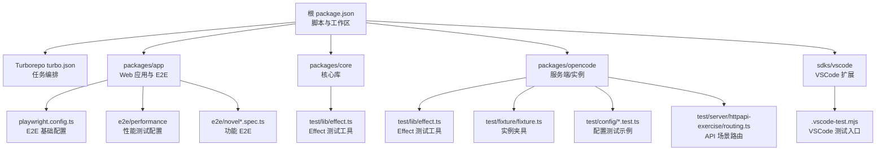
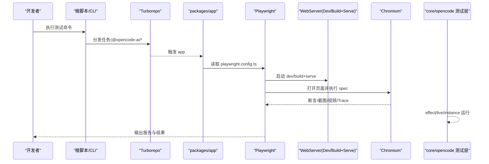
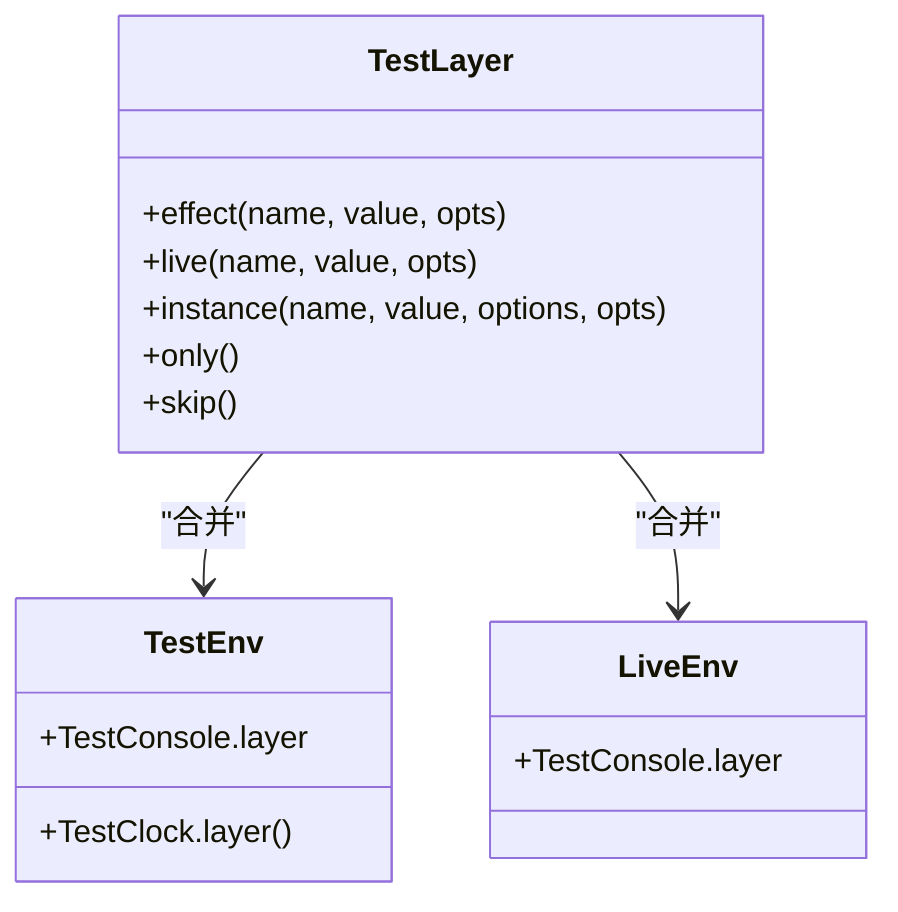
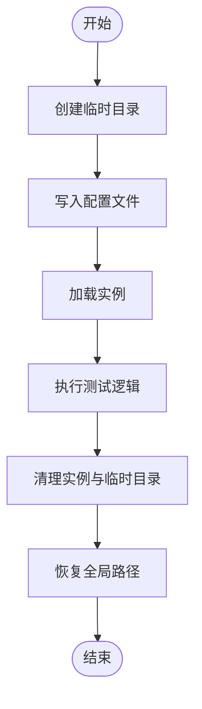
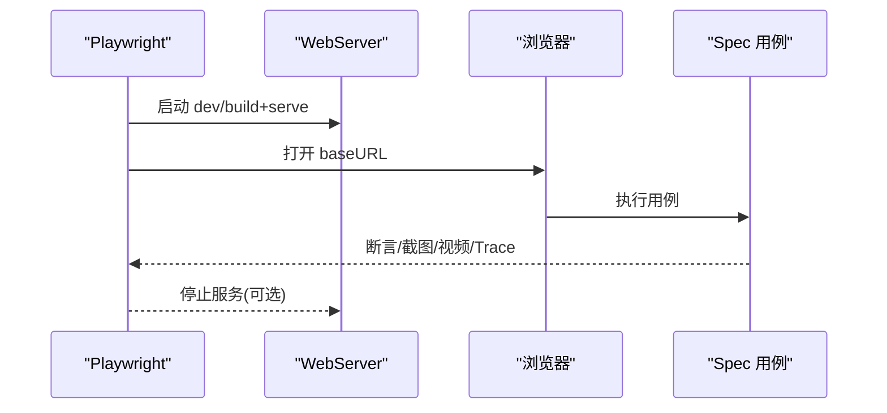
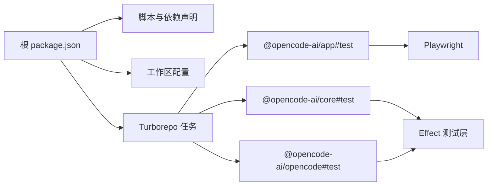

# 测试策略

<cite>
**本文引用的文件**
- [package.json](file://package.json)
- [turbo.json](file://turbo.json)
- [packages/app/playwright.config.ts](file://packages/app/playwright.config.ts)
- [packages/app/e2e/performance/playwright.config.ts](file://packages/app/e2e/performance/playwright.config.ts)
- [packages/app/e2e/performance/timeline-stability/playwright.config.ts](file://packages/app/e2e/performance/timeline-stability/playwright.config.ts)
- [packages/core/test/lib/effect.ts](file://packages/core/test/lib/effect.ts)
- [packages/opencode/test/lib/effect.ts](file://packages/opencode/test/lib/effect.ts)
- [packages/opencode/test/fixture/fixture.ts](file://packages/opencode/test/fixture/fixture.ts)
- [packages/opencode/test/config/config.test.ts](file://packages/opencode/test/config/config.test.ts)
- [packages/opencode/test/server/httpapi-exercise/routing.ts](file://packages/opencode/test/server/httpapi-exercise/routing.ts)
- [sdks/vscode/.vscode-test.mjs](file://sdks/vscode/.vscode-test.mjs)
</cite>

## 目录
1. [简介](#简介)
2. [项目结构](#项目结构)
3. [核心组件](#核心组件)
4. [架构总览](#架构总览)
5. [详细组件分析](#详细组件分析)
6. [依赖分析](#依赖分析)
7. [性能考量](#性能考量)
8. [故障排查指南](#故障排查指南)
9. [结论](#结论)
10. [附录](#附录)

## 简介
本测试策略文档面向 openNovel 工程，目标是建立覆盖单元测试、集成测试、端到端（E2E）与性能测试的完整体系。结合仓库现有配置与实践，明确测试框架选型、用例设计原则、覆盖率要求、持续集成策略、模拟数据与环境搭建方法，以及 TDD 落地方式与调试技巧。

## 项目结构
openNovel 采用多包工作区（workspaces），通过 Turborepo 编排任务，Playwright 负责 E2E 与性能测试，Effect/Either 风格在核心库中广泛使用，测试侧提供专用测试层与夹具。

**图表来源**
- [package.json:1-162](file://package.json#L1-L162)
- [turbo.json:1-34](file://turbo.json#L1-L34)
- [packages/app/playwright.config.ts:1-46](file://packages/app/playwright.config.ts#L1-L46)
- [packages/app/e2e/performance/playwright.config.ts:1-21](file://packages/app/e2e/performance/playwright.config.ts#L1-L21)
- [packages/core/test/lib/effect.ts:32-53](file://packages/core/test/lib/effect.ts#L32-L53)
- [packages/opencode/test/lib/effect.ts:49-147](file://packages/opencode/test/lib/effect.ts#L49-L147)
- [packages/opencode/test/fixture/fixture.ts:26-76](file://packages/opencode/test/fixture/fixture.ts#L26-L76)
- [packages/opencode/test/config/config.test.ts:152-191](file://packages/opencode/test/config/config.test.ts#L152-L191)
- [packages/opencode/test/server/httpapi-exercise/routing.ts:42-96](file://packages/opencode/test/server/httpapi-exercise/routing.ts#L42-L96)
- [sdks/vscode/.vscode-test.mjs:1-5](file://sdks/vscode/.vscode-test.mjs#L1-L5)

**章节来源**
- [package.json:1-162](file://package.json#L1-L162)
- [turbo.json:1-34](file://turbo.json#L1-L34)

## 核心组件
- 测试框架与运行器
  - Playwright：用于 E2E 与性能基准测试，支持浏览器自动化、截图/视频录制、Trace 追踪、并行与重试等。
  - Effect + Node Test Runner：核心与服务端模块使用 Effect 生态，测试侧提供 test/live/instance 三类运行模式与共享层能力。
  - VSCode 测试适配器：针对 VSCode 扩展的独立测试入口。
- 任务编排
  - Turborepo：统一 typecheck/build/test 任务，跨包依赖构建顺序与缓存。
- 关键配置文件
  - packages/app/playwright.config.ts：定义 WebServer、设备、超时、报告、并行度等。
  - packages/app/e2e/performance/playwright.config.ts：性能测试专用配置，构建产物并 serve。
  - packages/app/e2e/performance/timeline-stability/playwright.config.ts：时间线稳定性专项配置。

**章节来源**
- [packages/app/playwright.config.ts:1-46](file://packages/app/playwright.config.ts#L1-L46)
- [packages/app/e2e/performance/playwright.config.ts:1-21](file://packages/app/e2e/performance/playwright.config.ts#L1-L21)
- [packages/app/e2e/performance/timeline-stability/playwright.config.ts:1-17](file://packages/app/e2e/performance/timeline-stability/playwright.config.ts#L1-L17)
- [packages/core/test/lib/effect.ts:32-53](file://packages/core/test/lib/effect.ts#L32-L53)
- [packages/opencode/test/lib/effect.ts:49-147](file://packages/opencode/test/lib/effect.ts#L49-L147)
- [turbo.json:1-34](file://turbo.json#L1-L34)

## 架构总览
下图展示测试执行的关键路径：从根脚本到各包的测试任务，再到 Playwright 启动 WebServer 与浏览器，以及 Effect 测试层的注入与运行。

**图表来源**
- [turbo.json:1-34](file://turbo.json#L1-L34)
- [packages/app/playwright.config.ts:1-46](file://packages/app/playwright.config.ts#L1-L46)
- [packages/app/e2e/performance/playwright.config.ts:1-21](file://packages/app/e2e/performance/playwright.config.ts#L1-L21)
- [packages/core/test/lib/effect.ts:32-53](file://packages/core/test/lib/effect.ts#L32-L53)
- [packages/opencode/test/lib/effect.ts:49-147](file://packages/opencode/test/lib/effect.ts#L49-L147)

## 详细组件分析

### 单元测试（Effect 测试层）
- 目标
  - 对纯函数、Effect 管线、服务层进行快速、隔离、可重复的验证。
- 实现要点
  - 提供 test/live/instance 三种运行模式：
    - test：合并 TestConsole/TestClock 等测试环境。
    - live：真实时钟但保留控制台捕获。
    - instance：为每个测试创建临时实例目录，隔离文件系统与状态。
  - 支持 only/skip 与超时控制，便于聚焦调试。
  - 共享进程级 memoMap 的 sharedRun 可用于需要与内嵌 HTTP 服务器共享 Bus/Session 身份的场景。
- 建议
  - 优先使用 test 模式；涉及外部资源时使用 instance 模式。
  - 将耗时或易变的外部调用替换为测试层提供的服务桩。

**图表来源**
- [packages/core/test/lib/effect.ts:32-53](file://packages/core/test/lib/effect.ts#L32-L53)
- [packages/opencode/test/lib/effect.ts:49-147](file://packages/opencode/test/lib/effect.ts#L49-L147)

**章节来源**
- [packages/core/test/lib/effect.ts:32-53](file://packages/core/test/lib/effect.ts#L32-L53)
- [packages/opencode/test/lib/effect.ts:49-147](file://packages/opencode/test/lib/effect.ts#L49-L147)

### 集成测试（实例与配置）
- 目标
  - 验证服务实例生命周期、配置加载、文件系统交互、HTTP API 路由等。
- 实现要点
  - 夹具提供 withTestInstance/provideTestInstance/reloadTestInstance/disposeAllInstances，确保测试前后环境干净。
  - 配置测试通过临时目录写入 opencode.json，并在测试后恢复全局路径。
  - HTTP API 场景通过命令行参数过滤（include/startAt/stopAt）、超时与进度控制。
- 建议
  - 所有涉及磁盘/网络的操作均使用夹具隔离。
  - 使用 include/startAt/stopAt 精准定位失败场景。

**图表来源**
- [packages/opencode/test/fixture/fixture.ts:26-76](file://packages/opencode/test/fixture/fixture.ts#L26-L76)
- [packages/opencode/test/config/config.test.ts:152-191](file://packages/opencode/test/config/config.test.ts#L152-L191)
- [packages/opencode/test/server/httpapi-exercise/routing.ts:42-96](file://packages/opencode/test/server/httpapi-exercise/routing.ts#L42-L96)

**章节来源**
- [packages/opencode/test/fixture/fixture.ts:26-76](file://packages/opencode/test/fixture/fixture.ts#L26-L76)
- [packages/opencode/test/config/config.test.ts:152-191](file://packages/opencode/test/config/config.test.ts#L152-L191)
- [packages/opencode/test/server/httpapi-exercise/routing.ts:42-96](file://packages/opencode/test/server/httpapi-exercise/routing.ts#L42-L96)

### 端到端测试（Playwright）
- 目标
  - 验证用户流程、UI 行为、渲染稳定性与性能指标。
- 实现要点
  - 基础配置：指定测试目录、忽略规则、超时、重试、Reporter、WebServer 启动命令与端口、环境变量注入。
  - 性能测试：构建产物并通过静态服务启动，禁用并行，固定单 worker，输出独立报告。
  - 时间线稳定性：单独配置，严格保留失败时的 Trace/截图/视频。
- 建议
  - 本地开发使用 reuseExistingServer 加速迭代；CI 关闭复用保证隔离。
  - 使用 trace/on-first-retry 与截图/视频辅助定位问题。

**图表来源**
- [packages/app/playwright.config.ts:1-46](file://packages/app/playwright.config.ts#L1-L46)
- [packages/app/e2e/performance/playwright.config.ts:1-21](file://packages/app/e2e/performance/playwright.config.ts#L1-L21)
- [packages/app/e2e/performance/timeline-stability/playwright.config.ts:1-17](file://packages/app/e2e/performance/timeline-stability/playwright.config.ts#L1-L17)

**章节来源**
- [packages/app/playwright.config.ts:1-46](file://packages/app/playwright.config.ts#L1-L46)
- [packages/app/e2e/performance/playwright.config.ts:1-21](file://packages/app/e2e/performance/playwright.config.ts#L1-L21)
- [packages/app/e2e/performance/timeline-stability/playwright.config.ts:1-17](file://packages/app/e2e/performance/timeline-stability/playwright.config.ts#L1-L17)

### VSCode 扩展测试
- 目标
  - 验证扩展的测试适配与运行入口。
- 实现要点
  - 通过 @vscode/test-cli 定义测试文件匹配规则。
- 建议
  - 将扩展编译产物放在 out/test 下，保持与 .vscode-test.mjs 一致。

**章节来源**
- [sdks/vscode/.vscode-test.mjs:1-5](file://sdks/vscode/.vscode-test.mjs#L1-L5)

## 依赖分析
- 包管理与脚本
  - 根 package.json 声明 workspaces、devDependencies（如 husky、oxlint、prettier、turbo）与依赖项。
  - 根脚本 test 禁止在根目录直接运行测试，需在各包内执行。
- 任务编排
  - turbo.json 定义了 typecheck/build 与各包的 #test 任务，依赖 ^build 以确保前置构建完成。
- 测试相关依赖
  - Playwright 作为 E2E 与性能测试框架被多处引用。
  - Effect 测试工具在 core 与 opencode 包中分别提供。

**图表来源**
- [package.json:1-162](file://package.json#L1-L162)
- [turbo.json:1-34](file://turbo.json#L1-L34)

**章节来源**
- [package.json:1-162](file://package.json#L1-L162)
- [turbo.json:1-34](file://turbo.json#L1-L34)

## 性能考量
- 基准测试
  - 使用 Playwright 构建产物并 serve，固定单 worker，禁用并行，避免并发干扰指标。
  - 通过 Trace/截图/视频记录首次导航、Tab 切换、重绘等关键路径。
- 负载测试
  - 建议在 CI 中按矩阵维度（环境/文件规模/上下文）组合执行，逐步增加并发与数据规模。
- 指标采集
  - 利用浏览器性能 API 与自定义探针（如 timeline/stream probe）收集关键里程碑。
- 优化建议
  - 将不稳定或长尾用例拆分至独立 suite，避免污染整体基线。
  - 使用只读数据集与预置状态减少 IO 抖动。

[本节为通用指导，不直接分析具体文件]

## 故障排查指南
- Playwright 常见问题
  - 端口冲突：检查 PLAYWRIGHT_PORT/SERVER_PORT 环境变量与 webServer 配置。
  - 超时：适当提高 expect.timeout 与整体 timeout，必要时开启 retries。
  - 报告缺失：确认 reporter 输出目录与权限，CI 环境下保留 trace/video。
- Effect 测试问题
  - 服务未注入：确认 layer 是否正确 provideMerge，必要时使用 sharedRun 共享实例。
  - 时钟/控制台：使用 TestClock/TestConsole 层确保确定性与时序稳定。
- 实例与配置
  - 清理不彻底：使用 disposeAllInstances 与临时目录隔离，避免残留影响后续用例。
  - 配置路径污染：在 withGlobalConfigDir 中保存/恢复全局路径。

**章节来源**
- [packages/app/playwright.config.ts:1-46](file://packages/app/playwright.config.ts#L1-L46)
- [packages/opencode/test/lib/effect.ts:49-147](file://packages/opencode/test/lib/effect.ts#L49-L147)
- [packages/opencode/test/fixture/fixture.ts:26-76](file://packages/opencode/test/fixture/fixture.ts#L26-L76)

## 结论
openNovel 的测试体系以 Playwright 为核心支撑 E2E 与性能测试，配合 Effect 测试层实现高质量单元与集成测试。通过 Turborepo 统一编排，可在本地与 CI 中保持一致的执行体验。建议在此基础上完善覆盖率门禁、性能基线与回归矩阵，持续提升交付质量与稳定性。

[本节为总结性内容，不直接分析具体文件]

## 附录

### 测试框架选择与用例设计原则
- 框架选择
  - 单元测试：Effect + Node Test Runner（test/live/instance）。
  - 集成测试：Effect 夹具 + 临时实例目录 + 配置隔离。
  - E2E：Playwright（Chromium），支持截图/视频/Trace。
  - 性能：Playwright 构建产物 + 静态服务 + 单 worker。
- 用例设计原则
  - 单一职责：每个用例仅验证一个行为或边界条件。
  - 可重复：无状态或显式初始化，避免隐式依赖。
  - 可观测：断言清晰，失败时附带截图/视频/Trace。
  - 可维护：用例命名体现意图，分组合理，避免耦合。

[本节为通用指导，不直接分析具体文件]

### 覆盖率要求
- 建议
  - 核心库（core/opencode）设置行覆盖率阈值（如 ≥80%），关键模块（配置、序列化、HTTP 路由）≥90%。
  - UI 组件可按需设置，优先关注交互热点与复杂逻辑。
- 实施
  - 在包级测试脚本中启用覆盖率插件（如 V8/Istanbul），CI 中聚合报告并阻断低覆盖率提交。

[本节为通用指导，不直接分析具体文件]

### 持续集成配置
- 任务编排
  - 使用 turbo.json 的 #test 任务，依赖 ^build，确保构建产物可用。
- 环境与变量
  - 通过 globalPassThroughEnv 传递 CI 等必要变量。
  - Playwright 在 CI 关闭 server 复用，开启重试与报告归档。
- 建议
  - 分阶段执行：先单元/集成，再 E2E，最后性能基准。
  - 缓存依赖与构建产物，缩短流水线时长。

**章节来源**
- [turbo.json:1-34](file://turbo.json#L1-L34)
- [packages/app/playwright.config.ts:1-46](file://packages/app/playwright.config.ts#L1-L46)

### 模拟数据与测试环境搭建
- 模拟数据
  - 使用临时目录与 fixtures 生成最小化数据集，避免外部依赖。
  - 对 HTTP API 使用路由过滤（include/startAt/stopAt）快速定位场景。
- 环境搭建
  - 本地：PLAYWRIGHT_PORT/SERVER_PORT 指向本机，reuseExistingServer=true 加速迭代。
  - CI：构建产物 serve，禁用复用，固定 workers=1，保留失败产物。

**章节来源**
- [packages/opencode/test/fixture/fixture.ts:26-76](file://packages/opencode/test/fixture/fixture.ts#L26-L76)
- [packages/opencode/test/server/httpapi-exercise/routing.ts:42-96](file://packages/opencode/test/server/httpapi-exercise/routing.ts#L42-L96)
- [packages/app/playwright.config.ts:1-46](file://packages/app/playwright.config.ts#L1-L46)
- [packages/app/e2e/performance/playwright.config.ts:1-21](file://packages/app/e2e/performance/playwright.config.ts#L1-L21)

### 性能基准与负载测试方法
- 基准
  - 使用构建产物 + 静态服务，固定单 worker，记录首次导航、Tab 切换、重绘等指标。
- 负载
  - 通过矩阵维度（环境/数据规模/并发）逐步加压，观察吞吐与延迟变化。
- 工具
  - 浏览器性能 API 与自定义探针（timeline/stream probe）采集关键路径。

[本节为通用指导，不直接分析具体文件]

### 测试驱动开发（TDD）实践
- 流程
  - 先写失败的测试用例（红），再实现最小代码使其通过（绿），最后重构（蓝）。
- 在本项目中的应用
  - 对 Effect 管线与业务逻辑，优先编写 unit 测试，使用 test/live/instance 分层验证。
  - 对 UI 交互，先写 E2E 用例描述期望行为，再通过 Playwright 断言。
- 建议
  - 将关键路径用例纳入回归套件，CI 中强制通过。

[本节为通用指导，不直接分析具体文件]