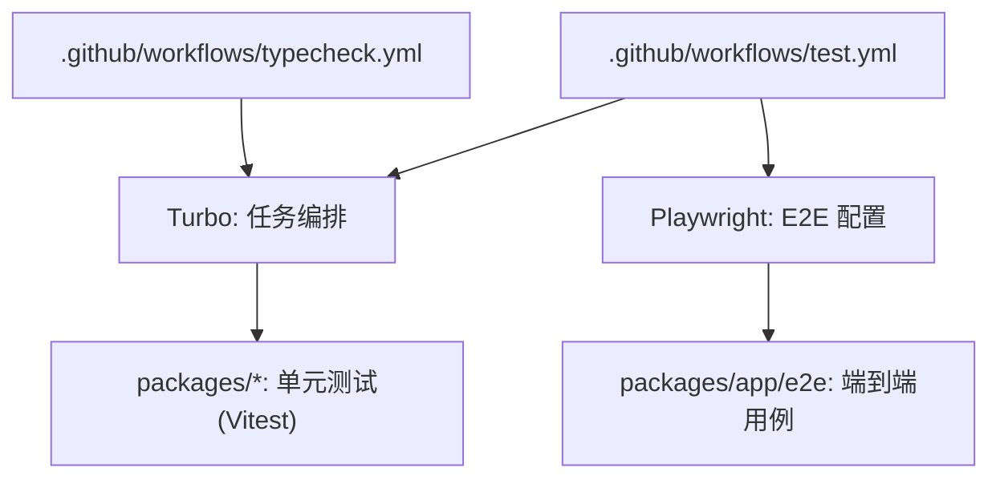
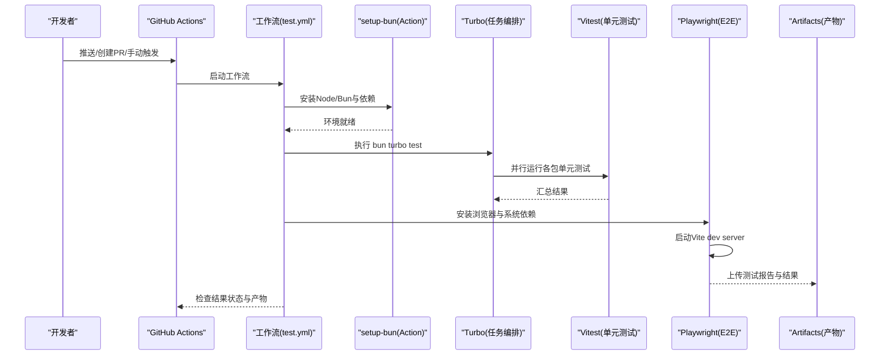
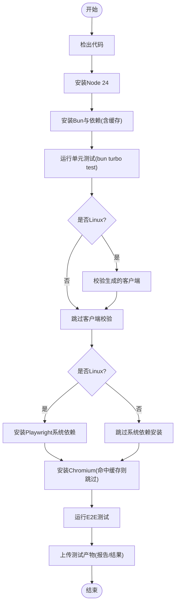
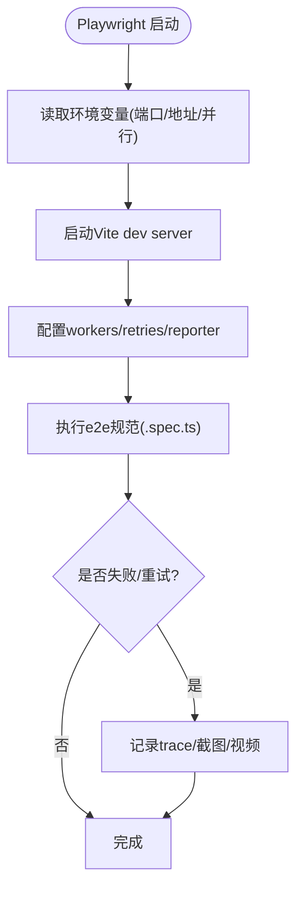
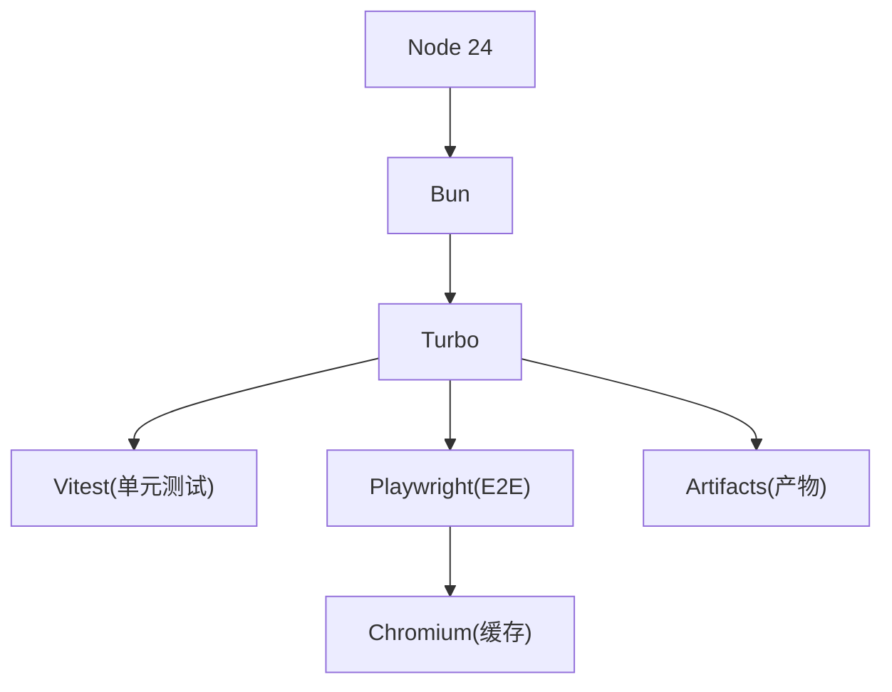

# 测试自动化

<cite>
**本文引用的文件**
- [test.yml](file://.github/workflows/test.yml)
- [typecheck.yml](file://.github/workflows/typecheck.yml)
- [setup-bun/action.yml](file://.github/actions/setup-bun/action.yml)
- [turbo.json](file://turbo.json)
- [package.json](file://package.json)
- [playwright.config.ts](file://packages/app/playwright.config.ts)
- [README.md](file://packages/app/README.md)
- [.gitignore](file://packages/app/.gitignore)
</cite>

## 目录
1. [简介](#简介)
2. [项目结构](#项目结构)
3. [核心组件](#核心组件)
4. [架构总览](#架构总览)
5. [详细组件分析](#详细组件分析)
6. [依赖关系分析](#依赖关系分析)
7. [性能考量](#性能考量)
8. [故障排查指南](#故障排查指南)
9. [结论](#结论)
10. [附录](#附录)

## 简介
本文件面向 openNovel 项目的测试自动化，覆盖持续集成（CI）流水线中的测试执行配置、并行与结果收集机制、报告生成与通知策略，以及本地测试脚本与环境管理。项目采用多包仓库（workspaces），通过 Turbo 编排任务，使用 Bun 作为运行时与包管理器，单元测试基于 Vitest，端到端（E2E）测试基于 Playwright。

## 项目结构
- CI 工作流位于 .github/workflows：
  - test.yml：定义单元与 E2E 测试任务矩阵、缓存、浏览器安装与产物上传。
  - typecheck.yml：类型检查任务。
- 自定义 Action 位于 .github/actions/setup-bun：统一 Node/Bun 环境初始化与依赖缓存。
- 任务编排由 turbo.json 定义，声明各包的 test 任务及其依赖构建顺序。
- 根 package.json 提供脚本入口与工作区配置；packages/app 包含 Playwright 配置与 E2E 用例。

**图表来源**
- [test.yml:1-152](file://.github/workflows/test.yml#L1-L152)
- [typecheck.yml:1-22](file://.github/workflows/typecheck.yml#L1-L22)
- [turbo.json:1-34](file://turbo.json#L1-L34)
- [playwright.config.ts:1-45](file://packages/app/playwright.config.ts#L1-L45)

**章节来源**
- [test.yml:1-152](file://.github/workflows/test.yml#L1-L152)
- [typecheck.yml:1-22](file://.github/workflows/typecheck.yml#L1-L22)
- [turbo.json:1-34](file://turbo.json#L1-L34)
- [package.json:1-162](file://package.json#L1-L162)

## 核心组件
- CI 测试工作流（test.yml）
  - 触发条件：push 到 dev 分支、PR、手动触发。
  - 并发控制：按分支/PR 分组，取消旧运行。
  - 任务矩阵：Linux 与 Windows 双平台并行。
  - 缓存：Turbo 缓存与 Playwright 浏览器缓存。
  - 产物：上传 Playwright 测试结果与报告。
- 类型检查（typecheck.yml）
  - 在 PR 与 dev 推送时运行，确保类型安全。
- 环境准备（setup-bun/action.yml）
  - 固定 Node 版本，安装并缓存 Bun，处理跨平台差异与依赖安装。
- 任务编排（turbo.json）
  - 为多个包的 test 任务声明依赖构建顺序与输出规则。
- E2E 配置（packages/app/playwright.config.ts）
  - 自动启动 Vite dev server，配置 workers、重试、截图/视频/trace 策略，支持环境变量覆盖端口与后端地址。

**章节来源**
- [test.yml:1-152](file://.github/workflows/test.yml#L1-L152)
- [typecheck.yml:1-22](file://.github/workflows/typecheck.yml#L1-L22)
- [setup-bun/action.yml:1-74](file://.github/actions/setup-bun/action.yml#L1-L74)
- [turbo.json:1-34](file://turbo.json#L1-L34)
- [playwright.config.ts:1-45](file://packages/app/playwright.config.ts#L1-L45)

## 架构总览
下图展示了从代码提交到测试执行的完整链路，包括环境准备、任务分发、并行执行、产物收集与报告生成。

**图表来源**
- [test.yml:1-152](file://.github/workflows/test.yml#L1-L152)
- [setup-bun/action.yml:1-74](file://.github/actions/setup-bun/action.yml#L1-L74)
- [turbo.json:1-34](file://turbo.json#L1-L34)
- [playwright.config.ts:1-45](file://packages/app/playwright.config.ts#L1-L45)

## 详细组件分析

### CI 测试工作流（test.yml）
- 触发与并发
  - 触发事件：push(dev)、pull_request、workflow_dispatch。
  - 并发组：dev 分支独立组，其他分支/PR共享组，且可取消进行中任务。
- 任务矩阵
  - unit：Linux 与 Windows 双平台，fail-fast=false 保证全部结果。
  - e2e：同样双平台，设置 PLAYWRIGHT_BROWSERS_PATH 以缓存浏览器。
- 缓存策略
  - Turbo 缓存路径：node_modules/.cache/turbo，键包含 OS、turbo.json、package.json 哈希与 commit。
  - Playwright 浏览器缓存：按 OS、架构、版本号与 chromium 区分。
- 执行步骤
  - 单元测试：bun turbo test，设置 OPENCODE_EXPERIMENTAL_DISABLE_FILEWATCHER 适配 Windows。
  - 客户端生成校验：Linux 下运行 packages/client check:generated。
  - HTTP API 演练门控：Linux 下运行 packages/opencode test:httpapi。
  - E2E 测试：bun --cwd packages/app test:e2e:local，设置 CI=true。
  - 产物上传：always() 条件下上传 test-results 与 playwright-report，保留 7 天。

**图表来源**
- [test.yml:1-152](file://.github/workflows/test.yml#L1-L152)

**章节来源**
- [test.yml:1-152](file://.github/workflows/test.yml#L1-L152)

### 类型检查工作流（typecheck.yml）
- 触发：push(dev)、PR(dev)、手动触发。
- 执行：安装 Bun 后运行 bun typecheck。
- 目的：确保 TypeScript 类型正确，避免类型回归。

**章节来源**
- [typecheck.yml:1-22](file://.github/workflows/typecheck.yml#L1-L22)

### 环境准备（setup-bun/action.yml）
- Node 版本：固定为 24，满足 node-gyp 要求。
- Bun 安装：根据 runner 架构与 OS 选择预编译包或从 packageManager 指定版本下载。
- 依赖缓存：使用 bun pm cache 目录，按 OS 与 bun.lock 哈希缓存。
- 依赖安装：Windows 使用 hoisted linker，其他平台默认安装；必要时安装 setuptools 兼容 distutils。

**章节来源**
- [setup-bun/action.yml:1-74](file://.github/actions/setup-bun/action.yml#L1-L74)

### 任务编排（turbo.json）
- 全局环境变量：CI、OPENCODE_DISABLE_SHARE。
- 任务定义：
  - opencode#test、@opencode-ai/core#test、@opencode-ai/app#test、@opencode-ai/ui#test、@opencode-ai/session-ui#test 均依赖 ^build。
  - 输出目录：build 产物至 dist/**。
- 作用：确保测试前完成依赖包的构建，提升缓存命中率与稳定性。

**章节来源**
- [turbo.json:1-34](file://turbo.json#L1-L34)

### E2E 测试配置（packages/app/playwright.config.ts）
- 服务器启动：webServer 自动启动 Vite dev server，监听 0.0.0.0 与指定端口。
- 并行与重试：
  - workers 可通过环境变量 PLAYWRIGHT_WORKERS 或 CI 模式设定。
  - fullyParallel 可由 PLAYWRIGHT_FULLY_PARALLEL=1 开启。
  - retries：CI 下为 2，本地为 0。
- 报告与调试：
  - reporter 输出 HTML 与 line 格式，HTML 报告位于 e2e/playwright-report。
  - trace/screenshot/video 策略：首次重试记录 trace，失败时截图与保留视频。
- 环境变量：
  - PLAYWRIGHT_PORT、PLAYWRIGHT_BASE_URL、PLAYWRIGHT_SERVER_HOST、PLAYWRIGHT_SERVER_PORT 用于覆盖前端与后端地址。
- 忽略规则：performance 目录在非性能模式下被忽略。

**图表来源**
- [playwright.config.ts:1-45](file://packages/app/playwright.config.ts#L1-L45)

**章节来源**
- [playwright.config.ts:1-45](file://packages/app/playwright.config.ts#L1-L45)
- [README.md:32-47](file://packages/app/README.md#L32-L47)
- [.gitignore:1-3](file://packages/app/.gitignore#L1-L3)

## 依赖关系分析
- 运行时与工具链
  - Node 24：供 setup-bun 与部分原生模块编译。
  - Bun：包管理与运行器，配合 turbo 执行任务。
  - Turbo：任务编排与缓存。
  - Vitest：单元测试框架（由包内依赖引入）。
  - Playwright：E2E 测试框架与浏览器管理。
- 缓存与产物
  - Turbo 缓存：node_modules/.cache/turbo。
  - Playwright 浏览器缓存：.playwright-browsers。
  - 产物上传：e2e/test-results 与 e2e/playwright-report。

**图表来源**
- [test.yml:1-152](file://.github/workflows/test.yml#L1-L152)
- [setup-bun/action.yml:1-74](file://.github/actions/setup-bun/action.yml#L1-L74)
- [turbo.json:1-34](file://turbo.json#L1-L34)
- [playwright.config.ts:1-45](file://packages/app/playwright.config.ts#L1-L45)

**章节来源**
- [test.yml:1-152](file://.github/workflows/test.yml#L1-L152)
- [setup-bun/action.yml:1-74](file://.github/actions/setup-bun/action.yml#L1-L74)
- [turbo.json:1-34](file://turbo.json#L1-L34)
- [playwright.config.ts:1-45](file://packages/app/playwright.config.ts#L1-L45)

## 性能考量
- 并行执行
  - Playwright workers：通过环境变量或 CI 模式调整，平衡速度与资源占用。
  - Turbo 任务并行：按包粒度并行执行，减少整体耗时。
- 缓存优化
  - Turbo 缓存键包含 OS、配置文件哈希与 commit，提高命中概率。
  - Playwright 浏览器缓存按 OS、架构与版本区分，避免重复下载。
- 超时与重试
  - E2E 超时设置为 60s，expect 超时 10s，CI 下重试 2 次，增强稳定性。
- 资源隔离
  - performance 目录在非性能模式下被忽略，降低常规测试负载。

[本节为通用指导，不直接分析具体文件]

## 故障排查指南
- 常见问题定位
  - 浏览器安装失败：确认 Linux 系统依赖已安装，检查缓存键是否匹配当前 OS/架构/版本。
  - 端口冲突：调整 PLAYWRIGHT_PORT 与 PLAYWRIGHT_BASE_URL，避免与本地服务冲突。
  - 后端不可达：设置 PLAYWRIGHT_SERVER_HOST 与 PLAYWRIGHT_SERVER_PORT，确保后端可达。
  - 并行导致不稳定：降低 workers 或关闭 fullyParallel，观察是否改善。
- 日志与产物
  - 查看 HTML 报告：e2e/playwright-report。
  - 查看失败用例的 trace/截图/视频：e2e/test-results。
  - CI 产物：Actions Artifacts 中下载 playwright-* 产物。
- 本地复现
  - 参考 packages/app/README.md 的 E2E 使用说明，安装 Chromium 后运行本地脚本。

**章节来源**
- [playwright.config.ts:1-45](file://packages/app/playwright.config.ts#L1-L45)
- [README.md:32-47](file://packages/app/README.md#L32-L47)
- [.gitignore:1-3](file://packages/app/.gitignore#L1-L3)

## 结论
openNovel 的测试自动化通过 GitHub Actions + Turbo + Bun + Vitest + Playwright 的组合，实现了跨平台、高并行的单元与 E2E 测试流水线。合理的缓存策略、严格的超时与重试机制、完善的产物上传与报告生成，保障了质量与效率。建议在生产环境中继续优化 workers 与缓存键，结合监控与告警进一步提升稳定性。

[本节为总结性内容，不直接分析具体文件]

## 附录
- 本地测试自动化脚本使用方法
  - 安装浏览器：bunx playwright install chromium。
  - 运行 E2E：bun run test:e2e:local（可在 packages/app 目录下执行）。
  - 过滤用例：追加 --grep 参数筛选特定测试。
  - 环境变量：
    - PLAYWRIGHT_SERVER_HOST / PLAYWRIGHT_SERVER_PORT：后端地址（默认 localhost:4096）。
    - PLAYWRIGHT_PORT：Vite dev server 端口（默认 3000）。
    - PLAYWRIGHT_BASE_URL：覆盖基础 URL。
- 测试环境管理
  - Node 版本：固定 24，满足原生模块编译需求。
  - Bun 版本：由 packageManager 字段指定，Action 自动下载对应平台二进制。
  - 依赖更新策略：
    - 使用 catalog 统一管理依赖版本。
    - 更新后同步 bun.lock，确保缓存键变化，触发重新安装。
    - 在 CI 中启用缓存保存（非 PR）以减少后续构建时间。

**章节来源**
- [README.md:32-47](file://packages/app/README.md#L32-L47)
- [setup-bun/action.yml:1-74](file://.github/actions/setup-bun/action.yml#L1-L74)
- [package.json:1-162](file://package.json#L1-L162)