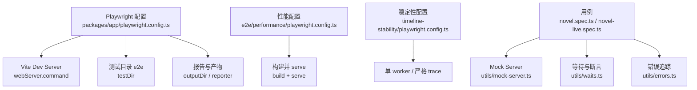
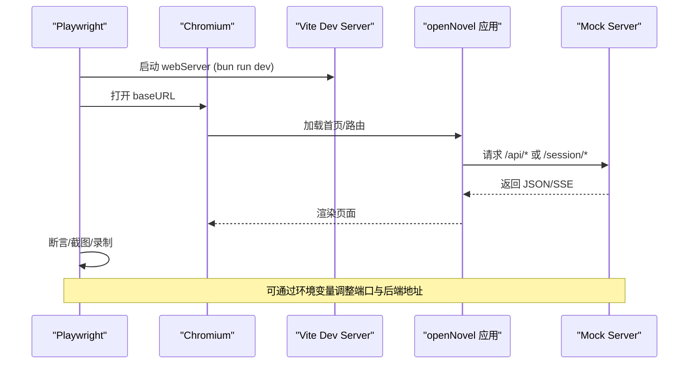
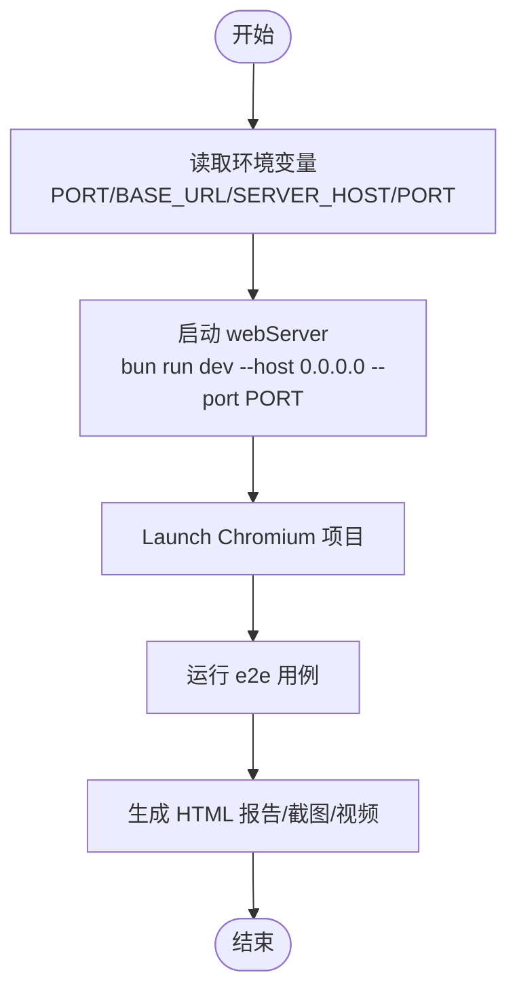
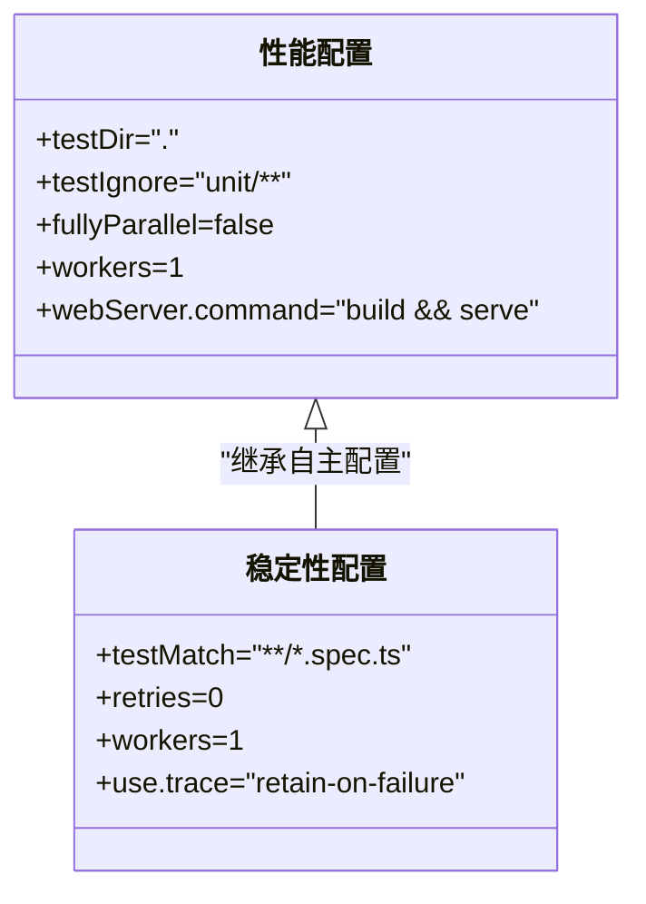
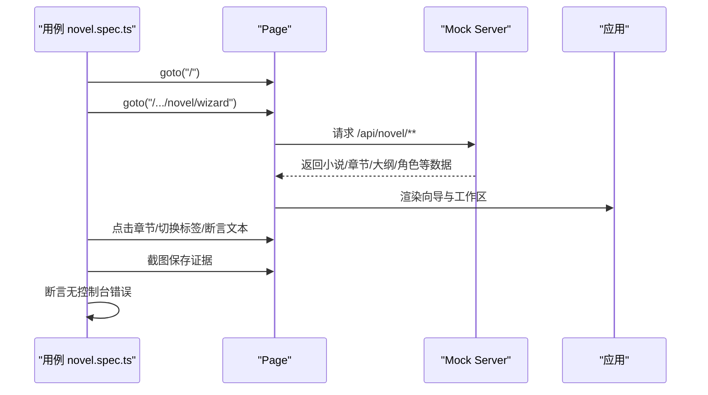
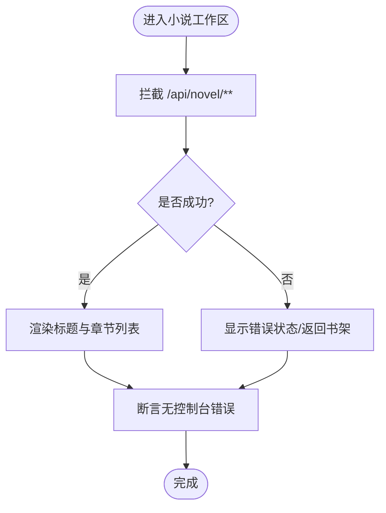
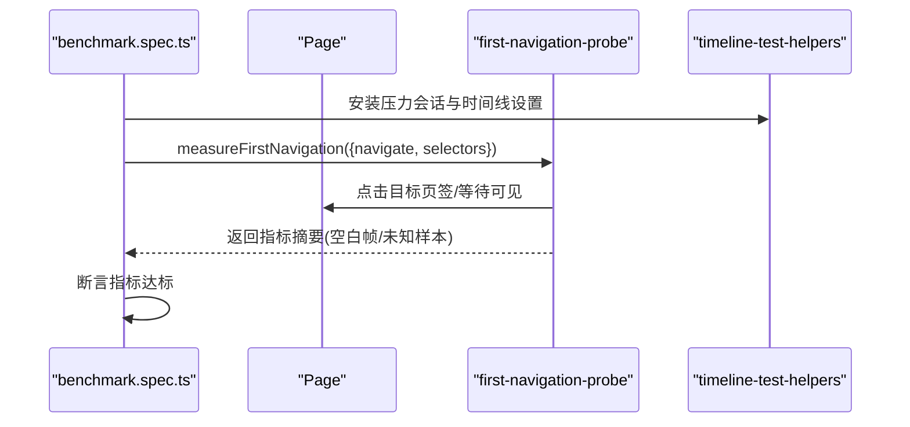
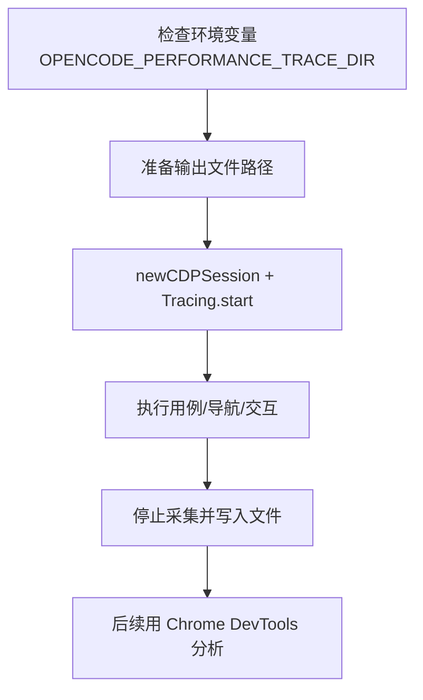
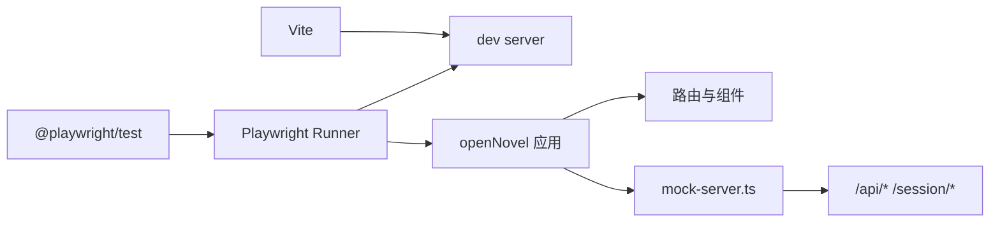

# 端到端测试

<cite>
**本文引用的文件**   
- [packages/app/playwright.config.ts](file://packages/app/playwright.config.ts)
- [packages/app/e2e/performance/playwright.config.ts](file://packages/app/e2e/performance/playwright.config.ts)
- [packages/app/e2e/performance/timeline-stability/playwright.config.ts](file://packages/app/e2e/performance/timeline-stability/playwright.config.ts)
- [packages/app/package.json](file://packages/app/package.json)
- [packages/app/README.md](file://packages/app/README.md)
- [packages/app/e2e/novel.spec.ts](file://packages/app/e2e/novel.spec.ts)
- [packages/app/e2e/novel/novel-live.spec.ts](file://packages/app/e2e/novel/novel-live.spec.ts)
- [packages/app/e2e/utils/mock-server.ts](file://packages/app/e2e/utils/mock-server.ts)
- [packages/app/e2e/utils/errors.ts](file://packages/app/e2e/utils/errors.ts)
- [packages/app/e2e/utils/waits.ts](file://packages/app/e2e/utils/waits.ts)
- [packages/app/e2e/performance/timeline/first-navigation-benchmark.spec.ts](file://packages/app/e2e/performance/timeline/first-navigation-benchmark.spec.ts)
- [packages/app/e2e/performance/chrome-trace.ts](file://packages/app/e2e/performance/chrome-trace.ts)
</cite>

## 目录
1. [简介](#简介)
2. [项目结构](#项目结构)
3. [核心组件](#核心组件)
4. [架构总览](#架构总览)
5. [详细组件分析](#详细组件分析)
6. [依赖分析](#依赖分析)
7. [性能考虑](#性能考虑)
8. [故障排查指南](#故障排查指南)
9. [结论](#结论)
10. [附录](#附录)

## 简介
本文件面向 openNovel（位于 packages/app）的端到端（E2E）测试，系统性说明框架选型、配置与运行方式，覆盖用户交互场景自动化、性能指标监控、测试数据管理、浏览器环境配置以及跨浏览器与移动端策略。本项目采用 Playwright 作为 E2E 测试框架，结合 Vite dev server 与自定义 webServer 启动，配合 Mock Server 模拟后端接口，提供功能与稳定性两类用例集。

## 项目结构
- 测试根目录：packages/app/e2e
- 主配置：packages/app/playwright.config.ts
- 性能专项配置：packages/app/e2e/performance/playwright.config.ts、packages/app/e2e/performance/timeline-stability/playwright.config.ts
- 用例组织：
  - 功能流程：packages/app/e2e/novel.spec.ts、packages/app/e2e/novel/novel-live.spec.ts
  - 性能基准：packages/app/e2e/performance/timeline/*.spec.ts
- 工具与辅助：
  - Mock 服务端：packages/app/e2e/utils/mock-server.ts
  - 错误追踪：packages/app/e2e/utils/errors.ts
  - 等待与断言：packages/app/e2e/utils/waits.ts
  - Chrome Trace 采集：packages/app/e2e/performance/chrome-trace.ts

**图表来源** 
- [packages/app/playwright.config.ts:1-45](file://packages/app/playwright.config.ts#L1-L45)
- [packages/app/e2e/performance/playwright.config.ts:1-20](file://packages/app/e2e/performance/playwright.config.ts#L1-L20)
- [packages/app/e2e/performance/timeline-stability/playwright.config.ts:1-17](file://packages/app/e2e/performance/timeline-stability/playwright.config.ts#L1-L17)

**章节来源**
- [packages/app/playwright.config.ts:1-45](file://packages/app/playwright.config.ts#L1-L45)
- [packages/app/e2e/performance/playwright.config.ts:1-20](file://packages/app/e2e/performance/playwright.config.ts#L1-L20)
- [packages/app/e2e/performance/timeline-stability/playwright.config.ts:1-17](file://packages/app/e2e/performance/timeline-stability/playwright.config.ts#L1-L17)
- [packages/app/package.json:14-31](file://packages/app/package.json#L14-L31)
- [packages/app/README.md:32-47](file://packages/app/README.md#L32-L47)

## 核心组件
- Playwright 主配置
  - 测试目录、忽略规则、超时、重试、并行度、Reporter、webServer、use 选项、projects 等
  - 通过环境变量控制端口、基础 URL、后端地址、CI 行为等
- 性能与稳定性子配置
  - 性能模式：使用生产构建 + serve，禁用并行，固定输出目录与 Reporter
  - 稳定性模式：单 worker、保留失败 trace/video/screenshot
- 脚本入口
  - test:e2e、test:e2e:local、test:e2e:ui、test:e2e:report、test:stability、test:bench
- 用例与工具
  - 小说全流程与实时刷新用例
  - Mock 服务端统一拦截 OpenCode API
  - 页面错误收集与稳定等待封装

**章节来源**
- [packages/app/playwright.config.ts:1-45](file://packages/app/playwright.config.ts#L1-L45)
- [packages/app/e2e/performance/playwright.config.ts:1-20](file://packages/app/e2e/performance/playwright.config.ts#L1-L20)
- [packages/app/e2e/performance/timeline-stability/playwright.config.ts:1-17](file://packages/app/e2e/performance/timeline-stability/playwright.config.ts#L1-L17)
- [packages/app/package.json:14-31](file://packages/app/package.json#L14-L31)
- [packages/app/e2e/utils/mock-server.ts:1-190](file://packages/app/e2e/utils/mock-server.ts#L1-L190)
- [packages/app/e2e/utils/errors.ts:1-19](file://packages/app/e2e/utils/errors.ts#L1-L19)
- [packages/app/e2e/utils/waits.ts:1-12](file://packages/app/e2e/utils/waits.ts#L1-L12)

## 架构总览
下图展示了 Playwright 在 E2E 执行时的关键组件与调用关系：Playwright 驱动 Chromium，自动启动 Vite dev server，并通过 page.route 将请求路由到本地 Mock Server；用例通过等待与断言验证 UI 状态，必要时采集 Trace 与截图。

**图表来源** 
- [packages/app/playwright.config.ts:23-32](file://packages/app/playwright.config.ts#L23-L32)
- [packages/app/e2e/utils/mock-server.ts:54-143](file://packages/app/e2e/utils/mock-server.ts#L54-L143)

## 详细组件分析

### Playwright 主配置与运行
- 测试目录与忽略：默认 e2e，性能相关可按环境变量过滤
- 超时与重试：全局超时、expect 超时、CI 下重试次数
- Reporter：HTML 与 line 输出，失败时截图与视频保留
- webServer：自动启动 Vite dev server，注入后端主机与端口环境变量
- use：baseURL、trace 策略、截图与视频策略
- projects：当前仅 chromium 桌面配置

**图表来源** 
- [packages/app/playwright.config.ts:1-45](file://packages/app/playwright.config.ts#L1-L45)

**章节来源**
- [packages/app/playwright.config.ts:1-45](file://packages/app/playwright.config.ts#L1-L45)
- [packages/app/README.md:32-47](file://packages/app/README.md#L32-L47)

### 性能与稳定性子配置
- 性能模式
  - 使用生产构建 + serve，确保更接近真实部署
  - 关闭并行，固定 workers=1，避免并发对时序的影响
  - 输出独立目录与报告
- 稳定性模式
  - 单 worker，严格保留失败 trace/video/screenshot
  - 用于时间线布局连续性、滚动、虚拟化等稳定性断言

**图表来源** 
- [packages/app/e2e/performance/playwright.config.ts:1-20](file://packages/app/e2e/performance/playwright.config.ts#L1-L20)
- [packages/app/e2e/performance/timeline-stability/playwright.config.ts:1-17](file://packages/app/e2e/performance/timeline-stability/playwright.config.ts#L1-L17)

**章节来源**
- [packages/app/e2e/performance/playwright.config.ts:1-20](file://packages/app/e2e/performance/playwright.config.ts#L1-L20)
- [packages/app/e2e/performance/timeline-stability/playwright.config.ts:1-17](file://packages/app/e2e/performance/timeline-stability/playwright.config.ts#L1-L17)

### 用户交互场景：小说全流程 E2E
- 目标：从书架 → 向导 → 工作区 → 阅读器 → 审批 → 编辑器 → 面板的全链路验证
- 关键点：
  - 使用 mockOpenCodeServer 初始化标准 OpenCode 接口
  - 通过 page.route 拦截 /api/novel/** 返回预设数据
  - 断言标题、标签、侧边栏、阅读器内容、编辑框、右侧面板
  - 截图证据路径与无控制台错误断言

**图表来源** 
- [packages/app/e2e/novel.spec.ts:149-443](file://packages/app/e2e/novel.spec.ts#L149-L443)
- [packages/app/e2e/utils/mock-server.ts:54-143](file://packages/app/e2e/utils/mock-server.ts#L54-L143)

**章节来源**
- [packages/app/e2e/novel.spec.ts:1-445](file://packages/app/e2e/novel.spec.ts#L1-445)
- [packages/app/e2e/utils/mock-server.ts:1-190](file://packages/app/e2e/utils/mock-server.ts#L1-L190)

### 实时刷新与错误恢复：novel-live
- 目标：验证 useNovelLiveInvalidation 钩子与 SSE 事件流不引发错误
- 关键点：
  - 注册 /api/novel/** 路由返回正常数据
  - 断言标题与章节列表可见
  - 模拟 500 错误后，页面应展示“返回书架”且无崩溃

**图表来源** 
- [packages/app/e2e/novel/novel-live.spec.ts:90-217](file://packages/app/e2e/novel/novel-live.spec.ts#L90-L217)

**章节来源**
- [packages/app/e2e/novel/novel-live.spec.ts:1-218](file://packages/app/e2e/novel/novel-live.spec.ts#L1-L218)

### 性能基准：首次导航与时间线稳定性
- 首次导航基准
  - 测量未访问会话页签的首次绘制，避免空白帧
  - 通过 measureFirstNavigation 与选择器定位消息元素
- 时间线稳定性
  - 单 worker 运行，采样 DOM 布局与可见性状态
  - 断言锚点保持、滚动一致性、虚拟化顺序等

**图表来源** 
- [packages/app/e2e/performance/timeline/first-navigation-benchmark.spec.ts:17-74](file://packages/app/e2e/performance/timeline/first-navigation-benchmark.spec.ts#L17-L74)

**章节来源**
- [packages/app/e2e/performance/timeline/first-navigation-benchmark.spec.ts:1-88](file://packages/app/e2e/performance/timeline/first-navigation-benchmark.spec.ts#L1-L88)

### Chrome Trace 采集
- 用途：记录浏览器性能轨迹，便于分析首屏、重绘、JS 执行等
- 实现要点：
  - 通过环境变量 OPENCODE_PERFORMANCE_TRACE_DIR 指定输出目录
  - 使用 CDP Tracing.start 开启采集，按类别包含/排除
  - 支持 selector 相关调试类别

**图表来源** 
- [packages/app/e2e/performance/chrome-trace.ts:21-47](file://packages/app/e2e/performance/chrome-trace.ts#L21-L47)

**章节来源**
- [packages/app/e2e/performance/chrome-trace.ts:1-47](file://packages/app/e2e/performance/chrome-trace.ts#L1-L47)

## 依赖分析
- 运行时依赖
  - @playwright/test：E2E 框架与设备矩阵
  - Vite：开发服务器与预览服务
- 测试依赖
  - 自定义 Mock Server 与工具模块
  - Bun 作为脚本运行器
- 外部集成
  - 通过环境变量注入后端地址与端口
  - CI 环境下启用重试与禁止 only

**图表来源** 
- [packages/app/package.json:33-48](file://packages/app/package.json#L33-L48)
- [packages/app/e2e/utils/mock-server.ts:54-143](file://packages/app/e2e/utils/mock-server.ts#L54-L143)

**章节来源**
- [packages/app/package.json:14-48](file://packages/app/package.json#L14-L48)
- [packages/app/e2e/utils/mock-server.ts:1-190](file://packages/app/e2e/utils/mock-server.ts#L1-L190)

## 性能考虑
- 首屏加载与渲染稳定性
  - 使用性能专用配置（构建+serve），关闭并行，保证结果可重复
  - 通过首次导航基准与时间线稳定性用例评估空白帧与抖动
- 指标采集
  - 使用 Chrome Trace 捕获关键阶段，结合选择器断言内容可见性
  - 通过 expectNoSmokeErrors 与 trackPageErrors 保障无控制台错误
- 建议
  - 在 CI 中固定 workers=1 与重试策略，减少噪声
  - 针对慢网络/低 CPU 场景增加压力注入与采样频率

[本节为通用指导，不直接分析具体文件]

## 故障排查指南
- 常见问题
  - 端口冲突：检查 PLAYWRIGHT_PORT 与 PLAYWRIGHT_SERVER_PORT
  - 后端不可达：确认 VITE_OPENCODE_SERVER_HOST/PORT 与 mock 路由匹配
  - 用例不稳定：增大 APP_READY_TIMEOUT，检查等待逻辑与断言条件
- 诊断手段
  - 查看 HTML 报告与失败截图/视频
  - 启用 trace 与 console/pageerror 收集
  - 使用 Chrome Trace 分析卡顿与重排

**章节来源**
- [packages/app/e2e/utils/errors.ts:1-19](file://packages/app/e2e/utils/errors.ts#L1-L19)
- [packages/app/e2e/utils/waits.ts:1-12](file://packages/app/e2e/utils/waits.ts#L1-L12)
- [packages/app/playwright.config.ts:33-38](file://packages/app/playwright.config.ts#L33-L38)

## 结论
openNovel 的 E2E 体系以 Playwright 为核心，结合 Vite 与 Mock Server，覆盖了从功能流程到性能与稳定性的完整验证。通过清晰的配置分层与环境变量控制，可在本地与 CI 环境中稳定运行。建议在持续集成中固化性能与稳定性用例，并结合 Chrome Trace 进行深度优化。

[本节为总结，不直接分析具体文件]

## 附录
- 常用命令
  - 安装浏览器：bunx playwright install chromium
  - 本地运行：bun run test:e2e:local
  - 筛选用例：bun run test:e2e:local -- --grep "settings"
  - 性能基准：bun run test:bench
  - 稳定性测试：bun run test:stability
  - 查看报告：bun run test:e2e:report
- 环境变量
  - PLAYWRIGHT_PORT：Vite 端口（默认 3000）
  - PLAYWRIGHT_BASE_URL：覆盖基础 URL
  - PLAYWRIGHT_SERVER_HOST / PLAYWRIGHT_SERVER_PORT：后端地址（默认 localhost:4096）
  - OPENCODE_PERFORMANCE_RUN_ID / OPENCODE_PERFORMANCE_TRACE_DIR：性能运行标识与 Trace 输出目录

**章节来源**
- [packages/app/README.md:32-47](file://packages/app/README.md#L32-L47)
- [packages/app/package.json:14-31](file://packages/app/package.json#L14-L31)
- [packages/app/e2e/performance/playwright.config.ts:1-20](file://packages/app/e2e/performance/playwright.config.ts#L1-L20)