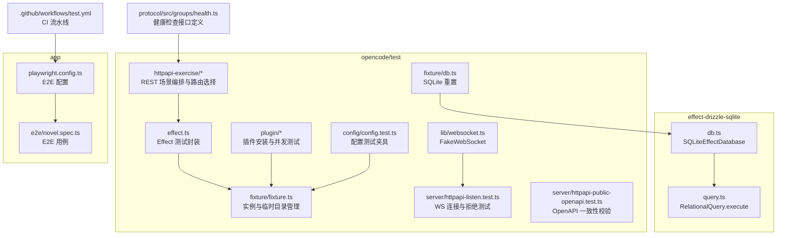
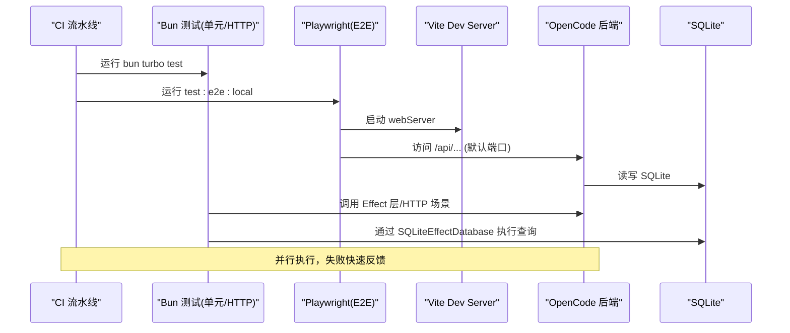
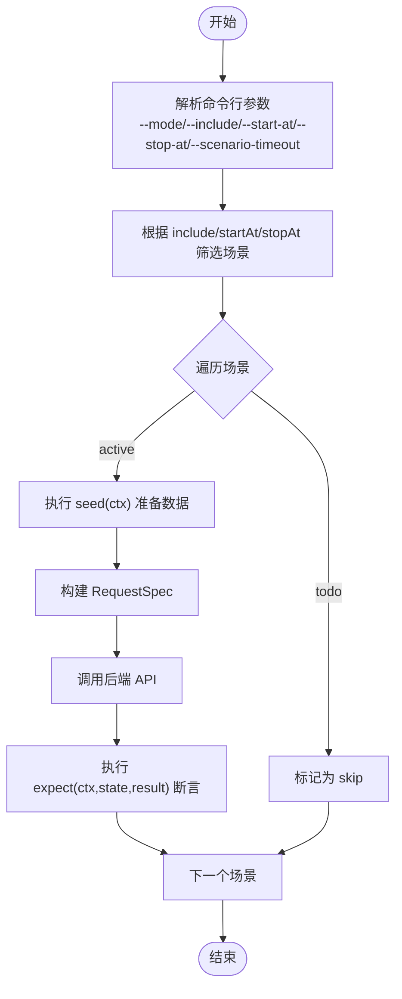
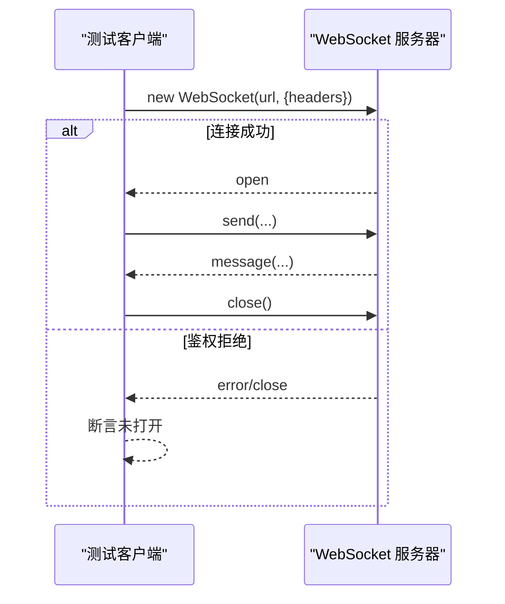
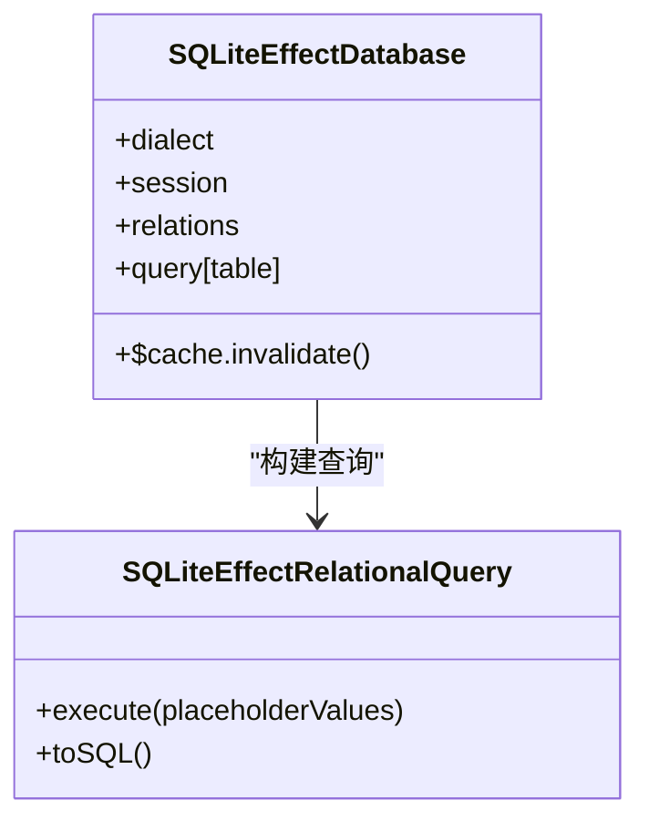
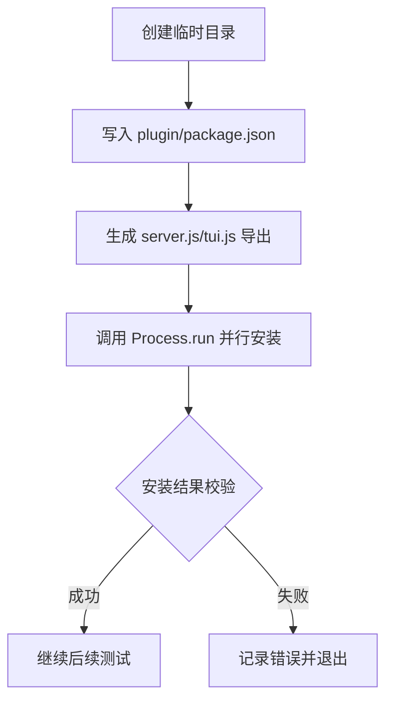
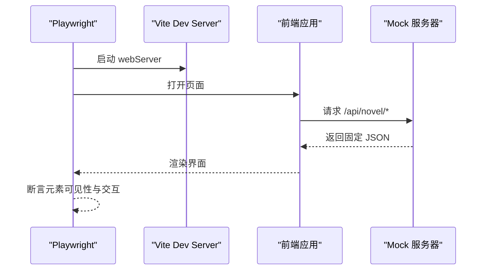
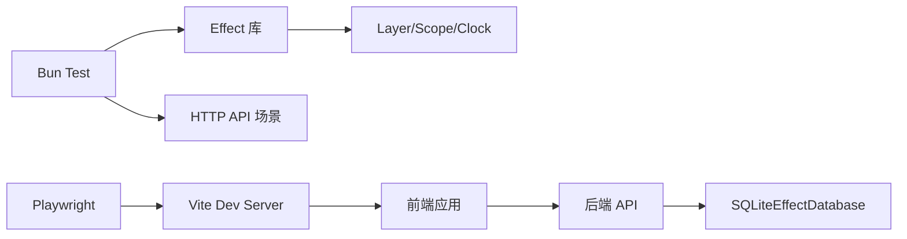

# 集成测试

<cite>
**本文引用的文件**   
- [packages/opencode/test/lib/effect.ts](file://packages/opencode/test/lib/effect.ts)
- [packages/opencode/test/fixture/fixture.ts](file://packages/opencode/test/fixture/fixture.ts)
- [packages/opencode/test/config/config.test.ts](file://packages/opencode/test/config/config.test.ts)
- [packages/opencode/test/server/httpapi-exercise/routing.ts](file://packages/opencode/test/server/httpapi-exercise/routing.ts)
- [packages/opencode/test/server/httpapi-exercise/types.ts](file://packages/opencode/test/server/httpapi-exercise/types.ts)
- [packages/opencode/test/server/httpapi-public-openapi.test.ts](file://packages/opencode/test/server/httpapi-public-openapi.test.ts)
- [packages/opencode/test/server/httpapi-listen.test.ts](file://packages/opencode/test/server/httpapi-listen.test.ts)
- [packages/opencode/test/plugin/openai-ws.test.ts](file://packages/opencode/test/plugin/openai-ws.test.ts)
- [packages/opencode/test/lib/websocket.ts](file://packages/opencode/test/lib/websocket.ts)
- [packages/opencode/test/plugin/install-concurrency.test.ts](file://packages/opencode/test/plugin/install-concurrency.test.ts)
- [packages/opencode/test/fixture/db.ts](file://packages/opencode/test/fixture/db.ts)
- [packages/effect-drizzle-sqlite/src/sqlite-core/effect/db.ts](file://packages/effect-drizzle-sqlite/src/sqlite-core/effect/db.ts)
- [packages/effect-drizzle-sqlite/src/sqlite-core/effect/query.ts](file://packages/effect-drizzle-sqlite/src/sqlite-core/effect/query.ts)
- [packages/protocol/src/groups/health.ts](file://packages/protocol/src/groups/health.ts)
- [packages/app/playwright.config.ts](file://packages/app/playwright.config.ts)
- [packages/app/e2e/novel.spec.ts](file://packages/app/e2e/novel.spec.ts)
- [.github/workflows/test.yml](file://.github/workflows/test.yml)
</cite>

## 目录
1. [简介](#简介)
2. [项目结构](#项目结构)
3. [核心组件](#核心组件)
4. [架构总览](#架构总览)
5. [详细组件分析](#详细组件分析)
6. [依赖分析](#依赖分析)
7. [性能考虑](#性能考虑)
8. [故障排查指南](#故障排查指南)
9. [结论](#结论)
10. [附录](#附录)

## 简介
本文件面向 openNovel 项目的集成测试，覆盖以下目标：
- REST API 与 WebSocket 接口的集成测试策略与实现要点
- SQLite 数据库集成测试环境搭建、数据准备与清理
- 插件系统的集成测试方法（安装、并发、生命周期）
- 端到端（E2E）测试的架构设计与示例
- 测试环境隔离、数据清理与并发测试处理

## 项目结构
openNovel 的测试分布在多个包中：
- opencode 包的 test 目录提供 Effect 测试框架封装、HTTP API 场景编排、WebSocket 测试工具、插件测试夹具等
- effect-drizzle-sqlite 包提供基于 Effect 的 SQLite 查询能力
- app 包使用 Playwright 进行 E2E 测试，并通过 webServer 启动前端开发服务器，后端服务默认监听指定端口
- GitHub Actions 工作流统一执行单元与 E2E 测试

**图表来源** 
- [packages/opencode/test/lib/effect.ts:1-178](file://packages/opencode/test/lib/effect.ts#L1-L178)
- [packages/opencode/test/fixture/fixture.ts:26-76](file://packages/opencode/test/fixture/fixture.ts#L26-L76)
- [packages/opencode/test/server/httpapi-exercise/routing.ts:1-97](file://packages/opencode/test/server/httpapi-exercise/routing.ts#L1-L97)
- [packages/opencode/test/lib/websocket.ts:1-46](file://packages/opencode/test/lib/websocket.ts#L1-L46)
- [packages/opencode/test/plugin/install-concurrency.test.ts:1-56](file://packages/opencode/test/plugin/install-concurrency.test.ts#L1-L56)
- [packages/opencode/test/config/config.test.ts:152-191](file://packages/opencode/test/config/config.test.ts#L152-L191)
- [packages/opencode/test/server/httpapi-listen.test.ts:100-138](file://packages/opencode/test/server/httpapi-listen.test.ts#L100-L138)
- [packages/opencode/test/server/httpapi-public-openapi.test.ts:1-39](file://packages/opencode/test/server/httpapi-public-openapi.test.ts#L1-L39)
- [packages/opencode/test/fixture/db.ts:1-11](file://packages/opencode/test/fixture/db.ts#L1-L11)
- [packages/effect-drizzle-sqlite/src/sqlite-core/effect/db.ts:30-77](file://packages/effect-drizzle-sqlite/src/sqlite-core/effect/db.ts#L30-L77)
- [packages/effect-drizzle-sqlite/src/sqlite-core/effect/query.ts:178-198](file://packages/effect-drizzle-sqlite/src/sqlite-core/effect/query.ts#L178-L198)
- [packages/app/playwright.config.ts:1-45](file://packages/app/playwright.config.ts#L1-L45)
- [packages/app/e2e/novel.spec.ts:1-445](file://packages/app/e2e/novel.spec.ts#L1-L445)
- [.github/workflows/test.yml:1-152](file://.github/workflows/test.yml#L1-L152)
- [packages/protocol/src/groups/health.ts:1-14](file://packages/protocol/src/groups/health.ts#L1-L14)

**章节来源**
- [packages/opencode/test/lib/effect.ts:1-178](file://packages/opencode/test/lib/effect.ts#L1-L178)
- [packages/app/playwright.config.ts:1-45](file://packages/app/playwright.config.ts#L1-L45)
- [.github/workflows/test.yml:1-152](file://.github/workflows/test.yml#L1-L152)

## 核心组件
- Effect 测试封装：提供 isolatedRun 与 sharedRun 两种运行模式，支持 TestClock/TestConsole 注入，以及 instance 测试夹具（临时目录、实例加载与释放）。
- HTTP API 场景编排：通过 DSL 描述请求、鉴权策略、比较模式、捕获模式、超时控制，并支持按名称或路径筛选场景。
- WebSocket 测试：内置 FakeWebSocket 用于无网络模拟；真实 WS 测试包含连接成功与拒绝流程。
- 插件系统测试：创建最小化插件包，模拟 server/tui 导出，验证安装与并发行为。
- 数据库集成：提供 resetDatabase 清理 SQLite 文件，配合 Effect Drizzle 的 SQLiteEffectDatabase 执行关系查询。
- E2E 测试：Playwright 启动 Vite dev server，Mock 后端 API，驱动浏览器完成用户旅程。

**章节来源**
- [packages/opencode/test/lib/effect.ts:67-147](file://packages/opencode/test/lib/effect.ts#L67-L147)
- [packages/opencode/test/server/httpapi-exercise/types.ts:1-128](file://packages/opencode/test/server/httpapi-exercise/types.ts#L1-L128)
- [packages/opencode/test/lib/websocket.ts:1-46](file://packages/opencode/test/lib/websocket.ts#L1-L46)
- [packages/opencode/test/plugin/install-concurrency.test.ts:1-56](file://packages/opencode/test/plugin/install-concurrency.test.ts#L1-L56)
- [packages/opencode/test/fixture/db.ts:1-11](file://packages/opencode/test/fixture/db.ts#L1-L11)
- [packages/effect-drizzle-sqlite/src/sqlite-core/effect/db.ts:30-77](file://packages/effect-drizzle-sqlite/src/sqlite-core/effect/db.ts#L30-L77)
- [packages/app/playwright.config.ts:1-45](file://packages/app/playwright.config.ts#L1-L45)

## 架构总览
下图展示了集成测试在 CI 中的整体流程：单元测试与 HTTP API 场景由 Bun 执行，E2E 由 Playwright 驱动浏览器，同时启动前端 dev server 并连接后端服务。

**图表来源** 
- [.github/workflows/test.yml:24-81](file://.github/workflows/test.yml#L24-L81)
- [.github/workflows/test.yml:82-152](file://.github/workflows/test.yml#L82-L152)
- [packages/app/playwright.config.ts:23-32](file://packages/app/playwright.config.ts#L23-L32)
- [packages/effect-drizzle-sqlite/src/sqlite-core/effect/db.ts:30-77](file://packages/effect-drizzle-sqlite/src/sqlite-core/effect/db.ts#L30-L77)

## 详细组件分析

### REST API 集成测试（场景编排与 OpenAPI 校验）
- 场景类型与选项：支持 method/path/name/project/seed/request/authProbe/expect/compare/capture/mutates/reset/auth 等字段，便于构造复杂前置与断言。
- 路由选择与过滤：支持 --include/--start-at/--stop-at 筛选场景，--scenario-timeout 控制每个场景超时。
- OpenAPI 一致性：读取 PublicApi 的 OpenAPI spec，校验路径与方法是否一致，避免接口漂移。

**图表来源** 
- [packages/opencode/test/server/httpapi-exercise/types.ts:23-128](file://packages/opencode/test/server/httpapi-exercise/types.ts#L23-L128)
- [packages/opencode/test/server/httpapi-exercise/routing.ts:42-96](file://packages/opencode/test/server/httpapi-exercise/routing.ts#L42-L96)
- [packages/opencode/test/server/httpapi-public-openapi.test.ts:1-39](file://packages/opencode/test/server/httpapi-public-openapi.test.ts#L1-L39)

**章节来源**
- [packages/opencode/test/server/httpapi-exercise/types.ts:1-128](file://packages/opencode/test/server/httpapi-exercise/types.ts#L1-L128)
- [packages/opencode/test/server/httpapi-exercise/routing.ts:1-97](file://packages/opencode/test/server/httpapi-exercise/routing.ts#L1-L97)
- [packages/opencode/test/server/httpapi-public-openapi.test.ts:1-39](file://packages/opencode/test/server/httpapi-public-openapi.test.ts#L1-L39)

### WebSocket 集成测试（连接与鉴权）
- 真实 WS 测试：使用 Bun 的 WebSocket 客户端，等待 open/error/close 事件，支持带 headers 的连接初始化。
- 鉴权拒绝测试：服务端 verifyClient 返回拒绝码，客户端应收到 error/close 而非 open。
- 伪造 WS：FakeWebSocket 提供内存事件总线，适合无需网络的单元测试。

**图表来源** 
- [packages/opencode/test/server/httpapi-listen.test.ts:100-138](file://packages/opencode/test/server/httpapi-listen.test.ts#L100-L138)
- [packages/opencode/test/plugin/openai-ws.test.ts:830-884](file://packages/opencode/test/plugin/openai-ws.test.ts#L830-L884)
- [packages/opencode/test/lib/websocket.ts:1-46](file://packages/opencode/test/lib/websocket.ts#L1-L46)

**章节来源**
- [packages/opencode/test/server/httpapi-listen.test.ts:100-138](file://packages/opencode/test/server/httpapi-listen.test.ts#L100-L138)
- [packages/opencode/test/plugin/openai-ws.test.ts:830-884](file://packages/opencode/test/plugin/openai-ws.test.ts#L830-L884)
- [packages/opencode/test/lib/websocket.ts:1-46](file://packages/opencode/test/lib/websocket.ts#L1-L46)

### 数据库集成测试（SQLite 环境与数据清理）
- 环境清理：resetDatabase 会终止所有实例并删除 SQLite 主文件及 WAL/SHM 文件，确保测试隔离。
- 查询执行：SQLiteEffectDatabase 提供关系型查询构建器，execute 支持 first/all 模式。
- 建议：在测试前调用 resetDatabase，在测试后通过 Effect Scope 释放资源。

**图表来源** 
- [packages/effect-drizzle-sqlite/src/sqlite-core/effect/db.ts:30-77](file://packages/effect-drizzle-sqlite/src/sqlite-core/effect/db.ts#L30-L77)
- [packages/effect-drizzle-sqlite/src/sqlite-core/effect/query.ts:178-198](file://packages/effect-drizzle-sqlite/src/sqlite-core/effect/query.ts#L178-L198)
- [packages/opencode/test/fixture/db.ts:1-11](file://packages/opencode/test/fixture/db.ts#L1-L11)

**章节来源**
- [packages/opencode/test/fixture/db.ts:1-11](file://packages/opencode/test/fixture/db.ts#L1-L11)
- [packages/effect-drizzle-sqlite/src/sqlite-core/effect/db.ts:30-77](file://packages/effect-drizzle-sqlite/src/sqlite-core/effect/db.ts#L30-L77)
- [packages/effect-drizzle-sqlite/src/sqlite-core/effect/query.ts:178-198](file://packages/effect-drizzle-sqlite/src/sqlite-core/effect/query.ts#L178-L198)

### 插件系统集成测试（安装与并发）
- 插件构造：动态生成 package.json 与 server/tui 导出，模拟不同插件形态。
- 并发安装：通过子进程并行执行插件安装脚本，验证互斥与幂等性。
- TUI 运行时：mockTuiRuntime 设置环境变量与插件元信息，屏蔽外部依赖。

**图表来源** 
- [packages/opencode/test/plugin/install-concurrency.test.ts:1-56](file://packages/opencode/test/plugin/install-concurrency.test.ts#L1-L56)
- [packages/opencode/test/fixture/tui-runtime.ts:32-56](file://packages/opencode/test/fixture/tui-runtime.ts#L32-L56)

**章节来源**
- [packages/opencode/test/plugin/install-concurrency.test.ts:1-56](file://packages/opencode/test/plugin/install-concurrency.test.ts#L1-L56)
- [packages/opencode/test/fixture/tui-runtime.ts:32-56](file://packages/opencode/test/fixture/tui-runtime.ts#L32-L56)

### 端到端测试（E2E）架构与示例
- 启动方式：Playwright 通过 webServer 启动 Vite dev server，默认端口可配置；后端服务地址通过环境变量指定。
- 用例示例：novel.spec.ts 演示完整写作旅程，包括书架、向导、工作区、阅读器、审批、编辑器与面板。
- Mock 策略：通过 page.route 拦截 /api/novel 相关请求，返回固定 JSON 以稳定 UI 行为。

**图表来源** 
- [packages/app/playwright.config.ts:23-32](file://packages/app/playwright.config.ts#L23-L32)
- [packages/app/e2e/novel.spec.ts:154-305](file://packages/app/e2e/novel.spec.ts#L154-L305)

**章节来源**
- [packages/app/playwright.config.ts:1-45](file://packages/app/playwright.config.ts#L1-L45)
- [packages/app/e2e/novel.spec.ts:1-445](file://packages/app/e2e/novel.spec.ts#L1-L445)

## 依赖分析
- 测试框架与运行器：Bun test 作为单元/HTTP 测试运行器；Playwright 作为 E2E 运行器。
- Effect 生态：Effect Layer/Scope/TestClock/TestConsole 用于依赖注入与时钟控制。
- 数据库：SQLiteEffectDatabase 与 Drizzle 的关系查询构建器。
- 协议与接口：HealthGroup 定义健康检查接口，便于可用性探测。

**图表来源** 
- [packages/opencode/test/lib/effect.ts:131-147](file://packages/opencode/test/lib/effect.ts#L131-L147)
- [packages/effect-drizzle-sqlite/src/sqlite-core/effect/db.ts:30-77](file://packages/effect-drizzle-sqlite/src/sqlite-core/effect/db.ts#L30-L77)
- [packages/protocol/src/groups/health.ts:1-14](file://packages/protocol/src/groups/health.ts#L1-L14)
- [packages/app/playwright.config.ts:23-32](file://packages/app/playwright.config.ts#L23-L32)

**章节来源**
- [packages/opencode/test/lib/effect.ts:131-147](file://packages/opencode/test/lib/effect.ts#L131-L147)
- [packages/effect-drizzle-sqlite/src/sqlite-core/effect/db.ts:30-77](file://packages/effect-drizzle-sqlite/src/sqlite-core/effect/db.ts#L30-L77)
- [packages/protocol/src/groups/health.ts:1-14](file://packages/protocol/src/groups/health.ts#L1-L14)
- [packages/app/playwright.config.ts:23-32](file://packages/app/playwright.config.ts#L23-L32)

## 性能考虑
- 场景超时：通过 --scenario-timeout 控制单个场景耗时，避免长尾阻塞。
- 并发度：E2E 可通过 PLAYWRIGHT_WORKERS 调整并行度；CI 中限制 workers 数量以保证稳定性。
- 缓存与复用：Turbo 缓存加速依赖安装；Playwright 浏览器缓存减少下载时间。
- 数据库 IO：SQLite 单文件模型适合轻量测试，但应避免跨进程并发写冲突，必要时使用独立文件或 WAL 模式。

[本节为通用指导，不直接分析具体文件]

## 故障排查指南
- WebSocket 连接失败：检查服务端 verifyClient 逻辑与客户端 headers；确认端口与协议（ws/wss）。
- 数据库残留：确保在测试前后调用 resetDatabase，并清理 -wal/-shm 文件。
- 场景未匹配：核对 --include/--start-at/--stop-at 筛选条件是否与场景 name/path/method 匹配。
- E2E 超时：增大 timeout 或 retries；检查 webServer 启动命令与环境变量。

**章节来源**
- [packages/opencode/test/server/httpapi-listen.test.ts:100-138](file://packages/opencode/test/server/httpapi-listen.test.ts#L100-L138)
- [packages/opencode/test/fixture/db.ts:1-11](file://packages/opencode/test/fixture/db.ts#L1-L11)
- [packages/opencode/test/server/httpapi-exercise/routing.ts:42-96](file://packages/opencode/test/server/httpapi-exercise/routing.ts#L42-L96)
- [packages/app/playwright.config.ts:14-21](file://packages/app/playwright.config.ts#L14-L21)

## 结论
openNovel 的集成测试体系以 Effect 为核心，结合 Bun 与 Playwright，形成从单元到 E2E 的全链路保障。通过场景化编排、严格的 OpenAPI 校验、SQLite 环境隔离与插件并发测试，能够有效提升代码质量与交付稳定性。建议在新增功能时同步补充对应场景与 E2E 用例，保持测试覆盖率与可靠性。

[本节为总结性内容，不直接分析具体文件]

## 附录
- 健康检查接口：/api/health 用于服务就绪探测，可在 E2E 启动后先调用该接口确认后端可用。
- 测试入口：CI 中通过 bun turbo test 与 test:e2e:local 分别触发单元/HTTP 与 E2E 测试。

**章节来源**
- [packages/protocol/src/groups/health.ts:1-14](file://packages/protocol/src/groups/health.ts#L1-L14)
- [.github/workflows/test.yml:66-81](file://.github/workflows/test.yml#L66-L81)
- [.github/workflows/test.yml:136-140](file://.github/workflows/test.yml#L136-L140)