# CI/CD 流水线

<cite>
**本文引用的文件**
- [generate.yml](file://.github/workflows/generate.yml)
- [test.yml](file://.github/workflows/test.yml)
- [typecheck.yml](file://.github/workflows/typecheck.yml)
- [setup-bun/action.yml](file://.github/actions/setup-bun/action.yml)
- [turbo.json](file://turbo.json)
- [package.json](file://package.json)
- [version.ts](file://script/version.ts)
- [publish.ts](file://script/publish.ts)
- [changelog.ts](file://script/changelog.ts)
- [sst.config.ts](file://sst.config.ts)
- [.dockerignore](file://.dockerignore)
</cite>

## 目录
1. [简介](#简介)
2. [项目结构](#项目结构)
3. [核心组件](#核心组件)
4. [架构总览](#架构总览)
5. [详细组件分析](#详细组件分析)
6. [依赖关系分析](#依赖关系分析)
7. [性能考虑](#性能考虑)
8. [故障排查指南](#故障排查指南)
9. [结论](#结论)
10. [附录](#附录)

## 简介
本文件为 openNovel 项目的 CI/CD 流水线配置文档，覆盖 GitHub Actions 工作流、代码检查、测试执行、构建打包与自动部署。重点说明多环境（开发、测试、生产）的自动化发布流程、版本管理与变更日志生成、自定义脚本与工具链配置，以及回滚策略与部署质量门禁。

## 项目结构
仓库采用 Monorepo 组织，使用 Bun 作为包管理器与运行时，Turbo 进行任务编排，GitHub Actions 驱动 CI/CD。关键目录与职责：
- .github/workflows：CI 工作流定义（类型检查、测试、代码生成）
- .github/actions：可复用 Action（Bun 环境准备与依赖缓存）
- script：版本管理、变更日志、发布等自定义脚本
- sst.config.ts：基础设施与多阶段部署配置（SST）
- turbo.json：任务图与缓存策略
- package.json：工作区、脚本入口、依赖与补丁

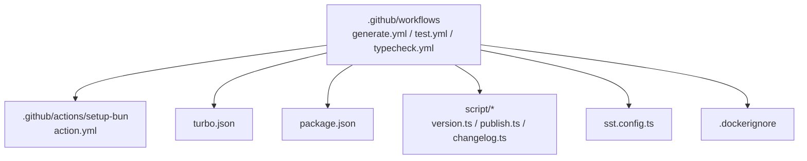

**图表来源**
- [generate.yml:1-40](file://.github/workflows/generate.yml#L1-L40)
- [test.yml:1-152](file://.github/workflows/test.yml#L1-L152)
- [typecheck.yml:1-22](file://.github/workflows/typecheck.yml#L1-L22)
- [setup-bun/action.yml:1-74](file://.github/actions/setup-bun/action.yml#L1-L74)
- [turbo.json:1-34](file://turbo.json#L1-L34)
- [package.json:1-162](file://package.json#L1-L162)
- [sst.config.ts:1-54](file://sst.config.ts#L1-L54)
- [.dockerignore:1-12](file://.dockerignore#L1-L12)

**章节来源**
- [generate.yml:1-40](file://.github/workflows/generate.yml#L1-L40)
- [test.yml:1-152](file://.github/workflows/test.yml#L1-L152)
- [typecheck.yml:1-22](file://.github/workflows/typecheck.yml#L1-L22)
- [setup-bun/action.yml:1-74](file://.github/actions/setup-bun/action.yml#L1-L74)
- [turbo.json:1-34](file://turbo.json#L1-L34)
- [package.json:1-162](file://package.json#L1-L162)
- [sst.config.ts:1-54](file://sst.config.ts#L1-L54)
- [.dockerignore:1-12](file://.dockerignore#L1-L12)

## 核心组件
- 工作流
  - 类型检查：触发分支 dev 与 PR，运行全局类型检查
  - 测试：在 Linux/Windows 矩阵上并行执行单元测试与端到端测试，缓存 Turbo 与 Playwright 浏览器
  - 代码生成：dev 分支推送后自动生成并推送变更
- 工具链
  - setup-bun：统一 Node/Bun 安装、依赖缓存、跨平台兼容
  - Turbo：任务编排与增量构建
  - SST：多阶段基础设施部署
- 脚本
  - version.ts：语义化版本、变更日志生成、GitHub Release 创建
  - publish.ts：全仓包版本同步、SDK/UI/CLI 发布、标签与远程同步
  - changelog.ts：基于 opencode CLI 生成变更日志

**章节来源**
- [typecheck.yml:1-22](file://.github/workflows/typecheck.yml#L1-L22)
- [test.yml:1-152](file://.github/workflows/test.yml#L1-L152)
- [generate.yml:1-40](file://.github/workflows/generate.yml#L1-L40)
- [setup-bun/action.yml:1-74](file://.github/actions/setup-bun/action.yml#L1-L74)
- [turbo.json:1-34](file://turbo.json#L1-L34)
- [version.ts:1-37](file://script/version.ts#L1-L37)
- [publish.ts:1-74](file://script/publish.ts#L1-L74)
- [changelog.ts:1-77](file://script/changelog.ts#L1-L77)

## 架构总览
下图展示从代码提交到发布的全链路：PR/推送触发类型检查与测试；通过后进入生成与发布流程；版本与变更日志由脚本驱动；最终通过 SST 完成多环境部署。

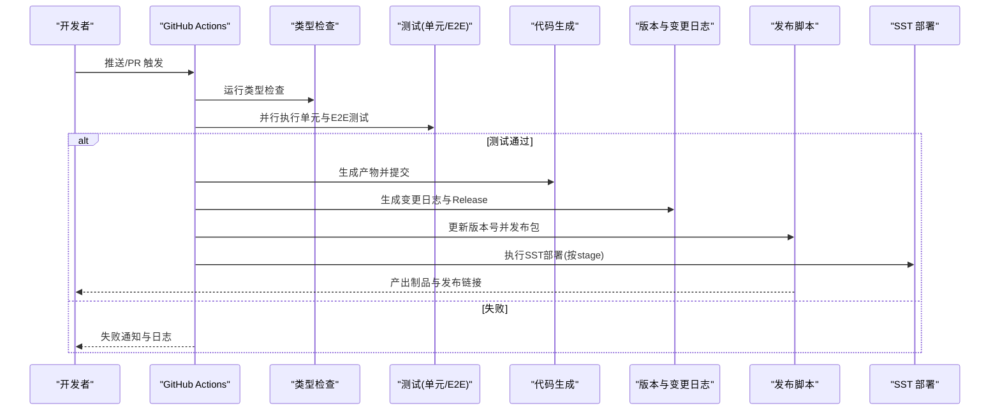

**图表来源**
- [typecheck.yml:1-22](file://.github/workflows/typecheck.yml#L1-L22)
- [test.yml:1-152](file://.github/workflows/test.yml#L1-L152)
- [generate.yml:1-40](file://.github/workflows/generate.yml#L1-L40)
- [version.ts:1-37](file://script/version.ts#L1-L37)
- [publish.ts:1-74](file://script/publish.ts#L1-L74)
- [sst.config.ts:1-54](file://sst.config.ts#L1-L54)

## 详细组件分析

### 类型检查工作流（typecheck）
- 触发条件：dev 分支推送与 PR，支持手动触发
- 执行步骤：检出代码 → 设置 Bun 环境 → 运行类型检查
- 特点：轻量快速，用于早期拦截类型错误

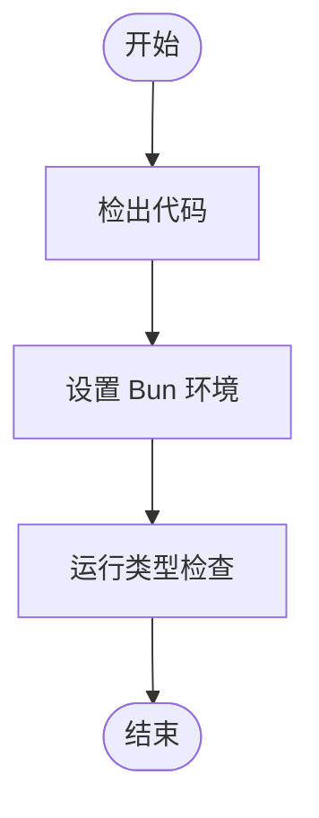

**图表来源**
- [typecheck.yml:1-22](file://.github/workflows/typecheck.yml#L1-L22)
- [setup-bun/action.yml:1-74](file://.github/actions/setup-bun/action.yml#L1-L74)

**章节来源**
- [typecheck.yml:1-22](file://.github/workflows/typecheck.yml#L1-L22)

### 测试工作流（test）
- 触发条件：dev 分支推送、任意 PR、手动触发
- 并发控制：同一 workflow 组内取消旧运行，避免污染默认分支历史
- 矩阵策略：Linux/Windows 并行执行单元与 E2E 测试
- 缓存优化：Turbo 缓存、Playwright 浏览器缓存
- 产物上传：E2E 报告与测试结果以 Artifact 形式保留

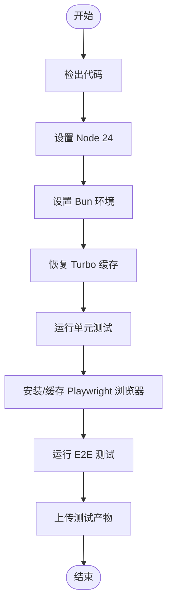

**图表来源**
- [test.yml:1-152](file://.github/workflows/test.yml#L1-L152)
- [setup-bun/action.yml:1-74](file://.github/actions/setup-bun/action.yml#L1-L74)

**章节来源**
- [test.yml:1-152](file://.github/workflows/test.yml#L1-L152)

### 代码生成工作流（generate）
- 触发条件：dev 分支推送
- 执行步骤：检出代码 → 设置 Bun → 配置 Git 身份 → 运行生成脚本 → 有变更则提交并推送
- 用途：自动化生成客户端、OpenAPI 或相关脚手架代码

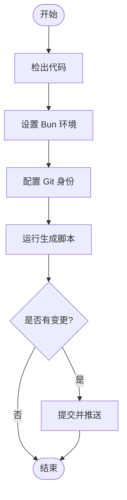

**图表来源**
- [generate.yml:1-40](file://.github/workflows/generate.yml#L1-L40)

**章节来源**
- [generate.yml:1-40](file://.github/workflows/generate.yml#L1-L40)

### 版本管理与变更日志（version.ts + changelog.ts）
- 版本来源：Script.version（由上游脚本注入）
- 变更日志：调用 changelog.ts 生成 UPCOMING_CHANGELOG.md，并写入临时文件作为 Release Notes
- 发布动作：根据是否 preview/channel 创建 GitHub Release，输出 release/tag/repo 等结果供后续步骤使用

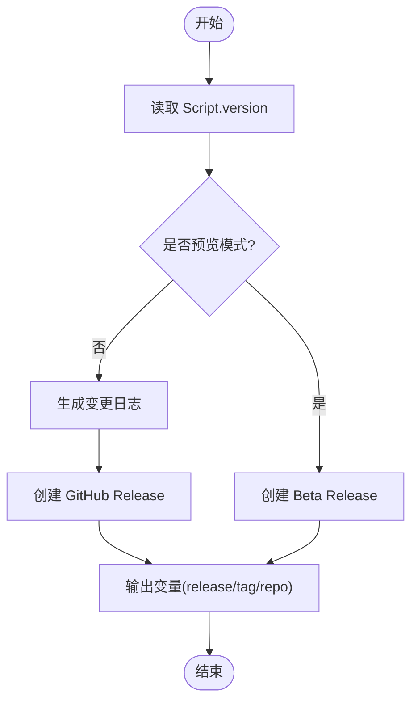

**图表来源**
- [version.ts:1-37](file://script/version.ts#L1-L37)
- [changelog.ts:1-77](file://script/changelog.ts#L1-L77)

**章节来源**
- [version.ts:1-37](file://script/version.ts#L1-L37)
- [changelog.ts:1-77](file://script/changelog.ts#L1-L77)

### 发布脚本（publish.ts）
- 功能：遍历所有 package.json 统一版本号，安装依赖，构建 SDK，依次发布 CLI、预览 CLI、SDK、Plugin、UI
- 桌面端：生成 latest JSON/YAML 元数据
- 发布后：打 tag、推送到远端、同步 dev 分支版本、将 Release 从草稿状态转为正式

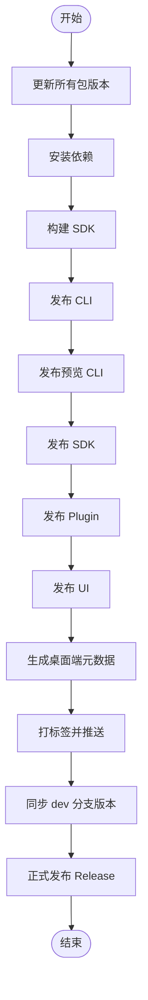

**图表来源**
- [publish.ts:1-74](file://script/publish.ts#L1-L74)

**章节来源**
- [publish.ts:1-74](file://script/publish.ts#L1-L74)

### 基础设施与多环境部署（SST）
- 阶段区分：production/vimtor 启用监控与其他高级特性
- 提供者：AWS、Cloudflare、Stripe、Planetscale、Honeycomb 等
- 保护策略：production 阶段开启保护，防止误删
- 动态加载：根据 stage 动态导入 infra 模块，按需部署资源

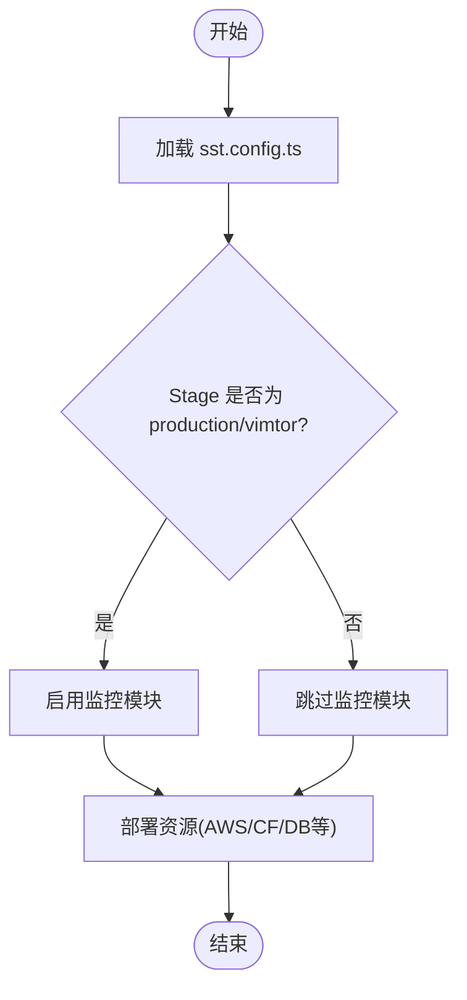

**图表来源**
- [sst.config.ts:1-54](file://sst.config.ts#L1-L54)

**章节来源**
- [sst.config.ts:1-54](file://sst.config.ts#L1-L54)

### 任务编排与缓存（Turbo）
- 全局环境变量：CI、OPENCODE_DISABLE_SHARE
- 任务定义：typecheck、build、各包的 test 任务依赖 ^build
- 输出目录：dist/**
- 作用：加速重复构建与测试，提升 CI 效率

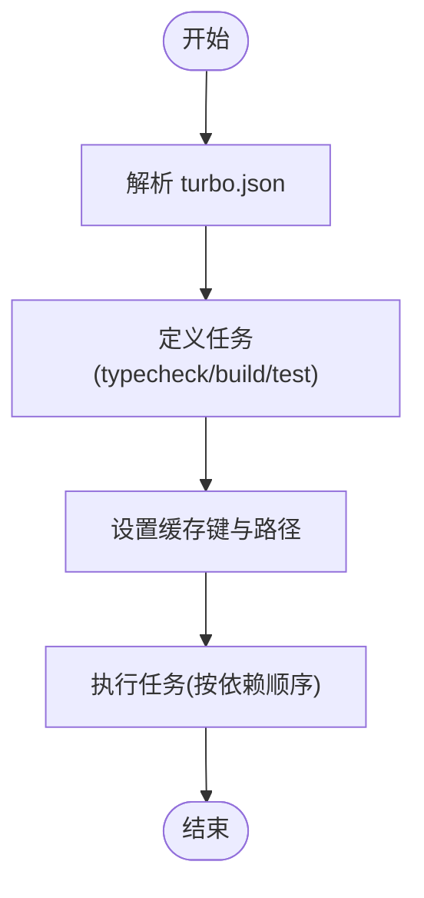

**图表来源**
- [turbo.json:1-34](file://turbo.json#L1-L34)

**章节来源**
- [turbo.json:1-34](file://turbo.json#L1-L34)

### 环境准备与依赖缓存（setup-bun）
- Node/Bun 安装：优先使用 baseline 二进制以提升下载速度
- 依赖缓存：基于 bun.lock 哈希缓存依赖目录
- 兼容性：Windows 下使用 hoisted linker 解决补丁问题
- 原生依赖：安装 setuptools 保证 node-gyp 兼容

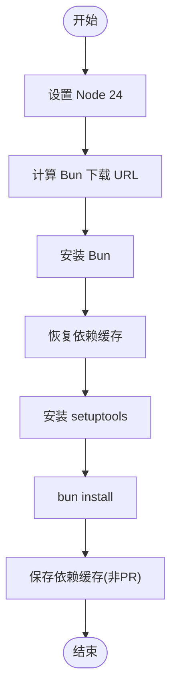

**图表来源**
- [setup-bun/action.yml:1-74](file://.github/actions/setup-bun/action.yml#L1-L74)

**章节来源**
- [setup-bun/action.yml:1-74](file://.github/actions/setup-bun/action.yml#L1-L74)

## 依赖关系分析
- 工作流依赖
  - test.yml 依赖 setup-bun 与 turbo.json
  - generate.yml 依赖 setup-bun 与生成脚本
  - typecheck.yml 依赖 setup-bun
- 脚本依赖
  - version.ts 依赖 changelog.ts 与 GitHub CLI
  - publish.ts 依赖各子包发布脚本与 Git/GitHub API
- 基础设施依赖
  - sst.config.ts 依赖 AWS/Cloudflare/Stripe/Planetscale/Honeycomb 等

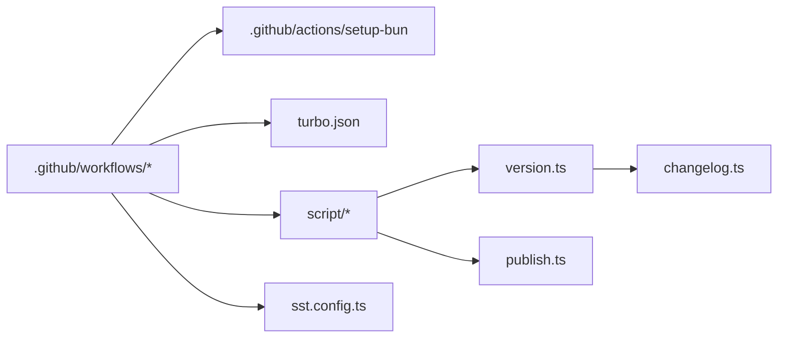

**图表来源**
- [test.yml:1-152](file://.github/workflows/test.yml#L1-L152)
- [generate.yml:1-40](file://.github/workflows/generate.yml#L1-L40)
- [typecheck.yml:1-22](file://.github/workflows/typecheck.yml#L1-L22)
- [setup-bun/action.yml:1-74](file://.github/actions/setup-bun/action.yml#L1-L74)
- [turbo.json:1-34](file://turbo.json#L1-L34)
- [version.ts:1-37](file://script/version.ts#L1-L37)
- [changelog.ts:1-77](file://script/changelog.ts#L1-L77)
- [publish.ts:1-74](file://script/publish.ts#L1-L74)
- [sst.config.ts:1-54](file://sst.config.ts#L1-L54)

**章节来源**
- [test.yml:1-152](file://.github/workflows/test.yml#L1-L152)
- [generate.yml:1-40](file://.github/workflows/generate.yml#L1-L40)
- [typecheck.yml:1-22](file://.github/workflows/typecheck.yml#L1-L22)
- [setup-bun/action.yml:1-74](file://.github/actions/setup-bun/action.yml#L1-L74)
- [turbo.json:1-34](file://turbo.json#L1-L34)
- [version.ts:1-37](file://script/version.ts#L1-L37)
- [changelog.ts:1-77](file://script/changelog.ts#L1-L77)
- [publish.ts:1-74](file://script/publish.ts#L1-L74)
- [sst.config.ts:1-54](file://sst.config.ts#L1-L54)

## 性能考虑
- 缓存策略
  - Turbo 缓存：基于操作系统、turbo.json 与 package.json 哈希，减少重复构建
  - Playwright 浏览器缓存：按 OS/Arch/版本缓存 Chromium，显著缩短 E2E 启动时间
  - Bun 依赖缓存：基于 bun.lock 哈希缓存依赖目录，避免重复安装
- 并行执行
  - 单元与 E2E 测试在矩阵中并行，缩短整体耗时
  - 工作流组并发控制，避免默认分支历史被干扰
- 构建优化
  - 使用 baseline 二进制安装 Bun，提高下载速度
  - Windows 使用 hoisted linker 解决补丁兼容性问题

[本节为通用指导，不直接分析具体文件]

## 故障排查指南
- 类型检查失败
  - 检查 TypeScript 配置与依赖版本一致性
  - 确认 CI 环境中 Node/Bun 版本与本地一致
- 测试失败
  - 查看 Turbo 缓存是否过期，清理缓存重试
  - E2E 失败时下载 Playwright 报告与截图定位问题
- 发布失败
  - 确认 GitHub Token 权限与仓库访问
  - 检查版本冲突与标签是否存在
- 部署失败
  - 核对 SST 阶段配置与密钥（如 Stripe、R2、Upstash Redis）
  - 检查 AWS/Cloudflare 账户权限与环境变量

**章节来源**
- [test.yml:1-152](file://.github/workflows/test.yml#L1-L152)
- [setup-bun/action.yml:1-74](file://.github/actions/setup-bun/action.yml#L1-L74)
- [publish.ts:1-74](file://script/publish.ts#L1-L74)
- [sst.config.ts:1-54](file://sst.config.ts#L1-L54)

## 结论
openNovel 的 CI/CD 流水线以 GitHub Actions 为核心，结合 Bun、Turbo、SST 与自研脚本，实现了从类型检查、测试、代码生成到版本管理与发布的完整闭环。通过缓存与并行策略显著提升效率，并通过多阶段部署与质量门禁保障交付质量。建议在生产环境引入更严格的门禁（如安全扫描、覆盖率阈值）与灰度发布策略，进一步提升稳定性与可观测性。

[本节为总结，不直接分析具体文件]

## 附录
- 多环境部署策略
  - 开发：dev 分支触发生成与测试，允许草稿发布
  - 测试：PR 触发测试与类型检查，验证变更
  - 生产：通过版本脚本创建正式 Release，SST 按 stage 部署并启用监控
- 版本管理与发布流程
  - 语义化版本：由 Script.version 注入，确保一致性
  - 变更日志：changelog.ts 生成，release notes 自动附加
  - 发布：publish.ts 统一更新版本、构建与发布各包，打标签并同步分支
- 自定义脚本与工具链
  - setup-bun：统一环境准备与依赖缓存
  - turbo：任务编排与增量构建
  - sst：基础设施即代码，多阶段部署
- 回滚策略
  - 回退版本：撤销 Release 与标签，重新发布旧版本
  - 基础设施回滚：SST 支持 retain/remove 策略，生产阶段默认 retain
- 部署质量门禁
  - 类型检查与测试必须通过
  - E2E 报告与截图作为产物留存
  - 生产阶段保护开关防止误操作

**章节来源**
- [version.ts:1-37](file://script/version.ts#L1-L37)
- [changelog.ts:1-77](file://script/changelog.ts#L1-L77)
- [publish.ts:1-74](file://script/publish.ts#L1-L74)
- [setup-bun/action.yml:1-74](file://.github/actions/setup-bun/action.yml#L1-L74)
- [turbo.json:1-34](file://turbo.json#L1-L34)
- [sst.config.ts:1-54](file://sst.config.ts#L1-L54)