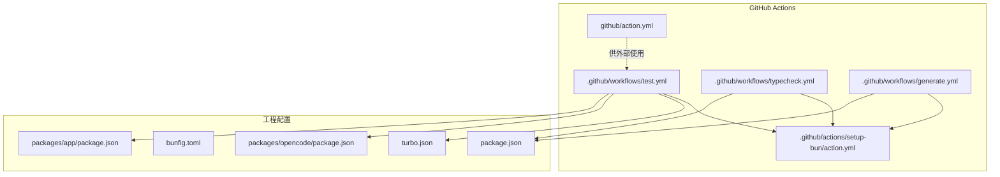
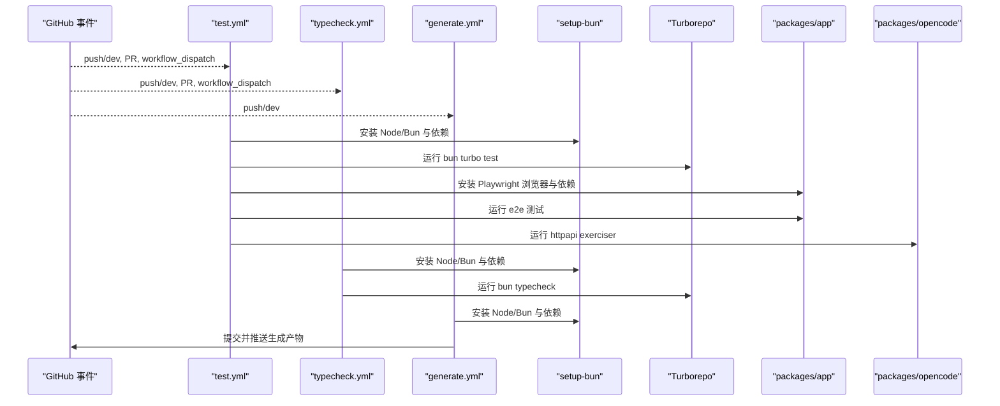
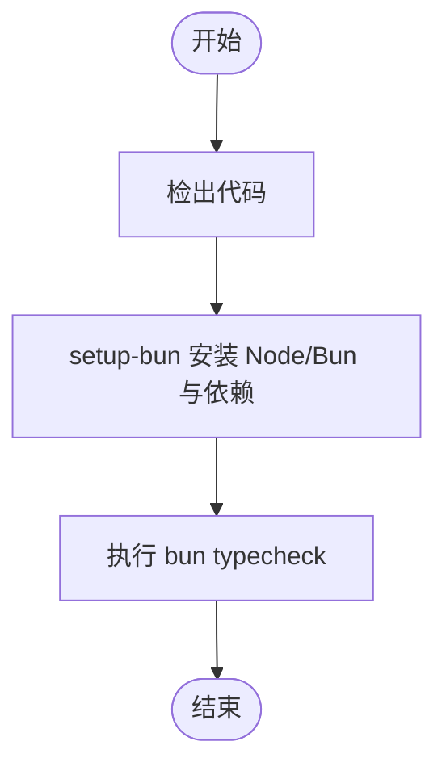
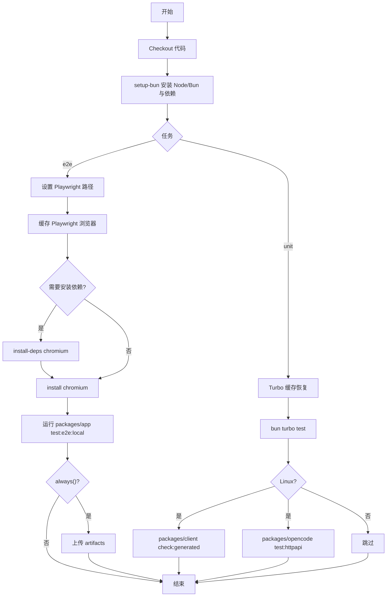
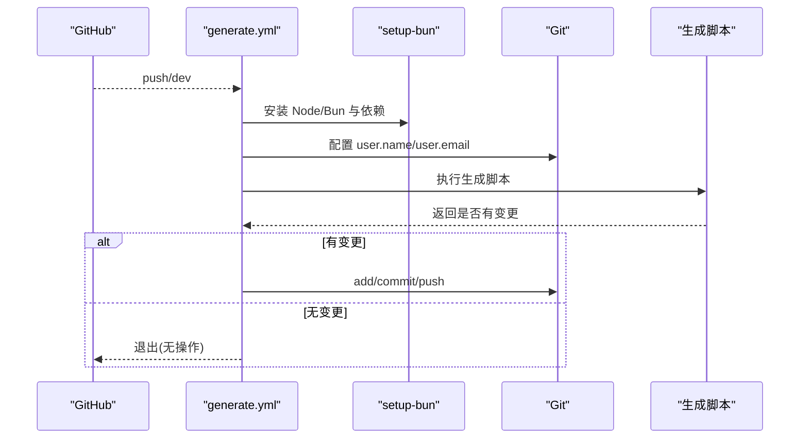
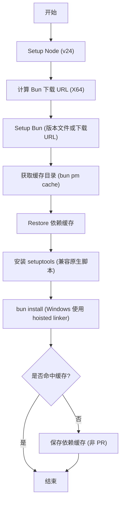
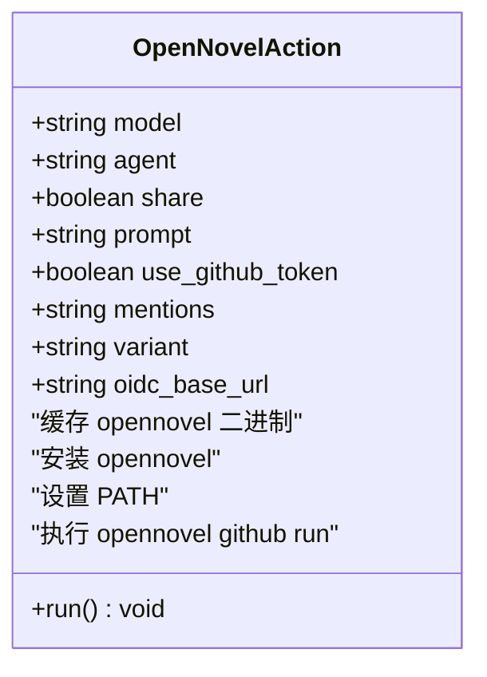
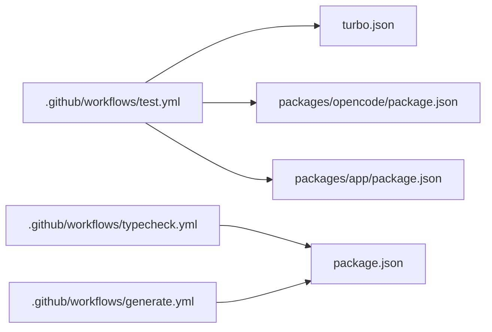

# GitHub Actions 工作流

<cite>
**本文引用的文件**   
- [.github/workflows/generate.yml](file://.github/workflows/generate.yml)
- [.github/workflows/test.yml](file://.github/workflows/test.yml)
- [.github/workflows/typecheck.yml](file://.github/workflows/typecheck.yml)
- [.github/actions/setup-bun/action.yml](file://.github/actions/setup-bun/action.yml)
- [turbo.json](file://turbo.json)
- [bunfig.toml](file://bunfig.toml)
- [package.json](file://package.json)
- [packages/opencode/package.json](file://packages/opencode/package.json)
- [packages/app/package.json](file://packages/app/package.json)
- [github/action.yml](file://github/action.yml)
</cite>

## 目录
1. [简介](#简介)
2. [项目结构](#项目结构)
3. [核心组件](#核心组件)
4. [架构总览](#架构总览)
5. [详细组件分析](#详细组件分析)
6. [依赖关系分析](#依赖关系分析)
7. [性能与缓存策略](#性能与缓存策略)
8. [故障排查指南](#故障排查指南)
9. [结论](#结论)
10. [附录](#附录)

## 简介
本文件为 openNovel 项目的 GitHub Actions 工作流配置文档，覆盖代码质量检查、单元测试执行、集成测试（HTTP API Exerciser）与端到端测试（Playwright），以及生成任务。文档解释触发条件、环境变量、缓存策略、自定义 Action 的使用方式与最佳实践，并给出错误处理、通知机制与监控集成的建议。

## 项目结构
仓库采用多包管理（Bun Workspaces + Turborepo），CI/CD 相关脚本与配置集中在 .github 目录，同时提供可复用的自定义 Action。关键位置如下：
- 工作流定义：.github/workflows/*.yml
- 自定义 Action：.github/actions/* 与 github/action.yml
- 任务编排与缓存：turbo.json、bunfig.toml
- 脚本入口与命令：根 package.json、各子包 package.json

**图表来源** 
- [.github/workflows/test.yml:1-152](file://.github/workflows/test.yml#L1-L152)
- [.github/workflows/typecheck.yml:1-22](file://.github/workflows/typecheck.yml#L1-L22)
- [.github/workflows/generate.yml:1-40](file://.github/workflows/generate.yml#L1-L40)
- [.github/actions/setup-bun/action.yml:1-74](file://.github/actions/setup-bun/action.yml#L1-L74)
- [turbo.json:1-34](file://turbo.json#L1-L34)
- [bunfig.toml:1-9](file://bunfig.toml#L1-L9)
- [package.json:1-162](file://package.json#L1-L162)
- [packages/opencode/package.json:1-159](file://packages/opencode/package.json#L1-L159)
- [packages/app/package.json:1-97](file://packages/app/package.json#L1-L97)

**章节来源**
- [.github/workflows/test.yml:1-152](file://.github/workflows/test.yml#L1-L152)
- [.github/workflows/typecheck.yml:1-22](file://.github/workflows/typecheck.yml#L1-L22)
- [.github/workflows/generate.yml:1-40](file://.github/workflows/generate.yml#L1-L40)
- [.github/actions/setup-bun/action.yml:1-74](file://.github/actions/setup-bun/action.yml#L1-L74)
- [turbo.json:1-34](file://turbo.json#L1-L34)
- [bunfig.toml:1-9](file://bunfig.toml#L1-L9)
- [package.json:1-162](file://package.json#L1-L162)
- [packages/opencode/package.json:1-159](file://packages/opencode/package.json#L1-L159)
- [packages/app/package.json:1-97](file://packages/app/package.json#L1-L97)

## 核心组件
- 类型检查工作流 typecheck：在 push/pull_request 到 dev 分支时运行，基于 Bun 执行全局 typecheck。
- 测试工作流 test：在 push 到 dev、任意 pull_request 或手动触发时运行；包含单元与 E2E 两类任务，跨 Linux/Windows 矩阵执行，并使用 Turbo 缓存与 Playwright 浏览器缓存。
- 生成工作流 generate：仅在 dev 分支 push 触发，用于自动生成产物并提交回原分支。
- 自定义 Action setup-bun：封装 Node/Bun 安装、依赖缓存与平台差异处理。
- 自定义 Action opennovel GitHub Action：封装 openNovel CLI 的安装、缓存与运行，支持 OIDC/GITHUB_TOKEN 等参数。

**章节来源**
- [.github/workflows/typecheck.yml:1-22](file://.github/workflows/typecheck.yml#L1-L22)
- [.github/workflows/test.yml:1-152](file://.github/workflows/test.yml#L1-L152)
- [.github/workflows/generate.yml:1-40](file://.github/workflows/generate.yml#L1-L40)
- [.github/actions/setup-bun/action.yml:1-74](file://.github/actions/setup-bun/action.yml#L1-L74)
- [github/action.yml:1-80](file://github/action.yml#L1-L80)

## 架构总览
下图展示了三个工作流的触发点、执行环境与关键步骤的交互关系。

**图表来源** 
- [.github/workflows/test.yml:1-152](file://.github/workflows/test.yml#L1-L152)
- [.github/workflows/typecheck.yml:1-22](file://.github/workflows/typecheck.yml#L1-L22)
- [.github/workflows/generate.yml:1-40](file://.github/workflows/generate.yml#L1-L40)
- [.github/actions/setup-bun/action.yml:1-74](file://.github/actions/setup-bun/action.yml#L1-L74)
- [turbo.json:1-34](file://turbo.json#L1-L34)

## 详细组件分析

### 类型检查工作流（typecheck）
- 触发条件：push 到 dev、对 dev 的 pull_request、workflow_dispatch。
- 执行环境：ubuntu-latest。
- 关键步骤：
  - 检出代码
  - 使用自定义 Action setup-bun 安装 Node/Bun 与依赖
  - 执行 bun typecheck（由根 package.json 脚本驱动）

**图表来源** 
- [.github/workflows/typecheck.yml:1-22](file://.github/workflows/typecheck.yml#L1-L22)
- [.github/actions/setup-bun/action.yml:1-74](file://.github/actions/setup-bun/action.yml#L1-L74)
- [package.json:1-162](file://package.json#L1-L162)

**章节来源**
- [.github/workflows/typecheck.yml:1-22](file://.github/workflows/typecheck.yml#L1-L22)
- [.github/actions/setup-bun/action.yml:1-74](file://.github/actions/setup-bun/action.yml#L1-L74)
- [package.json:1-162](file://package.json#L1-L162)

### 测试工作流（test）
- 触发条件：push 到 dev、任意 pull_request、workflow_dispatch。
- 并发控制：按分支与工作流分组，避免干扰默认分支历史，PR 与其他分支共享组并取消旧运行。
- 权限与环境：读取内容、写入 checks；设置 FORCE_JAVASCRIPT_ACTIONS_TO_NODE24。
- 任务划分：
  - unit：Linux/Windows 矩阵，使用 Turbo 缓存，运行 bun turbo test，并在 Linux 上执行客户端生成校验与 HTTP API Exerciser。
  - e2e：Linux/Windows 矩阵，缓存 Playwright 浏览器，安装系统依赖后运行应用级 E2E 测试，失败时上传报告与结果。

**图表来源** 
- [.github/workflows/test.yml:1-152](file://.github/workflows/test.yml#L1-L152)
- [.github/actions/setup-bun/action.yml:1-74](file://.github/actions/setup-bun/action.yml#L1-L74)
- [turbo.json:1-34](file://turbo.json#L1-L34)
- [packages/app/package.json:1-97](file://packages/app/package.json#L1-L97)
- [packages/opencode/package.json:1-159](file://packages/opencode/package.json#L1-L159)

**章节来源**
- [.github/workflows/test.yml:1-152](file://.github/workflows/test.yml#L1-L152)
- [.github/actions/setup-bun/action.yml:1-74](file://.github/actions/setup-bun/action.yml#L1-L74)
- [turbo.json:1-34](file://turbo.json#L1-L34)
- [packages/app/package.json:1-97](file://packages/app/package.json#L1-L97)
- [packages/opencode/package.json:1-159](file://packages/opencode/package.json#L1-L159)

### 生成工作流（generate）
- 触发条件：仅 push 到 dev 分支。
- 目的：自动运行生成脚本并将变更提交回当前分支。
- 关键步骤：
  - 检出代码（使用 secrets.GITHUB_TOKEN）
  - setup-bun 安装环境
  - 配置 git 用户信息
  - 执行生成脚本
  - 有变更则提交并推送

**图表来源** 
- [.github/workflows/generate.yml:1-40](file://.github/workflows/generate.yml#L1-L40)
- [.github/actions/setup-bun/action.yml:1-74](file://.github/actions/setup-bun/action.yml#L1-L74)

**章节来源**
- [.github/workflows/generate.yml:1-40](file://.github/workflows/generate.yml#L1-L40)
- [.github/actions/setup-bun/action.yml:1-74](file://.github/actions/setup-bun/action.yml#L1-L74)

### 自定义 Action：setup-bun
- 功能：统一安装 Node/Bun、计算并恢复依赖缓存、处理 Windows 特殊安装参数、安装 setuptools 兼容原生模块。
- 输入：install-flags（可选，传递给 bun install）。
- 缓存键：基于操作系统与 bun.lock 哈希。
- 保存策略：非 PR 且未命中缓存时保存依赖缓存。

**图表来源** 
- [.github/actions/setup-bun/action.yml:1-74](file://.github/actions/setup-bun/action.yml#L1-L74)

**章节来源**
- [.github/actions/setup-bun/action.yml:1-74](file://.github/actions/setup-bun/action.yml#L1-L74)

### 自定义 Action：opennovel GitHub Action
- 功能：缓存并安装 openNovel CLI，注入环境变量后执行 opennovel github run。
- 输入项：model、agent、share、prompt、use_github_token、mentions、variant、oidc_base_url。
- 缓存键：基于 OS、架构与最新版本 tag。

**图表来源** 
- [github/action.yml:1-80](file://github/action.yml#L1-L80)

**章节来源**
- [github/action.yml:1-80](file://github/action.yml#L1-L80)

## 依赖关系分析
- 工作流与脚本依赖：
  - test.yml 依赖 Turbo 任务、各子包的测试脚本与 Playwright。
  - typecheck.yml 依赖根脚本 typecheck。
  - generate.yml 依赖根生成脚本。
- 包内脚本：
  - 根 package.json 提供 typecheck、lint、dev 等脚本。
  - packages/opencode 提供 test:httpapi 与多种测试模式。
  - packages/app 提供 e2e 测试脚本与浏览器依赖安装。

**图表来源** 
- [.github/workflows/test.yml:1-152](file://.github/workflows/test.yml#L1-L152)
- [.github/workflows/typecheck.yml:1-22](file://.github/workflows/typecheck.yml#L1-L22)
- [.github/workflows/generate.yml:1-40](file://.github/workflows/generate.yml#L1-L40)
- [turbo.json:1-34](file://turbo.json#L1-L34)
- [package.json:1-162](file://package.json#L1-L162)
- [packages/opencode/package.json:1-159](file://packages/opencode/package.json#L1-L159)
- [packages/app/package.json:1-97](file://packages/app/package.json#L1-L97)

**章节来源**
- [.github/workflows/test.yml:1-152](file://.github/workflows/test.yml#L1-L152)
- [.github/workflows/typecheck.yml:1-22](file://.github/workflows/typecheck.yml#L1-L22)
- [.github/workflows/generate.yml:1-40](file://.github/workflows/generate.yml#L1-L40)
- [turbo.json:1-34](file://turbo.json#L1-L34)
- [package.json:1-162](file://package.json#L1-L162)
- [packages/opencode/package.json:1-159](file://packages/opencode/package.json#L1-L159)
- [packages/app/package.json:1-97](file://packages/app/package.json#L1-L97)

## 性能与缓存策略
- Turbo 缓存：
  - 路径：node_modules/.cache/turbo
  - 键：基于操作系统、turbo.json 与各包 package.json 哈希与提交 SHA
  - 恢复键：按操作系统与包清单渐进恢复
- Bun 依赖缓存：
  - 路径：bun pm cache
  - 键：操作系统与 bun.lock 哈希
  - 保存：非 PR 且未命中缓存时保存
- Playwright 浏览器缓存：
  - 路径：.playwright-browsers
  - 键：操作系统+架构+Playwright 版本+chromium
  - 条件：仅在未命中缓存时安装浏览器与系统依赖
- 并发与取消：
  - 按工作流与分支/PR 分组，避免污染默认分支历史
  - 启用 cancel-in-progress 以取消陈旧运行

**章节来源**
- [.github/workflows/test.yml:1-152](file://.github/workflows/test.yml#L1-L152)
- [.github/actions/setup-bun/action.yml:1-74](file://.github/actions/setup-bun/action.yml#L1-L74)
- [turbo.json:1-34](file://turbo.json#L1-L34)

## 故障排查指南
- 常见问题定位：
  - 类型检查失败：确认 TypeScript 版本与 tsgo 可用，检查包间依赖构建顺序（Turbo 任务依赖）。
  - 单元测试失败：查看 Turbo 输出与包内测试日志；Windows 下可能需关闭文件监听（OPENCODE_EXPERIMENTAL_DISABLE_FILEWATCHER=true）。
  - HTTP API Exerciser 失败：检查 --mode 与场景过滤参数，确认服务启动与鉴权配置。
  - E2E 测试失败：确认 Playwright 浏览器已安装、系统依赖齐全；查看上传的 artifacts（测试结果与报告）。
- 调试建议：
  - 在本地使用 bun test 与 playwright test 复现问题
  - 增加超时时间（如 unit 任务 20 分钟、e2e 任务 30 分钟）
  - 通过 actions/cache 的 restore-keys 验证缓存命中情况
- 通知与监控：
  - 可在工作流末尾添加 Slack/Discord/邮件通知步骤
  - 结合 Sentry/Vercel Analytics 等工具上报 CI 状态与错误指标

**章节来源**
- [.github/workflows/test.yml:1-152](file://.github/workflows/test.yml#L1-L152)
- [packages/opencode/package.json:1-159](file://packages/opencode/package.json#L1-L159)
- [packages/app/package.json:1-97](file://packages/app/package.json#L1-L97)

## 结论
openNovel 的 GitHub Actions 工作流围绕类型检查、单元测试、HTTP API Exerciser 与 E2E 测试展开，借助自定义 Action 与缓存策略实现跨平台稳定执行与快速迭代。建议在后续演进中补充更细粒度的覆盖率收集、发布流水线与告警通知，以提升交付质量与可观测性。

## 附录
- 环境变量参考：
  - CI：标识 CI 环境
  - OPENCODE_EXPERIMENTAL_DISABLE_FILEWATCHER：Windows 下禁用文件监听
  - PLAYWRIGHT_BROWSERS_PATH：指定浏览器缓存路径
  - FORCE_JAVASCRIPT_ACTIONS_TO_NODE24：强制 JS 动作使用 Node 24
- 常用命令路径：
  - 类型检查：bun typecheck（根）
  - 单元测试：bun turbo test（根）
  - HTTP API Exerciser：bun run test:httpapi（packages/opencode）
  - E2E 测试：bun run test:e2e:local（packages/app）

**章节来源**
- [.github/workflows/test.yml:1-152](file://.github/workflows/test.yml#L1-L152)
- [.github/workflows/typecheck.yml:1-22](file://.github/workflows/typecheck.yml#L1-L22)
- [packages/opencode/package.json:1-159](file://packages/opencode/package.json#L1-L159)
- [packages/app/package.json:1-97](file://packages/app/package.json#L1-L97)
- [package.json:1-162](file://package.json#L1-L162)