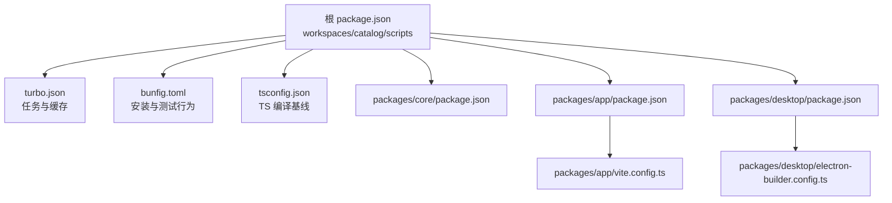
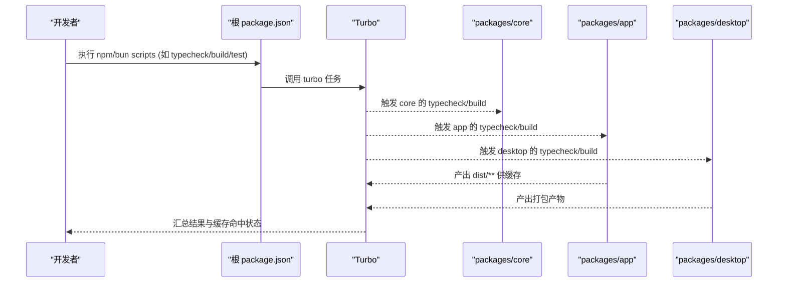
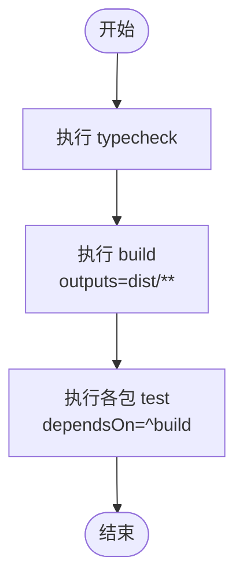
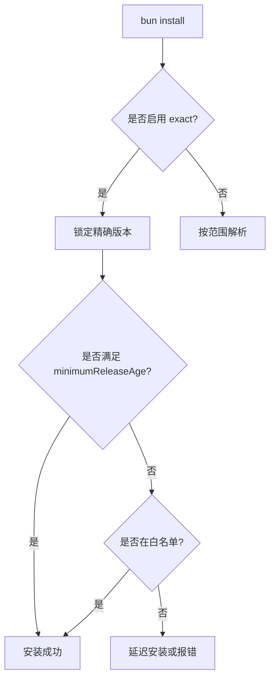
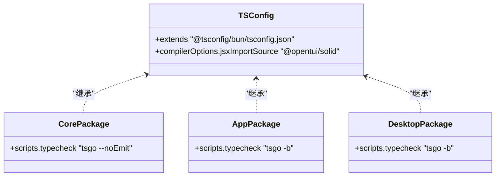
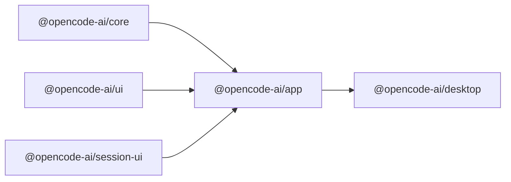
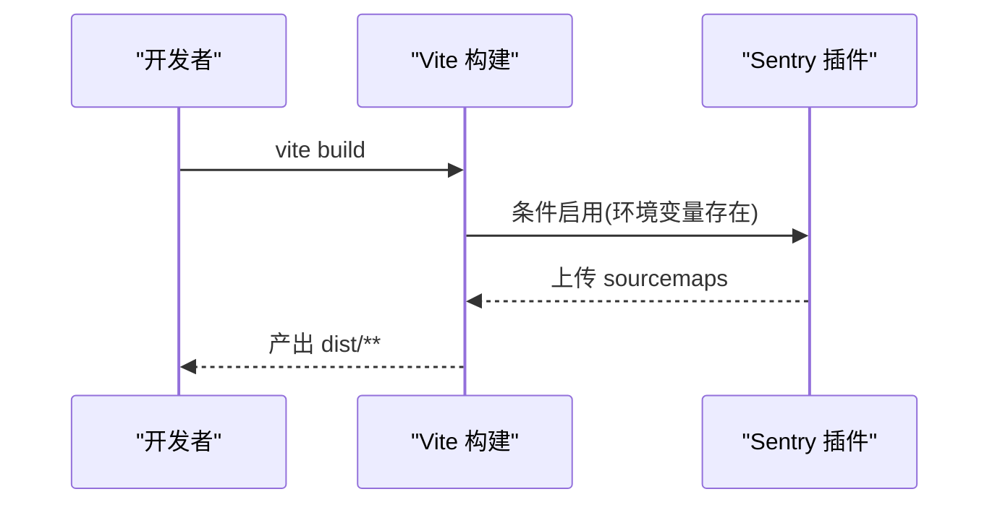
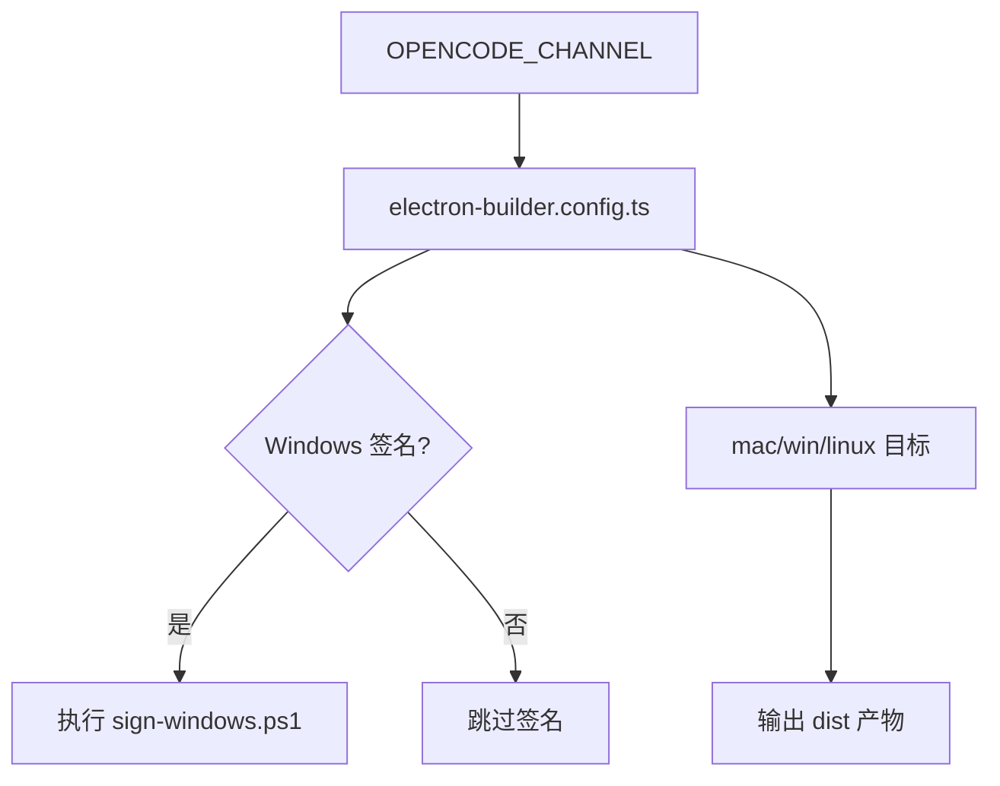
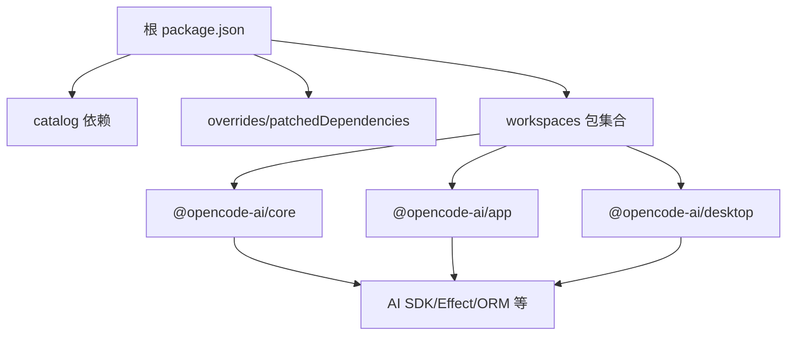

# 构建系统配置

<cite>
**本文引用的文件**   
- [turbo.json](file://turbo.json)
- [bunfig.toml](file://bunfig.toml)
- [tsconfig.json](file://tsconfig.json)
- [package.json](file://package.json)
- [packages/core/package.json](file://packages/core/package.json)
- [packages/app/package.json](file://packages/app/package.json)
- [packages/desktop/package.json](file://packages/desktop/package.json)
- [packages/app/vite.config.ts](file://packages/app/vite.config.ts)
- [packages/desktop/electron-builder.config.ts](file://packages/desktop/electron-builder.config.ts)
- [script/dev-all.ts](file://script/dev-all.ts)
- [perf/test-suite.md](file://perf/test-suite.md)
</cite>

## 目录
1. [简介](#简介)
2. [项目结构](#项目结构)
3. [核心组件](#核心组件)
4. [架构总览](#架构总览)
5. [详细组件分析](#详细组件分析)
6. [依赖分析](#依赖分析)
7. [性能考虑](#性能考虑)
8. [故障排除指南](#故障排除指南)
9. [结论](#结论)
10. [附录](#附录)

## 简介
本文件面向 openNovel Monorepo 的构建系统，系统性说明基于 Turbo、Bun 与 TypeScript 的构建策略。内容涵盖任务编排、依赖管理与并行构建优化；解释 Bun 运行时与 TypeScript 编译设置；描述 Monorepo 包间依赖解析与增量构建；并提供性能优化技巧与常见问题的排查方法。目标是帮助开发者快速理解并高效使用构建体系，同时为持续集成与本地开发提供稳定可靠的基线。

## 项目结构
openNovel 采用以 packages/* 为核心的 Monorepo 组织方式，根级通过 package.json 的 workspaces 与 catalog 统一管理依赖版本，并通过 turbo.json 定义跨包的任务与缓存策略。Bun 作为包管理器与运行时，配合 tsconfig.json 统一 TypeScript 编译行为。关键入口包括：
- 根脚本与命令：dev、typecheck、lint、test 等由根 package.json 暴露
- 前端应用：packages/app（Vite + Solid）
- 桌面端：packages/desktop（Electron + electron-vite + electron-builder）
- 核心库：packages/core（Effect/Node/Bun 多环境适配）

**图表来源** 
- [package.json:1-162](file://package.json#L1-L162)
- [turbo.json:1-34](file://turbo.json#L1-L34)
- [bunfig.toml:1-9](file://bunfig.toml#L1-L9)
- [tsconfig.json:1-8](file://tsconfig.json#L1-L8)
- [packages/core/package.json:1-133](file://packages/core/package.json#L1-L133)
- [packages/app/package.json:1-97](file://packages/app/package.json#L1-L97)
- [packages/desktop/package.json:1-77](file://packages/desktop/package.json#L1-L77)
- [packages/app/vite.config.ts:1-34](file://packages/app/vite.config.ts#L1-L34)
- [packages/desktop/electron-builder.config.ts:1-146](file://packages/desktop/electron-builder.config.ts#L1-L146)

**章节来源**
- [package.json:1-162](file://package.json#L1-L162)
- [turbo.json:1-34](file://turbo.json#L1-L34)
- [bunfig.toml:1-9](file://bunfig.toml#L1-L9)
- [tsconfig.json:1-8](file://tsconfig.json#L1-L8)

## 核心组件
- Turbo 构建系统
  - 全局环境变量与透传：globalEnv/globalPassThroughEnv
  - 任务定义：typecheck、build、各包的 test 任务及其依赖关系
  - 输出产物路径：outputs 用于增量缓存
- Bun 运行时与包管理
  - 安装策略：exact、minimumReleaseAge 与白名单
  - 测试根目录限制：避免在根目录误跑测试
- TypeScript 编译
  - 继承 @tsconfig/bun 基线
  - JSX 导入源指向 @opentui/solid
- Monorepo 工作区与 Catalog
  - workspaces 声明包范围
  - catalog 集中管理依赖版本，overrides 与 patchedDependencies 控制覆盖与补丁

**章节来源**
- [turbo.json:1-34](file://turbo.json#L1-L34)
- [bunfig.toml:1-9](file://bunfig.toml#L1-L9)
- [tsconfig.json:1-8](file://tsconfig.json#L1-L8)
- [package.json:1-162](file://package.json#L1-L162)

## 架构总览
下图展示从根命令到各包的构建流程与依赖关系，以及 Turbo 的任务编排如何驱动类型检查、构建与测试。

**图表来源** 
- [package.json:1-162](file://package.json#L1-L162)
- [turbo.json:1-34](file://turbo.json#L1-L34)
- [packages/app/package.json:1-97](file://packages/app/package.json#L1-L97)
- [packages/desktop/package.json:1-77](file://packages/desktop/package.json#L1-L77)
- [packages/core/package.json:1-133](file://packages/core/package.json#L1-L133)

## 详细组件分析

### Turbo 任务编排与依赖管理
- 任务定义
  - typecheck：无额外依赖，适合快速校验
  - build：默认无 dependsOn，输出至 dist/**，便于 Turbo 缓存
  - 各包 test：依赖 ^build（上游包构建完成），确保运行时代码可用
- 环境变量
  - globalEnv 与 globalPassThroughEnv 限定 CI 与功能开关
  - passThroughEnv 允许特定任务透传环境变量（如 *）
- 增量构建
  - outputs 指定产物目录，Turbo 据此判断缓存命中
  - 建议保持产物稳定路径，避免动态生成导致缓存失效

**图表来源** 
- [turbo.json:1-34](file://turbo.json#L1-L34)

**章节来源**
- [turbo.json:1-34](file://turbo.json#L1-L34)

### Bun 运行时与安装策略
- 安装策略
  - exact=true：锁定精确版本，提升可重复性
  - minimumReleaseAge：仅安装至少发布 3 天的包，降低不稳定风险
  - minimumReleaseAgeExcludes：对部分包放宽限制（如 AI SDK、平台原生包等）
- 测试根目录
  - root="./do-not-run-tests-from-root"：防止在仓库根误跑测试
- 开发脚本
  - dev-all.ts：同时启动后端与前端，统一信号处理与进程管理

**图表来源** 
- [bunfig.toml:1-9](file://bunfig.toml#L1-L9)
- [script/dev-all.ts:1-61](file://script/dev-all.ts#L1-L61)

**章节来源**
- [bunfig.toml:1-9](file://bunfig.toml#L1-L9)
- [script/dev-all.ts:1-61](file://script/dev-all.ts#L1-L61)

### TypeScript 编译设置
- 基线配置
  - extends="@tsconfig/bun/tsconfig.json"：针对 Bun 优化的 TS 配置
  - compilerOptions.jsxImportSource="@opentui/solid"：Solid JSX 支持
- 包内类型检查
  - packages/core 使用 tsgo --noEmit
  - packages/app 与 packages/desktop 使用 tsgo -b（构建模式）

**图表来源** 
- [tsconfig.json:1-8](file://tsconfig.json#L1-L8)
- [packages/core/package.json:1-133](file://packages/core/package.json#L1-L133)
- [packages/app/package.json:1-97](file://packages/app/package.json#L1-L97)
- [packages/desktop/package.json:1-77](file://packages/desktop/package.json#L1-L77)

**章节来源**
- [tsconfig.json:1-8](file://tsconfig.json#L1-L8)
- [packages/core/package.json:1-133](file://packages/core/package.json#L1-L133)
- [packages/app/package.json:1-97](file://packages/app/package.json#L1-L97)
- [packages/desktop/package.json:1-77](file://packages/desktop/package.json#L1-L77)

### Monorepo 包间依赖解析与增量构建
- 工作区声明
  - workspaces 包含 packages/*、console/*、stats/*、sdk/js、slack
  - catalog 集中管理依赖版本，overrides 与 patchedDependencies 控制覆盖与补丁
- 包间依赖
  - packages/app 依赖 @opencode-ai/core、@opencode-ai/ui、@opencode-ai/session-ui 等
  - packages/desktop 依赖 @opencode-ai/app、@opencode-ai/ui
- 增量构建
  - Turbo 根据 outputs 与输入变更决定缓存命中
  - 建议将 dist/** 作为稳定输出路径，避免频繁变动

**图表来源** 
- [package.json:1-162](file://package.json#L1-L162)
- [packages/app/package.json:1-97](file://packages/app/package.json#L1-L97)
- [packages/desktop/package.json:1-77](file://packages/desktop/package.json#L1-L77)

**章节来源**
- [package.json:1-162](file://package.json#L1-L162)
- [packages/app/package.json:1-97](file://packages/app/package.json#L1-L97)
- [packages/desktop/package.json:1-77](file://packages/desktop/package.json#L1-L77)

### 前端构建（Vite + Sentry）
- 插件与服务器
  - 使用 vite-plugin-solid 与 Tailwind
  - 可选集成 Sentry 上传 sourcemaps
- 构建目标
  - target="esnext"，开启 sourcemap
  - server.host=0.0.0.0，端口 3000

**图表来源** 
- [packages/app/vite.config.ts:1-34](file://packages/app/vite.config.ts#L1-L34)

**章节来源**
- [packages/app/vite.config.ts:1-34](file://packages/app/vite.config.ts#L1-L34)

### 桌面端打包（Electron + electron-builder）
- 渠道与签名
  - OPENCODE_CHANNEL 控制 dev/beta/prod
  - Windows 签名脚本在 GitHub Actions 中执行
- 产物与资源
  - files 包含 out/** 与 resources/**
  - extraResources 包含 native 模块与 Swift 构建产物
- 平台目标
  - macOS: dmg/zip，硬编码签名与公证
  - Windows: nsis 安装包
  - Linux: AppImage/deb/rpm，兼容 .desktop 文件

**图表来源** 
- [packages/desktop/electron-builder.config.ts:1-146](file://packages/desktop/electron-builder.config.ts#L1-L146)

**章节来源**
- [packages/desktop/electron-builder.config.ts:1-146](file://packages/desktop/electron-builder.config.ts#L1-L146)

## 依赖分析
- 根依赖与 Catalog
  - 通过 catalog 统一管理 typescript、vite、effect、zod 等核心依赖
  - overrides 与 patchedDependencies 用于覆盖第三方包与打补丁
- 包间依赖
  - app 依赖 core、ui、session-ui、schema、sdk 等
  - desktop 依赖 app、ui 及 Electron 生态
- 外部依赖
  - AI SDK 系列、Effect 生态、Drizzle ORM、Sentry、Tailwind 等

**图表来源** 
- [package.json:1-162](file://package.json#L1-L162)
- [packages/core/package.json:1-133](file://packages/core/package.json#L1-L133)
- [packages/app/package.json:1-97](file://packages/app/package.json#L1-L97)
- [packages/desktop/package.json:1-77](file://packages/desktop/package.json#L1-L77)

**章节来源**
- [package.json:1-162](file://package.json#L1-L162)
- [packages/core/package.json:1-133](file://packages/core/package.json#L1-L133)
- [packages/app/package.json:1-97](file://packages/app/package.json#L1-L97)
- [packages/desktop/package.json:1-77](file://packages/desktop/package.json#L1-L77)

## 性能考虑
- 并行构建
  - 使用 Turbo 的并发能力，合理划分任务与 outputs，最大化缓存命中
- 增量构建
  - 保持 dist/** 稳定，避免动态文件名或路径变化
  - 减少不必要的依赖更新，利用 minimumReleaseAge 降低不稳定因素
- 测试性能
  - 参考 perf/test-suite.md 中的基准与 profiling 方法，定位慢测试与瓶颈
  - 使用只失败测试与 watch 模式加速迭代
- 开发与调试
  - dev-all.ts 统一启动前后端，减少手动操作开销
  - 合理设置环境变量与端口，避免冲突

[本节为通用指导，不直接分析具体文件]

## 故障排除指南
- 构建缓存未命中
  - 检查 outputs 配置是否与实际产物一致
  - 确认输入文件未被意外修改（如时间戳或权限）
- 依赖解析失败
  - 核对 catalog 版本与 overrides/patchedDependencies 是否正确
  - 清理 node_modules 与缓存后重试
- 测试无法运行
  - 确保不在根目录执行测试（bunfig.toml 的限制）
  - 检查包内 test 脚本与依赖是否齐全
- 桌面端打包失败
  - 验证 OPENCODE_CHANNEL 与签名脚本权限
  - 检查 native 模块与资源路径是否正确

**章节来源**
- [turbo.json:1-34](file://turbo.json#L1-L34)
- [bunfig.toml:1-9](file://bunfig.toml#L1-L9)
- [packages/desktop/electron-builder.config.ts:1-146](file://packages/desktop/electron-builder.config.ts#L1-L146)

## 结论
openNovel 的构建系统以 Turbo 为核心，结合 Bun 与 TypeScript，形成高效的 Monorepo 构建与测试流水线。通过合理的任务编排、依赖管理与增量构建策略，显著提升了开发与 CI 效率。建议持续关注性能基准与问题排查，持续优化构建体验与稳定性。

[本节为总结，不直接分析具体文件]

## 附录
- 常用命令
  - 类型检查：bun run typecheck
  - 构建：bun turbo build
  - 测试：在各包内执行 bun run test
  - 开发：bun run dev:all
- 环境变量
  - CI、OPENCODE_DISABLE_SHARE、SENTRY_*、OPENCODE_CHANNEL 等

[本节为补充信息，不直接分析具体文件]