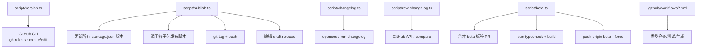
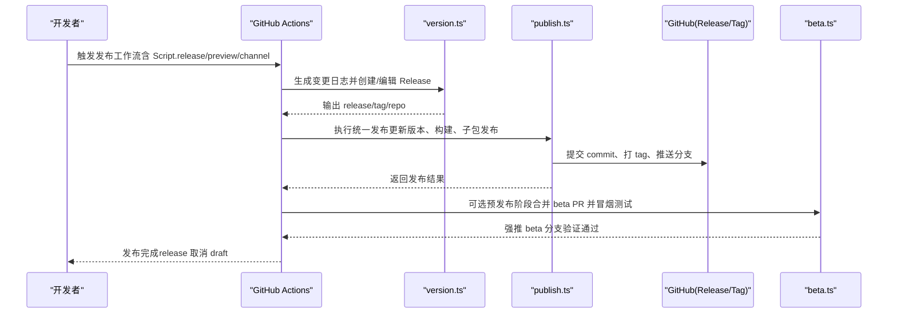
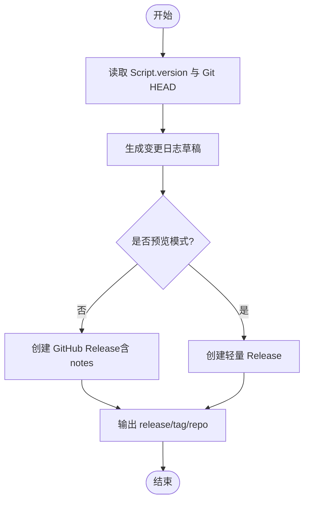
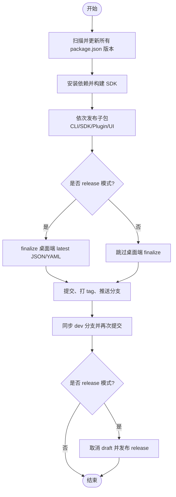
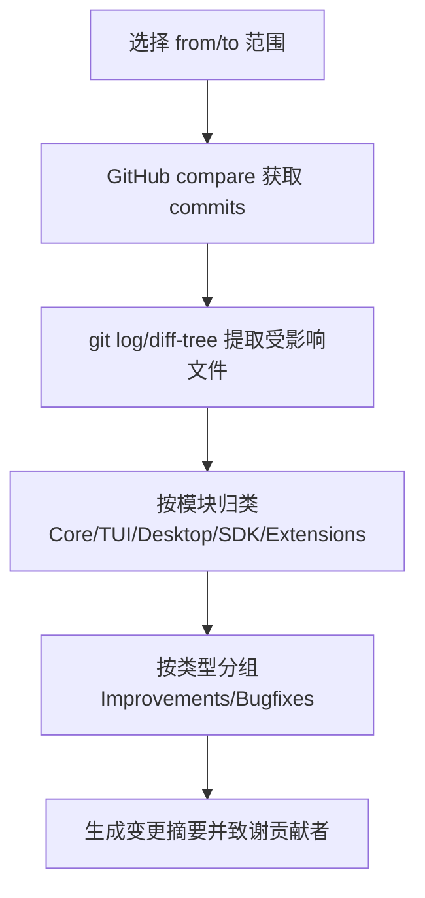
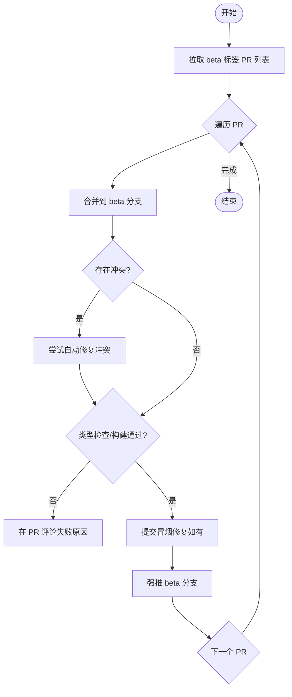
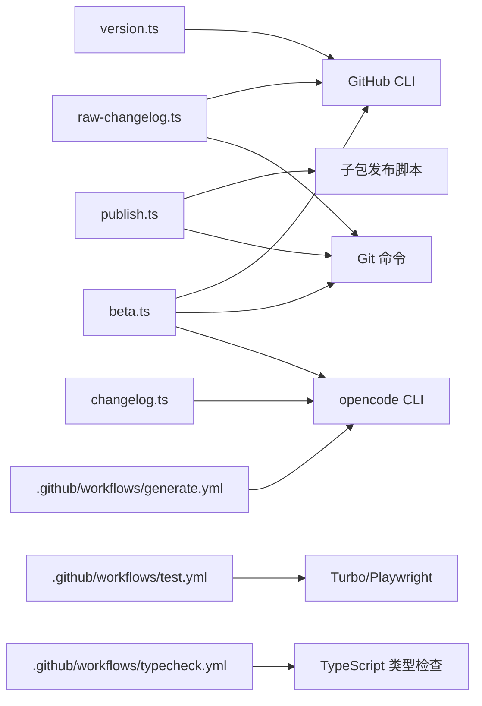

# 版本管理与发布

<cite>
**本文引用的文件**   
- [script/version.ts](file://script/version.ts)
- [script/publish.ts](file://script/publish.ts)
- [script/changelog.ts](file://script/changelog.ts)
- [script/raw-changelog.ts](file://script/raw-changelog.ts)
- [script/beta.ts](file://script/beta.ts)
- [.github/workflows/generate.yml](file://.github/workflows/generate.yml)
- [.github/workflows/test.yml](file://.github/workflows/test.yml)
- [.github/workflows/typecheck.yml](file://.github/workflows/typecheck.yml)
- [package.json](file://package.json)
</cite>

## 目录
1. [简介](#简介)
2. [项目结构](#项目结构)
3. [核心组件](#核心组件)
4. [架构总览](#架构总览)
5. [详细组件分析](#详细组件分析)
6. [依赖关系分析](#依赖关系分析)
7. [性能与质量门禁](#性能与质量门禁)
8. [故障排查指南](#故障排查指南)
9. [结论](#结论)
10. [附录：语义化版本策略与回滚建议](#附录：语义化版本策略与回滚建议)

## 简介
本文件面向 openNovel 项目的版本管理与发布流程，覆盖以下要点：
- 语义化版本控制策略（主/次/补丁）及分支与标签规范
- 自动变更日志生成与发布脚本使用方法
- 多环境发布流程（开发、预发布、生产）与部署策略
- 回滚机制与发布质量门禁配置
- GitHub Actions 工作流在类型检查、测试与生成任务中的角色

## 项目结构
与版本和发布相关的核心脚本位于根目录 script 下，配合 .github/workflows 的 CI/CD 工作流完成自动化。关键文件包括：
- version.ts：生成版本号、创建或编辑 GitHub Release，并输出 release/tag/repo 等变量
- publish.ts：统一更新所有包版本、构建产物、打标签、推送分支与 tag、发布 draft release
- changelog.ts：封装 opencode 命令生成 UPCOMING_CHANGELOG.md
- raw-changelog.ts：基于 git diff 与 GitHub API 生成原始变更摘要
- beta.ts：将带 beta 标签的 PR 合并到 beta 分支，执行类型检查与构建冒烟测试，最终强推 beta 分支
- package.json：定义 monorepo 工作区与脚本入口

**图表来源** 
- [script/version.ts:1-37](file://script/version.ts#L1-L37)
- [script/publish.ts:1-74](file://script/publish.ts#L1-L74)
- [script/changelog.ts:1-77](file://script/changelog.ts#L1-L77)
- [script/raw-changelog.ts:1-284](file://script/raw-changelog.ts#L1-L284)
- [script/beta.ts:1-361](file://script/beta.ts#L1-L361)
- [.github/workflows/generate.yml:1-40](file://.github/workflows/generate.yml#L1-L40)
- [.github/workflows/test.yml:1-152](file://.github/workflows/test.yml#L1-L152)
- [.github/workflows/typecheck.yml:1-22](file://.github/workflows/typecheck.yml#L1-L22)

**章节来源**
- [package.json:1-162](file://package.json#L1-L162)

## 核心组件
- 版本生成与 Release 管理（version.ts）
  - 读取 Script.version 与 Git HEAD，生成变更日志草稿，写入临时文件作为 release notes
  - 非预览模式：创建 GitHub Release（draft），并输出 release/databaseId、tag、repo
  - Beta 渠道预览模式：创建轻量 release 并输出必要变量供后续步骤使用
- 统一发布（publish.ts）
  - 扫描所有 package.json，批量替换版本号为 Script.version
  - 安装依赖、构建 SDK 产物
  - 依次调用各子包发布脚本（CLI、SDK、Plugin、UI 等）
  - 可选 finalize 桌面端 latest JSON/YAML
  - 提交并打 tag，推送至远端；同步 dev 分支并再次提交
  - 若为 release 模式，则取消 draft 状态发布 release
- 变更日志生成（changelog.ts、raw-changelog.ts）
  - changelog.ts：通过 opencode run changelog 生成 UPCOMING_CHANGELOG.md，支持 quiet/print/variant 等参数
  - raw-changelog.ts：基于 GitHub compare API 与 git log/diff-tree，按模块与类型分组生成变更摘要，并致谢贡献者
- 预发布流水线（beta.ts）
  - 拉取带 beta 标签的 PR，逐个合并到 beta 分支
  - 冲突时尝试自动修复，失败则记录原因并在 PR 评论中说明
  - 运行类型检查与构建冒烟测试，通过后强推 beta 分支

**章节来源**
- [script/version.ts:1-37](file://script/version.ts#L1-L37)
- [script/publish.ts:1-74](file://script/publish.ts#L1-L74)
- [script/changelog.ts:1-77](file://script/changelog.ts#L1-L77)
- [script/raw-changelog.ts:1-284](file://script/raw-changelog.ts#L1-L284)
- [script/beta.ts:1-361](file://script/beta.ts#L1-L361)

## 架构总览
下图展示了从“准备发布”到“上线发布”的关键交互路径，以及 CI 门禁的作用点。

**图表来源** 
- [script/version.ts:1-37](file://script/version.ts#L1-L37)
- [script/publish.ts:1-74](file://script/publish.ts#L1-L74)
- [script/beta.ts:1-361](file://script/beta.ts#L1-L361)
- [.github/workflows/generate.yml:1-40](file://.github/workflows/generate.yml#L1-L40)
- [.github/workflows/test.yml:1-152](file://.github/workflows/test.yml#L1-L152)
- [.github/workflows/typecheck.yml:1-22](file://.github/workflows/typecheck.yml#L1-L22)

## 详细组件分析

### 版本生成与 Release（version.ts）
- 输入来源
  - Script.version：由上层脚本或环境变量注入的版本号
  - Git HEAD：用于定位目标提交
- 主要行为
  - 生成变更日志草稿并写入临时文件
  - 非预览模式：创建 GitHub Release（包含 notes-file），并输出 release/databaseId、tag、repo
  - Beta 渠道预览模式：创建轻量 release 并输出必要变量
- 适用场景
  - 正式 release：生成完整 release notes 并创建 release
  - 预发布/预览：快速创建 release 以便后续制品上传与校验

**图表来源** 
- [script/version.ts:1-37](file://script/version.ts#L1-L37)

**章节来源**
- [script/version.ts:1-37](file://script/version.ts#L1-L37)

### 统一发布（publish.ts）
- 版本同步
  - 扫描所有 package.json，替换版本号
  - 安装依赖并构建 SDK 产物
- 子包发布
  - 依次调用 CLI、SDK、Plugin、UI 等子包的发布脚本
- 发布收尾
  - 可选 finalize 桌面端 latest JSON/YAML
  - 提交并打 tag，推送至远端；同步 dev 分支并二次提交
  - 若为 release 模式，取消 draft 状态发布 release

**图表来源** 
- [script/publish.ts:1-74](file://script/publish.ts#L1-L74)

**章节来源**
- [script/publish.ts:1-74](file://script/publish.ts#L1-L74)

### 变更日志生成（changelog.ts、raw-changelog.ts）
- changelog.ts
  - 通过 opencode run changelog 生成 UPCOMING_CHANGELOG.md
  - 支持 quiet/print/variant 等参数，便于 CI 静默或调试
- raw-changelog.ts
  - 基于 GitHub compare API 获取提交列表，过滤忽略前缀（ignore/test/chore/ci/release）
  - 根据文件路径归类到 Core/TUI/Desktop/SDK/Extensions 等模块
  - 按 Improvements/Bugfixes 分类，并致谢贡献者

**图表来源** 
- [script/changelog.ts:1-77](file://script/changelog.ts#L1-L77)
- [script/raw-changelog.ts:1-284](file://script/raw-changelog.ts#L1-L284)

**章节来源**
- [script/changelog.ts:1-77](file://script/changelog.ts#L1-L77)
- [script/raw-changelog.ts:1-284](file://script/raw-changelog.ts#L1-L284)

### 预发布流水线（beta.ts）
- 功能概述
  - 拉取带 beta 标签的 PR，逐个合并到 beta 分支
  - 遇到冲突时尝试自动修复，失败则在 PR 上评论说明
  - 运行类型检查与构建冒烟测试，通过后强推 beta 分支
- 质量门禁
  - 类型检查（bun typecheck）
  - 构建冒烟（packages/opencode 单包构建）
  - 冲突自动修复与 bun.lock 重建

**图表来源** 
- [script/beta.ts:1-361](file://script/beta.ts#L1-L361)

**章节来源**
- [script/beta.ts:1-361](file://script/beta.ts#L1-L361)

## 依赖关系分析
- 脚本间依赖
  - version.ts 依赖 GitHub CLI（gh）与 Bun 文件系统
  - publish.ts 依赖 Bun Glob、Bun File、Git 命令与各子包发布脚本
  - changelog.ts 依赖 opencode CLI
  - raw-changelog.ts 依赖 GitHub CLI（gh）与 Git 命令
  - beta.ts 依赖 GitHub CLI（gh）、Git 命令与 opencode CLI
- CI 工作流依赖
  - generate.yml：在 dev 分支 push 后执行代码生成任务
  - test.yml：在 dev 分支 push 与 PR 上执行单元与端到端测试
  - typecheck.yml：在 dev 分支 push 与 PR 上执行类型检查

**图表来源** 
- [script/version.ts:1-37](file://script/version.ts#L1-L37)
- [script/publish.ts:1-74](file://script/publish.ts#L1-L74)
- [script/changelog.ts:1-77](file://script/changelog.ts#L1-L77)
- [script/raw-changelog.ts:1-284](file://script/raw-changelog.ts#L1-L284)
- [script/beta.ts:1-361](file://script/beta.ts#L1-L361)
- [.github/workflows/generate.yml:1-40](file://.github/workflows/generate.yml#L1-L40)
- [.github/workflows/test.yml:1-152](file://.github/workflows/test.yml#L1-L152)
- [.github/workflows/typecheck.yml:1-22](file://.github/workflows/typecheck.yml#L1-L22)

**章节来源**
- [package.json:1-162](file://package.json#L1-L162)

## 性能与质量门禁
- 类型检查门禁
  - typecheck.yml：在 dev 分支与 PR 上强制类型检查，确保类型安全
- 单元测试与端到端测试
  - test.yml：并行矩阵（Linux/Windows），缓存 Turbo 与 Playwright 浏览器，提升速度
  - 提供 HTTP API 执行器门禁（packages/opencode）
- 构建冒烟测试
  - beta.ts：在合并 beta PR 后执行单包构建冒烟，确保可构建性
- 缓存策略
  - Turbo 缓存、Playwright 浏览器缓存，减少重复下载与构建时间

**章节来源**
- [.github/workflows/typecheck.yml:1-22](file://.github/workflows/typecheck.yml#L1-L22)
- [.github/workflows/test.yml:1-152](file://.github/workflows/test.yml#L1-L152)
- [script/beta.ts:1-361](file://script/beta.ts#L1-L361)

## 故障排查指南
- 常见问题与定位
  - 变更日志为空：确认 from/to 范围是否正确，raw-changelog.ts 会过滤 ignore/test/chore/ci/release 前缀
  - Release 未发布：检查是否为 release 模式（publish.ts 仅在 release=true 且非 preview 时取消 draft）
  - 预发布失败：查看 beta.ts 输出的失败原因与 PR 评论，确认类型检查与构建是否通过
  - 依赖安装失败：清理并重新生成 bun.lock（beta.ts 已内置处理逻辑）
- 建议操作
  - 本地复现：先运行 bun typecheck 与单包构建，再执行 beta.ts 流程
  - 查看日志：在 CI 中下载 artifacts（如 Playwright 报告）辅助定位问题

**章节来源**
- [script/raw-changelog.ts:1-284](file://script/raw-changelog.ts#L1-L284)
- [script/publish.ts:1-74](file://script/publish.ts#L1-L74)
- [script/beta.ts:1-361](file://script/beta.ts#L1-L361)

## 结论
openNovel 的版本与发布体系以脚本为核心、CI 为门禁，形成从“变更日志生成—版本同步—子包发布—打标签—Release 发布”的闭环。beta.ts 提供了稳定的预发布通道，typecheck 与 test 工作流保障质量。建议在正式发布前优先走 beta 分支验证，再通过 publish.ts 与 version.ts 完成生产发布。

## 附录：语义化版本策略与回滚建议
- 语义化版本（SemVer）策略
  - 主版本（Major）：不兼容的 API/协议变更，需升级依赖或迁移指引
  - 次版本（Minor）：向后兼容的功能新增
  - 补丁版本（Patch）：向后兼容的问题修复
- 分支与标签规范
  - dev：持续集成与日常开发
  - beta：预发布分支，仅合并带 beta 标签的 PR，并通过冒烟测试
  - 标签：vX.Y.Z（遵循 SemVer），对应 GitHub Release
- 回滚机制
  - 快速回退：回退到上一个稳定 tag 的 commit，并重新发布该 tag
  - 发布回退：若 release 已发布但存在问题，可通过 gh release 删除或标记废弃，并重新发布新版本
  - 分支回退：必要时对 dev/beta 分支进行 revert 提交，确保一致性

[本节为概念性指导，不直接分析具体文件]