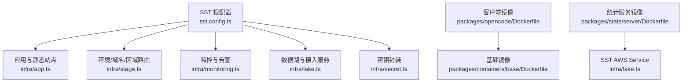
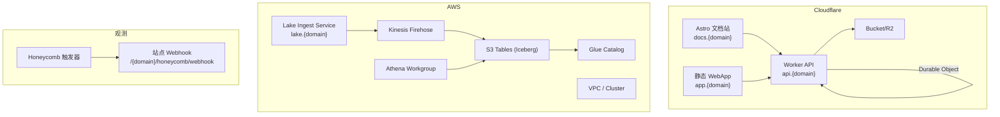
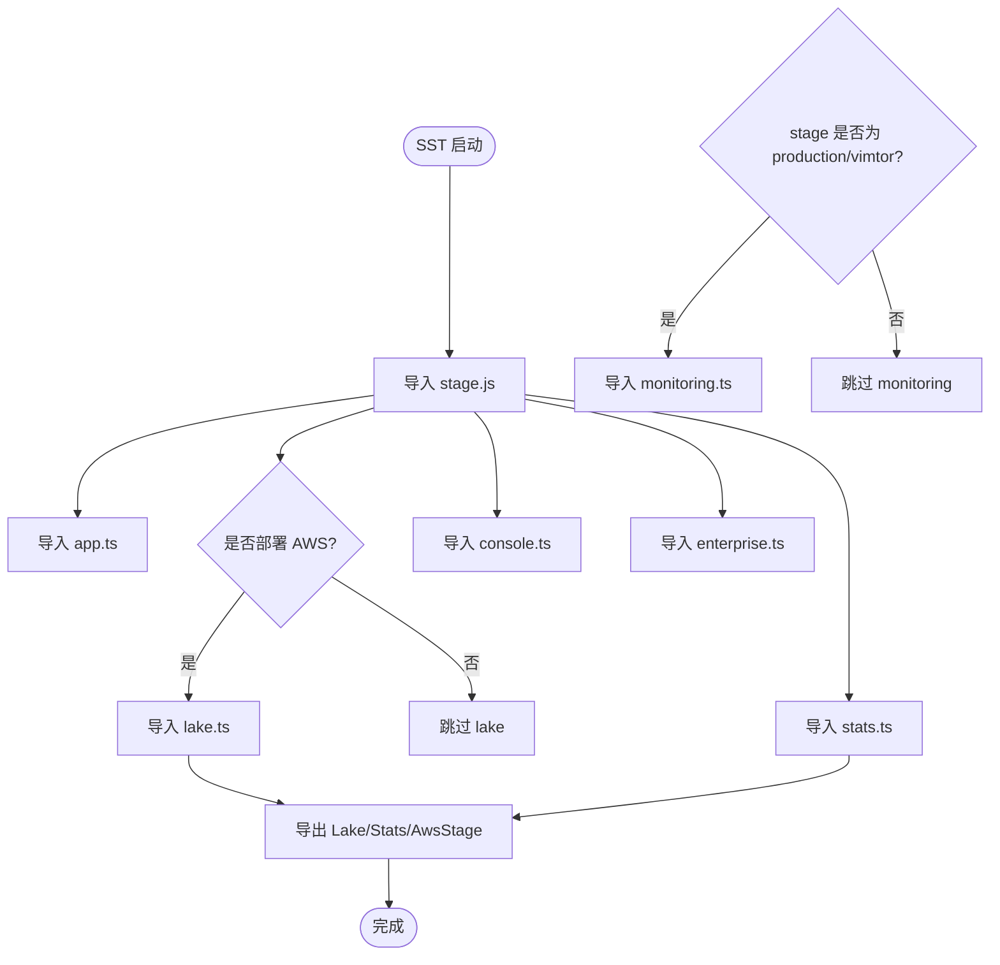
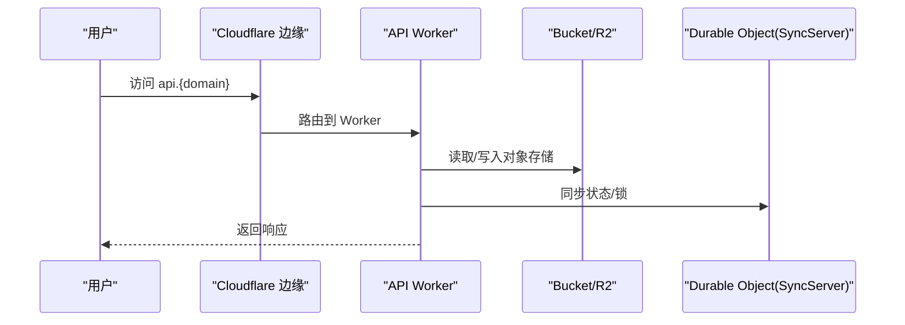
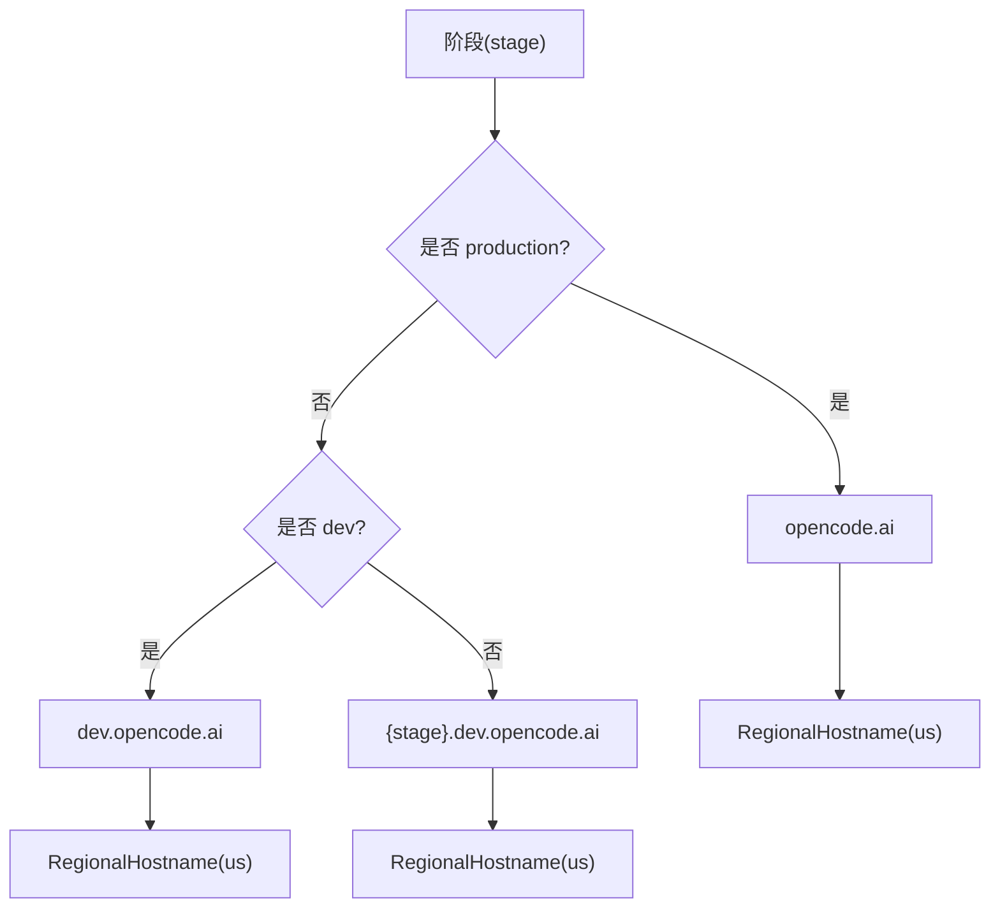
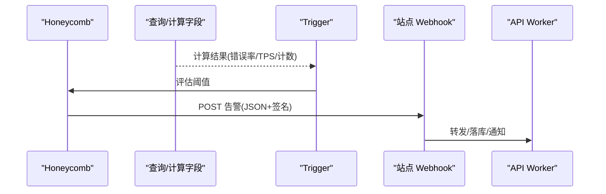
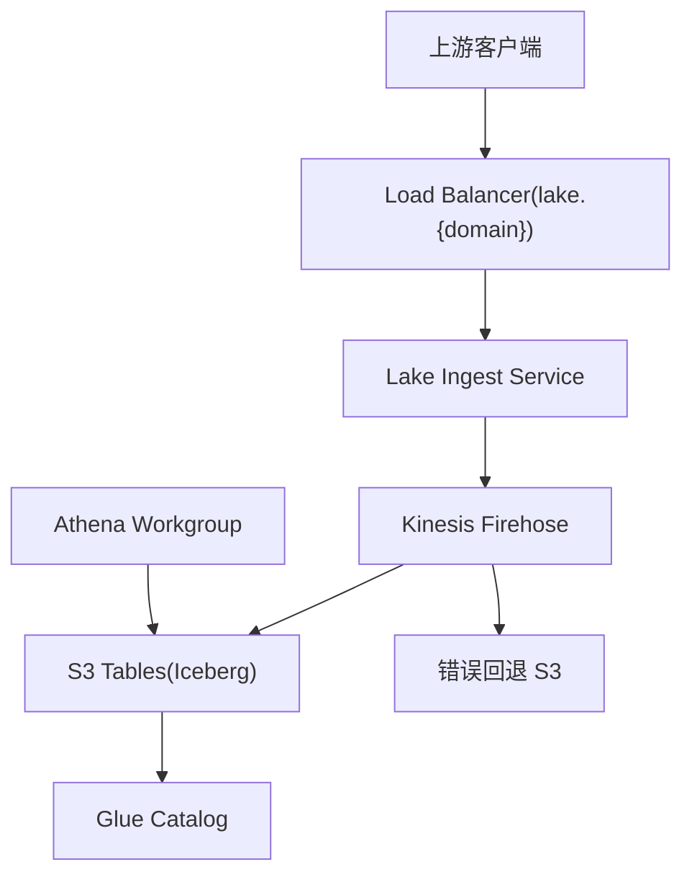
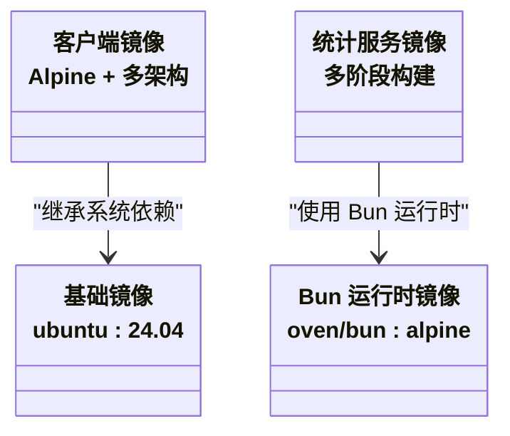
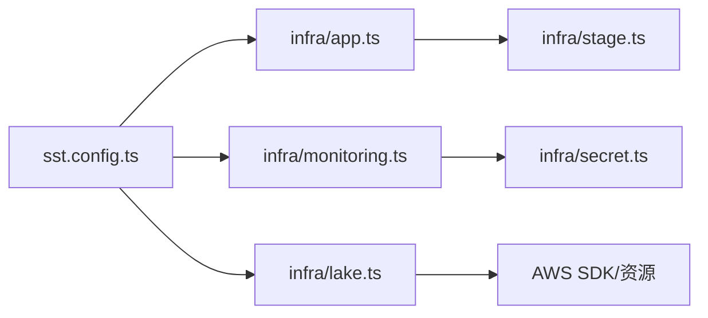

# 部署自动化

<cite>
**本文引用的文件**   
- [sst.config.ts](file://sst.config.ts)
- [infra/app.ts](file://infra/app.ts)
- [infra/stage.ts](file://infra/stage.ts)
- [infra/monitoring.ts](file://infra/monitoring.ts)
- [infra/lake.ts](file://infra/lake.ts)
- [infra/secret.ts](file://infra/secret.ts)
- [packages/opencode/Dockerfile](file://packages/opencode/Dockerfile)
- [packages/containers/base/Dockerfile](file://packages/containers/base/Dockerfile)
- [packages/stats/server/Dockerfile](file://packages/stats/server/Dockerfile)
- [package.json](file://package.json)
</cite>

## 目录
1. [简介](#简介)
2. [项目结构](#项目结构)
3. [核心组件](#核心组件)
4. [架构总览](#架构总览)
5. [详细组件分析](#详细组件分析)
6. [依赖关系分析](#依赖关系分析)
7. [性能与容量规划](#性能与容量规划)
8. [故障排查指南](#故障排查指南)
9. [结论](#结论)
10. [附录](#附录)

## 简介
本文件为 openNovel 项目的部署自动化配置文档，聚焦 SST 基础设施即代码（IaC）与环境管理、Docker 容器化与多平台支持、以及本地/测试/生产的差异化部署策略。同时给出监控告警、日志收集与故障恢复方案，帮助团队在 Cloudflare Workers + AWS/AWS S3 Tables + Honeycomb 的混合云环境中稳定交付。

## 项目结构
- 根级 SST 配置入口：定义应用名、移除策略、保护开关、提供商与区域等。
- infra 目录：按功能拆分资源定义（应用、域名、监控、数据湖、密钥等）。
- Docker 相关：客户端二进制镜像、基础镜像、统计服务镜像。
- package.json：工作区脚本与工具链版本。

**图表来源** 
- [sst.config.ts:1-54](file://sst.config.ts#L1-L54)
- [infra/app.ts:1-70](file://infra/app.ts#L1-L70)
- [infra/stage.ts:1-41](file://infra/stage.ts#L1-L41)
- [infra/monitoring.ts:1-288](file://infra/monitoring.ts#L1-L288)
- [infra/lake.ts:1-332](file://infra/lake.ts#L1-L332)
- [infra/secret.ts:1-16](file://infra/secret.ts#L1-L16)
- [packages/opencode/Dockerfile:1-19](file://packages/opencode/Dockerfile#L1-L19)
- [packages/containers/base/Dockerfile:1-19](file://packages/containers/base/Dockerfile#L1-L19)
- [packages/stats/server/Dockerfile:1-33](file://packages/stats/server/Dockerfile#L1-L33)

**章节来源**
- [sst.config.ts:1-54](file://sst.config.ts#L1-L54)
- [package.json:1-162](file://package.json#L1-L162)

## 核心组件
- SST 根配置
  - 应用名、阶段保护、删除策略、Cloudflare 作为 home、AWS/Stripe/Random/Planetscale/Honeycomb 提供商版本与区域。
- 应用与站点
  - Cloudflare Worker API、Astro 文档站、静态 WebApp 站点，绑定 Bucket、Secrets、Durable Object 与迁移。
- 环境与域名
  - 根据 stage 动态选择域名、短域名、区域主机名与 DNS 记录。
- 监控告警
  - Honeycomb 触发器、Webhook 到站点路径、计算字段与阈值。
- 数据湖与摄入
  - AWS S3 Tables、Glue Catalog、Athena Workgroup、Kinesis Firehose、SST AWS Service 暴露 URL 与健康检查。
- 密钥
  - 统一 Secret 封装与随机密码生成。

**章节来源**
- [sst.config.ts:1-54](file://sst.config.ts#L1-L54)
- [infra/app.ts:1-70](file://infra/app.ts#L1-L70)
- [infra/stage.ts:1-41](file://infra/stage.ts#L1-L41)
- [infra/monitoring.ts:1-288](file://infra/monitoring.ts#L1-L288)
- [infra/lake.ts:1-332](file://infra/lake.ts#L1-L332)
- [infra/secret.ts:1-16](file://infra/secret.ts#L1-L16)

## 架构总览
下图展示从开发到生产的关键资源与调用链路：SST 编排 Cloudflare 与 AWS 资源；API Worker 提供后端能力；Web 与 App 静态站点托管于 Cloudflare；Lake 摄入服务运行在 AWS ECS/Fargate，写入 Iceberg 表并通过 Athena 查询；Honeycomb 对模型与 Provider 错误率、TPS、免费额度等进行告警并推送到站点 Webhook。

**图表来源** 
- [infra/app.ts:1-70](file://infra/app.ts#L1-L70)
- [infra/stage.ts:1-41](file://infra/stage.ts#L1-L41)
- [infra/lake.ts:1-332](file://infra/lake.ts#L1-L332)
- [infra/monitoring.ts:1-288](file://infra/monitoring.ts#L1-L288)

## 详细组件分析

### SST 根配置与应用编排
- 应用名与阶段行为
  - 非生产阶段默认删除资源，生产阶段保留；生产阶段启用保护。
  - home 指定 Cloudflare，AWS 区域与 Profile 根据阶段与 CI 环境变量切换。
- 运行时注入
  - 导出 StatWorkerUrl、StatsUrl、LakeUrl/LakeSecretSsm、AwsStage 等供上层使用。
- 条件加载
  - 仅在特定阶段加载 lake/stats/monitoring 模块。

**图表来源** 
- [sst.config.ts:1-54](file://sst.config.ts#L1-L54)

**章节来源**
- [sst.config.ts:1-54](file://sst.config.ts#L1-L54)

### 应用与站点（Cloudflare）
- API Worker
  - 绑定域名 api.{domain}，处理函数位于 packages/function/src/api.ts。
  - 链接 Bucket、多个 Secrets、Durable Object（SyncServer），开启 Logpush。
  - 通过 transform 注入 bindings/migrations，区分阶段标签。
- Astro 文档站
  - 域名 docs.{domain}，构建产物路径 packages/web，注入 SST_STAGE 与 VITE_API_URL。
- 静态 WebApp
  - 域名 app.{domain}，构建命令 bun turbo build，输出 ./dist。

**图表来源** 
- [infra/app.ts:1-70](file://infra/app.ts#L1-L70)

**章节来源**
- [infra/app.ts:1-70](file://infra/app.ts#L1-L70)

### 环境与域名策略
- 域名映射
  - production -> opencode.ai；dev -> dev.opencode.ai；其他 stage -> {stage}.dev.opencode.ai。
  - 短域名同理映射到 opncd.ai。
- 区域主机名与 DNS
  - 创建 RegionalHostname(us)，生产阶段额外创建 TrustCenter 验证记录。

**图表来源** 
- [infra/stage.ts:1-41](file://infra/stage.ts#L1-L41)

**章节来源**
- [infra/stage.ts:1-41](file://infra/stage.ts#L1-L41)

### 监控与告警（Honeycomb）
- Webhook 接收
  - 将告警推送至站点 /honeycomb/webhook，使用 Secret 校验。
- 指标与触发器
  - 模型 HTTP 错误率（Go/Zen）、Provider HTTP 错误率、低 TPS、免费额度请求突增。
  - 使用计算字段与时间窗口，设置阈值与频率，仅生产阶段启用告警。

**图表来源** 
- [infra/monitoring.ts:1-288](file://infra/monitoring.ts#L1-L288)

**章节来源**
- [infra/monitoring.ts:1-288](file://infra/monitoring.ts#L1-L288)

### 数据湖与摄入服务（AWS）
- 资源概览
  - S3 Tables 桶、Glue Catalog、Athena Workgroup、Firehose 投递流、错误回退 S3 桶。
  - IAM Role/Policy 最小权限控制。
- 摄入服务
  - SST AWS Service 基于 arm64，CPU/Memory 可配，自动扩缩容，健康检查与 HTTPS 重定向。
  - 对外暴露 lake.{domain}，内部通过 Firehose 写入 Iceberg。
- 安全与权限
  - 随机 Secret 存入 SSM Parameter，Service 具备 firehose:PutRecord* 权限。
  - Athena/Glue/S3Tables/LakeFormation 权限按需授予。

**图表来源** 
- [infra/lake.ts:1-332](file://infra/lake.ts#L1-L332)

**章节来源**
- [infra/lake.ts:1-332](file://infra/lake.ts#L1-L332)

### 密钥管理
- 统一封装
  - SECRET 对象集中管理 R2、Honeycomb、Support、Upstash Redis 等密钥。
  - RandomPassword 用于生成 Webhook 签名等临时密钥。
- 使用方式
  - 通过 sst.Secret 或 Linkable 注入到 Worker/Service 环境变量或参数。

**章节来源**
- [infra/secret.ts:1-16](file://infra/secret.ts#L1-L16)

### Docker 容器化与多平台支持
- 客户端二进制镜像
  - 基于 Alpine，分别构建 amd64/arm64 目标，最终镜像以 TARGETARCH 选择对应二进制。
- 统计服务镜像
  - 基于 oven/bun:alpine，采用多阶段构建：prune -> install -> runner，冻结安装、忽略脚本，暴露 3000 端口。
- 基础镜像
  - Ubuntu 24.04 基础镜像，预装编译与常用工具，便于扩展。

**图表来源** 
- [packages/opencode/Dockerfile:1-19](file://packages/opencode/Dockerfile#L1-L19)
- [packages/containers/base/Dockerfile:1-19](file://packages/containers/base/Dockerfile#L1-L19)
- [packages/stats/server/Dockerfile:1-33](file://packages/stats/server/Dockerfile#L1-L33)

**章节来源**
- [packages/opencode/Dockerfile:1-19](file://packages/opencode/Dockerfile#L1-L19)
- [packages/containers/base/Dockerfile:1-19](file://packages/containers/base/Dockerfile#L1-L19)
- [packages/stats/server/Dockerfile:1-33](file://packages/stats/server/Dockerfile#L1-L33)

## 依赖关系分析
- 模块耦合
  - sst.config.ts 聚合 infra/* 模块，按阶段条件加载，降低无关资源开销。
  - infra/app.ts 依赖 stage.ts 的域名与区域信息。
  - infra/monitoring.ts 依赖 secret.ts 的 Webhook 签名。
  - infra/lake.ts 依赖 AWS SDK 与 SST AWS 组件，暴露 URL/Secret 给上层。
- 外部集成
  - Cloudflare（Workers、R2、DNS、RegionalHostname）
  - AWS（S3 Tables、Glue、Athena、Kinesis Firehose、SSM、IAM）
  - Honeycomb（触发器、Webhook）

**图表来源** 
- [sst.config.ts:1-54](file://sst.config.ts#L1-L54)
- [infra/app.ts:1-70](file://infra/app.ts#L1-L70)
- [infra/stage.ts:1-41](file://infra/stage.ts#L1-L41)
- [infra/monitoring.ts:1-288](file://infra/monitoring.ts#L1-L288)
- [infra/lake.ts:1-332](file://infra/lake.ts#L1-L332)
- [infra/secret.ts:1-16](file://infra/secret.ts#L1-L16)

**章节来源**
- [sst.config.ts:1-54](file://sst.config.ts#L1-L54)
- [infra/app.ts:1-70](file://infra/app.ts#L1-L70)
- [infra/stage.ts:1-41](file://infra/stage.ts#L1-L41)
- [infra/monitoring.ts:1-288](file://infra/monitoring.ts#L1-L288)
- [infra/lake.ts:1-332](file://infra/lake.ts#L1-L332)
- [infra/secret.ts:1-16](file://infra/secret.ts#L1-L16)

## 性能与容量规划
- Cloudflare 侧
  - 开启 Logpush 便于审计与排障；Durable Object 用于强一致同步场景。
- AWS 数据湖
  - Athena Workgroup 限制单次扫描上限，避免异常查询导致成本飙升。
  - Firehose 缓冲间隔与大小平衡延迟与吞吐。
- 摄入服务扩缩容
  - 生产环境最小副本数≥2，最大副本数可扩展至数十；CPU/Memory 利用率阈值驱动弹性伸缩。
- 镜像优化
  - 统计服务使用多阶段构建与冻结安装，减少镜像体积与构建时间。

[本节为通用指导，不直接分析具体文件]

## 故障排查指南
- 常见问题定位
  - 域名解析失败：检查 stage.ts 中 RegionalHostname 与 DNS 记录是否正确。
  - Worker 报错：查看 Cloudflare Logs（Logpush）与 Worker 绑定资源（Bucket/Secrets/DO）。
  - 数据未入库：确认 Firehose 角色权限、S3 Tables 元数据、错误回退桶是否有失败记录。
  - 告警未触发：核对 Honeycomb 触发器阈值、时间窗口、Webhook 签名与站点路由。
- 健康检查
  - Lake Ingest Service 提供 /ready 与 /health 端点，SST 已配置健康探测与重试。
- 回滚与恢复
  - 非生产阶段默认删除资源，便于快速重建；生产阶段保留策略需配合备份与快照。

**章节来源**
- [infra/stage.ts:1-41](file://infra/stage.ts#L1-L41)
- [infra/app.ts:1-70](file://infra/app.ts#L1-L70)
- [infra/lake.ts:1-332](file://infra/lake.ts#L1-L332)
- [infra/monitoring.ts:1-288](file://infra/monitoring.ts#L1-L288)

## 结论
通过 SST 将 Cloudflare 与 AWS 资源统一管理，结合多阶段 Docker 镜像与条件加载机制，openNovel 实现了跨环境的标准化部署与弹性扩展。Honeycomb 告警与站点 Webhook 形成闭环观测体系，数据湖与 Athena 提供低成本、高扩展的分析能力。建议在生产环境持续完善健康检查、备份与回滚流程，确保稳定性与可恢复性。

[本节为总结性内容，不直接分析具体文件]

## 附录
- 本地开发与调试
  - 使用包管理器脚本启动各子项目；SST shell 可注入环境变量进行本地联调。
- 多平台构建
  - 客户端镜像基于 TARGETARCH 自动选择二进制；统计服务镜像基于 Alpine/Bun 保证一致性。
- 密钥与敏感信息
  - 所有密钥通过 sst.Secret 或随机密码生成，避免硬编码；CI 中通过环境变量注入。

[本节为补充说明，不直接分析具体文件]