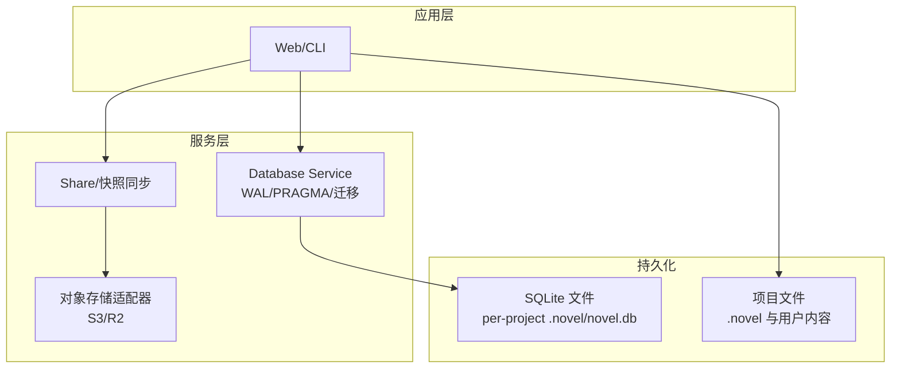
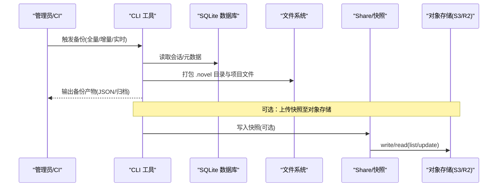
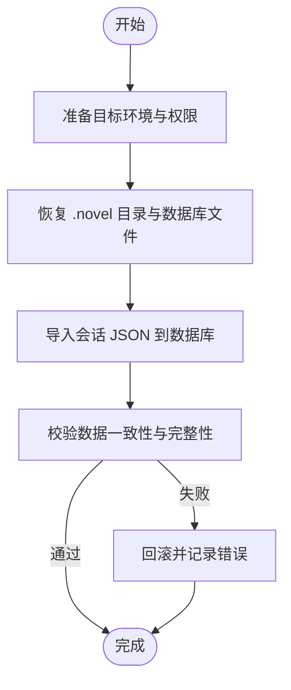
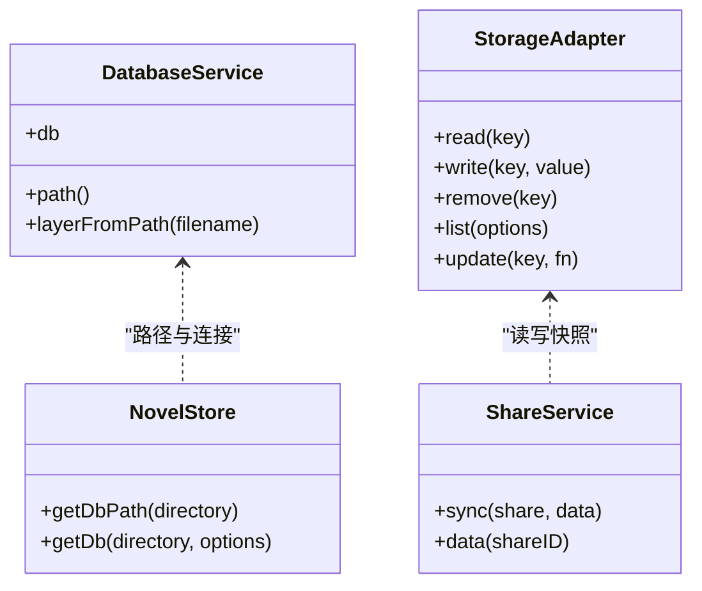

# 备份恢复

<cite>
**本文引用的文件**   
- [packages/novel-store/src/index.ts](file://packages/novel-store/src/index.ts)
- [packages/core/src/database/database.ts](file://packages/core/src/database/database.ts)
- [packages/opencode/src/cli/cmd/db.ts](file://packages/opencode/src/cli/cmd/db.ts)
- [packages/opencode/src/cli/cmd/export.ts](file://packages/opencode/src/cli/cmd/export.ts)
- [packages/opencode/src/cli/cmd/import.ts](file://packages/opencode/src/cli/cmd/import.ts)
- [packages/enterprise/src/core/storage.ts](file://packages/enterprise/src/core/storage.ts)
- [packages/enterprise/src/core/share.ts](file://packages/enterprise/src/core/share.ts)
- [packages/desktop/src/main/store-cleanup.ts](file://packages/desktop/src/main/store-cleanup.ts)
- [specs/storage/remove-opencode-db.md](file://specs/storage/remove-opencode-db.md)
- [README.md](file://README.md)
</cite>

## 目录
1. [简介](#简介)
2. [项目结构](#项目结构)
3. [核心组件](#核心组件)
4. [架构总览](#架构总览)
5. [详细组件分析](#详细组件分析)
6. [依赖关系分析](#依赖关系分析)
7. [性能考虑](#性能考虑)
8. [故障排查指南](#故障排查指南)
9. [结论](#结论)
10. [附录](#附录)

## 简介
本文件为 openNovel 的备份与恢复策略文档，覆盖数据库与文件存储两类数据源，给出全量、增量与实时备份方案；描述灾难恢复与数据重建流程；提供自动化配置（定时任务与校验）建议；并包含版本升级与数据迁移时的数据保护策略。文档基于仓库现有实现进行梳理与扩展建议，确保可落地执行。

## 项目结构
openNovel 采用多包 monorepo 架构，关键与备份恢复相关的代码集中在：
- 小说数据存储层：packages/novel-store（SQLite 单库 per-project）
- 通用数据库服务与路径解析：packages/core/src/database（WAL、PRAGMA、迁移）
- CLI 工具：export/import/db（导出会话、导入会话、sqlite3 交互）
- 企业级对象存储适配器：packages/enterprise（S3/R2 适配，用于共享快照等）
- 桌面端清理：packages/desktop（草稿与空存储清理）

图表来源
- [packages/core/src/database/database.ts:22-37](file://packages/core/src/database/database.ts#L22-L37)
- [packages/enterprise/src/core/storage.ts:86-95](file://packages/enterprise/src/core/storage.ts#L86-L95)
- [packages/novel-store/src/index.ts:345-350](file://packages/novel-store/src/index.ts#L345-L350)

章节来源
- [README.md:60-77](file://README.md#L60-L77)

## 核心组件
- SQLite 数据库服务与路径解析
  - 启用 WAL、NORMAL 同步、busy_timeout、缓存大小、外键约束，并在启动时执行迁移。
  - 路径解析支持环境变量覆盖与按安装通道生成不同文件名。
- 项目级 SQLite 数据库
  - 每个小说项目独立数据库文件，默认位于项目根 .novel/novel.db，可通过环境变量覆盖。
- 对象存储适配器（S3/R2）
  - 通过环境变量选择适配器与凭据，统一 read/write/list/update 接口，用于共享快照等。
- CLI 导出/导入
  - export：将会话数据导出为 JSON（可选脱敏）。
  - import：从本地文件或 ShareNext URL 导入会话数据到数据库。
  - db：交互式 sqlite3 或执行 SQL，打印数据库路径。

章节来源
- [packages/core/src/database/database.ts:22-58](file://packages/core/src/database/database.ts#L22-L58)
- [packages/novel-store/src/index.ts:345-350](file://packages/novel-store/src/index.ts#L345-L350)
- [packages/enterprise/src/core/storage.ts:86-95](file://packages/enterprise/src/core/storage.ts#L86-L95)
- [packages/opencode/src/cli/cmd/export.ts:222-293](file://packages/opencode/src/cli/cmd/export.ts#L222-L293)
- [packages/opencode/src/cli/cmd/import.ts:83-225](file://packages/opencode/src/cli/cmd/import.ts#L83-L225)
- [packages/opencode/src/cli/cmd/db.ts:1-63](file://packages/opencode/src/cli/cmd/db.ts#L1-L63)

## 架构总览
下图展示备份与恢复在系统中的位置与数据流向：

图表来源
- [packages/opencode/src/cli/cmd/export.ts:222-293](file://packages/opencode/src/cli/cmd/export.ts#L222-L293)
- [packages/enterprise/src/core/storage.ts:97-129](file://packages/enterprise/src/core/storage.ts#L97-L129)
- [packages/enterprise/src/core/share.ts:156-172](file://packages/enterprise/src/core/share.ts#L156-L172)

## 详细组件分析

### 数据库备份策略
- 全量备份
  - 使用 CLI 导出会话数据为 JSON，并结合文件系统打包 .novel 目录（含 novel.db），形成完整可恢复集。
  - 也可直接对 SQLite 文件进行冷备（停止写入后拷贝）或热备（WAL 模式下配合一致性快照）。
- 增量备份
  - 利用 SQLite WAL 模式与时间戳，仅备份自上次备份以来变更的 .novel 目录与新增会话 JSON。
  - 结合对象存储的分片与列表能力，按前缀与分页增量上传。
- 实时备份
  - 通过监听 .novel 目录与数据库 WAL 日志变化，持续将增量变更同步至对象存储（如 S3/R2）。
  - 对于高可用场景，可在主库上开启 binlog/WAL 回放式复制（需外部工具链）。

章节来源
- [packages/core/src/database/database.ts:22-37](file://packages/core/src/database/database.ts#L22-L37)
- [packages/novel-store/src/index.ts:345-350](file://packages/novel-store/src/index.ts#L345-L350)
- [packages/enterprise/src/core/storage.ts:40-64](file://packages/enterprise/src/core/storage.ts#L40-L64)

### 文件存储备份
- 备份范围
  - 项目根目录下的 .novel 子目录（含 novel.db 与中间态文件）、用户上传内容与项目相关文件。
- 机制
  - 全量：打包整个工作区与 .novel 目录。
  - 增量：基于文件修改时间与大小差异，仅备份变更文件。
  - 实时：监控文件变更事件，流式上传至对象存储。
- 清理策略
  - 桌面端清理脚本会清理空存储与过期草稿，避免备份体积膨胀。

章节来源
- [packages/desktop/src/main/store-cleanup.ts:1-46](file://packages/desktop/src/main/store-cleanup.ts#L1-L46)

### 数据恢复流程
- 灾难恢复
  - 步骤：准备目标环境 → 恢复 .novel 目录与 novel.db → 运行导入命令恢复会话 → 验证数据完整性。
  - 若对象存储存在快照，优先从快照还原，再回填增量 WAL。
- 数据重建
  - 使用 CLI 导入命令将 JSON 会话数据写回数据库，必要时重建引用与状态（幂等）。
  - 针对共享快照，先拉取快照合并，再应用增量 diff。

章节来源
- [packages/opencode/src/cli/cmd/import.ts:99-225](file://packages/opencode/src/cli/cmd/import.ts#L99-L225)
- [packages/enterprise/src/core/share.ts:156-172](file://packages/enterprise/src/core/share.ts#L156-L172)

### 备份自动化配置
- 定时任务
  - 每日全量：cron 调用导出命令 + 打包 .novel 目录，上传对象存储。
  - 每小时增量：扫描变更文件与 WAL，增量上传。
  - 实时：文件监听器 + WAL 观察者，持续同步。
- 备份验证
  - 校验 JSON 结构与字段完整性；校验数据库文件可被 sqlite3 打开；抽样比对对象存储清单与本地清单。
- 保留策略
  - 全量保留 N 天，增量保留 M 天；过期自动清理。

章节来源
- [packages/opencode/src/cli/cmd/export.ts:222-293](file://packages/opencode/src/cli/cmd/export.ts#L222-L293)
- [packages/enterprise/src/core/storage.ts:111-120](file://packages/enterprise/src/core/storage.ts#L111-L120)

### 数据迁移与版本升级的数据保护
- 迁移前
  - 强制全量备份（数据库 + 文件），并记录迁移版本号与时间戳。
- 迁移中
  - 使用事务与幂等迁移脚本，失败即回滚；禁止在线破坏性操作。
- 迁移后
  - 快速验证关键表与索引；必要时回滚至备份点。
- 历史兼容
  - 遵循移除旧模块计划，逐步替换调用点，保持向后兼容。

章节来源
- [packages/core/src/database/database.ts:22-37](file://packages/core/src/database/database.ts#L22-L37)
- [specs/storage/remove-opencode-db.md:1-75](file://specs/storage/remove-opencode-db.md#L1-L75)

## 依赖关系分析
- 数据库服务依赖 Effect Drizzle SQLite 适配器，并通过 PRAGMA 优化并发与一致性。
- 对象存储适配器通过环境变量动态切换 S3/R2，提供统一的读写与列表接口。
- CLI 导出/导入依赖数据库服务与文件系统工具，支持 ShareNext 协议。

图表来源
- [packages/core/src/database/database.ts:22-58](file://packages/core/src/database/database.ts#L22-L58)
- [packages/novel-store/src/index.ts:345-350](file://packages/novel-store/src/index.ts#L345-L350)
- [packages/enterprise/src/core/storage.ts:97-129](file://packages/enterprise/src/core/storage.ts#L97-L129)
- [packages/enterprise/src/core/share.ts:156-172](file://packages/enterprise/src/core/share.ts#L156-L172)

章节来源
- [packages/core/src/database/database.ts:22-58](file://packages/core/src/database/database.ts#L22-L58)
- [packages/enterprise/src/core/storage.ts:86-95](file://packages/enterprise/src/core/storage.ts#L86-L95)

## 性能考虑
- 启用 WAL 与 NORMAL 同步提升并发写入性能，减少锁竞争。
- busy_timeout 与 cache_size 调优可降低 I/O 阻塞与内存压力。
- 增量备份基于文件时间戳与 WAL 日志，避免全量扫描。
- 对象存储批量 list/update 减少网络往返。

[本节为通用指导，不直接分析具体文件]

## 故障排查指南
- 常见问题
  - 数据库无法打开：检查 SQLite 文件权限与 WAL 文件完整性。
  - 导入失败：确认 JSON 结构与字段类型，核对 ShareNext URL 与鉴权头。
  - 对象存储访问失败：校验环境变量（适配器、Bucket、Region、密钥）。
- 诊断工具
  - 使用 db path 打印数据库路径，sqlite3 交互式检查。
  - 导出最新会话 JSON 进行离线分析。

章节来源
- [packages/opencode/src/cli/cmd/db.ts:1-63](file://packages/opencode/src/cli/cmd/db.ts#L1-L63)
- [packages/opencode/src/cli/cmd/export.ts:222-293](file://packages/opencode/src/cli/cmd/export.ts#L222-L293)
- [packages/enterprise/src/core/storage.ts:86-95](file://packages/enterprise/src/core/storage.ts#L86-L95)

## 结论
openNovel 的备份恢复体系以 SQLite 项目级数据库为核心，辅以对象存储的快照与共享能力，结合 CLI 工具与文件系统操作，可实现全量、增量与实时备份。通过严格的迁移策略与自动化任务，保障数据在升级与灾难场景下的安全与可恢复性。建议在生产环境部署定时全量与增量备份，并建立对象存储快照与校验流程，以提升整体可靠性。

## 附录
- 环境变量参考
  - OPENNOVEL_DB：覆盖项目级数据库路径（优先级最高）。
  - OPENCODE_STORAGE_ADAPTER：选择对象存储适配器（s3/r2）。
  - OPENCODE_STORAGE_BUCKET/REGION/ACCESS_KEY_ID/SECRET_ACCESS_KEY：S3 适配凭据。
  - OPENCODE_STORAGE_ACCOUNT_ID：R2 适配账号 ID。
- 常用命令
  - 导出会话：export [sessionID] [--sanitize]
  - 导入会话：import <file>
  - 数据库工具：db query/query.sql | db path

章节来源
- [packages/novel-store/src/index.ts:345-350](file://packages/novel-store/src/index.ts#L345-L350)
- [packages/enterprise/src/core/storage.ts:86-95](file://packages/enterprise/src/core/storage.ts#L86-L95)
- [packages/opencode/src/cli/cmd/export.ts:222-293](file://packages/opencode/src/cli/cmd/export.ts#L222-L293)
- [packages/opencode/src/cli/cmd/import.ts:83-225](file://packages/opencode/src/cli/cmd/import.ts#L83-L225)
- [packages/opencode/src/cli/cmd/db.ts:1-63](file://packages/opencode/src/cli/cmd/db.ts#L1-L63)