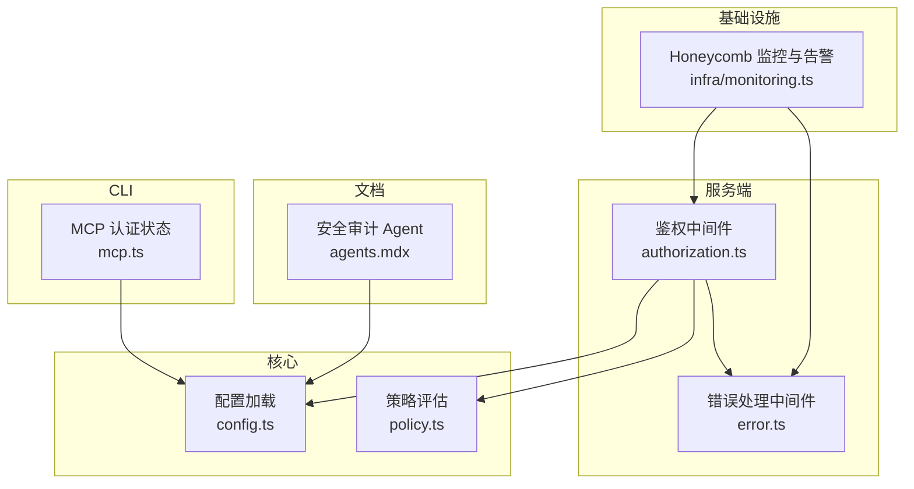
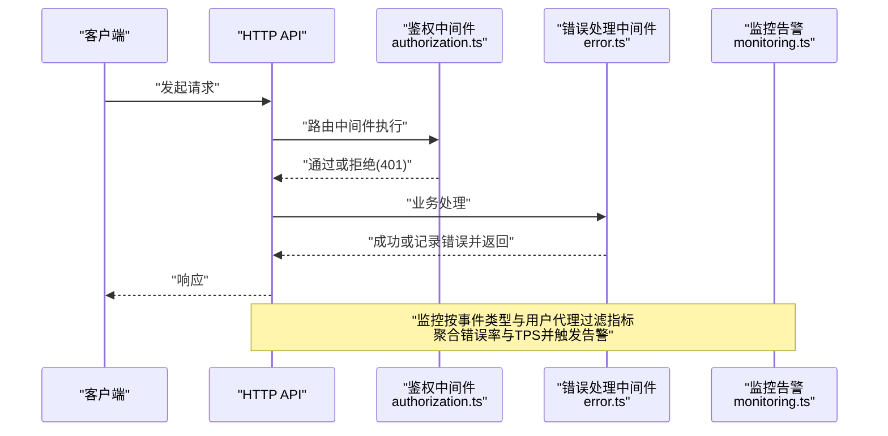
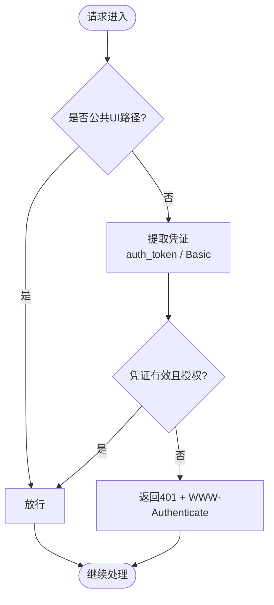
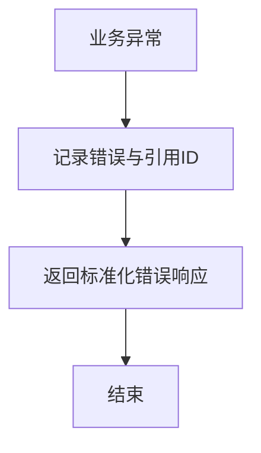
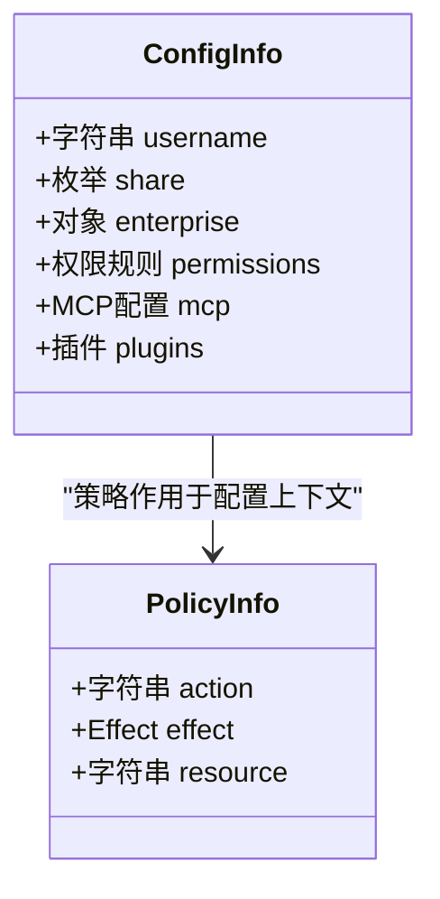
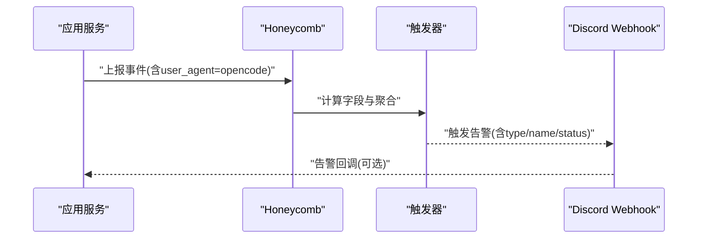
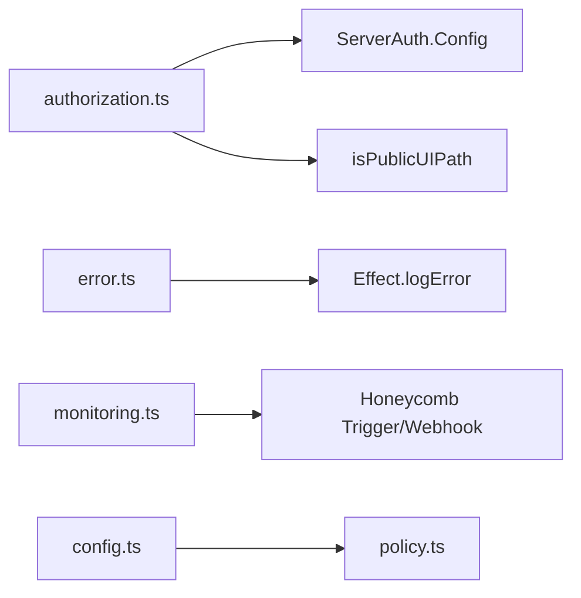

# 安全审计与监控

<cite>
**本文引用的文件**   
- [SECURITY.md](file://SECURITY.md)
- [monitoring.ts](file://infra/monitoring.ts)
- [authorization.ts](file://packages/opencode/src/server/routes/instance/httpapi/middleware/authorization.ts)
- [error.ts](file://packages/opencode/src/server/routes/instance/httpapi/middleware/error.ts)
- [config.ts](file://packages/core/src/config.ts)
- [policy.ts](file://packages/core/src/policy.ts)
- [mcp.ts](file://packages/opencode/src/cli/cmd/mcp.ts)
- [agents.mdx（多语言版本）](file://packages/web/src/content/docs/zh-cn/agents.mdx)
</cite>

## 目录
1. [简介](#简介)
2. [项目结构](#项目结构)
3. [核心组件](#核心组件)
4. [架构总览](#架构总览)
5. [详细组件分析](#详细组件分析)
6. [依赖关系分析](#依赖关系分析)
7. [性能考虑](#性能考虑)
8. [故障排查指南](#故障排查指南)
9. [结论](#结论)
10. [附录](#附录)

## 简介
本文件为 openNovel 的安全审计与监控配置文档，面向运维、安全与研发人员。内容涵盖：
- 安全日志记录策略：认证事件、访问控制与异常行为的采集规范
- 漏洞扫描工具集成：依赖安全检查、代码安全扫描与运行时监控
- 安全指标收集与告警：异常登录检测、权限滥用监控、性能异常识别
- 安全审计报告生成与合规性检查方法
- 安全事件响应流程与应急预案

重要背景：openNovel 默认不在沙箱中运行代理，服务器模式需显式启用并设置密码；外部 MCP 服务器行为不在信任边界内。详见安全策略说明。

章节来源
- [SECURITY.md:1-44](file://SECURITY.md#L1-L44)

## 项目结构
与安全审计和监控相关的核心位置如下：
- 基础设施监控与告警：infra/monitoring.ts
- 服务端鉴权中间件：packages/opencode/src/server/routes/instance/httpapi/middleware/authorization.ts
- 服务端错误处理中间件：packages/opencode/src/server/routes/instance/httpapi/middleware/error.ts
- 配置与策略：packages/core/src/config.ts、packages/core/src/policy.ts
- CLI 认证状态展示：packages/opencode/src/cli/cmd/mcp.ts
- 安全审计 Agent 定义（多语言文档）：packages/web/src/content/docs/*/agents.mdx

图表来源
- [monitoring.ts:1-288](file://infra/monitoring.ts#L1-L288)
- [authorization.ts:1-151](file://packages/opencode/src/server/routes/instance/httpapi/middleware/authorization.ts#L1-L151)
- [error.ts:28-43](file://packages/opencode/src/server/routes/instance/httpapi/middleware/error.ts#L28-L43)
- [config.ts:1-228](file://packages/core/src/config.ts#L1-L228)
- [policy.ts:1-50](file://packages/core/src/policy.ts#L1-L50)
- [mcp.ts:35-80](file://packages/opencode/src/cli/cmd/mcp.ts#L35-L80)
- [agents.mdx（多语言版本）](file://packages/web/src/content/docs/zh-cn/agents.mdx)

章节来源
- [monitoring.ts:1-288](file://infra/monitoring.ts#L1-L288)
- [authorization.ts:1-151](file://packages/opencode/src/server/routes/instance/httpapi/middleware/authorization.ts#L1-L151)
- [error.ts:28-43](file://packages/opencode/src/server/routes/instance/httpapi/middleware/error.ts#L28-L43)
- [config.ts:1-228](file://packages/core/src/config.ts#L1-L228)
- [policy.ts:1-50](file://packages/core/src/policy.ts#L1-L50)
- [mcp.ts:35-80](file://packages/opencode/src/cli/cmd/mcp.ts#L35-L80)
- [agents.mdx（多语言版本）](file://packages/web/src/content/docs/zh-cn/agents.mdx)

## 核心组件
- 鉴权中间件：支持 Basic Auth 与查询参数令牌，拦截非公开路径，未授权返回 401 并附带 WWW-Authenticate
- 错误处理中间件：统一捕获未知错误，记录引用 ID，对外返回受控消息
- 配置与策略：集中加载配置与策略规则，支持通配符匹配与优先级覆盖
- 监控与告警：基于 Honeycomb 的触发器与计算字段，统计模型/提供商 HTTP 错误率、TPS 下降、免费配额激增等
- CLI 认证状态：展示 MCP 服务器的认证状态与令牌存储情况
- 安全审计 Agent：用于在开发/审计流程中识别输入校验、鉴权、数据暴露、依赖与配置安全问题

章节来源
- [authorization.ts:1-151](file://packages/opencode/src/server/routes/instance/httpapi/middleware/authorization.ts#L1-L151)
- [error.ts:28-43](file://packages/opencode/src/server/routes/instance/httpapi/middleware/error.ts#L28-L43)
- [config.ts:1-228](file://packages/core/src/config.ts#L1-L228)
- [policy.ts:1-50](file://packages/core/src/policy.ts#L1-L50)
- [monitoring.ts:1-288](file://infra/monitoring.ts#L1-L288)
- [mcp.ts:35-80](file://packages/opencode/src/cli/cmd/mcp.ts#L35-L80)
- [agents.mdx（多语言版本）](file://packages/web/src/content/docs/zh-cn/agents.mdx)

## 架构总览
下图展示了请求进入服务端时的鉴权与错误处理流程，以及监控告警如何对关键指标进行聚合与通知。

图表来源
- [authorization.ts:1-151](file://packages/opencode/src/server/routes/instance/httpapi/middleware/authorization.ts#L1-L151)
- [error.ts:28-43](file://packages/opencode/src/server/routes/instance/httpapi/middleware/error.ts#L28-L43)
- [monitoring.ts:1-288](file://infra/monitoring.ts#L1-L288)

## 详细组件分析

### 鉴权与访问控制
- 支持的凭证来源：URL 查询参数 auth_token、HTTP Basic Authorization 头
- 公共 UI 路径可跳过鉴权，其他路径均需验证
- 未授权时返回 401 并附加 WWW-Authenticate 头
- 提供路由级与应用级两种中间件层，便于细粒度控制

图表来源
- [authorization.ts:1-151](file://packages/opencode/src/server/routes/instance/httpapi/middleware/authorization.ts#L1-L151)

章节来源
- [authorization.ts:1-151](file://packages/opencode/src/server/routes/instance/httpapi/middleware/authorization.ts#L1-L151)

### 错误处理与异常日志
- 统一捕获未知错误，生成唯一引用 ID
- 将错误详情与原因以结构化方式记录，便于检索与关联
- 对外返回受控消息，避免泄露内部细节

图表来源
- [error.ts:28-43](file://packages/opencode/src/server/routes/instance/httpapi/middleware/error.ts#L28-L43)

章节来源
- [error.ts:28-43](file://packages/opencode/src/server/routes/instance/httpapi/middleware/error.ts#L28-L43)

### 配置与策略
- 配置项包含用户名、分享策略、企业共享、权限规则、插件、MCP 等
- 策略支持 allow/deny 动作与资源通配符匹配，按优先级覆盖
- 配置加载顺序确保全局到局部、仓库到用户的覆盖语义

图表来源
- [config.ts:1-228](file://packages/core/src/config.ts#L1-L228)
- [policy.ts:1-50](file://packages/core/src/policy.ts#L1-L50)

章节来源
- [config.ts:1-228](file://packages/core/src/config.ts#L1-L228)
- [policy.ts:1-50](file://packages/core/src/policy.ts#L1-L50)

### 监控与告警
- 使用 Honeycomb 计算字段与触发器，统计以下指标：
  - 模型 HTTP 错误率（区分 Go/Zen 分层）
  - 提供商 HTTP 错误率
  - 模型 TPS 低值告警
  - 免费配额请求激增
- 通过 Webhook 将告警推送到 Discord，便于快速响应

图表来源
- [monitoring.ts:1-288](file://infra/monitoring.ts#L1-L288)

章节来源
- [monitoring.ts:1-288](file://infra/monitoring.ts#L1-L288)

### CLI 认证状态
- 展示 MCP 服务器的认证状态（已认证/过期/未认证）
- 列出配置的远程服务器与本地令牌存储情况

章节来源
- [mcp.ts:35-80](file://packages/opencode/src/cli/cmd/mcp.ts#L35-L80)

### 安全审计 Agent
- 在多语言文档中定义了“安全审计”子代理，聚焦于：
  - 输入校验漏洞
  - 认证与授权缺陷
  - 数据暴露风险
  - 依赖漏洞
  - 配置安全问题

章节来源
- [agents.mdx（多语言版本）](file://packages/web/src/content/docs/zh-cn/agents.mdx)

## 依赖关系分析
- 鉴权中间件依赖 ServerAuth 配置与服务，结合 isPublicUIPath 判断豁免路径
- 错误处理中间件依赖 Effect 的错误与日志能力
- 监控触发器依赖 Honeycomb 的查询与计算字段能力，并通过 Webhook 发送通知
- 配置与策略模块被鉴权与运行时逻辑共同依赖

图表来源
- [authorization.ts:1-151](file://packages/opencode/src/server/routes/instance/httpapi/middleware/authorization.ts#L1-L151)
- [error.ts:28-43](file://packages/opencode/src/server/routes/instance/httpapi/middleware/error.ts#L28-L43)
- [monitoring.ts:1-288](file://infra/monitoring.ts#L1-L288)
- [config.ts:1-228](file://packages/core/src/config.ts#L1-L228)
- [policy.ts:1-50](file://packages/core/src/policy.ts#L1-L50)

章节来源
- [authorization.ts:1-151](file://packages/opencode/src/server/routes/instance/httpapi/middleware/authorization.ts#L1-L151)
- [error.ts:28-43](file://packages/opencode/src/server/routes/instance/httpapi/middleware/error.ts#L28-L43)
- [monitoring.ts:1-288](file://infra/monitoring.ts#L1-L288)
- [config.ts:1-228](file://packages/core/src/config.ts#L1-L228)
- [policy.ts:1-50](file://packages/core/src/policy.ts#L1-L50)

## 性能考虑
- 监控查询时间窗口与阈值需平衡准确性与负载：如 900s/1800s 窗口、错误率阈值 0.7、TPS 阈值 10
- 计算字段表达式应避免过度复杂，减少重复计算与缓存失效
- 告警频率与基线对比（如 1440 分钟偏移）有助于降低误报

[本节为通用指导，不直接分析具体文件]

## 故障排查指南
- 未授权访问：检查 URL 中的 auth_token 或 Authorization 头是否正确；确认路径是否为公共 UI
- 服务器错误：根据错误响应中的 ref 引用 ID 在服务端日志中定位完整堆栈与原因
- 监控告警：核对 user_agent 是否包含 opencode，确认事件类型与过滤条件
- 认证状态：使用 CLI 查看 MCP 服务器认证状态与令牌存储

章节来源
- [authorization.ts:1-151](file://packages/opencode/src/server/routes/instance/httpapi/middleware/authorization.ts#L1-L151)
- [error.ts:28-43](file://packages/opencode/src/server/routes/instance/httpapi/middleware/error.ts#L28-L43)
- [monitoring.ts:1-288](file://infra/monitoring.ts#L1-L288)
- [mcp.ts:35-80](file://packages/opencode/src/cli/cmd/mcp.ts#L35-L80)

## 结论
openNovel 的安全审计与监控围绕“最小化信任边界、显式鉴权、结构化日志与可观测性”展开。建议在生产环境：
- 强制启用服务器模式并严格管理凭据
- 完善认证与访问控制的日志采集
- 持续集成依赖与代码安全扫描
- 建立告警与应急响应流程，定期输出合规报告

[本节为总结性内容，不直接分析具体文件]

## 附录

### 安全日志记录策略（建议）
- 认证事件：登录成功/失败、令牌刷新、会话创建/销毁
- 访问控制：鉴权失败、越权尝试、策略命中与拒绝
- 异常行为：高频失败、异常 IP/UA、敏感操作（文件写入、命令执行）
- 采集要点：包含用户标识、请求路径、结果码、引用 ID、时间戳

[本节为通用指导，不直接分析具体文件]

### 漏洞扫描工具集成（建议）
- 依赖包安全检查：CI 中集成依赖漏洞扫描（如 npm audit、bun audit）
- 代码安全扫描：静态分析（如 ESLint security 规则、Semgrep）
- 运行时监控：结合 Honeycomb 的事件上报与计算字段，持续观察错误率与性能

[本节为通用指导，不直接分析具体文件]

### 安全指标与告警配置（建议）
- 异常登录检测：失败次数阈值、异地登录、频繁切换身份
- 权限滥用监控：策略拒绝率、敏感资源访问频次
- 性能异常识别：TPS 下降、错误率突增、延迟分位异常

[本节为通用指导，不直接分析具体文件]

### 安全审计报告与合规检查（建议）
- 周期性导出监控与日志摘要，形成趋势与热点分析
- 对照安全基线与合规清单逐项核查
- 输出整改计划与闭环跟踪

[本节为通用指导，不直接分析具体文件]

### 安全事件响应流程与应急预案（建议）
- 发现与分级：依据影响面与紧急程度分级
- 处置与隔离：临时封禁、限流、回滚
- 复盘与加固：根因分析、补丁发布、策略优化
- 沟通与披露：对内同步、对外公告（遵循负责任披露）

[本节为通用指导，不直接分析具体文件]