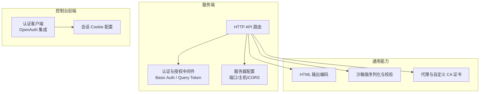
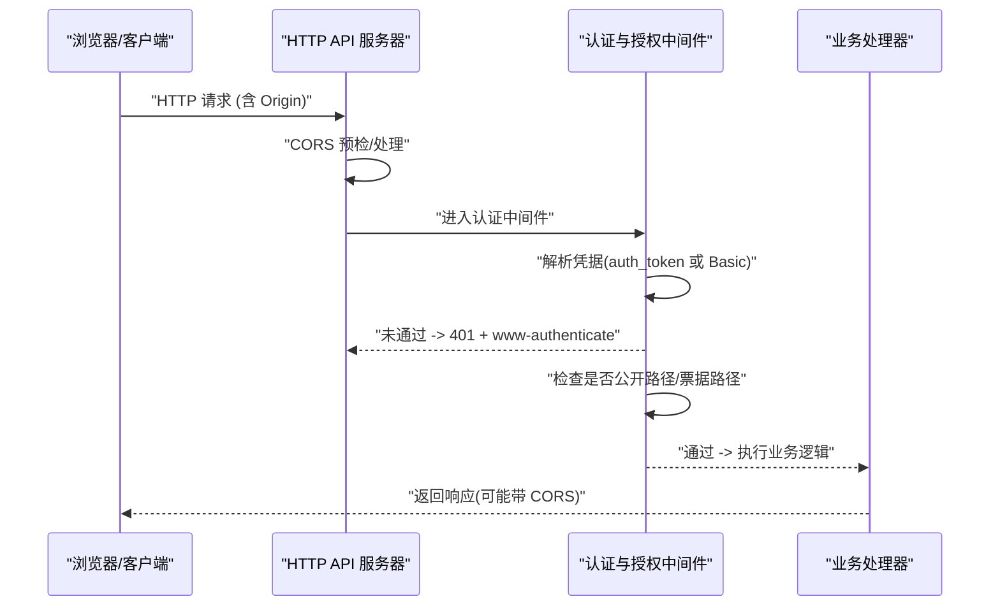
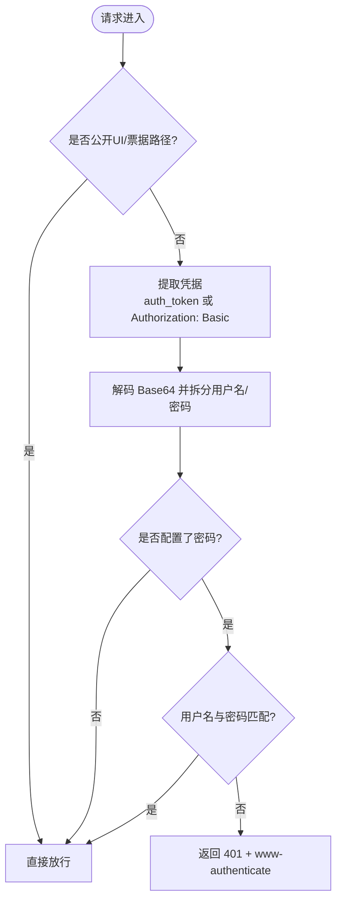
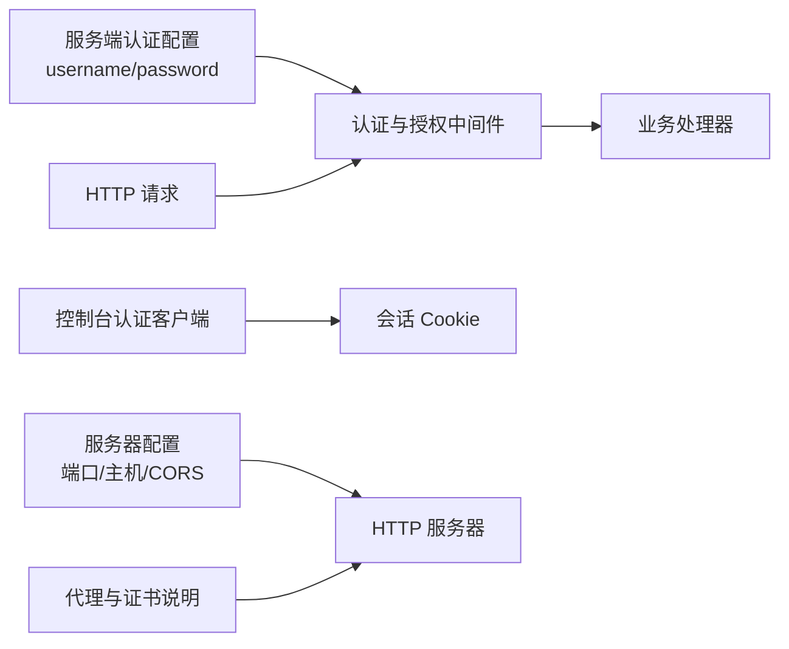

# 安全配置

<cite>
**本文引用的文件**
- [SECURITY.md](file://SECURITY.md)
- [packages/opencode/src/server/auth.ts](file://packages/opencode/src/server/auth.ts)
- [packages/opencode/src/server/routes/instance/httpapi/middleware/authorization.ts](file://packages/opencode/src/server/routes/instance/httpapi/middleware/authorization.ts)
- [packages/console/app/src/context/auth.ts](file://packages/console/app/src/context/auth.ts)
- [packages/core/src/v1/config/server.ts](file://packages/core/src/v1/config/server.ts)
- [packages/web/src/content/docs/pl/network.mdx](file://packages/web/src/content/docs/pl/network.mdx)
- [packages/opencode/test/server/httpapi-cors.test.ts](file://packages/opencode/test/server/httpapi-cors.test.ts)
- [packages/opencode/src/util/html.ts](file://packages/opencode/src/util/html.ts)
- [packages/opencode/test/util/html.test.ts](file://packages/opencode/test/util/html.test.ts)
- [packages/codemode/src/tool-runtime.ts](file://packages/codemode/src/tool-runtime.ts)
- [packages/cli/src/commands/handlers/serve.ts](file://packages/cli/src/commands/handlers/serve.ts)
</cite>

## 目录
1. [简介](#简介)
2. [项目结构](#项目结构)
3. [核心组件](#核心组件)
4. [架构总览](#架构总览)
5. [详细组件分析](#详细组件分析)
6. [依赖关系分析](#依赖关系分析)
7. [性能考虑](#性能考虑)
8. [故障排查指南](#故障排查指南)
9. [结论](#结论)
10. [附录](#附录)

## 简介
本文件为 openNovel 的安全配置与最佳实践文档，覆盖身份认证与授权、会话控制、权限验证、传输加密（TLS/SSL）、静态数据加密策略、输入验证与输出编码（防 XSS/SQL 注入）、安全审计与漏洞扫描配置，以及安全事件响应流程。文档基于仓库现有实现进行说明，并给出可操作的部署建议与加固要点。

## 项目结构
openNovel 采用多包（monorepo）结构，安全相关能力分布在以下位置：
- 服务端认证与授权中间件：位于 opencode 包的 server 路由与中间件层
- 控制台前端会话与认证客户端：位于 console 包的 app 上下文
- 服务器配置（端口、主机名、CORS 等）：core 包的 v1 配置
- 网络代理与证书支持说明：web 包的文档
- HTML 输出编码工具：opencode 包的 util
- 沙箱值序列化与边界校验：codemode 包的 tool-runtime
- CLI 启动与服务绑定：cli 包的 serve 命令

图表来源
- [packages/opencode/src/server/routes/instance/httpapi/middleware/authorization.ts:1-151](file://packages/opencode/src/server/routes/instance/httpapi/middleware/authorization.ts#L1-L151)
- [packages/core/src/v1/config/server.ts:1-19](file://packages/core/src/v1/config/server.ts#L1-L19)
- [packages/console/app/src/context/auth.ts:1-38](file://packages/console/app/src/context/auth.ts#L1-L38)
- [packages/opencode/src/util/html.ts:1-8](file://packages/opencode/src/util/html.ts#L1-L8)
- [packages/codemode/src/tool-runtime.ts:245-284](file://packages/codemode/src/tool-runtime.ts#L245-L284)
- [packages/web/src/content/docs/pl/network.mdx:1-57](file://packages/web/src/content/docs/pl/network.mdx#L1-L57)

章节来源
- [packages/opencode/src/server/routes/instance/httpapi/middleware/authorization.ts:1-151](file://packages/opencode/src/server/routes/instance/httpapi/middleware/authorization.ts#L1-L151)
- [packages/core/src/v1/config/server.ts:1-19](file://packages/core/src/v1/config/server.ts#L1-L19)
- [packages/console/app/src/context/auth.ts:1-38](file://packages/console/app/src/context/auth.ts#L1-L38)
- [packages/opencode/src/util/html.ts:1-8](file://packages/opencode/src/util/html.ts#L1-L8)
- [packages/codemode/src/tool-runtime.ts:245-284](file://packages/codemode/src/tool-runtime.ts#L245-L284)
- [packages/web/src/content/docs/pl/network.mdx:1-57](file://packages/web/src/content/docs/pl/network.mdx#L1-L57)

## 核心组件
- 服务端认证与授权
  - 通过环境变量 OPENNOVEL_SERVER_USERNAME 与 OPENNOVEL_SERVER_PASSWORD 启用 Basic Auth；请求可从查询参数 auth_token 或 Authorization: Basic ... 头传入凭据
  - 未通过验证的请求返回 401 并附带 www-authenticate 头
  - 公开 UI 路径与 PTY 连接票据路径可跳过鉴权
- 控制台前端会话
  - 使用 OpenAuth 客户端与 VITE_AUTH_URL 对接认证服务
  - 会话 Cookie 设置 httpOnly=true，secure=false（本地开发），最大有效期较长
- 服务器配置
  - 支持端口、主机名、mDNS、CORS 白名单等
- 传输与代理
  - 支持标准 HTTPS_PROXY/HTTP_PROXY/NO_PROXY 环境变量
  - 支持 NODE_EXTRA_CA_CERTS 引入自定义 CA 证书
- 输出编码与输入校验
  - 提供 escapeHtml 工具对输出进行 HTML 转义
  - 工具运行时对复杂类型进行严格序列化与循环引用检测

章节来源
- [packages/opencode/src/server/auth.ts:1-49](file://packages/opencode/src/server/auth.ts#L1-L49)
- [packages/opencode/src/server/routes/instance/httpapi/middleware/authorization.ts:1-151](file://packages/opencode/src/server/routes/instance/httpapi/middleware/authorization.ts#L1-L151)
- [packages/console/app/src/context/auth.ts:1-38](file://packages/console/app/src/context/auth.ts#L1-L38)
- [packages/core/src/v1/config/server.ts:1-19](file://packages/core/src/v1/config/server.ts#L1-L19)
- [packages/web/src/content/docs/pl/network.mdx:1-57](file://packages/web/src/content/docs/pl/network.mdx#L1-L57)
- [packages/opencode/src/util/html.ts:1-8](file://packages/opencode/src/util/html.ts#L1-L8)
- [packages/codemode/src/tool-runtime.ts:245-284](file://packages/codemode/src/tool-runtime.ts#L245-L284)

## 架构总览
下图展示从浏览器到服务端的路径与认证拦截点，包括 CORS、Basic Auth、公开路径豁免与错误响应。

图表来源
- [packages/opencode/src/server/routes/instance/httpapi/middleware/authorization.ts:101-116](file://packages/opencode/src/server/routes/instance/httpapi/middleware/authorization.ts#L101-L116)
- [packages/opencode/test/server/httpapi-cors.test.ts:63-101](file://packages/opencode/test/server/httpapi-cors.test.ts#L63-L101)

章节来源
- [packages/opencode/src/server/routes/instance/httpapi/middleware/authorization.ts:101-116](file://packages/opencode/src/server/routes/instance/httpapi/middleware/authorization.ts#L101-L116)
- [packages/opencode/test/server/httpapi-cors.test.ts:63-101](file://packages/opencode/test/server/httpapi-cors.test.ts#L63-L101)

## 详细组件分析

### 身份认证与授权（Basic Auth / 查询令牌）
- 认证入口
  - 支持两种凭据来源：URL 查询参数 auth_token（Base64 的 username:password）与 HTTP 头 Authorization: Basic ...
  - 若未配置密码或未开启认证，则放行；否则必须匹配用户名与密码
- 授权流程
  - 非公开 UI 路径与 PTY 票据路径需通过认证
  - 失败时返回 401 并设置 www-authenticate 头
- 配置项
  - OPENNOVEL_SERVER_USERNAME（默认 opennovel）
  - OPENNOVEL_SERVER_PASSWORD（为空或不设置则不强制认证）

图表来源
- [packages/opencode/src/server/routes/instance/httpapi/middleware/authorization.ts:77-99](file://packages/opencode/src/server/routes/instance/httpapi/middleware/authorization.ts#L77-L99)
- [packages/opencode/src/server/auth.ts:24-34](file://packages/opencode/src/server/auth.ts#L24-L34)

章节来源
- [packages/opencode/src/server/routes/instance/httpapi/middleware/authorization.ts:1-151](file://packages/opencode/src/server/routes/instance/httpapi/middleware/authorization.ts#L1-L151)
- [packages/opencode/src/server/auth.ts:1-49](file://packages/opencode/src/server/auth.ts#L1-L49)

### 会话控制（控制台前端）
- 使用 OpenAuth 客户端对接认证服务（VITE_AUTH_URL）
- 会话 Cookie 配置：httpOnly=true，secure=false（本地环境），maxAge 较大
- 注意：生产环境应启用 secure 并通过反向代理终止 TLS

章节来源
- [packages/console/app/src/context/auth.ts:1-38](file://packages/console/app/src/context/auth.ts#L1-L38)

### 权限验证与公开路径
- 公开 UI 路径与 PTY 连接票据路径在认证中间件中豁免
- 其他所有受保护端点均需通过认证

章节来源
- [packages/opencode/src/server/routes/instance/httpapi/middleware/authorization.ts:101-116](file://packages/opencode/src/server/routes/instance/httpapi/middleware/authorization.ts#L101-L116)

### 传输加密（TLS/SSL）与代理/证书
- 官方说明：server 模式为可选，启用后需设置 OPENNOVEL_SERVER_PASSWORD 以启用 Basic Auth；未设置时运行无认证（有警告）
- 代理与证书：
  - 支持 HTTPS_PROXY/HTTP_PROXY/NO_PROXY
  - 支持 NODE_EXTRA_CA_CERTS 引入自定义 CA 证书
- 建议：
  - 在生产中通过反向代理（如 Nginx/Traefik）终止 TLS，仅暴露内网端口
  - 避免将敏感凭据硬编码，使用密钥管理服务

章节来源
- [SECURITY.md:21-24](file://SECURITY.md#L21-L24)
- [packages/web/src/content/docs/pl/network.mdx:10-57](file://packages/web/src/content/docs/pl/network.mdx#L10-L57)

### 输入验证与输出编码（防 XSS/SQL 注入）
- 输出编码：escapeHtml 对 < > & " ' 进行转义，用于防止 XSS
- 输入校验：tool-runtime 对复杂类型进行严格序列化与循环引用检测，避免越界数据结构
- SQL 注入防护：当前仓库未发现原生 SQL 拼接；建议使用参数化查询与 ORM（如 Drizzle）并确保输入经严格校验

章节来源
- [packages/opencode/src/util/html.ts:1-8](file://packages/opencode/src/util/html.ts#L1-L8)
- [packages/opencode/test/util/html.test.ts:1-15](file://packages/opencode/test/util/html.test.ts#L1-L15)
- [packages/codemode/src/tool-runtime.ts:245-284](file://packages/codemode/src/tool-runtime.ts#L245-L284)

### 服务器监听与绑定
- CLI serve 命令负责创建 HTTP 服务器并绑定端口与主机
- 建议在生产环境中限制监听地址（如 127.0.0.1）并通过反向代理对外暴露

章节来源
- [packages/cli/src/commands/handlers/serve.ts:30-46](file://packages/cli/src/commands/handlers/serve.ts#L30-L46)

## 依赖关系分析
- 认证与授权中间件依赖服务端认证配置（用户名/密码）
- 控制台前端依赖 OpenAuth 客户端与会话存储
- 服务器配置模块提供端口、主机名、CORS 等
- 网络文档模块提供代理与证书环境变量说明

图表来源
- [packages/opencode/src/server/auth.ts:17-20](file://packages/opencode/src/server/auth.ts#L17-L20)
- [packages/opencode/src/server/routes/instance/httpapi/middleware/authorization.ts:101-116](file://packages/opencode/src/server/routes/instance/httpapi/middleware/authorization.ts#L101-L116)
- [packages/console/app/src/context/auth.ts:1-38](file://packages/console/app/src/context/auth.ts#L1-L38)
- [packages/core/src/v1/config/server.ts:1-19](file://packages/core/src/v1/config/server.ts#L1-L19)
- [packages/web/src/content/docs/pl/network.mdx:10-57](file://packages/web/src/content/docs/pl/network.mdx#L10-L57)

章节来源
- [packages/opencode/src/server/auth.ts:17-20](file://packages/opencode/src/server/auth.ts#L17-L20)
- [packages/opencode/src/server/routes/instance/httpapi/middleware/authorization.ts:101-116](file://packages/opencode/src/server/routes/instance/httpapi/middleware/authorization.ts#L101-L116)
- [packages/console/app/src/context/auth.ts:1-38](file://packages/console/app/src/context/auth.ts#L1-L38)
- [packages/core/src/v1/config/server.ts:1-19](file://packages/core/src/v1/config/server.ts#L1-L19)
- [packages/web/src/content/docs/pl/network.mdx:10-57](file://packages/web/src/content/docs/pl/network.mdx#L10-L57)

## 性能考虑
- 认证中间件仅在必要时执行，公开路径快速放行
- 避免在高频路径上执行重型解密或外部调用
- 合理设置 CORS 白名单，减少不必要的预检请求
- 使用反向代理缓存静态资源与响应体，降低后端压力

## 故障排查指南
- 401 未授权
  - 检查是否设置了 OPENNOVEL_SERVER_PASSWORD
  - 确认请求携带正确的 auth_token 或 Authorization: Basic 头
  - 查看响应是否包含 www-authenticate 头
- CORS 问题
  - 检查 Origin 是否在允许列表中
  - 预检请求是否正确返回允许的方法与头
- 代理与证书
  - 确认 HTTPS_PROXY/HTTP_PROXY/NO_PROXY 设置正确
  - 自定义 CA 证书路径是否有效且可读

章节来源
- [packages/opencode/src/server/routes/instance/httpapi/middleware/authorization.ts:77-99](file://packages/opencode/src/server/routes/instance/httpapi/middleware/authorization.ts#L77-L99)
- [packages/opencode/test/server/httpapi-cors.test.ts:63-101](file://packages/opencode/test/server/httpapi-cors.test.ts#L63-L101)
- [packages/web/src/content/docs/pl/network.mdx:10-57](file://packages/web/src/content/docs/pl/network.mdx#L10-L57)

## 结论
openNovel 的安全模型强调“用户自控”与“最小默认风险”。服务端认证通过 Basic Auth 与查询令牌实现，公开路径与票据路径豁免；控制台前端使用 OpenAuth 与会话 Cookie；传输层可通过代理与自定义 CA 证书增强安全性。建议在部署中使用反向代理终止 TLS、限制监听地址、启用严格的 CORS 策略，并对所有用户输入进行校验与输出编码。对于需要隔离的场景，应在容器或虚拟机中运行。

## 附录

### 安全最佳实践清单
- 启用并强制 OPENNOVEL_SERVER_PASSWORD，避免无认证运行
- 生产环境通过反向代理终止 TLS，仅暴露内网端口
- 配置合理的 CORS 白名单，避免 *
- 对所有用户输入进行白名单校验与长度限制
- 输出到 HTML 时使用 escapeHtml 进行转义
- 使用参数化查询与 ORM，禁止字符串拼接 SQL
- 定期更新依赖与系统包，启用依赖漏洞扫描
- 使用密钥管理服务管理敏感配置，避免硬编码

### 安全事件响应流程
- 发现安全问题后，通过 GitHub Security Advisory 提交报告
- 团队会回复并告知后续步骤，持续同步修复进展
- 修复完成后发布安全公告与补丁

章节来源
- [SECURITY.md:37-44](file://SECURITY.md#L37-L44)