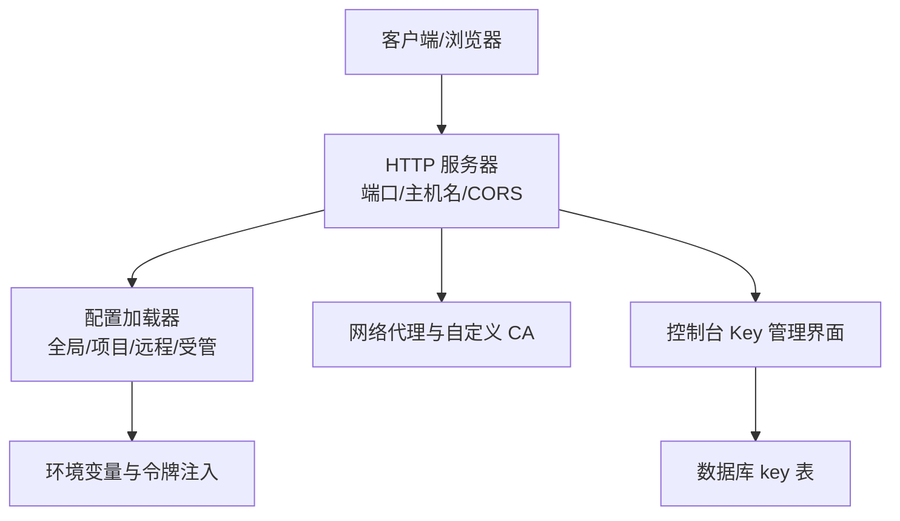
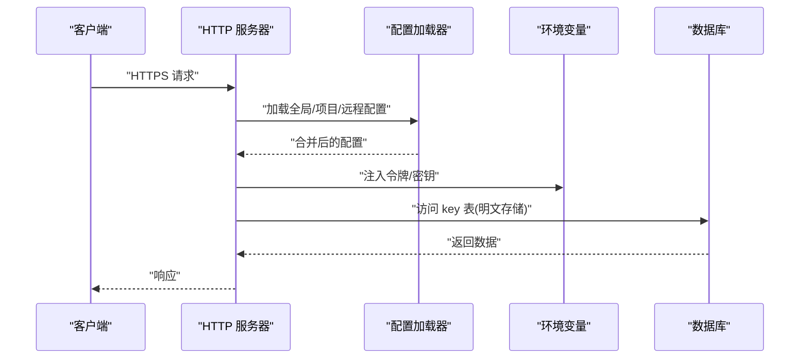
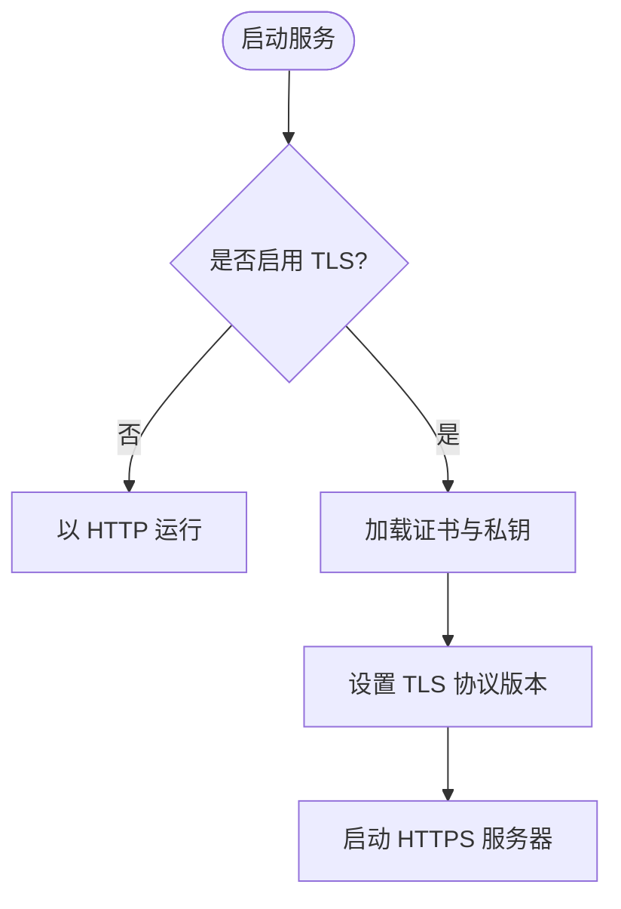
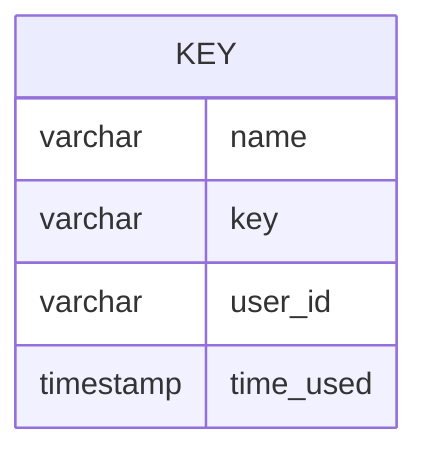
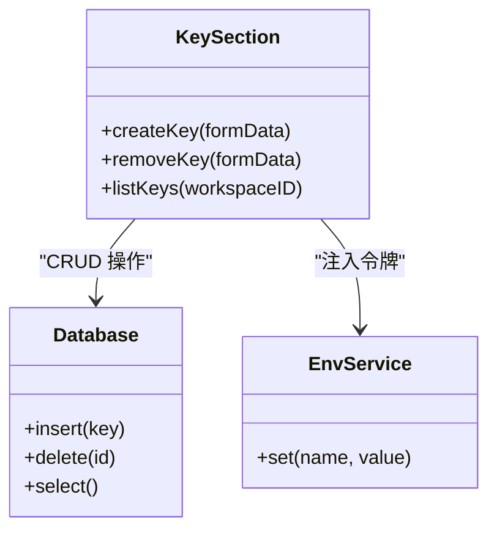
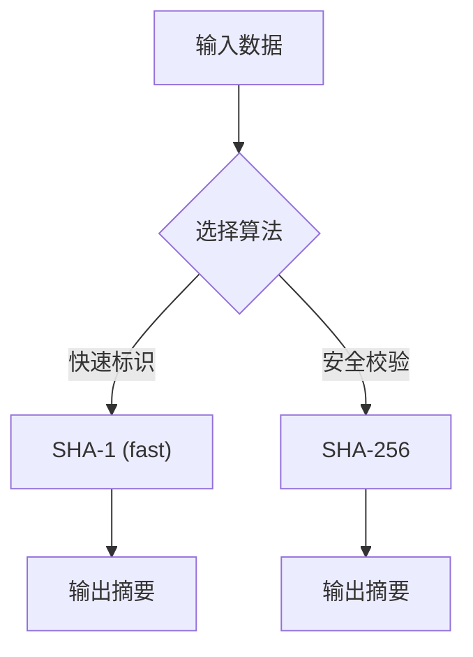
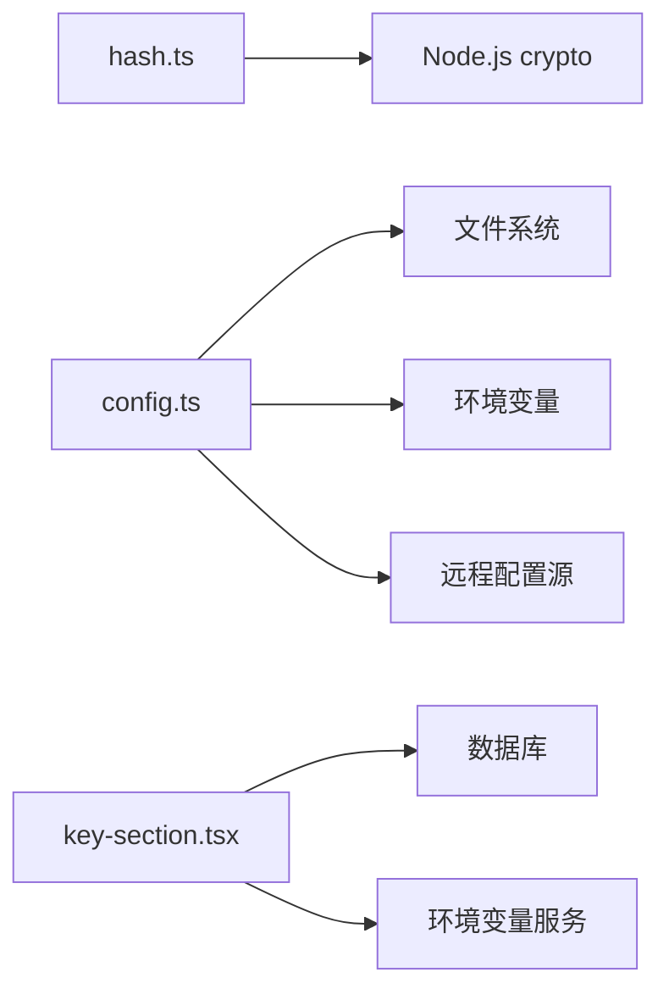

# 数据加密

<cite>
**本文引用的文件**   
- [packages/core/src/util/hash.ts](file://packages/core/src/util/hash.ts)
- [packages/web/src/content/docs/config.mdx](file://packages/web/src/content/docs/config.mdx)
- [packages/web/src/content/docs/bs/network.mdx](file://packages/web/src/content/docs/bs/network.mdx)
- [packages/opencode/src/config/config.ts](file://packages/opencode/src/config/config.ts)
- [packages/core/src/v1/config/server.ts](file://packages/core/src/v1/config/server.ts)
- [packages/console/app/src/routes/workspace/[id]/keys/key-section.tsx](file://packages/console/app/src/routes/workspace/[id]/keys/key-section.tsx)
- [packages/console/core/migrations/20250923213126_cold_la_nuit/snapshot.json](file://packages/console/core/migrations/20250923213126_cold_la_nuit/snapshot.json)
</cite>

## 目录
1. [简介](#简介)
2. [项目结构](#项目结构)
3. [核心组件](#核心组件)
4. [架构总览](#架构总览)
5. [详细组件分析](#详细组件分析)
6. [依赖关系分析](#依赖关系分析)
7. [性能考虑](#性能考虑)
8. [故障排除指南](#故障排除指南)
9. [结论](#结论)
10. [附录](#附录)

## 简介
本文件为 openNovel（OpenCode）提供全面的数据加密配置文档，覆盖传输层加密、静态数据加密、密钥管理与轮换策略、算法选择与性能优化建议，以及最佳实践与故障排除。内容基于仓库中的实际实现与文档进行归纳，确保可操作且可追溯。

## 项目结构
- 传输层相关：网络与代理、自定义证书等通过多语言文档说明；服务器监听端口、主机名、mDNS、CORS 等由配置模块定义。
- 静态数据相关：控制台数据库迁移快照显示 key 表字段，未体现应用层字段级加密或存储加密的显式实现。
- 密钥管理相关：控制台前端提供 API Key 的创建、展示与删除能力；后端使用环境变量注入令牌。
- 哈希工具：核心库提供 sha1/sha256 哈希函数，可用于标识或校验用途。

**图示来源** 
- [packages/core/src/v1/config/server.ts:6-18](file://packages/core/src/v1/config/server.ts#L6-L18)
- [packages/opencode/src/config/config.ts:175-210](file://packages/opencode/src/config/config.ts#L175-L210)
- [packages/web/src/content/docs/bs/network.mdx:1-57](file://packages/web/src/content/docs/bs/network.mdx#L1-L57)
- [packages/console/app/src/routes/workspace/[id]/keys/key-section.tsx:1-174](file://packages/console/app/src/routes/workspace/[id]/keys/key-section.tsx#L1-L174)
- [packages/console/core/migrations/20250923213126_cold_la_nuit/snapshot.json:724-782](file://packages/console/core/migrations/20250923213126_cold_la_nuit/snapshot.json#L724-L782)

**章节来源**
- [packages/core/src/v1/config/server.ts:6-18](file://packages/core/src/v1/config/server.ts#L6-L18)
- [packages/opencode/src/config/config.ts:175-210](file://packages/opencode/src/config/config.ts#L175-L210)
- [packages/web/src/content/docs/bs/network.mdx:1-57](file://packages/web/src/content/docs/bs/network.mdx#L1-L57)
- [packages/console/app/src/routes/workspace/[id]/keys/key-section.tsx:1-174](file://packages/console/app/src/routes/workspace/[id]/keys/key-section.tsx#L1-L174)
- [packages/console/core/migrations/20250923213126_cold_la_nuit/snapshot.json:724-782](file://packages/console/core/migrations/20250923213126_cold_la_nuit/snapshot.json#L724-L782)

## 核心组件
- 哈希工具：提供快速哈希与 SHA-256 哈希，用于非敏感标识或校验场景。
- 配置系统：支持多层配置合并（远程、全局、项目、受管），并可通过环境变量注入令牌。
- 服务器配置：定义监听端口、主机名、mDNS、CORS 等基础网络参数。
- 控制台 Key 管理：提供 API Key 的创建、复制、删除等操作，并在后端注入令牌到环境变量。

**章节来源**
- [packages/core/src/util/hash.ts:1-12](file://packages/core/src/util/hash.ts#L1-L12)
- [packages/opencode/src/config/config.ts:175-210](file://packages/opencode/src/config/config.ts#L175-L210)
- [packages/core/src/v1/config/server.ts:6-18](file://packages/core/src/v1/config/server.ts#L6-L18)
- [packages/console/app/src/routes/workspace/[id]/keys/key-section.tsx:1-174](file://packages/console/app/src/routes/workspace/[id]/keys/key-section.tsx#L1-L174)

## 架构总览
下图展示了从客户端到服务器的请求路径，以及配置加载与环境变量注入的关键环节。

**图示来源** 
- [packages/opencode/src/config/config.ts:175-210](file://packages/opencode/src/config/config.ts#L175-L210)
- [packages/console/app/src/routes/workspace/[id]/keys/key-section.tsx:1-174](file://packages/console/app/src/routes/workspace/[id]/keys/key-section.tsx#L1-L174)
- [packages/console/core/migrations/20250923213126_cold_la_nuit/snapshot.json:724-782](file://packages/console/core/migrations/20250923213126_cold_la_nuit/snapshot.json#L724-L782)

## 详细组件分析

### 传输层加密配置（TLS/SSL、HTTPS、协议版本）
- HTTPS 与代理：文档说明支持标准代理环境变量（HTTP_PROXY、HTTPS_PROXY、NO_PROXY），并允许设置自定义 CA 证书（NODE_EXTRA_CA_CERTS）。
- 服务器监听：当前配置模块仅暴露端口、主机名、mDNS、CORS 等选项，未包含 TLS/SSL 证书路径或协议版本设置。
- 建议：如需启用 HTTPS，应在反向代理（如 Nginx/Traefik）或容器编排层配置 TLS 终止，或在 Node/Bun 运行时启用 TLS 选项（若框架支持）。

**图示来源** 
- [packages/web/src/content/docs/bs/network.mdx:1-57](file://packages/web/src/content/docs/bs/network.mdx#L1-L57)
- [packages/core/src/v1/config/server.ts:6-18](file://packages/core/src/v1/config/server.ts#L6-L18)

**章节来源**
- [packages/web/src/content/docs/bs/network.mdx:1-57](file://packages/web/src/content/docs/bs/network.mdx#L1-L57)
- [packages/core/src/v1/config/server.ts:6-18](file://packages/core/src/v1/config/server.ts#L6-L18)

### 静态数据加密策略（数据库字段、文件存储、备份）
- 数据库字段：迁移快照显示 key 表包含 name、key、user_id、time_used 等字段，未见应用层加密或数据库层 TDE 的配置痕迹。
- 文件存储：未发现针对文件或对象存储的加密配置。
- 备份数据：未找到备份加密策略的实现或配置。
- 建议：对敏感字段（如 API Key）在写入前进行应用层加密（如 AES-GCM），或使用数据库透明加密（TDE）与备份加密。

**图示来源** 
- [packages/console/core/migrations/20250923213126_cold_la_nuit/snapshot.json:724-782](file://packages/console/core/migrations/20250923213126_cold_la_nuit/snapshot.json#L724-L782)

**章节来源**
- [packages/console/core/migrations/20250923213126_cold_la_nuit/snapshot.json:724-782](file://packages/console/core/migrations/20250923213126_cold_la_nuit/snapshot.json#L724-L782)

### 密钥管理方案（生成、轮换、存储安全）
- 生成与展示：控制台提供 API Key 的创建与展示功能，支持复制到剪贴板。
- 存储：Key 值直接存储在数据库中，未见哈希或加密处理。
- 轮换：未提供自动轮换机制；可通过删除旧 Key 并创建新 Key 实现手动轮换。
- 环境变量注入：后端将令牌注入环境变量供后续调用使用。

**图示来源** 
- [packages/console/app/src/routes/workspace/[id]/keys/key-section.tsx:1-174](file://packages/console/app/src/routes/workspace/[id]/keys/key-section.tsx#L1-L174)
- [packages/opencode/src/config/config.ts:485-514](file://packages/opencode/src/config/config.ts#L485-L514)

**章节来源**
- [packages/console/app/src/routes/workspace/[id]/keys/key-section.tsx:1-174](file://packages/console/app/src/routes/workspace/[id]/keys/key-section.tsx#L1-L174)
- [packages/opencode/src/config/config.ts:485-514](file://packages/opencode/src/config/config.ts#L485-L514)

### 哈希工具与算法选择
- 提供 fast（SHA-1）与 sha256（SHA-256）两种哈希方法。
- 适用场景：fast 适用于非安全场景的快速标识；sha256 适用于需要更强抗碰撞性的校验。
- 建议：避免使用 SHA-1 处理敏感数据；优先采用 SHA-256 或更现代算法（如 SHA-3、BLAKE2）。

**图示来源** 
- [packages/core/src/util/hash.ts:1-12](file://packages/core/src/util/hash.ts#L1-L12)

**章节来源**
- [packages/core/src/util/hash.ts:1-12](file://packages/core/src/util/hash.ts#L1-L12)

## 依赖关系分析
- 配置加载依赖文件系统、环境变量、远程配置源与受管偏好。
- 控制台 Key 管理依赖数据库与后端环境变量服务。
- 哈希工具依赖 Node.js crypto 模块。

**图示来源** 
- [packages/core/src/util/hash.ts:1-12](file://packages/core/src/util/hash.ts#L1-L12)
- [packages/opencode/src/config/config.ts:175-210](file://packages/opencode/src/config/config.ts#L175-L210)
- [packages/console/app/src/routes/workspace/[id]/keys/key-section.tsx:1-174](file://packages/console/app/src/routes/workspace/[id]/keys/key-section.tsx#L1-L174)

**章节来源**
- [packages/core/src/util/hash.ts:1-12](file://packages/core/src/util/hash.ts#L1-L12)
- [packages/opencode/src/config/config.ts:175-210](file://packages/opencode/src/config/config.ts#L175-L210)
- [packages/console/app/src/routes/workspace/[id]/keys/key-section.tsx:1-174](file://packages/console/app/src/routes/workspace/[id]/keys/key-section.tsx#L1-L174)

## 性能考虑
- 哈希算法：SHA-1 更快但安全性较低；SHA-256 更安全但计算开销略高。根据场景权衡。
- 配置加载：多层配置合并可能带来 I/O 与解析开销，建议缓存结果并减少频繁刷新。
- 数据库访问：Key 表读写频率较高时，注意索引与连接池配置。

[本节为通用指导，无需特定文件引用]

## 故障排除指南
- 代理与证书问题：检查 HTTP_PROXY/HTTPS_PROXY/NO_PROXY 环境变量是否正确设置；确认 NODE_EXTRA_CA_CERTS 指向有效的 CA 证书文件。
- 服务器无法监听：验证端口占用与防火墙规则；确认 hostname 与 mDNS 配置正确。
- Key 管理失败：检查数据库连接权限；确认环境变量中令牌注入成功。

**章节来源**
- [packages/web/src/content/docs/bs/network.mdx:1-57](file://packages/web/src/content/docs/bs/network.mdx#L1-L57)
- [packages/core/src/v1/config/server.ts:6-18](file://packages/core/src/v1/config/server.ts#L6-L18)
- [packages/opencode/src/config/config.ts:485-514](file://packages/opencode/src/config/config.ts#L485-L514)

## 结论
openNovel 当前在网络层提供代理与自定义 CA 支持，但未内置 TLS/SSL 配置项；静态数据未实现应用层或数据库层加密；密钥管理通过环境变量注入，但 Key 值明文存储。建议在生产环境中引入反向代理 TLS 终止、数据库 TDE、应用层字段加密与密钥轮换机制，以提升整体安全性。

[本节为总结性内容，无需特定文件引用]

## 附录
- 配置优先级与位置参考官方文档，了解远程、全局、项目、受管配置的合并顺序与覆盖规则。

**章节来源**
- [packages/web/src/content/docs/config.mdx:1-800](file://packages/web/src/content/docs/config.mdx#L1-L800)