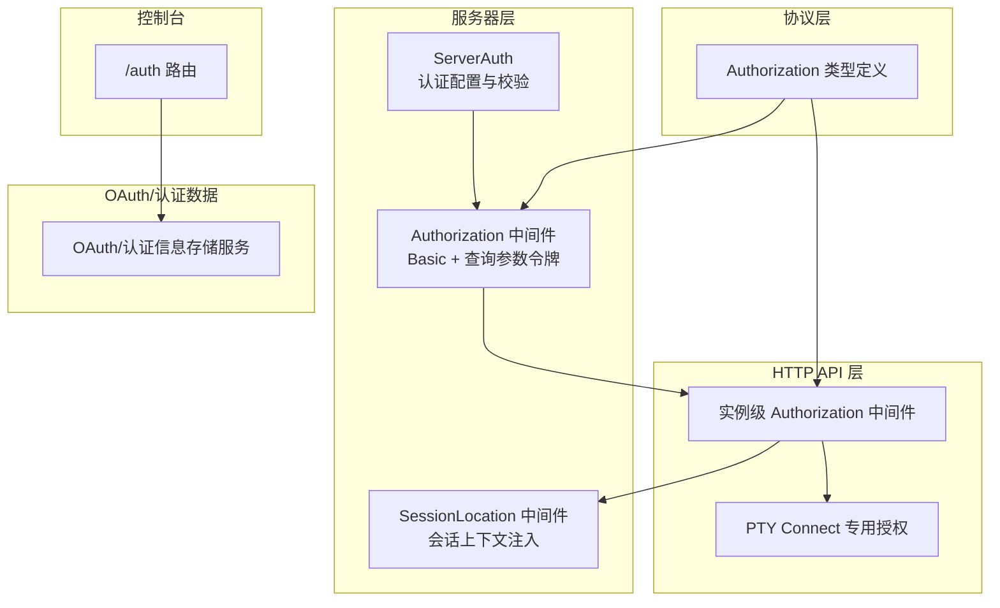
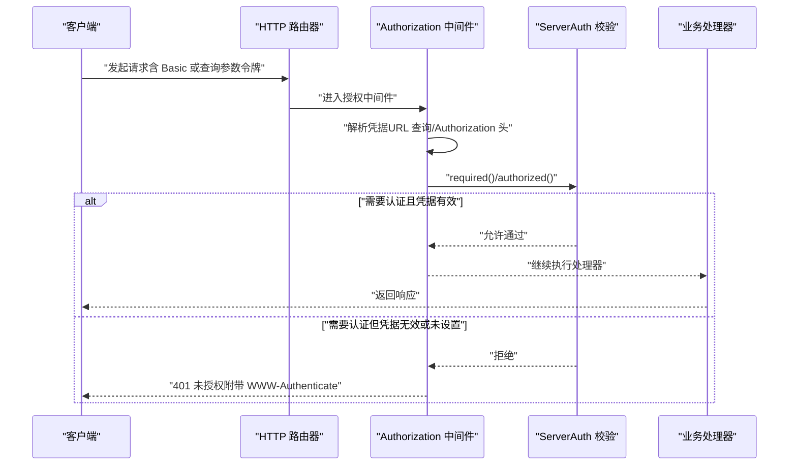
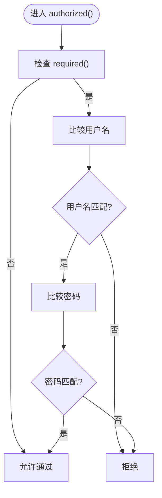
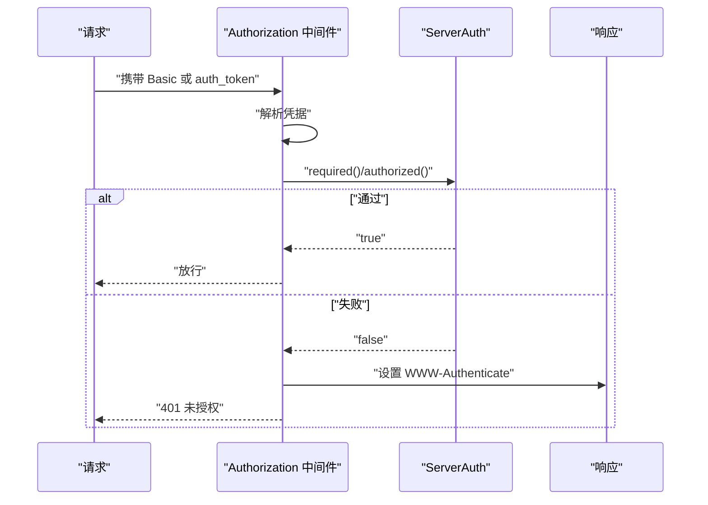
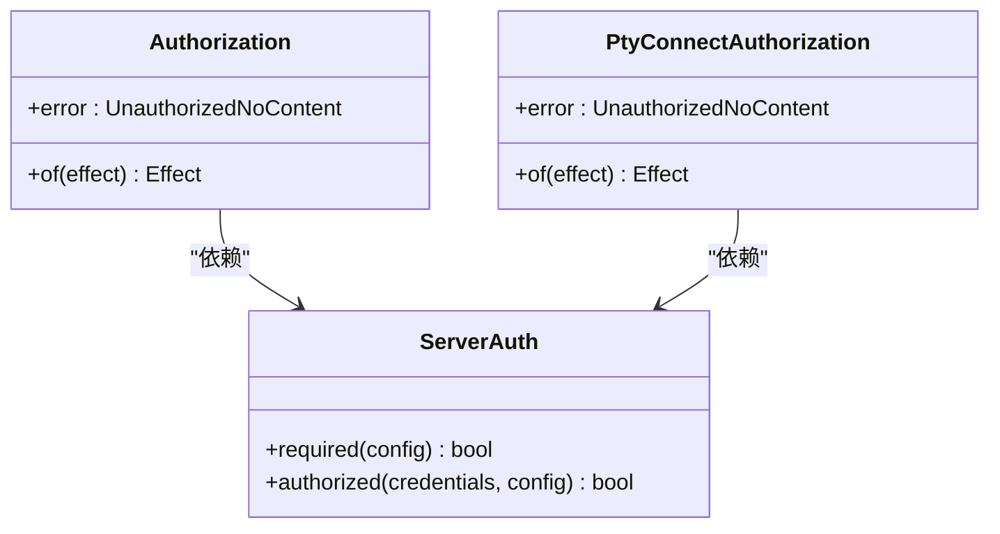
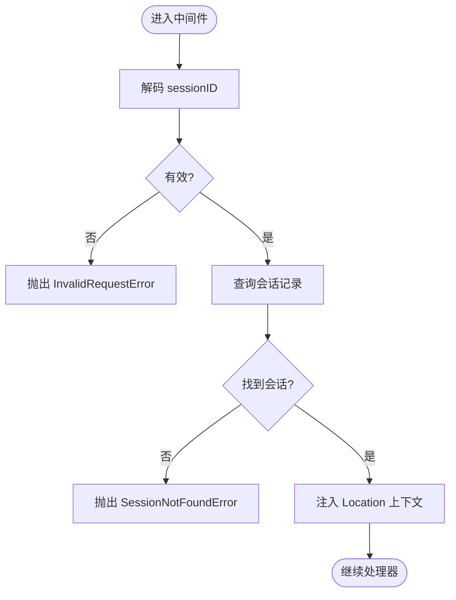
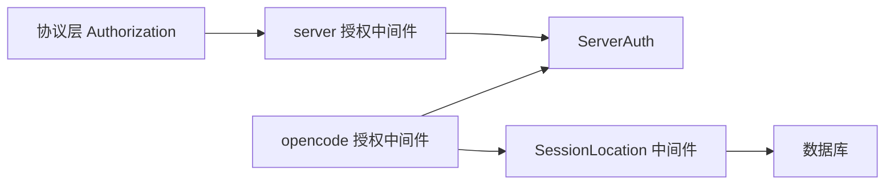

# 身份认证与授权

<cite>
**本文引用的文件**   
- [packages/server/src/auth.ts](file://packages/server/src/auth.ts)
- [packages/server/src/middleware/authorization.ts](file://packages/server/src/middleware/authorization.ts)
- [packages/opencode/src/server/routes/instance/httpapi/middleware/authorization.ts](file://packages/opencode/src/server/routes/instance/httpapi/middleware/authorization.ts)
- [packages/protocol/src/middleware/authorization.ts](file://packages/protocol/src/middleware/authorization.ts)
- [packages/server/src/middleware/session-location.ts](file://packages/server/src/middleware/session-location.ts)
- [packages/console/app/src/routes/auth/index.ts](file://packages/console/app/src/routes/auth/index.ts)
- [packages/opencode/src/auth/index.ts](file://packages/opencode/src/auth/index.ts)
</cite>

## 目录
1. [简介](#简介)
2. [项目结构](#项目结构)
3. [核心组件](#核心组件)
4. [架构总览](#架构总览)
5. [详细组件分析](#详细组件分析)
6. [依赖关系分析](#依赖关系分析)
7. [性能考虑](#性能考虑)
8. [故障排查指南](#故障排查指南)
9. [结论](#结论)
10. [附录](#附录)

## 简介
本文件面向 openNovel 的身份认证与授权，聚焦以下目标：
- 说明当前实现中的认证机制（基于 Basic 认证与查询参数令牌），并给出 JWT 令牌的集成建议与刷新策略设计。
- 描述会话控制策略（存储、超时、并发访问）的现有能力与扩展点。
- 解释权限验证系统（角色定义、资源访问控制、中间件实现）。
- 提供认证配置示例与安全最佳实践。
- 给出常见问题的排查方法与调试技巧。

注意：仓库中未直接实现 JWT 令牌生成与刷新流程；本节将基于现有认证基础给出可落地的设计与集成指引。

## 项目结构
与认证授权相关的关键位置如下：
- 服务器端认证配置与校验逻辑位于 server 包。
- HTTP API 层的授权中间件位于 opencode 包的实例路由中间件。
- 协议层定义了统一的 Authorization 中间件类型。
- 控制台应用包含一个认证入口路由。
- 会话定位中间件用于从数据库解析会话上下文。
- OAuth/认证信息持久化服务位于 opencode 包的 auth 模块。

图表来源 
- [packages/server/src/auth.ts:1-64](file://packages/server/src/auth.ts#L1-L64)
- [packages/server/src/middleware/authorization.ts:1-59](file://packages/server/src/middleware/authorization.ts#L1-L59)
- [packages/opencode/src/server/routes/instance/httpapi/middleware/authorization.ts:1-151](file://packages/opencode/src/server/routes/instance/httpapi/middleware/authorization.ts#L1-L151)
- [packages/protocol/src/middleware/authorization.ts:1-7](file://packages/protocol/src/middleware/authorization.ts#L1-L7)
- [packages/server/src/middleware/session-location.ts:1-68](file://packages/server/src/middleware/session-location.ts#L1-L68)
- [packages/console/app/src/routes/auth/index.ts:1-15](file://packages/console/app/src/routes/auth/index.ts#L1-L15)
- [packages/opencode/src/auth/index.ts:1-98](file://packages/opencode/src/auth/index.ts#L1-L98)

章节来源
- [packages/server/src/auth.ts:1-64](file://packages/server/src/auth.ts#L1-L64)
- [packages/server/src/middleware/authorization.ts:1-59](file://packages/server/src/middleware/authorization.ts#L1-L59)
- [packages/opencode/src/server/routes/instance/httpapi/middleware/authorization.ts:1-151](file://packages/opencode/src/server/routes/instance/httpapi/middleware/authorization.ts#L1-L151)
- [packages/protocol/src/middleware/authorization.ts:1-7](file://packages/protocol/src/middleware/authorization.ts#L1-L7)
- [packages/server/src/middleware/session-location.ts:1-68](file://packages/server/src/middleware/session-location.ts#L1-L68)
- [packages/console/app/src/routes/auth/index.ts:1-15](file://packages/console/app/src/routes/auth/index.ts#L1-L15)
- [packages/opencode/src/auth/index.ts:1-98](file://packages/opencode/src/auth/index.ts#L1-L98)

## 核心组件
- ServerAuth（服务器认证配置与校验）
  - 通过环境变量加载用户名与密码，支持可选启用。
  - 提供 authorized() 校验函数与 header()/headers() 辅助方法。
- Authorization 中间件（server 层）
  - 从请求 URL 查询参数或 Authorization 头提取 Basic 凭据。
  - 对 WebSocket 升级路径进行特殊处理（使用票据跳过此处校验）。
- Authorization 中间件（opencode 实例层）
  - 针对 HTTP API 路由的通用授权与 PTY Connect 专用授权。
  - 公开 UI 路径白名单豁免。
- SessionLocation 中间件
  - 根据路由参数解析 sessionID，查询数据库获取会话目录与工作区，注入到后续处理器。
- OAuth/认证信息存储
  - 以 JSON 文件或环境变量形式持久化 OAuth/Api/WellKnown 等认证信息。

章节来源
- [packages/server/src/auth.ts:1-64](file://packages/server/src/auth.ts#L1-L64)
- [packages/server/src/middleware/authorization.ts:1-59](file://packages/server/src/middleware/authorization.ts#L1-L59)
- [packages/opencode/src/server/routes/instance/httpapi/middleware/authorization.ts:1-151](file://packages/opencode/src/server/routes/instance/httpapi/middleware/authorization.ts#L1-L151)
- [packages/server/src/middleware/session-location.ts:1-68](file://packages/server/src/middleware/session-location.ts#L1-L68)
- [packages/opencode/src/auth/index.ts:1-98](file://packages/opencode/src/auth/index.ts#L1-L98)

## 架构总览
下图展示了认证与授权的调用链路与关键决策点：

图表来源 
- [packages/server/src/middleware/authorization.ts:1-59](file://packages/server/src/middleware/authorization.ts#L1-L59)
- [packages/opencode/src/server/routes/instance/httpapi/middleware/authorization.ts:1-151](file://packages/opencode/src/server/routes/instance/httpapi/middleware/authorization.ts#L1-L151)
- [packages/server/src/auth.ts:1-64](file://packages/server/src/auth.ts#L1-L64)

## 详细组件分析

### 服务器端认证配置与校验（ServerAuth）
- 配置来源
  - 用户名默认值与环境变量组合，密码为可选环境变量。
  - required() 判断是否启用认证。
- 校验逻辑
  - authorized() 比较用户名与密码。
- 辅助方法
  - header()/headers() 用于构造 Basic 认证头。

图表来源 
- [packages/server/src/auth.ts:1-64](file://packages/server/src/auth.ts#L1-L64)

章节来源
- [packages/server/src/auth.ts:1-64](file://packages/server/src/auth.ts#L1-L64)

### 服务器层授权中间件（server 包）
- 功能要点
  - 从 URL 查询参数 auth_token 或 Authorization: Basic 头解析凭据。
  - 对 WebSocket 升级路径（PTY 连接票据）跳过认证。
  - 失败时附加 WWW-Authenticate 头并返回 401。
- 适用场景
  - 作为全局前置校验，确保所有非公开接口受保护。

图表来源 
- [packages/server/src/middleware/authorization.ts:1-59](file://packages/server/src/middleware/authorization.ts#L1-L59)
- [packages/server/src/auth.ts:1-64](file://packages/server/src/auth.ts#L1-L64)

章节来源
- [packages/server/src/middleware/authorization.ts:1-59](file://packages/server/src/middleware/authorization.ts#L1-L59)

### 实例级 HTTP API 授权中间件（opencode 包）
- 功能要点
  - 提供通用 Authorization 与 PTY Connect 专用授权。
  - 公开 UI 路径白名单豁免。
  - 统一错误类型为 HttpApiError.UnauthorizedNoContent。
- 适用场景
  - 在 HTTP API 路由层精细化控制访问。

图表来源 
- [packages/opencode/src/server/routes/instance/httpapi/middleware/authorization.ts:1-151](file://packages/opencode/src/server/routes/instance/httpapi/middleware/authorization.ts#L1-L151)
- [packages/server/src/auth.ts:1-64](file://packages/server/src/auth.ts#L1-L64)

章节来源
- [packages/opencode/src/server/routes/instance/httpapi/middleware/authorization.ts:1-151](file://packages/opencode/src/server/routes/instance/httpapi/middleware/authorization.ts#L1-L151)

### 协议层授权类型（protocol 包）
- 作用
  - 定义统一的 Authorization 中间件类型与错误类型绑定。
- 价值
  - 跨层复用授权语义，保证错误一致性。

章节来源
- [packages/protocol/src/middleware/authorization.ts:1-7](file://packages/protocol/src/middleware/authorization.ts#L1-L7)

### 会话定位中间件（session-location）
- 功能要点
  - 解码路由参数 sessionID。
  - 查询数据库获取会话目录与工作区 ID。
  - 将 Location 注入到后续处理器。
- 错误处理
  - 无效 sessionID 返回 InvalidRequestError。
  - 不存在会话返回 SessionNotFoundError。

图表来源 
- [packages/server/src/middleware/session-location.ts:1-68](file://packages/server/src/middleware/session-location.ts#L1-L68)

章节来源
- [packages/server/src/middleware/session-location.ts:1-68](file://packages/server/src/middleware/session-location.ts#L1-L68)

### 控制台认证入口（console app）
- 行为
  - /auth GET 尝试重定向至最近工作区；失败则跳转到授权页。
- 用途
  - 作为用户登录后的初始跳转入口。

章节来源
- [packages/console/app/src/routes/auth/index.ts:1-15](file://packages/console/app/src/routes/auth/index.ts#L1-L15)

### OAuth/认证信息存储（opencode auth）
- 数据结构
  - Oauth、Api、WellKnown 三种认证类型，统一 Info 联合类型。
- 存储方式
  - 优先读取环境变量 OPENCODE_AUTH_CONTENT；否则读写本地 JSON 文件。
- 操作
  - get/all/set/remove 四种基本操作。

章节来源
- [packages/opencode/src/auth/index.ts:1-98](file://packages/opencode/src/auth/index.ts#L1-L98)

## 依赖关系分析
- 中间件依赖
  - server 层 Authorization 依赖 ServerAuth 配置与校验。
  - opencode 实例层 Authorization 同样依赖 ServerAuth，并引入公开路径白名单与 PTY 票据检测。
- 协议与错误
  - protocol 层定义 Authorization 类型与错误类型，供上层复用。
- 会话与数据库
  - session-location 中间件依赖数据库与服务定位器，解析会话上下文。

图表来源 
- [packages/protocol/src/middleware/authorization.ts:1-7](file://packages/protocol/src/middleware/authorization.ts#L1-L7)
- [packages/server/src/middleware/authorization.ts:1-59](file://packages/server/src/middleware/authorization.ts#L1-L59)
- [packages/opencode/src/server/routes/instance/httpapi/middleware/authorization.ts:1-151](file://packages/opencode/src/server/routes/instance/httpapi/middleware/authorization.ts#L1-L151)
- [packages/server/src/middleware/session-location.ts:1-68](file://packages/server/src/middleware/session-location.ts#L1-L68)
- [packages/server/src/auth.ts:1-64](file://packages/server/src/auth.ts#L1-L64)

章节来源
- [packages/protocol/src/middleware/authorization.ts:1-7](file://packages/protocol/src/middleware/authorization.ts#L1-L7)
- [packages/server/src/middleware/authorization.ts:1-59](file://packages/server/src/middleware/authorization.ts#L1-L59)
- [packages/opencode/src/server/routes/instance/httpapi/middleware/authorization.ts:1-151](file://packages/opencode/src/server/routes/instance/httpapi/middleware/authorization.ts#L1-L151)
- [packages/server/src/middleware/session-location.ts:1-68](file://packages/server/src/middleware/session-location.ts#L1-L68)
- [packages/server/src/auth.ts:1-64](file://packages/server/src/auth.ts#L1-L64)

## 性能考虑
- 认证开销
  - Basic 认证仅做字符串比较，开销极低。
  - 若引入 JWT，需关注签名验证与缓存策略。
- 会话查询
  - session-location 每次请求查询数据库，建议对热点会话做缓存（如内存缓存或 Redis）。
- 并发控制
  - 当前未实现显式并发限制，可在网关或反向代理层增加限流与连接数限制。
- 超时处理
  - 建议在网关层设置请求超时，服务端侧避免长时间阻塞。

[本节为通用指导，不直接分析具体文件]

## 故障排查指南
- 常见问题
  - 401 未授权：检查是否设置了认证所需的环境变量，或请求是否携带正确的 Basic/查询参数令牌。
  - WebSocket 升级失败：确认 PTY 连接票据是否正确传递，该路径会跳过 Basic 认证。
  - 会话不存在：检查 sessionID 是否有效，数据库是否存在对应记录。
- 调试技巧
  - 打印请求头与 URL 查询参数，确认凭据是否被正确解析。
  - 临时关闭认证开关（移除密码环境变量）以定位问题范围。
  - 查看 www-authenticate 响应头，确认是否返回了挑战信息。
- 日志与监控
  - 在授权中间件处添加成功/失败计数，便于观察认证失败趋势。
  - 对数据库查询耗时进行埋点，识别慢查询。

章节来源
- [packages/server/src/middleware/authorization.ts:1-59](file://packages/server/src/middleware/authorization.ts#L1-L59)
- [packages/opencode/src/server/routes/instance/httpapi/middleware/authorization.ts:1-151](file://packages/opencode/src/server/routes/instance/httpapi/middleware/authorization.ts#L1-L151)
- [packages/server/src/middleware/session-location.ts:1-68](file://packages/server/src/middleware/session-location.ts#L1-L68)

## 结论
- 当前实现采用 Basic 认证与查询参数令牌，结合中间件完成统一授权。
- 会话上下文通过数据库查询注入，具备可扩展性。
- 尚未实现 JWT 令牌机制；可按本文建议进行集成，提升无状态性与可伸缩性。
- 建议在生产环境启用 HTTPS、最小权限原则与审计日志。

[本节为总结，不直接分析具体文件]

## 附录

### JWT 令牌管理机制（集成建议）
- 令牌生成
  - 在登录成功后签发 JWT，包含用户标识、角色、过期时间等声明。
  - 建议使用强密钥与合适的算法（如 RS256/ES256）。
- 令牌验证
  - 在授权中间件中解析并验证 JWT，必要时校验签名与过期时间。
  - 可将公钥或密钥管理器注入为依赖，支持轮换。
- 令牌刷新
  - 签发短期 Access Token 与长期 Refresh Token。
  - 刷新流程：客户端携带 Refresh Token 调用刷新接口，服务端校验后签发新的 Access Token。
  - 建议将 Refresh Token 存储在安全位置（HttpOnly Cookie 或后端存储），并设置合理的过期与撤销机制。

[本节为概念性设计，不直接分析具体文件]

### 会话控制策略（存储、超时、并发）
- 存储
  - 当前会话定位通过数据库查询；可扩展为集中式会话存储（Redis/Memcached）。
- 超时
  - 建议为会话设置绝对过期与空闲超时，定期清理失效会话。
- 并发访问控制
  - 在网关或应用层实现限流、防重放与并发锁，防止资源竞争与滥用。

[本节为概念性设计，不直接分析具体文件]

### 权限验证系统（角色、资源、中间件）
- 角色定义
  - 在 JWT 或会话中声明角色（如 admin/editor/viewer）。
- 资源访问控制
  - 在路由或处理器级别进行 RBAC 校验，结合资源 ID 与操作类型。
- 中间件实现
  - 在授权中间件中注入角色与资源上下文，供后续处理器使用。

[本节为概念性设计，不直接分析具体文件]

### 认证配置示例
- 环境变量
  - OPENNOVEL_SERVER_USERNAME：服务器用户名（默认值见实现）。
  - OPENNOVEL_SERVER_PASSWORD：服务器密码（为空则禁用认证）。
  - OPENCODE_AUTH_CONTENT：OAuth/认证信息的 JSON 内容（可选）。
- 使用建议
  - 生产环境务必设置强密码，并通过安全渠道注入。
  - 使用 HTTPS 传输，避免明文泄露。

章节来源
- [packages/server/src/auth.ts:1-64](file://packages/server/src/auth.ts#L1-L64)
- [packages/opencode/src/auth/index.ts:1-98](file://packages/opencode/src/auth/index.ts#L1-L98)

### 安全最佳实践
- 强制 HTTPS，禁用弱加密套件。
- 最小权限原则：仅授予必要角色与资源访问。
- 审计日志：记录认证失败、敏感操作与异常事件。
- 密钥管理：使用密钥管理服务，支持轮换与撤销。
- 输入校验：对所有输入进行严格校验，防止注入与越权。

[本节为通用指导，不直接分析具体文件]