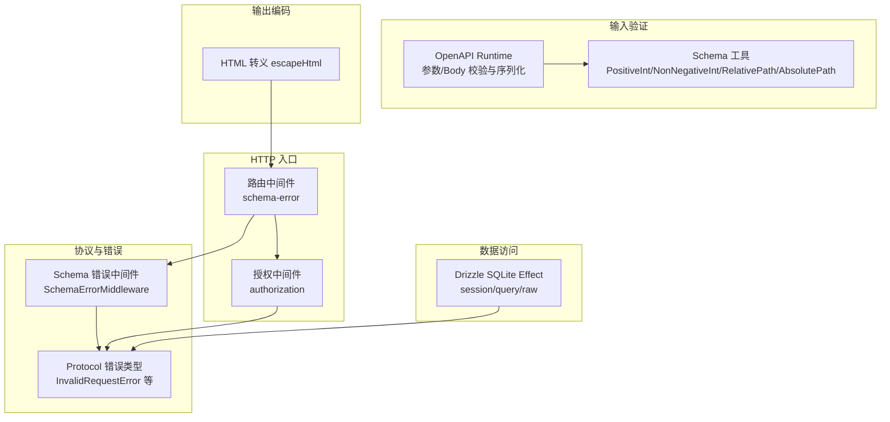
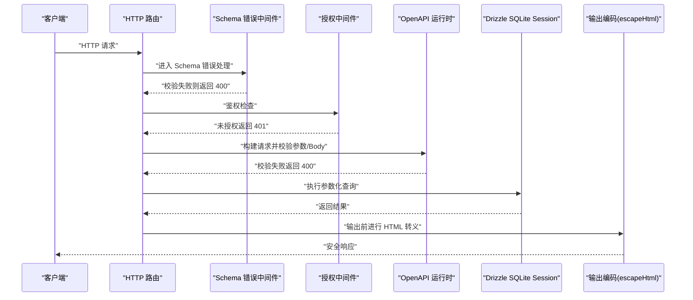
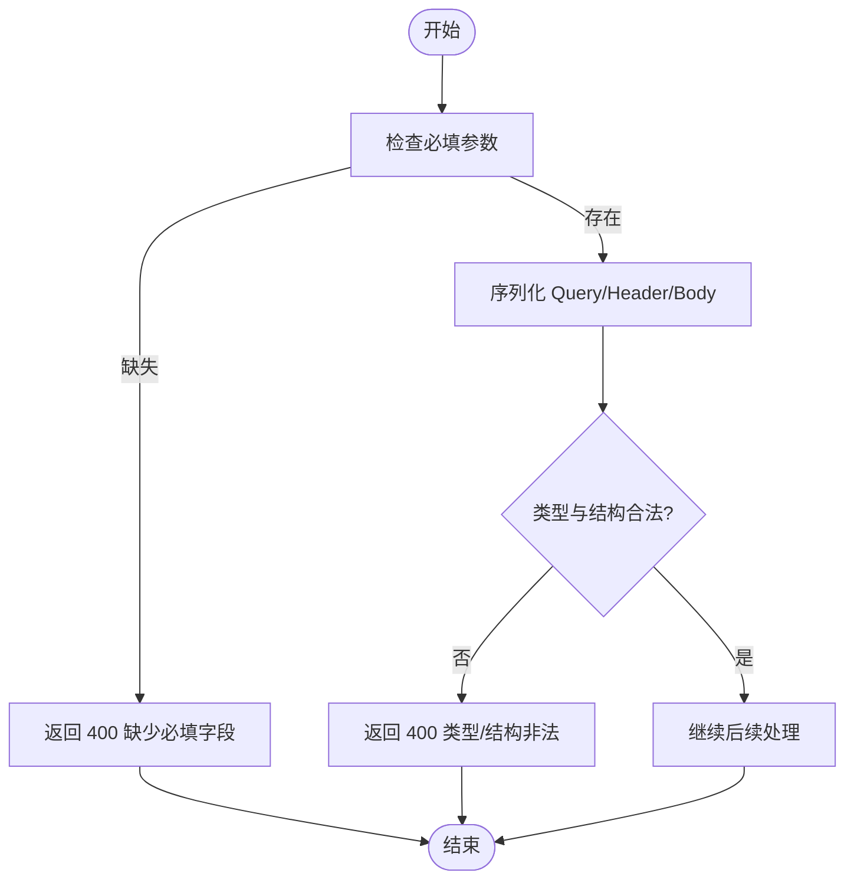
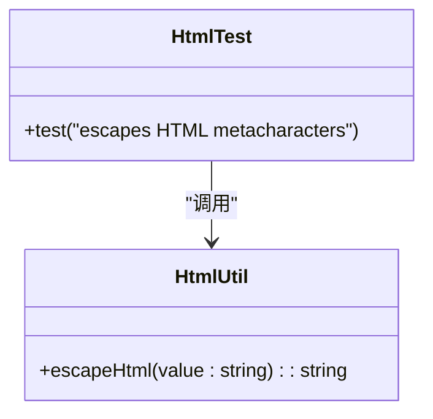
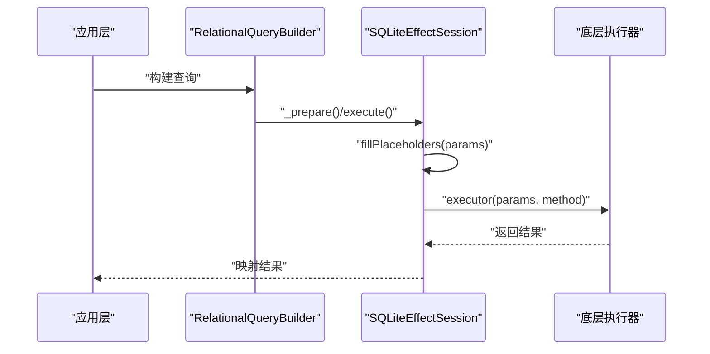
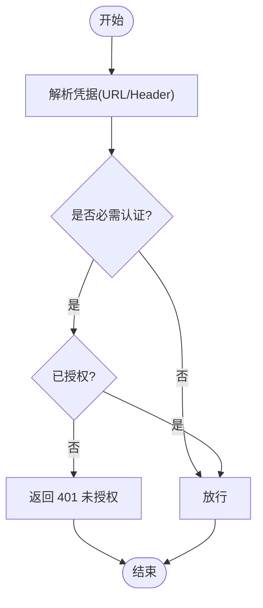
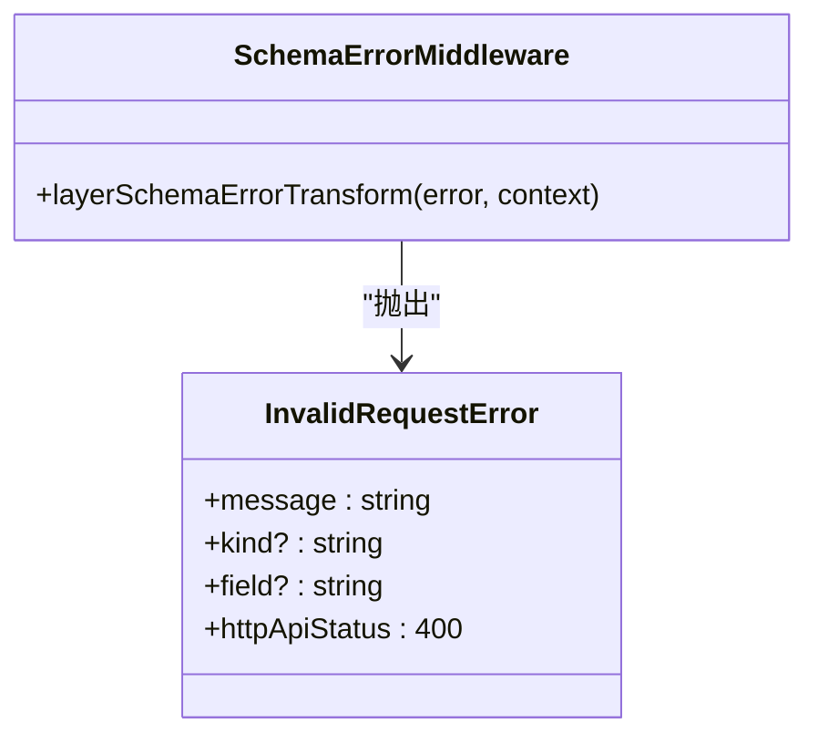
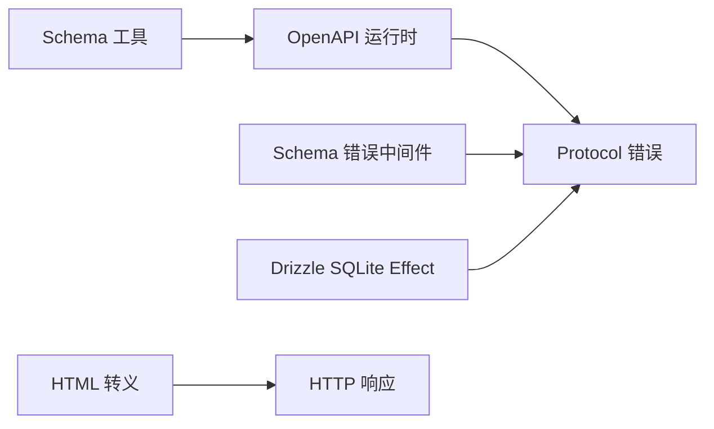

# 输入验证与输出编码

<cite>
**本文引用的文件**   
- [packages/schema/src/schema.ts](file://packages/schema/src/schema.ts)
- [packages/opencode/src/util/html.ts](file://packages/opencode/src/util/html.ts)
- [packages/opencode/test/util/html.test.ts](file://packages/opencode/test/util/html.test.ts)
- [packages/server/src/middleware/schema-error.ts](file://packages/server/src/middleware/schema-error.ts)
- [packages/protocol/src/middleware/schema-error.ts](file://packages/protocol/src/middleware/schema-error.ts)
- [packages/protocol/src/errors.ts](file://packages/protocol/src/errors.ts)
- [packages/opencode/src/server/routes/instance/httpapi/middleware/schema-error.ts](file://packages/opencode/src/server/routes/instance/httpapi/middleware/schema-error.ts)
- [packages/codemode/src/openapi/runtime.ts](file://packages/codemode/src/openapi/runtime.ts)
- [packages/effect-drizzle-sqlite/src/sqlite-core/effect/session.ts](file://packages/effect-drizzle-sqlite/src/sqlite-core/effect/session.ts)
- [packages/effect-drizzle-sqlite/src/sqlite-core/effect/query.ts](file://packages/effect-drizzle-sqlite/src/sqlite-core/effect/query.ts)
- [packages/effect-drizzle-sqlite/src/sqlite-core/effect/raw.ts](file://packages/effect-drizzle-sqlite/src/sqlite-core/effect/raw.ts)
- [packages/opencode/src/server/routes/instance/httpapi/middleware/authorization.ts](file://packages/opencode/src/server/routes/instance/httpapi/middleware/authorization.ts)
- [packages/protocol/src/middleware/authorization.ts](file://packages/protocol/src/middleware/authorization.ts)
</cite>

## 目录
1. [简介](#简介)
2. [项目结构](#项目结构)
3. [核心组件](#核心组件)
4. [架构总览](#架构总览)
5. [详细组件分析](#详细组件分析)
6. [依赖关系分析](#依赖关系分析)
7. [性能考虑](#性能考虑)
8. [故障排查指南](#故障排查指南)
9. [结论](#结论)
10. [附录](#附录)

## 简介
本文件面向 openNovel 项目的输入验证与输出编码，系统性说明：
- 输入验证策略：请求参数校验、数据类型检查、业务规则约束。
- 输出编码机制：防止 XSS 等注入攻击的编码实践。
- SQL 注入防护：参数化查询与 ORM 使用规范。
- 安全输入处理最佳实践：白名单、长度限制、格式检查。
- 常见漏洞防护措施与代码示例路径（以源码引用代替直接代码）。

## 项目结构
本项目在多个包中实现输入验证与输出编码能力：
- schema 层：定义通用类型与校验器（如正整数、路径品牌、可选字段、UTC 时间戳）。
- HTTP API 中间件：统一将 Schema 校验失败转换为标准错误响应，并截断原因文本避免信息泄露。
- 工具函数：HTML 转义用于输出编码。
- Drizzle SQLite Effect 集成：通过预编译与占位符填充执行查询，避免字符串拼接导致的 SQL 注入。
- OpenAPI 运行时：对请求体与参数进行严格序列化与缺失必填项检查。
- 授权中间件：基于 URL 或 Header 解析凭据并进行鉴权。

图表来源 
- [packages/server/src/middleware/schema-error.ts:1-21](file://packages/server/src/middleware/schema-error.ts#L1-L21)
- [packages/protocol/src/middleware/schema-error.ts:1-7](file://packages/protocol/src/middleware/schema-error.ts#L1-L7)
- [packages/protocol/src/errors.ts:1-112](file://packages/protocol/src/errors.ts#L1-L112)
- [packages/codemode/src/openapi/runtime.ts:54-286](file://packages/codemode/src/openapi/runtime.ts#L54-L286)
- [packages/schema/src/schema.ts:1-31](file://packages/schema/src/schema.ts#L1-L31)
- [packages/effect-drizzle-sqlite/src/sqlite-core/effect/session.ts:202-313](file://packages/effect-drizzle-sqlite/src/sqlite-core/effect/session.ts#L202-L313)
- [packages/effect-drizzle-sqlite/src/sqlite-core/effect/query.ts:1-198](file://packages/effect-drizzle-sqlite/src/sqlite-core/effect/query.ts#L1-L198)
- [packages/effect-drizzle-sqlite/src/sqlite-core/effect/raw.ts:1-49](file://packages/effect-drizzle-sqlite/src/sqlite-core/effect/raw.ts#L1-L49)
- [packages/opencode/src/util/html.ts:1-9](file://packages/opencode/src/util/html.ts#L1-L9)

章节来源
- [packages/server/src/middleware/schema-error.ts:1-21](file://packages/server/src/middleware/schema-error.ts#L1-L21)
- [packages/protocol/src/middleware/schema-error.ts:1-7](file://packages/protocol/src/middleware/schema-error.ts#L1-L7)
- [packages/protocol/src/errors.ts:1-112](file://packages/protocol/src/errors.ts#L1-L112)
- [packages/codemode/src/openapi/runtime.ts:54-286](file://packages/codemode/src/openapi/runtime.ts#L54-L286)
- [packages/schema/src/schema.ts:1-31](file://packages/schema/src/schema.ts#L1-L31)
- [packages/effect-drizzle-sqlite/src/sqlite-core/effect/session.ts:202-313](file://packages/effect-drizzle-sqlite/src/sqlite-core/effect/session.ts#L202-L313)
- [packages/effect-drizzle-sqlite/src/sqlite-core/effect/query.ts:1-198](file://packages/effect-drizzle-sqlite/src/sqlite-core/effect/query.ts#L1-L198)
- [packages/effect-drizzle-sqlite/src/sqlite-core/effect/raw.ts:1-49](file://packages/effect-drizzle-sqlite/src/sqlite-core/effect/raw.ts#L1-L49)
- [packages/opencode/src/util/html.ts:1-9](file://packages/opencode/src/util/html.ts#L1-L9)

## 核心组件
- Schema 校验器与类型工具
  - 提供正整数、非负整数、路径品牌（相对/绝对）、可选键、UTC 时间戳编解码等基础校验与转换能力。
- 统一 Schema 错误中间件
  - 将 Schema 校验失败转换为 InvalidRequestError，并截断原因消息，避免大负载或敏感信息泄露到响应体。
- HTML 输出转义
  - 提供 escapeHtml 函数，对 & < > " ' 进行转义，防止 XSS。
- OpenAPI 运行时输入校验
  - 构建请求前校验必填参数、序列化 query/header/body，拒绝不支持的类型与嵌套结构。
- Drizzle SQLite Effect 数据访问
  - 通过 prepare/execute 与占位符填充执行查询，避免 SQL 注入；记录查询与参数，便于审计。
- 授权中间件
  - 从 URL 或 Authorization Header 解析凭据，按配置决定是否放行。

章节来源
- [packages/schema/src/schema.ts:1-31](file://packages/schema/src/schema.ts#L1-L31)
- [packages/server/src/middleware/schema-error.ts:1-21](file://packages/server/src/middleware/schema-error.ts#L1-L21)
- [packages/opencode/src/util/html.ts:1-9](file://packages/opencode/src/util/html.ts#L1-L9)
- [packages/codemode/src/openapi/runtime.ts:54-286](file://packages/codemode/src/openapi/runtime.ts#L54-L286)
- [packages/effect-drizzle-sqlite/src/sqlite-core/effect/session.ts:202-313](file://packages/effect-drizzle-sqlite/src/sqlite-core/effect/session.ts#L202-L313)
- [packages/opencode/src/server/routes/instance/httpapi/middleware/authorization.ts:77-116](file://packages/opencode/src/server/routes/instance/httpapi/middleware/authorization.ts#L77-L116)

## 架构总览
下图展示了从 HTTP 请求进入，到输入验证、鉴权、数据库访问与输出编码的整体流程。

图表来源 
- [packages/server/src/middleware/schema-error.ts:1-21](file://packages/server/src/middleware/schema-error.ts#L1-L21)
- [packages/opencode/src/server/routes/instance/httpapi/middleware/authorization.ts:77-116](file://packages/opencode/src/server/routes/instance/httpapi/middleware/authorization.ts#L77-L116)
- [packages/codemode/src/openapi/runtime.ts:54-286](file://packages/codemode/src/openapi/runtime.ts#L54-L286)
- [packages/effect-drizzle-sqlite/src/sqlite-core/effect/session.ts:202-313](file://packages/effect-drizzle-sqlite/src/sqlite-core/effect/session.ts#L202-L313)
- [packages/opencode/src/util/html.ts:1-9](file://packages/opencode/src/util/html.ts#L1-L9)

## 详细组件分析

### 输入验证策略
- 请求参数验证
  - OpenAPI 运行时在构建请求前检查必填参数，缺失时立即失败；query/header/body 序列化过程中拒绝不支持的类型与嵌套值。
- 数据类型检查
  - 使用 Schema 工具定义 PositiveInt、NonNegativeInt、RelativePath、AbsolutePath、DateTimeUtcFromMillis 等强类型校验。
- 业务规则验证
  - 通过 Schema 组合与自定义校验逻辑实现业务约束（例如范围、格式、白名单）。

图表来源 
- [packages/codemode/src/openapi/runtime.ts:54-286](file://packages/codemode/src/openapi/runtime.ts#L54-L286)
- [packages/schema/src/schema.ts:1-31](file://packages/schema/src/schema.ts#L1-L31)

章节来源
- [packages/codemode/src/openapi/runtime.ts:54-286](file://packages/codemode/src/openapi/runtime.ts#L54-L286)
- [packages/schema/src/schema.ts:1-31](file://packages/schema/src/schema.ts#L1-L31)

### 输出编码机制（防 XSS）
- 使用 escapeHtml 对输出内容进行转义，确保特殊字符不会作为 HTML 执行。
- 测试覆盖常见场景，包括脚本标签、引号、单引号、空串等。

图表来源 
- [packages/opencode/src/util/html.ts:1-9](file://packages/opencode/src/util/html.ts#L1-L9)
- [packages/opencode/test/util/html.test.ts:1-15](file://packages/opencode/test/util/html.test.ts#L1-L15)

章节来源
- [packages/opencode/src/util/html.ts:1-9](file://packages/opencode/src/util/html.ts#L1-L9)
- [packages/opencode/test/util/html.test.ts:1-15](file://packages/opencode/test/util/html.test.ts#L1-L15)

### SQL 注入防护（参数化查询与 ORM 规范）
- 使用 Drizzle SQLite Effect 的会话与查询构建器，所有查询通过 prepare/execute 与占位符填充执行，避免字符串拼接。
- 日志记录查询语句与参数，便于审计与问题定位。
- 原始查询（raw）同样通过 PreparedQuery 接口执行，保持安全性。

图表来源 
- [packages/effect-drizzle-sqlite/src/sqlite-core/effect/query.ts:1-198](file://packages/effect-drizzle-sqlite/src/sqlite-core/effect/query.ts#L1-L198)
- [packages/effect-drizzle-sqlite/src/sqlite-core/effect/session.ts:202-313](file://packages/effect-drizzle-sqlite/src/sqlite-core/effect/session.ts#L202-L313)
- [packages/effect-drizzle-sqlite/src/sqlite-core/effect/raw.ts:1-49](file://packages/effect-drizzle-sqlite/src/sqlite-core/effect/raw.ts#L1-L49)

章节来源
- [packages/effect-drizzle-sqlite/src/sqlite-core/effect/query.ts:1-198](file://packages/effect-drizzle-sqlite/src/sqlite-core/effect/query.ts#L1-L198)
- [packages/effect-drizzle-sqlite/src/sqlite-core/effect/session.ts:202-313](file://packages/effect-drizzle-sqlite/src/sqlite-core/effect/session.ts#L202-L313)
- [packages/effect-drizzle-sqlite/src/sqlite-core/effect/raw.ts:1-49](file://packages/effect-drizzle-sqlite/src/sqlite-core/effect/raw.ts#L1-L49)

### 授权与凭据解析
- 从 URL 查询参数或 Authorization Header 解析凭据，支持 Basic 认证。
- 根据配置决定是否需要认证，未通过则返回 401 并设置 www-authenticate。

图表来源 
- [packages/opencode/src/server/routes/instance/httpapi/middleware/authorization.ts:77-116](file://packages/opencode/src/server/routes/instance/httpapi/middleware/authorization.ts#L77-L116)
- [packages/protocol/src/middleware/authorization.ts:1-6](file://packages/protocol/src/middleware/authorization.ts#L1-L6)

章节来源
- [packages/opencode/src/server/routes/instance/httpapi/middleware/authorization.ts:77-116](file://packages/opencode/src/server/routes/instance/httpapi/middleware/authorization.ts#L77-L116)
- [packages/protocol/src/middleware/authorization.ts:1-6](file://packages/protocol/src/middleware/authorization.ts#L1-L6)

### 错误处理与响应控制
- Schema 错误中间件将校验失败转换为 InvalidRequestError，并截断原因消息，避免响应过大或泄露敏感信息。
- 统一错误类型包含 message、kind、field 等字段，便于客户端解析与展示。

图表来源 
- [packages/protocol/src/errors.ts:1-112](file://packages/protocol/src/errors.ts#L1-L112)
- [packages/server/src/middleware/schema-error.ts:1-21](file://packages/server/src/middleware/schema-error.ts#L1-L21)
- [packages/protocol/src/middleware/schema-error.ts:1-7](file://packages/protocol/src/middleware/schema-error.ts#L1-L7)
- [packages/opencode/src/server/routes/instance/httpapi/middleware/schema-error.ts:1-41](file://packages/opencode/src/server/routes/instance/httpapi/middleware/schema-error.ts#L1-L41)

章节来源
- [packages/protocol/src/errors.ts:1-112](file://packages/protocol/src/errors.ts#L1-L112)
- [packages/server/src/middleware/schema-error.ts:1-21](file://packages/server/src/middleware/schema-error.ts#L1-L21)
- [packages/protocol/src/middleware/schema-error.ts:1-7](file://packages/protocol/src/middleware/schema-error.ts#L1-L7)
- [packages/opencode/src/server/routes/instance/httpapi/middleware/schema-error.ts:1-41](file://packages/opencode/src/server/routes/instance/httpapi/middleware/schema-error.ts#L1-L41)

## 依赖关系分析
- 输入验证依赖 Schema 工具与 OpenAPI 运行时，确保请求结构与类型正确。
- 错误处理依赖 Protocol 错误类型与中间件，保证一致的 4xx/5xx 响应。
- 数据访问依赖 Drizzle SQLite Effect，确保参数化查询与可审计性。
- 输出编码依赖 escapeHtml，确保渲染安全。

图表来源 
- [packages/schema/src/schema.ts:1-31](file://packages/schema/src/schema.ts#L1-L31)
- [packages/codemode/src/openapi/runtime.ts:54-286](file://packages/codemode/src/openapi/runtime.ts#L54-L286)
- [packages/protocol/src/errors.ts:1-112](file://packages/protocol/src/errors.ts#L1-L112)
- [packages/server/src/middleware/schema-error.ts:1-21](file://packages/server/src/middleware/schema-error.ts#L1-L21)
- [packages/effect-drizzle-sqlite/src/sqlite-core/effect/session.ts:202-313](file://packages/effect-drizzle-sqlite/src/sqlite-core/effect/session.ts#L202-L313)
- [packages/opencode/src/util/html.ts:1-9](file://packages/opencode/src/util/html.ts#L1-L9)

章节来源
- [packages/schema/src/schema.ts:1-31](file://packages/schema/src/schema.ts#L1-L31)
- [packages/codemode/src/openapi/runtime.ts:54-286](file://packages/codemode/src/openapi/runtime.ts#L54-L286)
- [packages/protocol/src/errors.ts:1-112](file://packages/protocol/src/errors.ts#L1-L112)
- [packages/server/src/middleware/schema-error.ts:1-21](file://packages/server/src/middleware/schema-error.ts#L1-L21)
- [packages/effect-drizzle-sqlite/src/sqlite-core/effect/session.ts:202-313](file://packages/effect-drizzle-sqlite/src/sqlite-core/effect/session.ts#L202-L313)
- [packages/opencode/src/util/html.ts:1-9](file://packages/opencode/src/util/html.ts#L1-L9)

## 性能考虑
- Schema 错误响应体大小限制：通过截断 reason 消息，避免大负载导致响应膨胀与日志污染。
- 查询缓存与日志：Drizzle session 在执行前后进行缓存与日志记录，减少重复计算并提升可观测性。
- 序列化优化：OpenAPI 运行时在序列化阶段尽早失败，避免不必要的鉴权与网络开销。

[本节为通用指导，不直接分析具体文件]

## 故障排查指南
- 400 错误（无效请求）
  - 检查必填参数是否缺失、类型是否符合 Schema 定义。
  - 查看 Schema 错误中间件的日志与截断后的 reason。
- 401 未授权
  - 确认 URL 或 Authorization Header 中的凭据是否正确解析。
  - 检查授权中间件的配置与白名单路径。
- 数据库错误
  - 检查 Drizzle session 的日志，确认占位符填充与查询语句。
  - 避免使用字符串拼接，改用 ORM 提供的参数化接口。
- XSS 风险
  - 确保所有用户可控的输出都经过 escapeHtml 处理。
  - 运行 html.test 用例验证转义行为。

章节来源
- [packages/server/src/middleware/schema-error.ts:1-21](file://packages/server/src/middleware/schema-error.ts#L1-L21)
- [packages/opencode/src/server/routes/instance/httpapi/middleware/authorization.ts:77-116](file://packages/opencode/src/server/routes/instance/httpapi/middleware/authorization.ts#L77-L116)
- [packages/effect-drizzle-sqlite/src/sqlite-core/effect/session.ts:202-313](file://packages/effect-drizzle-sqlite/src/sqlite-core/effect/session.ts#L202-L313)
- [packages/opencode/test/util/html.test.ts:1-15](file://packages/opencode/test/util/html.test.ts#L1-L15)

## 结论
openNovel 在输入验证与输出编码方面形成了完整的闭环：
- 输入侧通过 Schema 与 OpenAPI 运行时进行严格校验，尽早失败并返回标准化错误。
- 数据访问采用 Drizzle SQLite Effect 的参数化查询，有效防范 SQL 注入。
- 输出侧通过 escapeHtml 转义，降低 XSS 风险。
- 授权与错误处理贯穿全链路，保障一致性与可观测性。

建议持续完善：
- 扩展 OpenAPI 运行时对更多序列化风格的支持。
- 增加响应体大小限制与严格的 UTF-8 校验。
- 强化白名单与长度限制策略，结合业务规则进行更细粒度的校验。

[本节为总结，不直接分析具体文件]

## 附录
- 安全输入处理最佳实践清单
  - 白名单验证：仅允许已知安全的值集合。
  - 长度限制：对字符串字段设置最小/最大长度。
  - 格式检查：使用正则或 Schema 校验邮箱、URL、日期等格式。
  - 类型强制：使用 Strong Type 与 Schema 转换，避免隐式类型转换。
  - 输出编码：对所有用户可控输出进行 HTML 转义。
  - 参数化查询：禁止字符串拼接 SQL，使用 ORM 或预编译语句。
  - 错误信息脱敏：避免泄露堆栈、密钥与内部细节。

[本节为通用指导，不直接分析具体文件]