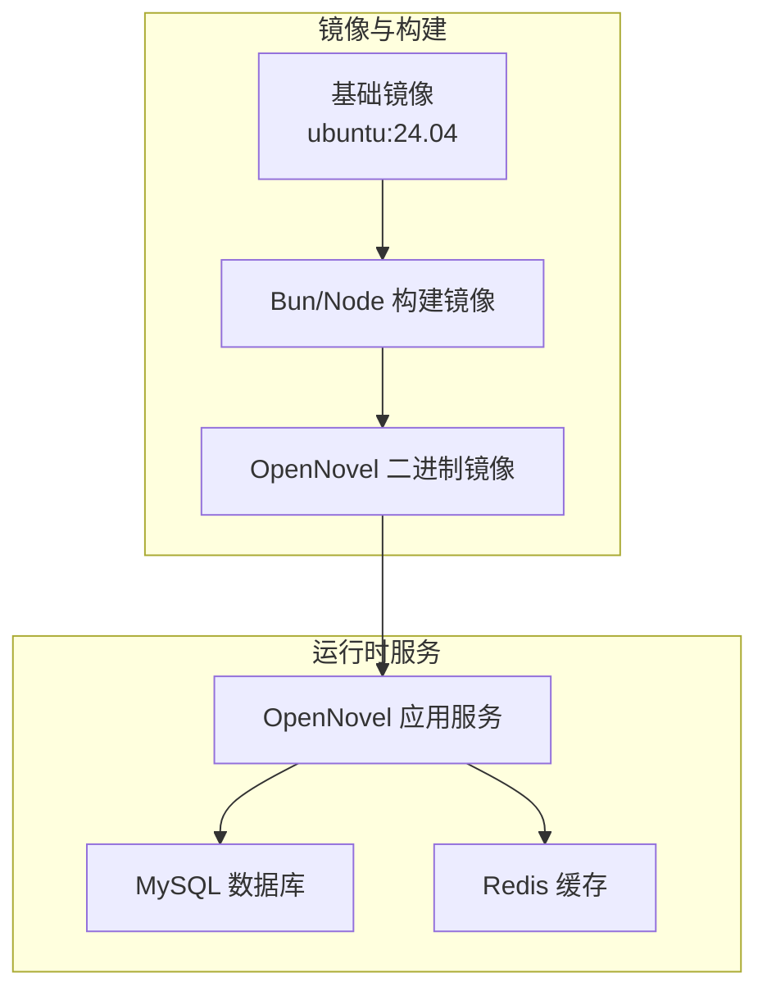
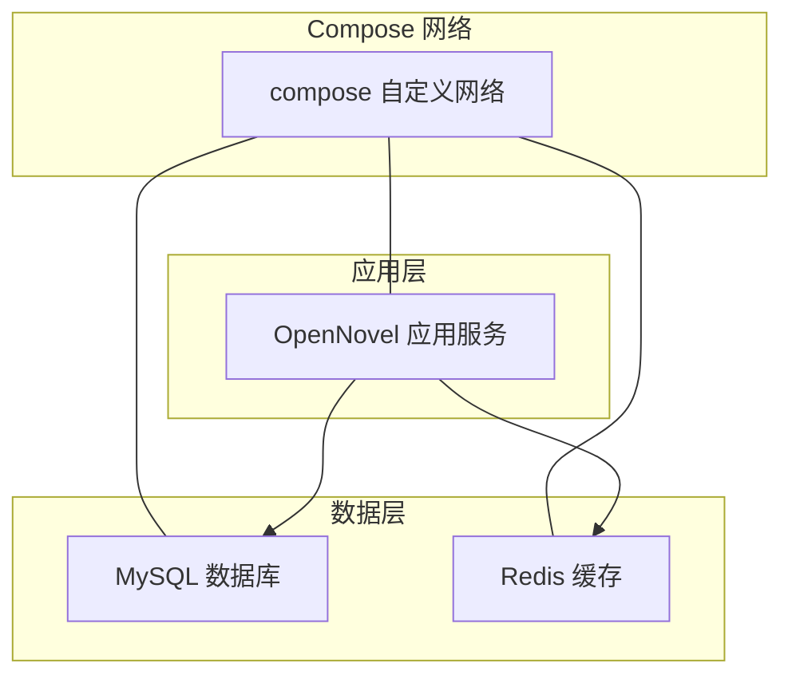
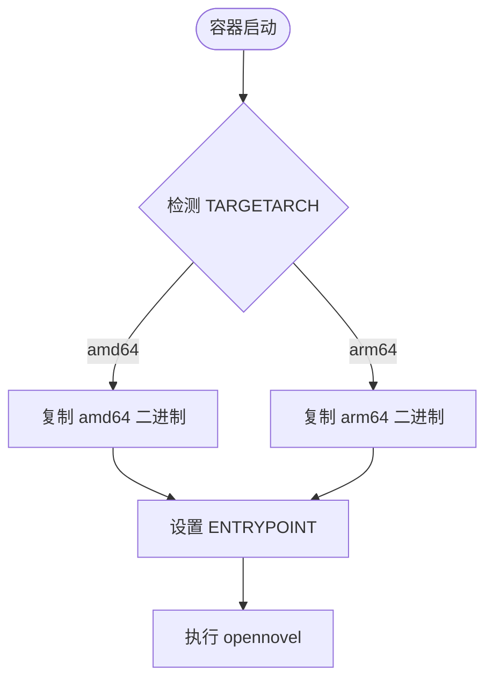
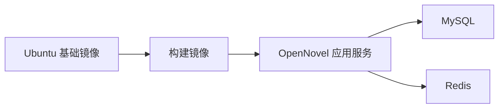

# Docker Compose 编排

<cite>
**本文引用的文件**   
- [packages/opencode/Dockerfile](file://packages/opencode/Dockerfile)
- [packages/containers/base/Dockerfile](file://packages/containers/base/Dockerfile)
- [packages/containers/bun-node/Dockerfile](file://packages/containers/bun-node/Dockerfile)
- [package.json](file://package.json)
- [packages/console/app/src/routes/zen/util/redis.ts](file://packages/console/app/src/routes/zen/util/redis.ts)
- [packages/stats/core/drizzle.config.ts](file://packages/stats/core/drizzle.config.ts)
- [infra/secret.ts](file://infra/secret.ts)
</cite>

## 目录
1. [简介](#简介)
2. [项目结构](#项目结构)
3. [核心组件](#核心组件)
4. [架构总览](#架构总览)
5. [详细组件分析](#详细组件分析)
6. [依赖关系分析](#依赖关系分析)
7. [性能考虑](#性能考虑)
8. [故障排查指南](#故障排查指南)
9. [结论](#结论)
10. [附录](#附录)

## 简介
本文件为 openNovel 项目的 Docker Compose 编排文档，聚焦于服务定义、网络与数据卷管理、环境变量配置、服务间依赖与健康检查机制，并提供开发、测试、生产环境的 compose 示例。内容基于仓库中现有的 Dockerfile、构建脚本与运行时依赖进行归纳与扩展，确保读者能够在本地或 CI 环境中快速搭建可运行的多容器环境。

## 项目结构
openNovel 采用多包（monorepo）组织方式，包含控制台、统计服务、SDK、Web 应用等模块。Docker 相关镜像定义位于 packages/containers 与 packages/opencode 目录下；运行环境与工具链通过 bun/node 镜像准备；数据库与缓存通过外部服务或容器化部署提供。

图表来源 
- [packages/containers/base/Dockerfile:1-19](file://packages/containers/base/Dockerfile#L1-L19)
- [packages/containers/bun-node/Dockerfile:1-25](file://packages/containers/bun-node/Dockerfile#L1-L25)
- [packages/opencode/Dockerfile:1-19](file://packages/opencode/Dockerfile#L1-L19)

章节来源
- [packages/containers/base/Dockerfile:1-19](file://packages/containers/base/Dockerfile#L1-L19)
- [packages/containers/bun-node/Dockerfile:1-25](file://packages/containers/bun-node/Dockerfile#L1-L25)
- [packages/opencode/Dockerfile:1-19](file://packages/opencode/Dockerfile#L1-L19)

## 核心组件
- OpenNovel 应用服务：以 Alpine 为基础镜像，入口为 opennovel 二进制，支持 amd64/arm64 多架构。
- 构建环境：Ubuntu 基础镜像 + Node/Bun 工具链，用于编译与打包。
- 数据库：MySQL（由 drizzle 配置推断），用于持久化存储。
- 缓存：Upstash Redis REST（由 console 代码推断），用于限流与临时状态。

章节来源
- [packages/opencode/Dockerfile:1-19](file://packages/opencode/Dockerfile#L1-L19)
- [packages/containers/bun-node/Dockerfile:1-25](file://packages/containers/bun-node/Dockerfile#L1-L25)
- [packages/stats/core/drizzle.config.ts:1-22](file://packages/stats/core/drizzle.config.ts#L1-L22)
- [packages/console/app/src/routes/zen/util/redis.ts:1-18](file://packages/console/app/src/routes/zen/util/redis.ts#L1-L18)

## 架构总览
下图展示典型的多容器部署架构：OpenNovel 应用服务连接 MySQL 与 Redis，使用统一网络通信，并通过环境变量注入敏感信息。

[此图为概念性架构图，不直接映射具体源码文件]

## 详细组件分析

### OpenNovel 应用服务（Alpine 镜像）
- 基础镜像：alpine，安装必要运行时库。
- 多架构支持：根据 TARGETARCH 选择 amd64 或 arm64 的二进制路径。
- 入口命令：ENTRYPOINT 指向 opennovel，便于直接运行。
- 环境变量：默认禁用 Bun 运行时转译器缓存，适合无状态容器场景。

图表来源 
- [packages/opencode/Dockerfile:1-19](file://packages/opencode/Dockerfile#L1-L19)

章节来源
- [packages/opencode/Dockerfile:1-19](file://packages/opencode/Dockerfile#L1-L19)

### 构建环境（Bun/Node 镜像）
- 基础镜像：从公共 registry 的 ubuntu:24.04 基础镜像派生。
- 工具链：安装指定版本的 Node.js 与 Bun，启用 corepack。
- 用途：在 CI 或本地构建阶段安装依赖、编译产物并生成可执行文件。

章节来源
- [packages/containers/base/Dockerfile:1-19](file://packages/containers/base/Dockerfile#L1-L19)
- [packages/containers/bun-node/Dockerfile:1-25](file://packages/containers/bun-node/Dockerfile#L1-L25)

### 数据库（MySQL）
- 驱动与迁移：drizzle 配置使用 MySQL 方言，包含数据库名、主机、端口、用户、密码与 SSL 选项。
- 建议：在生产环境启用 SSL 并严格校验证书；在开发环境可使用明文连接但需限制访问范围。

章节来源
- [packages/stats/core/drizzle.config.ts:1-22](file://packages/stats/core/drizzle.config.ts#L1-L22)

### 缓存（Redis/Upstash）
- 客户端：console 模块通过 Upstash Redis REST 接口访问缓存，URL 与 Token 来自资源管理。
- 限流键：按 stage、kind、identifier 与 interval 组合生成键，避免冲突。

章节来源
- [packages/console/app/src/routes/zen/util/redis.ts:1-18](file://packages/console/app/src/routes/zen/util/redis.ts#L1-L18)

### 环境变量与密钥
- 密钥管理：infra/secret.ts 定义了 R2、Honeycomb、Support API、Upstash Redis 等密钥项。
- 建议：在 Compose 中使用 .env 文件或 secrets 挂载注入敏感值，避免硬编码。

章节来源
- [infra/secret.ts:1-15](file://infra/secret.ts#L1-L15)

## 依赖关系分析
- 应用服务依赖：
  - MySQL：用于持久化存储（stats 模块）。
  - Redis：用于限流与临时状态（console 模块）。
- 构建依赖：
  - Node.js 与 Bun：用于依赖安装与构建。
  - Ubuntu 基础镜像：提供系统级工具链。

图表来源 
- [packages/stats/core/drizzle.config.ts:1-22](file://packages/stats/core/drizzle.config.ts#L1-L22)
- [packages/console/app/src/routes/zen/util/redis.ts:1-18](file://packages/console/app/src/routes/zen/util/redis.ts#L1-L18)
- [packages/containers/bun-node/Dockerfile:1-25](file://packages/containers/bun-node/Dockerfile#L1-L25)
- [packages/containers/base/Dockerfile:1-19](file://packages/containers/base/Dockerfile#L1-L19)

章节来源
- [packages/stats/core/drizzle.config.ts:1-22](file://packages/stats/core/drizzle.config.ts#L1-L22)
- [packages/console/app/src/routes/zen/util/redis.ts:1-18](file://packages/console/app/src/routes/zen/util/redis.ts#L1-L18)
- [packages/containers/bun-node/Dockerfile:1-25](file://packages/containers/bun-node/Dockerfile#L1-L25)
- [packages/containers/base/Dockerfile:1-19](file://packages/containers/base/Dockerfile#L1-L19)

## 性能考虑
- 镜像体积：优先使用 alpine 作为运行镜像以减少体积；构建阶段使用 ubuntu 以获得完整工具链。
- 缓存策略：禁用运行时转译器缓存以提升冷启动速度；构建缓存利用分层优化依赖安装。
- 资源限制：为容器设置 CPU/内存上限，避免争用；合理配置 MySQL 与 Redis 的连接池。
- 网络优化：将数据库与缓存置于同一私有网络，减少跨网段延迟。
- 健康检查：为应用、数据库与缓存添加健康检查，提升编排稳定性。

[本节为通用指导，不直接分析具体文件]

## 故障排查指南
- 应用无法启动：
  - 检查环境变量是否注入正确（数据库、Redis、API Key）。
  - 查看容器日志确认入口命令执行成功。
- 数据库连接失败：
  - 验证主机名、端口、用户名、密码与 SSL 配置。
  - 检查防火墙与安全组规则。
- Redis 限流异常：
  - 确认 Upstash URL 与 Token 有效。
  - 检查键空间命名是否冲突。
- 构建失败：
  - 确认 Node/Bun 版本与依赖兼容。
  - 清理构建缓存后重试。

章节来源
- [packages/stats/core/drizzle.config.ts:1-22](file://packages/stats/core/drizzle.config.ts#L1-L22)
- [packages/console/app/src/routes/zen/util/redis.ts:1-18](file://packages/console/app/src/routes/zen/util/redis.ts#L1-L18)
- [packages/opencode/Dockerfile:1-19](file://packages/opencode/Dockerfile#L1-L19)

## 结论
通过合理的镜像分层与环境变量管理，openNovel 可在多种环境下稳定运行。结合健康检查与资源限制，可进一步提升系统的可靠性与性能。建议在开发与生产环境中分别使用不同的 compose 配置文件，以实现差异化的配置与部署策略。

[本节为总结性内容，不直接分析具体文件]

## 附录

### Compose 示例（开发环境）
- 服务定义：
  - opennovel-app：基于 Alpine 的应用镜像，暴露端口，挂载日志目录。
  - mysql：官方 MySQL 镜像，设置 root 密码与初始数据库。
  - redis：官方 Redis 镜像，启用持久化。
- 网络：自定义 bridge 网络，所有服务加入该网络。
- 数据卷：
  - mysql-data：持久化数据库文件。
  - redis-data：持久化缓存数据。
- 环境变量：
  - 数据库连接：MYSQL_HOST、MYSQL_PORT、MYSQL_USER、MYSQL_PASSWORD、MYSQL_DATABASE。
  - Redis 连接：REDIS_URL、REDIS_TOKEN。
  - 应用配置：APP_ENV=development、LOG_LEVEL=debug。

章节来源
- [package.json:1-162](file://package.json#L1-L162)
- [infra/secret.ts:1-15](file://infra/secret.ts#L1-L15)

### Compose 示例（测试环境）
- 服务定义：
  - opennovel-app：同开发环境，但关闭调试日志。
  - mysql：使用轻量级镜像，禁用持久化。
  - redis：内存模式，禁用持久化。
- 环境变量：
  - APP_ENV=test、DB_SSL=false、CACHE_TTL=60。

章节来源
- [packages/stats/core/drizzle.config.ts:1-22](file://packages/stats/core/drizzle.config.ts#L1-L22)
- [packages/console/app/src/routes/zen/util/redis.ts:1-18](file://packages/console/app/src/routes/zen/util/redis.ts#L1-L18)

### Compose 示例（生产环境）
- 服务定义：
  - opennovel-app：多副本部署，启用健康检查与滚动更新。
  - mysql：主从架构，启用 SSL 与备份策略。
  - redis：集群模式，启用持久化与监控。
- 环境变量：
  - APP_ENV=production、DB_SSL=true、CACHE_TTL=300。
  - 密钥通过 secrets 挂载注入。

章节来源
- [infra/secret.ts:1-15](file://infra/secret.ts#L1-L15)
- [packages/stats/core/drizzle.config.ts:1-22](file://packages/stats/core/drizzle.config.ts#L1-L22)
- [packages/console/app/src/routes/zen/util/redis.ts:1-18](file://packages/console/app/src/routes/zen/util/redis.ts#L1-L18)