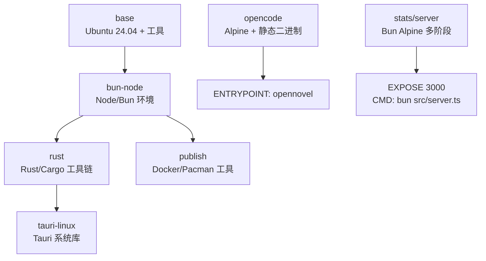
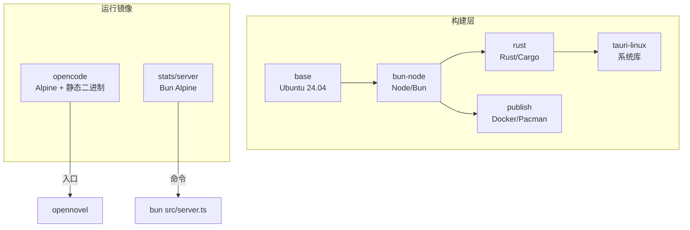
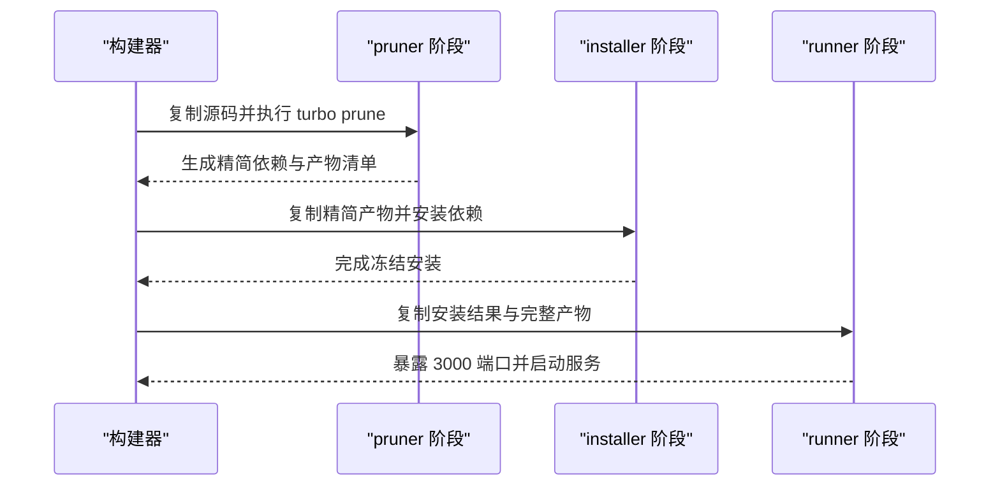
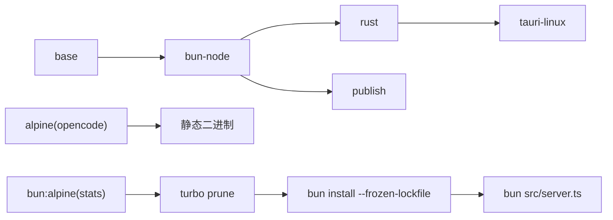

# Docker 配置与构建

<cite>
**本文引用的文件**   
- [.dockerignore](file://.dockerignore)
- [packages/containers/base/Dockerfile](file://packages/containers/base/Dockerfile)
- [packages/containers/bun-node/Dockerfile](file://packages/containers/bun-node/Dockerfile)
- [packages/containers/publish/Dockerfile](file://packages/containers/publish/Dockerfile)
- [packages/containers/rust/Dockerfile](file://packages/containers/rust/Dockerfile)
- [packages/containers/tauri-linux/Dockerfile](file://packages/containers/tauri-linux/Dockerfile)
- [packages/opencode/Dockerfile](file://packages/opencode/Dockerfile)
- [packages/stats/server/Dockerfile](file://packages/stats/server/Dockerfile)
- [bunfig.toml](file://bunfig.toml)
</cite>

## 目录
1. [简介](#简介)
2. [项目结构](#项目结构)
3. [核心组件](#核心组件)
4. [架构总览](#架构总览)
5. [详细组件分析](#详细组件分析)
6. [依赖关系分析](#依赖关系分析)
7. [性能考虑](#性能考虑)
8. [故障排查指南](#故障排查指南)
9. [结论](#结论)
10. [附录](#附录)

## 简介
本文件为 openNovel 项目的 Docker 配置与构建文档，重点说明多阶段构建流程、基础镜像选择策略、依赖安装优化与镜像体积控制方法。同时给出 .dockerignore 的排除规则说明、各 Dockerfile 的构建参数与环境变量配置，以及本地开发环境与生产环境的最佳实践建议。

## 项目结构
本项目采用“分层容器镜像”的多阶段构建模式：
- base：通用系统依赖层（Ubuntu 24.04 + 常用工具）
- bun-node：Node.js 与 Bun 运行时层
- rust：Rust/Cargo 工具链层
- tauri-linux：Tauri Linux 打包所需系统库层
- publish：发布工具层（Docker/Pacman）
- opencode：最终运行镜像（Alpine + musl 静态二进制）
- stats/server：统计服务镜像（Bun Alpine 多阶段构建）



图表来源
- [packages/containers/base/Dockerfile:1-19](file://packages/containers/base/Dockerfile#L1-L19)
- [packages/containers/bun-node/Dockerfile:1-25](file://packages/containers/bun-node/Dockerfile#L1-L25)
- [packages/containers/rust/Dockerfile:1-14](file://packages/containers/rust/Dockerfile#L1-L14)
- [packages/containers/tauri-linux/Dockerfile:1-13](file://packages/containers/tauri-linux/Dockerfile#L1-L13)
- [packages/containers/publish/Dockerfile:1-11](file://packages/containers/publish/Dockerfile#L1-L11)
- [packages/opencode/Dockerfile:1-19](file://packages/opencode/Dockerfile#L1-L19)
- [packages/stats/server/Dockerfile:1-33](file://packages/stats/server/Dockerfile#L1-L33)

章节来源
- [packages/containers/base/Dockerfile:1-19](file://packages/containers/base/Dockerfile#L1-L19)
- [packages/containers/bun-node/Dockerfile:1-25](file://packages/containers/bun-node/Dockerfile#L1-L25)
- [packages/containers/rust/Dockerfile:1-14](file://packages/containers/rust/Dockerfile#L1-L14)
- [packages/containers/tauri-linux/Dockerfile:1-13](file://packages/containers/tauri-linux/Dockerfile#L1-L13)
- [packages/containers/publish/Dockerfile:1-11](file://packages/containers/publish/Dockerfile#L1-L11)
- [packages/opencode/Dockerfile:1-19](file://packages/opencode/Dockerfile#L1-L19)
- [packages/stats/server/Dockerfile:1-33](file://packages/stats/server/Dockerfile#L1-L33)

## 核心组件
- 基础镜像与系统依赖：使用 Ubuntu 24.04 作为通用基础，仅安装必要工具并清理 apt 缓存以减小体积。
- Node/Bun 环境：通过脚本下载指定版本 Node.js 与 Bun，启用 corepack，统一构建环境。
- Rust 工具链：基于最小化 profile 安装稳定版 Rust/Cargo，设置环境变量隔离工作目录。
- Tauri Linux：安装 WebKitGTK、SVG、AppIndicator 等桌面打包依赖。
- 发布镜像：安装 docker.io 与 pacman-package-manager，便于 CI/CD 中发布制品。
- 应用镜像（opencode）：基于 Alpine，复制预编译的 musl 静态二进制，关闭运行时转译缓存，入口直接执行二进制。
- 统计服务（stats/server）：基于 oven/bun:alpine 的多阶段构建，先 prune，再冻结安装，最后运行。

章节来源
- [packages/containers/base/Dockerfile:1-19](file://packages/containers/base/Dockerfile#L1-L19)
- [packages/containers/bun-node/Dockerfile:1-25](file://packages/containers/bun-node/Dockerfile#L1-L25)
- [packages/containers/rust/Dockerfile:1-14](file://packages/containers/rust/Dockerfile#L1-L14)
- [packages/containers/tauri-linux/Dockerfile:1-13](file://packages/containers/tauri-linux/Dockerfile#L1-L13)
- [packages/containers/publish/Dockerfile:1-11](file://packages/containers/publish/Dockerfile#L1-L11)
- [packages/opencode/Dockerfile:1-19](file://packages/opencode/Dockerfile#L1-L19)
- [packages/stats/server/Dockerfile:1-33](file://packages/stats/server/Dockerfile#L1-L33)

## 架构总览
下图展示了从基础镜像到最终运行镜像的分层依赖关系，以及两个关键运行镜像（opencode 与 stats/server）的构建与运行方式。



图表来源
- [packages/containers/base/Dockerfile:1-19](file://packages/containers/base/Dockerfile#L1-L19)
- [packages/containers/bun-node/Dockerfile:1-25](file://packages/containers/bun-node/Dockerfile#L1-L25)
- [packages/containers/rust/Dockerfile:1-14](file://packages/containers/rust/Dockerfile#L1-L14)
- [packages/containers/tauri-linux/Dockerfile:1-13](file://packages/containers/tauri-linux/Dockerfile#L1-L13)
- [packages/containers/publish/Dockerfile:1-11](file://packages/containers/publish/Dockerfile#L1-L11)
- [packages/opencode/Dockerfile:1-19](file://packages/opencode/Dockerfile#L1-L19)
- [packages/stats/server/Dockerfile:1-33](file://packages/stats/server/Dockerfile#L1-L33)

## 详细组件分析

### 基础镜像与系统依赖（base）
- 基础镜像：Ubuntu 24.04
- 安装内容：build-essential、ca-certificates、curl、git、jq、openssh-client、pkg-config、python3、unzip、xz-utils、zip
- 优化点：--no-install-recommends、清理 /var/lib/apt/lists/*

章节来源
- [packages/containers/base/Dockerfile:1-19](file://packages/containers/base/Dockerfile#L1-L19)

### Node/Bun 环境（bun-node）
- 基础镜像：来自外部 registry 的 build/base:24.04
- 安装 Node.js：按架构下载对应 tar.xz 包并解压至 /usr/local
- 安装 Bun：通过官方安装脚本安装指定版本
- 环境变量：BUN_INSTALL=/opt/bun；PATH 包含 /opt/bun/bin
- 兼容性：自动识别 x64/arm64 架构

章节来源
- [packages/containers/bun-node/Dockerfile:1-25](file://packages/containers/bun-node/Dockerfile#L1-L25)

### Rust 工具链（rust）
- 基础镜像：bun-node:24.04
- 安装 Rust：使用 rustup 安装 stable 工具链，profile minimal
- 环境变量：CARGO_HOME=/opt/cargo；RUSTUP_HOME=/opt/rustup；PATH 包含 cargo/bin

章节来源
- [packages/containers/rust/Dockerfile:1-14](file://packages/containers/rust/Dockerfile#L1-L14)

### Tauri Linux 打包依赖（tauri-linux）
- 基础镜像：rust:24.04
- 安装系统库：libappindicator3-dev、libwebkit2gtk-4.1-dev、librsvg2-dev、patchelf
- 用途：支持 Tauri 在 Linux 上的 GUI 打包与资源处理

章节来源
- [packages/containers/tauri-linux/Dockerfile:1-13](file://packages/containers/tauri-linux/Dockerfile#L1-L13)

### 发布工具镜像（publish）
- 基础镜像：bun-node:24.04
- 安装工具：docker.io、pacman-package-manager
- 用途：CI/CD 中用于构建并发布制品

章节来源
- [packages/containers/publish/Dockerfile:1-11](file://packages/containers/publish/Dockerfile#L1-L11)

### 应用运行镜像（opencode）
- 基础镜像：alpine
- 环境变量：BUN_RUNTIME_TRANSPILER_CACHE_PATH=0（禁用运行时转译缓存）
- 依赖：libgcc、libstdc++、ripgrep
- 多架构：根据 TARGETARCH 选择 amd64 或 arm64 的预编译二进制
- 入口：opennovel

```mermaid
flowchart TD
Start(["构建开始"]) --> Base["FROM alpine AS base"]
Base --> Env["设置 BUN_RUNTIME_TRANSPILER_CACHE_PATH=0"]
Env --> Deps["安装 libgcc libstdc++ ripgrep"]
Deps --> Arch{"TARGETARCH?"}
Arch --> |amd64| CopyAMD["COPY dist/opennovel-linux-x64-baseline-musl/bin/opennovel"]
Arch --> |arm64| CopyARM["COPY dist/opennovel-linux-arm64-musl/bin/opennovel"]
CopyAMD --> Entry["ENTRYPOINT [\"opennovel\"]"]
CopyARM --> Entry
Entry --> Run(["运行 opennovel"])
```

图表来源
- [packages/opencode/Dockerfile:1-19](file://packages/opencode/Dockerfile#L1-L19)

章节来源
- [packages/opencode/Dockerfile:1-19](file://packages/opencode/Dockerfile#L1-L19)

### 统计服务镜像（stats/server）
- 基础镜像：oven/bun:1.3.14-alpine
- 多阶段构建：
  - pruner：复制源码并使用 turbo prune 裁剪依赖
  - installer：刷新 workspaces 元数据，冻结安装生产依赖
  - runner：拷贝产物并启动服务
- 环境变量：NODE_ENV=production；BUN_RUNTIME_TRANSPILER_CACHE_PATH=0
- 端口：EXPOSE 3000
- 命令：bun src/server.ts



图表来源
- [packages/stats/server/Dockerfile:1-33](file://packages/stats/server/Dockerfile#L1-L33)

章节来源
- [packages/stats/server/Dockerfile:1-33](file://packages/stats/server/Dockerfile#L1-L33)

### .dockerignore 配置与体积控制
- 排除项：
  - .git、.opencode、.sst、.turbo、.wrangler
  - node_modules、**/node_modules
  - **/.output、**/dist
  - **/.turbo、**/.vite、**/coverage
- 目的：避免将无关文件与构建产物打入镜像，显著降低镜像体积与构建时间

章节来源
- [.dockerignore:1-13](file://.dockerignore#L1-L13)

## 依赖关系分析
- 分层依赖：base → bun-node → rust → tauri-linux；bun-node 也可衍生出 publish
- 运行镜像独立：opencode 与 stats/server 分别基于轻量基础镜像，减少运行时依赖
- 构建缓存优化：通过固定 Node/Bun/Rust 版本与 --frozen-lockfile 提升缓存命中率



图表来源
- [packages/containers/base/Dockerfile:1-19](file://packages/containers/base/Dockerfile#L1-L19)
- [packages/containers/bun-node/Dockerfile:1-25](file://packages/containers/bun-node/Dockerfile#L1-L25)
- [packages/containers/rust/Dockerfile:1-14](file://packages/containers/rust/Dockerfile#L1-L14)
- [packages/containers/tauri-linux/Dockerfile:1-13](file://packages/containers/tauri-linux/Dockerfile#L1-L13)
- [packages/containers/publish/Dockerfile:1-11](file://packages/containers/publish/Dockerfile#L1-L11)
- [packages/opencode/Dockerfile:1-19](file://packages/opencode/Dockerfile#L1-L19)
- [packages/stats/server/Dockerfile:1-33](file://packages/stats/server/Dockerfile#L1-L33)

章节来源
- [packages/containers/base/Dockerfile:1-19](file://packages/containers/base/Dockerfile#L1-L19)
- [packages/containers/bun-node/Dockerfile:1-25](file://packages/containers/bun-node/Dockerfile#L1-L25)
- [packages/containers/rust/Dockerfile:1-14](file://packages/containers/rust/Dockerfile#L1-L14)
- [packages/containers/tauri-linux/Dockerfile:1-13](file://packages/containers/tauri-linux/Dockerfile#L1-L13)
- [packages/containers/publish/Dockerfile:1-11](file://packages/containers/publish/Dockerfile#L1-L11)
- [packages/opencode/Dockerfile:1-19](file://packages/opencode/Dockerfile#L1-L19)
- [packages/stats/server/Dockerfile:1-33](file://packages/stats/server/Dockerfile#L1-L33)

## 性能考虑
- 基础镜像选择：
  - 构建期使用 Ubuntu 提供丰富工具链
  - 运行期使用 Alpine 或 Alpine-based 镜像，显著减小体积
- 依赖安装优化：
  - 使用 --no-install-recommends 与清理 apt 列表
  - 使用 turbo prune 裁剪依赖，减少安装范围
  - 使用 --frozen-lockfile 确保可重复构建与缓存命中
- 镜像大小控制：
  - 排除 node_modules、dist、.turbo、.vite、coverage 等无用文件
  - 多阶段构建分离构建与运行环境
  - 使用静态链接二进制（musl）避免运行时依赖

[本节为通用指导，不直接分析具体文件]

## 故障排查指南
- 构建失败（网络问题）：
  - Node/Bun/Rust 安装依赖外网下载，检查代理与镜像源
- 架构不匹配：
  - opencode 镜像根据 TARGETARCH 选择二进制，确认目标平台
- 运行时缺失依赖：
  - opencode 需要 libgcc、libstdc++、ripgrep；stats/server 需要 Bun 运行时
- 端口冲突：
  - stats/server 默认暴露 3000，部署时注意端口映射

章节来源
- [packages/opencode/Dockerfile:1-19](file://packages/opencode/Dockerfile#L1-L19)
- [packages/stats/server/Dockerfile:1-33](file://packages/stats/server/Dockerfile#L1-L33)

## 结论
本项目通过清晰的分层镜像与多阶段构建，实现了构建效率与运行体积的双重优化。基础镜像聚焦系统依赖，运行镜像保持极简，配合严格的 .dockerignore 与冻结安装策略，确保可重复、快速且安全的构建与部署。

[本节为总结性内容，不直接分析具体文件]

## 附录

### 构建参数与环境变量
- base
  - ARG DEBIAN_FRONTEND=noninteractive
- bun-node
  - ARG REGISTRY=ghcr.io/anomalyco
  - ARG NODE_VERSION=24.4.0
  - ARG BUN_VERSION=1.3.14
  - ENV BUN_INSTALL=/opt/bun
  - ENV PATH=/opt/bun/bin:/usr/local/sbin:/usr/local/bin:/usr/sbin:/usr/bin:/sbin:/bin
- rust
  - ARG REGISTRY=ghcr.io/anomalyco
  - ARG RUST_TOOLCHAIN=stable
  - ENV CARGO_HOME=/opt/cargo
  - ENV RUSTUP_HOME=/opt/rustup
  - ENV PATH=/opt/cargo/bin:/opt/bun/bin:/usr/local/sbin:/usr/local/bin:/usr/sbin:/usr/bin:/sbin:/bin
- tauri-linux
  - ARG DEBIAN_FRONTEND=noninteractive
- publish
  - ARG REGISTRY=ghcr.io/anomalyco
  - ARG DEBIAN_FRONTEND=noninteractive
- opencode
  - ARG BUN_RUNTIME_TRANSPILER_CACHE_PATH=0
  - ENV BUN_RUNTIME_TRANSPILER_CACHE_PATH=${BUN_RUNTIME_TRANSPILER_CACHE_PATH}
  - ARG TARGETARCH
- stats/server
  - ENV NODE_ENV=production
  - ENV BUN_RUNTIME_TRANSPILER_CACHE_PATH=0

章节来源
- [packages/containers/base/Dockerfile:1-19](file://packages/containers/base/Dockerfile#L1-L19)
- [packages/containers/bun-node/Dockerfile:1-25](file://packages/containers/bun-node/Dockerfile#L1-L25)
- [packages/containers/rust/Dockerfile:1-14](file://packages/containers/rust/Dockerfile#L1-L14)
- [packages/containers/tauri-linux/Dockerfile:1-13](file://packages/containers/tauri-linux/Dockerfile#L1-L13)
- [packages/containers/publish/Dockerfile:1-11](file://packages/containers/publish/Dockerfile#L1-L11)
- [packages/opencode/Dockerfile:1-19](file://packages/opencode/Dockerfile#L1-L19)
- [packages/stats/server/Dockerfile:1-33](file://packages/stats/server/Dockerfile#L1-L33)

### 本地开发与生产环境建议
- 本地开发
  - 使用 bun-node 镜像进行依赖安装与构建，利用缓存加速
  - 使用 .dockerignore 排除 node_modules 与构建产物，避免污染上下文
  - 通过挂载源码目录实现热更新（如适用）
- 生产环境
  - 使用 opencode 镜像运行静态二进制，最小化运行时依赖
  - 使用 stats/server 镜像提供服务，暴露 3000 端口
  - 结合环境变量控制行为（如 NODE_ENV、BUN_RUNTIME_TRANSPILER_CACHE_PATH）
  - 使用 --frozen-lockfile 与固定版本确保一致性

[本节为通用指导，不直接分析具体文件]

### 构建与运行示例（概念性）
- 构建基础镜像
  - 使用 packages/containers/base/Dockerfile 构建 base
- 构建运行镜像
  - 使用 packages/opencode/Dockerfile 构建应用镜像
  - 使用 packages/stats/server/Dockerfile 构建统计服务镜像
- 运行镜像
  - opencode：直接执行 opennovel
  - stats/server：监听 3000 端口，启动服务

[本节为概念性说明，不直接分析具体文件]