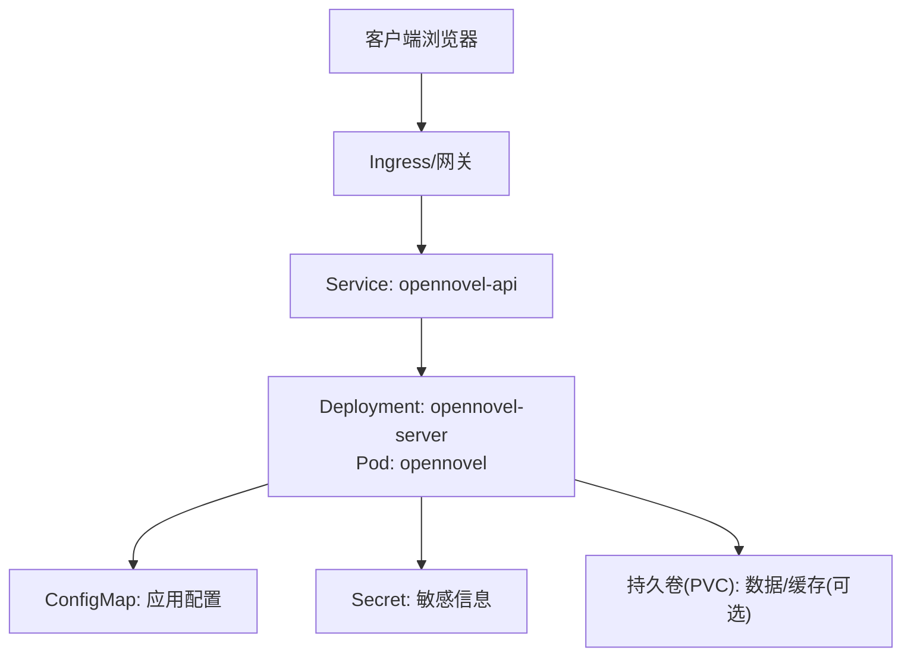
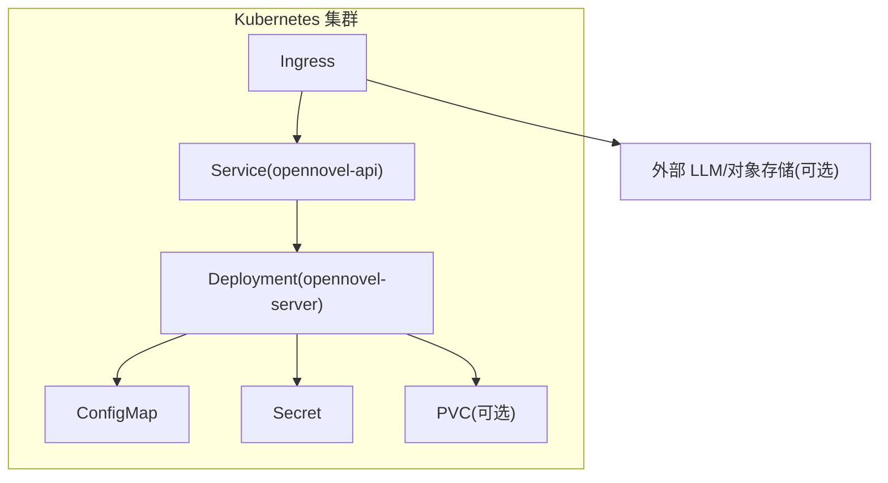
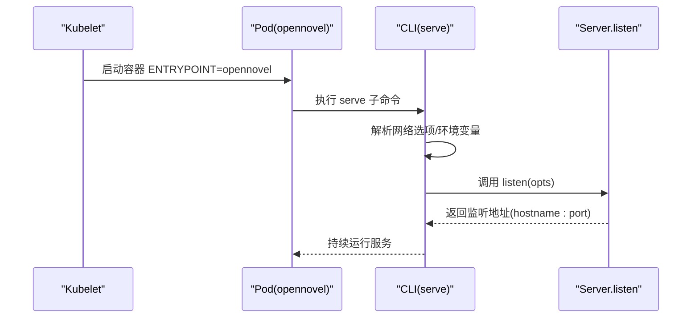
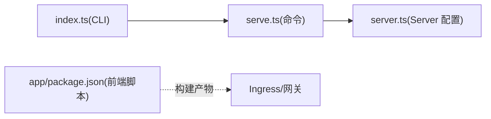

# Kubernetes 部署

<cite>
**本文引用的文件**   
- [README.md](file://README.md)
- [package.json](file://package.json)
- [packages/opencode/Dockerfile](file://packages/opencode/Dockerfile)
- [packages/opencode/src/index.ts](file://packages/opencode/src/index.ts)
- [packages/opencode/src/cli/cmd/serve.ts](file://packages/opencode/src/cli/cmd/serve.ts)
- [packages/core/src/v1/config/server.ts](file://packages/core/src/v1/config/server.ts)
</cite>

## 目录
1. [简介](#简介)
2. [项目结构](#项目结构)
3. [核心组件](#核心组件)
4. [架构总览](#架构总览)
5. [详细组件分析](#详细组件分析)
6. [依赖关系分析](#依赖关系分析)
7. [性能与扩缩容](#性能与扩缩容)
8. [故障排查指南](#故障排查指南)
9. [结论](#结论)
10. [附录：Kubernetes 资源清单模板](#附录kubernetes-资源清单模板)

## 简介
本文件面向在 Kubernetes 上部署 openNovel（基于 Bun 的 monorepo，后端服务由 packages/opencode 提供）的运维与平台工程师。文档覆盖命名空间管理、Deployment/Service/ConfigMap/Secret 配置要点、Ingress 路由与 TLS、HPA 水平扩缩容、滚动更新策略、监控日志集成、故障恢复机制以及云厂商 K8s 集群的常见适配项。内容严格依据仓库中的入口命令、Dockerfile 与服务端配置推导而来，确保可落地执行。

## 项目结构
openNovel 采用 monorepo 组织，关键与 K8s 部署相关的产物与能力如下：
- 后端服务：通过 packages/opencode 提供的 CLI 启动，支持 serve 子命令以无头模式运行 HTTP 服务器。
- 前端静态资源：由 packages/app 构建为静态页面，通常由反向代理或 Ingress 直接分发。
- 容器镜像：packages/opencode/Dockerfile 定义了最终运行镜像，ENTRYPOINT 为 opennovel。
- 端口与网络：默认后端监听 4096，Web UI 开发时 4444；生产环境建议统一由 Ingress/网关暴露。

**章节来源**
- [README.md:34-58](file://README.md#L34-L58)
- [packages/opencode/Dockerfile:1-19](file://packages/opencode/Dockerfile#L1-L19)

## 核心组件
- 后端服务进程：opennovel CLI 的 serve 子命令用于启动无头服务器，内部加载 Server 模块并监听端口。
- 前端静态站点：SolidJS 构建产物，可通过 Nginx/Caddy 或直接由 Ingress 提供。
- 配置与密钥：通过环境变量注入（如 OPENNOVEL_SERVER_PASSWORD），配置文件路径可由环境变量指定。
- 存储：根据业务需要挂载持久卷（例如小说数据、缓存等）。

**章节来源**
- [packages/opencode/src/cli/cmd/serve.ts:1-25](file://packages/opencode/src/cli/cmd/serve.ts#L1-L25)
- [packages/core/src/v1/config/server.ts:1-19](file://packages/core/src/v1/config/server.ts#L1-L19)
- [packages/opencode/src/index.ts:54-79](file://packages/opencode/src/index.ts#L54-L79)

## 架构总览
下图展示了典型的生产部署拓扑：Ingress 负责域名与 TLS 终止，Service 将流量转发到后端 Pod，后端读取 ConfigMap/Secret 完成初始化，必要时访问外部 LLM 或对象存储。

**图示来源**
- [packages/opencode/Dockerfile:1-19](file://packages/opencode/Dockerfile#L1-L19)
- [packages/opencode/src/cli/cmd/serve.ts:1-25](file://packages/opencode/src/cli/cmd/serve.ts#L1-L25)
- [packages/core/src/v1/config/server.ts:1-19](file://packages/core/src/v1/config/server.ts#L1-L19)

## 详细组件分析

### 后端服务（opennovel server）
- 启动方式：通过 CLI 的 serve 子命令启动，内部动态导入 Server.listen 并监听端口。
- 安全提示：若未设置 OPENNOVEL_SERVER_PASSWORD，会输出警告，表明服务未受保护。
- 网络选项：通过 withNetworkOptions 解析端口、主机名等参数。
- 端口与主机：Server 配置支持 port、hostname、CORS 等字段，便于在 K8s 中通过环境变量注入。

**图示来源**
- [packages/opencode/Dockerfile:16-19](file://packages/opencode/Dockerfile#L16-L19)
- [packages/opencode/src/cli/cmd/serve.ts:13-23](file://packages/opencode/src/cli/cmd/serve.ts#L13-L23)
- [packages/core/src/v1/config/server.ts:6-18](file://packages/core/src/v1/config/server.ts#L6-L18)

**章节来源**
- [packages/opencode/src/cli/cmd/serve.ts:1-25](file://packages/opencode/src/cli/cmd/serve.ts#L1-L25)
- [packages/core/src/v1/config/server.ts:1-19](file://packages/core/src/v1/config/server.ts#L1-L19)
- [packages/opencode/src/index.ts:54-79](file://packages/opencode/src/index.ts#L54-L79)

### 前端静态站点
- 构建产物：packages/app 使用 Vite 构建静态资源，生产环境可直接由 Ingress/Nginx 提供。
- 开发端口：本地 dev 默认 4444，生产建议统一走 Ingress。

**章节来源**
- [README.md:44-54](file://README.md#L44-L54)
- [packages/app/package.json:14-21](file://packages/app/package.json#L14-L21)

### 容器镜像
- 基础镜像：Alpine + libgcc/libstdc++/ripgrep。
- 多架构：build-amd64/build-arm64 分别复制对应二进制。
- 运行时：ENTRYPOINT 为 opennovel，BUN_RUNTIME_TRANSPILER_CACHE_PATH 默认关闭以提升冷启动稳定性。

**章节来源**
- [packages/opencode/Dockerfile:1-19](file://packages/opencode/Dockerfile#L1-L19)

## 依赖关系分析
- CLI 入口：packages/opencode/src/index.ts 注册 serve 等命令，并通过 yargs 处理参数与环境变量。
- 服务端：serve 命令动态导入 Server.listen，遵循 Server 配置 schema（port、hostname、CORS 等）。
- 前端：packages/app 构建静态资源，不依赖后端运行时。

**图示来源**
- [packages/opencode/src/index.ts:46-105](file://packages/opencode/src/index.ts#L46-L105)
- [packages/opencode/src/cli/cmd/serve.ts:1-25](file://packages/opencode/src/cli/cmd/serve.ts#L1-L25)
- [packages/core/src/v1/config/server.ts:1-19](file://packages/core/src/v1/config/server.ts#L1-L19)
- [packages/app/package.json:14-21](file://packages/app/package.json#L14-L21)

**章节来源**
- [packages/opencode/src/index.ts:46-105](file://packages/opencode/src/index.ts#L46-L105)
- [packages/opencode/src/cli/cmd/serve.ts:1-25](file://packages/opencode/src/cli/cmd/serve.ts#L1-L25)
- [packages/core/src/v1/config/server.ts:1-19](file://packages/core/src/v1/config/server.ts#L1-L19)

## 性能与扩缩容
- 资源请求与限制：建议在 Deployment 中为 opennovel 容器设置 requests/limits（CPU/Memory），结合 HPA 基于 CPU/内存或自定义指标自动扩缩容。
- 健康检查：实现 /healthz 或 /ready 探针，配合 readinessProbe/livenessProbe 提升可用性。
- 滚动更新：使用 RollingUpdate 策略，设置 maxUnavailable/maxSurge，避免服务中断。
- 连接数与并发：根据 QPS 与平均响应时间调整副本数；对长连接（如 SSE/WebSocket）需关注 Ingress 超时与缓冲配置。

[本节为通用指导，不直接分析具体文件]

## 故障排查指南
- 未设置密码警告：serve 命令在未设置 OPENNOVEL_SERVER_PASSWORD 时会输出警告，生产务必注入该变量。
- 端口冲突：确认 Service/ContainerPort 与 Server 配置的 port 一致，避免端口占用。
- CORS 跨域：通过 Server.cors 配置允许的来源域名，或在 Ingress 层添加相应头部。
- 启动失败：查看 Pod 事件与日志，确认环境变量、ConfigMap/Secret 挂载正确。

**章节来源**
- [packages/opencode/src/cli/cmd/serve.ts:15-17](file://packages/opencode/src/cli/cmd/serve.ts#L15-L17)
- [packages/core/src/v1/config/server.ts:6-18](file://packages/core/src/v1/config/server.ts#L6-L18)

## 结论
openNovel 的后端服务通过 CLI 的 serve 子命令启动，适合以单进程常驻的方式运行于 K8s 中。结合 Ingress、Service、ConfigMap/Secret、HPA 与滚动更新策略，可实现高可用、易扩展、易维护的生产部署。前端静态资源由独立构建产物提供，可与后端同域或分域部署。

[本节为总结性内容，不直接分析具体文件]

## 附录：Kubernetes 资源清单模板
以下为在生产环境中部署 openNovel 的建议资源清单要点（不含具体代码片段，仅描述字段与用途）：

- Namespace
  - 名称：例如 opennovel
  - 标签：team=ai, app=opennovel

- Secret
  - 名称：opennovel-secret
  - 键值：OPENNOVEL_SERVER_PASSWORD（必填）、其他敏感配置（如 LLM API Key、对象存储凭据）

- ConfigMap
  - 名称：opennovel-config
  - 键值：OPENCODE_CONFIG、OPENCODE_CONFIG_DIR、OPENCODE_LOG_LEVEL、OPENCODE_PRINT_LOGS、OPENCODE_PURE 等

- PersistentVolumeClaim（可选）
  - 名称：opennovel-data
  - 容量与存储类：按业务需求设定

- Deployment
  - 名称：opennovel-server
  - 容器镜像：从仓库构建的 opennovel 镜像
  - 环境变量：引用 Secret/ConfigMap
  - 端口：ContainerPort=4096（与 Server 配置一致）
  - 探针：livenessProbe/readinessProbe（/healthz 或 /ready）
  - 资源：requests/limits（CPU/Memory）
  - 策略：rollingUpdate（maxUnavailable=1, maxSurge=1）
  - 副本数：初始 1~2，结合 HPA 自动扩缩容

- Service
  - 名称：opennovel-api
  - 类型：ClusterIP
  - 端口映射：80 -> 4096

- Ingress
  - 名称：opennovel-ingress
  - 规则：*.yourdomain.com -> opennovel-api:80
  - TLS：证书由 Ingress Controller 管理（如 cert-manager），启用 HTTPS

- HorizontalPodAutoscaler
  - 名称：opennovel-hpa
  - 目标：Deployment/opennovel-server
  - 指标：CPU 利用率（如 60%）、内存或自定义指标
  - 范围：minReplicas=1, maxReplicas=10

- NetworkPolicy（可选）
  - 限制入站/出站流量，仅允许 Ingress 控制器与必要的外部服务访问

[本节为通用模板说明，不直接分析具体文件]