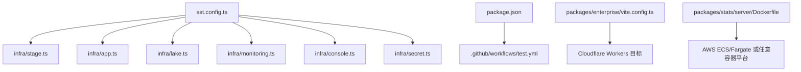
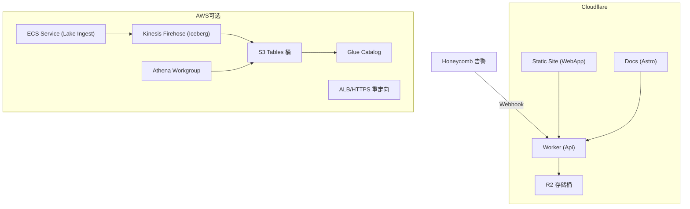
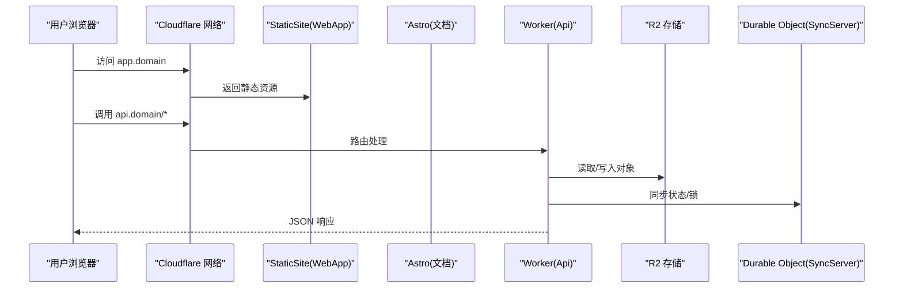
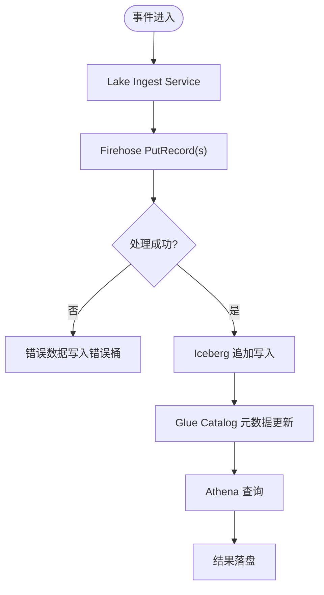
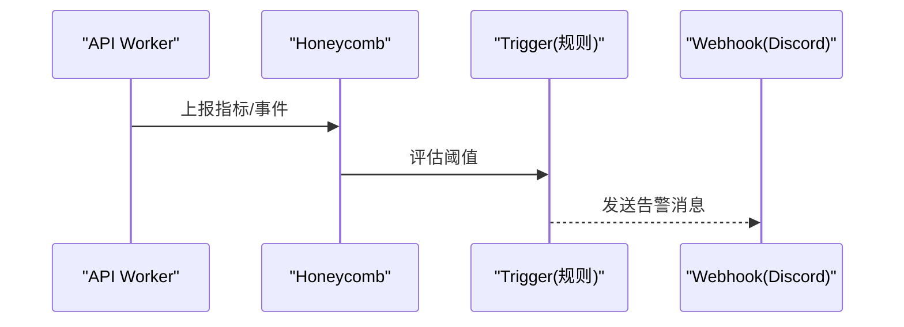
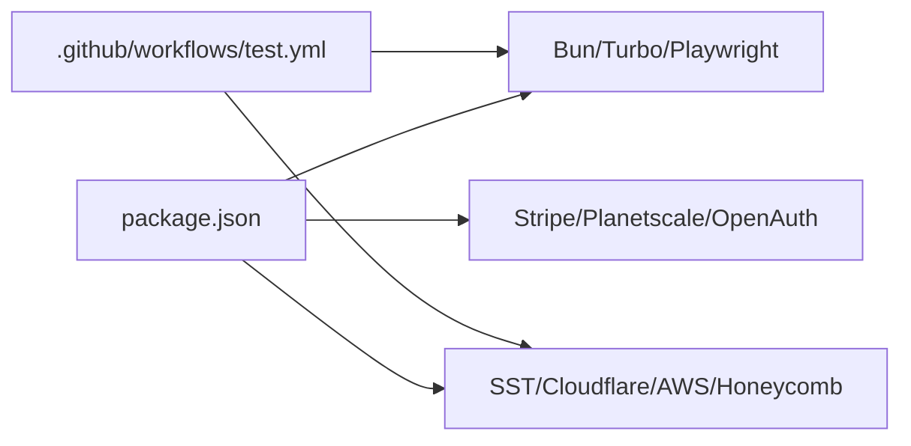

# 云平台部署

<cite>
**本文引用的文件**   
- [sst.config.ts](file://sst.config.ts)
- [package.json](file://package.json)
- [README.md](file://README.md)
- [infra/stage.ts](file://infra/stage.ts)
- [infra/app.ts](file://infra/app.ts)
- [infra/secret.ts](file://infra/secret.ts)
- [infra/lake.ts](file://infra/lake.ts)
- [infra/monitoring.ts](file://infra/monitoring.ts)
- [infra/console.ts](file://infra/console.ts)
- [packages/enterprise/vite.config.ts](file://packages/enterprise/vite.config.ts)
- [packages/core/src/plugin/provider/vercel.ts](file://packages/core/src/plugin/provider/vercel.ts)
- [packages/stats/server/Dockerfile](file://packages/stats/server/Dockerfile)
- [.github/workflows/test.yml](file:.github/workflows/test.yml)
</cite>

## 目录
1. [简介](#简介)
2. [项目结构](#项目结构)
3. [核心组件](#核心组件)
4. [架构总览](#架构总览)
5. [详细组件分析](#详细组件分析)
6. [依赖关系分析](#依赖关系分析)
7. [性能与成本优化](#性能与成本优化)
8. [故障排查指南](#故障排查指南)
9. [结论](#结论)
10. [附录：多云部署与迁移指南](#附录多云部署与迁移指南)

## 简介
本指南面向在主流云平台（AWS、GCP、Azure）以及 Serverless 平台（Vercel、Netlify、Cloudflare Workers）上部署 openNovel 的工程团队。文档基于仓库中的 SST 基础设施定义、包管理与构建脚本、Dockerfile 与 CI 工作流，给出可操作的部署步骤、配置要点、存储/数据库/认证集成方式、成本优化建议与最佳实践，并提供多云策略与迁移路径。

openNovel 是一个基于 Bun 的 monorepo，包含后端服务、Web UI、统计与分析、企业版插件等模块。其默认生产部署目标为 Cloudflare（Workers + R2 + Durable Objects），同时通过 SST 提供 AWS 数据湖与监控能力。

**章节来源**
- [README.md:1-77](file://README.md#L1-L77)

## 项目结构
- 根级 sst.config.ts 定义应用名称、阶段、提供者（AWS、Stripe、Random、Planetscale、Honeycomb）及运行期动态导入的基础设施模块。
- infra/ 下按功能拆分：stage（域名与区域）、app（API Worker、静态站点）、lake（AWS S3 Tables + Firehose + Athena）、monitoring（Honeycomb 告警）、console（日志处理）、secret（密钥管理）。
- packages/ 中关键子包：
  - packages/opencode：后端服务与 CLI
  - packages/app：SolidJS Web UI
  - packages/web：文档站点（Astro）
  - packages/stats：统计服务（含 Dockerfile）
  - packages/enterprise：企业版构建配置（支持 Cloudflare 目标）
- .github/workflows：测试与类型检查流水线，使用 Node 24 与 Bun。

**图表来源**
- [sst.config.ts:1-54](file://sst.config.ts#L1-L54)
- [infra/stage.ts:1-41](file://infra/stage.ts#L1-L41)
- [infra/app.ts:1-70](file://infra/app.ts#L1-L70)
- [infra/lake.ts:1-332](file://infra/lake.ts#L1-L332)
- [infra/monitoring.ts:1-288](file://infra/monitoring.ts#L1-L288)
- [infra/console.ts:228-246](file://infra/console.ts#L228-L246)
- [infra/secret.ts:1-16](file://infra/secret.ts#L1-L16)
- [packages/enterprise/vite.config.ts:1-37](file://packages/enterprise/vite.config.ts#L1-L37)
- [packages/stats/server/Dockerfile:1-33](file://packages/stats/server/Dockerfile#L1-L33)
- [.github/workflows/test.yml:1-152](file:.github/workflows/test.yml#L1-L152)

**章节来源**
- [sst.config.ts:1-54](file://sst.config.ts#L1-L54)
- [package.json:1-162](file://package.json#L1-L162)
- [README.md:60-77](file://README.md#L60-L77)

## 核心组件
- 应用与阶段：sst.config.ts 定义 name、removal、protect、home（cloudflare）与 providers（aws、stripe、random、planetscale、honeycomb）。
- 域名与 DNS：infra/stage.ts 根据 stage 输出 domain/shortDomain，并创建 Cloudflare 区域主机名与特定 TXT/CNAME 记录。
- API 与静态站点：infra/app.ts 定义 Cloudflare Worker（Api）、Astro 文档站点（docs.*）与 StaticSite（app.*），并通过环境变量注入 API 地址。
- 数据湖（AWS）：infra/lake.ts 创建 S3 Tables Bucket、Glue Catalog、Athena Workgroup、Kinesis Firehose（Iceberg 写入）、ECS Service 与负载均衡器，暴露 lake 入口 URL 与 Secret。
- 监控与告警：infra/monitoring.ts 基于 Honeycomb 定义多类触发器（模型 HTTP 错误、低 TPS、提供商错误、免费额度请求激增），通过 Webhook 通知 Discord。
- 控制台与日志：infra/console.ts 定义 LogProcessor Worker，链接 Honeycomb 与 lake 摄取端点。
- 密钥管理：infra/secret.ts 集中声明 R2、Honeycomb、Support、Upstash Redis 等 Secret 与随机密码。

**章节来源**
- [sst.config.ts:1-54](file://sst.config.ts#L1-L54)
- [infra/stage.ts:1-41](file://infra/stage.ts#L1-L41)
- [infra/app.ts:1-70](file://infra/app.ts#L1-L70)
- [infra/lake.ts:1-332](file://infra/lake.ts#L1-L332)
- [infra/monitoring.ts:1-288](file://infra/monitoring.ts#L1-L288)
- [infra/console.ts:228-246](file://infra/console.ts#L228-L246)
- [infra/secret.ts:1-16](file://infra/secret.ts#L1-L16)

## 架构总览
下图展示默认 Cloudflare 为主的前后端与对象存储，以及可选的 AWS 数据湖与监控链路。

**图表来源**
- [infra/app.ts:1-70](file://infra/app.ts#L1-L70)
- [infra/lake.ts:1-332](file://infra/lake.ts#L1-L332)
- [infra/monitoring.ts:1-288](file://infra/monitoring.ts#L1-L288)

## 详细组件分析

### Cloudflare 原生部署（默认）
- API Worker：通过 sst.cloudflare.Worker 定义，绑定 R2、Secrets、Durable Object（SyncServer），启用 logpush，并在非特定 stage 下注入 SYNC_SERVER 绑定。
- 静态站点：SST StaticSite 构建 packages/app，输出到 dist；Astro 站点用于 docs。
- 域名：api.domain、app.domain、docs.domain 由 app.ts 与 stage.ts 组合生成。
- 环境变量：WEB_DOMAIN、VITE_API_URL 等注入前端构建。

**图表来源**
- [infra/app.ts:1-70](file://infra/app.ts#L1-L70)
- [infra/stage.ts:1-41](file://infra/stage.ts#L1-L41)

**章节来源**
- [infra/app.ts:1-70](file://infra/app.ts#L1-L70)
- [infra/stage.ts:1-41](file://infra/stage.ts#L1-L41)

### AWS 数据湖与摄取（可选）
- S3 Tables + Glue Catalog：作为 Iceberg 表存储，Firehose 以 append-only 模式写入。
- Athena Workgroup：限制单次查询扫描上限，结果落盘至独立 Bucket。
- Firehose：将事件写入 Iceberg，失败数据回退到错误 Bucket。
- Lake Ingest Service：ECS Service，带自动扩缩容与健康检查，对外暴露 HTTPS 入口。
- 权限：最小化 IAM 策略，仅授予必要操作。

**图表来源**
- [infra/lake.ts:1-332](file://infra/lake.ts#L1-L332)

**章节来源**
- [infra/lake.ts:1-332](file://infra/lake.ts#L1-L332)

### 监控与告警（Honeycomb）
- 触发器：模型 HTTP 错误率、低 TPS、提供商错误、免费额度请求激增。
- 通知：Webhook 推送至 Discord，附带类型变量。
- 计算字段：避免名称冲突导致的陈旧缓存问题。

**图表来源**
- [infra/monitoring.ts:1-288](file://infra/monitoring.ts#L1-L288)

**章节来源**
- [infra/monitoring.ts:1-288](file://infra/monitoring.ts#L1-L288)

### 控制台与日志处理
- LogProcessor Worker：链接 Honeycomb 与 lake 摄取端点，处理日志流。
- 相关 Secret：HoneycombApiKey、HoneycombWebhookSecret、SupportApiKey、UpstashRedis 等。

**章节来源**
- [infra/console.ts:228-246](file://infra/console.ts#L228-L246)
- [infra/secret.ts:1-16](file://infra/secret.ts#L1-L16)

### Vercel 集成（AI SDK 插件）
- VercelPlugin：对 @ai-sdk/vercel 的请求头进行统一注入（referers/title），并创建 SDK 实例。
- 适用场景：在 Vercel 环境中使用 AI SDK 时，确保请求头合规与 SDK 初始化正确。

**章节来源**
- [packages/core/src/plugin/provider/vercel.ts:1-27](file://packages/core/src/plugin/provider/vercel.ts#L1-L27)

### 企业版构建目标（Cloudflare）
- vite.config.ts 支持 OPENCODE_DEPLOYMENT_TARGET=cloudflare，启用 Nitro Cloudflare Module 预设与 nodeCompat。
- 便于在企业版应用中直接构建为 Cloudflare 兼容产物。

**章节来源**
- [packages/enterprise/vite.config.ts:1-37](file://packages/enterprise/vite.config.ts#L1-L37)

### 统计服务容器化（Docker）
- 多阶段构建：基础镜像 oven/bun:1.3.14-alpine，裁剪依赖，冻结安装，最终运行 src/server.ts。
- 端口：3000，适合部署到任意容器编排平台（ECS、GKE、AKS 等）。

**章节来源**
- [packages/stats/server/Dockerfile:1-33](file://packages/stats/server/Dockerfile#L1-L33)

## 依赖关系分析
- 运行时与工具链：Bun 1.3.14、Node 24（CI）、Turbo、Playwright（E2E）。
- 基础设施：SST 4.x、Cloudflare Workers/R2/Astro、AWS（S3 Tables、Glue、Athena、Firehose、ECS）、Honeycomb。
- 第三方：Stripe（支付）、Planetscale（数据库，已声明 provider）、OpenAuth（认证，已在 catalog 中引入）。

**图表来源**
- [package.json:1-162](file://package.json#L1-L162)
- [.github/workflows/test.yml:1-152](file:.github/workflows/test.yml#L1-L152)

**章节来源**
- [package.json:1-162](file://package.json#L1-L162)
- [.github/workflows/test.yml:1-152](file:.github/workflows/test.yml#L1-L152)

## 性能与成本优化
- 数据湖查询保护：Athena Workgroup 设置 bytesScannedCutoffPerQuery，防止回归导致高额费用。
- 自动扩缩容：Lake Ingest Service 设置 min/max 与 CPU/Memory 利用率阈值，按需伸缩。
- 构建优化：Docker 多阶段与 pruned workspace，减少镜像体积与安装时间。
- 冷启动与缓存：Cloudflare Workers 天然边缘缓存；必要时开启 logpush 与缓存控制。
- 监控与限流：Honeycomb 触发器及时发现问题；对免费额度请求激增设置告警。

[本节为通用指导，不直接分析具体文件]

## 故障排查指南
- 域名与 DNS：确认 stage.ts 生成的 domain/shortDomain 与 Cloudflare 区域记录一致。
- Worker 绑定：检查 app.ts 中 link 列表是否包含所有 Secret、Bucket、Durable Object。
- 数据湖写入：验证 Firehose 角色权限、Iceberg 配置、错误桶写入路径。
- 监控告警：核对 HoneycombApiKey、WebhookSecret 是否正确注入。
- 容器健康检查：ECS Service 的 health 命令与就绪探针需可达。

**章节来源**
- [infra/stage.ts:1-41](file://infra/stage.ts#L1-L41)
- [infra/app.ts:1-70](file://infra/app.ts#L1-L70)
- [infra/lake.ts:1-332](file://infra/lake.ts#L1-L332)
- [infra/monitoring.ts:1-288](file://infra/monitoring.ts#L1-L288)

## 结论
openNovel 的默认部署以 Cloudflare 为核心，配合 SST 快速交付 API、静态站点与对象存储；可选的 AWS 数据湖与 Honeycomb 监控为大规模分析与可观测性提供支撑。通过容器化统计服务，可在任意云平台的容器环境运行。结合本文的多云策略与迁移指南，团队可按需扩展与迁移。

[本节为总结性内容，不直接分析具体文件]

## 附录：多云部署与迁移指南

### AWS 部署要点
- 身份与区域：sst.config.ts 中 aws.provider 指定版本、region、profile（区分 dev/production）。
- 数据湖：S3 Tables + Glue + Athena + Firehose + ECS Service，详见 lake.ts。
- 监控：Honeycomb 触发器与 Webhook，详见 monitoring.ts。
- 容器：stats server 提供 Dockerfile，可直接部署到 ECS/Fargate 或 EKS。

**章节来源**
- [sst.config.ts:1-54](file://sst.config.ts#L1-L54)
- [infra/lake.ts:1-332](file://infra/lake.ts#L1-L332)
- [infra/monitoring.ts:1-288](file://infra/monitoring.ts#L1-L288)
- [packages/stats/server/Dockerfile:1-33](file://packages/stats/server/Dockerfile#L1-L33)

### GCP 部署要点
- 当前 SST 未显式声明 GCP provider，可通过以下方式适配：
  - 将 API Worker 与静态站点迁移至 Cloudflare（保持现有 SST 配置不变）。
  - 将统计服务容器化后部署到 GKE 或 Cloud Run。
  - 使用 Upstash Redis（已在 secret.ts 中声明）作为缓存/会话存储。
- 如需原生 GCP 数据层，可将 lake.ts 替换为 BigQuery + Dataflow 方案（需自定义 SST 模块）。

[本节为概念性指导，不直接分析具体文件]

### Azure 部署要点
- 模型提供方：仓库文档包含 Azure OpenAI 与 Azure Cognitive Services 的配置说明，需在环境变量中设置 AZURE_RESOURCE_NAME 并选择模型。
- 应用部署：可将 API Worker 与静态站点托管于 Cloudflare；统计服务容器化后部署到 AKS 或 Azure Container Apps。
- 存储与缓存：可使用 Azure Blob Storage 替代 R2（需改造对象存储客户端），或使用 Upstash Redis。

**章节来源**
- [packages/web/src/content/docs/providers.mdx:417-468](file://packages/web/src/content/docs/providers.mdx#L417-L468)

### Serverless 平台集成（Vercel、Netlify、Cloudflare）
- Vercel：通过 VercelPlugin 注入请求头并初始化 @ai-sdk/vercel SDK。
- Netlify：可作为静态站点托管（packages/app 构建产物），API 建议走 Cloudflare Worker 或自建函数。
- Cloudflare：默认目标，使用 Workers、R2、Durable Objects、Astro。

**章节来源**
- [packages/core/src/plugin/provider/vercel.ts:1-27](file://packages/core/src/plugin/provider/vercel.ts#L1-L27)
- [infra/app.ts:1-70](file://infra/app.ts#L1-L70)

### 存储、数据库与认证服务配置
- 对象存储：R2（默认）；若切换至其他云，需替换客户端与凭证。
- 数据库：Planetscale provider 已声明，可用于 MySQL 兼容存储；也可使用 Upstash Redis（secret.ts）。
- 认证：OpenAuth 已在 catalog 中引入，可按需接入。

**章节来源**
- [sst.config.ts:1-54](file://sst.config.ts#L1-L54)
- [infra/secret.ts:1-16](file://infra/secret.ts#L1-L16)

### 成本优化与最佳实践
- 限制 Athena 扫描量，避免意外高消费。
- 使用最小权限原则配置 IAM/Secrets。
- 利用边缘缓存与 CDN 降低回源成本。
- 按需扩缩容与设置健康检查，避免闲置资源。
- 监控告警提前发现异常与滥用。

[本节为通用指导，不直接分析具体文件]

### 多云迁移策略
- 分层解耦：API（Cloudflare Workers）、静态站点（SST StaticSite/Astro）、数据湖（AWS）、监控（Honeycomb）彼此松耦合。
- 渐进替换：先容器化统计服务，再逐步替换对象存储与数据库，最后迁移 API 到目标平台。
- 配置外置：所有敏感信息通过 SST Secret 与环境变量管理，便于跨平台复用。
- 灰度发布：按 stage 划分环境，逐步放量与回滚。

[本节为概念性指导，不直接分析具体文件]