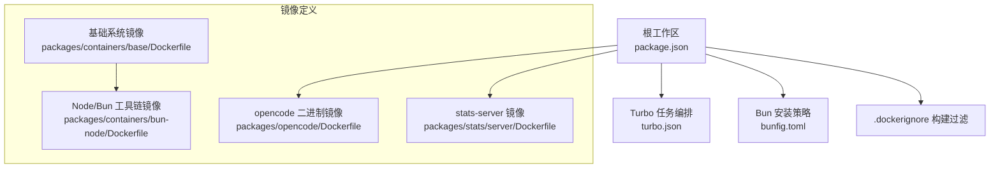
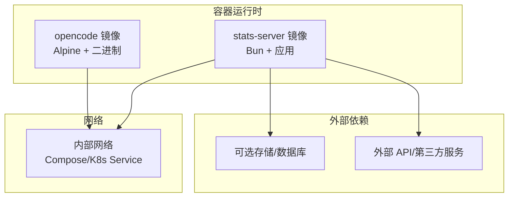
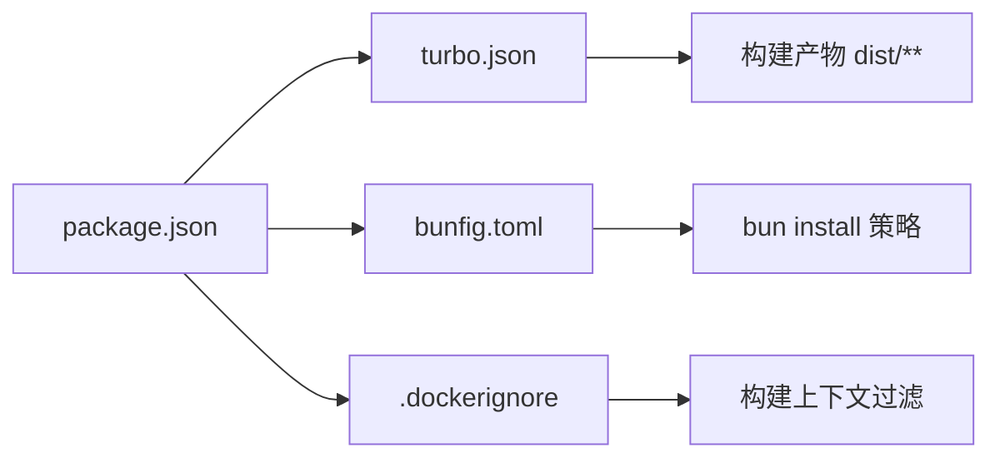

# 容器化部署

<cite>
**本文引用的文件**
- [packages/opencode/Dockerfile](file://packages/opencode/Dockerfile)
- [packages/containers/base/Dockerfile](file://packages/containers/base/Dockerfile)
- [packages/containers/bun-node/Dockerfile](file://packages/containers/bun-node/Dockerfile)
- [packages/stats/server/Dockerfile](file://packages/stats/server/Dockerfile)
- [.dockerignore](file://.dockerignore)
- [package.json](file://package.json)
- [turbo.json](file://turbo.json)
- [bunfig.toml](file://bunfig.toml)
- [sst.config.ts](file://sst.config.ts)
</cite>

## 目录
1. [简介](#简介)
2. [项目结构](#项目结构)
3. [核心组件](#核心组件)
4. [架构总览](#架构总览)
5. [详细组件分析](#详细组件分析)
6. [依赖关系分析](#依赖关系分析)
7. [性能与镜像优化](#性能与镜像优化)
8. [编排与部署](#编排与部署)
9. [健康检查、资源限制与扩缩容](#健康检查资源限制与扩缩容)
10. [云平台部署指南](#云平台部署指南)
11. [故障排查](#故障排查)
12. [结论](#结论)

## 简介
本文件面向 openNovel 的容器化部署，覆盖 Docker 多阶段构建、镜像体积控制、Docker Compose 编排、Kubernetes 清单（Deployment、Service、ConfigMap、Secret）以及 AWS/GCP/Azure 的部署要点。同时提供健康检查、资源限制与自动扩缩容策略建议，帮助在生产环境稳定运行。

## 项目结构
仓库采用多包工作区（Bun + Turbo），包含多个可独立构建与运行的子应用。与容器化直接相关的核心文件包括：
- 二进制应用镜像：packages/opencode/Dockerfile
- 统计服务镜像：packages/stats/server/Dockerfile
- 基础镜像与工具链：packages/containers/base/Dockerfile、packages/containers/bun-node/Dockerfile
- 构建缓存与工作区配置：turbo.json、bunfig.toml、package.json
- 构建忽略规则：.dockerignore
- 基础设施与平台配置：sst.config.ts



**图表来源**
- [package.json:1-162](file://package.json#L1-L162)
- [turbo.json:1-34](file://turbo.json#L1-L34)
- [bunfig.toml:1-9](file://bunfig.toml#L1-L9)
- [.dockerignore:1-13](file://.dockerignore#L1-L13)
- [packages/opencode/Dockerfile:1-19](file://packages/opencode/Dockerfile#L1-L19)
- [packages/stats/server/Dockerfile:1-33](file://packages/stats/server/Dockerfile#L1-L33)
- [packages/containers/base/Dockerfile:1-19](file://packages/containers/base/Dockerfile#L1-L19)
- [packages/containers/bun-node/Dockerfile:1-25](file://packages/containers/bun-node/Dockerfile#L1-L25)

**章节来源**
- [package.json:1-162](file://package.json#L1-L162)
- [turbo.json:1-34](file://turbo.json#L1-L34)
- [bunfig.toml:1-9](file://bunfig.toml#L1-L9)
- [.dockerignore:1-13](file://.dockerignore#L1-L13)

## 核心组件
- opencode 二进制镜像：基于 Alpine，按 TARGETARCH 选择 amd64/arm64 预编译二进制，最小运行时依赖。
- stats-server 镜像：基于 oven/bun:alpine，使用多阶段构建（pruner/installer/runner），仅打包生产所需依赖并冻结安装。
- 基础镜像：Ubuntu 24.04 作为通用基础层；bun-node 镜像集成 Node 与 Bun 工具链，便于构建期使用。

关键特性：
- 多阶段构建隔离构建环境与运行环境，显著减小镜像体积。
- 使用 .dockerignore 排除 node_modules、dist、.turbo 等无关文件，提升构建缓存命中率。
- 通过环境变量禁用不必要的运行时缓存，适配无状态容器场景。

**章节来源**
- [packages/opencode/Dockerfile:1-19](file://packages/opencode/Dockerfile#L1-L19)
- [packages/stats/server/Dockerfile:1-33](file://packages/stats/server/Dockerfile#L1-L33)
- [packages/containers/base/Dockerfile:1-19](file://packages/containers/base/Dockerfile#L1-L19)
- [packages/containers/bun-node/Dockerfile:1-25](file://packages/containers/bun-node/Dockerfile#L1-L25)
- [.dockerignore:1-13](file://.dockerignore#L1-L13)

## 架构总览
openNovel 在容器化后通常由两类镜像组成：
- 客户端/CLI 二进制镜像（opencode）：用于本地或服务器端执行命令与交互。
- 统计服务镜像（stats-server）：提供统计与遥测能力，暴露 HTTP 端口。



[此图为概念性架构图，不映射具体源码文件]

## 详细组件分析

### opencode 二进制镜像
- 基础镜像：Alpine，精简且安全。
- 多架构支持：通过 ARG TARGETARCH 选择 amd64 或 arm64 的二进制路径。
- 运行时：ENTRYPOINT 直接执行 opennovel 二进制，无需 Node/Bun 运行时。
- 环境变量：默认关闭运行时转译缓存，适合短生命周期容器。

```mermaid
flowchart TD
Start(["构建入口"]) --> Base["FROM alpine AS base"]
Base --> Env["设置 BUN_RUNTIME_TRANSPILER_CACHE_PATH=0"]
Env --> Install["安装 libgcc/libstdc++/ripgrep"]
Install --> Arch{"TARGETARCH"}
Arch --> |amd64| CopyAMD["COPY dist/opennovel-linux-x64-musl/bin/opennovel"]
Arch --> |arm64| CopyARM["COPY dist/opennovel-linux-arm64-musl/bin/opennovel"]
CopyAMD --> Entrypoint["ENTRYPOINT [\"opennovel\"]"]
CopyARM --> Entrypoint
Entrypoint --> End(["镜像完成"])
```

**图表来源**
- [packages/opencode/Dockerfile:1-19](file://packages/opencode/Dockerfile#L1-L19)

**章节来源**
- [packages/opencode/Dockerfile:1-19](file://packages/opencode/Dockerfile#L1-L19)

### stats-server 镜像（多阶段构建）
- 阶段一 pruner：使用 turbo prune 裁剪依赖树，输出最小依赖集合。
- 阶段二 installer：刷新 workspaces 元数据，生成 lockfile 并执行 --frozen-lockfile 生产安装。
- 阶段三 runner：仅复制必要产物，暴露 3000 端口，以 bun 启动 server.ts。

```mermaid
flowchart TD
PStart(["pruner 阶段"]) --> CopySrc["复制源码到 /app"]
CopySrc --> Prune["bunx turbo prune @opencode-ai/stats-server"]
Prune --> OutJSON["产出 out/json/ 依赖清单"]
OutJSON --> IStart(["installer 阶段"])
IStart --> CopyJSON["COPY --from=pruner /app/out/json/ ./"]
CopyJSON --> FixWS["修正 workspaces.packages 列表"]
FixWS --> GenLock["删除 bun.lock 并生成只读锁"]
GenLock --> InstallProd["bun install --filter ... --frozen-lockfile --production"]
InstallProd --> RStart(["runner 阶段"])
RStart --> CopyApp["COPY --from=installer /app ./"]
CopyApp --> CopyFull["COPY --from=pruner /app/out/full/ ./"]
CopyFull --> Expose["EXPOSE 3000"]
Expose --> CMD["CMD [\"bun\", \"src/server.ts\"]"]
```

**图表来源**
- [packages/stats/server/Dockerfile:1-33](file://packages/stats/server/Dockerfile#L1-L33)

**章节来源**
- [packages/stats/server/Dockerfile:1-33](file://packages/stats/server/Dockerfile#L1-L33)

### 基础镜像与工具链
- base：Ubuntu 24.04 安装常用构建工具与压缩工具，清理 apt 缓存。
- bun-node：从官方源下载指定版本 Node 与 Bun，启用 corepack，统一构建环境。

**章节来源**
- [packages/containers/base/Dockerfile:1-19](file://packages/containers/base/Dockerfile#L1-L19)
- [packages/containers/bun-node/Dockerfile:1-25](file://packages/containers/bun-node/Dockerfile#L1-L25)

## 依赖关系分析
- 工作区与包管理：package.json 声明了工作区与依赖，bunfig.toml 锁定安装行为与测试根目录。
- 任务编排：turbo.json 定义了 typecheck、build 等任务及输出目录。
- 构建忽略：.dockerignore 排除 node_modules、dist、.turbo、.vite、coverage 等，避免污染上下文。



**图表来源**
- [package.json:1-162](file://package.json#L1-L162)
- [turbo.json:1-34](file://turbo.json#L1-L34)
- [bunfig.toml:1-9](file://bunfig.toml#L1-L9)
- [.dockerignore:1-13](file://.dockerignore#L1-L13)

**章节来源**
- [package.json:1-162](file://package.json#L1-L162)
- [turbo.json:1-34](file://turbo.json#L1-L34)
- [bunfig.toml:1-9](file://bunfig.toml#L1-L9)
- [.dockerignore:1-13](file://.dockerignore#L1-L13)

## 性能与镜像优化
- 多阶段构建：将构建依赖与运行环境分离，显著降低镜像大小。
- 依赖裁剪：使用 turbo prune 与 --filter 仅安装目标包依赖。
- 冻结安装：--frozen-lockfile 确保可重复构建，减少安装开销。
- 禁用运行时缓存：BUN_RUNTIME_TRANSPILER_CACHE_PATH=0 避免在临时容器中维护无用缓存。
- 构建上下文过滤：.dockerignore 排除大型目录，提高缓存命中与构建速度。

**章节来源**
- [packages/stats/server/Dockerfile:1-33](file://packages/stats/server/Dockerfile#L1-L33)
- [packages/opencode/Dockerfile:1-19](file://packages/opencode/Dockerfile#L1-L19)
- [.dockerignore:1-13](file://.dockerignore#L1-L13)

## 编排与部署

### Docker Compose 编排建议
- 服务划分：
  - app：运行 opencode 二进制镜像（命令行/服务端模式）。
  - stats：运行 stats-server 镜像，暴露 3000 端口。
- 网络设置：
  - 使用自定义 bridge 网络隔离服务间通信。
  - 通过环境变量注入外部依赖地址（如数据库、对象存储、API 密钥）。
- 数据持久化：
  - 为 stats 服务挂载卷保存日志或指标数据。
- 健康检查：
  - 对 stats 服务增加 HTTP 健康检查探针。
- 示例要点（描述性）：
  - 定义 services.app/image 指向 opencode 镜像。
  - 定义 services.stats/image 指向 stats-server 镜像。
  - 定义 networks 与 volumes。
  - 在 stats 中配置 healthcheck 与 ports。

[本节为概念性编排说明，未直接引用具体 compose 文件]

### Kubernetes 部署清单要点
- Deployment：
  - replicas：根据负载设定初始副本数。
  - resources：设置 requests/limits 保障稳定性。
  - env：注入配置与密钥（通过 ConfigMap/Secret）。
- Service：
  - ClusterIP/LoadBalancer 暴露 stats-server 服务。
- ConfigMap：
  - 存放非敏感配置（如服务端口、日志级别）。
- Secret：
  - 存放敏感信息（如 API Key、数据库密码）。
- 健康检查：
  - livenessProbe/readinessProbe 基于 HTTP 或 TCP 探测。
- 扩缩容：
  - HorizontalPodAutoscaler 基于 CPU/内存或自定义指标调整副本数。

[本节为概念性清单说明，未直接引用具体 YAML 文件]

## 健康检查、资源限制与扩缩容
- 健康检查：
  - stats-server：HTTP GET /health 或 /ready，返回 2xx 表示就绪。
  - opencode：若以服务形式运行，提供 /health 或 /version 接口；否则通过进程存活判断。
- 资源限制：
  - requests：保证调度与最低资源。
  - limits：防止资源争用与 OOM。
- 扩缩容策略：
  - HPA：CPU > 60% 或内存 > 70% 时扩容；低负载时缩容。
  - 针对突发流量，结合队列与限流保护后端。

[本节为通用实践说明，未直接引用具体源码文件]

## 云平台部署指南

### AWS
- 容器注册表：使用 ECR 推送镜像。
- 计算平台：EKS（Kubernetes）或 ECS（Fargate）。
- 配置管理：使用 Secrets Manager 或 SSM Parameter Store 注入敏感配置。
- 存储：EFS/EBS 持久化数据；S3 作为对象存储。
- 监控：CloudWatch 与 OpenTelemetry 集成。

[本节为通用云实践说明，未直接引用具体源码文件]

### GCP
- 容器注册表：Artifact Registry。
- 计算平台：GKE。
- 配置管理：Secret Manager。
- 存储：Cloud SQL/Cloud Spanner 与 Cloud Storage。
- 监控：Cloud Monitoring 与 Logging。

[本节为通用云实践说明，未直接引用具体源码文件]

### Azure
- 容器注册表：ACR。
- 计算平台：AKS。
- 配置管理：Key Vault。
- 存储：Azure Files/Disks 与 Blob Storage。
- 监控：Azure Monitor 与 Application Insights。

[本节为通用云实践说明，未直接引用具体源码文件]

## 故障排查
- 构建失败：
  - 检查 .dockerignore 是否误排必要文件。
  - 确认 turbo prune 与 --filter 参数是否正确。
  - 验证 bun.lock 与 package.json 一致性。
- 运行异常：
  - 检查环境变量是否注入正确（如 OPENCODE_CONFIG_DIR、端口、外部 API 地址）。
  - 查看容器日志与探针状态。
- 镜像过大：
  - 确认多阶段构建是否生效。
  - 移除构建期工具与调试依赖。
  - 使用更小的基础镜像（如 Alpine）。

**章节来源**
- [.dockerignore:1-13](file://.dockerignore#L1-L13)
- [packages/stats/server/Dockerfile:1-33](file://packages/stats/server/Dockerfile#L1-L33)
- [packages/opencode/Dockerfile:1-19](file://packages/opencode/Dockerfile#L1-L19)

## 结论
通过多阶段构建、依赖裁剪与严格的环境隔离，openNovel 的容器镜像具备高可移植性与小体积优势。配合合理的编排与 K8s 资源配置，可在主流云平台稳定运行并弹性伸缩。建议在 CI/CD 中固化镜像构建与扫描流程，持续优化镜像质量与安全性。