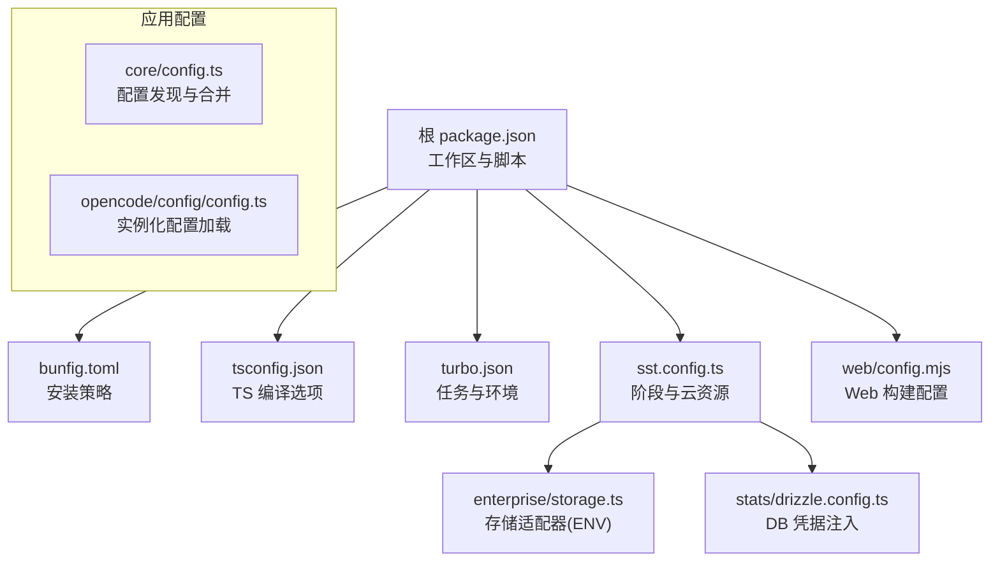
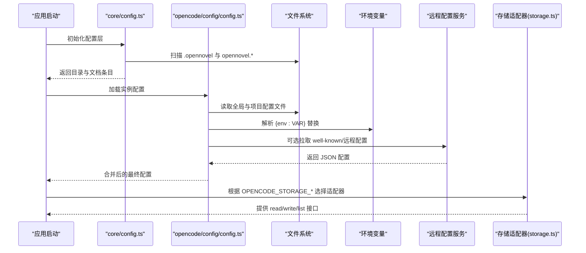
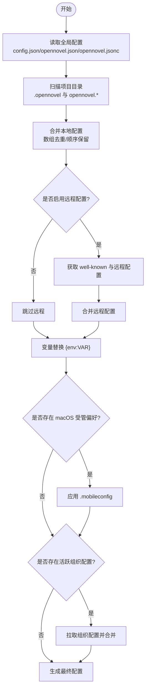
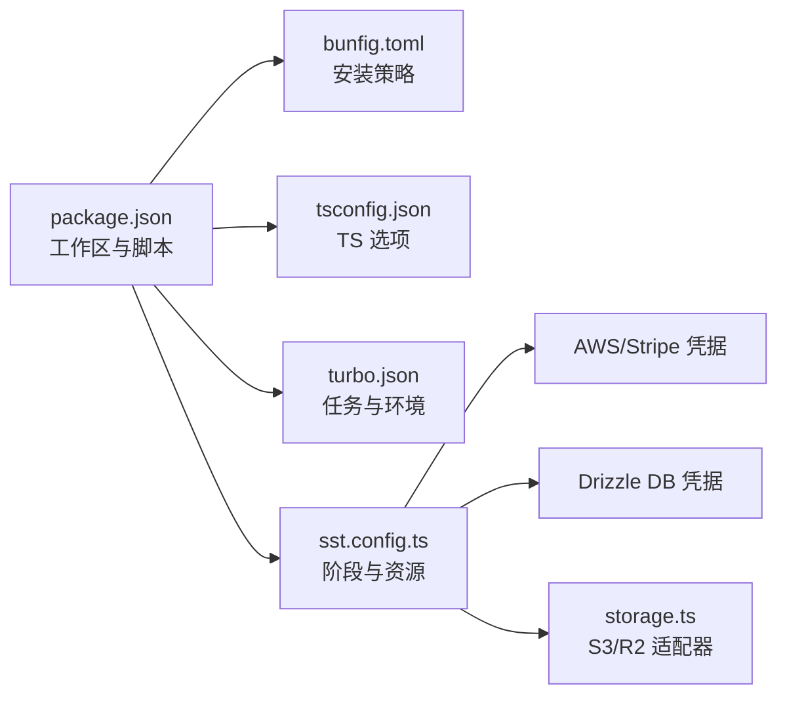

# 环境配置

<cite>
**本文引用的文件**   
- [package.json](file://package.json)
- [bunfig.toml](file://bunfig.toml)
- [tsconfig.json](file://tsconfig.json)
- [turbo.json](file://turbo.json)
- [sst.config.ts](file://sst.config.ts)
- [packages/core/src/config.ts](file://packages/core/src/config.ts)
- [packages/opencode/src/config/config.ts](file://packages/opencode/src/config/config.ts)
- [packages/enterprise/src/core/storage.ts](file://packages/enterprise/src/core/storage.ts)
- [packages/stats/core/drizzle.config.ts](file://packages/stats/core/drizzle.config.ts)
- [packages/web/config.mjs](file://packages/web/config.mjs)
</cite>

## 目录
1. [简介](#简介)
2. [项目结构](#项目结构)
3. [核心组件](#核心组件)
4. [架构总览](#架构总览)
5. [详细组件分析](#详细组件分析)
6. [依赖关系分析](#依赖关系分析)
7. [性能考虑](#性能考虑)
8. [故障排除指南](#故障排除指南)
9. [结论](#结论)
10. [附录](#附录)

## 简介
本文件为 openNovel 的环境配置权威指南，覆盖开发环境与生产环境的差异、Bun 运行时与包管理、TypeScript 编译选项、环境变量（数据库、AI 提供商、存储等）、配置文件结构与优先级规则，以及本地、测试、预生产与生产的部署示例。文档同时提供配置校验与故障排除建议，帮助在不同环境中稳定运行。

## 项目结构
openNovel 采用多包仓库结构，根级配置统一由 Bun、Turbo、SST 与 TypeScript 协同管理：
- 包管理与脚本：根 package.json 定义工作区、脚本与依赖版本目录（catalog）。
- Bun 安装策略：bunfig.toml 控制精确版本与最小发布年龄。
- TypeScript：tsconfig.json 继承 @tsconfig/bun，并设置 JSX 来源。
- 任务编排：turbo.json 定义全局环境变量与任务行为。
- 云基础设施：sst.config.ts 管理阶段、AWS/Stripe 等提供者与资源注入。
- 应用配置加载：packages/core/src/config.ts 与 packages/opencode/src/config/config.ts 实现配置发现、合并与变量替换。
- 存储后端：packages/enterprise/src/core/storage.ts 通过环境变量选择 S3/R2 适配器。
- 统计数据库迁移：packages/stats/core/drizzle.config.ts 使用 SST 资源注入连接信息。
- Web 构建配置：packages/web/config.mjs 用于前端构建期配置。

**图表来源** 
- [package.json:1-162](file://package.json#L1-L162)
- [bunfig.toml:1-9](file://bunfig.toml#L1-L9)
- [tsconfig.json:1-8](file://tsconfig.json#L1-L8)
- [turbo.json:1-34](file://turbo.json#L1-L34)
- [sst.config.ts:1-54](file://sst.config.ts#L1-L54)
- [packages/core/src/config.ts:1-228](file://packages/core/src/config.ts#L1-L228)
- [packages/opencode/src/config/config.ts:1-682](file://packages/opencode/src/config/config.ts#L1-L682)
- [packages/enterprise/src/core/storage.ts:40-129](file://packages/enterprise/src/core/storage.ts#L40-L129)
- [packages/stats/core/drizzle.config.ts:1-21](file://packages/stats/core/drizzle.config.ts#L1-L21)
- [packages/web/config.mjs](file://packages/web/config.mjs)

**章节来源**
- [package.json:1-162](file://package.json#L1-L162)
- [bunfig.toml:1-9](file://bunfig.toml#L1-L9)
- [tsconfig.json:1-8](file://tsconfig.json#L1-L8)
- [turbo.json:1-34](file://turbo.json#L1-L34)
- [sst.config.ts:1-54](file://sst.config.ts#L1-L54)

## 核心组件
- 包管理与脚本
  - 工作区包含 packages/* 及 console、stats、sdk/js、slack 等子包。
  - 常用脚本：dev、dev:desktop、dev:web、typecheck、lint、postinstall 等。
  - 依赖版本通过 catalog 统一管理，overrides 与 patchedDependencies 用于锁定与补丁。
- Bun 安装策略
  - exact=true 确保精确版本；minimumReleaseAge=259200 秒（约 3 天）限制新包自动升级。
  - minimumReleaseAgeExcludes 列表允许特定包跳过等待期。
- TypeScript 编译
  - 继承 @tsconfig/bun，设置 jsxImportSource="@opentui/solid"。
- 任务编排
  - turbo.json 暴露 CI、OPENCODE_DISABLE_SHARE 到全局与 passThroughEnv。
  - 各包的 test 任务依赖 ^build，部分任务 passThroughEnv 透传所有环境变量。
- 基础设施与阶段
  - sst.config.ts 根据 stage 决定移除策略、保护模式、AWS profile 与 Stripe API Key。
  - 动态导入 infra/* 模块，按阶段启用监控、Lake、Stats 等能力。

**章节来源**
- [package.json:1-162](file://package.json#L1-L162)
- [bunfig.toml:1-9](file://bunfig.toml#L1-L9)
- [tsconfig.json:1-8](file://tsconfig.json#L1-L8)
- [turbo.json:1-34](file://turbo.json#L1-L34)
- [sst.config.ts:1-54](file://sst.config.ts#L1-L54)

## 架构总览
配置加载与变量替换的核心流程如下：
- 全局配置：从 Global.Path.config 下按优先级读取 config.json、opennovel.json、opennovel.jsonc。
- 项目配置：按路径自近至远扫描 .opennovel 与 opennovel.* 文件，合并数组字段（如 instructions）去重。
- 远程配置：支持 well-known 与 OPENCODE_CONFIG_CONTENT 注入，URL/Headers 支持变量替换。
- 变量替换：{env:VAR} 语法在解析时替换为进程环境变量，保留原始文本避免泄露。
- 平台集成：macOS 受管偏好（.mobileconfig）可覆盖一切；控制台托管配置与组织配置可按需拉取。
- 存储适配：通过 OPENCODE_STORAGE_* 环境变量选择 S3 或 R2 适配器。

**图表来源** 
- [packages/core/src/config.ts:1-228](file://packages/core/src/config.ts#L1-L228)
- [packages/opencode/src/config/config.ts:1-682](file://packages/opencode/src/config/config.ts#L1-L682)
- [packages/enterprise/src/core/storage.ts:40-129](file://packages/enterprise/src/core/storage.ts#L40-L129)

## 详细组件分析

### Bun 运行时与包管理
- 包管理器：根 package.json 指定 bun@1.3.14 作为包管理器。
- 工作区：packages/* 与 console、stats、sdk/js、slack 纳入工作区。
- 脚本：
  - dev/dev:desktop/dev:web：分别启动不同子应用的开发服务器。
  - typecheck/lint/postinstall：类型检查、代码风格与安装后修复。
- 依赖管理：
  - catalog：集中声明依赖版本，便于跨包复用。
  - overrides：强制某些包使用 catalog 版本。
  - patchedDependencies：对关键依赖打补丁，保证兼容性。
- 安装策略（bunfig.toml）：
  - exact=true：严格锁定版本。
  - minimumReleaseAge=259200：仅安装至少 3 天前发布的版本。
  - minimumReleaseAgeExcludes：白名单跳过等待期。

**章节来源**
- [package.json:1-162](file://package.json#L1-L162)
- [bunfig.toml:1-9](file://bunfig.toml#L1-L9)

### TypeScript 编译选项
- 继承 @tsconfig/bun，适配 Bun 运行时。
- jsxImportSource="@opentui/solid"：指定 Solid JSX 来源。
- 无额外自定义选项，保持简洁一致。

**章节来源**
- [tsconfig.json:1-8](file://tsconfig.json#L1-L8)

### 任务编排与环境透传
- globalEnv/globalPassThroughEnv：CI、OPENCODE_DISABLE_SHARE 被传递到所有任务。
- 任务：
  - typecheck：类型检查。
  - build：输出 dist/**。
  - 各包 test：依赖 ^build，部分任务 passThroughEnv 透传全部环境变量。

**章节来源**
- [turbo.json:1-34](file://turbo.json#L1-L34)

### 基础设施与阶段配置（SST）
- 阶段参数：
  - removal：production 阶段 retain，其他 remove。
  - protect：production 阶段开启保护。
  - home：cloudflare。
- AWS/Stripe：
  - AWS profile：非 GitHub Actions 环境下，production 使用 opencode-production，其他使用 opencode-dev。
  - Stripe apiKey：从 STRIPE_SECRET_KEY 读取。
- 动态模块：
  - 根据 $app.stage 动态导入 infra/*，按需启用监控、Lake、Stats。
- 输出资源：
  - StatWorkerUrl、StatsUrl、LakeUrl、LakeSecretSsm、AwsStage 等供上层使用。

**章节来源**
- [sst.config.ts:1-54](file://sst.config.ts#L1-L54)

### 配置加载与优先级规则
- 全局配置优先级（从高到低）：
  - opennovel.jsonc > opennovel.json > config.json（位于 Global.Path.config）。
  - 若不存在则创建带 $schema 的默认文件。
- 项目配置发现：
  - 自当前目录向上扫描 .opennovel 与 opennovel.*，越靠近打开目录优先级越高。
  - 合并数组字段（如 instructions）去重并保持顺序。
- 远程配置：
  - well-known 机制：通过认证代理获取 .well-known/opencode，再拉取 remote_config.url。
  - OPENCODE_CONFIG_CONTENT：直接注入 JSON 字符串，最高优先级之一。
- 变量替换：
  - {env:VAR} 在解析时替换为进程环境变量，写入文件时保留占位符不泄露。
- macOS 受管偏好：
  - .mobileconfig 通过 MDM 部署，可覆盖一切配置。
- 控制台托管配置：
  - 当存在活跃组织时，拉取组织配置并合并，provider 标记为 consoleManaged。

**图表来源** 
- [packages/core/src/config.ts:1-228](file://packages/core/src/config.ts#L1-L228)
- [packages/opencode/src/config/config.ts:1-682](file://packages/opencode/src/config/config.ts#L1-L682)

**章节来源**
- [packages/core/src/config.ts:1-228](file://packages/core/src/config.ts#L1-L228)
- [packages/opencode/src/config/config.ts:1-682](file://packages/opencode/src/config/config.ts#L1-L682)

### 环境变量与敏感信息
- 通用环境变量
  - CI、OPENCODE_DISABLE_SHARE：由 turbo 全局透传。
  - OPENCODE_CONFIG、OPENCODE_CONFIG_DIR、OPENCODE_CONFIG_CONTENT：自定义配置路径/目录/内容注入。
  - OPENCODE_PERMISSION：以 JSON 形式注入权限规则。
  - OPENCODE_DISABLE_AUTOCOMPACT、OPENCODE_DISABLE_PRUNE：禁用压缩与修剪。
- AI 提供商密钥
  - 单键自动注入：当 provider 配置 env 为单个变量名时，自动设置 key。
  - 多键选项：当 env 为多个变量名时，不会自动设置 key，需显式配置。
  - 常见变量名示例：ANTHROPIC_API_KEY、MULTI_ENV_KEY_1/MULTI_ENV_KEY_2 等。
- 存储适配器
  - OPENCODE_STORAGE_ADAPTER：选择 r2 或 s3。
  - OPENCODE_STORAGE_BUCKET、OPENCODE_STORAGE_REGION、OPENCODE_STORAGE_ACCESS_KEY_ID、OPENCODE_STORAGE_SECRET_ACCESS_KEY、OPENCODE_STORAGE_ACCOUNT_ID：用于 S3/R2 客户端初始化。
- 统计数据库
  - drizzle.config.ts 通过 Resource.StatsDatabase.* 注入 host、port、user、password、database、ssl.rejectUnauthorized=false。

**章节来源**
- [turbo.json:1-34](file://turbo.json#L1-L34)
- [packages/opencode/src/config/config.ts:1-682](file://packages/opencode/src/config/config.ts#L1-L682)
- [packages/enterprise/src/core/storage.ts:40-129](file://packages/enterprise/src/core/storage.ts#L40-L129)
- [packages/stats/core/drizzle.config.ts:1-21](file://packages/stats/core/drizzle.config.ts#L1-L21)

### 不同部署环境的配置示例
- 本地开发
  - 使用 bun 脚本 dev/dev:desktop/dev:web 启动对应服务。
  - 设置 OPENCODE_CONFIG/OPENCODE_CONFIG_DIR/OPENCODE_CONFIG_CONTENT 指向本地文件或目录。
  - 设置 AI 提供商单键或多键环境变量。
  - 存储适配器设为 r2 或 s3，并配置相应凭据。
- 测试
  - 通过 turbo 任务执行各包测试，passThroughEnv 透传所需环境变量。
  - 可使用 withProcessEnv/withEnv 工具在测试中临时设置/恢复环境变量。
- 预生产
  - 使用 SST 阶段 staging/vimtor 等，AWS profile 切换为 opencode-dev。
  - 启用监控与 Lake/Stats 模块按需导入。
- 生产
  - SST 阶段 production，removal=retain，protect=true。
  - AWS profile 使用 opencode-production，Stripe apiKey 从 STRIPE_SECRET_KEY 读取。
  - 关闭不必要的调试开关，确保 OPENCODE_DISABLE_* 标志正确设置。

[本节为概念性说明，不直接分析具体文件]

### 配置验证与 Schema
- JSONC 解析：支持注释与尾随逗号，错误收集 errors 数组。
- Schema 校验：Info/Document/Directory 等结构通过 Effect Schema 校验，忽略多余属性。
- V1 兼容：自动识别 v1 配置并迁移到 v2 结构。
- $schema 注入：若缺失，自动添加 https://opencode.ai/config.json 并保留原占位符。

**章节来源**
- [packages/core/src/config.ts:1-228](file://packages/core/src/config.ts#L1-L228)
- [packages/opencode/src/config/config.ts:1-682](file://packages/opencode/src/config/config.ts#L1-L682)

## 依赖关系分析
- 包依赖与工作区
  - 根 package.json 定义 workspaces 与 catalog，统一依赖版本。
  - overrides 与 patchedDependencies 确保关键依赖一致性。
- 运行时依赖
  - Bun：包管理与脚本执行。
  - Turbo：任务编排与环境透传。
  - SST：基础设施与阶段管理。
  - Effect Schema：配置结构校验。
- 外部集成
  - AWS/Stripe：通过 sst.config.ts 注入。
  - S3/R2：通过 storage.ts 环境变量选择。
  - Drizzle：通过 stats/drizzle.config.ts 注入连接信息。

**图表来源** 
- [package.json:1-162](file://package.json#L1-L162)
- [bunfig.toml:1-9](file://bunfig.toml#L1-L9)
- [tsconfig.json:1-8](file://tsconfig.json#L1-L8)
- [turbo.json:1-34](file://turbo.json#L1-L34)
- [sst.config.ts:1-54](file://sst.config.ts#L1-L54)
- [packages/enterprise/src/core/storage.ts:40-129](file://packages/enterprise/src/core/storage.ts#L40-L129)
- [packages/stats/core/drizzle.config.ts:1-21](file://packages/stats/core/drizzle.config.ts#L1-L21)

**章节来源**
- [package.json:1-162](file://package.json#L1-L162)
- [bunfig.toml:1-9](file://bunfig.toml#L1-L9)
- [tsconfig.json:1-8](file://tsconfig.json#L1-L8)
- [turbo.json:1-34](file://turbo.json#L1-L34)
- [sst.config.ts:1-54](file://sst.config.ts#L1-L54)
- [packages/enterprise/src/core/storage.ts:40-129](file://packages/enterprise/src/core/storage.ts#L40-L129)
- [packages/stats/core/drizzle.config.ts:1-21](file://packages/stats/core/drizzle.config.ts#L1-L21)

## 性能考虑
- 配置缓存：全局配置使用 Effect.cachedInvalidateWithTTL 缓存，减少重复 IO。
- 并行加载：remote 配置与账户配置并发拉取，提升启动速度。
- 数组合并优化：instructions 等数组字段去重合并，避免冗余。
- 插件安装后台：npm 安装以 forkDetach 后台执行，不阻塞主流程。
- 网络重试：HTTP 请求使用 withTransientReadRetry 增强稳定性。

[本节为通用指导，不直接分析具体文件]

## 故障排除指南
- 配置未生效
  - 检查优先级：全局 > 项目 > .opennovel > 远程 > macOS 受管偏好。
  - 确认 $schema 已注入且文件未被篡改。
  - 使用 OPENCODE_CONFIG/OPENCODE_CONFIG_DIR/OPENCODE_CONFIG_CONTENT 明确指定来源。
- 变量替换失败
  - 确认 {env:VAR} 中的 VAR 已在进程环境中存在。
  - 检查日志中“failed to decode remote config”或“failed to fetch remote config”。
- AI 提供商密钥问题
  - 单键 env 会自动设置 key；多键 env 需显式配置。
  - 验证 ANTHROPIC_API_KEY 或其他 provider 的密钥是否正确。
- 存储适配器错误
  - 检查 OPENCODE_STORAGE_ADAPTER 是否为 r2 或 s3。
  - 核对 OPENCODE_STORAGE_* 相关凭据与区域设置。
- 数据库连接失败
  - 检查 drizzle.config.ts 中 Resource.StatsDatabase.* 是否正确注入。
  - 确认 ssl.rejectUnauthorized=false 是否符合预期。

**章节来源**
- [packages/opencode/src/config/config.ts:1-682](file://packages/opencode/src/config/config.ts#L1-L682)
- [packages/enterprise/src/core/storage.ts:40-129](file://packages/enterprise/src/core/storage.ts#L40-L129)
- [packages/stats/core/drizzle.config.ts:1-21](file://packages/stats/core/drizzle.config.ts#L1-L21)

## 结论
openNovel 的环境配置体系通过 Bun、Turbo、SST 与 Effect Schema 协同，实现了灵活、安全、可扩展的配置管理。开发者可通过环境变量与配置文件组合，快速适配本地、测试、预生产与生产环境。遵循优先级规则与变量替换规范，可有效避免配置冲突与敏感信息泄露。在生产环境中，建议严格锁定依赖、启用保护模式，并合理配置存储与数据库凭据。

[本节为总结性内容，不直接分析具体文件]

## 附录
- 常用命令
  - 开发：bun run dev / dev:desktop / dev:web
  - 类型检查：bun run typecheck
  - 测试：在各包内执行测试任务
  - 部署：使用 SST 阶段管理基础设施
- 参考文件
  - 根配置：package.json、bunfig.toml、tsconfig.json、turbo.json
  - 基础设施：sst.config.ts
  - 配置加载：packages/core/src/config.ts、packages/opencode/src/config/config.ts
  - 存储与数据库：packages/enterprise/src/core/storage.ts、packages/stats/core/drizzle.config.ts
  - Web 构建：packages/web/config.mjs

[本节为补充信息，不直接分析具体文件]