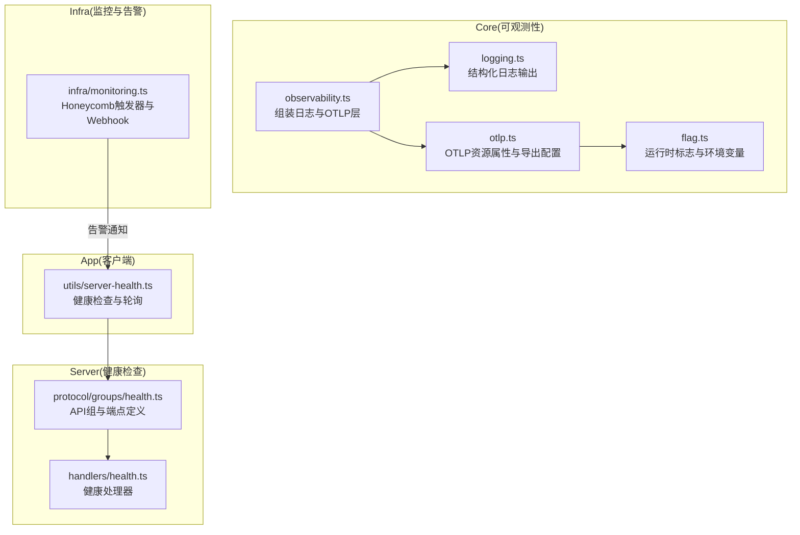
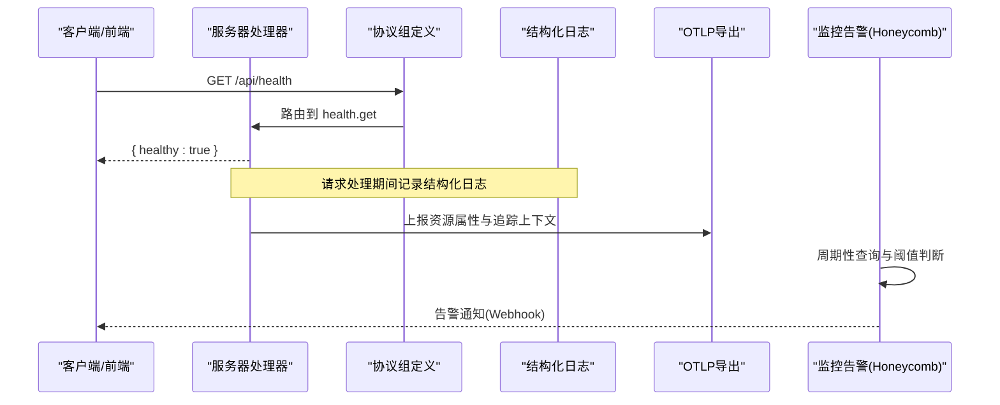
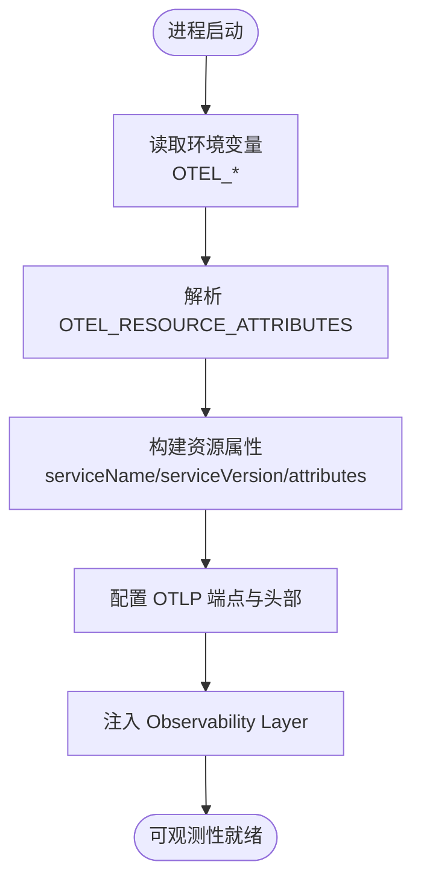
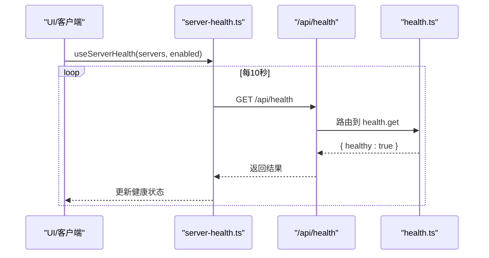
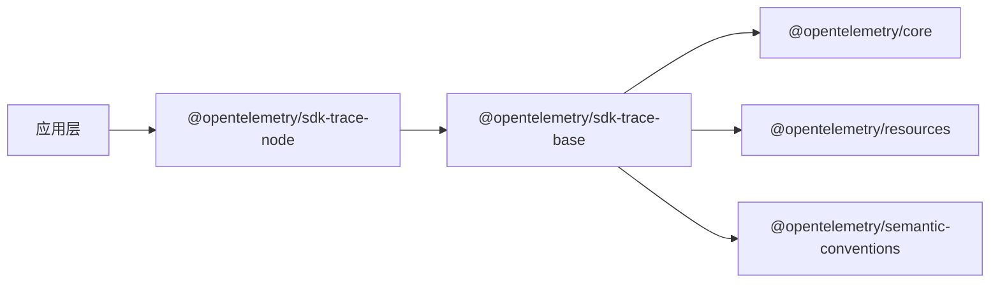

# 可观测性工具

<cite>
**本文引用的文件**   
- [packages/core/src/observability.ts](file://packages/core/src/observability.ts)
- [packages/core/src/observability/logging.ts](file://packages/core/src/observability/logging.ts)
- [packages/core/src/observability/otlp.ts](file://packages/core/src/observability/otlp.ts)
- [packages/core/src/flag/flag.ts](file://packages/core/src/flag/flag.ts)
- [packages/server/src/handlers/health.ts](file://packages/server/src/handlers/health.ts)
- [packages/protocol/src/groups/health.ts](file://packages/protocol/src/groups/health.ts)
- [packages/app/src/utils/server-health.ts](file://packages/app/src/utils/server-health.ts)
- [infra/monitoring.ts](file://infra/monitoring.ts)
- [bun.lock](file://bun.lock)
</cite>

## 目录
1. [简介](#简介)
2. [项目结构](#项目结构)
3. [核心组件](#核心组件)
4. [架构总览](#架构总览)
5. [详细组件分析](#详细组件分析)
6. [依赖分析](#依赖分析)
7. [性能考虑](#性能考虑)
8. [故障排查指南](#故障排查指南)
9. [结论](#结论)
10. [附录](#附录)

## 简介
本文件面向 openNovel 的可观测性工具集，聚焦以下目标：
- 分布式追踪系统的配置与集成（OpenTelemetry OTLP、资源属性、链路数据收集）
- 健康检查端点的实现与监控（服务端点、客户端轮询、自动重试与缓存）
- 日志收集与分析平台配置建议（ELK Stack、Loki、云厂商日志服务）
- 性能分析与慢查询分析（APM 集成思路、指标采集与阈值告警）
- 监控数据的存储策略与保留政策（基于基础设施与统计模块的落地方案）

## 项目结构
可观测性相关代码主要分布在 core 层的 observability 模块、server 层健康处理器、协议定义以及前端健康检查工具；监控告警与统计基础设施位于 infra 与 stats 模块。

图表来源
- [packages/core/src/observability.ts:1-25](file://packages/core/src/observability.ts#L1-L25)
- [packages/core/src/observability/logging.ts:1-72](file://packages/core/src/observability/logging.ts#L1-L72)
- [packages/core/src/observability/otlp.ts:1-48](file://packages/core/src/observability/otlp.ts#L1-L48)
- [packages/core/src/flag/flag.ts:1-79](file://packages/core/src/flag/flag.ts#L1-L79)
- [packages/server/src/handlers/health.ts:1-8](file://packages/server/src/handlers/health.ts#L1-L8)
- [packages/protocol/src/groups/health.ts:1-15](file://packages/protocol/src/groups/health.ts#L1-L15)
- [packages/app/src/utils/server-health.ts:1-155](file://packages/app/src/utils/server-health.ts#L1-L155)
- [infra/monitoring.ts:1-287](file://infra/monitoring.ts#L1-L287)

章节来源
- [packages/core/src/observability.ts:1-25](file://packages/core/src/observability.ts#L1-L25)
- [packages/core/src/observability/logging.ts:1-72](file://packages/core/src/observability/logging.ts#L1-L72)
- [packages/core/src/observability/otlp.ts:1-48](file://packages/core/src/observability/otlp.ts#L1-L48)
- [packages/core/src/flag/flag.ts:1-79](file://packages/core/src/flag/flag.ts#L1-L79)
- [packages/server/src/handlers/health.ts:1-8](file://packages/server/src/handlers/health.ts#L1-L8)
- [packages/protocol/src/groups/health.ts:1-15](file://packages/protocol/src/groups/health.ts#L1-L15)
- [packages/app/src/utils/server-health.ts:1-155](file://packages/app/src/utils/server-health.ts#L1-L155)
- [infra/monitoring.ts:1-287](file://infra/monitoring.ts#L1-L287)

## 核心组件
- 可观测性层装配：将日志与 OTLP 序列化、HTTP 客户端等能力组合为统一 Layer，并暴露 node 入口供应用注入。
- 结构化日志：支持文件与标准错误输出，按运行 ID 关联上下文，支持最小日志级别控制。
- OTLP 资源属性：从环境变量解析 OTEL 资源属性与头部，注入服务名、版本、部署环境、实例 ID 等。
- 健康检查 API：通过 HTTP API Group 定义 /api/health 端点，返回健康状态。
- 客户端健康检查：封装超时、重试、缓存与定时轮询，用于前端或调用方感知服务可用性。
- 监控告警：基于 Honeycomb 定义触发器与 Webhook 通知，覆盖模型 TPS、HTTP 错误率等关键指标。

章节来源
- [packages/core/src/observability.ts:1-25](file://packages/core/src/observability.ts#L1-L25)
- [packages/core/src/observability/logging.ts:1-72](file://packages/core/src/observability/logging.ts#L1-L72)
- [packages/core/src/observability/otlp.ts:1-48](file://packages/core/src/observability/otlp.ts#L1-L48)
- [packages/protocol/src/groups/health.ts:1-15](file://packages/protocol/src/groups/health.ts#L1-L15)
- [packages/server/src/handlers/health.ts:1-8](file://packages/server/src/handlers/health.ts#L1-L8)
- [packages/app/src/utils/server-health.ts:1-155](file://packages/app/src/utils/server-health.ts#L1-L155)
- [infra/monitoring.ts:1-287](file://infra/monitoring.ts#L1-L287)

## 架构总览
下图展示了从客户端发起健康检查到服务端响应，以及日志与追踪数据流向的整体流程。

图表来源
- [packages/protocol/src/groups/health.ts:1-15](file://packages/protocol/src/groups/health.ts#L1-L15)
- [packages/server/src/handlers/health.ts:1-8](file://packages/server/src/handlers/health.ts#L1-L8)
- [packages/core/src/observability/logging.ts:1-72](file://packages/core/src/observability/logging.ts#L1-L72)
- [packages/core/src/observability/otlp.ts:1-48](file://packages/core/src/observability/otlp.ts#L1-L48)
- [infra/monitoring.ts:1-287](file://infra/monitoring.ts#L1-L287)

## 详细组件分析

### 分布式追踪与 OpenTelemetry 集成
- 资源属性构建：从环境变量 OTEL_RESOURCE_ATTRIBUTES 解析键值对，支持 URL 解码与逗号分隔；同时注入部署环境、客户端标识、运行实例 ID 等。
- OTLP 导出配置：通过 Flag 读取 OTEL_EXPORTER_OTLP_ENDPOINT 与 OTEL_EXPORTER_OTLP_HEADERS，用于设置导出端点与认证头。
- 层装配：在 observability.ts 中合并日志与 OTLP 序列化层，并提供 FetchHttpClient 以支持网络导出。

图表来源
- [packages/core/src/observability/otlp.ts:1-48](file://packages/core/src/observability/otlp.ts#L1-L48)
- [packages/core/src/flag/flag.ts:1-79](file://packages/core/src/flag/flag.ts#L1-L79)
- [packages/core/src/observability.ts:1-25](file://packages/core/src/observability.ts#L1-L25)

章节来源
- [packages/core/src/observability/otlp.ts:1-48](file://packages/core/src/observability/otlp.ts#L1-L48)
- [packages/core/src/flag/flag.ts:1-79](file://packages/core/src/flag/flag.ts#L1-L79)
- [packages/core/src/observability.ts:1-25](file://packages/core/src/observability.ts#L1-L25)

### 健康检查端点与监控
- 协议定义：在 protocol 层定义 /api/health 端点，成功响应包含 healthy 字段。
- 处理器实现：server 层将 health.get 映射到 Effect.succeed({ healthy: true })。
- 客户端检查：app 层封装 checkServerHealth，支持超时、重试、AbortSignal 与内存缓存；useCheckServerHealth/useServerHealth 提供定时轮询与状态管理。

图表来源
- [packages/protocol/src/groups/health.ts:1-15](file://packages/protocol/src/groups/health.ts#L1-L15)
- [packages/server/src/handlers/health.ts:1-8](file://packages/server/src/handlers/health.ts#L1-L8)
- [packages/app/src/utils/server-health.ts:1-155](file://packages/app/src/utils/server-health.ts#L1-L155)

章节来源
- [packages/protocol/src/groups/health.ts:1-15](file://packages/protocol/src/groups/health.ts#L1-L15)
- [packages/server/src/handlers/health.ts:1-8](file://packages/server/src/handlers/health.ts#L1-L8)
- [packages/app/src/utils/server-health.ts:1-155](file://packages/app/src/utils/server-health.ts#L1-L155)

### 日志收集与分析平台配置
- 本地日志：使用 fileLogger 输出到文件，stderrLogger 输出到标准错误；支持最小日志级别 OPENCODE_LOG_LEVEL。
- 结构化格式：统一 key=value 格式，便于被 ELK/Loki 等系统解析。
- 平台对接建议：
  - ELK Stack：通过 Filebeat/Fluent Bit 采集 opennovel.log，使用 Grok 解析 key=value 格式，索引按日期分片。
  - Loki：以 JSON 或 key=value 行式推送，标签包含 service、run、level、deployment.environment.name。
  - 云服务日志：如阿里云 SLS、腾讯云 CLS、AWS CloudWatch Logs，按服务名与实例 ID 分组，启用压缩与批量写入。

章节来源
- [packages/core/src/observability/logging.ts:1-72](file://packages/core/src/observability/logging.ts#L1-L72)

### 性能分析与慢查询分析
- APM 集成思路：结合 OTLP 导出，将 Span 与指标上报至 APM 后端（如 Honeycomb、Jaeger、Prometheus）。
- 指标维度：duration、ttfb、tps.output、cost、status 等，可在统计模块中进行聚合与排名。
- 慢查询识别：基于 P95/P50 延迟与 TPS 阈值触发告警，定位低效路径。

章节来源
- [infra/monitoring.ts:1-287](file://infra/monitoring.ts#L1-L287)

### 监控数据存储策略与保留政策
- 事件表与 Iceberg：infra/stats.ts 定义了 S3 Tables + Iceberg 的事件表结构，包含时间戳、地域、成本、状态等字段。
- 分区与保留：可按 event_date/event_timestamp 分区，结合生命周期策略进行冷热分层与过期清理。
- 统计回填：honeycomb-backfill.ts 将历史指标回填至统计库，支持多字段兼容与排序。

章节来源
- [infra/stats.ts:1-90](file://infra/stats.ts#L1-L90)
- [packages/stats/core/src/honeycomb-backfill.ts:226-269](file://packages/stats/core/src/honeycomb-backfill.ts#L226-L269)
- [packages/stats/core/src/domain/inference.ts:39-49](file://packages/stats/core/src/domain/inference.ts#L39-L49)

## 依赖分析
OpenTelemetry SDK 依赖由包管理器锁定，确保 trace/metrics 组件版本一致。

图表来源
- [bun.lock:2053-2059](file://bun.lock#L2053-L2059)

章节来源
- [bun.lock:2053-2059](file://bun.lock#L2053-L2059)

## 性能考虑
- 日志批处理：避免将 batchWindow 设置为 0，防止空闲时 CPU 占用过高。
- 健康检查缓存：客户端侧对健康检查结果进行短时缓存，降低频繁探测开销。
- 告警频率：合理设置触发器频率与阈值，避免误报与风暴。
- 资源属性精简：仅上传必要属性，减少 OTLP 传输负载。

[本节为通用指导，不直接分析具体文件]

## 故障排查指南
- 无法连接 OTLP 端点：检查 OTEL_EXPORTER_OTLP_ENDPOINT 与 OTEL_EXPORTER_OTLP_HEADERS 是否正确；确认网络连通性与证书。
- 日志未输出：确认 OPENCODE_PRINT_LOGS 与 OPENCODE_LOG_LEVEL；检查文件写入权限与磁盘空间。
- 健康检查失败：查看客户端重试与超时配置；确认服务端 /api/health 可达；检查上游依赖是否异常。
- 告警不生效：核对 Honeycomb 触发器配置与 Webhook Secret；验证域名与回调地址。

章节来源
- [packages/core/src/observability/logging.ts:1-72](file://packages/core/src/observability/logging.ts#L1-L72)
- [packages/core/src/flag/flag.ts:1-79](file://packages/core/src/flag/flag.ts#L1-L79)
- [packages/app/src/utils/server-health.ts:1-155](file://packages/app/src/utils/server-health.ts#L1-L155)
- [infra/monitoring.ts:1-287](file://infra/monitoring.ts#L1-L287)

## 结论
openNovel 的可观测性体系以 Effect 层为核心，整合结构化日志与 OTLP 追踪，配合健康检查与监控告警，形成端到端的可观测闭环。通过合理的存储策略与保留政策，保障数据可用性与成本可控。建议在部署中完善日志采集、APM 接入与告警联动，持续提升系统稳定性与可维护性。

[本节为总结性内容，不直接分析具体文件]

## 附录
- 环境变量清单（节选）
  - OTEL_EXPORTER_OTLP_ENDPOINT：OTLP 导出端点
  - OTEL_EXPORTER_OTLP_HEADERS：OTLP 头部（key=value 列表）
  - OTEL_RESOURCE_ATTRIBUTES：资源属性（key=value 列表，支持 URL 编码）
  - OPENCODE_LOG_LEVEL：最小日志级别（DEBUG/INFO/WARN/ERROR）
  - OPENCODE_PRINT_LOGS：是否打印到 stderr
  - OPENCODE_CLIENT：客户端标识（默认 cli）

章节来源
- [packages/core/src/flag/flag.ts:1-79](file://packages/core/src/flag/flag.ts#L1-L79)
- [packages/core/src/observability/logging.ts:1-72](file://packages/core/src/observability/logging.ts#L1-L72)
- [packages/core/src/observability/otlp.ts:1-48](file://packages/core/src/observability/otlp.ts#L1-L48)