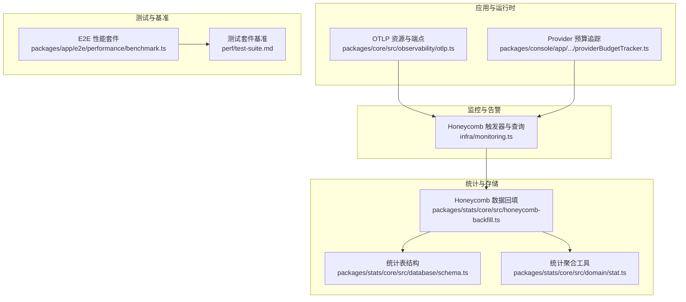
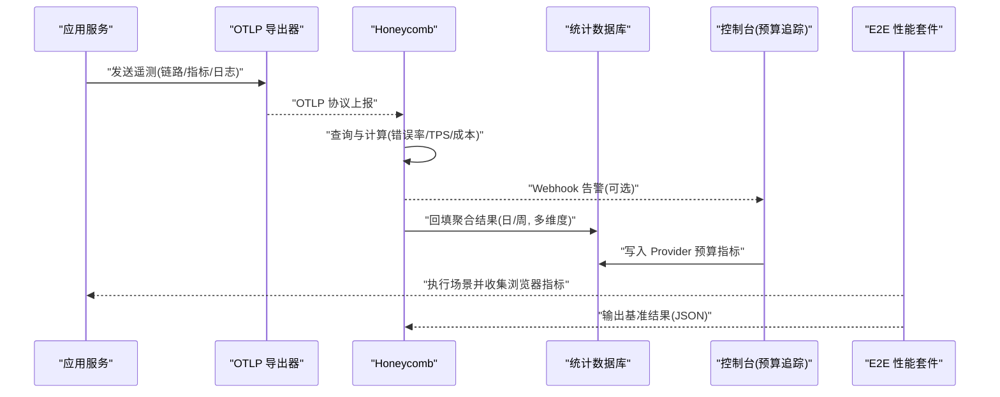
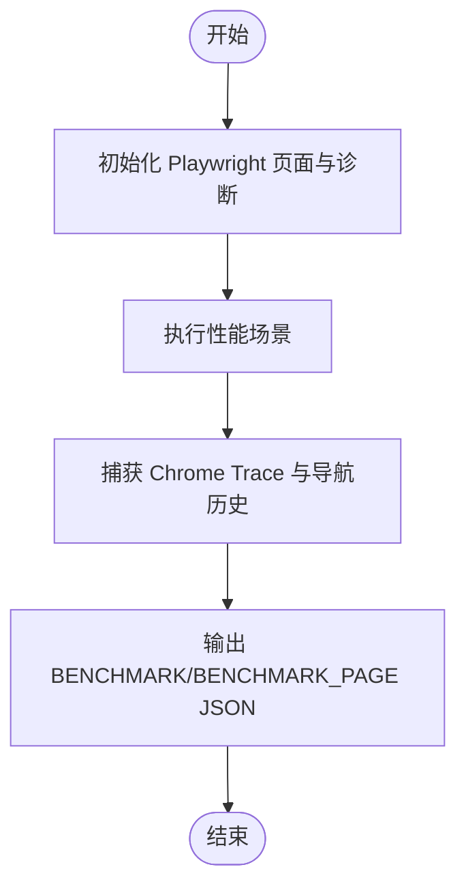
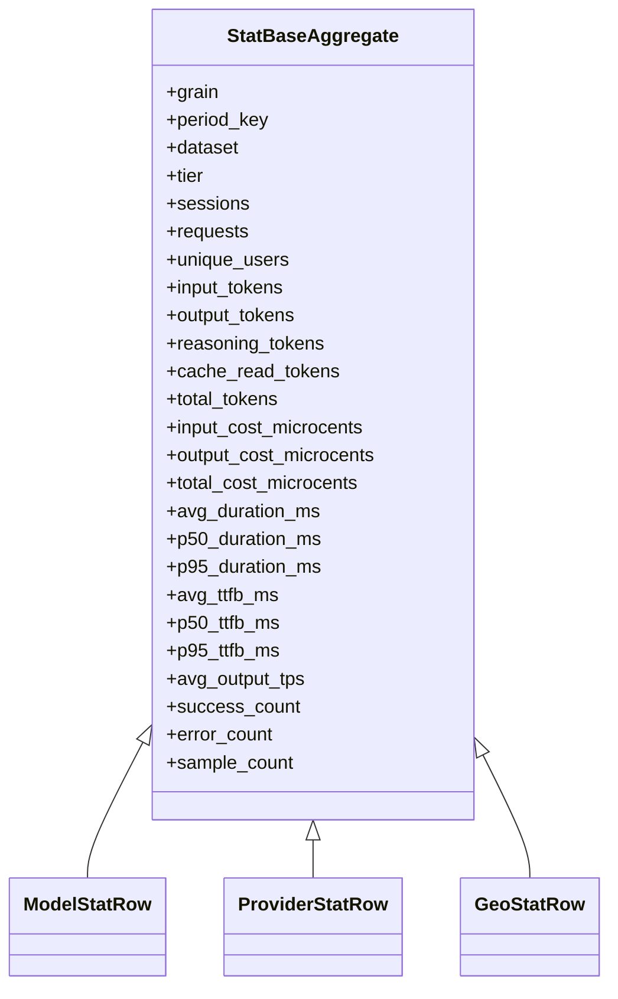
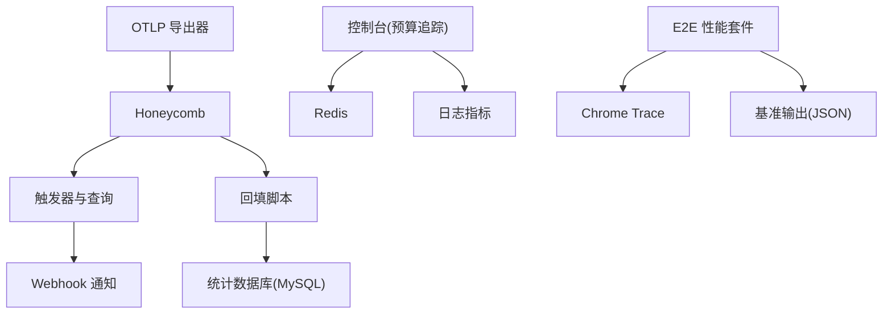

# 性能监控

<cite>
**本文引用的文件**   
- [packages/core/src/observability/otlp.ts](file://packages/core/src/observability/otlp.ts)
- [infra/monitoring.ts](file://infra/monitoring.ts)
- [packages/stats/core/src/database/schema.ts](file://packages/stats/core/src/database/schema.ts)
- [packages/stats/core/src/domain/stat.ts](file://packages/stats/core/src/domain/stat.ts)
- [packages/stats/core/src/honeycomb-backfill.ts](file://packages/stats/core/src/honeycomb-backfill.ts)
- [packages/console/app/src/routes/zen/util/providerBudgetTracker.ts](file://packages/console/app/src/routes/zen/util/providerBudgetTracker.ts)
- [perf/test-suite.md](file://perf/test-suite.md)
- [packages/app/e2e/performance/benchmark.ts](file://packages/app/e2e/performance/benchmark.ts)
</cite>

## 目录
1. [简介](#简介)
2. [项目结构](#项目结构)
3. [核心组件](#核心组件)
4. [架构总览](#架构总览)
5. [详细组件分析](#详细组件分析)
6. [依赖关系分析](#依赖关系分析)
7. [性能考量](#性能考量)
8. [故障排查指南](#故障排查指南)
9. [结论](#结论)
10. [附录](#附录)

## 简介
本文件为 openNovel 的性能监控系统文档，聚焦以下目标：
- 定义关键性能指标（KPI）与采集方法：响应时间、吞吐量、错误率、资源使用率等。
- 说明监控仪表板配置与自定义：Prometheus 指标导出与 Grafana 仪表板设置建议。
- 描述性能基准测试与压力测试的配置方法。
- 提供瓶颈识别与优化建议：数据库查询优化、内存管理、并发处理调优。
- 给出容量规划指导与扩缩容策略。

## 项目结构
仓库中与性能监控相关的关键位置：
- 可观测性导出：OpenTelemetry OTLP 资源属性与端点配置。
- 告警与计算：Honeycomb 触发器与查询规范，用于错误率、低 TPS、免费层请求激增等。
- 统计聚合与存储：基于 Drizzle ORM 的 MySQL 表结构与聚合字段定义。
- 数据回填与导入：从 Honeycomb 导出数据并回填到统计库，生成多维度的聚合结果。
- 控制台预算追踪：按 Provider 维度记录成本与优先级，输出日志指标。
- 应用级 E2E 性能套件：Playwright + Chrome Trace 的页面级性能测量与报告。
- 测试套件加速：Bun 测试套件基准与慢文件定位。

图表来源
- [packages/core/src/observability/otlp.ts](file://packages/core/src/observability/otlp.ts)
- [infra/monitoring.ts](file://infra/monitoring.ts)
- [packages/stats/core/src/database/schema.ts](file://packages/stats/core/src/database/schema.ts)
- [packages/stats/core/src/domain/stat.ts](file://packages/stats/core/src/domain/stat.ts)
- [packages/stats/core/src/honeycomb-backfill.ts](file://packages/stats/core/src/honeycomb-backfill.ts)
- [packages/app/e2e/performance/benchmark.ts](file://packages/app/e2e/performance/benchmark.ts)
- [perf/test-suite.md](file://perf/test-suite.md)

章节来源
- [packages/core/src/observability/otlp.ts](file://packages/core/src/observability/otlp.ts)
- [infra/monitoring.ts](file://infra/monitoring.ts)
- [packages/stats/core/src/database/schema.ts](file://packages/stats/core/src/database/schema.ts)
- [packages/stats/core/src/domain/stat.ts](file://packages/stats/core/src/domain/stat.ts)
- [packages/stats/core/src/honeycomb-backfill.ts](file://packages/stats/core/src/honeycomb-backfill.ts)
- [packages/app/e2e/performance/benchmark.ts](file://packages/app/e2e/performance/benchmark.ts)
- [perf/test-suite.md](file://perf/test-suite.md)

## 核心组件
- OpenTelemetry 资源与端点：通过环境变量和 Flag 配置 OTLP 导出端点、Headers 与资源属性（服务名、版本、环境、运行 ID 等），为链路追踪与指标上报提供基础上下文。
- Honeycomb 监控与告警：定义模型 HTTP 错误率、Provider HTTP 错误率、低 TPS、免费层请求激增等触发器，结合 Webhook 通知（如 Discord）。
- 统计存储与聚合：以 Drizzle ORM 定义 model_stat、provider_stat、geo_stat 等表，包含会话数、请求数、Token 用量、成本、延迟百分位、TTFB、TPS、成功/错误计数等。
- 数据回填：将 Honeycomb 导出的聚合数据导入统计库，支持日/周粒度、多分面（model/provider/geo）与排名计算。
- Provider 预算追踪：在控制台侧记录各 Provider 的成本与优先级，并通过 logger.metric 输出指标。
- E2E 性能套件：基于 Playwright 与 Chrome Trace，捕获页面导航、主线程跟踪、RAF 间隙、长任务等，并以统一 JSON 格式输出基准结果。
- 测试套件基准：使用 Bun 命令进行全量测试套件基准与慢文件定位，关注中位耗时、最坏耗时、失败与噪声分布。

章节来源
- [packages/core/src/observability/otlp.ts](file://packages/core/src/observability/otlp.ts)
- [infra/monitoring.ts](file://infra/monitoring.ts)
- [packages/stats/core/src/database/schema.ts](file://packages/stats/core/src/database/schema.ts)
- [packages/stats/core/src/domain/stat.ts](file://packages/stats/core/src/domain/stat.ts)
- [packages/stats/core/src/honeycomb-backfill.ts](file://packages/stats/core/src/honeycomb-backfill.ts)
- [packages/console/app/src/routes/zen/util/providerBudgetTracker.ts](file://packages/console/app/src/routes/zen/util/providerBudgetTracker.ts)
- [packages/app/e2e/performance/benchmark.ts](file://packages/app/e2e/performance/benchmark.ts)
- [perf/test-suite.md](file://perf/test-suite.md)

## 架构总览
下图展示端到端的性能监控与告警流程：应用通过 OTLP 上报遥测数据；Honeycomb 对数据进行查询与计算，触发告警；回填脚本将聚合结果写入统计库；控制台侧记录 Provider 预算指标；E2E 套件与测试套件基准提供前端与测试层面的性能度量。

图表来源
- [packages/core/src/observability/otlp.ts](file://packages/core/src/observability/otlp.ts)
- [infra/monitoring.ts](file://infra/monitoring.ts)
- [packages/stats/core/src/honeycomb-backfill.ts](file://packages/stats/core/src/honeycomb-backfill.ts)
- [packages/console/app/src/routes/zen/util/providerBudgetTracker.ts](file://packages/console/app/src/routes/zen/util/providerBudgetTracker.ts)
- [packages/app/e2e/performance/benchmark.ts](file://packages/app/e2e/performance/benchmark.ts)

## 详细组件分析

### KPI 定义与采集方法
- 响应时间
  - 平均延迟与百分位：avg_duration_ms、p50_duration_ms、p95_duration_ms。
  - 首字节时间（TTFB）：avg_ttfb_ms、p50_ttfb_ms、p95_ttfb_ms。
  - 采集来源：Honeycomb 查询与回填映射，以及 SQL 聚合中的近似百分位函数。
- 吞吐量
  - 输出速率：avg_output_tps（每秒 token 输出）。
  - 请求计数：requests、sample_count。
- 错误率
  - 模型 HTTP 错误率：基于状态码过滤与阈值公式。
  - Provider HTTP 错误率：区分 completions 与 llm.error 事件，排除特定 404。
- 资源使用率
  - Token 用量与成本：input/output/reasoning/cache_read tokens 与 microcents 成本。
  - 用户与会话：sessions、unique_users。
- 采集方式
  - OTLP 上报资源属性与运行上下文。
  - Honeycomb 查询规范与计算字段。
  - 回填脚本将聚合结果持久化至统计库。

章节来源
- [packages/core/src/observability/otlp.ts](file://packages/core/src/observability/otlp.ts)
- [infra/monitoring.ts](file://infra/monitoring.ts)
- [packages/stats/core/src/database/schema.ts](file://packages/stats/core/src/database/schema.ts)
- [packages/stats/core/src/honeycomb-backfill.ts](file://packages/stats/core/src/honeycomb-backfill.ts)
- [packages/stats/core/src/domain/inference.ts](file://packages/stats/core/src/domain/inference.ts)

### 监控仪表板配置与自定义（Prometheus/Grafana）
- 指标导出建议
  - 通过 OTLP 将指标导出到 Prometheus（需启用 OTLP 接收器或中间件）。
  - 将 Honeycomb 的查询结果定期导出为 Prometheus 兼容格式（例如 CSV/JSON 转译）。
- 仪表板面板建议
  - 错误率面板：模型与 Provider 的错误率趋势，按产品分层（Go/Zen）。
  - 延迟面板：P50/P95 延迟与 TTFB 的分位数曲线。
  - 吞吐面板：输出 TPS 与请求总量。
  - 成本面板：Token 用量与成本微分（microcents）趋势。
  - 资源面板：CPU/内存/IO 使用率（由宿主系统或运行时暴露）。
- 自定义扩展
  - 新增计算字段：在 Honeycomb 中定义表达式，避免名称冲突（哈希后缀）。
  - 告警规则：错误率阈值、低 TPS、免费层请求激增等。

章节来源
- [infra/monitoring.ts](file://infra/monitoring.ts)
- [packages/core/src/observability/otlp.ts](file://packages/core/src/observability/otlp.ts)

### 性能基准测试与压力测试配置
- 应用级 E2E 性能套件
  - 使用 Playwright 控制场景，自动捕获主帧导航与 Chrome Trace。
  - 统一输出 BENCHMARK/BENCHMARK_PAGE JSON 行，包含 runID、name、context、metrics、trace。
  - 隔离浏览器上下文，串行执行以避免竞争。
- 测试套件基准
  - 使用 Bun 命令进行全量基准与慢文件定位。
  - 主要指标：中位耗时、最坏耗时、失败与噪声分布。
  - 通过 TEST_PROFILE_GLOB 与 TEST_PROFILE_LIMIT 限定范围与数量。

图表来源
- [packages/app/e2e/performance/benchmark.ts](file://packages/app/e2e/performance/benchmark.ts)
- [perf/test-suite.md](file://perf/test-suite.md)

章节来源
- [packages/app/e2e/performance/benchmark.ts](file://packages/app/e2e/performance/benchmark.ts)
- [perf/test-suite.md](file://perf/test-suite.md)

### 数据回填与统计聚合
- 回填流程
  - 从 Honeycomb 导出 CSV/JSON，按维度（model/provider/geo）与粒度（day/week）导入。
  - 合并与排名：按 tokens/requests/sessions/cost 计算市场占比与排名。
  - 写入统计库：批量 upsert，确保唯一键约束（grain/period_key/dataset/tier/client/source/provider/model）。
- 聚合字段
  - 延迟与 TTFB 的平均值与百分位。
  - 输出 TPS 平均值。
  - 成功/错误计数与样本计数。

图表来源
- [packages/stats/core/src/domain/stat.ts](file://packages/stats/core/src/domain/stat.ts)
- [packages/stats/core/src/database/schema.ts](file://packages/stats/core/src/database/schema.ts)

章节来源
- [packages/stats/core/src/honeycomb-backfill.ts](file://packages/stats/core/src/honeycomb-backfill.ts)
- [packages/stats/core/src/domain/stat.ts](file://packages/stats/core/src/domain/stat.ts)
- [packages/stats/core/src/database/schema.ts](file://packages/stats/core/src/database/schema.ts)

### Provider 预算追踪与指标输出
- 功能要点
  - 按 Provider、优先级与时间窗口累计成本（微分单位）。
  - Redis 管道更新与过期策略（保留上一窗口以便调整）。
  - 通过 logger.metric 输出 provider.budget_usage 与 provider.budget_priority。
- 用途
  - 预算控制与动态路由选择。
  - 成本可视化与异常检测。

章节来源
- [packages/console/app/src/routes/zen/util/providerBudgetTracker.ts](file://packages/console/app/src/routes/zen/util/providerBudgetTracker.ts)

## 依赖关系分析
- 组件耦合
  - OTLP 导出器为上游遥测源，影响 Honeycomb 的数据质量与上下文。
  - Honeycomb 触发器依赖查询规范与计算字段，变更需谨慎以避免缓存问题。
  - 回填脚本依赖统计库表结构与唯一键约束，批量 upsert 需保证幂等。
  - 控制台预算追踪依赖 Redis 与日志系统，指标输出需稳定。
- 外部依赖
  - OTLP 端点与 Headers。
  - Honeycomb API 与 Webhook。
  - MySQL（Planetscale）与 Drizzle ORM。
  - Redis（预算追踪）。
  - Playwright 与 Chrome（E2E 性能套件）。

图表来源
- [packages/core/src/observability/otlp.ts](file://packages/core/src/observability/otlp.ts)
- [infra/monitoring.ts](file://infra/monitoring.ts)
- [packages/stats/core/src/honeycomb-backfill.ts](file://packages/stats/core/src/honeycomb-backfill.ts)
- [packages/console/app/src/routes/zen/util/providerBudgetTracker.ts](file://packages/console/app/src/routes/zen/util/providerBudgetTracker.ts)
- [packages/app/e2e/performance/benchmark.ts](file://packages/app/e2e/performance/benchmark.ts)

章节来源
- [packages/core/src/observability/otlp.ts](file://packages/core/src/observability/otlp.ts)
- [infra/monitoring.ts](file://infra/monitoring.ts)
- [packages/stats/core/src/honeycomb-backfill.ts](file://packages/stats/core/src/honeycomb-backfill.ts)
- [packages/console/app/src/routes/zen/util/providerBudgetTracker.ts](file://packages/console/app/src/routes/zen/util/providerBudgetTracker.ts)
- [packages/app/e2e/performance/benchmark.ts](file://packages/app/e2e/performance/benchmark.ts)

## 性能考量
- 数据库查询优化
  - 利用索引：model/provider/geo 的多维索引与唯一键约束，减少扫描。
  - 聚合查询：使用近似百分位与窗口函数，降低计算开销。
  - 批量写入：upsert 分批提交，避免锁竞争。
- 内存管理
  - 回填脚本中合理设置 chunk size，避免一次性加载过大数据集。
  - Redis 预算键设置过期时间，防止内存泄漏。
- 并发处理调优
  - E2E 套件串行执行，避免跨测试竞争。
  - Honeycomb 触发器频率与阈值平衡，避免频繁告警风暴。
- 资源使用率
  - 通过 OTLP 上报 CPU/内存/IO 指标（由宿主或运行时暴露）。
  - 结合 Grafana 面板观察峰值与趋势。

[本节为通用指导，不直接分析具体文件]

## 故障排查指南
- 错误率异常
  - 检查模型与 Provider 的错误率触发器阈值与时间窗口。
  - 确认状态码过滤逻辑（排除 401、特定 429 类型）。
- 低 TPS
  - 查看 TPS 百分位与样本量，确认是否因采样不足导致误报。
- 免费层请求激增
  - 检查 free tier 标记与计数逻辑，评估是否策略调整或滥用。
- 回填失败
  - 校验 CSV/JSON 字段映射与唯一键冲突。
  - 检查数据库连接与权限。
- E2E 性能套件失败
  - 确认浏览器上下文与 Trace 捕获是否正常。
  - 检查输出 JSON 是否符合 schemaVersion 要求。

章节来源
- [infra/monitoring.ts](file://infra/monitoring.ts)
- [packages/stats/core/src/honeycomb-backfill.ts](file://packages/stats/core/src/honeycomb-backfill.ts)
- [packages/app/e2e/performance/benchmark.ts](file://packages/app/e2e/performance/benchmark.ts)

## 结论
openNovel 的性能监控体系覆盖从应用遥测、云端聚合、告警通知到统计入库与前端基准的全链路。通过明确的 KPI 定义、稳定的数据采集与灵活的告警规则，团队可以快速定位瓶颈并进行优化。建议持续完善 Prometheus/Grafana 集成，强化容量规划与弹性伸缩策略，确保系统在增长负载下的稳定性与效率。

[本节为总结，不直接分析具体文件]

## 附录
- 常用命令
  - 测试套件基准：bun run bench:test
  - 慢文件定位：bun run profile:test
  - E2E 性能套件：bun run test:bench（Windows 下设置 PLAYWRIGHT_WORKERS=1）
- 关键环境变量
  - OTEL_EXPORTER_OTLP_ENDPOINT、OTEL_EXPORTER_OTLP_HEADERS、OTEL_RESOURCE_ATTRIBUTES
  - OPENCODE_PERFORMANCE_RUN_ID、OPENCODE_PERFORMANCE_TRACE_DIR、OPENCODE_PERFORMANCE_SELECTOR_TRACE

[本节为补充信息，不直接分析具体文件]