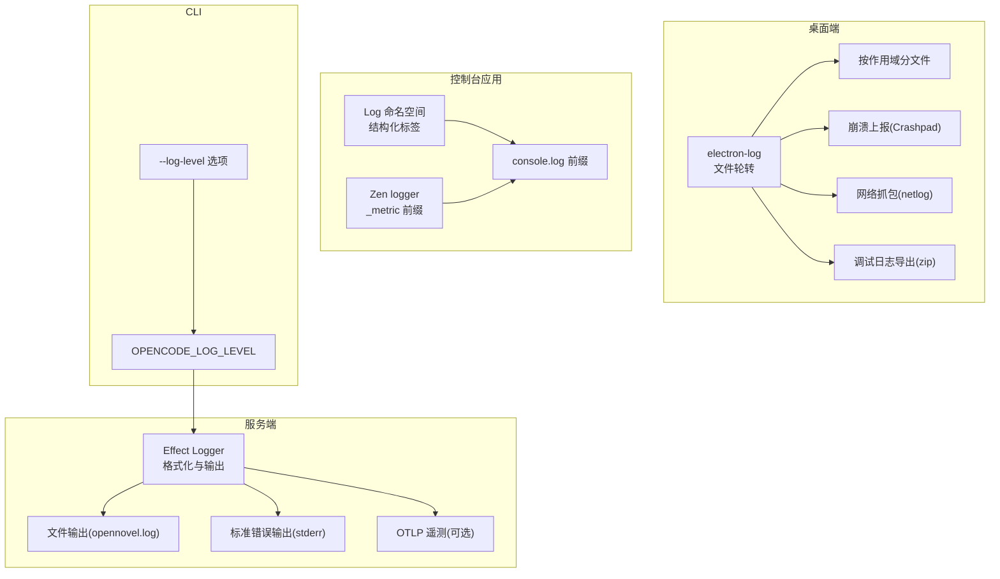
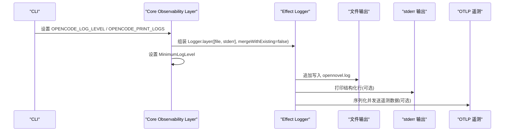
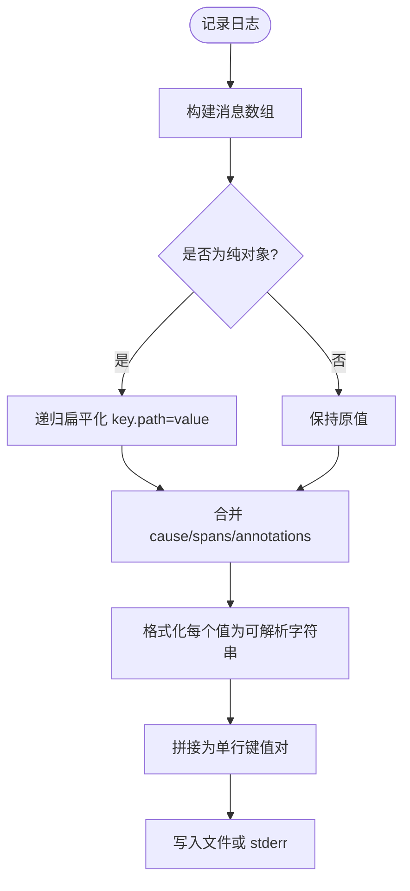
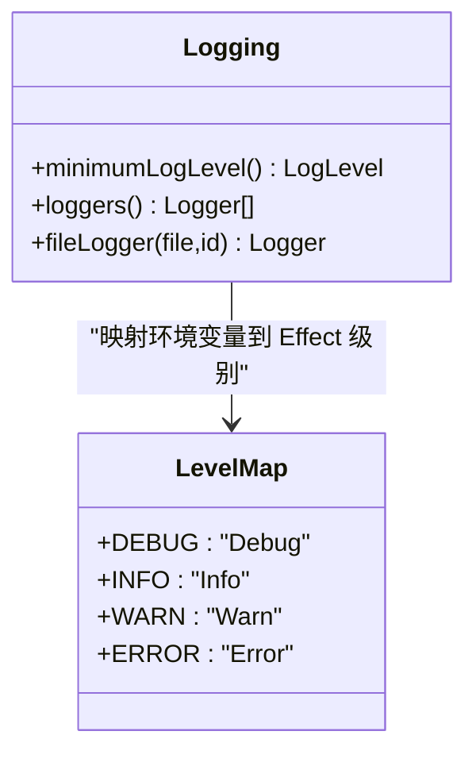
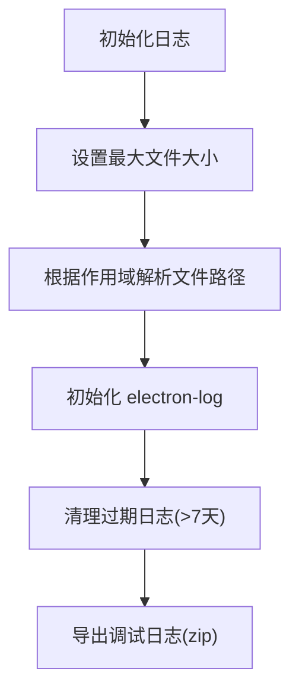
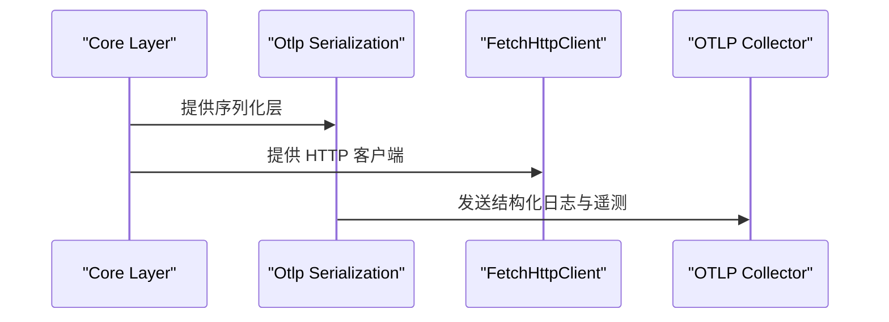
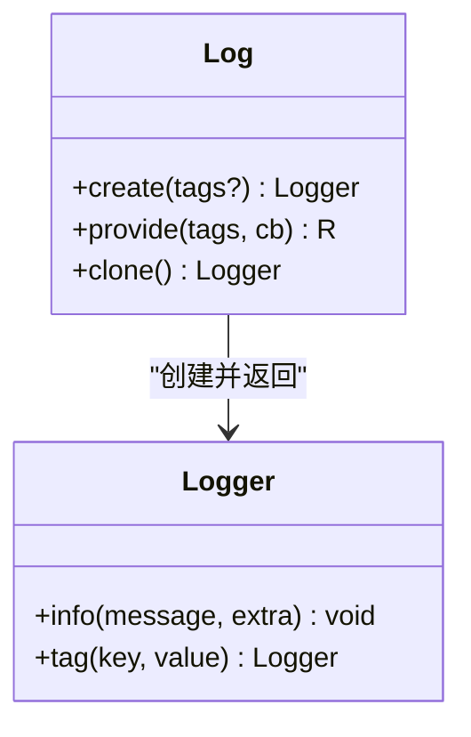
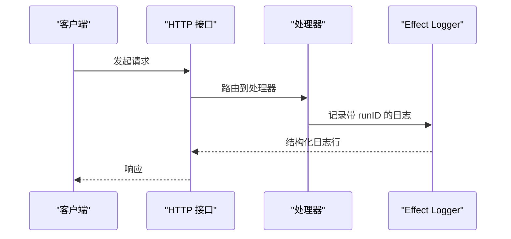
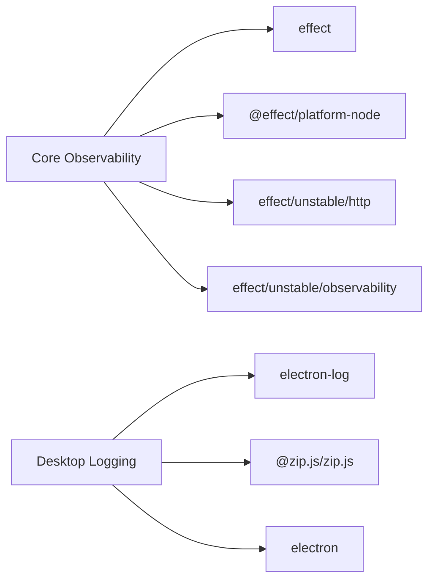

# 日志系统

<cite>
**本文引用的文件**   
- [packages/core/src/observability/logging.ts](file://packages/core/src/observability/logging.ts)
- [packages/core/src/observability.ts](file://packages/core/src/observability.ts)
- [packages/console/core/src/util/log.ts](file://packages/console/core/src/util/log.ts)
- [packages/console/app/src/routes/zen/util/logger.ts](file://packages/console/app/src/routes/zen/util/logger.ts)
- [packages/desktop/src/main/logging.ts](file://packages/desktop/src/main/logging.ts)
- [packages/opencode/src/index.ts](file://packages/opencode/src/index.ts)
- [packages/opencode/test/effect/observability.test.ts](file://packages/opencode/test/effect/observability.test.ts)
</cite>

## 目录
1. [简介](#简介)
2. [项目结构](#项目结构)
3. [核心组件](#核心组件)
4. [架构总览](#架构总览)
5. [详细组件分析](#详细组件分析)
6. [依赖分析](#依赖分析)
7. [性能考虑](#性能考虑)
8. [故障排查指南](#故障排查指南)
9. [结论](#结论)
10. [附录](#附录)

## 简介
本文件为 openNovel 的日志系统文档，聚焦以下目标：
- 结构化日志格式设计：统一字段、JSON 规范与输出形态
- 日志级别分类：DEBUG、INFO、WARN、ERROR
- 中间件与请求链路追踪：如何在 HTTP 请求中注入上下文并贯穿调用链
- 日志输出配置：控制台输出、文件轮转与远程日志服务集成
- 过滤与搜索技巧：基于上下文的查询方法与性能分析建议
- 安全与脱敏：敏感信息处理与安全最佳实践

## 项目结构
openNovel 的日志能力由多端协同实现：
- 服务端（Effect + Node）：统一的格式化器、文件/标准错误输出、最小日志级别控制、OTLP 遥测集成
- 桌面端（Electron）：electron-log 文件轮转、网络抓包、崩溃报告、调试日志导出
- 控制台应用（Console App）：轻量级结构化标签日志与度量前缀输出
- CLI 入口：通过命令行参数设置日志级别环境变量

**图示来源** 
- [packages/core/src/observability/logging.ts:1-72](file://packages/core/src/observability/logging.ts#L1-L72)
- [packages/desktop/src/main/logging.ts:1-206](file://packages/desktop/src/main/logging.ts#L1-L206)
- [packages/console/core/src/util/log.ts:1-56](file://packages/console/core/src/util/log.ts#L1-L56)
- [packages/console/app/src/routes/zen/util/logger.ts:1-13](file://packages/console/app/src/routes/zen/util/logger.ts#L1-L13)
- [packages/opencode/src/index.ts:58-69](file://packages/opencode/src/index.ts#L58-L69)

**章节来源**
- [packages/core/src/observability/logging.ts:1-72](file://packages/core/src/observability/logging.ts#L1-L72)
- [packages/desktop/src/main/logging.ts:1-206](file://packages/desktop/src/main/logging.ts#L1-L206)
- [packages/console/core/src/util/log.ts:1-56](file://packages/console/core/src/util/log.ts#L1-L56)
- [packages/console/app/src/routes/zen/util/logger.ts:1-13](file://packages/console/app/src/routes/zen/util/logger.ts#L1-L13)
- [packages/opencode/src/index.ts:58-69](file://packages/opencode/src/index.ts#L58-L69)

## 核心组件
- Effect 结构化日志器
  - 提供 formatter 将结构化消息扁平化为键值对序列，包含时间戳、级别、run ID、消息体、cause、spans、annotations 等
  - 支持文件追加写入与 stderr 输出
  - 通过环境变量 OPENCODE_LOG_LEVEL 控制最小日志级别
  - 通过 OPENCODE_PRINT_LOGS=1 开启 stderr 输出
- Electron 桌面日志
  - 使用 electron-log 进行文件轮转与作用域隔离
  - 支持崩溃上报、网络抓包、调试日志打包导出
- Console 应用日志
  - Log 命名空间提供结构化标签前缀与上下文传播
  - Zen logger 提供 _metric 前缀用于指标采集
- CLI 日志级别注入
  - --log-level 选项映射到 OPENCODE_LOG_LEVEL 环境变量

**章节来源**
- [packages/core/src/observability/logging.ts:1-72](file://packages/core/src/observability/logging.ts#L1-L72)
- [packages/desktop/src/main/logging.ts:1-206](file://packages/desktop/src/main/logging.ts#L1-L206)
- [packages/console/core/src/util/log.ts:1-56](file://packages/console/core/src/util/log.ts#L1-L56)
- [packages/console/app/src/routes/zen/util/logger.ts:1-13](file://packages/console/app/src/routes/zen/util/logger.ts#L1-L13)
- [packages/opencode/src/index.ts:58-69](file://packages/opencode/src/index.ts#L58-L69)

## 架构总览
日志系统在运行时通过 Effect Layer 装配，合并文件与 OTLP 输出，并设置最小日志级别。桌面端独立维护本地日志与诊断工具。控制台应用提供轻量结构化输出。

**图示来源** 
- [packages/core/src/observability.ts:1-25](file://packages/core/src/observability.ts#L1-L25)
- [packages/core/src/observability/logging.ts:1-72](file://packages/core/src/observability/logging.ts#L1-L72)

**章节来源**
- [packages/core/src/observability.ts:1-25](file://packages/core/src/observability.ts#L1-L25)
- [packages/core/src/observability/logging.ts:1-72](file://packages/core/src/observability/logging.ts#L1-L72)

## 详细组件分析

### 结构化日志格式与字段定义
- 基础字段
  - timestamp：事件时间戳
  - level：日志级别（Debug/Info/Warn/Error）
  - run：运行实例标识（runID），用于区分并发执行流
  - message：主消息或扁平化的键值对
  - cause：异常原因（可选）
  - spans/annotations：分布式追踪跨度与注解（可选）
- 扁平化策略
  - 纯对象会被递归扁平化为 key.path=value 形式，避免深层嵌套
  - 循环引用检测，标记为 [Circular]
  - 字符串直接保留，非字符串经 Formatter.format 后按是否含空白/引号决定是否 JSON 序列化
- 输出形态
  - 单行键值对拼接，便于日志聚合与解析
  - 文件以追加模式写入，stderr 仅在特定环境变量下启用

**图示来源** 
- [packages/core/src/observability/logging.ts:6-47](file://packages/core/src/observability/logging.ts#L6-L47)

**章节来源**
- [packages/core/src/observability/logging.ts:6-47](file://packages/core/src/observability/logging.ts#L6-L47)

### 日志级别与过滤
- 级别枚举
  - DEBUG、INFO、WARN、ERROR
- 控制方式
  - OPENCODE_LOG_LEVEL：设置最小级别，默认 INFO
  - OPENCODE_PRINT_LOGS=1：同时输出到 stderr
- 行为
  - 低于最小级别的日志将被丢弃
  - 测试用例验证并发写入同一文件的稳定性

**图示来源** 
- [packages/core/src/observability/logging.ts:56-69](file://packages/core/src/observability/logging.ts#L56-L69)

**章节来源**
- [packages/core/src/observability/logging.ts:56-69](file://packages/core/src/observability/logging.ts#L56-L69)
- [packages/opencode/test/effect/observability.test.ts:55-72](file://packages/opencode/test/effect/observability.test.ts#L55-L72)

### 文件输出与轮转
- 服务端
  - 文件路径：Global.Path.log/opennovel.log
  - 写入模式：追加（flag: "a"）
  - 并发安全：测试覆盖并发写入场景
- 桌面端
  - 使用 electron-log 自动轮转，最大文件大小限制
  - 作用域分文件（main/renderer/server-*）
  - 清理策略：超过 7 天的日志自动删除
  - 导出功能：打包当前运行日志、崩溃转储、网络抓包为 zip

**图示来源** 
- [packages/desktop/src/main/logging.ts:22-34](file://packages/desktop/src/main/logging.ts#L22-L34)
- [packages/desktop/src/main/logging.ts:118-131](file://packages/desktop/src/main/logging.ts#L118-L131)
- [packages/desktop/src/main/logging.ts:51-73](file://packages/desktop/src/main/logging.ts#L51-L73)

**章节来源**
- [packages/core/src/observability/logging.ts:49-52](file://packages/core/src/observability/logging.ts#L49-L52)
- [packages/desktop/src/main/logging.ts:22-34](file://packages/desktop/src/main/logging.ts#L22-L34)
- [packages/desktop/src/main/logging.ts:118-131](file://packages/desktop/src/main/logging.ts#L118-L131)
- [packages/desktop/src/main/logging.ts:51-73](file://packages/desktop/src/main/logging.ts#L51-L73)

### 远程日志服务集成（OTLP）
- 通过 Effect 的 OTLP 序列化层将日志与遥测数据发送到远端
- 在 observability layer 中合并文件与 OTLP 输出
- 需要网络客户端层（FetchHttpClient）支持

**图示来源** 
- [packages/core/src/observability.ts:11-21](file://packages/core/src/observability.ts#L11-L21)

**章节来源**
- [packages/core/src/observability.ts:11-21](file://packages/core/src/observability.ts#L11-L21)

### 控制台应用日志与度量
- Log 命名空间
  - 提供 create/provide/clone 方法，基于 Context 传播 tags
  - info 方法将 tags 与 extra 合并为 key=value 前缀输出
- Zen logger
  - metric 方法以 _metric: 前缀输出 JSON 指标，便于外部采集

**图示来源** 
- [packages/console/core/src/util/log.ts:3-55](file://packages/console/core/src/util/log.ts#L3-L55)
- [packages/console/app/src/routes/zen/util/logger.ts:3-12](file://packages/console/app/src/routes/zen/util/logger.ts#L3-L12)

**章节来源**
- [packages/console/core/src/util/log.ts:3-55](file://packages/console/core/src/util/log.ts#L3-L55)
- [packages/console/app/src/routes/zen/util/logger.ts:3-12](file://packages/console/app/src/routes/zen/util/logger.ts#L3-L12)

### 请求链路追踪机制
- runID 贯穿所有日志条目，用于关联同一执行流
- 通过 Effect 的 Logger 与 Spans/Annotations 扩展分布式追踪
- 建议在 HTTP 中间件中注入 trace id 并透传到下游服务

**图示来源** 
- [packages/core/src/observability/logging.ts:6-21](file://packages/core/src/observability/logging.ts#L6-L21)

**章节来源**
- [packages/core/src/observability/logging.ts:6-21](file://packages/core/src/observability/logging.ts#L6-L21)

## 依赖分析
- 核心依赖
  - effect：Logger、Formatter、Layer、References.MinimumLogLevel
  - @effect/platform-node：NodeFileSystem.layer
  - effect/unstable/http：FetchHttpClient.layer
  - effect/unstable/observability：OtlpSerialization.layerJson
- 桌面端依赖
  - electron-log：文件轮转与作用域管理
  - @zip.js/zip.js：调试日志打包
  - electron：crashReporter、netLog、shell

**图示来源** 
- [packages/core/src/observability.ts:1-25](file://packages/core/src/observability.ts#L1-L25)
- [packages/desktop/src/main/logging.ts:1-20](file://packages/desktop/src/main/logging.ts#L1-L20)

**章节来源**
- [packages/core/src/observability.ts:1-25](file://packages/core/src/observability.ts#L1-L25)
- [packages/desktop/src/main/logging.ts:1-20](file://packages/desktop/src/main/logging.ts#L1-L20)

## 性能考虑
- 避免批处理窗口为 0，防止空闲 CPU 升高
- 合理设置最小日志级别，减少无用输出
- 文件追加写入避免频繁打开关闭
- 控制台输出仅在开发环境启用，生产环境关闭 debug
- 导出调试日志时限制文件大小与时间窗口，避免过大压缩

**章节来源**
- [packages/core/src/observability/logging.ts:49-52](file://packages/core/src/observability/logging.ts#L49-L52)
- [packages/console/app/src/routes/zen/util/logger.ts:8-11](file://packages/console/app/src/routes/zen/util/logger.ts#L8-L11)
- [packages/desktop/src/main/logging.ts:118-131](file://packages/desktop/src/main/logging.ts#L118-L131)

## 故障排查指南
- 无法写入日志文件
  - 检查 Global.Path.log 是否存在且可写
  - 确认文件权限与磁盘空间
- 日志级别不生效
  - 确认 OPENCODE_LOG_LEVEL 环境变量正确设置
  - 检查 CLI --log-level 是否覆盖
- 控制台无输出
  - 确认 OPENCODE_PRINT_LOGS=1 已设置
  - 检查 stderr 是否被重定向
- 桌面端日志缺失
  - 检查 logs 目录权限与清理策略
  - 查看 crashDumps 与 network.netlog 是否生成
- 调试日志导出失败
  - 确认 zip 写入路径可写
  - 检查网络抓包状态与大小限制

**章节来源**
- [packages/core/src/observability/logging.ts:56-69](file://packages/core/src/observability/logging.ts#L56-L69)
- [packages/desktop/src/main/logging.ts:51-73](file://packages/desktop/src/main/logging.ts#L51-L73)
- [packages/desktop/src/main/logging.ts:118-131](file://packages/desktop/src/main/logging.ts#L118-L131)

## 结论
openNovel 的日志系统以 Effect 为核心，提供统一的结构化格式、灵活的输出配置与强大的遥测集成。桌面端补充了本地诊断能力，控制台应用提供轻量结构化输出。通过环境变量与 CLI 选项，可在不同环境下灵活控制日志行为。遵循安全最佳实践，确保敏感信息不被泄露。

## 附录

### 结构化日志字段规范
- 必需字段
  - timestamp：ISO 时间戳
  - level：DEBUG/INFO/WARN/ERROR
  - run：运行实例标识
  - message：主消息或扁平化键值对
- 可选字段
  - cause：异常堆栈或错误对象
  - spans：追踪跨度数组
  - annotations：注解键值对
- 扁平化规则
  - 纯对象递归展开为 key.path=value
  - 循环引用标记为 [Circular]
  - 非字符串值经格式化后按需 JSON 序列化

**章节来源**
- [packages/core/src/observability/logging.ts:6-47](file://packages/core/src/observability/logging.ts#L6-L47)

### 敏感信息脱敏与安全最佳实践
- 禁止记录密码、令牌、密钥等敏感字段
- 对用户输入进行白名单过滤后再记录
- 使用结构化日志的额外字段记录业务上下文而非原始数据
- 在生产环境禁用 debug 级别输出
- 定期清理历史日志与临时文件

[本节为通用指导，不直接分析具体文件]