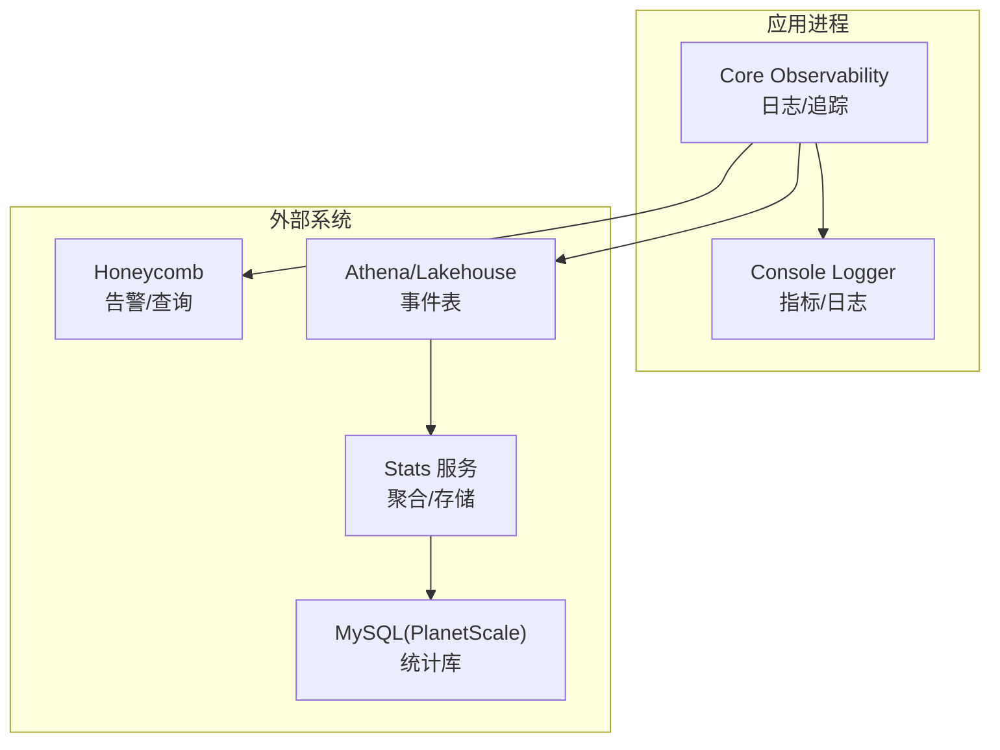
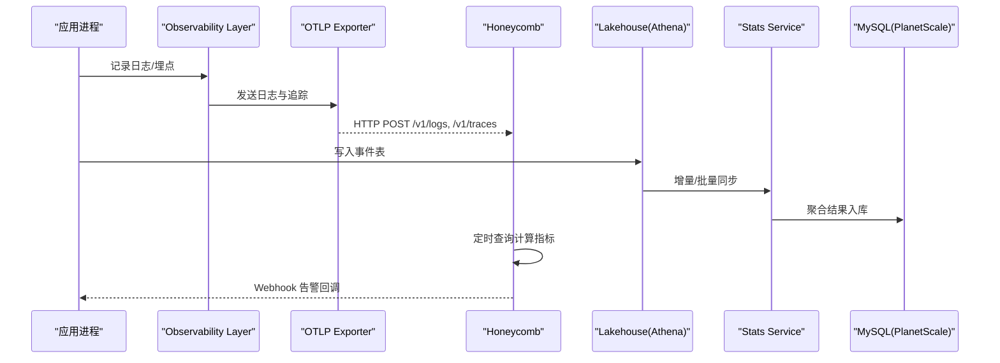
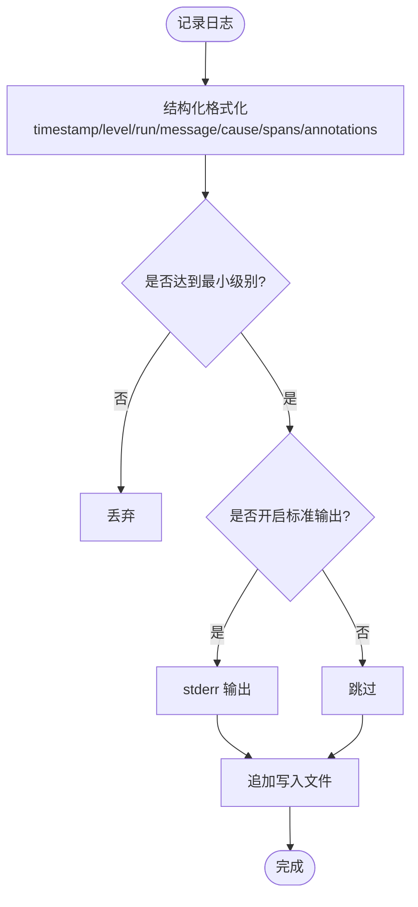
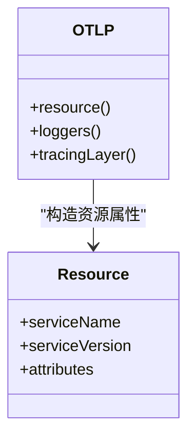
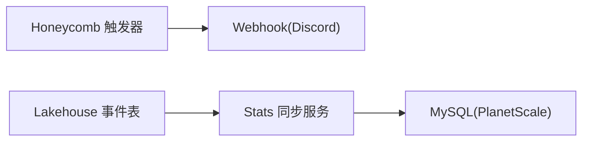
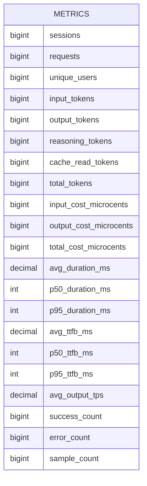
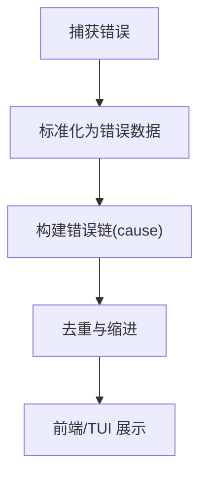
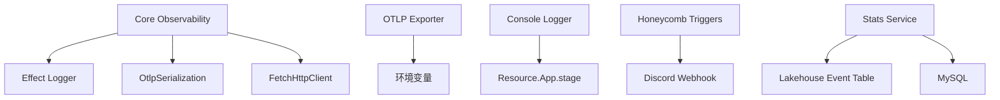

# 监控日志

<cite>
**本文引用的文件**   
- [infra/monitoring.ts](file://infra/monitoring.ts)
- [packages/core/src/observability.ts](file://packages/core/src/observability.ts)
- [packages/core/src/observability/logging.ts](file://packages/core/src/observability/logging.ts)
- [packages/core/src/observability/otlp.ts](file://packages/core/src/observability/otlp.ts)
- [packages/console/app/src/routes/zen/util/logger.ts](file://packages/console/app/src/routes/zen/util/logger.ts)
- [infra/stats.ts](file://infra/stats.ts)
- [packages/stats/core/src/database/schema.ts](file://packages/stats/core/src/database/schema.ts)
- [packages/stats/core/src/domain/inference.ts](file://packages/stats/core/src/domain/inference.ts)
- [packages/stats/core/src/honeycomb-backfill.ts](file://packages/stats/core/src/honeycomb-backfill.ts)
- [packages/app/src/pages/error.tsx](file://packages/app/src/pages/error.tsx)
- [packages/session-ui/src/components/session-turn.tsx](file://packages/session-ui/src/components/session-turn.tsx)
- [packages/tui/test/util/error.test.ts](file://packages/tui/test/util/error.test.ts)
- [packages/opencode/test/server/httpapi-error-middleware.test.ts](file://packages/opencode/test/server/httpapi-error-middleware.test.ts)
</cite>

## 目录
1. [简介](#简介)
2. [项目结构](#项目结构)
3. [核心组件](#核心组件)
4. [架构总览](#架构总览)
5. [详细组件分析](#详细组件分析)
6. [依赖关系分析](#依赖关系分析)
7. [性能考虑](#性能考虑)
8. [故障排查指南](#故障排查指南)
9. [结论](#结论)
10. [附录](#附录)

## 简介
本文件为 openNovel（openNovel）的监控与日志系统文档，覆盖以下方面：
- 应用性能监控配置：关键指标采集、告警规则与仪表板建议
- 结构化日志方案：日志格式、级别分类与输出目标
- 错误追踪集成：异常捕获、堆栈跟踪与错误上报
- 日志收集与分析工具：Honeycomb、Athena/Lakehouse、Stats 服务与数据库
- 性能调优建议与容量规划指导

## 项目结构
监控与日志相关代码主要分布在以下模块：
- 可观测性基础设施（Effect 层）：日志格式化、OTLP 导出、Tracing 初始化
- 控制台侧轻量日志与指标打印
- 基础设施编排：Honeycomb 告警、Lakehouse/Athena 事件表、Stats 服务与数据库
- Stats 数据模型与聚合查询
- 前端与 TUI 的错误展示与解析

图表来源 
- [packages/core/src/observability.ts:1-25](file://packages/core/src/observability.ts#L1-L25)
- [packages/core/src/observability/logging.ts:1-72](file://packages/core/src/observability/logging.ts#L1-L72)
- [packages/core/src/observability/otlp.ts:1-79](file://packages/core/src/observability/otlp.ts#L1-L79)
- [packages/console/app/src/routes/zen/util/logger.ts:1-12](file://packages/console/app/src/routes/zen/util/logger.ts#L1-L12)
- [infra/stats.ts:1-208](file://infra/stats.ts#L1-L208)
- [infra/monitoring.ts:1-288](file://infra/monitoring.ts#L1-L288)

章节来源
- [packages/core/src/observability.ts:1-25](file://packages/core/src/observability.ts#L1-L25)
- [packages/core/src/observability/logging.ts:1-72](file://packages/core/src/observability/logging.ts#L1-L72)
- [packages/core/src/observability/otlp.ts:1-79](file://packages/core/src/observability/otlp.ts#L1-L79)
- [packages/console/app/src/routes/zen/util/logger.ts:1-12](file://packages/console/app/src/routes/zen/util/logger.ts#L1-L12)
- [infra/stats.ts:1-208](file://infra/stats.ts#L1-L208)
- [infra/monitoring.ts:1-288](file://infra/monitoring.ts#L1-L288)

## 核心组件
- 可观测性层（Effect Layer）
  - 统一组装日志与 OTLP 追踪，设置最小日志级别，提供 Node 文件系统支持
- 结构化日志器
  - 将日志扁平化为 key=value 形式，支持 runID、时间戳、级别、消息、cause、spans、annotations
  - 默认写入文件，可选同时输出到 stderr
- OTLP 导出
  - 通过环境变量配置端点与头信息，自动注入资源属性（服务名、版本、环境、实例 ID、运行 ID）
  - 支持日志与链路追踪双通道导出
- 控制台侧指标与日志
  - 提供 metric/log/debug 方法，生产环境抑制 debug
- 基础设施编排
  - Honeycomb 告警触发器（HTTP 错误率、低 TPS、免费额度请求激增等）
  - Lakehouse 事件表（Iceberg Schema）、Athena 权限、Stats 服务与 MySQL 数据库

章节来源
- [packages/core/src/observability.ts:1-25](file://packages/core/src/observability.ts#L1-L25)
- [packages/core/src/observability/logging.ts:1-72](file://packages/core/src/observability/logging.ts#L1-L72)
- [packages/core/src/observability/otlp.ts:1-79](file://packages/core/src/observability/otlp.ts#L1-L79)
- [packages/console/app/src/routes/zen/util/logger.ts:1-12](file://packages/console/app/src/routes/zen/util/logger.ts#L1-L12)
- [infra/monitoring.ts:1-288](file://infra/monitoring.ts#L1-L288)
- [infra/stats.ts:1-208](file://infra/stats.ts#L1-L208)

## 架构总览
整体数据流如下：
- 应用进程通过 Effect 可观测性层输出结构化日志与 OTLP 追踪
- 日志与追踪经 OTLP 协议发送至后端（如 Honeycomb）
- 业务事件写入 Lakehouse 事件表，由 Stats 服务聚合至 MySQL
- Honeycomb 基于查询定义告警规则，并通过 Webhook 推送通知

图表来源 
- [packages/core/src/observability.ts:1-25](file://packages/core/src/observability.ts#L1-L25)
- [packages/core/src/observability/otlp.ts:1-79](file://packages/core/src/observability/otlp.ts#L1-L79)
- [infra/stats.ts:1-208](file://infra/stats.ts#L1-L208)
- [infra/monitoring.ts:1-288](file://infra/monitoring.ts#L1-L288)

## 详细组件分析

### 结构化日志系统
- 日志格式
  - 扁平化 key=value 行，包含 timestamp、level、run、message、cause、spans、annotations
  - 对象字段递归扁平化，循环引用标记为 [Circular]
- 级别控制
  - 通过 OPENCODE_LOG_LEVEL 控制最小级别（DEBUG/INFO/WARN/ERROR），默认 INFO
- 输出目标
  - 默认写入文件（opennovel.log），OPENCODE_PRINT_LOGS=1 时同时输出到 stderr
- 并发安全
  - 文件写入避免 batchWindow=0 导致的高空闲 CPU

图表来源 
- [packages/core/src/observability/logging.ts:1-72](file://packages/core/src/observability/logging.ts#L1-L72)

章节来源
- [packages/core/src/observability/logging.ts:1-72](file://packages/core/src/observability/logging.ts#L1-L72)

### OTLP 追踪与资源属性
- 配置项
  - OTEL_EXPORTER_OTLP_ENDPOINT：OTLP 端点
  - OTEL_EXPORTER_OTLP_HEADERS：自定义头（逗号分隔键值对）
  - OTEL_RESOURCE_ATTRIBUTES：资源属性（key=value，逗号分隔，支持 URL 编码）
- 资源属性
  - 内置 service.name、service.version、deployment.environment.name、opencode.client、opencode.run、service.instance.id
  - 若环境变量存在冲突，内置属性优先
- 导出通道
  - 日志：/v1/logs
  - 追踪：/v1/traces（BatchSpanProcessor + OTLPTraceExporter）

图表来源 
- [packages/core/src/observability/otlp.ts:1-79](file://packages/core/src/observability/otlp.ts#L1-L79)

章节来源
- [packages/core/src/observability/otlp.ts:1-79](file://packages/core/src/observability/otlp.ts#L1-L79)
- [packages/core/test/effect/observability.test.ts:1-72](file://packages/core/test/effect/observability.test.ts#L1-L72)

### 控制台侧指标与日志
- 提供 metric/log/debug 三个方法
- 生产环境禁用 debug 输出
- 指标以 _metric:JSON 前缀输出，便于外部采集或过滤

章节来源
- [packages/console/app/src/routes/zen/util/logger.ts:1-12](file://packages/console/app/src/routes/zen/util/logger.ts#L1-L12)

### 基础设施编排与告警
- Honeycomb 告警
  - 模型 HTTP 错误率（区分 Go/Zen 分层）
  - 模型低 TPS（P50 输出速率）
  - 提供商 HTTP 错误率
  - 免费额度请求量激增（基线对比）
  - 所有触发器均通过 Webhook 推送到 Discord
- Lakehouse 事件表
  - Iceberg Schema 包含请求/响应、延迟、成本、错误、用户/工作区、地理信息等字段
- Stats 服务与数据库
  - 服务部署在容器集群，内存 2GB，单副本
  - 使用 PlanetScale MySQL 作为统计数据库

图表来源 
- [infra/monitoring.ts:1-288](file://infra/monitoring.ts#L1-L288)
- [infra/stats.ts:1-208](file://infra/stats.ts#L1-L208)

章节来源
- [infra/monitoring.ts:1-288](file://infra/monitoring.ts#L1-L288)
- [infra/stats.ts:1-208](file://infra/stats.ts#L1-L208)

### 指标模型与聚合
- 指标列定义（示例）
  - sessions、requests、unique_users、tokens_*、cost_*、duration_ms、ttfb_ms、output_tps、success_count、error_count、sample_count
- 聚合查询
  - 平均/分位数（p50/p95）、成功/错误计数、样本数
- 回填与兼容
  - 兼容历史字段名差异，按优先级映射

图表来源 
- [packages/stats/core/src/database/schema.ts:122-146](file://packages/stats/core/src/database/schema.ts#L122-L146)
- [packages/stats/core/src/domain/inference.ts:39-49](file://packages/stats/core/src/domain/inference.ts#L39-L49)
- [packages/stats/core/src/honeycomb-backfill.ts:474-933](file://packages/stats/core/src/honeycomb-backfill.ts#L474-L933)

章节来源
- [packages/stats/core/src/database/schema.ts:122-146](file://packages/stats/core/src/database/schema.ts#L122-L146)
- [packages/stats/core/src/domain/inference.ts:39-49](file://packages/stats/core/src/domain/inference.ts#L39-L49)
- [packages/stats/core/src/honeycomb-backfill.ts:474-933](file://packages/stats/core/src/honeycomb-backfill.ts#L474-L933)

### 错误追踪与前端展示
- 错误链格式化
  - 支持 Error 实例、对象、字符串、自定义 toString
  - 去重与缩进，显示 cause 链
- 会话 UI 错误解析
  - 从文本中抽取 JSON 错误对象，提取 type/message/code
- TUI 错误测试
  - 验证 native Error、record-like、不透明对象、自定义 toString 的处理

图表来源 
- [packages/app/src/pages/error.tsx:167-220](file://packages/app/src/pages/error.tsx#L167-L220)
- [packages/session-ui/src/components/session-turn.tsx:29-80](file://packages/session-ui/src/components/session-turn.tsx#L29-L80)
- [packages/tui/test/util/error.test.ts:1-49](file://packages/tui/test/util/error.test.ts#L1-L49)

章节来源
- [packages/app/src/pages/error.tsx:167-220](file://packages/app/src/pages/error.tsx#L167-L220)
- [packages/session-ui/src/components/session-turn.tsx:29-80](file://packages/session-ui/src/components/session-turn.tsx#L29-L80)
- [packages/tui/test/util/error.test.ts:1-49](file://packages/tui/test/util/error.test.ts#L1-L49)

### HTTP API 错误中间件（服务端）
- 未知错误返回安全体，不包含敏感堆栈标记
- 命名缺陷（NamedError）返回结构化客户端错误
- 配置错误返回无效配置的详细信息

章节来源
- [packages/opencode/test/server/httpapi-error-middleware.test.ts:30-67](file://packages/opencode/test/server/httpapi-error-middleware.test.ts#L30-L67)

## 依赖关系分析
- 可观测性层依赖 Effect 的 Logger、OtlpSerialization、FetchHttpClient
- OTLP 导出依赖环境变量与安装版本信息
- 控制台 logger 依赖 Resource.App.stage 控制输出行为
- Honeycomb 触发器依赖域名与密钥，通过 Webhook 回调
- Stats 服务依赖 Lakehouse 事件表与 MySQL 数据库

图表来源 
- [packages/core/src/observability.ts:1-25](file://packages/core/src/observability.ts#L1-L25)
- [packages/core/src/observability/otlp.ts:1-79](file://packages/core/src/observability/otlp.ts#L1-L79)
- [packages/console/app/src/routes/zen/util/logger.ts:1-12](file://packages/console/app/src/routes/zen/util/logger.ts#L1-L12)
- [infra/monitoring.ts:1-288](file://infra/monitoring.ts#L1-L288)
- [infra/stats.ts:1-208](file://infra/stats.ts#L1-L208)

章节来源
- [packages/core/src/observability.ts:1-25](file://packages/core/src/observability.ts#L1-L25)
- [packages/core/src/observability/otlp.ts:1-79](file://packages/core/src/observability/otlp.ts#L1-L79)
- [packages/console/app/src/routes/zen/util/logger.ts:1-12](file://packages/console/app/src/routes/zen/util/logger.ts#L1-L12)
- [infra/monitoring.ts:1-288](file://infra/monitoring.ts#L1-L288)
- [infra/stats.ts:1-208](file://infra/stats.ts#L1-L208)

## 性能考虑
- 日志写入
  - 避免 batchWindow=0，防止高空闲 CPU；默认采用异步追加写文件
- 追踪导出
  - 使用 BatchSpanProcessor 降低网络开销
- 告警查询
  - 合理设置 timeRange 与频率，避免频繁全量扫描
- Stats 服务
  - 内存至少 2GB，避免 OOM 导致的重复查询与费用飙升
- 指标粒度
  - 使用 p50/p95 分位数与平均指标平衡精度与成本

[本节为通用指导，无需特定文件引用]

## 故障排查指南
- 日志未输出
  - 检查 OPENCODE_LOG_LEVEL 与 OPENCODE_PRINT_LOGS
  - 确认文件路径与写入权限
- 追踪未上报
  - 校验 OTEL_EXPORTER_OTLP_ENDPOINT 与 OTEL_EXPORTER_OTLP_HEADERS
  - 检查 OTEL_RESOURCE_ATTRIBUTES 格式与冲突处理
- 告警不触发
  - 核对 Honeycomb 触发器的查询条件与阈值
  - 确认 Webhook 地址与密钥有效
- 错误展示异常
  - 检查错误链格式化逻辑与 JSON 解析
  - 确认前端/TUI 的 unwrap 与 errorFormat 实现

章节来源
- [packages/core/src/observability/logging.ts:1-72](file://packages/core/src/observability/logging.ts#L1-L72)
- [packages/core/src/observability/otlp.ts:1-79](file://packages/core/src/observability/otlp.ts#L1-L79)
- [infra/monitoring.ts:1-288](file://infra/monitoring.ts#L1-L288)
- [packages/app/src/pages/error.tsx:167-220](file://packages/app/src/pages/error.tsx#L167-L220)
- [packages/session-ui/src/components/session-turn.tsx:29-80](file://packages/session-ui/src/components/session-turn.tsx#L29-L80)

## 结论
openNovel 的可观测性与日志体系以 Effect 为核心，结合 OTLP 与结构化日志，形成统一的日志与追踪能力。通过 Honeycomb 告警与 Lakehouse/Stats 管道，实现了从原始事件到聚合指标的完整链路。建议在部署与运维中关注日志级别、OTLP 配置、告警阈值与服务容量，确保稳定性与成本可控。

[本节为总结，无需特定文件引用]

## 附录
- 关键环境变量
  - OPENCODE_LOG_LEVEL：日志最小级别（DEBUG/INFO/WARN/ERROR）
  - OPENCODE_PRINT_LOGS：是否同时输出到 stderr
  - OTEL_EXPORTER_OTLP_ENDPOINT：OTLP 端点
  - OTEL_EXPORTER_OTLP_HEADERS：OTLP 头（逗号分隔键值对）
  - OTEL_RESOURCE_ATTRIBUTES：资源属性（key=value，逗号分隔）
  - OPENCODE_CLIENT：客户端标识（用于资源属性）
- 指标与告警建议
  - 错误率阈值：≥0.7（样本量足够时）
  - TPS 低水位：≤10（P50 输出速率）
  - 免费额度请求激增：基线对比（1440 分钟偏移）

[本节为补充信息，无需特定文件引用]