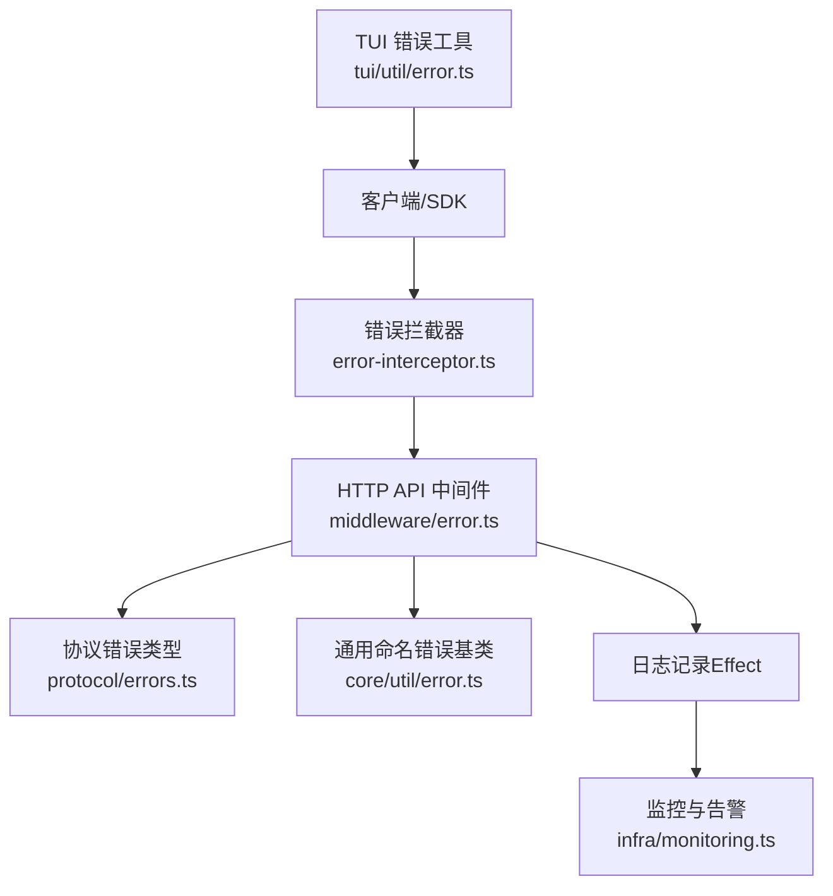
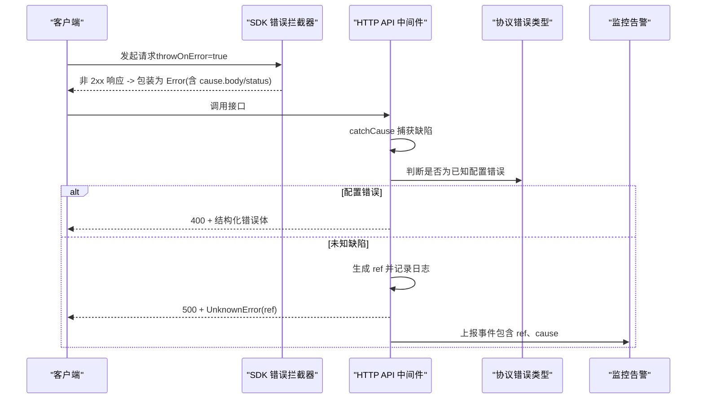
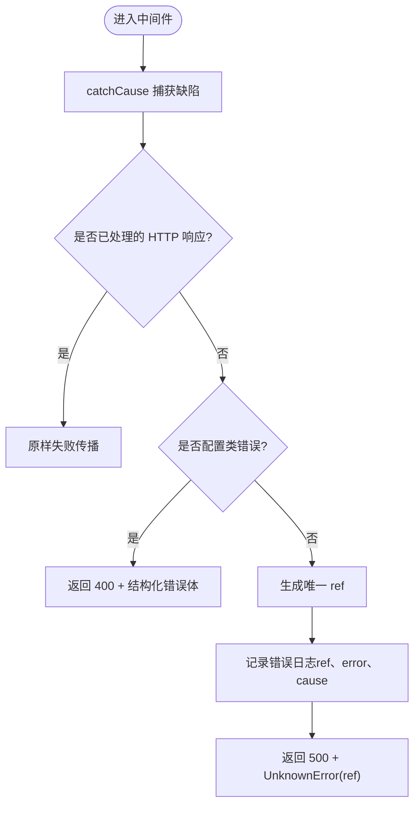
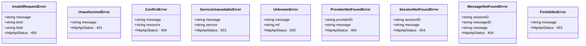
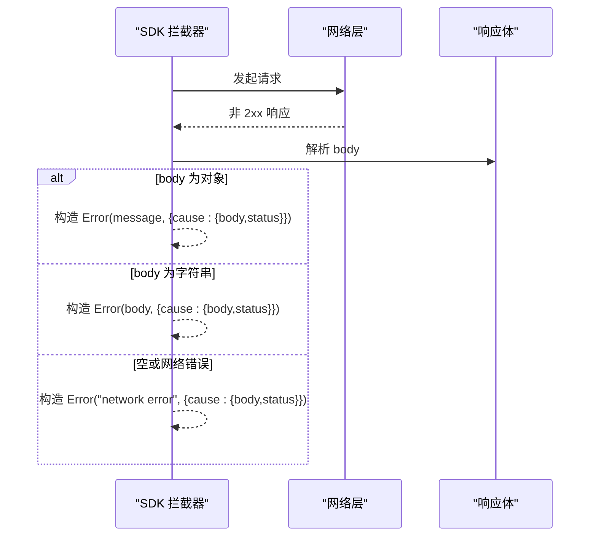
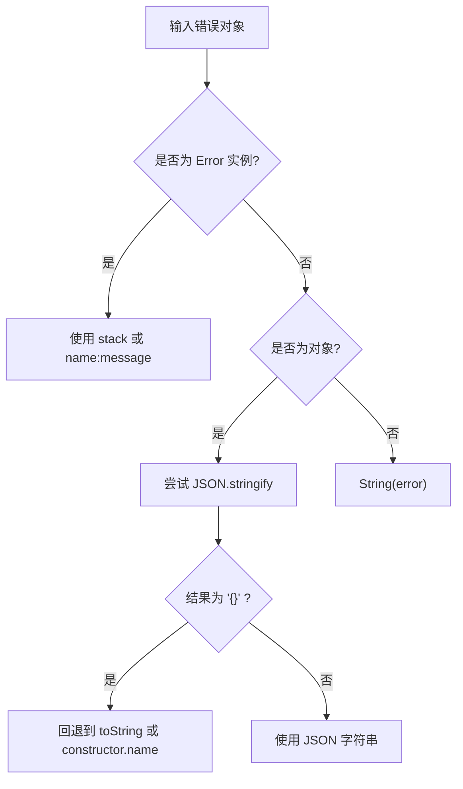
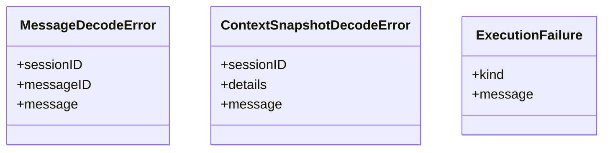
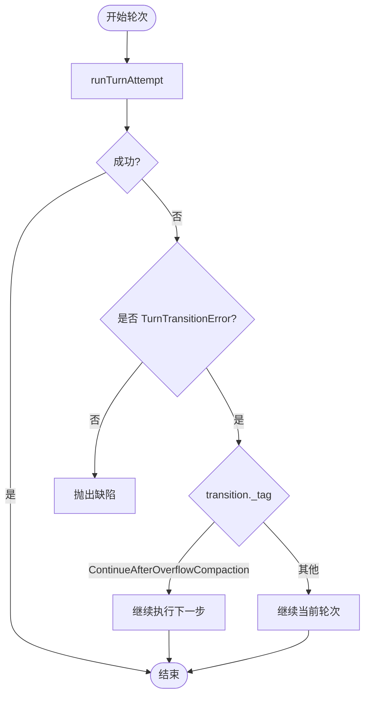
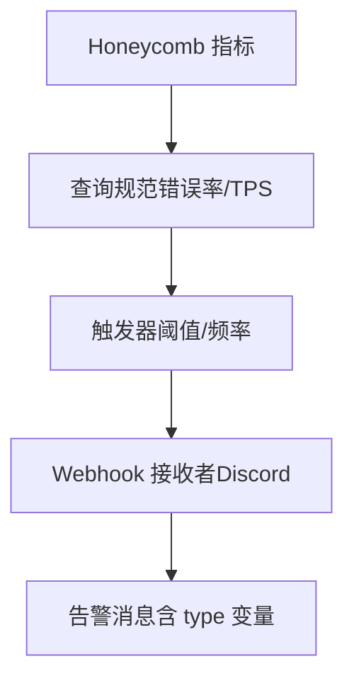
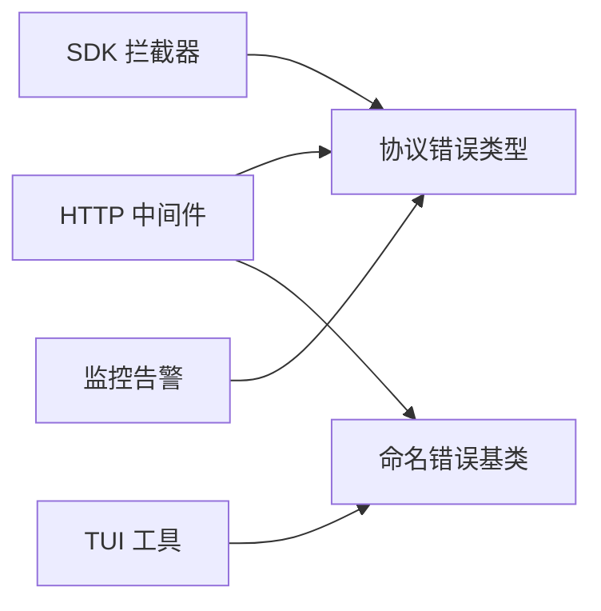

# 错误追踪

<cite>
**本文引用的文件**
- [packages/opencode/src/server/routes/instance/httpapi/middleware/error.ts](file://packages/opencode/src/server/routes/instance/httpapi/middleware/error.ts)
- [packages/core/src/util/error.ts](file://packages/core/src/util/error.ts)
- [packages/protocol/src/errors.ts](file://packages/protocol/src/errors.ts)
- [packages/sdk/js/src/error-interceptor.ts](file://packages/sdk/js/src/error-interceptor.ts)
- [packages/tui/src/util/error.ts](file://packages/tui/src/util/error.ts)
- [infra/monitoring.ts](file://infra/monitoring.ts)
- [packages/core/src/session/error.ts](file://packages/core/src/session/error.ts)
- [packages/core/src/session/runner/llm.ts](file://packages/core/src/session/runner/llm.ts)
- [packages/codemode/src/interpreter/runtime.ts](file://packages/codemode/src/interpreter/runtime.ts)
- [packages/opencode/test/server/httpapi-error-middleware.test.ts](file://packages/opencode/test/server/httpapi-error-middleware.test.ts)
</cite>

## 目录
1. [简介](#简介)
2. [项目结构](#项目结构)
3. [核心组件](#核心组件)
4. [架构总览](#架构总览)
5. [详细组件分析](#详细组件分析)
6. [依赖关系分析](#依赖关系分析)
7. [性能考量](#性能考量)
8. [故障排查指南](#故障排查指南)
9. [结论](#结论)
10. [附录](#附录)

## 简介
本文件为 openNovel 的错误追踪系统提供系统化文档，覆盖以下关键主题：
- 异常捕获机制：全局错误处理器、异步错误处理与未捕获异常保护
- 堆栈跟踪的生成与分析：源码映射与调试信息配置建议
- 错误上报流程：错误分类、去重与聚合策略
- 告警规则配置：阈值设置、通知渠道与升级机制
- 错误恢复与降级：重试策略、回退路径与限流熔断
- 常见错误排查与解决方法

## 项目结构
错误追踪相关代码分布在服务端中间件、协议层错误类型、客户端拦截器、TUI 展示工具以及监控告警基础设施中。整体组织方式遵循“分层职责清晰”的设计：
- 服务端 HTTP 中间件负责兜底捕获与统一响应
- 协议层定义结构化错误类型与 HTTP 状态码映射
- SDK 客户端拦截器将非 2xx 响应包装为标准 Error，便于上层格式化
- TUI 工具提供错误消息格式化与数据提取能力
- 监控告警通过 Honeycomb 触发器实现阈值告警与 Webhook 通知



**图表来源**
- [packages/opencode/src/server/routes/instance/httpapi/middleware/error.ts:1-44](file://packages/opencode/src/server/routes/instance/httpapi/middleware/error.ts#L1-L44)
- [packages/protocol/src/errors.ts:1-112](file://packages/protocol/src/errors.ts#L1-L112)
- [packages/core/src/util/error.ts:1-71](file://packages/core/src/util/error.ts#L1-L71)
- [packages/sdk/js/src/error-interceptor.ts:1-52](file://packages/sdk/js/src/error-interceptor.ts#L1-L52)
- [packages/tui/src/util/error.ts:1-183](file://packages/tui/src/util/error.ts#L1-L183)
- [infra/monitoring.ts:1-288](file://infra/monitoring.ts#L1-L288)

**章节来源**
- [packages/opencode/src/server/routes/instance/httpapi/middleware/error.ts:1-44](file://packages/opencode/src/server/routes/instance/httpapi/middleware/error.ts#L1-L44)
- [packages/protocol/src/errors.ts:1-112](file://packages/protocol/src/errors.ts#L1-L112)
- [packages/core/src/util/error.ts:1-71](file://packages/core/src/util/error.ts#L1-L71)
- [packages/sdk/js/src/error-interceptor.ts:1-52](file://packages/sdk/js/src/error-interceptor.ts#L1-L52)
- [packages/tui/src/util/error.ts:1-183](file://packages/tui/src/util/error.ts#L1-L183)
- [infra/monitoring.ts:1-288](file://infra/monitoring.ts#L1-L288)

## 核心组件
- 全局错误处理器（HTTP 中间件）
  - 使用 Effect 的 catchCause 捕获缺陷（defect），过滤已处理的 HTTP 响应对象后，对未知缺陷生成唯一 ref 并记录日志，返回标准 500 响应体。
  - 针对特定配置错误（JSON/Invalid/Frontmatter/DirectoryTypo）直接返回 400 响应，避免误报 500。
- 协议层错误类型
  - 基于 Schema.TaggedErrorClass 定义结构化错误，附带 httpApiStatus 元数据，便于统一序列化与状态码映射。
- 命名错误基类
  - NamedError 提供统一的 name/data 结构与 toObject() 序列化方法，支持 Unknown 默认类型。
- 客户端错误拦截器
  - 将非 2xx 响应体包装为 Error，保留原始 body 与 status 于 cause，保证上层格式化与字段读取兼容。
- TUI 错误工具
  - 提供 errorMessage、errorFormat、errorData 等函数，适配多种错误形态，确保可读性与稳定性。
- 会话与运行时错误
  - 会话解码错误、上下文快照解码错误等专用错误类型；运行时执行失败统一封装为 ExecutionFailure。
- 监控与告警
  - 基于 Honeycomb 触发器，按模型/提供商维度统计错误率与 TPS，阈值触发后通过 Webhook 推送至 Discord。

**章节来源**
- [packages/opencode/src/server/routes/instance/httpapi/middleware/error.ts:1-44](file://packages/opencode/src/server/routes/instance/httpapi/middleware/error.ts#L1-L44)
- [packages/protocol/src/errors.ts:1-112](file://packages/protocol/src/errors.ts#L1-L112)
- [packages/core/src/util/error.ts:1-71](file://packages/core/src/util/error.ts#L1-L71)
- [packages/sdk/js/src/error-interceptor.ts:1-52](file://packages/sdk/js/src/error-interceptor.ts#L1-L52)
- [packages/tui/src/util/error.ts:1-183](file://packages/tui/src/util/error.ts#L1-L183)
- [packages/core/src/session/error.ts:1-25](file://packages/core/src/session/error.ts#L1-L25)
- [packages/codemode/src/interpreter/runtime.ts:214-242](file://packages/codemode/src/interpreter/runtime.ts#L214-L242)
- [infra/monitoring.ts:1-288](file://infra/monitoring.ts#L1-L288)

## 架构总览
下图展示了从客户端到服务端的错误处理链路，包括拦截、分类、响应与告警。



**图表来源**
- [packages/sdk/js/src/error-interceptor.ts:1-52](file://packages/sdk/js/src/error-interceptor.ts#L1-L52)
- [packages/opencode/src/server/routes/instance/httpapi/middleware/error.ts:1-44](file://packages/opencode/src/server/routes/instance/httpapi/middleware/error.ts#L1-L44)
- [packages/protocol/src/errors.ts:1-112](file://packages/protocol/src/errors.ts#L1-L112)
- [infra/monitoring.ts:1-288](file://infra/monitoring.ts#L1-L288)

## 详细组件分析

### 全局错误处理器（HTTP 中间件）
- 职责
  - 捕获 Effect 缺陷（defect），过滤已处理的 HTTP 响应对象，避免重复包装。
  - 识别配置类错误，直接返回 400 与结构化错误体。
  - 对未知缺陷生成唯一 ref，记录完整日志，返回 500 与 UnknownError。
- 关键点
  - 使用 Cause.pretty 输出可阅读的堆栈与原因链。
  - 保持 NamedError.Unknown 的 data.message 与 ref 字段，便于前端定位。
- 测试验证
  - 配置错误应返回 400 且包含 path/issues 等信息。
  - 存储未找到缺陷不应映射为 404，仍返回 500 与 UnknownError。



**图表来源**
- [packages/opencode/src/server/routes/instance/httpapi/middleware/error.ts:1-44](file://packages/opencode/src/server/routes/instance/httpapi/middleware/error.ts#L1-L44)

**章节来源**
- [packages/opencode/src/server/routes/instance/httpapi/middleware/error.ts:1-44](file://packages/opencode/src/server/routes/instance/httpapi/middleware/error.ts#L1-L44)
- [packages/opencode/test/server/httpapi-error-middleware.test.ts:69-101](file://packages/opencode/test/server/httpapi-error-middleware.test.ts#L69-L101)

### 协议层错误类型与状态码映射
- 设计模式
  - 使用 Schema.TaggedErrorClass 定义错误类型，附带 httpApiStatus 元数据。
  - 统一序列化 name/data 结构，便于跨语言与前后端一致解析。
- 典型错误
  - InvalidRequestError(400)、UnauthorizedError(401)、ConflictError(409)、ServiceUnavailableError(503)、UnknownError(500)、ProviderNotFoundError(404)、SessionNotFoundError(404)、MessageNotFoundError(404)、ForbiddenError(403) 等。
- 优势
  - 明确的状态码映射减少歧义。
  - 结构化数据便于聚合与告警规则匹配。



**图表来源**
- [packages/protocol/src/errors.ts:1-112](file://packages/protocol/src/errors.ts#L1-L112)

**章节来源**
- [packages/protocol/src/errors.ts:1-112](file://packages/protocol/src/errors.ts#L1-L112)

### 命名错误基类（NamedError）
- 功能
  - 提供统一的 name/data 结构与 toObject() 序列化。
  - 内置 Unknown 类型，用于兜底未知错误。
- 扩展性
  - 通过 create(name, schema) 动态生成错误类，支持强类型校验与标识符注解。

```mermaid
classDiagram
class NamedError {
+schema() Top
+toObject() {name : string; data : unknown}
+hasName(error,name) bool
+create(name, fieldsOrSchema) Class
+Unknown
}
```

**图表来源**
- [packages/core/src/util/error.ts:1-71](file://packages/core/src/util/error.ts#L1-L71)

**章节来源**
- [packages/core/src/util/error.ts:1-71](file://packages/core/src/util/error.ts#L1-L71)

### 客户端错误拦截器（SDK）
- 行为
  - 当 throwOnError=true 时，将非 2xx 响应体包装为 Error，message 优先取自 data.message/message/name，否则描述请求与响应。
  - 原始 body 与 status 保存在 cause 中，保证向后兼容。
- 适用场景
  - 上游格式化器（TUI、插件）可直接读取 .message，同时保留结构化字段供高级调用方使用。



**图表来源**
- [packages/sdk/js/src/error-interceptor.ts:1-52](file://packages/sdk/js/src/error-interceptor.ts#L1-L52)

**章节来源**
- [packages/sdk/js/src/error-interceptor.ts:1-52](file://packages/sdk/js/src/error-interceptor.ts#L1-L52)

### TUI 错误工具（格式化与数据提取）
- 能力
  - cliErrorMessage：针对不同错误标签（CliError、AccountServiceError、ConfigJsonError、ConfigInvalidError 等）生成用户友好的提示。
  - errorFormat：安全地将任意错误序列化为可读字符串，避免 "{}" 无意义输出。
  - errorMessage：提取最贴近用户的消息文本。
  - errorData：标准化错误数据结构（type、message、stack、cause、formatted）。
- 健壮性
  - 对不可序列化对象、循环引用、极深嵌套进行降级处理，确保不崩溃。



**图表来源**
- [packages/tui/src/util/error.ts:1-183](file://packages/tui/src/util/error.ts#L1-L183)

**章节来源**
- [packages/tui/src/util/error.ts:1-183](file://packages/tui/src/util/error.ts#L1-L183)

### 会话与运行时错误
- 会话错误
  - MessageDecodeError、ContextSnapshotDecodeError 用于数据库解码失败场景，携带 sessionID 与 messageID 以便定位。
- 运行时错误
  - CodeMode 解释器将宿主工具抛出的非 Error 值统一封装为 ExecutionFailure，确保路径脱敏与消息规范化。



**图表来源**
- [packages/core/src/session/error.ts:1-25](file://packages/core/src/session/error.ts#L1-L25)
- [packages/codemode/src/interpreter/runtime.ts:214-242](file://packages/codemode/src/interpreter/runtime.ts#L214-L242)

**章节来源**
- [packages/core/src/session/error.ts:1-25](file://packages/core/src/session/error.ts#L1-L25)
- [packages/codemode/src/interpreter/runtime.ts:214-242](file://packages/codemode/src/interpreter/runtime.ts#L214-L242)

### 错误恢复与重试策略
- 会话重试
  - 通过 Schedule.toStepWithMetadata 与 SessionRetry.policy 实现指数退避与条件重试。
  - 对 too_many_requests、resource_exhausted 等可重试错误进行映射与提示。
- 溢出压缩后的继续执行
  - runTurnAttempt 捕获 TurnTransitionError，根据 transition._tag 决定继续执行或再次尝试。



**图表来源**
- [packages/core/src/session/runner/llm.ts:355-381](file://packages/core/src/session/runner/llm.ts#L355-L381)
- [packages/opencode/test/session/retry.test.ts:95-134](file://packages/opencode/test/session/retry.test.ts#L95-L134)

**章节来源**
- [packages/core/src/session/runner/llm.ts:355-381](file://packages/core/src/session/runner/llm.ts#L355-L381)
- [packages/opencode/test/session/retry.test.ts:95-134](file://packages/opencode/test/session/retry.test.ts#L95-L134)

### 监控与告警规则
- 指标与查询
  - 模型 HTTP 错误率：按 model 分组，计算失败状态占比，排除 401 与限额错误。
  - 提供商 HTTP 错误率：按 provider 分组，统计 llm.error.code > 400 的事件。
  - 低 TPS：按 model 分组，P50 TPS 低于阈值触发。
- 触发器与通知
  - 使用 honeycombio.Trigger 定义阈值与频率，通过 WebhookRecipient 推送至 Discord。
  - 变量 type 区分告警类别（model_http_errors、provider_http_errors、model_low_tps、custom）。



**图表来源**
- [infra/monitoring.ts:1-288](file://infra/monitoring.ts#L1-L288)

**章节来源**
- [infra/monitoring.ts:1-288](file://infra/monitoring.ts#L1-L288)

## 依赖关系分析
- 中间件依赖协议错误类型与命名错误基类，确保响应体一致性。
- SDK 拦截器依赖结构化响应体格式（data.message/message/name），与协议层保持一致。
- TUI 工具依赖通用错误数据结构，提升跨模块兼容性。
- 监控告警依赖统一的事件字段（event_type、user_agent、status、llm.error.code 等）。



**图表来源**
- [packages/opencode/src/server/routes/instance/httpapi/middleware/error.ts:1-44](file://packages/opencode/src/server/routes/instance/httpapi/middleware/error.ts#L1-L44)
- [packages/protocol/src/errors.ts:1-112](file://packages/protocol/src/errors.ts#L1-L112)
- [packages/core/src/util/error.ts:1-71](file://packages/core/src/util/error.ts#L1-L71)
- [packages/sdk/js/src/error-interceptor.ts:1-52](file://packages/sdk/js/src/error-interceptor.ts#L1-L52)
- [packages/tui/src/util/error.ts:1-183](file://packages/tui/src/util/error.ts#L1-L183)
- [infra/monitoring.ts:1-288](file://infra/monitoring.ts#L1-L288)

**章节来源**
- [packages/opencode/src/server/routes/instance/httpapi/middleware/error.ts:1-44](file://packages/opencode/src/server/routes/instance/httpapi/middleware/error.ts#L1-L44)
- [packages/protocol/src/errors.ts:1-112](file://packages/protocol/src/errors.ts#L1-L112)
- [packages/core/src/util/error.ts:1-71](file://packages/core/src/util/error.ts#L1-L71)
- [packages/sdk/js/src/error-interceptor.ts:1-52](file://packages/sdk/js/src/error-interceptor.ts#L1-L52)
- [packages/tui/src/util/error.ts:1-183](file://packages/tui/src/util/error.ts#L1-L183)
- [infra/monitoring.ts:1-288](file://infra/monitoring.ts#L1-L288)

## 性能考量
- 日志记录开销
  - 中间件在未知缺陷路径上记录完整 cause 与 ref，需评估高频错误下的 I/O 压力。
- 错误序列化
  - TUI 工具对复杂对象进行深度格式化，可能带来 CPU 开销，建议在批量上报前进行采样或限制深度。
- 监控查询
  - Honeycomb 查询使用计算字段与时间窗口，需关注聚合成本与延迟，合理调整 timeRange 与 breakdowns。

[本节为通用指导，无需具体文件引用]

## 故障排查指南
- 常见问题与定位
  - 配置错误：检查 opennovel.json 的 JSON(C) 语法与目录拼写，确认 provider/model 名称正确。
  - 网络错误：查看 SDK 拦截器生成的 message 与 cause.status，确认请求方法与 URL。
  - 会话解码失败：核对 sessionID 与 messageID，检查数据版本兼容性。
- 调试建议
  - 启用 Effect 日志级别为 debug，观察 Cause.pretty 输出。
  - 使用 TUI 的 errorData 提取结构化信息，便于搜索与聚合。
- 恢复策略
  - 对可重试错误（too_many_requests、resource_exhausted）启用指数退避。
  - 对超时或连接失败实施熔断与降级（返回缓存或友好提示）。

**章节来源**
- [packages/tui/src/util/error.ts:1-183](file://packages/tui/src/util/error.ts#L1-L183)
- [packages/sdk/js/src/error-interceptor.ts:1-52](file://packages/sdk/js/src/error-interceptor.ts#L1-L52)
- [packages/core/src/session/error.ts:1-25](file://packages/core/src/session/error.ts#L1-L25)
- [packages/opencode/test/session/retry.test.ts:95-134](file://packages/opencode/test/session/retry.test.ts#L95-L134)

## 结论
openNovel 的错误追踪体系以结构化错误类型为核心，结合中间件兜底、客户端拦截与 TUI 格式化，形成端到端的可观测性闭环。通过 Honeycomb 告警规则实现阈值驱动的通知与升级，配合重试与降级策略保障系统韧性。建议在生产环境持续优化日志采样与监控查询性能，确保在高负载下仍可快速定位与恢复。

[本节为总结性内容，无需具体文件引用]

## 附录
- 源码映射与调试信息配置建议
  - 构建产物启用 source map，便于浏览器与 IDE 定位源码位置。
  - 在 Effect 日志中保留完整的 cause 链，避免丢失底层原因。
  - 对敏感路径进行脱敏，防止泄露文件系统或密钥信息。

[本节为概念性内容，无需具体文件引用]